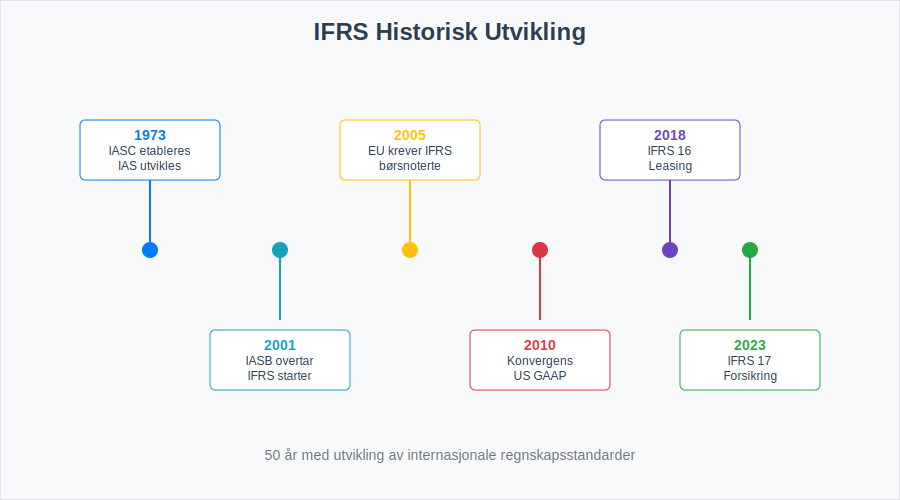
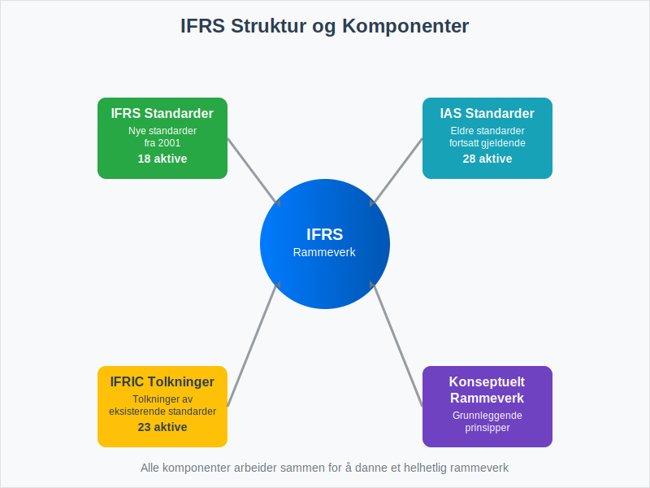
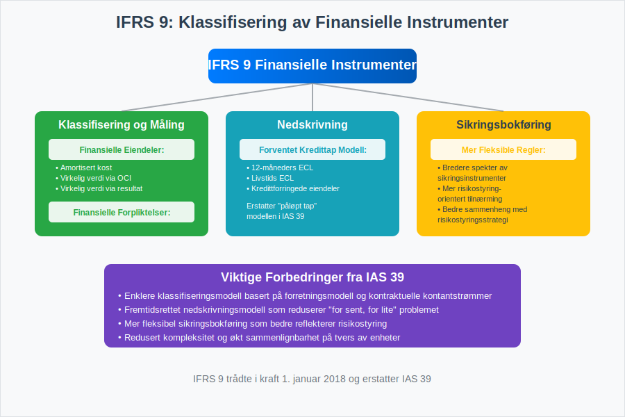
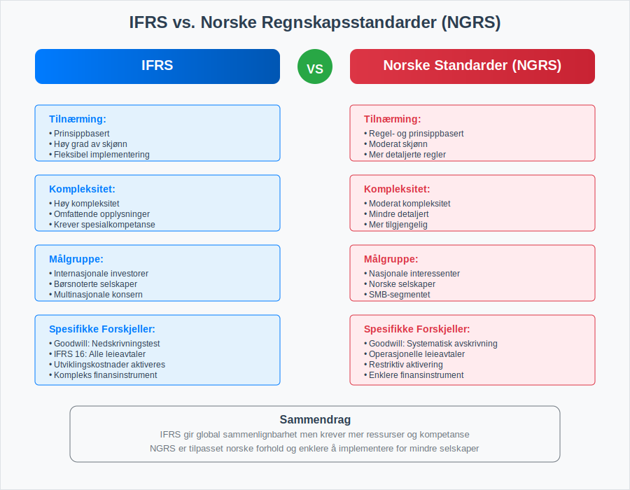
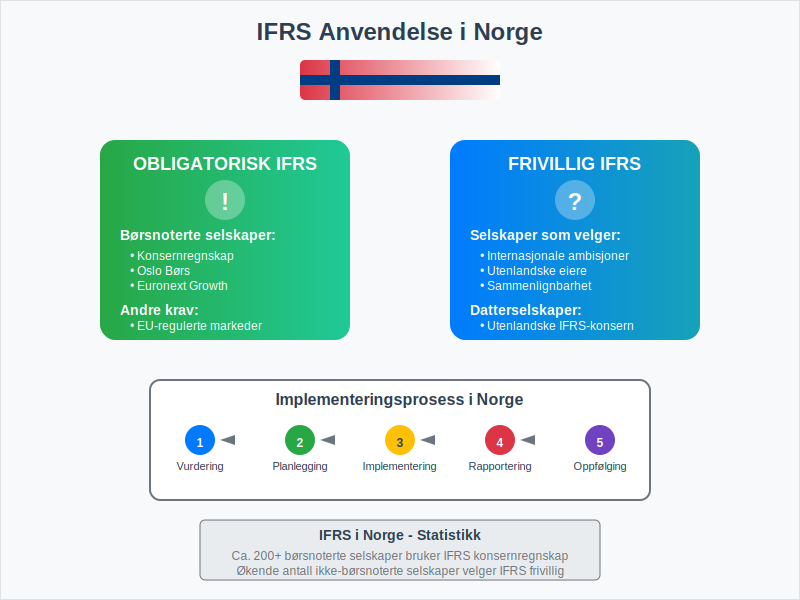
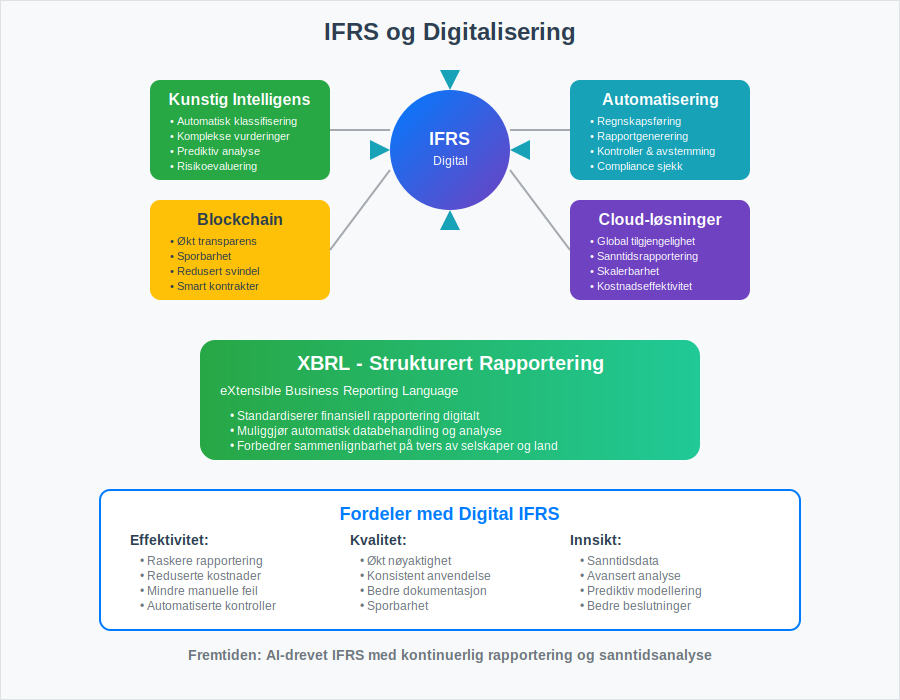

---
title: "Hva er IFRS?"
meta_title: "Hva er IFRS?"
meta_description: '**IFRS** (International Financial Reporting Standards) er et sett med globale regnskapsstandarder utviklet av International Accounting Standards Board (IASB) fo...'
slug: hva-er-ifrs
type: blog
layout: pages/single
---

**IFRS** (International Financial Reporting Standards) er et sett med globale regnskapsstandarder utviklet av International Accounting Standards Board (IASB) for å sikre konsistent, transparent og sammenlignbar finansiell rapportering på tvers av land og bransjer. Disse standardene brukes i dag av over 140 land og representerer det mest omfattende rammeverket for internasjonal finansiell rapportering.

IFRS bygger på prinsippbaserte standarder som gir fleksibilitet i implementering, men krever samtidig profesjonell dømmekraft og grundig forståelse av de underliggende prinsippene. For norske selskaper som opererer internasjonalt eller er notert på børs, er forståelse av IFRS avgjørende for å sikre [god regnskapsskikk](/blogs/regnskap/god-regnskapsskikk "God Regnskapsskikk - Prinsipper, Standarder og Beste Praksis i Norge") og overholdelse av internasjonale krav.

## Historisk Utvikling og Bakgrunn

IFRS har sin opprinnelse i International Accounting Standards (IAS), som ble utviklet fra 1973 av International Accounting Standards Committee (IASC). I 2001 overtok IASB ansvaret og begynte å utvikle IFRS som en modernisert versjon av de eksisterende standardene.

### Viktige Milepæler i IFRS-utviklingen

* **1973**: IASC etableres og begynner arbeidet med IAS
* **2001**: IASB overtar og starter utviklingen av IFRS
* **2005**: EU krever IFRS for børsnoterte selskaper
* **2010**: Konvergens med US GAAP intensiveres
* **2018**: IFRS 16 (Leasing) trer i kraft
* **2023**: IFRS 17 (Forsikringskontrakter) implementeres

## IFRS' Struktur og Komponenter

IFRS består av flere komponenter som sammen danner et helhetlig rammeverk for finansiell rapportering:

### Hovedkomponenter

| Komponent | Beskrivelse | Antall Standarder |
|-----------|-------------|-------------------|
| **IFRS Standarder** | Nye standarder utgitt av IASB fra 2001 | 18 aktive standarder |
| **IAS Standarder** | Eldre standarder som fortsatt gjelder | 28 aktive standarder |
| **IFRIC Tolkninger** | Tolkninger av eksisterende standarder | 23 aktive tolkninger |
| **Konseptuelt Rammeverk** | Grunnleggende prinsipper og konsepter | 1 rammeverk |

### Det Konseptuelle Rammeverket

Det konseptuelle rammeverket danner grunnlaget for alle IFRS-standarder og definerer:

* **Formålet** med finansiell rapportering
* **Kvalitative karakteristika** ved nyttig finansiell informasjon
* **Definisjon og anerkjennelse** av regnskapselementer
* **MÃ¥ling** av regnskapselementer
* **Presentasjon og opplysninger**

## Sentrale IFRS-Standarder

### IFRS 1: Første gangs anvendelse av IFRS

Denne standarden gir veiledning for selskaper som går over fra nasjonale regnskapsstandarder til IFRS for første gang. Den sikrer at overgangen skjer på en konsistent og sammenlignbar måte.

### IFRS 9: Finansielle Instrumenter

IFRS 9 erstatter IAS 39 og dekker:

* **Klassifisering og måling** av finansielle eiendeler og forpliktelser
* **Nedskrivningsmodell** basert på forventet kredittap
* **Sikringsbokføring** med mer fleksible regler

### IFRS 15: Inntekt fra Kontrakter med Kunder

Denne standarden etablerer en femtrinns modell for inntektsføring:

1. **Identifiser kontrakten** med kunden
2. **Identifiser ytelsesforpliktelsene** i kontrakten
3. **Bestem transaksjonsbeløpet**
4. **Allokér transaksjonsbeløpet** til ytelsesforpliktelsene
5. **Innregn inntekt** når ytelsesforpliktelsen oppfylles

### IFRS 16: Leieavtaler

IFRS 16 endret fundamentalt regnskapsføringen av leieavtaler ved å kreve at alle vesentlige leieavtaler føres i [balansen](/blogs/regnskap/hva-er-balanse "Hva er Balanse i Regnskap? Komplett Guide til Balansens Oppbygging og Funksjon").

## IFRS vs. Nasjonale Standarder

### Sammenligning med [Norske Regnskapsstandarder](/blogs/regnskap/norsk-regnskapsstandard-nrs "Norsk regnskapsstandard (NRS) - Komplett Guide til Norske Regnskapsstandarder")

| Aspekt | IFRS | [Norske Standarder (NRS)](/blogs/regnskap/norsk-regnskapsstandard-nrs "Norsk regnskapsstandard (NRS) - Komplett Guide til Norske Regnskapsstandarder") |
|--------|------|--------------------------|
| **Tilnærming** | Prinsippbasert | Regel- og prinsippbasert |
| **Kompleksitet** | Høy | Moderat |
| **Fleksibilitet** | Høy | Moderat |
| **Detaljnivå** | Omfattende opplysninger | Mindre detaljert |
| **MÃ¥lgruppe** | Internasjonale investorer | Nasjonale interessenter |

### Hovedforskjeller i Praksis

* **Goodwill**: IFRS krever årlig nedskrivningstest, mens [norske standarder](/blogs/regnskap/norsk-regnskapsstandard-nrs "Norsk regnskapsstandard (NRS) - Komplett Guide til Norske Regnskapsstandarder") tillater systematisk avskrivning
* **Utviklingskostnader**: IFRS tillater aktivering under visse betingelser, [norske standarder](/blogs/regnskap/norsk-regnskapsstandard-nrs "Norsk regnskapsstandard (NRS) - Komplett Guide til Norske Regnskapsstandarder") er mer restriktive
* **Leieavtaler**: IFRS 16 krever balanseføring av alle vesentlige leieavtaler
* **Finansielle instrumenter**: IFRS har mer komplekse regler for klassifisering og måling

## Implementering av IFRS i Norge

IFRS er en sentral del av det **[norske regnskapsstandardsystemet](/blogs/regnskap/norsk-regnskapsstandard-nrs "Norsk regnskapsstandard (NRS) - Komplett Guide til Norske Regnskapsstandarder")**, som kombinerer internasjonale standarder med nasjonale tilpasninger for å møte både globale og lokale rapporteringsbehov.

### Hvem må bruke IFRS?

I Norge er IFRS obligatorisk for:

* **Børsnoterte selskaper** (konsernregnskap) - disse må også publisere [kvartalsrapporter](/blogs/regnskap/hva-er-kvartalsrapport "Hva er Kvartalsrapport? Komplett Guide til Kvartalsrapportering i Norge") i henhold til IFRS-standarder
* **Selskaper** som frivillig velger IFRS
* **Datterselskaper** av utenlandske IFRS-rapporterende selskaper

### Overgangsprosessen

Overgangen til IFRS krever omfattende planlegging og ressurser:

1. **Prosjektplanlegging** og ressursallokering
2. **Gap-analyse** mellom eksisterende praksis og IFRS
3. **Systemtilpasninger** og IT-implementering
4. **Opplæring** av regnskaps- og ledelsespersonell
5. **Parallellkjøring** og testing
6. **Første IFRS-regnskap** med sammenligningstall

## Fordeler og Utfordringer med IFRS

### Fordeler

* **Global sammenlignbarhet** av finansiell informasjon
* **Økt transparens** og kvalitet i finansiell rapportering
* **Bedre tilgang** til internasjonale kapitalmarkeder
* **Reduserte kostnader** for multinasjonale selskaper
* **Harmonisering** av regnskapspraksis på tvers av land

### Utfordringer

* **Høye implementeringskostnader** og kompleksitet
* **Behov for spesialisert kompetanse** og kontinuerlig oppdatering
* **Økt skjønnsmessige vurderinger** og profesjonell dømmekraft
* **Kulturelle og juridiske tilpasninger** i ulike land
* **Hyppige endringer** og oppdateringer av standardene

## IFRS og Digitalisering

### Moderne Teknologi og IFRS

Digitalisering har betydelig påvirkning på IFRS-implementering og -rapportering:

* **Automatisering** av regnskapsføring og rapportering
* **Kunstig intelligens** for komplekse vurderinger og estimater
* **Blockchain-teknologi** for økt transparens og sporbarhet
* **Cloud-baserte løsninger** for global tilgjengelighet
* **Sanntidsrapportering** og kontinuerlig overvåking

### XBRL og Strukturert Rapportering

XBRL (eXtensible Business Reporting Language) er en global standard for digital forretningsrapportering som:

* Standardiserer finansiell rapportering digitalt
* Muliggjør automatisk databehandling og analyse
* Reduserer feil og øker effektivitet
* Forbedrer sammenlignbarhet på tvers av selskaper

## Fremtidige Utviklingstrender

### Pågående Prosjekter og Endringer

IASB arbeider kontinuerlig med å forbedre og oppdatere IFRS-standardene:

| Prosjekt | Status | Forventet Implementering |
|----------|--------|-------------------------|
| **Goodwill og Nedskrivning** | Under utvikling | 2025-2026 |
| **Primære Finansielle Instrumenter** | Forskningsfase | 2026-2027 |
| **Bærekraftsrapportering** | Konsultasjon | 2024-2025 |
| **Kryptovaluta og Digitale Eiendeler** | Tidlig fase | 2025-2026 |

### ESG og Bærekraftsrapportering

Økende fokus på miljø, sosiale forhold og selskapsstyring (ESG) påvirker IFRS-utviklingen:

* **Klimarelaterte opplysninger** integreres i finansiell rapportering
* **Bærekraftsmålinger** og -indikatorer standardiseres
* **Integrert rapportering** kombinerer finansiell og ikke-finansiell informasjon

## Praktiske RÃ¥d for IFRS-Implementering

### Suksessfaktorer

For vellykket IFRS-implementering anbefales følgende tilnærming:

* **Tidlig planlegging** og prosjektledelse
* **Toppledelsens forpliktelse** og støtte
* **Kompetanseutvikling** og kontinuerlig opplæring
* **Systemintegrasjon** og teknisk infrastruktur
* **Ekstern rådgivning** ved behov

### Vanlige Fallgruver

* **Undervurdering** av tid og ressurser
* **Mangelfull opplæring** av nøkkelpersonell
* **Utilstrekkelig testing** og kvalitetssikring
* **DÃ¥rlig kommunikasjon** med interessenter
* **Manglende oppfølging** etter implementering

## Konklusjon

IFRS representerer den globale standarden for finansiell rapportering og er avgjørende for selskaper som opererer i det internasjonale markedet. Mens implementering kan være kompleks og ressurskrevende, gir IFRS betydelige fordeler i form av økt transparens, sammenlignbarhet og tilgang til globale kapitalmarkeder.

For norske selskaper som vurderer IFRS, er det viktig å forstå både mulighetene og utfordringene. Grundig planlegging, riktig kompetanse og systematisk tilnærming er nøkkelen til vellykket implementering.

Fremtiden for IFRS vil preges av fortsatt harmonisering, digitalisering og integrering av bærekraftsrapportering. Selskaper som investerer i IFRS-kompetanse i dag, posisjonerer seg godt for fremtidens krav til finansiell rapportering.

For å sikre korrekt implementering og overholdelse av IFRS-kravene, anbefales det å arbeide tett med kvalifiserte regnskapsførere og revisorer som har spesialisert kunnskap om internasjonale regnskapsstandarder. Dette sikrer at [bokføringen](/blogs/regnskap/hva-er-bokforing "Hva er Bokføring? En Komplett Guide til Norsk Bokføringspraksis") og den finansielle rapporteringen oppfyller både nasjonale og internasjonale standarder.
