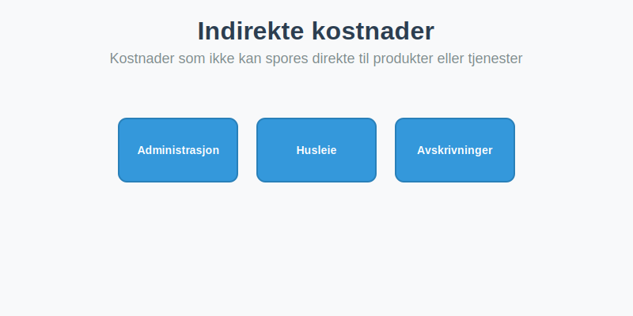

---
title: "Hva er Indirekte kostnader?"
meta_title: "Hva er Indirekte kostnader?"
meta_description: '**Indirekte kostnader** (også kalt _overhead_ eller **felleskostnader**) er kostnader som ikke kan spores direkte til et spesifikt produkt, en tjeneste eller e...'
slug: hva-er-indirekte-kostnader
type: blog
layout: pages/single
---

**Indirekte kostnader** (også kalt _overhead_ eller **felleskostnader**) er kostnader som ikke kan spores direkte til et spesifikt produkt, en tjeneste eller et kostnadssted. Disse kostnadene oppstår for å støtte den generelle driften av virksomheten og må fordeles på en hensiktsmessig måte.

For en komplett oversikt over alle kostnadstyper og kostnadskonsepter i regnskap, se også [Hva er kostnader?](/blogs/regnskap/hva-er-kostnader "Hva er Kostnader i Regnskap? Komplett Guide til Kostnadstyper og Regnskapsføring").
Les ogsÃ¥ om [Direkte kostnader](/blogs/regnskap/hva-er-direkte-kostnader "Hva er Direkte kostnader? Definisjon, Eksempler og Regnskapsføring"), [Variable kostnader](/blogs/regnskap/variable-kostnader "Hva er Variable kostnader? Definisjon, Eksempler og Regnskapsføring"), [Faste kostnader](/blogs/regnskap/hva-er-faste-kostnader "Hva er Faste kostnader? Definisjon og Eksempler"), [Kalkulatoriske kostnader](/blogs/regnskap/kalkulatoriske-kostnader "Hva er Kalkulatoriske kostnader? Guide til kalkulatoriske kostnader og Regnskapsanalyse") og [Kapitalkostnad](/blogs/regnskap/kapitalkostnad "Kapitalkostnad “ Grunnleggende konsept for norsk regnskap og investering") for en helhetlig kostnadsforstÃ¥else.

Det er nyttig Ã¥ kjenne forskjellen mellom kostnad og [utgift](/blogs/regnskap/utgift "Utgift “ Komplett Guide til Utgifter i Norsk Regnskap"); se vÃ¥r artikkel om utgift.

## Hva er Indirekte kostnader?

_Indirekte kostnader_ kan defineres som **kostnader som ikke kan spores direkte til produksjon eller levering av enkeltprodukter eller tjenester**. De oppstår for å støtte virksomhetens overordnede drift, og de må ofte allokeres basert på aktivitetsnivå eller andre fordelingsnøkler.

### Kjennetegn ved Indirekte kostnader

* **Felleskostnader:** De deles mellom flere produkter, avdelinger eller prosjekter.
* **Periodisering:** Påløper løpende uavhengig av produksjonsvolum.
* **Fordeling:** Må allokeres ved bruk av fordelingsnøkler som maskintimer eller persontimer.
* **Påvirkning på dekningsbidrag:** Påvirker resultatet etter at direkte kostnader er trukket fra.

### Eksempler på Indirekte kostnader

| Kostnadskategori                  | Eksempel                                                  |
|-----------------------------------|-----------------------------------------------------------|
| **Administrasjonslønninger**      | Lønn til ledelse, økonomi- og personalavdeling            |
| **Husleie og driftskostnader**    | Kontorhusleie, strøm, oppvarming                          |
| **Avskrivninger på fellesutstyr** | Maskiner, IT-utstyr brukt i flere prosesser               |
| **Vedlikehold og reparasjoner**   | Service på fellesproduksjonsutstyr, bygningsvedlikehold   |
| **Forsikringer og lisensavgifter**| Bygningsforsikring, programvarelisenser                   |

### Indirekte kostnader i regnskapsføringen

I norsk regnskap skal indirekte kostnader regnskapsføres i henhold til [bokføringsloven](/blogs/regnskap/hva-er-bokforingsloven "Hva er Bokføringsloven? Krav og Plikter") og riktige fordelingsnøkler skal dokumenteres for å sikre korrekt resultatrapportering.

## Bruk av Indirekte kostnader i analyse og beslutningstaking

Indirekte kostnader spiller en sentral rolle i kostnads- og lønnsomhetsanalyse:

* **Kostnadsallokering:** Fordeling av felleskostnader gir innsikt i reelle produktkostnader.
* **Activity-Based Costing (ABC):** Mer presis fordeling ved bruk av flere kostdrivernøkler.
* **Break-even analyse:** Indirekte kostnader inngår i kalkylen for å bestemme nullpunkt.
* **Kalkyle og prissetting:** Hjelper med å fastsette kalkulasjonspriser og marginer.

## Oppsummering

**Indirekte kostnader** dekker de felles kostnadene som støtter virksomhetens drift, men som ikke kan spores direkte til spesifikke produkter eller tjenester. Gjennom **korrekt allokering** kan virksomheter oppnå mer nøyaktig kostnadsberegning, bedre prissetting og forbedret lønnsomhetsanalyse.

