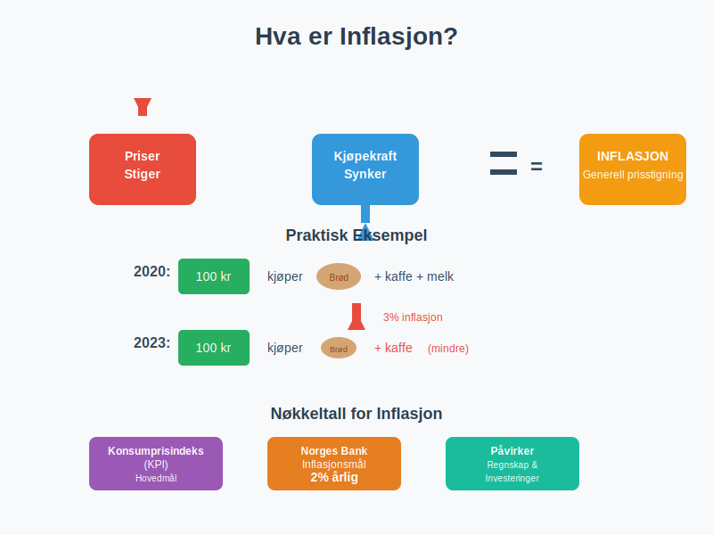
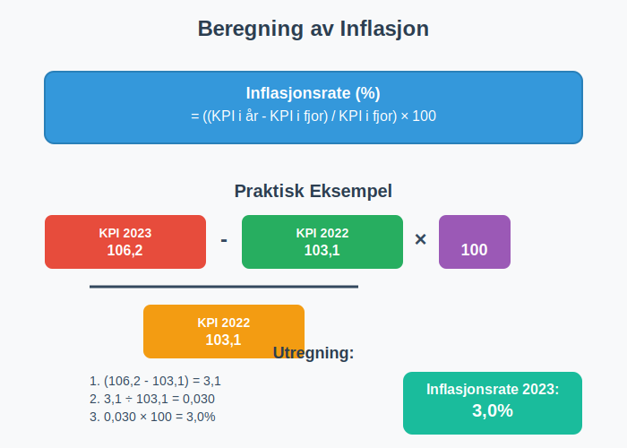
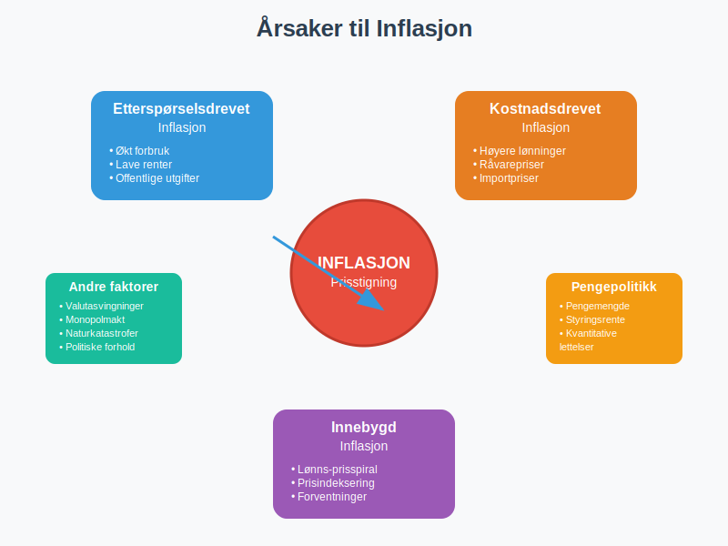
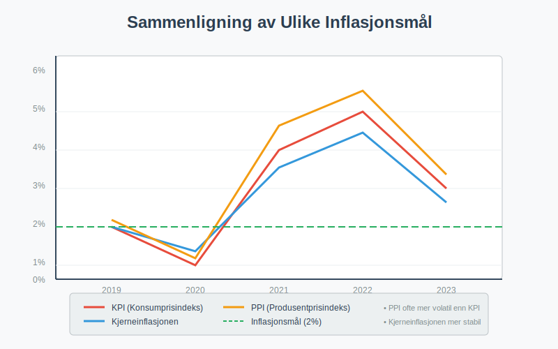
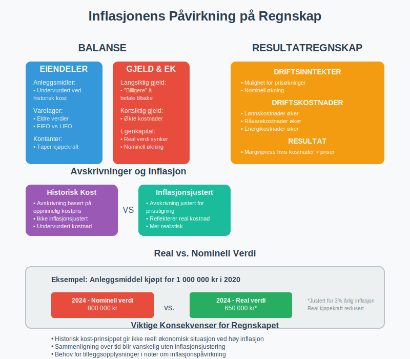
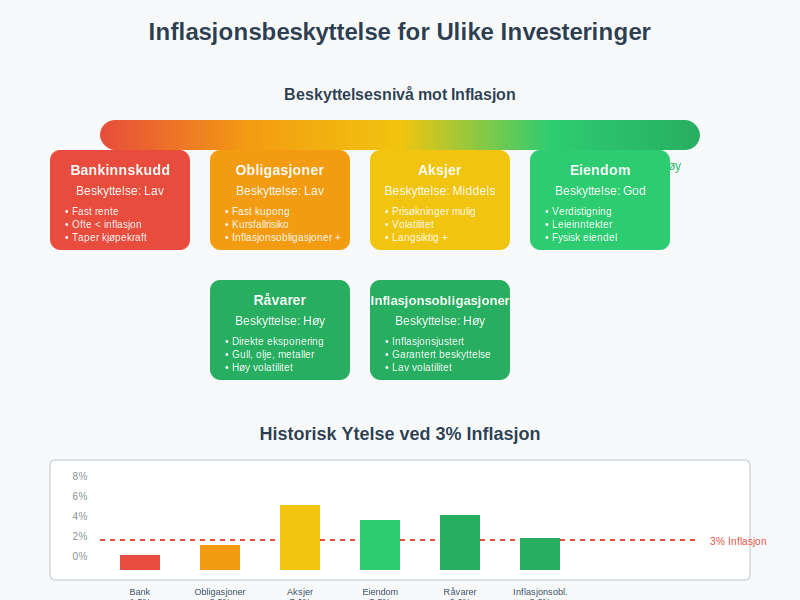
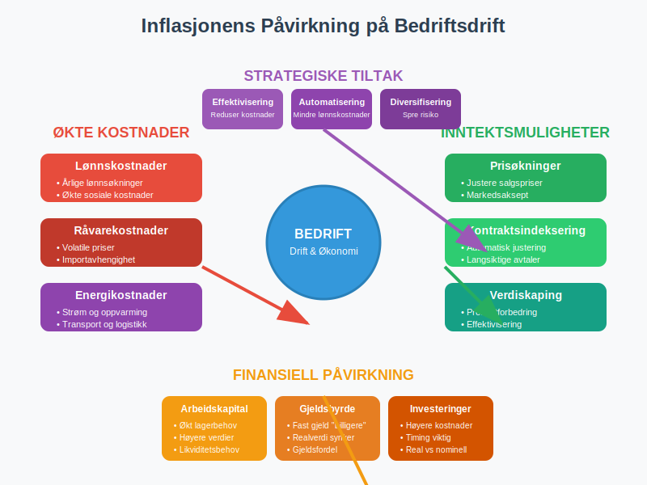
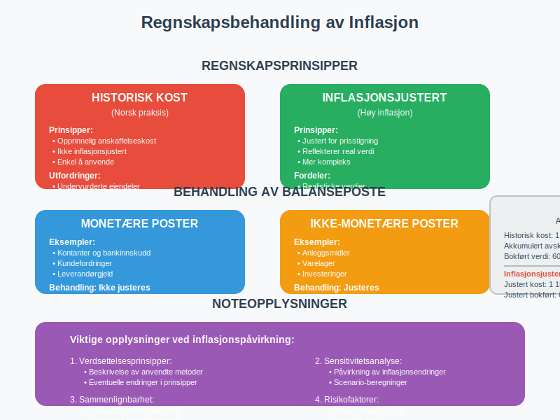
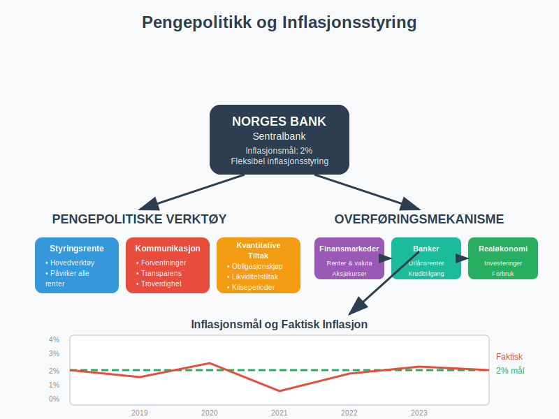
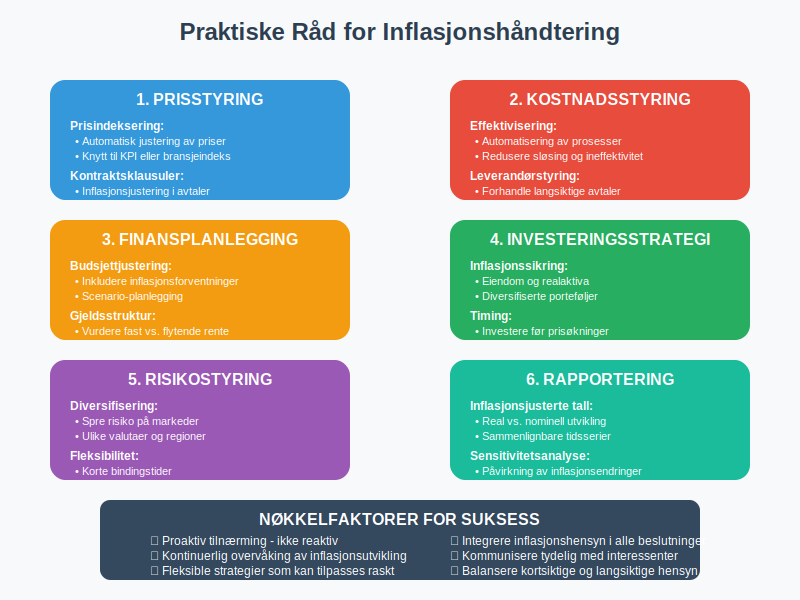

---
title: "Hva er Inflasjon?"
seoTitle: "Hva er Inflasjon?"
meta_description: 'For en helhetlig oversikt over økonomiens store mekanismer, se **[Makroøkonomi](/blogs/regnskap/makrookonomi "Makroøkonomi: Prinsipper og Betydning for Norsk...'
slug: hva-er-inflasjon
type: blog
layout: pages/single
---

For en helhetlig oversikt over økonomiens store mekanismer, se **[Makroøkonomi](/blogs/regnskap/makrookonomi "Makroøkonomi: Prinsipper og Betydning for Norsk Regnskap")**.

For å forstå hvordan prisendringer påvirker både **nominalt** og **reelt BNP**, se [Hva er BNP?](/blogs/regnskap/hva-er-bnp "Hva er BNP? Betydning for Bedrifter og Regnskapsføring").

## Hva er Inflasjon?

Inflasjon oppstår når den generelle prisen på varer og tjenester stiger over tid. Dette betyr at **samme mengde penger kjøper mindre** enn før. Inflasjon måles vanligvis som en årlig prosentvis økning i konsumprisindeksen (KPI).

### Grunnleggende Formel for Inflasjon

**Inflasjonsrate (%) = ((KPI i år - KPI i fjor) / KPI i fjor) × 100**

Tall for KPI publiseres månedlig av **[Statistisk sentralbyrå (SSB)](/blogs/regnskap/statistisk-sentralbyra "Statistisk sentralbyrå (SSB) “ Offisiell statistikk og betydning for regnskap i Norge")**, som er primærkilde for prisindekser.  

## Årsaker til Inflasjon

### 1. Etterspørselsdrevet Inflasjon
**Etterspørselsdrevet inflasjon** oppstår når den totale etterspørselen i økonomien overstiger tilbudet:

* **Økt forbruk:** Høyere inntekter fører til mer forbruk
* **Ekspansiv pengepolitikk:** Lave [styringsrenten](/blogs/regnskap/styringsrente "Hva er Styringsrente? Komplett Guide til Norges Bank sin Styringsrente") stimulerer økonomien og påvirker [konjunktursvingninger](/blogs/regnskap/hva-er-konjunktur "Hva er Konjunktur? En Komplett Guide til Økonomiske Sykluser")
* **Offentlige utgifter:** Statlige investeringer øker etterspørselen

### 2. Kostnadsdrevet Inflasjon
**Kostnadsdrevet inflasjon** skyldes økte produksjonskostnader:

* **Høyere lønnskostnader:** Lønnsøkninger øker produksjonskostnadene
* **Råvarepriser:** Økte priser på olje, metaller og andre råvarer
* **Importpriser:** Svekket valuta gjør import dyrere

### 3. Innebygd Inflasjon
**Innebygd inflasjon** oppstår når inflasjonsforventninger blir selvoppfyllende:

* **Lønns-prisspiral:** Arbeidere krever høyere lønn, bedrifter øker priser
* **Prisindeksering:** Kontrakter justeres automatisk for inflasjon

## Måling av Inflasjon

### Konsumprisindeksen (KPI)
**KPI** er det mest brukte målet på inflasjon i Norge:

| **Komponent** | **Vekting i KPI** | **Beskrivelse** |
|---|---|---|
| Mat og alkoholfrie drikkevarer | 12,8% | Dagligvarer og matvarer |
| Bolig, lys og brensel | 25,1% | Husleie, strøm, oppvarming |
| Transport | 16,2% | Bil, drivstoff, kollektivtransport |
| Klær og skotøy | 4,1% | Tekstiler og fottøy |
| Møbler og husholdningsartikler | 5,8% | Innbo og husholdningsutstyr |

### Andre Inflasjonsmål

* **Kjerneinflasjonen:** KPI justert for volatile komponenter som energi og mat
* **Produsentprisindeksen (PPI):** Måler prisendringer på produsentnivå
* **BNP-deflatoren:** Bredere mål som inkluderer alle varer og tjenester
* **Big Mac-indeksen:** En uformell indikator for **kjøpekraftsparitet** (PPP) basert på prisen på en Big Mac. Les mer om [Big Mac-indeksen](/blogs/regnskap/big-mac-indeksen "Big Mac-indeksen: Komplett guide til valutakurs og kjøpekraftsparitet for norske bedrifter").

## Inflasjonens Påvirkning på Regnskap

### 1. Historisk Kost vs. Løpende Verdi
**Historisk kost-prinsippet** i regnskapet påvirkes av inflasjon:

* **Anleggsmidler:** [Anleggsmidler](/blogs/regnskap/hva-er-anleggsmidler "Hva er Anleggsmidler? Komplett Guide til Varige Driftsmidler") kan være underverdsatt
* **Varelager:** Eldre lagerverdier reflekterer ikke dagens priser
* **Avskrivninger:** [Avskrivninger](/blogs/regnskap/hva-er-avskrivning "Hva er Avskrivning? Komplett Guide til Avskrivningsmetoder") basert på historiske kostnader

### 2. Påvirkning på Resultatregnskap
Inflasjon påvirker [driftskostnader](/blogs/regnskap/hva-er-driftskostnader "Hva er Driftskostnader? Komplett Oversikt over Bedriftens Løpende Utgifter") og [driftsinntekter](/blogs/regnskap/hva-er-driftsinntekter "Hva er Driftsinntekter? Komplett Guide til Bedriftens Inntektskilder"):

* **Økte kostnader:** Lønn, råvarer, energi
* **Prisøkninger:** Mulighet til å øke salgspriser
* **Marginpress:** Hvis kostnader stiger raskere enn priser

### 3. Balansepåvirkning
Inflasjon påvirker [balansen](/blogs/regnskap/hva-er-balanse "Hva er Balanse? Komplett Guide til Balanseregnskap og Balanseposter") på flere måter:

* **Eiendelsverdier:** Kan være undervurdert ved historisk kost
* **Gjeldsverdier:** Fast gjeld blir "billigere" å betale tilbake
* **Egenkapital:** Real verdi kan reduseres

## Inflasjon og Investeringer

### Real vs. Nominell Avkastning
**Nominell [avkastning](/blogs/regnskap/hva-er-avkastning "Hva er Avkastning? Komplett Guide til Investeringsavkastning og Beregning")** justeres for inflasjon for å finne **real avkastning**:

**Real avkastning = Nominell avkastning - Inflasjonsrate**

### Eksempel: Inflasjonsjustering av Avkastning
En investering gir 8% nominell avkastning ved 3% inflasjon:

* **Nominell avkastning:** 8%
* **Inflasjonsrate:** 3%
* **Real avkastning:** 8% - 3% = 5%

### Inflasjonsbeskyttelse
Ulike investeringer gir forskjellig beskyttelse mot inflasjon:

| **Investeringstype** | **Inflasjonsbeskyttelse** | **Forklaring** |
|---|---|---|
| Aksjer | Moderat til høy | Selskaper kan øke priser |
| Eiendom | Høy | Eiendomsverdier følger inflasjon |
| Obligasjoner | Lav | Fast rente taper verdi |
| Bankinnskudd | Meget lav | Ofte lavere rente enn inflasjon |
| Råvarer | Høy | Direkte eksponering mot prisstigning |

## Inflasjon og Bedriftsdrift

### Kostnadsplanlegging
**Inflasjon påvirker [budsjettering](/blogs/regnskap/hva-er-budsjettering "Hva er Budsjettering? Komplett Guide til Budsjettplanlegging") og kostnadsplanlegging:**

* **Lønnskostnader:** Årlige lønnsøkninger
* **Råvarekostnader:** Prisvolatilitet på innsatsfaktorer
* **Energikostnader:** Strøm og drivstoff
* **Husleie:** Indeksregulering av leiekontrakter

### Prissetting
Bedrifter må tilpasse prissetting til inflasjon:

* **Prisindeksering:** Automatisk justering av priser
* **Kontraktsklausuler:** Inflasjonsjustering i langsiktige avtaler
* **Konkurranseevne:** Balansere priser mot konkurrenter

### Finansiering
Inflasjon påvirker [finansiering](/blogs/regnskap/hva-er-finansiering "Hva er Finansiering? Komplett Guide til Bedriftens Finansieringsmuligheter"):

* **Lånerenter:** Nominelle renter inkluderer inflasjonspremie
* **Real gjeldsbyrde:** Inflasjon reduserer realverdien av gjeld
* **Arbeidskapital:** Økt behov for [arbeidskapital](/blogs/regnskap/hva-er-arbeidskapital "Hva er Arbeidskapital? Komplett Guide til Driftskapital") ved prisstigning

## Regnskapsbehandling av Inflasjon

### Inflasjonsjustering av Regnskapet
I land med høy inflasjon brukes **inflasjonsjustert regnskap**:

* **Monetære poster:** Justeres ikke (kontanter, fordringer, gjeld)
* **Ikke-monetære poster:** Justeres med inflasjonsfaktor
* **Resultatposter:** Justeres til gjennomsnittlig kjøpekraft

### Norsk Praksis
I Norge med lav inflasjon brukes **historisk kost** med unntak:

* **Finansielle instrumenter:** Virkelig verdi
* **Investeringseiendom:** Kan verdsettes til virkelig verdi
* **Nedskrivninger:** Når bokført verdi overstiger gjenvinnbart beløp

### Noteopplysninger
**Viktige noteopplysninger** om inflasjonspåvirkning:

* **Avskrivningsmetoder** og levetid
* **Verdsettelsesprinsipper** for eiendeler
* **Sensitivitetsanalyser** for inflasjonsendringer

## Inflasjon og Skatt

### Skattemessige Konsekvenser
Inflasjon påvirker skatteberegningen:

* **Nominelle gevinster:** Beskattes selv om real gevinst er null
* **Avskrivninger:** Basert på historisk kost, ikke inflasjonsjustert
* **Lagerverdi:** FIFO vs. LIFO påvirkes forskjellig

### Eksempel: Inflasjon og Kapitalgevinst
Kjøp av aksje for 100 000 kr, salg for 130 000 kr etter 5 år med 5% årlig inflasjon:

* **Nominell gevinst:** 30 000 kr (30%)
* **Inflasjonsjustert kjøpspris:** 100 000 × 1,05^5 = 127 628 kr
* **Real gevinst:** 130 000 - 127 628 = 2 372 kr (1,9%)
* **Skatt betales av:** 30 000 kr (nominell gevinst)

## Inflasjonsmål og Pengepolitikk

### Norges Banks Inflasjonsmål
**[Norges Bank](/blogs/regnskap/norges-bank "Norges Bank")** har et inflasjonsmål på **2% årlig**:

* **Fleksibel inflasjonsstyring:** Tar hensyn til økonomiske svingninger
* **Styringsrente:** Hovedverktøy for å påvirke inflasjon
* **Kommunikasjon:** Tydelige signaler om pengepolitikken

### Konsekvenser for Bedrifter
Inflasjonsmålet påvirker bedriftenes planlegging:

* **Forutsigbarhet:** Stabil inflasjon letter langsiktig planlegging
* **Rentenivå:** Påvirker finansieringskostnader
* **Valutakurs:** Inflasjonsdifferanser påvirker konkurranseevne

## Praktiske Råd for Bedrifter

### Inflasjonssikring
**Strategier for å håndtere inflasjon:**

* **Prisindeksering:** Automatisk justering av priser og kontrakter
* **Diversifisering:** Spre risiko på ulike markeder og valutaer
* **Fleksible kontrakter:** Korte bindingstider eller justeringsklausuler
* **Lagerstyring:** Optimalisere lagernivå ved prisvolatilitet

### Finansiell Planlegging
**Tilpasninger i finansiell planlegging:**

* **Budsjettjustering:** Inkludere inflasjonsforventninger
* **Investeringsbeslutninger:** Bruke real [avkastning](/blogs/regnskap/hva-er-avkastning "Hva er Avkastning? Komplett Guide til Investeringsavkastning og Beregning")
* **Gjeldsstruktur:** Vurdere fast vs. flytende rente
* **Valutasikring:** Beskytte mot valutasvingninger

### Rapportering og Analyse
**Forbedret rapportering:**

* **Inflasjonsjusterte tall:** Sammenligne reelle utviklingstrender
* **Sensitivitetsanalyser:** Vise påvirkning av inflasjonsendringer
* **Nøkkeltall:** Justere for inflasjon i flerårige sammenligninger

## Vanlige Feil og Misforståelser

### Feil 1: Ignorere Inflasjonspåvirkning
Mange bedrifter **undervurderer inflasjonens påvirkning** på:

* **Langsiktige kontrakter** uten prisregulering
* **Investeringsbeslutninger** basert på nominelle tall
* **Sammenligning** av flerårige resultater

### Feil 2: Feil Inflasjonsmål
**Bruke feil inflasjonsmål** for spesifikke formål:

* **Generell KPI** vs. bransje-spesifikk inflasjon
* **Nasjonal inflasjon** vs. regional prisstigning
* **Historisk inflasjon** vs. fremtidige forventninger

### Feil 3: Manglende Inflasjonssikring
**Ikke beskytte seg mot inflasjon:**

* **Kun bankinnskudd** som taper kjøpekraft
* **Lange fastrentelån** uten inflasjonsjustering
* **Faste priser** på langsiktige leveranser

## Fremtidige Trender

### Teknologi og Inflasjon
**Teknologisk utvikling** påvirker inflasjon:

* **Digitalisering:** Kan redusere kostnader og priser
* **Automatisering:** Reduserer lønnskostnader
* **Globalisering:** Økt konkurranse holder priser nede

### Miljø og Inflasjon
**Miljøhensyn** kan påvirke inflasjon:

* **Karbonavgifter:** Øker kostnader for utslippsintensive bedrifter
* **Grønn omstilling:** Investeringer kan påvirke priser
* **Klimaendringer:** Kan påvirke råvarepriser

### Demografiske Endringer
**Befolkningsutvikling** påvirker inflasjon:

* **Aldring:** Endret forbruksmønster og arbeidstilbud
* **Urbanisering:** Påvirker boligpriser og lønnskostnader
* **Migrasjon:** Påvirker arbeidstilbud og etterspørsel

## Konklusjon

**Inflasjon** er et fundamentalt økonomisk fenomen som påvirker alle aspekter av bedriftsdrift og regnskap. For å lykkes i et inflasjonspreget miljø må bedrifter:

* **Forstå** inflasjonens årsaker og konsekvenser
* **Tilpasse** regnskaps- og rapporteringspraksis
* **Implementere** strategier for inflasjonssikring
* **Overvåke** inflasjonsutvikling og justere planer

Ved å ta høyde for inflasjon i alle finansielle beslutninger kan bedrifter beskytte sin [formuesverdi](/blogs/regnskap/hva-er-formuesverdi "Hva er Formuesverdi? Komplett Guide til Verdivurdering av Formue") og opprettholde konkurranseevnen over tid.

**Husk:** Inflasjon er ikke bare et makroøkonomisk fenomen - det påvirker hver enkelt bedrifts daglige drift og langsiktige strategi. Proaktiv håndtering av inflasjon er avgjørende for bærekraftig vekst og lønnsomhet.

For scenarier med både høy inflasjon og lav vekst, se [Hva er Stagflasjon?](/blogs/regnskap/hva-er-stagflasjon "Hva er Stagflasjon? Forstå kombinasjonen av inflasjon og økonomisk stagnasjon").

