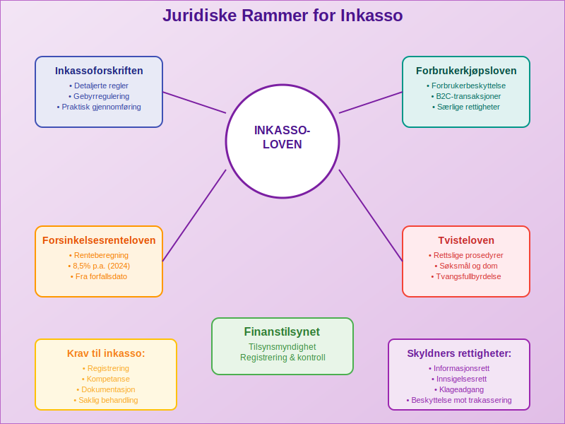

**Inkasso** er prosessen med å kreve inn forfalte [fordringer](/blogs/regnskap/hva-er-kundefordring "Hva er Kundefordring? En Komplett Guide til Kundefordringer i Regnskap") og ubetalt gjeld på vegne av en kreditor. Dette er en viktig del av [fordringshåndtering](/blogs/regnskap/hva-er-ansattreskontro "Hva er Ansattreskontro? Komplett Guide til Kundeoppfølging og Fordringsstyring") som sikrer at bedrifter får betalt for sine varer og tjenester. Inkassovirksomhet er strengt regulert i Norge og må følge spesifikke juridiske rammer for å beskytte både kreditorer og skyldnere. Hvis en fordring fortsatt ikke blir betalt etter inkasso, kan det føre til en [betalingsanmerkning](/blogs/regnskap/betalingsanmerkning "Betalingsanmerkning i Norsk Regnskap") som gir en offentlig merknad om betalingsmislighold.

For en detaljert gjennomgang av **purring** og **purregebyr**, se [Hva er purring og purregebyr](/blogs/regnskap/hva-er-purring-og-purregebyr "Hva er purring og purregebyr? Guide til Norske Regler for Purring").

I tillegg gir **[Gjeldsregisteret](/blogs/regnskap/gjeldsregisteret "Hva er Gjeldsregisteret? En Guide til Gjeldsregisteret")** en oversikt over all usikret forbruksgjeld og kan brukes som et supplement til inkassoinformasjon ved kredittvurdering.
 
For ytterligere informasjon om tvangsfullbyrdelse kan du lese om [Namsmannen](/blogs/regnskap/namsmannen "Namsmannen: Norsk tvangsfullbyrdelse og Namsmannens rolle").

Les også vår detaljerte artikkel om [Tvangsfullbyrdelse](/blogs/regnskap/tvangsfullbyrdelse "Hva er Tvangsfullbyrdelse? Guide til Norsk Gjelds- og Utleggfullbyrdelse").
Les vår grundige guide til [Utleggsforretning](/blogs/regnskap/utleggsforretning "Hva er Utleggsforretning? Guide til utleggsforretning i Norge").

## Seksjon 1: Hva er Inkasso?

Inkasso er en formell prosess som starter når vanlige [betalingsoppfordringer](/blogs/regnskap/hva-er-betalingsoppfordring "Betalingsoppfordring - Komplett Guide til Purring og Inkasso i Norge") ikke har ført til betaling. Prosessen kan utføres av kreditor selv ([egeninkasso](/blogs/regnskap/hva-er-egeninkasso "Hva er Egeninkasso? Komplett Guide til Selvinkasso og Fordringshåndtering")) eller av profesjonelle inkassoselskaper.

### Hovedformål med Inkasso

Inkassovirksomhet har flere viktige formål:

* **Innkreving av forfalte fordringer** og sikring av [betalingsevne](/blogs/regnskap/hva-er-betalingsevne "Hva er Betalingsevne? Analyse av Likviditet og Finansiell Stabilitet")
* **Beskyttelse av kreditors rettigheter** og økonomiske interesser
* **Opprettholdelse av betalingsdisiplin** i næringslivet
* **Forebygging av betalingsproblemer** gjennom tidlig intervensjon
* **Balansering av interesser** mellom kreditor og skyldner

## Seksjon 2: Juridiske Rammer for Inkasso

Inkassovirksomhet i Norge er regulert av flere lover og forskrifter som sikrer rettferdig behandling av alle parter. **[Inkassoloven](/blogs/regnskap/hva-er-inkassoloven "Hva er Inkassoloven? Komplett Guide til Norsk Inkassolovgivning og Regler")** er den primære reguleringen som etablerer rammene for all inkassovirksomhet og beskytter skyldneres rettigheter. Denne loven suppleres av forbrukerkjøpsloven og inkassoforskriften.

### Viktige Lover og Forskrifter

| Lov/Forskrift | Hovedområde | Anvendelse |
|---------------|-------------|------------|
| **[Inkassoloven](/blogs/regnskap/hva-er-inkassoloven "Hva er Inkassoloven? Komplett Guide til Norsk Inkassolovgivning og Regler")** | Regulering av inkassovirksomhet | Alle inkassosaker |
| **Inkassoforskriften** | Detaljerte regler og gebyrer | Praktisk gjennomføring |
| **Forbrukerkjøpsloven** | Forbrukerbeskyttelse | B2C-transaksjoner |
| **Forsinkelsesrenteloven** | Beregning av forsinkelsesrenter | Alle forfalte fordringer |
| **Tvisteloven** | Rettslige prosedyrer | Rettssaker og tvangsfullbyrdelse |

### Krav til Inkassovirksomhet

For at inkasso skal være lovlig, må følgende krav oppfylles:

* **Registrering:** Profesjonelle inkassoselskaper må være registrert hos Finanstilsynet
* **Kompetanse:** Personell må ha nødvendig juridisk og faglig kompetanse
* **Dokumentasjon:** All kommunikasjon må dokumenteres og arkiveres
* **Informasjonsplikt:** Skyldner må informeres om sine rettigheter
* **Saklig behandling:** Kommunikasjonen må være respektfull og saklig

## Seksjon 3: Typer Inkasso

Det finnes flere ulike former for inkasso, hver med sine særegne karakteristika og anvendelsesområder. Valg av inkassometode avhenger av faktorer som fordringens størrelse, skyldners situasjon og kreditors preferanser.

### Oversikt over Inkassometoder

#### Egeninkasso

[Egeninkasso](/blogs/regnskap/hva-er-egeninkasso "Hva er Egeninkasso? Komplett Guide til Selvinkasso og Fordringshåndtering") er når kreditor selv driver inkassovirksomhet:

* **Fordeler:** Lavere kostnader, full kontroll, bevaring av kundeforhold
* **Ulemper:** Krever intern kompetanse, tidsbruk, begrenset ekspertise
* **Egnet for:** Mindre bedrifter med moderate inkassovolumer

#### Profesjonell Inkasso

Profesjonelle inkassoselskaper håndterer inkassoprosessen:

* **Fordeler:** Høy kompetanse, effektiv prosess, juridisk ekspertise
* **Ulemper:** Høyere kostnader, mindre kontroll
* **Egnet for:** Større bedrifter med høye inkassovolumer

#### Rettslig Inkasso

Når frivillig inkasso ikke fører frem, kan saken bringes inn for domstolene:

* **Søksmål:** Formell rettssak for å få dom
* **Tvangsfullbyrdelse:** Gjennomføring av dom med tvangsmidler
* **Konkurs:** Siste utvei ved alvorlig betalingsudyktighet

## Seksjon 4: Inkassoprosessen Steg-for-Steg

En systematisk inkassoprosess øker sannsynligheten for vellykket innkreving og sikrer overholdelse av juridiske krav. Prosessen følger en strukturert tilnærming fra første kontakt til eventuell rettslig behandling.

### Fase 1: Forberedelse og Vurdering

Før inkasso starter, må følgende vurderes:

* **Fordringens gyldighet:** Er den opprinnelige [fakturaen](/blogs/regnskap/hva-er-en-faktura "Hva er en Faktura? En Guide til Norske Fakturakrav") korrekt?
* **Skyldners betalingsevne:** Har skyldner mulighet til å betale?
* **Dokumentasjon:** Er alle nødvendige dokumenter tilgjengelige?
* **Kostnads-nytte vurdering:** Er inkasso økonomisk forsvarlig?

### Fase 2: Første Inkassokrav

Det første inkassokravet må inneholde:

* **Tydelig identifikasjon** av kreditor og skyldner
* **Detaljert oversikt** over hovedstol, [forsinkelsesrenter](/blogs/regnskap/hva-er-forsinkelsesrente "Hva er Forsinkelsesrente? Beregning og Juridiske Rammer") (også kalt [morarente](/blogs/regnskap/hva-er-morarente "Hva er Morarente? Komplett Guide til Lovpålagt Forsinkelsesrente i Norge")) og gebyrer
* **Betalingsfrist** (minimum 14 dager)
* **Informasjon om konsekvenser** ved manglende betaling
* **Kontaktinformasjon** for henvendelser og forhandlinger

### Fase 3: Oppfølging og Forhandling

Hvis første krav ikke fører til betaling:

* **Andre inkassokrav** med tydeligere konsekvenser
* **Telefonisk kontakt** for direkte dialog
* **Forhandling om betalingsordning** hvis aktuelt
* **Vurdering av rettslige skritt** som neste fase

### Fase 4: Rettslig Behandling

Ved manglende respons på frivillig inkasso:

* **Forberedelse av søksmål** med juridisk bistand
* **Innlevering til domstol** med alle nødvendige dokumenter
* **Rettssak og dom** som grunnlag for tvangsfullbyrdelse
* **Tvangsfullbyrdelse** gjennom namsmannen

## Seksjon 5: Inkassokostnader og Gebyrer

Inkassokostnader er regulert av inkassoforskriften og kan kreves fra skyldner når visse betingelser er oppfylt. Kostnadene skal være rimelige og stå i forhold til arbeidet som er utført.

### Lovlige Inkassogebyrer (2024)

| Type Gebyr | Maksimalt Beløp | Betingelser |
|------------|-----------------|-------------|
| **Første inkassokrav** | Kr 200 | Skriftlig krav sendt |
| **Andre inkassokrav** | Kr 400 | Etter første krav uten respons |
| **Telefonisk purring** | Kr 50 per samtale | Maksimalt 3 samtaler |
| **Betalingsordning** | Kr 100 | Ved etablering av ordning |
| **Advokat/rettsgebyr** | Faktiske kostnader | Dokumenterte utgifter |

### Forsinkelsesrenter

I tillegg til gebyrer kan kreditor kreve **forsinkelsesrenter** fra forfallsdato:

* **Rentesats:** 8,5% per år (2024)
* **Beregningsgrunnlag:** Hovedstol eksklusiv mva
* **Beregningsperiode:** Fra forfallsdato til betaling skjer
* **Sammensatt rente:** Renter påløper ikke renter

### Kostnader ved Rettslig Inkasso

Ved rettslig behandling kan følgende kostnader påløpe:

* **Saksomkostninger:** Domstolsgebyrer og prosessuelle kostnader
* **Advokatutgifter:** Juridisk bistand og representasjon
* **Tvangsfullbyrdelse:** Namsmyndighetenes gebyrer og kostnader
* **Sikkerhetsstillelse:** Eventuell sikkerhet for saksomkostninger

## Seksjon 6: Skyldners Rettigheter og Beskyttelse

Inkassoloven gir skyldnere viktige rettigheter og beskyttelse mot urimelig inkassopraksis. Disse rettighetene skal sikre balanse mellom kreditors behov for innkreving og skyldners behov for rettferdig behandling.

### Grunnleggende Rettigheter

Skyldnere har følgende grunnleggende rettigheter:

* **Rett til informasjon:** Tydelig informasjon om fordring og kostnader
* **Rett til dokumentasjon:** Krav på dokumentasjon av fordringens gyldighet
* **Rett til innsigelser:** Mulighet til å bestride fordringen
* **Rett til betalingsordning:** Forhandling om avdragsordning
* **Rett til klage:** Klageadgang ved urimelig behandling

### Beskyttelse mot Urimelig Inkasso

Inkassoloven forbyr følgende praksis:

* **Trakassering:** Hyppige eller urimelige henvendelser
* **Trusler:** Ulovlige trusler om konsekvenser
* **Offentliggjøring:** Offentlig omtale av gjelden
* **Urimelige kostnader:** Gebyrer som overstiger lovlige rammer
* **Villedende informasjon:** Feilaktig eller misvisende opplysninger

### Klageadgang og Tilsyn

Ved urimelig inkassopraksis kan skyldner:

* **Klage til inkassoselskapet** direkte
* **Kontakte Finanstilsynet** som fører tilsyn
* **Søke juridisk bistand** ved alvorlige brudd
* **Anmelde straffbare forhold** til politiet

## Seksjon 7: Regnskapsføring av Inkasso

Korrekt regnskapsføring av inkassoaktiviteter er viktig for å opprettholde oversikt over fordringer og kostnader. Dette påvirker både [driftsresultatet](/blogs/regnskap/hva-er-driftsresultat "Hva er Driftsresultat? Beregning, Analyse og Betydning for Bedriften") og [likviditeten](/blogs/regnskap/hva-er-betalingsevne "Hva er Betalingsevne? Analyse av Likviditet og Finansiell Stabilitet").

### Kontering av Inkassoaktiviteter

#### Inkassogebyrer som Inntekt

Når bedriften krever inkassogebyrer:

* **Debet:** Kundefordringer (økning av fordring)
* **Kredit:** Andre driftsinntekter (gebyr som inntekt)

#### Forsinkelsesrenter

Påløpte forsinkelsesrenter konteres som:

* **Debet:** Kundefordringer
* **Kredit:** Renteinntekter

#### Inkassokostnader

Kostnader til eksterne inkassoselskaper:

* **Debet:** Inkassokostnader (driftskostnad)
* **Kredit:** Leverandørgjeld eller bank

### Avsetninger for Tap

Ved usikre fordringer må bedriften vurdere avsetninger:

* **Individuelle avsetninger:** For spesifikke risikoutsatte fordringer
* **Generelle avsetninger:** For portefølje av fordringer
* **Nedskrivning:** Når tap anses som sannsynlig

## Seksjon 8: Digitalisering og Fremtidens Inkasso

Inkassoindustrien gjennomgår en digital transformasjon som påvirker både effektivitet og kundeopplevelse. Moderne teknologi muliggjør mer målrettet og kostnadseffektiv inkasso.

### Digitale Inkassoløsninger

#### Automatiserte Systemer

* **AI-basert risikovurdering:** Automatisk vurdering av betalingsevne
* **Personaliserte kommunikasjonsstrategier:** Tilpasset kommunikasjon basert på skyldnerprofil
* **Automatisk oppfølging:** Systematisk oppfølging uten manuell intervensjon
* **Integrerte betalingsløsninger:** Enkle betalingsmuligheter direkte i inkassokrav

#### Forbedret Kundeopplevelse

* **Selvbetjeningsportaler:** Skyldnere kan administrere sine saker online
* **Fleksible betalingsordninger:** Automatisk beregning og tilbud om avdragsordninger
* **Transparent kommunikasjon:** Tydelig oversikt over fordring og kostnader
* **Mobilvennlige løsninger:** Tilgang via smartphone og nettbrett

### Regulatoriske Utfordringer

Den digitale utviklingen skaper nye regulatoriske utfordringer:

* **Personvern:** GDPR-krav til behandling av personopplysninger
* **Cybersikkerhet:** Beskyttelse av sensitive finansielle data
* **Algoritmisk diskriminering:** Sikring av rettferdig behandling
* **Grenseoverskridende inkasso:** Harmonisering av europeiske regler

## Seksjon 9: Internasjonalt Inkasso

For bedrifter med internasjonale kunder blir grenseoverskridende inkasso stadig viktigere. Dette krever kunnskap om ulike lands juridiske systemer og kulturelle forskjeller.

### Utfordringer ved Internasjonalt Inkasso

* **Ulike juridiske systemer:** Forskjellige lover og prosedyrer
* **Språkbarrierer:** Kommunikasjon på fremmedspråk
* **Kulturelle forskjeller:** Ulike forretningskulturer og betalingstradisjoner
* **Valutarisiko:** Svingninger i valutakurser
* **Høyere kostnader:** Kompleksitet øker kostnadene betydelig

### EU-regulering

Innenfor EU/EØS gjelder spesielle regler:

* **Europeisk betalingsordre:** Forenklet prosedyre for ubestridte krav
* **Småkravsprosedyre:** Effektiv behandling av mindre fordringer
* **Harmoniserte regler:** Felles standarder for inkassovirksomhet
* **Gjensidig anerkjennelse:** Dommer anerkjennes på tvers av landegrenser

## Konklusjon

Inkasso er en kompleks og viktig del av moderne forretningsdrift som krever grundig forståelse av juridiske rammer, prosedyrer og beste praksis. Enten bedriften velger [egeninkasso](/blogs/regnskap/hva-er-egeninkasso "Hva er Egeninkasso? Komplett Guide til Selvinkasso og Fordringshåndtering") eller profesjonelle tjenester, er det essensielt å følge lovkravene og behandle skyldnere med respekt.

Den digitale utviklingen skaper nye muligheter for mer effektiv og kundevennlig inkasso, samtidig som den stiller nye krav til personvern og sikkerhet. Fremtidens inkasso vil være preget av automatisering, personalisering og økt fokus på skyldnerens opplevelse.

For bedrifter er det viktig å ha en helhetlig tilnærming til [fordringshåndtering](/blogs/regnskap/hva-er-ansattreskontro "Hva er Ansattreskontro? Komplett Guide til Kundeoppfølging og Fordringsstyring") som balanserer behovet for innkreving med opprettholdelse av gode kundeforhold. Korrekt regnskapsføring og systematisk oppfølging av inkassoaktiviteter er avgjørende for å opprettholde [likviditet](/blogs/regnskap/hva-er-betalingsevne "Hva er Betalingsevne? Analyse av Likviditet og Finansiell Stabilitet") og finansiell stabilitet.

