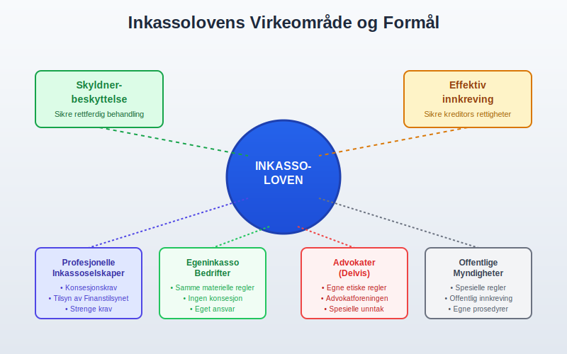
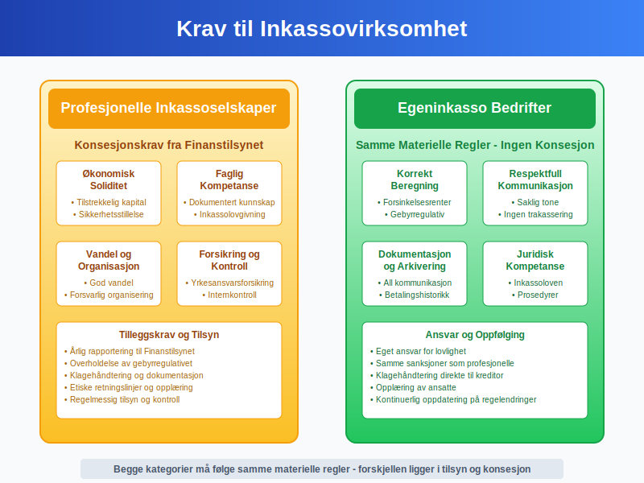
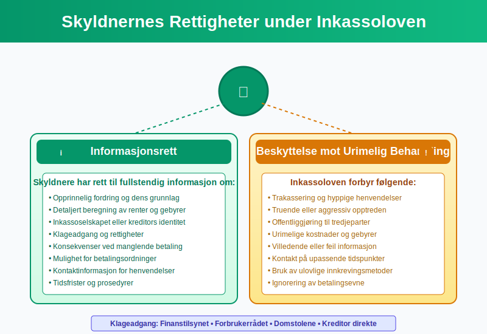
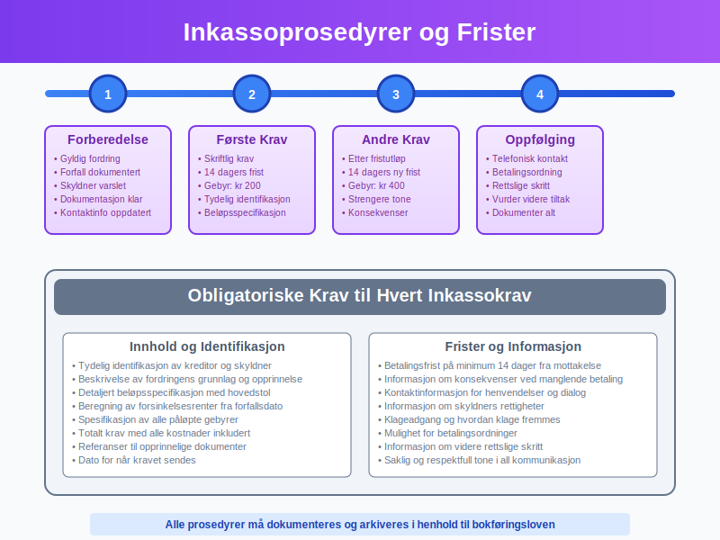
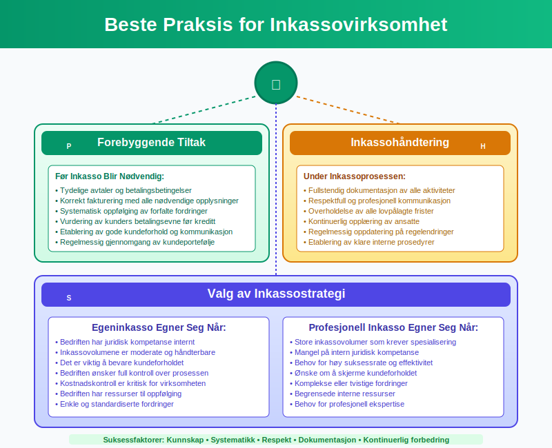

---
title: "Hva er inkassoloven?"
meta_title: "Hva er inkassoloven?"
meta_description: '**Inkassoloven** er Norges sentrale lovgivning som regulerer inkassovirksomhet og beskytter skyldnere mot urettmessig behandling. Loven, formelt kjent som "Lov ...'
slug: hva-er-inkassoloven
type: blog
layout: pages/single
---

**Inkassoloven** er Norges sentrale lovgivning som regulerer inkassovirksomhet og beskytter skyldnere mot urettmessig behandling. Loven, formelt kjent som "Lov om inkassovirksomhet og annen inndriving av forfalte pengekrav", etablerer klare rammer for hvordan kreditorer og inkassoselskaper kan drive innkreving av forfalte fordringer. For bedrifter som driver [egeninkasso](/blogs/regnskap/hva-er-egeninkasso "Hva er Egeninkasso? Komplett Guide til Selvinkasso og Fordringshåndtering") eller benytter profesjonelle inkassotjenester, er grundig forståelse av inkassoloven essensielt.
 
For en grundig gjennomgang av **purring** og **purregebyr**, se [Hva er purring og purregebyr](/blogs/regnskap/hva-er-purring-og-purregebyr "Hva er purring og purregebyr? Guide til Norske Regler for Purring").

## Seksjon 1: Inkassolovens Formål og Virkeområde

Inkassoloven har som hovedformål å **beskytte skyldnere** mot urimelig behandling samtidig som den sikrer kreditorer en effektiv måte å kreve inn forfalte fordringer på. Loven gjelder for all kommersiell inkassovirksomhet i Norge og setter strenge krav til både prosedyrer og kommunikasjon.

### Lovens Hovedprinsipper

Inkassoloven bygger på flere grunnleggende prinsipper:

* **Skyldnerbeskyttelse:** Sikre at skyldnere behandles rettferdig og respektfullt
* **Transparens:** Krav om tydelig informasjon om fordringer og kostnader
* **Proporsjonalitet:** Inkassotiltak må stå i forhold til fordringens størrelse
* **Dokumentasjon:** All kommunikasjon og aktivitet må dokumenteres
* **Profesjonalitet:** Krav til kompetanse og etisk opptreden

### Hvem Omfattes av Loven?

Inkassoloven gjelder for:

| Aktør | Omfattet av Loven | Spesielle Krav |
|-------|------------------|----------------|
| **Profesjonelle inkassoselskaper** | Ja | Konsesjon og registrering |
| **Bedrifter med egeninkasso** | Ja | Samme regler som profesjonelle |
| **Advokater** | Delvis | Egne etiske regler i tillegg |
| **Offentlige myndigheter** | Delvis | Spesielle regler for offentlig innkreving |
| **Private personer** | Nei | Kun ved kommersiell virksomhet |

For misligholdte fordringer som ikke blir betalt etter alle inkassotiltak, kan det registreres en [**betalingsanmerkning**](/blogs/regnskap/betalingsanmerkning "Betalingsanmerkning - Hva betyr det for kredittverdighet og regnskap?"). Dette gir en offentlig merknad i kredittopplysningsdatabaser som påvirker kredittverdigheten til debitor.

Dersom saken oversendes til retten for tvangsfullbyrdelse eller innkalling til domstol, vil det påløpe egne **rettsgebyrer** etter [rettsgebyrloven](/blogs/regnskap/rettsgebyr "Hva er Rettsgebyr? Komplett Guide til Rettsgebyrloven og Rettsgebyrer i Norge").

## Seksjon 2: Krav til Inkassovirksomhet

Inkassoloven stiller strenge krav til hvordan inkassovirksomhet skal drives. Disse kravene gjelder både for profesjonelle inkassoselskaper og bedrifter som driver [egeninkasso](/blogs/regnskap/hva-er-egeninkasso "Hva er Egeninkasso? Komplett Guide til Selvinkasso og Fordringshåndtering").

### Konsesjonskrav for Profesjonelle Inkassoselskaper

Profesjonelle inkassoselskaper må ha **konsesjon** fra Finanstilsynet for å drive inkassovirksomhet. Kravene inkluderer:

* **Økonomisk soliditet:** Tilstrekkelig kapital og sikkerhetsstillelse
* **Faglig kompetanse:** Dokumentert kunnskap om inkassolovgivning
* **Vandel:** Ledelse og ansatte må ha god vandel
* **Organisasjon:** Forsvarlig organisering og internkontroll
* **Forsikring:** Yrkesansvarsforsikring

### Krav til Egeninkasso

Bedrifter som driver egeninkasso må overholde de samme **materielle reglene** som profesjonelle inkassoselskaper, men trenger ikke konsesjon. Dette inkluderer:

* Korrekt beregning av [forsinkelsesrente](/blogs/regnskap/hva-er-forsinkelsesrente "Hva er Forsinkelsesrente? Beregning og Regler i Norge")
* Overholdelse av gebyrregulativet
* Respektfull og saklig kommunikasjon
* Korrekt dokumentasjon og arkivering

## Seksjon 3: Skyldnernes Rettigheter

En sentral del av inkassoloven er beskyttelsen av skyldneres rettigheter. Loven sikrer at skyldnere behandles rettferdig og har tilgang til nødvendig informasjon og beskyttelse.

### Informasjonsrett

Skyldnere har rett til **fullstendig informasjon** om:

* Opprinnelig fordring og dens grunnlag
* Beregning av renter og gebyrer
* Inkassoselskapet eller kreditors identitet
* Klageadgang og rettigheter
* Konsekvenser ved manglende betaling

### Beskyttelse mot Urimelig Behandling

Inkassoloven forbyr:

* **Trakassering:** Hyppige eller upassende henvendelser
* **Truende opptreden:** Bruk av trusler eller press
* **Offentliggjøring:** Informasjon til tredjeparter uten hjemmel
* **Urimelige kostnader:** Gebyrer som ikke står i forhold til arbeidet
* **Villedende informasjon:** Feil eller misvisende opplysninger

### Klageadgang

Skyldnere kan klage på inkassobehandling til:

* **Finanstilsynet:** For profesjonelle inkassoselskaper
* **Forbrukerrådet:** For forbrukersaker
* **Domstolene:** Ved rettslige tvister
* **Kreditor direkte:** Ved egeninkasso

## Seksjon 4: Gebyrer og Kostnader

Inkassoloven og tilhørende forskrifter regulerer nøye hvilke gebyrer og kostnader som kan kreves ved inkasso. Dette sikrer at skyldnere ikke belastes med urimelige kostnader.

### Lovlige Inkassogebyrer (2024)

| Type Gebyr | Maksimalt Beløp | Betingelser |
|------------|-----------------|-------------|
| **Første inkassokrav** | Kr 200 | Skriftlig krav med 14 dagers frist |
| **Andre inkassokrav** | Kr 400 | Etter utløp av første frist |
| **Tredje inkassokrav** | Kr 600 | Ved særlige omstendigheter |
| **Forsinkelsesrente** | 8,5% p.a. (2024) | Fra forfallsdato |
| **Saksomkostninger** | Faktiske kostnader | Ved rettslige skritt |

### Beregning av Totalkostnader

Ved beregning av totale inkassokostnader må følgende elementer inkluderes:

* **Hovedstol:** Opprinnelig [fordring](/blogs/regnskap/hva-er-gjeld "Hva er Gjeld? Komplett Guide til Gjeldshåndtering og Regnskapsføring")
* **Forsinkelsesrenter:** Fra forfallsdato til betaling
* **Inkassogebyrer:** I henhold til forskriftene
* **Eventuelle saksomkostninger:** Ved rettslige skritt

### Regnskapsføring av Inkassokostnader

For bedrifter som driver egeninkasso, skal inkassokostnader konteres som:

* **Debet:** Kundefordringer (økning av fordring)
* **Kredit:** Andre [driftsinntekter](/blogs/regnskap/hva-er-driftsinntekter "Hva er Driftsinntekter? Komplett Guide til Inntektsføring og Regnskapsregler") (gebyr som inntekt)

Dette påvirker både [driftsresultatet](/blogs/regnskap/hva-er-driftsresultat "Hva er Driftsresultat? Beregning, Analyse og Betydning for Bedriften") og [likviditeten](/blogs/regnskap/hva-er-betalingsevne "Hva er Betalingsevne? Analyse av Likviditet og Finansiell Stabilitet") til bedriften.

## Seksjon 5: Prosedyrer og Frister

Inkassoloven setter klare krav til prosedyrer og frister som må følges ved inkassovirksomhet. Disse reglene sikrer en rettferdig og forutsigbar prosess for alle parter.

### Obligatoriske Prosedyrer

#### Før Inkasso Starter

Før inkassovirksomhet kan starte, må følgende være på plass:

* **Gyldig fordring:** Basert på avtale eller lov
* **Forfall:** Fordringen må være forfalt til betaling
* **Varsel:** Skyldner må være varslet om fordringen
* **Dokumentasjon:** All relevant dokumentasjon må være tilgjengelig

#### Inkassokrav og Frister

Hvert inkassokrav må inneholde:

* **Identifikasjon:** Tydelig identifikasjon av kreditor og skyldner
* **Fordringens grunnlag:** Beskrivelse av opprinnelig fordring
* **Beløpsspecifikasjon:** Detaljert oversikt over alle kostnader
* **Betalingsfrist:** Minimum 14 dager fra mottakelse
* **Konsekvenser:** Informasjon om videre tiltak ved manglende betaling
* **Kontaktinformasjon:** Mulighet for henvendelser og dialog

### Spesielle Regler for Forbrukere

Ved inkasso overfor **forbrukere** gjelder strengere regler:

* Lengre frister for betaling
* Ekstra informasjonsplikt
* Begrensninger på kontaktmåter
* Særlig beskyttelse mot trakassering
* Rett til betalingsordninger

## Seksjon 6: Sanksjoner og Konsekvenser

Brudd på inkassoloven kan få alvorlige konsekvenser for både profesjonelle inkassoselskaper og bedrifter som driver egeninkasso.

### Administrative Sanksjoner

Finanstilsynet kan ilegge følgende sanksjoner:

| Sanksjon | Anvendelse | Konsekvenser |
|----------|------------|--------------|
| **PÃ¥legg** | Mindre brudd | Krav om retting |
| **Tvangsmulkt** | Ved manglende etterlevelse | Daglige mulkter |
| **Advarsel** | Alvorligere brudd | Formell advarsel |
| **Tilbakekall av konsesjon** | Grove eller gjentatte brudd | Tap av driftstillatelse |

### Straffeansvar

Grov eller systematisk overtredelse av inkassoloven kan medføre:

* **Bøter:** For mindre overtredelser
* **Fengsel:** Inntil 1 år for grove brudd
* **Erstatningsansvar:** Overfor skadelidte skyldnere

### Sivilrettslige Konsekvenser

Brudd på inkassoloven kan også få sivilrettslige konsekvenser:

* **Tap av rett til gebyrer:** Ulovlige gebyrer kan ikke kreves
* **Erstatningsplikt:** For påførte skader og kostnader
* **Ugyldiggjøring:** Av ulovlige avtaler eller krav

## Seksjon 7: Praktiske RÃ¥d for Bedrifter

For bedrifter som skal drive inkassovirksomhet, enten som [egeninkasso](/blogs/regnskap/hva-er-egeninkasso "Hva er Egeninkasso? Komplett Guide til Selvinkasso og Fordringshåndtering") eller ved bruk av profesjonelle tjenester, er det viktig å følge beste praksis.

### Implementering av Inkassorutiner

#### Forebyggende Tiltak

* **Tydelige avtaler:** Sikre at alle avtaler er klare og juridisk bindende
* **Korrekt [fakturering](/blogs/regnskap/hva-er-en-faktura "Hva er en Faktura? En Guide til Norske Fakturakrav"):** Følge alle krav til fakturainnhold
* **Oppfølgingsrutiner:** Etablere systematisk oppfølging av forfalte fordringer
* **Kundevurdering:** Vurdere kunders [betalingsevne](/blogs/regnskap/hva-er-betalingsevne "Hva er Betalingsevne? Analyse av Likviditet og Finansiell Stabilitet") før kreditt

#### Inkassohåndtering

* **Dokumentasjon:** Sikre fullstendig dokumentasjon av alle aktiviteter
* **Kommunikasjon:** Opprettholde respektfull og profesjonell tone
* **Frister:** Overholde alle lovpålagte frister og prosedyrer
* **Opplæring:** Sikre at ansatte har nødvendig kompetanse

### Valg av Inkassostrategi

Bedrifter må vurdere om de skal drive egeninkasso eller bruke profesjonelle tjenester:

#### Egeninkasso Egner Seg NÃ¥r:

* Bedriften har juridisk kompetanse internt
* Inkassovolumene er moderate
* Kundeforholdet er viktig å bevare
* Kostnadskontroll er kritisk

#### Profesjonell Inkasso Egner Seg NÃ¥r:

* Store inkassovolumer
* Mangel på intern juridisk kompetanse
* Behov for høy suksessrate
* Ønske om å skjerme kundeforholdet

## Seksjon 8: Fremtidige Endringer og Utvikling

Inkassoloven er under kontinuerlig utvikling for å tilpasse seg endringer i samfunnet og teknologien. Bedrifter må holde seg oppdatert på endringer som kan påvirke deres inkassovirksomhet.

### Pågående Reformer

Flere reformer er under vurdering:

* **Digitalisering:** Økt bruk av digitale løsninger og kommunikasjon
* **Forbrukerbeskyttelse:** Styrket beskyttelse av sårbare grupper
* **Gebyrregulering:** Justering av gebyrstrukturer
* **Internasjonalisering:** Tilpasning til EU-regelverk

### Teknologiske Utviklinger

Nye teknologier påvirker inkassobransjen:

* **Automatisering:** Automatiserte inkassoprosesser
* **Kunstig intelligens:** AI-basert risikovurdering
* **Blockchain:** Sikker dokumentasjon og sporbarhet
* **Mobile løsninger:** Forbedret tilgjengelighet for skyldnere

## Konklusjon

**Inkassoloven** er et omfattende regelverk som balanserer hensynet til effektiv innkreving av forfalte fordringer med beskyttelse av skyldneres rettigheter. For bedrifter som driver inkassovirksomhet, enten som [egeninkasso](/blogs/regnskap/hva-er-egeninkasso "Hva er Egeninkasso? Komplett Guide til Selvinkasso og Fordringshåndtering") eller ved bruk av profesjonelle tjenester, er grundig forståelse av loven essensielt.

Nøkkelen til vellykket og lovlig inkassovirksomhet ligger i:

* **Grundig kunnskap** om lovens krav og bestemmelser
* **Systematiske prosedyrer** som sikrer overholdelse
* **Respektfull behandling** av alle skyldnere
* **Korrekt dokumentasjon** av alle aktiviteter
* **Kontinuerlig oppdatering** på endringer i regelverket

Ved å følge inkassolovens bestemmelser kan bedrifter drive effektiv innkreving samtidig som de opprettholder høye etiske standarder og beskytter både egne interesser og skyldneres rettigheter. Dette bidrar til et sunt forretningsklima og bygger tillit i markedet.

For bedrifter som vurderer inkassostrategi, er det viktig å vurdere både juridiske, økonomiske og relasjonelle aspekter. Uavhengig av valg av strategi, må alle aktiviteter skje innenfor inkassolovens rammer for å sikre lovlig og etisk virksomhet.

