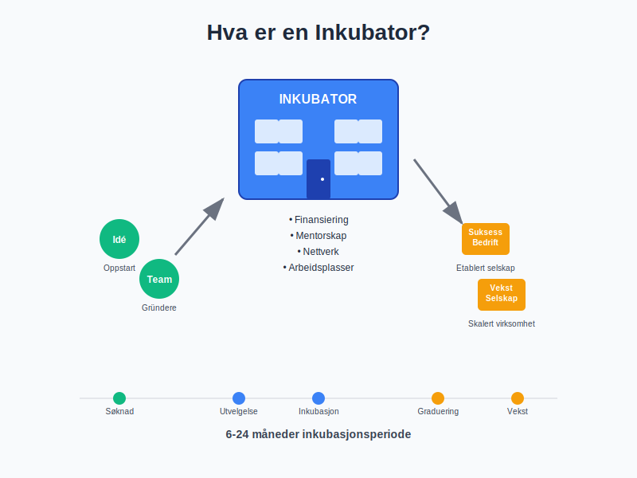
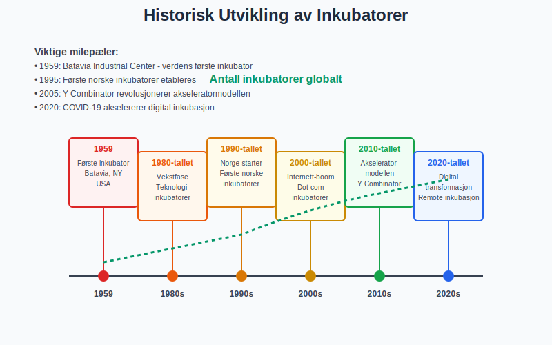
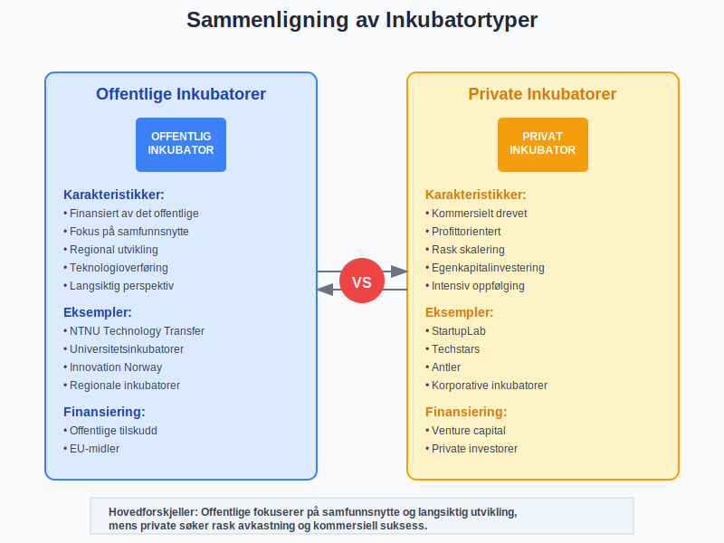
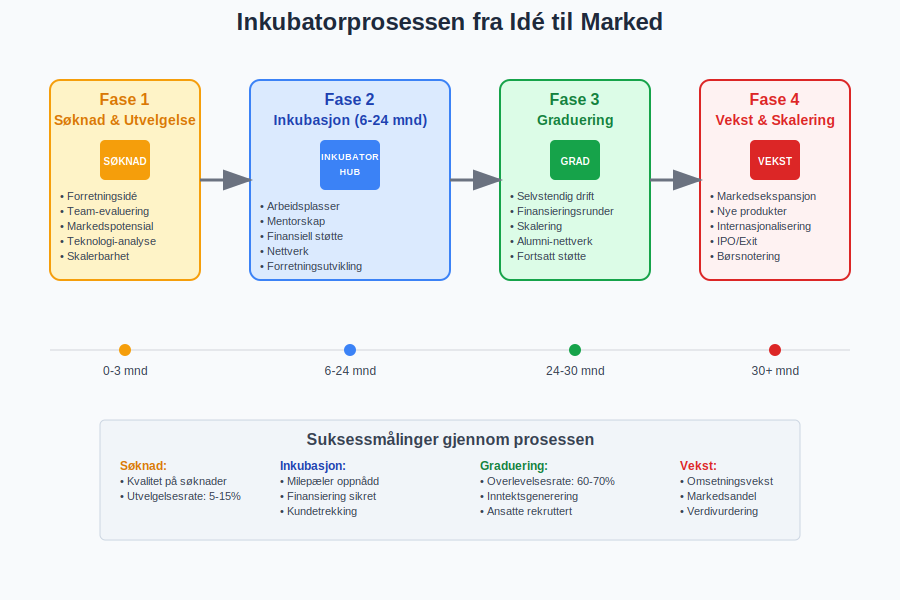
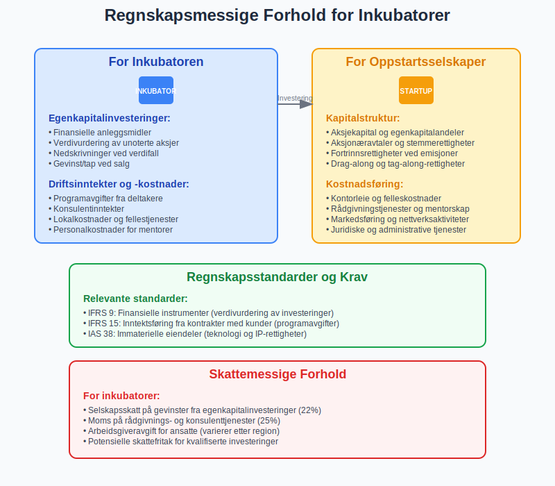
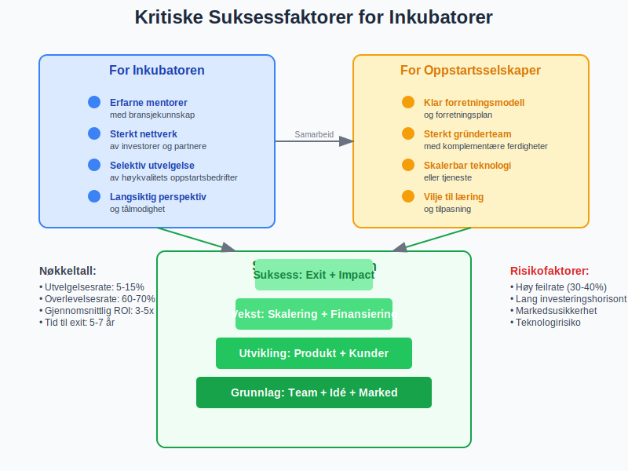
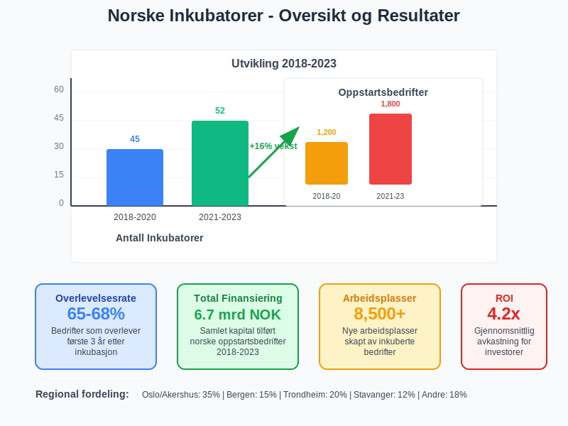
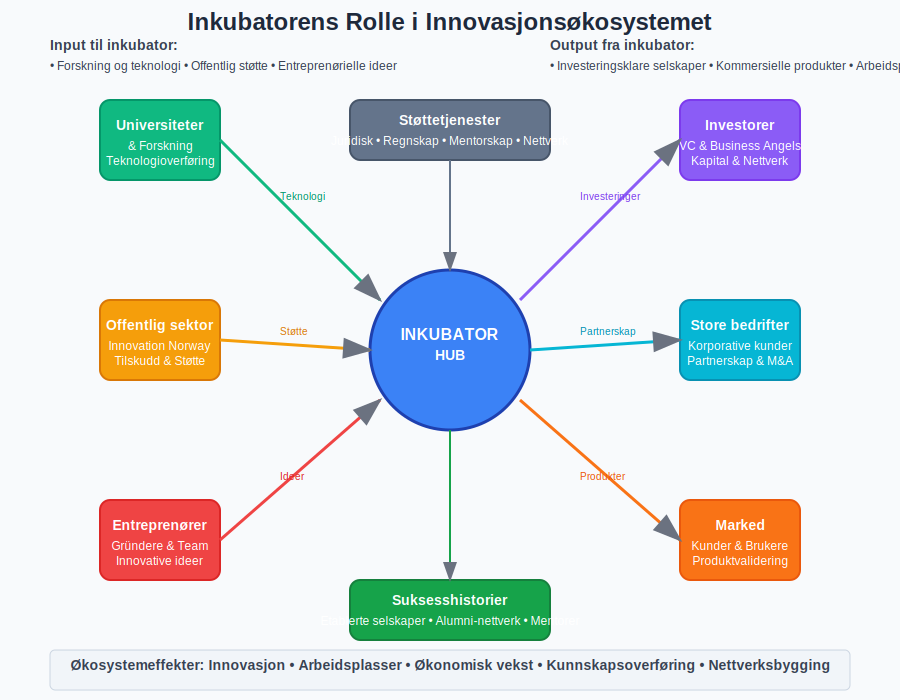

---
title: "Hva er en Inkubator?"
meta_title: "Hva er en Inkubator?"
meta_description: 'En **inkubator** er en organisasjon som støtter oppstartsselskaper og entreprenører gjennom de kritiske tidlige utviklingsfasene. Inkubatorer tilbyr en kombin...'
slug: hva-er-inkubator
type: blog
layout: pages/single
---

En **inkubator** er en organisasjon som støtter oppstartsselskaper og entreprenører gjennom de kritiske tidlige utviklingsfasene. Inkubatorer tilbyr en kombinasjon av **finansiering**, **rådgivning**, **arbeidsplasser** og **nettverk** for å øke sannsynligheten for at nye bedrifter skal lykkes.

## Definisjon av Inkubator

En **bedriftsinkubator** er en organisasjon designet for å akselerere vekst og suksess for **oppstartsselskaper** gjennom en rekke forretningsstøtteressurser og tjenester. Disse kan inkludere:

* **Fysisk arbeidsområde** og kontorfasiliteter
* **Finansiell støtte** og tilgang til investorer
* **Mentorskap** og forretningsrådgivning
* **Nettverk** av bransjekontakter og partnere
* **Teknisk støtte** og infrastruktur
* **Juridisk og regnskapsmessig veiledning**

### Historisk Perspektiv

Det første inkubatorprogrammet ble etablert i **1959** i Batavia, New York. I Norge har inkubatorbevegelsen vokst betydelig siden **1990-tallet**, med støtte fra både offentlige og private aktører.

## Typer Inkubatorer

### Offentlige Inkubatorer

**Offentlig finansierte** inkubatorer drives ofte av:

* **Kommuner** og fylkeskommuner
* **Universiteter** og høyskoler
* **Innovasjon Norge** og andre statlige organer
* **EU-programmer** og internasjonale initiativ

Disse fokuserer typisk på:

* Regional utvikling og arbeidsplasser
* Teknologioverføring fra forskning
* Samfunnsnytte og bærekraft
* Langsiktig verdiskaping

### Private Inkubatorer

**Privatdrevne** inkubatorer opererer med kommersielle mål:

* **Venture capital-selskaper** med egne inkubatorprogrammer
* **Korporative inkubatorer** drevet av store selskaper
* **Uavhengige** kommersielle inkubatorer
* **Akseleratorer** med intensivprogrammer

## Inkubatorprosessen

### Fase 1: Søknad og Utvelgelse

Inkubatorer har typisk en **konkurransebasert** utvelgelsesprosess:

* **Forretningsidé-evaluering** og markedspotensial
* **Team-vurdering** og entreprenørielle ferdigheter
* **Teknologi-analyse** og konkurransefortrinn
* **Skalerbarhet** og vekstpotensial

### Fase 2: Inkubasjon (6-24 måneder)

Under inkubasjonsperioden får oppstartsselskaper:

* **Arbeidsplasser** i delte kontormiljøer
* **Mentorskap** fra erfarne entreprenører
* **Forretningsutvikling** og strategisk rådgivning
* **Nettverk** og bransjekontakter
* **Finansiell støtte** og investorkontakt

### Fase 3: Graduering og Videreutvikling

Etter endt inkubasjon:

* **Etablering** som selvstendig [foretak](/blogs/regnskap/hva-er-foretak "Hva er et Foretak? Komplett Guide til Foretaksformer i Norge")
* **Finansieringsrunder** og investoravtaler
* **Skalering** av forretningsmodellen
* **Fortsatt støtte** gjennom alumninettverk

## Finansieringsmodeller

### Egenkapitalbasert Finansiering

Mange inkubatorer tar **egenkapitalandeler** i oppstartsselskaper:

| Egenkapitalandel | Typisk Støtte | Varighet | Forventet Avkastning |
|------------------|---------------|----------|---------------------|
| **5-10%** | Arbeidsplasser + Mentorskap | 12-18 mnd | Moderat |
| **10-20%** | Kapital + Intensiv støtte | 6-12 mnd | Høy |
| **20%+** | Betydelig kapital + Nettverk | 12-24 mnd | Svært høy |

### Alternative Finansieringsmodeller

* **Avgiftsbaserte** programmer uten egenkapitalkrav
* **Offentlig støtte** gjennom tilskudd og lån
* **[Crowdfunding](/blogs/regnskap/hva-er-crowdfunding "Hva er Crowdfunding? Komplett Guide til Folkefinansiering")** og alternative finansieringsformer
* **Korporative** sponsorater og partnerskap

## Regnskapsmessige Forhold

### For Inkubatoren

Inkubatorer må håndtere komplekse regnskapsmessige forhold:

#### Egenkapitalinvesteringer
* **Finansielle anleggsmidler** - investeringer i porteføljeselskaper
* **Verdivurdering** av unoterte aksjer og andeler
* **Nedskrivninger** ved verdifall
* **Gevinst/tap** ved salg av egenkapitalandeler

#### Driftsinntekter og -kostnader
* **Programavgifter** fra deltakende selskaper
* **Konsulentinntekter** og rådgivningstjenester
* **Lokalkostnader** og fellestjenester
* **Personalkostnader** for mentorer og rådgivere

### For Oppstartsselskaper

Deltakelse i inkubator påvirker oppstartselskapets regnskap:

#### Kapitalstruktur
* **[Aksjekapital](/blogs/regnskap/hva-er-aksjekapital "Hva er Aksjekapital? Komplett Guide til Startkapital for AS")** og egenkapitalandeler
* **[Aksjonæravtaler](/blogs/regnskap/aksjonaeravtale "Hva er en Aksjonæravtale? En Omfattende Guide til Aksjonæravtaler i Norge")** og stemmerettigheter
* **Fortrinnsrettigheter** ved fremtidige emisjoner
* **Drag-along** og tag-along-rettigheter

#### Kostnadsføring
* **Kontorleie** og felleskostnader
* **RÃ¥dgivningstjenester** og mentorskap
* **Markedsføring** og nettverksaktiviteter
* **Juridiske** og administrative tjenester

## Juridiske Rammeverk

### Selskapsformer for Inkubatorer

Inkubatorer kan organiseres som:

* **[Aksjeselskap (AS)](/blogs/regnskap/hva-er-et-aksjeselskap "Hva er et Aksjeselskap (AS)? Komplett Guide til Selskapsformen")** - mest vanlig for kommersielle inkubatorer
* **Stiftelser** - for ideelle og samfunnsnyttige formål
* **Foreninger** - for medlemsdrevne initiativ
* **Offentlige institusjoner** - for statlige og kommunale programmer

### Regulatoriske Krav

#### Finanstilsynets Regelverk
* **Verdipapirhandel** og investeringsvirksomhet
* **Forvaltning** av andres midler
* **Prospektplikt** ved offentlige tilbud
* **Rapporteringsplikt** for større investeringer

#### Skattemessige Forhold
* **Selskapsskatt** på gevinster fra egenkapitalinvesteringer
* **Moms** på rådgivnings- og konsulenttjenester
* **Arbeidsgiveravgift** for ansatte
* **Skattefritak** for kvalifiserte investeringer

## Suksessfaktorer

### For Inkubatoren

* **Erfarne mentorer** med bransjekunnskap
* **Sterkt nettverk** av investorer og partnere
* **Selektiv utvelgelse** av høykvalitets oppstartsbedrifter
* **Langsiktig perspektiv** og tålmodighet
* **Diversifisert portefølje** for risikospredning

### For Oppstartsselskaper

* **Klar forretningsmodell** og [forretningsplan](/blogs/regnskap/hva-er-forretningsplan "Hva er en Forretningsplan? Komplett Guide til Forretningsplanlegging")
* **Sterkt gründerteam** med komplementære ferdigheter
* **Skalerbar teknologi** eller tjeneste
* **Definert målmarked** og kundesegment
* **Vilje til læring** og tilpasning

## Utfordringer og Risiko

### Vanlige Utfordringer

#### For Inkubatorer
* **Høy feilrate** - mange oppstartsbedrifter mislykkes
* **Lang investeringshorisont** før avkastning
* **Begrenset likviditet** i egenkapitalinvesteringer
* **Konkurranse** om de beste oppstartsprosjektene

#### For Oppstartsselskaper
* **Tap av kontroll** gjennom egenkapitalavgivelse
* **Avhengighet** av inkubatorens nettverk og ressurser
* **Tidspress** og intensive programmer
* **Potensielle interessekonflikter** med andre porteføljeselskaper

### Risikostyring

* **Due diligence** og grundig evaluering
* **Diversifisering** av investeringsportefølje
* **Klare avtaler** og forventningsavklaringer
* **Kontinuerlig oppfølging** og støtte
* **Exit-strategier** og likviditetsplanlegging

## Inkubatorer i Norge

### Ledende Inkubatorer

#### Offentlige Aktører
* **NTNU Technology Transfer** - teknologioverføring
* **Universitetet i Oslo** - forskningsbaserte oppstartsbedrifter
* **Innovation Norway** - nasjonale programmer
* **Regionale inkubatorer** - lokale initiativ

#### Private Aktører
* **StartupLab** - Nordens største akselerator
* **Techstars** - internasjonalt program i Oslo
* **Antler** - global early-stage VC og inkubator
* **Katapult** - impact-fokuserte programmer

### Statistikk og Resultater

| Periode | Antall Inkubatorer | Oppstartsbedrifter | Overlevelsesrate | Total Finansiering |
|---------|-------------------|-------------------|------------------|-------------------|
| **2018-2020** | 45 | 1,200 | 65% | 2.5 mrd NOK |
| **2021-2023** | 52 | 1,800 | 68% | 4.2 mrd NOK |

## Fremtidige Trender

### Teknologiske Utviklinger

* **Digitale plattformer** for remote inkubasjon
* **AI og maskinlæring** for bedre utvelgelse
* **Blockchain** for transparente investeringsavtaler
* **Virtual reality** for immersive mentorskap

### Bærekraft og Impact

* **ESG-fokus** og samfunnsansvar
* **Sirkulær økonomi** og grønne løsninger
* **Sosial entreprenørskap** og inkludering
* **FN-bærekraftsmål** som styrende prinsipper

### Finansieringsutvikling

* **[Crowdfunding](/blogs/regnskap/hva-er-crowdfunding "Hva er Crowdfunding? Komplett Guide til Folkefinansiering")** og alternative finansieringsformer
* **Kryptovaluta** og tokenisering
* **Offentlig-private partnerskap** (OPP)
* **Internasjonale** investeringsfond

## Praktiske RÃ¥d

### For Entreprenører

#### Før Søknad
1. **Utvikle en solid [forretningsplan](/blogs/regnskap/hva-er-forretningsplan "Hva er en Forretningsplan? Komplett Guide til Forretningsplanlegging")**
2. **Bygg et sterkt team** med komplementære ferdigheter
3. **Valider forretningsideen** gjennom markedsundersøkelser
4. **Forbered finansielle prognoser** og kapitalbehov

#### Under Inkubasjon
* **Vær åpen for feedback** og konstruktiv kritikk
* **Utnytt nettverket** aktivt og bygg relasjoner
* **Fokuser på kundetrekking** og inntektsgenerering
* **Dokumenter læring** og iterasjoner

#### Etter Graduering
* **Oppretthold kontakt** med inkubatorens nettverk
* **Planlegg neste finansieringsrunde** i god tid
* **Vurder [foretaksform](/blogs/regnskap/hva-er-foretak "Hva er et Foretak? Komplett Guide til Foretaksformer i Norge")** og juridisk struktur
* **Implementer robuste regnskapssystemer**

### For Investorer

#### Evaluering av Inkubatorer
* **Track record** og historiske resultater
* **Kvalitet på mentorer** og rådgivere
* **Nettverk** og bransjekontakter
* **Investeringsfilosofi** og -strategi

#### Due Diligence
* **Finansielle rapporter** og regnskapsanalyse
* **Porteføljesammensetning** og diversifisering
* **Ledelse** og organisasjonsstruktur
* **Regulatorisk compliance** og risikostyring

## Konklusjon

Inkubatorer spiller en **kritisk rolle** i det norske innovasjonsøkosystemet ved å støtte oppstartsselskaper gjennom de mest sårbare fasene. For entreprenører tilbyr de verdifull **finansiering**, **mentorskap** og **nettverk**, mens investorer får tilgang til **kurerte investeringsmuligheter** med profesjonell oppfølging.

Suksess i inkubatorsammenheng krever **grundig forberedelse**, **åpenhet for læring** og **langsiktig perspektiv** fra alle parter. Med riktig tilnærming kan inkubatorer være en **kraftfull katalysator** for innovasjon og verdiskaping.

For oppstartsselskaper som vurderer inkubatorprogrammer, er det viktig å forstå både **mulighetene** og **forpliktelsene** som følger med. Dette inkluderer regnskapsmessige konsekvenser, juridiske forhold og strategiske implikasjoner for fremtidig vekst og [finansiering](/blogs/regnskap/hva-er-finansiering "Hva er Finansiering? Komplett Guide til Finansieringsformer").

