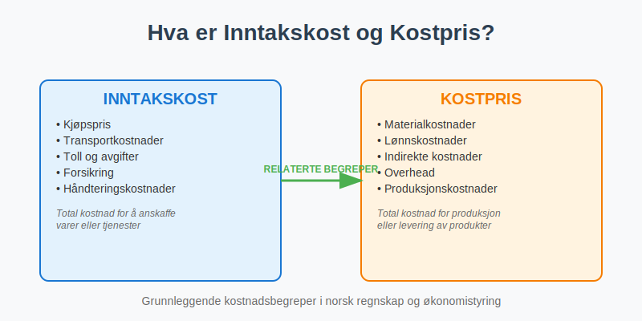
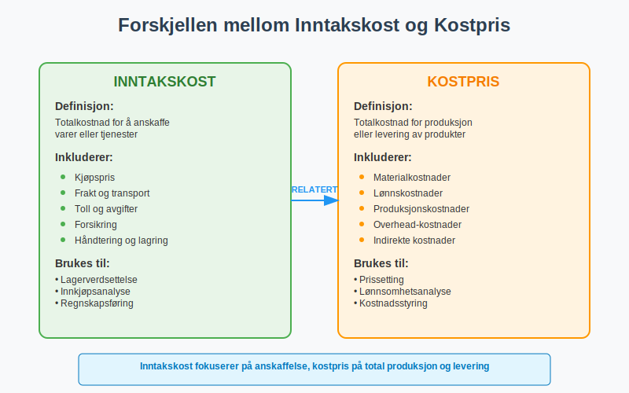
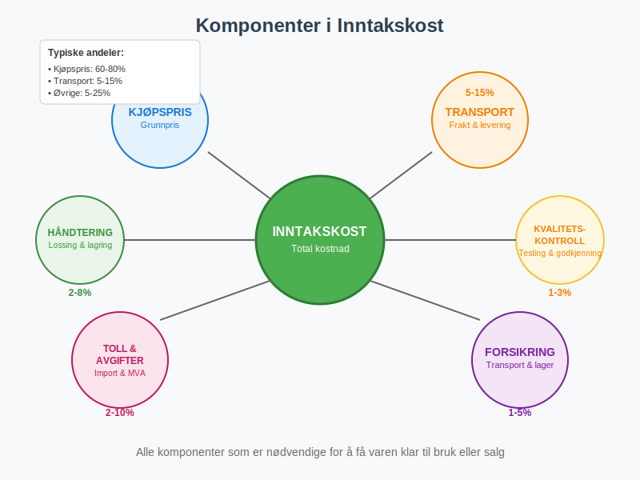
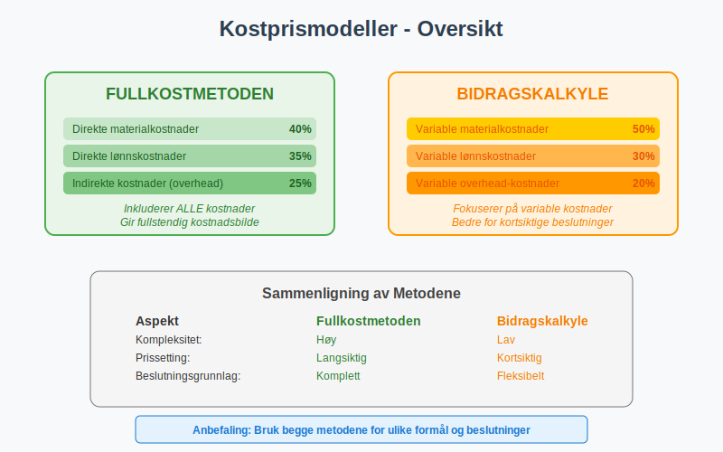
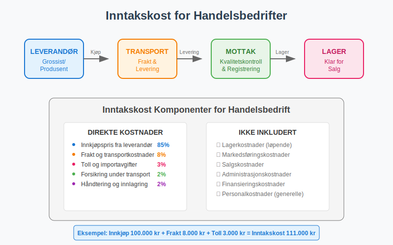
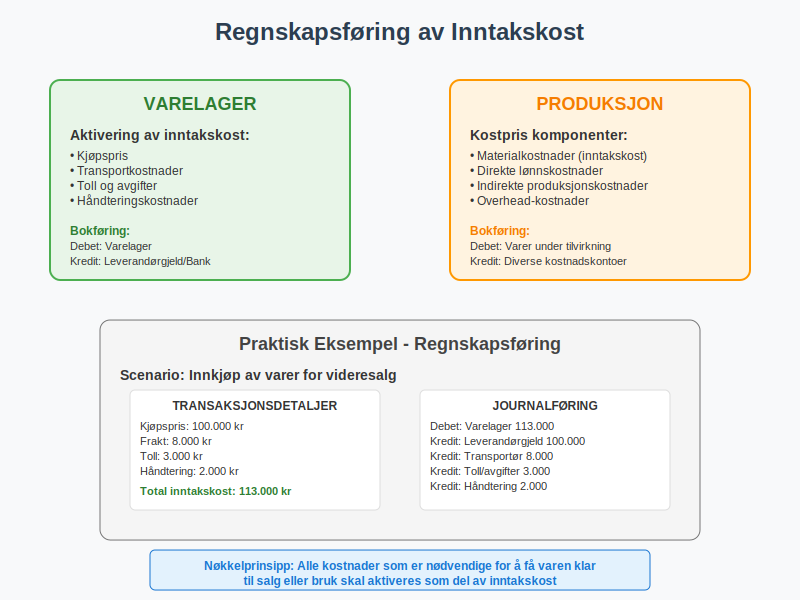
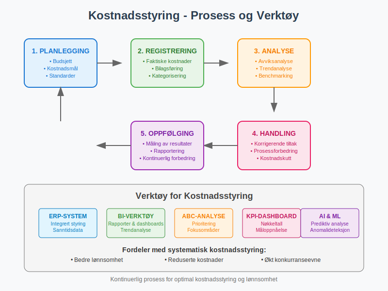
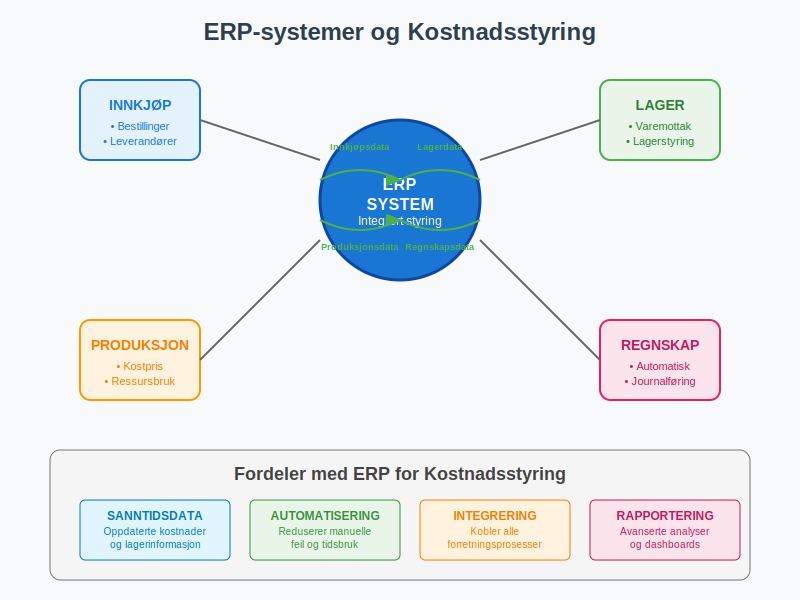

---
title: "Hva er inntakskost og kostpris?"
seoTitle: "Inntakskost og kostpris | Definisjon, beregning og regnskap"
description: "Inntakskost og kostpris beskriver totale kostnader ved å anskaffe eller produsere varer og tjenester. Lær hvordan du beregner kostpris, hva som inngår i inntakskost, og hvordan riktig regnskapsføring påvirker lagerverdi, prissetting og lønnsomhet."
summary: "Kort forklaring av inntakskost og kostpris med eksempler på beregning, hva som inngår, og hvordan det påvirker regnskap og prissetting."
---

**Inntakskost** og **kostpris** er fundamentale begreper i regnskapsføring og økonomistyring som beskriver de totale kostnadene knyttet til anskaffelse, produksjon eller levering av varer og tjenester. Disse begrepene er avgjørende for korrekt [regnskapsføring](/blogs/regnskap/hva-er-regnskap "Hva er Regnskap? Komplett Guide til Regnskapsføring"), lønnsomhetsanalyse og prissetting av produkter og tjenester.

## Seksjon 1: Definisjon og Grunnleggende Prinsipper

### 1.1 Hva er Inntakskost?

**Inntakskost** refererer til den totale kostnaden for å anskaffe varer eller tjenester, inkludert alle direkte og indirekte kostnader som er nødvendige for å få varene eller tjenestene klar for bruk eller salg. Dette begrepet brukes ofte i sammenheng med varelager og innkjøp.

### 1.2 Hva er Kostpris?

**Kostpris** er et bredere begrep som omfatter alle kostnader knyttet til produksjon, anskaffelse eller levering av et produkt eller en tjeneste. Kostpris danner grunnlaget for prissetting og lønnsomhetsberegninger.

### 1.3 Sammenheng med Andre Kostnadsbegreper

Inntakskost og kostpris henger nært sammen med andre viktige kostnadsbegreper:

* **[Anskaffelseskost](/blogs/regnskap/hva-er-anskaffelseskost "Hva er Anskaffelseskost? Beregning, Komponenter og Regnskapsføring"):** Kostnaden for å anskaffe [anleggsmidler](/blogs/regnskap/hva-er-anleggsmidler "Hva er Anleggsmidler? Komplett Guide til Faste Eiendeler i Regnskap")
* **[Driftskostnader](/blogs/regnskap/hva-er-driftskostnader "Hva er Driftskostnader? Komplett Guide til Løpende Bedriftskostnader"):** Løpende kostnader for drift av virksomheten
* **Produksjonskost:** Kostnader direkte knyttet til produksjon av varer

## Seksjon 2: Komponenter i Inntakskost

### 2.1 Direkte Innkjøpskostnader

De grunnleggende komponentene i inntakskost inkluderer:

#### Hovedkomponenter:

* **Kjøpspris:** Det faktiske beløpet betalt til leverandør
* **Transportkostnader:** Frakt og leveringskostnader (dokumentert med [fraktbrev](/blogs/regnskap/hva-er-fraktbrev "Hva er Fraktbrev? Komplett Guide til Transportdokumenter og Regnskapsføring"))
* **Toll og avgifter:** Importavgifter og ikke-refunderbar MVA
* **Forsikring under transport:** Kostnader for å sikre varene under transport
* **Håndteringskostnader:** Lossing, lasting og lagring

### 2.2 Indirekte Kostnader

Visse indirekte kostnader kan også inngå i inntakskost:

| Kostnadselement | Inkluderes | Kommentar |
|:----------------|:-----------|:----------|
| Kvalitetskontroll | Ja | Nødvendig for å sikre varekvalitet |
| Lagerkostnader (kortsiktig) | Ja | Direkte knyttet til mottak |
| Administrasjonskostnader | Nei | Generelle overhead-kostnader |
| Finansieringskostnader | Nei | Renter på kreditt |
| Markedsføringskostnader | Nei | Ikke direkte knyttet til anskaffelse |

## Seksjon 3: Beregning av Kostpris

### 3.1 Kostprismodeller

Det finnes flere metoder for å beregne kostpris avhengig av virksomhetens art:

#### 3.1.1 Fullkostmetoden

Fullkostmetoden inkluderer alle kostnader - både direkte og indirekte:

**Kostpris = Direkte materialkostnader + Direkte lønnskostnader + Indirekte kostnader**

#### 3.1.2 Bidragskalkyle

Bidragskalkyle fokuserer på variable kostnader:

**Kostpris = Variable materialkostnader + Variable lønnskostnader + Variable overhead**

### 3.2 Praktisk Eksempel: Produksjonsbedrift

La oss se på et detaljert eksempel for en produksjonsbedrift:

**Scenario:** Et møbelfirma produserer spisebord.

#### Kostnadsoppstilling per bord:

| Kostnadselement | Beløp (NOK) | Type |
|:----------------|:------------|:-----|
| **Direkte materialkostnader:** | | |
| Trevirke | 800 | Direkte |
| Beslag og skruer | 150 | Direkte |
| Lim og finish | 100 | Direkte |
| **Direkte lønnskostnader:** | | |
| Snekkerarbeid (8 timer × 400 kr) | 3 200 | Direkte |
| **Indirekte kostnader:** | | |
| Maskinleie (allokert) | 200 | Indirekte |
| Strøm og oppvarming | 100 | Indirekte |
| Kvalitetskontroll | 50 | Indirekte |
| **Total kostpris** | **4 600** | |

## Seksjon 4: Inntakskost for Ulike Bransjer

### 4.1 Handelsbedrifter

For handelsbedrifter er inntakskost særlig viktig for [varelager](/blogs/regnskap/hva-er-varelager "Hva er Varelager? Komplett Guide til Lagerføring og Verdsettelse"):

#### Typiske komponenter:

* **Innkjøpspris:** Pris fra grossist eller produsent
* **Transportkostnader:** Frakt til lager
* **Tollkostnader:** Ved import av varer
* **Lagerkostnader:** Mottak og innlagring
* **Forsikring:** Dekning under transport og lagring

### 4.2 Produksjonsbedrifter

For produksjonsbedrifter er kostpris mer kompleks:

#### Materialkostnader:
* **Råmaterialer:** Hovedingredienser i produktet
* **Hjelpematerialer:** Emballasje, etiketter, etc.
* **Innkjøpskostnader:** Transport og håndtering av materialer

#### Lønnskostnader:
* **Direkte lønn:** Arbeidere som jobber direkte med produktet
* **Indirekte lønn:** Formenn, kvalitetskontrollører
* **Sosiale kostnader:** Arbeidsgiveravgift, feriepenger

### 4.3 Tjenestebedrifter

For tjenestebedrifter fokuserer kostpris på:

* **Lønnskostnader:** Hovedkomponenten i de fleste tjenester
* **Reisekostnader:** Transport til kunde
* **Materialkostnader:** Forbruksmateriell og utstyr
* **Overhead:** Kontorlokaler, IT-systemer

## Seksjon 5: Regnskapsføring og Praktisk Anvendelse

### 5.1 Regnskapsføring av Inntakskost

Korrekt regnskapsføring av inntakskost følger [bokføringsloven](/blogs/regnskap/hva-er-bokforingsloven "Hva er Bokføringsloven? Komplett Guide til Norske Bokføringsregler") og [god regnskapsskikk](/blogs/regnskap/god-regnskapsskikk "God Regnskapsskikk: Prinsipper og Praktisk Anvendelse"):

#### Hovedprinsipper:

* **Sammenstilling:** Alle kostnader som hører sammen skal sammenstilles
* **Forsiktighet:** Usikre kostnader skal vurderes konservativt
* **Vesentlighet:** Små beløp kan behandles forenklet

### 5.2 Påvirkning på Nøkkeltall

Korrekt beregning av inntakskost og kostpris påvirker viktige nøkkeltall:

| Nøkkeltall | Påvirkning | Betydning |
|:-----------|:-----------|:----------|
| [Bruttofortjeneste](/blogs/regnskap/hva-er-bruttofortjeneste "Hva er Bruttofortjeneste? Beregning og Analyse") | Direkte | Høyere kostpris = lavere bruttofortjeneste |
| Lagerverdi | Direkte | Inntakskost bestemmer lagerverdi |
| [Dekningsbidrag](/blogs/regnskap/hva-er-dekningsbidrag "Hva er Dekningsbidrag? Beregning og Analyse") | Indirekte | Påvirker variable kostnader |
| Prissetting | Strategisk | Grunnlag for salgspris |

### 5.3 Utfordringer og Fallgruver

#### Vanlige feil ved beregning av inntakskost:

* **Glemte kostnader:** Ikke alle relevante kostnader inkluderes
* **Feil allokering:** Indirekte kostnader fordeles feil
* **Timing:** Kostnader regnskapsføres på feil tidspunkt
* **Valutasvingninger:** Ikke hensyntatt ved import

## Seksjon 6: Strategisk Betydning og Analyse

### 6.1 Kostnadsstyring

Effektiv styring av inntakskost og kostpris er avgjørende for lønnsomhet:

#### Styringsverktøy:

* **Budsjettsammenligning:** Faktisk vs. budsjettert kostpris
* **Trendanalyse:** Utvikling over tid
* **Benchmarking:** Sammenligning med konkurrenter
* **ABC-analyse:** Fokus på de viktigste kostnadsdriverne

### 6.2 Prissettingsstrategi

Kostpris danner grunnlaget for strategisk prissetting:

#### Prissettingsmodeller:

* **Cost-plus:** Kostpris + ønsket margin
* **Markedsbasert:** Basert på konkurrentpriser
* **Verdibasert:** Basert på kundens opplevde verdi

### 6.3 Lønnsomhetsanalyse

Korrekt kostpris er essensielt for lønnsomhetsanalyse:

| Analyseområde | Anvendelse | Nytte |
|:--------------|:-----------|:------|
| Produktlønnsomhet | Sammenligne produkter | Fokusere på lønnsomme produkter |
| Kundelønnsomhet | Analysere kundesegmenter | Optimalisere kundeportefølje |
| Kanallønnsomhet | Vurdere salgskanaler | Prioritere effektive kanaler |

## Seksjon 7: Digitalisering og Moderne Verktøy

### 7.1 ERP-systemer og Kostnadsstyring

Moderne [ERP-systemer](/blogs/regnskap/hva-er-erp-system "Hva er ERP-system? Komplett Guide til Enterprise Resource Planning") har revolusjonert kostnadsstyring:

#### Fordeler med digitale løsninger:

* **Automatisering:** Reduserer manuelle feil
* **Sanntidsdata:** Oppdatert kostnadsinformasjon
* **Integrering:** Kobler sammen alle forretningsprosesser
* **Rapportering:** Avanserte analysemuligheter

### 7.2 Kunstig Intelligens og Kostprisprognoser

AI og maskinlæring brukes stadig mer for:

* **Kostnadsprognoser:** Prediktive modeller for fremtidige kostnader
* **Anomalideteksjon:** Identifisere uvanlige kostnadsmønstre
* **Optimalisering:** Foreslå kostnadsbesparelser
* **Automatisk kategorisering:** Klassifisere kostnader automatisk

## Seksjon 8: Juridiske og Regulatoriske Aspekter

### 8.1 Skattemessige Konsekvenser

Kostprisberegning har direkte skattemessige konsekvenser:

#### Viktige prinsipper:

* **Fradragsrett:** Kun faktiske kostnader kan trekkes fra
* **Dokumentasjon:** Alle kostnader må dokumenteres med [bilag](/blogs/regnskap/hva-er-bilag "Hva er Bilag? Komplett Guide til Regnskapsbilag")
* **Timing:** Kostnader må periodiseres korrekt
* **Armslengdeprinsippet:** Ved transaksjoner mellom nærstående parter

### 8.2 Revisjonsaspekter

Revisorer fokuserer særlig på:

* **Fullstendighet:** Er alle kostnader inkludert?
* **Nøyaktighet:** Er kostnadene korrekt beregnet?
* **Klassifisering:** Er kostnadene riktig kategorisert?
* **Verdsettelse:** Er lager verdsatt til riktig kostpris?

## Konklusjon

**Inntakskost** og **kostpris** er fundamentale begreper som påvirker alle aspekter av bedriftens økonomi - fra daglig drift til strategiske beslutninger. Korrekt forståelse og beregning av disse kostnadene er avgjørende for:

* **Lønnsomhetsanalyse:** Forstå hvilke produkter og tjenester som skaper verdi
* **Prissetting:** Sette konkurransedyktige priser som sikrer lønnsomhet
* **Kostnadsstyring:** Identifisere og redusere unødvendige kostnader
* **Regnskapsføring:** Overholde juridiske krav og god regnskapsskikk

Ved å implementere systematiske prosesser for kostnadsstyring og utnytte moderne teknologi, kan bedrifter oppnå bedre kontroll over sine kostnader og forbedre sin konkurranseevne i markedet.

For ytterligere informasjon om relaterte emner, se våre artikler om [anskaffelseskost](/blogs/regnskap/hva-er-anskaffelseskost "Hva er Anskaffelseskost? Beregning, Komponenter og Regnskapsføring"), [driftskostnader](/blogs/regnskap/hva-er-driftskostnader "Hva er Driftskostnader? Komplett Guide til Løpende Bedriftskostnader") og [avskrivning](/blogs/regnskap/hva-er-avskrivning "Hva er Avskrivning? Metoder, Beregning og Regnskapsføring").

