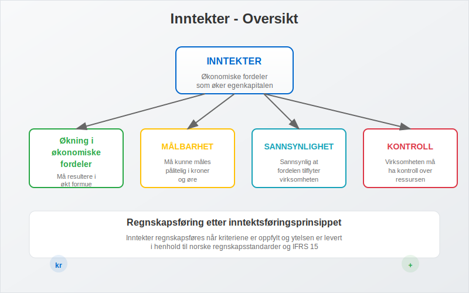
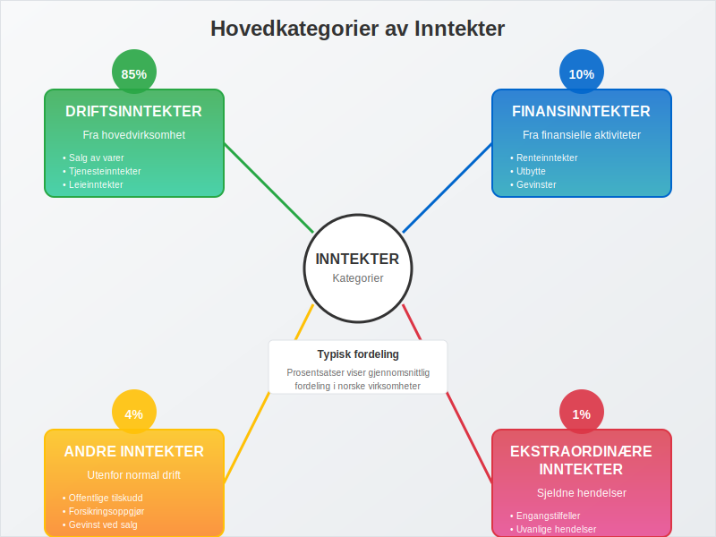
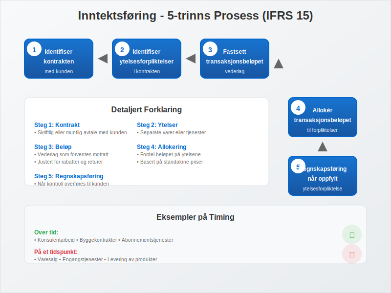
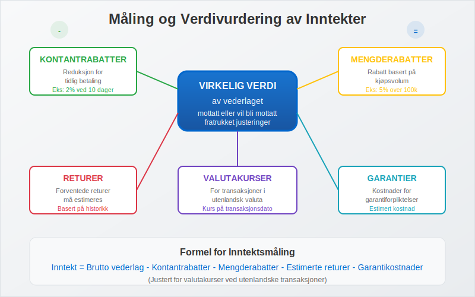
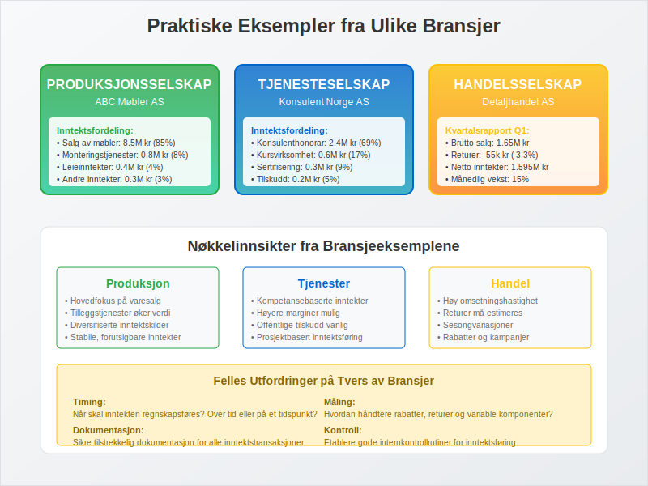
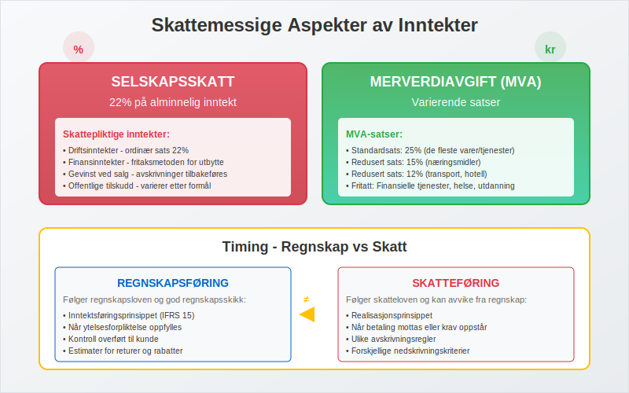
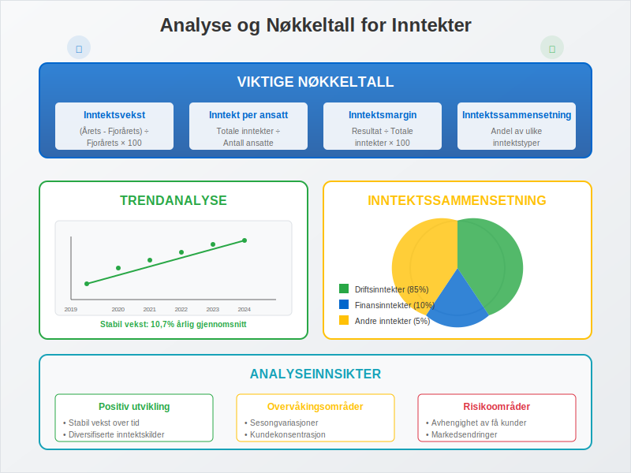
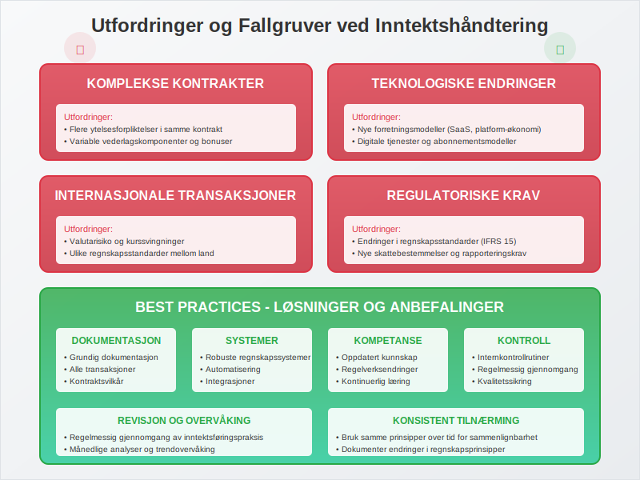
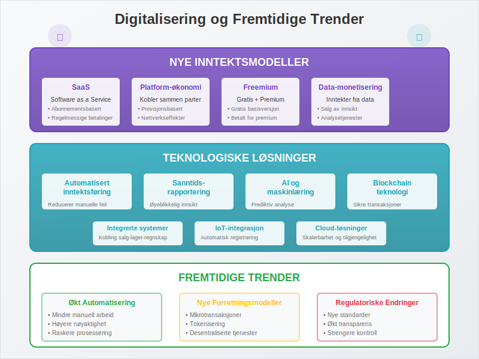

---
title: "Hva er inntekter?"
seoTitle: "Hva er inntekter?"
meta_description: '**Inntekter** er alle økonomiske fordeler som tilflyter en virksomhet i løpet av en regnskapsperiode, og som øker [egenkapitalen](/blogs/regnskap/hva-er-egen...'
slug: hva-er-inntekter
type: blog
layout: pages/single
---

**Inntekter** er alle økonomiske fordeler som tilflyter en virksomhet i løpet av en regnskapsperiode, og som øker [egenkapitalen](/blogs/regnskap/hva-er-egenkapital "Hva er Egenkapital? Komplett Guide til Egenkapital i Regnskap") uten at det skyldes tilskudd fra eierne. Inntekter utgjør grunnlaget for virksomhetens lønnsomhet og er avgjørende for å vurdere selskapets økonomiske prestasjoner og fremtidige potensial. Det er viktig å skille mellom inntekter og [omsetning](/blogs/regnskap/hva-er-omsetning "Hva er Omsetning? Komplett Guide til Omsetning i Regnskap og Skatt"), hvor omsetning inkluderer merverdiavgift mens inntekter måles eksklusive MVA.

For en detaljert gjennomgang av hvordan **alminnelig inntekt** beregnes og påvirker skatteplikten, se [Alminnelig inntekt](/blogs/regnskap/alminnelig-inntekt "Alminnelig inntekt “ Definisjon og Beregning").

For selvstendig næringsdrivende brukes begrepet **næringsinntekt**. Les mer i [Næringsinntekt](/blogs/regnskap/naeringsinntekt "Næringsinntekt “ Komplett guide til næringsinntekt for selvstendig næringsdrivende").

## Definisjon og Grunnleggende Prinsipper

Inntekter defineres som **økonomiske ressurser** som øker virksomhetens totale formue gjennom normal forretningsdrift eller andre aktiviteter. I henhold til norske regnskapsstandarder må inntekter oppfylle spesifikke kriterier for å kunne regnskapsføres.



### Kjennetegn ved Inntekter:

* **Økning i økonomiske fordeler:** Må resultere i økt formue
* **Målbarhet:** Må kunne måles pålitelig i kroner
* **Sannsynlighet:** Det må være sannsynlig at fordelen tilflyter virksomheten
* **Kontroll:** Virksomheten må ha kontroll over ressursen

## Hovedkategorier av Inntekter

Inntekter kan klassifiseres i flere hovedkategorier basert på deres opprinnelse og karakter. Denne klassifiseringen er viktig for korrekt regnskapsføring og analyse.



### Oversikt over Inntektstyper:

| Kategori | Beskrivelse | Eksempler | Regnskapspost |
|----------|-------------|-----------|---------------|
| **[Driftsinntekter](/blogs/regnskap/hva-er-driftsinntekter "Hva er Driftsinntekter? Komplett Guide til Driftsinntekter i Regnskap")** | Inntekter fra hovedvirksomhet | Salg av varer/tjenester | Driftsinntekter |
| **[Finansinntekter](/blogs/regnskap/finansinntekt "Finansinntekt “ Komplett guide til renter, utbytte og kapitalgevinster i norsk regnskap")** | Inntekter fra finansielle aktiviteter | Renter, utbytte, gevinster | Finansinntekter |
| **Andre inntekter** | Inntekter utenfor normal drift | Tilskudd, gevinst ved salg | Andre inntekter |
| **Ekstraordinære inntekter** | Sjeldne og uvanlige hendelser | Forsikringsoppgjør | Ekstraordinære poster |

### 1. Driftsinntekter

**Driftsinntekter** er inntekter som oppstår fra virksomhetens ordinære og regelmessige forretningsaktiviteter.

**Hovedtyper av driftsinntekter:**

* **Salgsinntekter:** Inntekter fra salg av varer
* **Tjenesteinntekter:** Inntekter fra leverte tjenester
* **Leieinntekter:** Inntekter fra utleie av eiendeler
* **Royalty-inntekter:** Inntekter fra lisensavtaler
* **Provisjonsinntekter:** Inntekter fra formidlingsvirksomhet

### 2. [Finansinntekter](/blogs/regnskap/finansinntekt "Finansinntekt “ Komplett guide til renter, utbytte og kapitalgevinster i norsk regnskap")

**[Finansinntekter](/blogs/regnskap/finansinntekt "Finansinntekt “ Komplett guide til renter, utbytte og kapitalgevinster i norsk regnskap")** omfatter alle inntekter som oppstår fra virksomhetens finansielle investeringer og aktiviteter.

**Eksempler på finansinntekter:**

* **Renteinntekter:** Fra bankinnskudd, lån til andre, obligasjoner
* **Utbytteinntekter:** Fra investeringer i andre selskaper
* **Gevinst ved salg:** Av finansielle instrumenter
* **Valutagevinster:** Fra valutaomregning og valutahandel
* **Gevinst ved salg av [anleggsmidler](/blogs/regnskap/hva-er-anleggsmidler "Hva er Anleggsmidler? Komplett Guide til Anleggsmidler i Regnskap")**

### 3. Andre Inntekter

**Andre inntekter** inkluderer inntekter som ikke naturlig hører hjemme under drift eller finans.

**Eksempler:**

* **Offentlige tilskudd:** Støtte fra det offentlige
* **Forsikringsoppgjør:** Erstatninger fra forsikringsselskaper
* **Gevinst ved salg av anleggsmidler:** Som ikke er finansielle
* **Leieinntekter:** Fra eiendommer som ikke brukes i driften

## Regnskapsføring av Inntekter

Regnskapsføring av inntekter følger **inntektsføringsprinsippet** og må oppfylle spesifikke kriterier i henhold til norske regnskapsstandarder.



### Kriterier for Inntektsføring (IFRS 15):

1. **Identifiser kontrakten:** Med kunden
2. **Identifiser ytelsesforpliktelser:** I kontrakten
3. **Fastsett transaksjonsbeløpet:** Vederlag som forventes mottatt
4. **Allokér transaksjonsbeløpet:** Til ytelsesforpliktelsene
5. **Regnskapsføring:** Når ytelsesforpliktelsen oppfylles

### Timing av Inntektsføring:

| Inntektstype | Tidspunkt for føring | Eksempel |
|--------------|---------------------|----------|
| **Varesalg** | Ved levering/overgang av kontroll | Salg i butikk |
| **Tjenester** | Når tjenesten leveres | Konsulentarbeid |
| **Renter** | Løpende over tid | Bankinnskudd |
| **Royalty** | Når opptjent | Lisensavtaler |
| **Utbytte** | Ved vedtak om utdeling | Aksjeutbytte |

### Bokføringseksempel - Salg av Varer:

**Ved salg av varer for 50 000 kr (eks. mva):**
```
Debet: Kundefordringer     62 500  (inkl. 25% mva)
Kredit: Salgsinntekter     50 000
Kredit: Utgående mva       12 500
```

**Ved mottak av betaling:**
```
Debet: Bank                62 500
Kredit: Kundefordringer    62 500
```

## Måling og Verdivurdering av Inntekter

Inntekter skal måles til **virkelig verdi** av vederlaget som er mottatt eller vil bli mottatt, fratrukket rabatter, returer og lignende.



### Faktorer som Påvirker Måling:

* **Kontantrabatter:** Reduksjon for tidlig betaling
* **Mengderabatter:** Rabatt basert på kjøpsvolum
* **Returer:** Forventede returer må estimeres og håndteres gjennom [kreditnotaer](/blogs/regnskap/hva-er-kreditnota "Hva er en Kreditnota? Komplett Guide til Kreditnotaer i Norge")
* **Garantier:** Kostnader for garantiforpliktelser
* **Valutakurser:** For transaksjoner i utenlandsk valuta

### Eksempel på Kompleks Inntektsmåling:

**Situasjon:** Salg av programvare med support-avtale

**Kontraktsverdi:** 120 000 kr over 12 måneder
* Programvare (engangsleveranse): 80 000 kr
* Support (løpende tjeneste): 40 000 kr

**Regnskapsføring:**
* Programvare: 80 000 kr ved levering
* Support: 40 000 kr ÷ 12 = 3 333 kr per måned

## Praktiske Eksempler fra Ulike Bransjer

La oss se på hvordan inntekter håndteres i praksis gjennom eksempler fra forskjellige bransjer.



### Eksempel 1: Produksjonsselskap

**ABC Møbler AS - Årsresultat 2024:**

| Inntektstype | Beløp | Andel |
|--------------|-------|-------|
| Salg av møbler | 8 500 000 kr | 85% |
| Monteringstjenester | 800 000 kr | 8% |
| Leieinntekter (lokaler) | 400 000 kr | 4% |
| Renteinntekter | 200 000 kr | 2% |
| Gevinst ved salg av maskiner | 100 000 kr | 1% |
| **Totale inntekter** | **10 000 000 kr** | **100%** |

**Klassifisering:**
* **Driftsinntekter:** 9 300 000 kr (93%)
* **Finansinntekter:** 200 000 kr (2%)
* **Andre inntekter:** 500 000 kr (5%)

### Eksempel 2: Tjenesteselskap

**Konsulent Norge AS - Inntektsstruktur:**

**Driftsinntekter:**
* Konsulenthonorar: 2 400 000 kr
* Kursvirksomhet: 600 000 kr
* Sertifiseringstjenester: 300 000 kr
* **Sum driftsinntekter: 3 300 000 kr**

**Andre inntekter:**
* Offentlige tilskudd (kompetanseutvikling): 150 000 kr
* Finansinntekter: 50 000 kr
* **Totale inntekter: 3 500 000 kr**

### Eksempel 3: Handelsselskap

**Detaljhandel AS - Månedlig inntektsrapport:**

| Måned | Salgsinntekter | Returer | Netto inntekter |
|-------|----------------|---------|-----------------|
| Januar | 450 000 kr | -15 000 kr | 435 000 kr |
| Februar | 520 000 kr | -18 000 kr | 502 000 kr |
| Mars | 680 000 kr | -22 000 kr | 658 000 kr |
| **Q1 Total** | **1 650 000 kr** | **-55 000 kr** | **1 595 000 kr** |

## Skattemessige Aspekter av Inntekter

Inntekter har betydelige skattemessige konsekvenser som virksomheter må være oppmerksomme på.



### Skatteplikt for Ulike Inntektstyper:

| Inntektstype | Skatteplikt | Særlige regler |
|--------------|-------------|----------------|
| **Driftsinntekter** | Skattepliktig | Ordinær selskapsskatt 22% |
| **Finansinntekter** | Skattepliktig | Fritaksmetoden for utbytte |
| **Gevinst ved salg** | Skattepliktig | Avskrivninger tilbakeføres |
| **Offentlige tilskudd** | Varierer | Avhenger av formål |

### Timing - Regnskap vs Skatt:

**Regnskapsføring:** Følger regnskapsloven og god regnskapsskikk
**Skatteføring:** Følger skatteloven og kan avvike fra regnskapet

**Vanlige forskjeller:**
* **Avskrivninger:** Ulike satser og metoder
* **Nedskrivninger:** Ulike kriterier
* **Inntektsføring:** Ulike tidspunkter

### Merverdiavgift (MVA):

**MVA-pliktige inntekter:**
* De fleste salg av varer og tjenester
* Standardsats: 25%
* Redusert sats: 15% (næringsmidler) og 12% (transport, hotell)

**MVA-fritatte inntekter:**
* Finansielle tjenester
* Helse- og sosialtjenester
* Undervisning
* Utleie av fast eiendom (med unntak)

## Analyse og Nøkkeltall for Inntekter

Inntekter danner grunnlaget for viktige nøkkeltall som brukes til å vurdere virksomhetens prestasjoner.



### Viktige Nøkkeltall:

| Nøkkeltall | Formel | Betydning |
|------------|--------|-----------|
| **Inntektsvekst** | ((Årets inntekter - Fjorårets) ÷ Fjorårets) × 100 | Vekstrate |
| **Inntekt per ansatt** | Totale inntekter ÷ Antall ansatte | Produktivitet |
| **Inntektsmargin** | (Resultat ÷ Totale inntekter) × 100 | Lønnsomhet |
| **Inntektssammensetning** | Andel av ulike inntektstyper | Diversifisering |

### Trendanalyse - Eksempel:

**Selskap XYZ - 5-års inntektsutvikling:**

| År | Driftsinntekter | Finansinntekter | Totalt | Vekst |
|----|-----------------|-----------------|--------|-------|
| 2020 | 5 000 000 kr | 100 000 kr | 5 100 000 kr | - |
| 2021 | 5 500 000 kr | 120 000 kr | 5 620 000 kr | 10,2% |
| 2022 | 6 200 000 kr | 90 000 kr | 6 290 000 kr | 11,9% |
| 2023 | 6 800 000 kr | 110 000 kr | 6 910 000 kr | 9,9% |
| 2024 | 7 500 000 kr | 150 000 kr | 7 650 000 kr | 10,7% |

**Analyse:**
* Stabil vekst i driftsinntekter (gjennomsnitt 10,7% årlig)
* Varierende finansinntekter
* Sunn inntektssammensetning med fokus på drift

## Utfordringer og Fallgruver

Ved håndtering av inntekter møter virksomheter flere utfordringer som krever oppmerksomhet og gode rutiner.



### Vanlige Utfordringer:

1. **Komplekse kontrakter**
   - Flere ytelsesforpliktelser
   - Variable vederlags komponenter
   - Langsiktige avtaler

2. **Teknologiske endringer**
   - Nye forretningsmodeller
   - Digitale tjenester
   - Abonnementsmodeller

3. **Internasjonale transaksjoner**
   - Valutarisiko
   - Ulike regnskapsstandarder
   - Skattemessige komplekser

4. **Regulatoriske krav**
   - Endringer i regnskapsstandarder
   - Nye skattebestemmelser
   - Rapporteringskrav

### Best Practices:

* **Dokumentasjon:** Grundig dokumentasjon av alle inntektstransaksjoner
* **Systemer:** Implementer robuste regnskapssystemer
* **Kompetanse:** Sørg for oppdatert kunnskap om regelverk
* **Kontroll:** Etabler sterke internkontrollrutiner
* **Revisjon:** Regelmessig gjennomgang av inntektsføringspraksis

## Digitalisering og Fremtidige Trender

Digitaliseringen endrer hvordan inntekter genereres, måles og rapporteres.



### Nye Inntektsmodeller:

* **Software as a Service (SaaS):** Abonnementsbaserte tjenester
* **Platform-økonomi:** Inntekter fra å koble sammen parter
* **Freemium-modeller:** Gratis basis, betalt for premium
* **Data-monetisering:** Inntekter fra data og analyser
* **Mikrotransaksjoner:** Små, hyppige betalinger

### Teknologiske Løsninger:

* **Automatisert inntektsføring:** Reduserer manuelle feil
* **Sanntidsrapportering:** Øyeblikkelig innsikt i inntektsstrømmer
* **AI og maskinlæring:** Prediktiv analyse og prognoser
* **Blockchain:** Transparente og sikre transaksjoner
* **IoT-integrasjon:** Automatisk registrering av transaksjoner

## Internasjonale Perspektiver

Inntektsregnskapet varierer mellom ulike land og regnskapsstandarder.

### Sammenligning av Standarder:

| Standard | Fokus | Hovedprinsipp |
|----------|-------|---------------|
| **IFRS 15** | Internasjonal | Kontroll-basert tilnærming |
| **US GAAP** | USA | Lignende IFRS 15 |
| **Norske GAAP** | Norge | Basert på IFRS med tilpasninger |

### Utfordringer ved Internasjonal Virksomhet:

* **Valutaomregning:** Håndtering av utenlandske inntekter
* **Skatteoptimalisering:** Lovlig minimering av skattebyrde
* **Rapporteringskrav:** Ulike krav i forskjellige land
* **Internprising:** Prising mellom konsernselskaper

## Konklusjon

**Inntekter** er det fundamentale elementet i enhver virksomhets økonomi og representerer verdiskapingen som gjør det mulig for selskaper å eksistere og vokse. Forståelse av inntektsbegrepet, de ulike typene inntekter og hvordan de regnskapsføres er avgjørende for:

* **Ledelse:** Å ta informerte beslutninger om strategi og drift
* **Investorer:** Å vurdere selskapets prestasjoner og potensial
* **Kreditorer:** Å vurdere selskapets evne til å betjene forpliktelser
* **Skattemyndigheter:** Å sikre korrekt skatteberegning og innbetaling

### Nøkkelpunkter å Huske:

* **Klassifisering:** Korrekt klassifisering av ulike inntektstyper
* **Timing:** Riktig tidspunkt for inntektsføring
* **Måling:** Nøyaktig verdivurdering av inntekter
* **Dokumentasjon:** Grundig dokumentasjon av alle transaksjoner
* **Analyse:** Regelmessig analyse av inntektstrender og -sammensetting

Ved å følge etablerte regnskapsprinsipper, implementere gode kontrollrutiner og holde seg oppdatert på nye utviklingstrender, kan virksomheter sikre at deres inntekter rapporteres korrekt og gir et rettvisende bilde av selskapets økonomiske situasjon.

For mer informasjon om relaterte regnskapstemaer, se våre artikler om [driftsinntekter](/blogs/regnskap/hva-er-driftsinntekter "Hva er Driftsinntekter? Komplett Guide til Driftsinntekter i Regnskap"), [bruttofortjeneste](/blogs/regnskap/hva-er-bruttofortjeneste "Hva er Bruttofortjeneste? Beregning og Analyse av Bruttomargin"), [regnskap](/blogs/regnskap/hva-er-regnskap "Hva er Regnskap? Komplett Guide til Regnskapsføring og Regnskapsanalyse") og [bokføring](/blogs/regnskap/hva-er-bokforing "Hva er Bokføring? Komplett Guide til Regnskapsføring").


