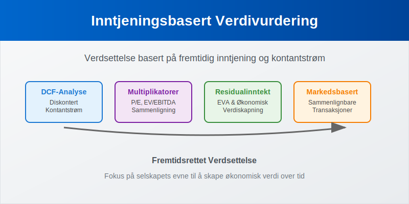
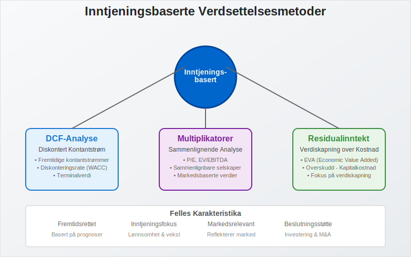
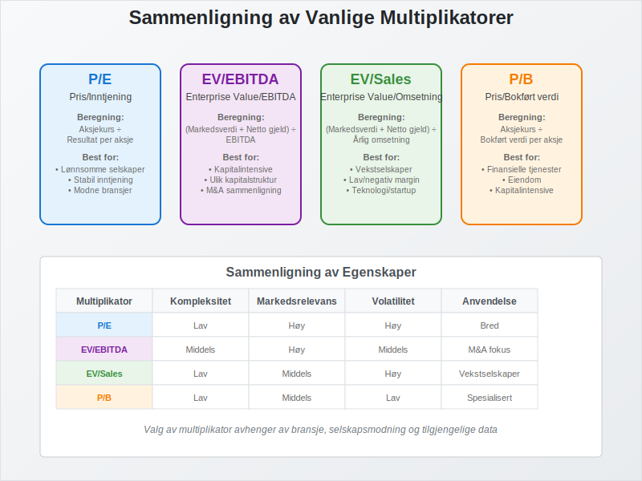
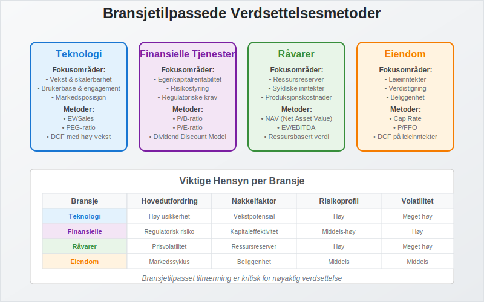
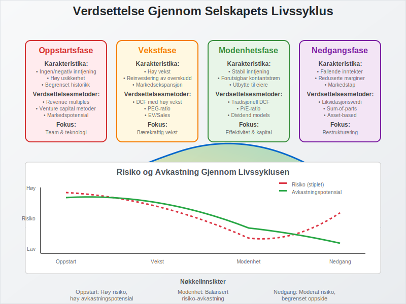

---
title: "Hva er Inntjeningsbasert Verdivurdering?"
meta_title: "Hva er Inntjeningsbasert Verdivurdering?"
meta_description: '**Inntjeningsbasert verdivurdering** er prosessen med å fastsette verdien av et selskap eller eiendel basert på dets evne til å generere fremtidig [inntjenin...'
slug: hva-er-inntjeningsbasert-verdivurdering
type: blog
layout: pages/single
---

**Inntjeningsbasert verdivurdering** er prosessen med å fastsette verdien av et selskap eller eiendel basert på dets evne til å generere fremtidig [inntjening](/blogs/regnskap/hva-er-driftsinntekter "Hva er Driftsinntekter? Komplett Guide til Inntektsføring og Regnskapsføring") og kontantstrøm. Dette er en **fundamental tilnærming** til verdsettelse som fokuserer på selskapets økonomiske prestasjon og fremtidsutsikter.



## Hva er Inntjeningsbasert Verdivurdering?

Inntjeningsbasert verdivurdering bygger på prinsippet om at verdien av et selskap eller eiendel er **direkte knyttet til dets evne** til å generere økonomisk avkastning over tid. I motsetning til [balansebasert verdivurdering](/blogs/regnskap/hva-er-balansebasert-verdivurdering "Balansebasert Verdivurdering - Metoder, Prinsipper og Praktisk Anvendelse") som fokuserer på bokførte verdier, ser inntjeningsbasert verdivurdering på:

* **Fremtidig inntjeningskapasitet** og vekstpotensial
* **Kontantstrømgenerering** og likviditetsskapning
* **Lønnsomhet** og operasjonell effektivitet
* **Risikoprofil** og markedsposisjon
* **Konkurransefortrinn** og bærekraftige fordeler

### Formål med Inntjeningsbasert Verdivurdering

Hovedformålene med inntjeningsbasert verdivurdering er å:

* **Fastsette markedsverdi** for investeringsformål
* **Støtte fusjoner og oppkjøp** (M&A-transaksjoner)
* **Vurdere investeringsalternativer** og kapitalallokering
* **Benchmarke prestasjon** mot konkurrenter
* **Identifisere verdiskapningsmuligheter** og forbedringspotensial

## Hovedmetoder for Inntjeningsbasert Verdivurdering



### 1. Diskontert Kontantstrøm (DCF)

**DCF-analyse** er den mest grunnleggende og teoretisk solide metoden for inntjeningsbasert verdivurdering. Metoden diskonterer fremtidige kontantstrømmer tilbake til nåverdi.

#### DCF-Beregning:

```
Selskapsverdi = Σ (Fri Kontantstrøm_t / (1 + WACC)^t) + Terminalverdi / (1 + WACC)^n
```

#### Komponenter i DCF-Analyse:

| Komponent | Beskrivelse | Beregning |
|-----------|-------------|-----------|
| **Fri Kontantstrøm** | Kontanter tilgjengelig for alle investorer | EBIT × (1-skattesats) + Avskrivninger - Capex - Endring i arbeidskapital |
| **WACC** | Vektet gjennomsnittlig kapitalkostnad | (E/V × Re) + (D/V × Rd × (1-T)) |
| **Terminalverdi** | Verdi utover prognoseperioden | FCF_terminal / (WACC - g) |
| **Vekstrate (g)** | Langsiktig vekstrate | Typisk 2-4% for modne markeder |

#### Fordeler med DCF:
* **Teoretisk solid:** Basert på fundamental verdiopprettelse
* **Fremtidsrettet:** Fokuserer på fremtidig verdiskapning
* **Fleksibel:** Kan tilpasses ulike bransjer og situasjoner
* **Detaljert:** Krever grundig analyse av forretningen

#### Ulemper med DCF:
* **Kompleks:** Krever mange antagelser og prognoser
* **Sensitiv:** Små endringer i input gir store utslag
* **Usikker:** Avhengig av kvaliteten på prognosene
* **Tidkrevende:** Krever omfattende analyse og modellering

### 2. Multiplikatormetoder

**Multiplikatormetoder** sammenligner selskapet med lignende selskaper eller transaksjoner ved hjelp av finansielle nøkkeltall.



#### Vanlige Multiplikatorer:

| Multiplikator | Beregning | Anvendelse |
|---------------|-----------|------------|
| **P/E** | Aksjekurs / Resultat per aksje | Lønnsomme selskaper med stabil inntjening |
| **EV/EBITDA** | Enterprise Value / EBITDA | Sammenligning på tvers av kapitalstrukturer |
| **EV/Sales** | Enterprise Value / Omsetning | Vekstselskaper med lav lønnsomhet |
| **P/B** | Aksjekurs / Bokført verdi per aksje | Kapitalintensive virksomheter |
| **PEG** | P/E / Vekstrate | Justerer P/E for vekst |

**Viktig:** P/E-forholdet kan også uttrykkes som earnings yield (1/P/E), som er nyttig for å sammenligne aksjeavkastning med andre yield-målinger. For mer om yield-analyse, se [yield](/blogs/regnskap/hva-er-yield "Hva er Yield? Komplett Guide til Yield-Analyse og Beregning i Regnskap").

#### Fordeler med Multiplikatorer:
* **Enkle:** Raske og intuitive beregninger
* **Markedsbaserte:** Reflekterer faktiske markedsverdier
* **Sammenlignbare:** Lett å benchmarke mot konkurrenter
* **Oppdaterte:** Basert på aktuelle markedsdata

#### Ulemper med Multiplikatorer:
* **Overfladiske:** Fanger ikke opp unike egenskaper
* **Markedsavhengige:** PÃ¥virket av markedssentiment
* **Begrenset:** Krever sammenlignbare selskaper
* **Statiske:** Reflekterer ikke fremtidsutsikter

### 3. Residualinntektsmodeller

**Residualinntektsmodeller** fokuserer på verdiskapning utover kapitalkostnaden.

#### Economic Value Added (EVA):
```
EVA = NOPAT - (Investert Kapital × WACC)
```

#### Residualinntekt:
```
Residualinntekt = Nettoresultat - (Egenkapital × Egenkapitalkostnad)
```

## Praktisk Anvendelse av Inntjeningsbasert Verdivurdering

### Verdsettelse i Ulike Bransjer

Ulike bransjer krever tilpassede tilnærminger til inntjeningsbasert verdivurdering:



#### Teknologiselskaper:
* **Fokus:** Vekst og skalerbarhet
* **Metoder:** EV/Sales, P/E til vekst (PEG)
* **Utfordringer:** Høy usikkerhet og volatilitet

#### Finansielle Tjenester:
* **Fokus:** [Egenkapitalrentabilitet](/blogs/regnskap/hva-er-egenkapitalrentabilitet "Hva er Egenkapitalrentabilitet? Beregning, Analyse og Benchmarking") og risikostyring
* **Metoder:** P/B, P/E, Dividend Discount Model
* **Spesielle hensyn:** Regulatoriske kapitalkrav

#### RÃ¥vareselskaper:
* **Fokus:** Ressursreserver og sykliske inntekter
* **Metoder:** NAV (Net Asset Value), EV/EBITDA
* **Utfordringer:** Volatile råvarepriser

#### Eiendom:
* **Fokus:** Leieinntekter og verdistigning
* **Metoder:** Cap Rate, P/FFO (Funds From Operations)
* **Nøkkelfaktorer:** Beliggenhet og markedsutvikling

### Verdsettelse i Ulike Livssyklusfaser



#### Oppstartsfase:
* **Utfordringer:** Ingen eller negativ inntjening
* **Tilnærminger:** Revenue multiples, venture capital metoder
* **Fokus:** Markedspotensial og team

#### Vekstfase:
* **Karakteristika:** Høy vekst, reinvestering av overskudd
* **Metoder:** DCF med høye vekstantagelser, PEG
* **Risiko:** Usikkerhet om bærekraftig vekst

#### Modenhetsfase:
* **Egenskaper:** Stabil inntjening og kontantstrøm
* **Metoder:** Tradisjonell DCF, P/E, dividend models
* **Fokus:** Effektivitet og kapitalallokering

#### Nedgangsfase:
* **Situasjon:** Fallende inntekter og marginer
* **Tilnærminger:** Likvidasjonsverdi, sum-of-parts
* **Hensyn:** Restruktureringsmuligheter

## Faktorer som PÃ¥virker Inntjeningsbasert Verdivurdering

### Makroøkonomiske Faktorer

* **Renter:** PÃ¥virker diskonteringsraten og kapitalkostnaden
* **Inflasjon:** PÃ¥virker nominelle vekstrater og marginer
* **Økonomisk vekst:** Påvirker etterspørsel og markedsstørrelse
* **Valutakurser:** Viktig for internasjonale selskaper

### Selskapsspesifikke Faktorer

* **Konkurranseposisjon:** Markedsandel og differensiering
* **Ledelseskvalitet:** Strategisk visjon og utførelse
* **Finansiell struktur:** [Gjeldsgrad](/blogs/regnskap/hva-er-gjeld "Hva er Gjeld? Typer, Regnskapsføring og Finansiell Analyse") og likviditet
* **Operasjonell effektivitet:** Marginer og kapitalomsetning

### Bransjespesifikke Faktorer

* **Regulatoriske endringer:** PÃ¥virker kostnader og muligheter
* **Teknologisk utvikling:** Kan endre konkurranselandskapet
* **Markedsmodning:** PÃ¥virker vekstmuligheter
* **Syklikalitet:** PÃ¥virker stabilitet i inntjening

## Sammenligning: Inntjeningsbasert vs. Balansebasert Verdivurdering

| Aspekt | Inntjeningsbasert | Balansebasert |
|--------|-------------------|---------------|
| **Fokus** | Fremtidig verdiskapning | Nåværende eiendeler |
| **Tidshorisont** | Fremtidsrettet | Historisk/nåværende |
| **Kompleksitet** | Høy (prognoser kreves) | Middels til høy |
| **Markedsrelevans** | Høy for vekstselskaper | Høy for kapitalintensive |
| **Volatilitet** | Høy | Lav til middels |
| **Anvendelse** | M&A, investeringer | Kredittanalyse, forsikring |

## Utfordringer og Begrensninger

### Prognoseutfordringer

* **Usikkerhet:** Fremtiden er iboende usikker
* **Bias:** Overoptimisme i prognoser
* **Kompleksitet:** Mange variabler å vurdere
* **Tidshorisont:** Lengre prognoser blir mindre pålitelige

### Metodiske Begrensninger

* **Modellavhengighet:** Resultatet påvirkes av valg av modell
* **Inputsensitivitet:** Små endringer gir store utslag
* **Markedsanomalier:** Markeder er ikke alltid effisiente
* **Likviditetshensyn:** Ikke alle eiendeler er lett omsettelige

## Beste Praksis for Inntjeningsbasert Verdivurdering

### Grundig Analyse

* **Forstå forretningsmodellen:** Inntektskilder og kostnadsdrivere
* **Analyser historisk prestasjon:** Trender og syklikalitet
* **Vurder konkurranseposisjon:** Markedsandel og differensiering
* **Identifiser risikofaktorer:** Operasjonelle og finansielle risikoer

### Robuste Prognoser

* **Bruk multiple scenarier:** Base case, optimistisk, pessimistisk
* **Stress-test antagelser:** Sensitivitetsanalyse
* **Benchmarke mot bransjen:** Sammenlign med konkurrenter
* **Oppdater regelmessig:** Juster for nye informasjon

### Metodisk Tilnærming

* **Bruk flere metoder:** Triangulering av verdiestimat
* **Dokumenter antagelser:** Transparent og sporbar prosess
* **Kvalitetssikre data:** Verifiser kilder og beregninger
* **Kommuniser usikkerhet:** Presenter konfidensintervaller

## Regulatoriske og Standardmessige Hensyn

### IFRS og Virkelig Verdi

Under [IFRS](/blogs/regnskap/hva-er-ifrs "Hva er IFRS? International Financial Reporting Standards Forklart") kan inntjeningsbaserte metoder brukes for å fastsette virkelig verdi når:

* **Markedspriser ikke er tilgjengelige**
* **Eiendelen genererer kontantstrøm**
* **Metoden er konsistent med markedsdeltakeres tilnærming**

### Revisoriske Krav

Revisorer må vurdere:

* **Metodens egnethet** for den spesifikke situasjonen
* **Kvaliteten på underliggende antagelser**
* **Konsistens** i anvendelse over tid
* **Dokumentasjon** av verdsettelsesprosessen

## Fremtidige Utviklingstrekk

### Teknologisk Utvikling

* **Kunstig intelligens:** Forbedrede prognoser og mønstergjenkjenning
* **Big data:** Mer omfattende og detaljerte analyser
* **Automatisering:** Effektivisering av verdsettelsesprosesser
* **Real-time data:** Kontinuerlig oppdatering av verdiestimat

### ESG-Integrering

* **Bærekraftsfaktorer:** Integrering av miljø-, sosiale og styringsaspekter
* **Langsiktig verdiskapning:** Fokus på bærekraftige forretningsmodeller
* **Risikojustering:** Inkludering av ESG-relaterte risikoer
* **Regulatoriske krav:** Økende krav til ESG-rapportering

## Konklusjon

Inntjeningsbasert verdivurdering er en **kraftig og fleksibel tilnærming** til verdsettelse som fokuserer på selskapets evne til å skape økonomisk verdi. Mens metoden krever omfattende analyse og innebærer betydelig usikkerhet, gir den verdifull innsikt i:

* **Fremtidig verdiskapningspotensial**
* **Investeringsattraktivitet**
* **Strategiske muligheter**
* **Risiko-avkastning profil**

For å oppnå pålitelige resultater er det essensielt å:

* **Kombinere flere metoder** for triangulering
* **Forstå forretningsmodellen** grundig
* **Bruke robuste prognoser** med scenarioanalyse
* **Dokumentere antagelser** transparent
* **Oppdatere analysen** regelmessig

Inntjeningsbasert verdivurdering vil fortsette å være et **sentralt verktøy** for investorer, analytikere og ledelse i deres beslutningsprosesser, spesielt ettersom markeder blir mer komplekse og teknologidrevne.
