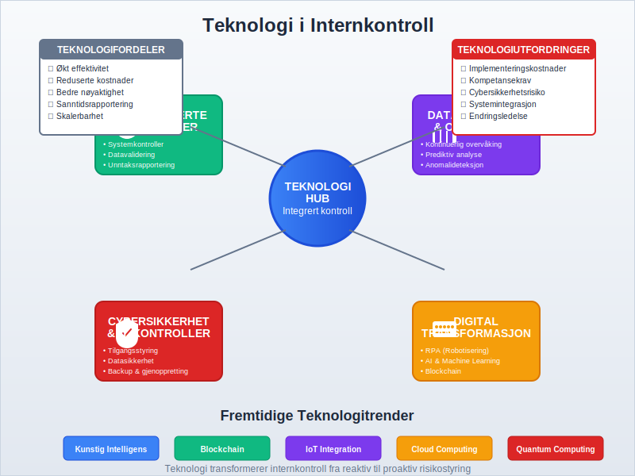

**Internkontroll** er et omfattende system av prosesser, retningslinjer og prosedyrer som er utformet for å sikre at en organisasjon oppnår sine mål innenfor operasjonell effektivitet, pålitelig finansiell rapportering og overholdelse av lover og forskrifter. Det er et kritisk styringssystem som beskytter organisasjonen mot risiko og sikrer at virksomheten drives på en kontrollert og ansvarlig måte. [Styret](/blogs/regnskap/hva-er-styre "Hva er Styre? Ansvar, Rolle og Oppgaver i Aksjeselskap") har det overordnede ansvaret for å etablere og overvåke effektive internkontrollsystemer.

I forbindelse med risikovurdering kan det også være nyttig å utføre en [SWOT-analyse](/blogs/regnskap/swot-analyse "SWOT-analyse: Guide for norske virksomheter") for å identifisere styrker, svakheter, muligheter og trusler.

En sentral aktør i arbeidsmiljøarbeidet er ogsÃ¥ [Arbeidsmiljøutvalg (AMU)](/blogs/regnskap/amu "AMU (Arbeidsmiljøutvalg) “ Komplett Guide til Arbeidsmiljøutvalg i Norge"), som bidrar til Ã¥ styrke samarbeidet om **HMS** og internkontroll i virksomheten. En annen viktig støttespiller er [Bedriftshelsetjeneste](/blogs/regnskap/bedriftshelsetjeneste "Bedriftshelsetjeneste “ Guide til Bedriftshelsetjeneste i Norge"), som tilbyr faglige helseundersøkelser og risikobedømmelser for ansatte.

For å forstå hvordan internkontroll integreres med den overordnede regnskapsføringen, er det viktig å ha kunnskap om [god regnskapsskikk](/blogs/regnskap/god-regnskapsskikk "God Regnskapsskikk - Prinsipper, Standarder og Beste Praksis i Norge"), som danner grunnlaget for pålitelig finansiell rapportering. Internkontroll arbeider tett sammen med [QA (Quality Assurance)](/blogs/regnskap/hva-er-qa-kvalitetssikring "Hva er QA (Quality Assurance) i Regnskap? Komplett Guide til Kvalitetssikring") for å sikre systematisk kvalitetssikring av regnskapsprosesser.

For spesifikke krav styrt av myndighetene, se ogsÃ¥ [Internkontrollforskriften](/blogs/regnskap/internkontrollforskriften "Internkontrollforskriften “ Krav, Struktur og Veiledning for Norske Virksomheter").

## Seksjon 1: Grunnleggende Prinsipper for Internkontroll

Internkontroll bygger på flere grunnleggende prinsipper som sammen skaper et robust kontrollmiljø. Disse prinsippene sikrer at organisasjonen kan identifisere, vurdere og håndtere risiko på en systematisk måte.

### 1.1 Definisjon og Formål

Internkontroll kan defineres som:

> Et system av prosesser som er utformet og implementert av ledelsen for å gi rimelig sikkerhet for oppnåelse av organisasjonens mål innenfor tre hovedkategorier: operasjonell effektivitet, pålitelig finansiell rapportering og overholdelse av gjeldende lover og forskrifter.

### 1.2 De Tre Hovedmålene for Internkontroll

Internkontroll har tre primære mål:

* **Operasjonell Effektivitet:** Sikre at organisasjonen bruker sine ressurser effektivt og oppnår sine operasjonelle mål
* **Pålitelig Finansiell Rapportering:** Garantere at [finansregnskapet](/blogs/regnskap/hva-er-finansregnskap "Hva er Finansregnskap? En Komplett Guide til Ekstern Finansiell Rapportering") og annen finansiell informasjon er nøyaktig og pålitelig
* **Overholdelse av Lover og Forskrifter:** Sikre at organisasjonen følger alle relevante juridiske krav og forskrifter

## Seksjon 2: COSO-Rammeverket for Internkontroll

**Committee of Sponsoring Organizations (COSO)** har utviklet det mest anerkjente rammeverket for internkontroll globalt. COSO-rammeverket består av fem integrerte komponenter som sammen skaper et helhetlig kontrollsystem.

### 2.1 De Fem Komponentene i COSO-Rammeverket

| Komponent | Beskrivelse | Nøkkelelementer |
|-----------|-------------|-----------------|
| **Kontrollmiljø** | Grunnlaget for alle andre komponenter | Ledelsesfilosofi, [integritet](/blogs/regnskap/integritet "Hva er Integritet i Regnskap? Betydning og Viktighet for Norske Virksomheter"), etiske verdier, kompetanse |
| **Risikovurdering** | Identifisering og analyse av risiko | Målsetting, risikoidentifikasjon, risikoanalyse, risikohåndtering |
| **Kontrollaktiviteter** | Retningslinjer og prosedyrer | Autorisasjon, dokumentasjon, verifikasjon, fysisk sikring |
| **Informasjon og Kommunikasjon** | Relevant informasjonsflyt | Rapporteringssystemer, kommunikasjonskanaler |
| **Overvåking** | Kontinuerlig evaluering | Løpende overvåking, separate evalueringer, rapportering av mangler |

### 2.2 Kontrollmiljøet - Fundamentet

Kontrollmiljøet er fundamentet i internkontrollsystemet og påvirker alle andre komponenter. Det omfatter:

* **Ledelsens [integritet](/blogs/regnskap/integritet "Hva er Integritet i Regnskap? Betydning og Viktighet for Norske Virksomheter") og Etiske Verdier:** Tonen fra toppen som setter standarden for hele organisasjonen
* **Forpliktelse til Kompetanse:** Sikre at ansatte har nødvendig kunnskap og ferdigheter
* **Styrets Deltakelse:** Aktivt styre som utøver uavhengig tilsyn
* **Ledelsesfilosofi og Driftsstil:** Hvordan ledelsen tilnærmer seg forretningsrisiko og kontroll
 * **Organisasjonsstruktur:** Klare ansvarslinjer og rapporteringsforhold
 * **Organisasjonskultur:** Felles verdier, holdninger og normer som påvirker kontrollmiljøet. Les mer om [Organisasjonskultur](/blogs/regnskap/organisasjonskultur "Organisasjonskultur: Innvirkning på Internkontroll og Regnskap").
* **Tildeling av Myndighet og Ansvar:** Tydelig definerte roller og ansvar

## Seksjon 3: Risikovurdering og Risikohåndtering

En viktig del av risikovurderingsprosessen er **due diligence**, spesielt i forbindelse med oppkjøp, investeringer og strukturelle endringer i virksomheten. Se vår [guide til Due diligence](/blogs/regnskap/due-diligence "Due diligence i Norske Oppkjøp: Prosess, Metodikk og Beste Praksis") for mer informasjon.

Risikovurdering er en kritisk komponent i internkontroll som innebærer identifisering, analyse og håndtering av risiko som kan påvirke organisasjonens evne til å oppnå sine mål.

### 3.1 Risikovurderingsprosessen

Risikovurdering følger en systematisk prosess:

1. **Målsetting:** Etablere klare, målbare mål på alle nivåer
2. **Risikoidentifikasjon:** Identifisere potensielle hendelser som kan påvirke måloppnåelse
3. **Risikoanalyse:** Vurdere sannsynlighet og konsekvens av identifiserte risikoer
4. **Risikohåndtering:** Velge passende respons på risiko

### 3.2 Risikokategorier

| Risikokategori | Beskrivelse | Eksempler |
|----------------|-------------|-----------|
| **Strategisk Risiko** | Risiko knyttet til strategiske beslutninger | Markedsendringer, konkurranse, teknologiutvikling |
| **Operasjonell Risiko** | Risiko i daglige operasjoner | Prosessfeil, systemsvikt, menneskelige feil |
| **Finansiell Risiko** | Risiko knyttet til finansielle forhold | Kredittrisiko, likviditetsrisiko, valutarisiko |
| **Compliance Risiko** | Risiko for brudd på lover og forskrifter | Regulatoriske endringer, juridiske krav |

### 3.3 Risikohåndteringsstrategier

Organisasjoner kan velge mellom fire hovedstrategier for risikohåndtering:

* **Akseptere:** Godta risikoen uten ytterligere tiltak
* **Unngå:** Eliminere aktiviteter som skaper risiko
* **Redusere:** Implementere kontroller for å redusere sannsynlighet eller konsekvens
* **Dele:** Overføre risiko til tredjeparter (forsikring, outsourcing)

## Seksjon 4: Kontrollaktiviteter og Implementering

Kontrollaktiviteter er de konkrete handlingene og prosedyrene som implementeres for å sikre at ledelsens direktiver blir fulgt og at nødvendige tiltak blir tatt for å håndtere risiko.

### 4.1 Typer Kontrollaktiviteter

* **Preventive Kontroller:** Forhindrer at feil eller problemer oppstår
  - Autorisasjonskontroller
  - Segregering av oppgaver
  - Fysisk sikring av eiendeler
  - [Tofaktorautentisering](/blogs/regnskap/hva-er-tofaktorautentisering "Hva er Tofaktorautentisering? Komplett Guide til 2FA for Regnskapsføring og Cybersikkerhet") for systemtilgang

* **Detektive Kontroller:** Oppdager feil eller problemer etter at de har oppstått
  - [Avstemming](/blogs/regnskap/hva-er-avstemming "Hva er Avstemming i Regnskap? Komplett Guide til Avstemmingsprosesser") av kontoer, inkludert daglig **[kasseoppgjør](/blogs/regnskap/hva-er-kasseoppgjor "Hva er Kasseoppgjør? Komplett Guide til Kasseavstemming og Kontantoppgjør")** for kontanthåndtering
  - Analytiske gjennomganger
  - Overvåking av nøkkelindikatorer

* **Korrektive Kontroller:** Retter opp feil eller problemer som er oppdaget
  - Feilrettingsprosedyrer
  - Oppfølgingsrutiner
  - Læring og forbedring

### 4.2 Segregering av Oppgaver

Et grunnleggende prinsipp i internkontroll er **segregering av oppgaver**, som innebærer å dele kritiske funksjoner mellom forskjellige personer for å redusere risikoen for feil eller misligheter.

De fire hovedfunksjonene som bør segregeres er:

1. **Autorisasjon:** Godkjenning av transaksjoner
2. **Registrering:** [Bokføring](/blogs/regnskap/hva-er-bokforing "Hva er Bokføring? En Komplett Guide til Norsk Bokføringspraksis") og dokumentasjon
3. **Forvaring:** Fysisk kontroll over eiendeler
4. **Avstemming:** Verifikasjon og kontroll

### 4.3 Dokumentasjon og Bilagskontroll

Proper dokumentasjon er essensielt for effektiv internkontroll. Dette inkluderer:

* **[Bilagsbehandling](/blogs/regnskap/hva-er-bilag "Hva er Bilag i Regnskap? Komplett Guide til Regnskapsbilag og Dokumentasjon"):** Sikre at alle transaksjoner støttes av gyldige bilag
* **[Utleggskontroll](/blogs/regnskap/hva-er-utlegg "Hva er Utlegg? Komplett Guide til Utleggsregnskap og Refusjon"):** Kontrollere at ansattes utlegg og refusjoner dokumenteres og godkjennes korrekt
* **[Leveringsdokumentasjon](/blogs/regnskap/hva-er-pakkeseddel "Hva er Pakkeseddel? Komplett Guide til Leveringsdokumentasjon og Regnskap"):** Kontrollere at vareleveranser dokumenteres med pakkesedler
* **Nummerserier:** Bruke fortløpende nummerering for å sikre fullstendighet
* **Godkjenningsprosedyrer:** Klare retningslinjer for hvem som kan godkjenne ulike typer transaksjoner
* **Oppbevaringskrav:** Sikre at dokumenter oppbevares i henhold til juridiske krav

## Seksjon 5: Internrevisjon og Overvåking

Internrevisjon er en uavhengig og objektiv forsikrings- og rådgivningsaktivitet som er utformet for å tilføre verdi og forbedre organisasjonens operasjoner.

### 5.1 Internrevisjonens Rolle

Internrevisjon har flere nøkkelroller i internkontrollsystemet:

* **Uavhengig Vurdering:** Objektiv evaluering av internkontrollens effektivitet
* **Risikovurdering:** Identifisering og vurdering av organisasjonens risikoer
* **RÃ¥dgivning:** Anbefaling av forbedringer i kontrollsystemer
* **Overvåking:** Kontinuerlig overvåking av kontrollaktiviteter

### 5.2 Internrevisjonsstandarder

Internrevisjon følger internasjonale standarder utviklet av **Institute of Internal Auditors (IIA)**:

| Standard | Fokusområde | Nøkkelkrav |
|----------|-------------|------------|
| **1000-serien** | Formål, myndighet og ansvar | Internrevisjonens charter og uavhengighet |
| **2000-serien** | HÃ¥ndtering av internrevisjonsaktiviteten | Planlegging, ressurser og kvalitetssikring |
| **2100-serien** | Arbeidskarakter | Styring, risikohåndtering og kontroll |
| **2200-serien** | Oppdragsplanlegging | MÃ¥lsetting, omfang og ressursallokering |
| **2300-serien** | Oppdragsgjennomføring | Informasjonsinnhenting og analyse |
| **2400-serien** | Kommunikasjon av resultater | Rapportering og oppfølging |

### 5.3 Overvåkingsaktiviteter

Effektiv overvåking av internkontroll inkluderer:

* **Løpende Overvåking:** Integrert i normale forretningsoperasjoner
* **Separate Evalueringer:** Periodiske vurderinger av kontrollsystemet
* **Rapportering av Mangler:** Systematisk rapportering og oppfølging av identifiserte svakheter

## Seksjon 6: Internkontroll i Norsk Kontekst

I Norge er internkontroll regulert gjennom flere lover og forskrifter som setter spesifikke krav til ulike typer virksomheter.

### 6.1 Juridiske Krav

* **[Regnskapsloven](/blogs/regnskap/hva-er-bokforingsloven "Hva er Bokføringsloven? En Komplett Guide til Norsk Bokføringslovgivning"):** Krever forsvarlige kontrollsystemer
* **Aksjeloven:** Spesifikke krav til styrets ansvar for internkontroll
* **Revisorloven:** Krav til revisorers vurdering av internkontroll
* **Finanstilsynets Forskrifter:** Særlige krav for finansinstitusjoner

### 6.2 Styrets Ansvar

I henhold til norsk lov har styret et særlig ansvar for internkontroll:

* **Etablere Kontrollsystemer:** Sikre at virksomheten har forsvarlige kontrollsystemer
* **Overvåke Effektivitet:** Regelmessig vurdere kontrollsystemenes effektivitet
* **Rapportere:** Rapportere om internkontroll i årsberetningen
* **Oppfølging:** Sikre at identifiserte svakheter følges opp

### 6.3 Bransjespesifikke Krav

Ulike bransjer har spesifikke krav til internkontroll:

| Bransje | Regulerende Organ | Spesielle Krav |
|---------|-------------------|----------------|
| **Banker** | Finanstilsynet | Kapitalkrav, likviditetsstyring, operasjonell risiko |
| **Forsikring** | Finanstilsynet | Solvens II, aktuarielle kontroller |
| **Verdipapir** | Finanstilsynet | MiFID II, markedsmisbruk |
| **Offentlig Sektor** | Riksrevisjonen | Offentlig forvaltning, internkontrollforskriften |

## Seksjon 7: Implementering av Internkontrollsystem

Implementering av et effektivt internkontrollsystem krever en systematisk tilnærming og forpliktelse fra ledelsen på alle nivåer.

### 7.1 Implementeringsfaser

1. **Planlegging og Forberedelse**
   - Ledelsesforpliktelse
   - Ressursallokering
   - Prosjektorganisering

2. **Kartlegging og Vurdering**
   - Prosessdokumentasjon
   - Risikoidentifikasjon
   - Gap-analyse

3. **Design og Utvikling**
   - Kontrolldesign
   - Prosedyreutvikling
   - Systemintegrasjon

4. **Testing og Validering**
   - Pilottesting
   - Effektivitetstesting
   - Justeringer

5. **Implementering og Opplæring**
   - Utrulling
   - Opplæringsprogrammer
   - Kommunikasjon

6. **Overvåking og Forbedring**
   - Kontinuerlig overvåking
   - Periodisk evaluering
   - Kontinuerlig forbedring

### 7.2 Kritiske Suksessfaktorer

* **Ledelsesengasjement:** Synlig støtte fra toppledelsen
* **Kulturendring:** Skape en kultur for kontroll og ansvar
* **Kompetanse:** Sikre at ansatte har nødvendig kunnskap
* **Teknologi:** Bruke teknologi for å automatisere kontroller
* **Kommunikasjon:** Klar kommunikasjon om mål og forventninger

### 7.3 Vanlige Utfordringer

* **Motstand mot Endring:** Ansattes motstand mot nye prosedyrer
* **Ressursbegrensninger:** Mangel på tid og budsjett
* **Kompleksitet:** Balansere kontroll med operasjonell effektivitet
* **Teknologiintegrasjon:** Integrere kontroller i eksisterende systemer

## Seksjon 8: Teknologi og Internkontroll

Moderne teknologi spiller en stadig viktigere rolle i internkontrollsystemer, både som et verktøy for å forbedre kontrolleffektiviteten og som en kilde til nye risikoer.

### 8.1 Automatiserte Kontroller

Teknologi muliggjør automatisering av mange kontrollaktiviteter:

* **Systemkontroller:** Innebygde kontroller i [ERP-systemer](/blogs/regnskap/hva-er-erp-system "Hva er ERP-system? En Komplett Guide til Enterprise Resource Planning")
* **Datavalidering:** Automatisk validering av data ved innlegging
* **Unntaksrapportering:** Automatisk identifikasjon av avvik
* **Tilgangskontroll:** Elektronisk styring av systemtilgang

### 8.2 Data Analytics og Kontinuerlig Overvåking

* **Kontinuerlig Overvåking:** Sanntidsovervåking av kritiske prosesser
* **Prediktiv Analyse:** Bruk av data for å forutsi potensielle problemer
* **Anomalideteksjon:** Automatisk identifikasjon av uvanlige mønstre
* **Dashboards:** Visuell presentasjon av nøkkelindikatorer

### 8.3 Cybersikkerhet og IT-Kontroller

Med økende digitalisering blir IT-kontroller stadig viktigere:

* **Tilgangsstyring:** Kontroll over hvem som har tilgang til systemer og data
* **Datasikkerhet:** Beskyttelse av sensitive data
* **Backup og Gjenoppretting:** Sikre kontinuitet ved systemfeil
* **Endringsstyring:** Kontrollerte prosesser for systemendringer

## Seksjon 9: MÃ¥ling og Evaluering av Internkontroll

For å sikre at internkontrollsystemet fungerer effektivt, må det regelmessig måles og evalueres.

### 9.1 Nøkkelindikatorer (KPIer)

| Kategori | Indikator | MÃ¥leenhet |
|----------|-----------|-----------|
| **Effektivitet** | Kontrollkostnader som % av omsetning | Prosent |
| **Kvalitet** | Antall identifiserte kontrollmangler | Antall |
| **Compliance** | Andel bestått compliance-tester | Prosent |
| **Risiko** | Antall risikoer innenfor toleranse | Antall |

### 9.2 Evalueringsmetoder

* **Selvvurdering:** Ledere vurderer sine egne kontrollområder
* **Uavhengig Testing:** Internrevisjon eller eksterne parter tester kontroller
* **Kontinuerlig Overvåking:** Automatisert overvåking av kontrollaktiviteter
* **Benchmarking:** Sammenligning med beste praksis i bransjen

### 9.3 Rapportering til Ledelsen

Effektiv rapportering til ledelsen inkluderer:

* **Dashboards:** Visuell presentasjon av kontrollstatus
* **Unntaksrapporter:** Fokus på avvik og problemer
* **Trendanalyse:** Utvikling over tid
* **Handlingsplaner:** Konkrete tiltak for forbedring

## Seksjon 10: Fremtidige Trender i Internkontroll

Internkontroll utvikler seg kontinuerlig som respons på nye risikoer, teknologier og regulatoriske krav.

### 10.1 Emerging Technologies

* **Kunstig Intelligens (AI):** Automatisering av komplekse kontrollaktiviteter
* **Blockchain:** Uforanderlig dokumentasjon av transaksjoner
* **Robotic Process Automation (RPA):** Automatisering av repetitive kontrolloppgaver
* **Internet of Things (IoT):** Sanntidsdata fra fysiske eiendeler

### 10.2 Regulatoriske Utviklinger

* **ESG-Rapportering:** Økende fokus på miljø, sosiale forhold og styring
* **Databeskyttelse:** Strengere krav til personvernkontroller
* **Cybersikkerhet:** Nye krav til IT-sikkerhet og beredskap
* **Bærekraftsrapportering:** Kontroller for ikke-finansiell rapportering

### 10.3 Organisatoriske Endringer

* **Agile Metodikker:** Tilpasning av kontroller til agile arbeidsmåter
* **Remote Work:** Kontroller for distribuerte arbeidsstyrker
* **Outsourcing:** Kontroll over tredjepartstjenester
* **Digitalisering:** Heldigital kontrollkjede

## Konklusjon

**Internkontroll** er et kritisk styringssystem som beskytter organisasjoner mot risiko og sikrer oppnåelse av strategiske mål. Gjennom implementering av COSO-rammeverket og tilpasning til norske juridiske krav, kan organisasjoner bygge robuste kontrollsystemer som støtter bærekraftig vekst og verdiskaping.

Effektiv internkontroll krever kontinuerlig fokus på:

* **Ledelsesengasjement** og etablering av riktig kontrollmiljø
* **Systematisk risikovurdering** og implementering av passende kontrollaktiviteter
* **Kontinuerlig overvåking** og forbedring av kontrollsystemer
* **Tilpasning til teknologiske** og regulatoriske endringer

For organisasjoner som ønsker å styrke sin internkontroll, er det essensielt å forstå sammenhengen med andre kritiske regnskapsprosesser som [avstemming](/blogs/regnskap/hva-er-avstemming "Hva er Avstemming i Regnskap? Komplett Guide til Avstemmingsprosesser") og [dokumentasjon](/blogs/regnskap/hva-er-bilag "Hva er Bilag i Regnskap? Komplett Guide til Regnskapsbilag og Dokumentasjon"), samt å sikre at kontrollsystemene støtter pålitelig [finansiell rapportering](/blogs/regnskap/hva-er-finansregnskap "Hva er Finansregnskap? En Komplett Guide til Ekstern Finansiell Rapportering").

Ved å investere i solid internkontroll legger organisasjoner grunnlaget for langsiktig suksess, redusert risiko og økt tillit fra interessenter.

