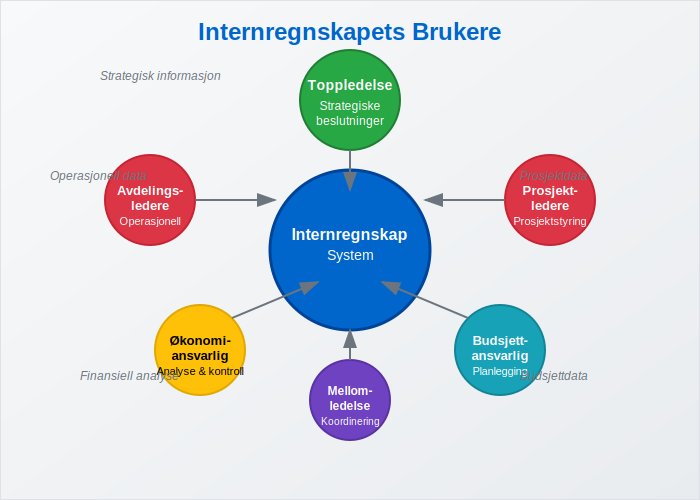
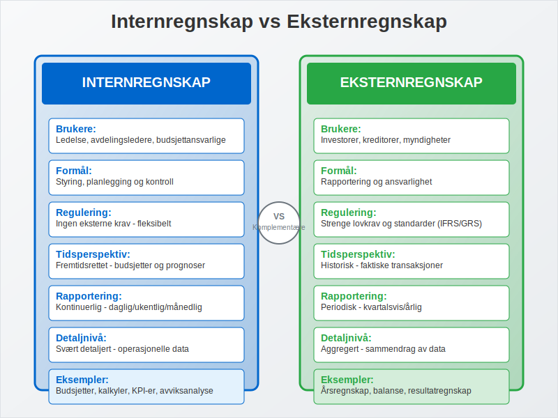
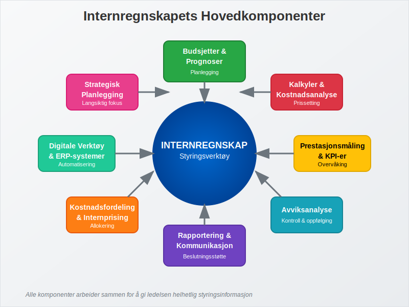
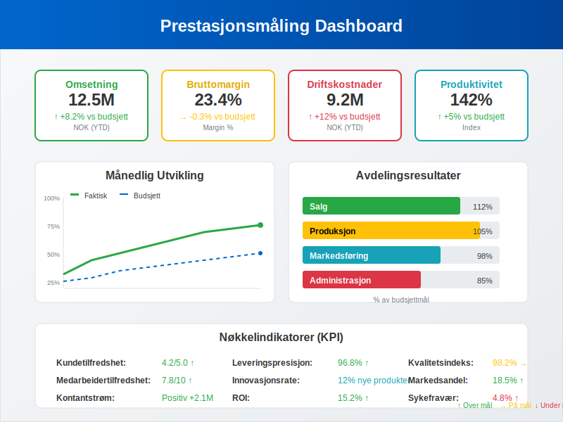
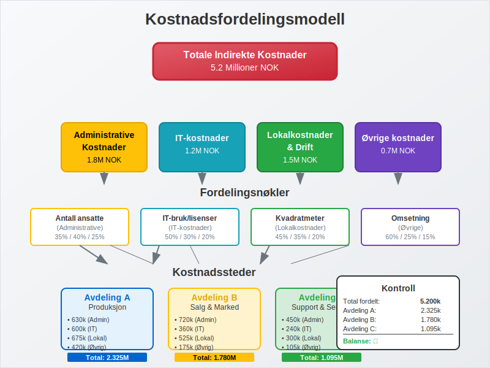
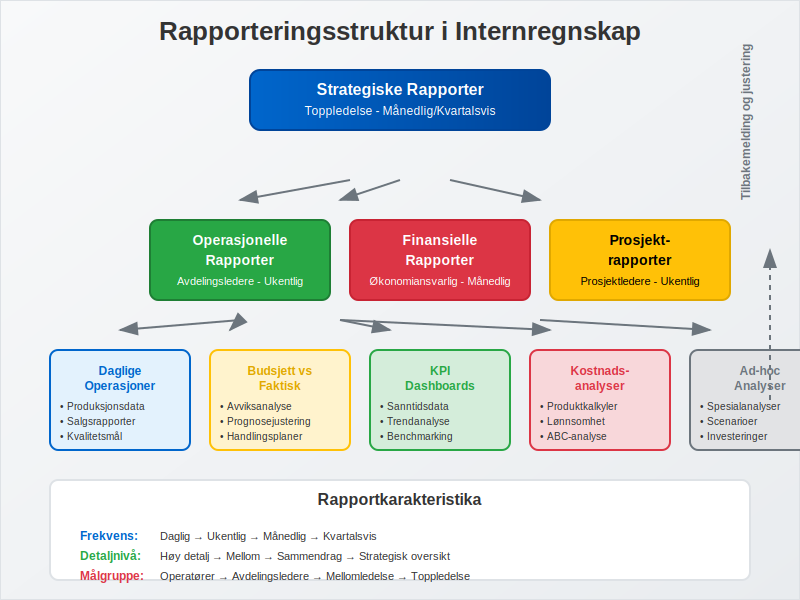
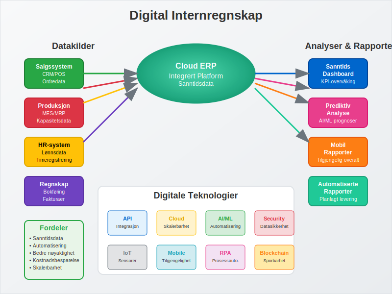
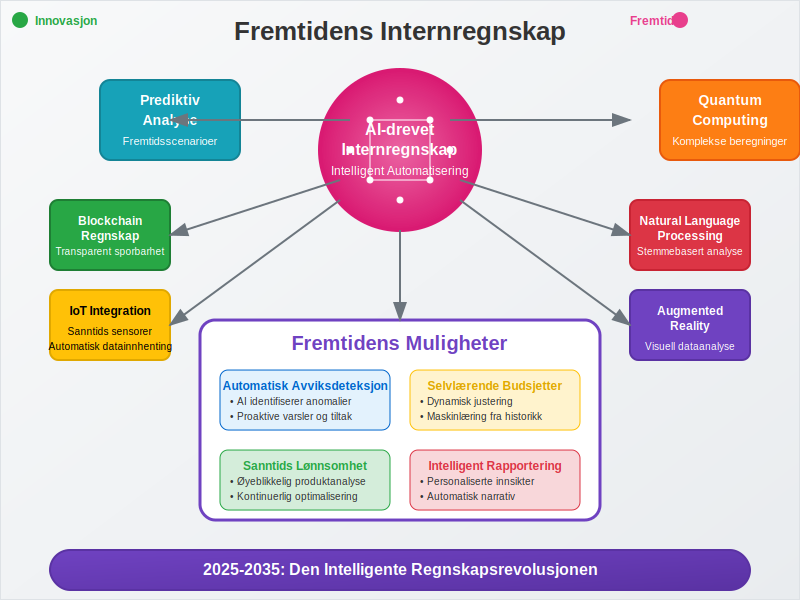

---
title: "Hva er internregnskap?"
seoTitle: "Hva er internregnskap?"
description: '**Internregnskap** er finansiell rapportering som er utarbeidet primært for **interne interessenter** som ledelse, avdelingsledere og andre beslutningstagere i...'
---

**Internregnskap** er finansiell rapportering som er utarbeidet primært for **interne interessenter** som ledelse, avdelingsledere og andre beslutningstagere i virksomheten. Dette står i motsetning til eksternregnskap, som er rettet mot eksterne interessenter. Internregnskapet er fleksibelt og tilpasset virksomhetens spesifikke behov for **styring**, **planlegging** og **kontroll** av den daglige driften.

## Seksjon 1: Grunnleggende om Internregnskap

Internregnskap er et **styringsverktøy** som gir ledelsen detaljert og relevant informasjon for å ta informerte beslutninger om virksomhetens drift og strategi. Det fokuserer på fremtidsrettet informasjon og operasjonelle detaljer.

### 1.1 Definisjon og Formål

**Internregnskap** kan defineres som:
> *Et fleksibelt og detaljert system for innsamling, analyse og rapportering av finansiell og operasjonell informasjon til interne beslutningstagere for å støtte planlegging, styring og kontroll av virksomheten.*

Hovedformålene med internregnskap inkluderer:

* **Planlegging**: Utarbeide budsjetter og prognoser for fremtidig drift
* **Styring**: Overvåke og styre den daglige driften
* **Kontroll**: Sammenligne faktiske resultater med planer og budsjetter
* **Beslutningsstøtte**: Gi grunnlag for strategiske og operasjonelle beslutninger
* **Prestasjonsmåling**: Evaluere avdelinger, produkter og ansattes prestasjoner

### 1.2 Hovedkarakteristika ved Internregnskap

| Karakteristikk | Beskrivelse | Betydning |
|---|---|---|
| **Fleksibelt** | Tilpasset virksomhetens behov | Relevant og nyttig informasjon |
| **Fremtidsrettet** | Fokus på budsjetter og prognoser | Støtter planlegging |
| **Detaljert** | Omfattende operasjonelle data | Muliggjør presis styring |
| **Hyppig** | Daglig, ukentlig eller månedlig | Rask respons på endringer |
| **Konfidensielt** | Kun for intern bruk | Beskytter konkurransefortrinn |

## Seksjon 2: Forskjeller mellom Internregnskap og Eksternregnskap

Internregnskap og [eksternregnskap](/blogs/regnskap/hva-er-eksternregnskap "Hva er Eksternregnskap? Komplett Guide til Ekstern Finansiell Rapportering") har fundamentalt forskjellige formål og karakteristika.

### 2.1 Sammenligning av Hovedforskjeller

| Aspekt | Internregnskap | Eksternregnskap |
|---|---|---|
| **Brukere** | Ledelse og interne beslutningstagere | Eksterne interessenter |
| **Formål** | Styring og planlegging | Rapportering og ansvarlighet |
| **Regulering** | Ingen eksterne krav | Strenge lovkrav og standarder |
| **Tidsperspektiv** | Fremtidsrettet | Historisk |
| **Rapporteringsfrekvens** | Kontinuerlig/hyppig | Periodisk (kvartal/år) |
| **Detaljnivå** | Svært detaljert | Aggregert |
| **Fleksibilitet** | Høy | Lav (standardisert) |

### 2.2 Komplementære Roller

Selv om internregnskap og eksternregnskap har forskjellige formål, utfyller de hverandre:

* **Internregnskap** gir grunnlaget for den daglige styringen
* **Eksternregnskap** kommuniserer resultatene til omverdenen
* Begge bidrar til virksomhetens totale **finansielle styring**

## Seksjon 3: Hovedkomponenter i Internregnskap

Internregnskap består av flere integrerte komponenter som sammen gir ledelsen et helhetlig bilde av virksomhetens drift og ytelse.

### 3.1 Budsjetter og Prognoser

**Budsjetter** er fundamentet i internregnskapet og fungerer som styringsverktøy for planlegging og kontroll.

#### Typer Budsjetter:

* **Driftsbudsjett**: Planlagte inntekter og kostnader
* **Investeringsbudsjett**: Planlagte investeringer i [anleggsmidler](/blogs/regnskap/hva-er-anleggsmidler "Hva er Anleggsmidler? Komplett Guide til Varige Driftsmidler")
* **Likviditetsbudsjett**: Planlagt kontantstrøm
* **Avdelingsbudsjetter**: Budsjetter for enkelte avdelinger eller kostnadssteder
* **Underenhetsbudsjetter**: Budsjettordninger for spesifikke underenheter i organisasjonen. Les mer om [Underenhet](/blogs/regnskap/underenhet "Underenhet: Definisjon, registrering og bruk i norsk regnskap").

#### Budsjettets Rolle:
1. **Planlegging**: Setter mål og retning for virksomheten
2. **Koordinering**: Sikrer at alle avdelinger arbeider mot samme mål
3. **Kontroll**: Gir grunnlag for sammenligning med faktiske resultater
4. **Motivasjon**: Skaper engasjement og ansvarsfølelse

### 3.2 Kalkyler og Kostnadsanalyse

**Kalkyler** er detaljerte beregninger av kostnader knyttet til produkter, tjenester eller prosjekter.

#### Hovedtyper Kalkyler:

| Kalkyletype | Formål | Anvendelse |
|---|---|---|
| **Forhåndskalkyle** | Planlegge kostnader | Prissetting og budsjetter |
| **Etterkalkyle** | Analysere faktiske kostnader | Kontroll og læring |
| **Selvkostkalkyle** | Beregne totale kostnader | Prissetting og lønnsomhet |
| **Bidragskalkyle** | Analysere [dekningsbidrag](/blogs/regnskap/hva-er-dekningsbidrag "Hva er Dekningsbidrag? Komplett Guide til Dekningsbidragsanalyse") | Produktmiks og beslutninger |

#### Kostnadsklassifisering:
* **Variable kostnader**: Endres med aktivitetsnivået
* **Faste kostnader**: Uavhengige av aktivitetsnivået
* **Direkte kostnader**: Kan knyttes direkte til produkter/tjenester
* **Indirekte kostnader**: Må fordeles på produkter/tjenester

### 3.3 Avviksanalyse

**Avviksanalyse** sammenligner faktiske resultater med budsjetterte tall for å identifisere områder som krever oppmerksomhet.

#### Typer Avvik:
* **Prisavvik**: Forskjell i pris per enhet
* **Mengdeavvik**: Forskjell i solgte/produserte enheter
* **Effektivitetsavvik**: Forskjell i ressursbruk
* **Kapasitetsavvik**: Forskjell i kapasitetsutnyttelse

#### Avviksanalysens Verdi:
1. **Identifiserer problemer** tidlig
2. **Muliggjør korrigerende tiltak**
3. **Forbedrer fremtidige budsjetter**
4. **Øker ansvarlighet** i organisasjonen

## Seksjon 4: Prestasjonsmåling og Nøkkeltall

Internregnskap bruker ulike **prestasjonsindikatorer** (KPI-er) for å måle og overvåke virksomhetens ytelse på forskjellige områder.

### 4.1 Finansielle Nøkkeltall

| Nøkkeltall | Beregning | Formål |
|---|---|---|
| **Bruttomargin** | ([Bruttofortjeneste](/blogs/regnskap/hva-er-bruttofortjeneste "Hva er Bruttofortjeneste? Komplett Guide til Bruttofortjeneste og Lønnsomhetsanalyse") / Omsetning) × 100 | Måle lønnsomhet |
| **EBITDA-margin** | (EBITDA / Omsetning) × 100 | Operasjonell lønnsomhet |
| **Arbeidskapitalens omløpshastighet** | Omsetning / [Arbeidskapital](/blogs/regnskap/hva-er-arbeidskapital "Hva er Arbeidskapital? Komplett Guide til Arbeidskapitalens Rolle i Bedriften") | Effektivitet |
| **Avkastning på investert kapital** | Resultat / Investert kapital | Kapitaleffektivitet |

### 4.2 Operasjonelle Nøkkeltall

* **Produktivitetsmål**: Produksjon per ansatt, salg per kvadratmeter
* **Kvalitetsmål**: Reklamasjoner, feilprosent, kundetilfredshet
* **Leveransemål**: Leveringspresisjon, leveringstid
* **Innovasjonsmål**: Andel nye produkter, FoU-investeringer

### 4.3 Balansert Målstyring (Balanced Scorecard)

**Balansert målstyring** integrerer finansielle og ikke-finansielle mål i fire perspektiver:

1. **Finansielt perspektiv**: Lønnsomhet og vekst
2. **Kundeperspektiv**: Kundetilfredshet og markedsandel
3. **Prosess-perspektiv**: Operasjonell effektivitet
4. **Læring og vekst**: Kompetanseutvikling og innovasjon

## Seksjon 5: Kostnadsfordeling og Internprising

**Kostnadsfordeling** og **internprising** er viktige verktøy for å allokere kostnader og måle lønnsomhet på tvers av avdelinger og produkter.

### 5.1 Kostnadsfordelingsprinsipper

#### Fordelingsnøkler:
* **Direkte arbeidstimer**: For produksjonskostnader
* **Kvadratmeter**: For lokalkostnader
* **Omsetning**: For salgskostnader
* **Antall ansatte**: For personalkostnader

#### Aktivitetsbasert kostnadsfordeling (ABC):
* Identifiserer **kostnadsdrivere** for hver aktivitet
* Gir mer **nøyaktig kostnadsfordeling**
* Bedre grunnlag for **prissetting** og **lønnsomhetsanalyse**

### 5.2 Internprising

**Internprising** brukes når avdelinger eller datterselskaper handler med hverandre:

#### Internprisingsmetoder:
1. **Markedspris**: Basert på eksterne markedspriser
2. **Kostpris pluss**: Kostpris + fortjenestemargin
3. **Forhandlet pris**: Avtalt mellom avdelingene
4. **Standardpris**: Forhåndsbestemt pris

#### Formål med Internprising:
* **Måle avdelingenes lønnsomhet**
* **Motivere til effektiv drift**
* **Sikre rettferdig ressursallokering**
* **Overholde skattemessige krav**

## Seksjon 6: Rapportering og Kommunikasjon

Effektiv **rapportering** er avgjørende for at internregnskapet skal ha verdi for beslutningstagerne.

### 6.1 Rapporteringstyper

#### Standardrapporter:
* **Månedlige resultatrapporter**: Sammenligning med budsjett
* **Avviksrapporter**: Fokus på betydelige avvik
* **Prognoserapporter**: Oppdaterte anslag for året
* **Prosjektrapporter**: Status for spesifikke prosjekter

#### Ad-hoc Analyser:
* **Lønnsomhetsanalyser**: For produkter eller kunder
* **Investeringsanalyser**: Vurdering av nye investeringer
* **Scenarioanalyser**: "Hva hvis"-beregninger
* **Benchmarking**: Sammenligning med konkurrenter

### 6.2 Rapporteringsprinsipper

#### Effektive Rapporter Kjennetegnes av:
* **Relevans**: Inneholder informasjon som påvirker beslutninger
* **Aktualitet**: Leveres når informasjonen trengs
* **Nøyaktighet**: Korrekte og pålitelige data
* **Klarhet**: Lett å forstå og tolke
* **Handlingsrettet**: Gir grunnlag for konkrete tiltak

## Seksjon 7: Digitalisering av Internregnskap

Moderne **teknologi** har revolusjonert internregnskapet og gjort det mer effektivt og tilgjengelig.

### 7.1 Teknologiske Løsninger

#### ERP-systemer:
[ERP-systemer](/blogs/regnskap/hva-er-erp-system "Hva er ERP-system? Komplett Guide til Enterprise Resource Planning") integrerer alle forretningsprosesser og gir:
* **Sanntidsdata** fra alle avdelinger
* **Automatisert rapportering**
* **Integrert budsjett- og prognosefunksjonalitet**
* **Avanserte analyseverktøy**

#### Business Intelligence (BI):
* **Dashboards** med sanntids nøkkeltall
* **Selvbetjente analyser** for ledere
* **Prediktive analyser** for prognoser
* **Visualisering** av komplekse data

### 7.2 Fordeler med Digitalisering

| Fordel | Beskrivelse | Gevinst |
|---|---|---|
| **Automatisering** | Reduserer manuelt arbeid | Økt effektivitet |
| **Sanntidsdata** | Oppdatert informasjon | Raskere beslutninger |
| **Integrering** | Sammenkoblede systemer | Bedre datakvalitet |
| **Skalerbarhet** | Håndterer vekst | Fremtidssikret løsning |

## Seksjon 8: Utfordringer og Beste Praksis

Implementering og drift av internregnskap kan møte ulike **utfordringer** som krever gjennomtenkte løsninger.

### 8.1 Vanlige Utfordringer

#### Organisatoriske Utfordringer:
* **Motstand mot endring** fra ansatte
* **Mangel på kompetanse** innen internregnskap
* **Utilstrekkelig lederstøtte**
* **Dårlig datakvalitet**

#### Tekniske Utfordringer:
* **Fragmenterte systemer** som ikke kommuniserer
* **Komplekse kostnadsfordelingsmodeller**
* **Tidkrevende rapporteringsprosesser**
* **Mangel på standardisering**

### 8.2 Beste Praksis

#### Suksessfaktorer:
1. **Tydelig strategi**: Definer mål og forventninger
2. **Ledelsesengasjement**: Sikre støtte fra toppledelsen
3. **Kompetanseutvikling**: Invester i opplæring
4. **Gradvis implementering**: Start enkelt og bygg ut
5. **Kontinuerlig forbedring**: Evaluer og juster regelmessig

#### Implementeringsanbefalinger:
* **Start med grunnleggende budsjetter** og bygg ut
* **Fokuser på de viktigste nøkkeltallene** først
* **Involver brukerne** i utformingen av rapporter
* **Etabler klare roller** og ansvar
* **Dokumenter prosesser** og rutiner

## Seksjon 9: Fremtiden for Internregnskap

Internregnskap utvikler seg kontinuerlig med nye teknologier og forretningsmodeller.

### 9.1 Teknologiske Trender

#### Kunstig Intelligens (AI):
* **Automatisk avviksdeteksjon**
* **Prediktive analyser** for bedre prognoser
* **Intelligent rapportering** som tilpasser seg brukeren
* **Automatisert kostnadsfordeling**

#### Sanntidsregnskap:
* **Kontinuerlig oppdatering** av finansielle data
* **Øyeblikkelig avviksrapportering**
* **Dynamiske budsjetter** som justeres automatisk
* **Sanntids dashboards** for ledelsen

### 9.2 Utviklingstrender

#### Økt Fokus på:
* **Bærekraftsregnskap**: Miljømessige og sosiale indikatorer
* **Risikoanalyse**: Integrert risikostyring
* **Scenarioplanlegging**: Forberedelse på usikkerhet
* **Agile budsjetter**: Fleksible og responsive planleggingsprosesser

## Konklusjon

**Internregnskap** er et uunnværlig verktøy for moderne virksomhetsstyring. Det gir ledelsen den detaljerte og relevante informasjonen som trengs for å ta informerte beslutninger om drift og strategi. Mens [eksternregnskap](/blogs/regnskap/hva-er-eksternregnskap "Hva er Eksternregnskap? Komplett Guide til Ekstern Finansiell Rapportering") fokuserer på historisk rapportering til eksterne interessenter, er internregnskap fremtidsrettet og tilpasset virksomhetens spesifikke styringsbehov.

Suksessfullt internregnskap krever:
* **Klar strategi** og definerte mål
* **Riktig teknologi** og systemer
* **Kompetente medarbeidere**
* **Ledelsesengasjement**
* **Kontinuerlig utvikling**

Med digitalisering og nye teknologier som AI og sanntidsanalyser, vil internregnskap fortsette å utvikle seg og bli enda mer verdifullt for virksomhetsstyring. Virksomheter som investerer i moderne internregnskapssystemer vil ha betydelige konkurransefortrinn gjennom bedre beslutningsgrunnlag og mer effektiv drift.

For å lære mer om relaterte emner, se våre artikler om [budsjetter](/blogs/regnskap/hva-er-budsjettering "Hva er Budsjettering? Komplett Guide til Budsjettplanlegging"), [kostnadsanalyse](/blogs/regnskap/hva-er-driftskostnader "Hva er Driftskostnader? Komplett Guide til Kostnadstyper og Kostnadsanalyse"), og [finansiell planlegging](/blogs/regnskap/hva-er-finansregnskap "Hva er Finansregnskap? Komplett Guide til Finansiell Rapportering").

