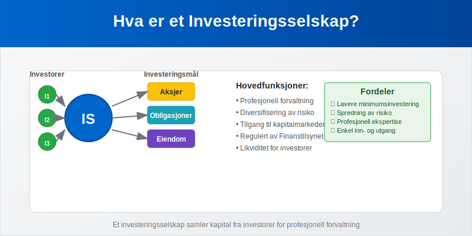
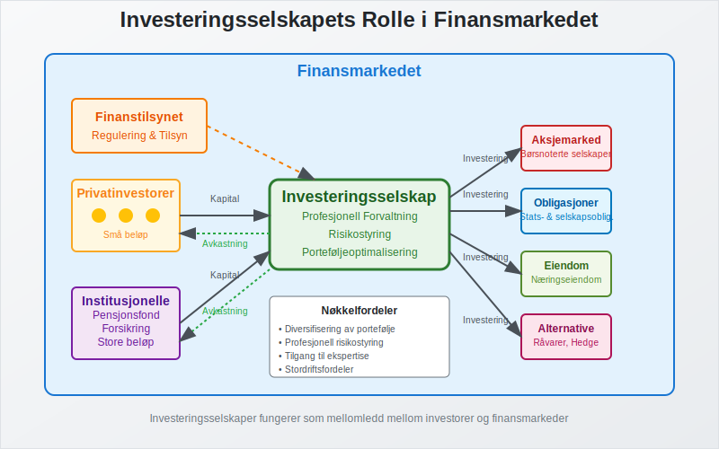
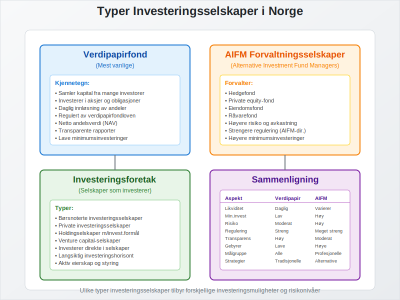
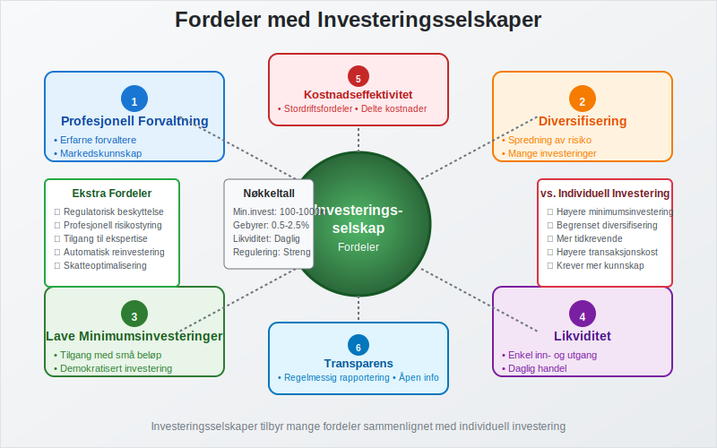
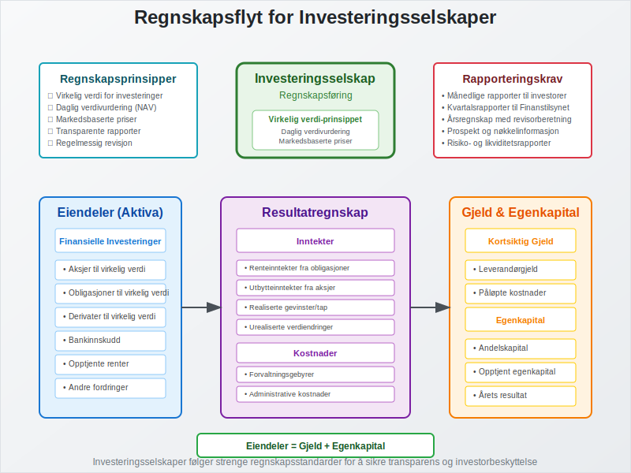
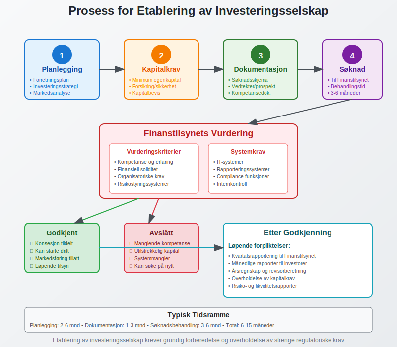

---
title: "Hva er et Investeringsselskap?"
meta_title: "Hva er et Investeringsselskap?"
meta_description: 'Et **investeringsselskap** er et [finansielt selskap](/blogs/regnskap/hva-er-finansiering "Hva er Finansiering? Komplett Guide til Finansieringsformer") som sam...'
slug: hva-er-investeringsselskap
type: blog
layout: pages/single
---

Et **investeringsselskap** er et [finansielt selskap](/blogs/regnskap/hva-er-finansiering "Hva er Finansiering? Komplett Guide til Finansieringsformer") som samler kapital fra mange investorer for å investere i verdipapirer, eiendom eller andre finansielle instrumenter. Disse selskapene tilbyr profesjonell forvaltning og spredning av risiko for investorer som ønsker eksponering mot ulike markeder og aktivaklasser.

### Hva Kjennetegner et Investeringsselskap?

Et investeringsselskap skiller seg fra vanlige [aksjeselskaper](/blogs/regnskap/hva-er-et-aksjeselskap "Hva er et Aksjeselskap? Komplett Guide til Selskapsformen") ved at hovedformålet er å investere i andre selskaper eller finansielle instrumenter på vegne av sine investorer.

#### Profesjonell Forvaltning
**Investeringsselskaper** tilbyr profesjonell porteføljeforvaltning hvor erfarne forvaltere tar investeringsbeslutninger basert på grundig analyse og markedskunnskap.

#### Diversifisering
Ved å samle kapital fra mange investorer kan investeringsselskaper oppnå bedre **diversifisering** enn det enkeltinvestorer kan klare på egen hånd.

#### Regulering
Investeringsselskaper er underlagt streng regulering fra Finanstilsynet for å beskytte investorenes interesser.

### Typer Investeringsselskaper

Det finnes flere typer investeringsselskaper i Norge, hver med sine særegne karakteristikker:

#### Verdipapirfond
**Verdipapirfond** er den vanligste formen for investeringsselskap i Norge. Disse fondene:

* Samler kapital fra mange investorer
* Investerer i aksjer, obligasjoner eller andre verdipapirer
* Utsteder andeler som representerer eierandel i fondet
* Har daglig innløsning av andeler til netto andelsverdi

#### Forvaltningsselskaper (AIFM)
**Alternative Investment Fund Managers (AIFM)** forvalter alternative investeringsfond som:

* Hedgefond
* Private equity-fond
* Eiendomsfond
* RÃ¥varefond

#### Investeringsforetak
**Investeringsforetak** er selskaper som har som hovedformål å investere i andre selskaper. Disse kan være:

* Børsnoterte investeringsselskaper
* Private investeringsselskaper
* [Holdingselskaper](/blogs/regnskap/hva-er-holdingselskap "Hva er et Holdingselskap? Komplett Guide til Holdingselskaper i Norge") med investeringsformål

### Regulering av Investeringsselskaper

Investeringsselskaper i Norge er underlagt omfattende regulering:

#### Verdipapirfondloven
Regulerer etablering og drift av verdipapirfond og forvaltningsselskaper.

#### AIFM-direktivet
Implementert i norsk rett for å regulere alternative investeringsfond.

#### Finanstilsynets Rolle
**Finanstilsynet** fører tilsyn med:

* Konsesjon og godkjenning av investeringsselskaper
* Løpende overholdelse av regelverket
* Beskyttelse av investorenes interesser
* Rapportering og transparens

### Fordeler med Investeringsselskaper

#### For Investorer

| Fordel | Beskrivelse |
|--------|-------------|
| **Profesjonell forvaltning** | Erfarne forvaltere med markedskunnskap |
| **Diversifisering** | Spredning av risiko på mange investeringer |
| **Likviditet** | Enkel inn- og utgang fra investeringer |
| **Lave minimumsinvesteringer** | Tilgang til markeder med små beløp |
| **Transparens** | Regelmessig rapportering og verdivurdering |

#### Kostnadseffektivitet
Investeringsselskaper kan oppnå **stordriftsfordeler** ved:

* Lavere transaksjonskostnader per investor
* Bedre forhandlingsposisjon overfor meglere
* Deling av forsknings- og analysekostnader

#### Tilgang til Ekspertise
Investorer får tilgang til profesjonell investeringsekspertise som de ellers ikke ville hatt råd til individuelt.

### Ulemper og Risikoer

#### Forvaltningsgebyrer
**Investeringsselskaper** krever gebyrer for sine tjenester:

* Ã…rlige forvaltningsgebyrer (typisk 0,5-2,5%)
* Resultatgebyrer (performance fees)
* Inn- og utgående gebyrer

#### Manglende Kontroll
Investorer har begrenset kontroll over:

* Investeringsbeslutninger
* Timing av kjøp og salg
* Spesifikke investeringsobjekter

#### Markedsrisiko
Som alle investeringer er investeringsselskaper utsatt for **markedsrisiko** og kan tape verdi.

### Regnskapsmessig Behandling

#### For Investeringsselskapet
Investeringsselskaper må følge spesielle regnskapsregler:

* **Virkelig verdi-prinsippet** for verdivurdering av investeringer
* Regelmessig verdivurdering av porteføljen
* Detaljert rapportering til investorer og myndigheter
* Særskilte krav til [regnskap](/blogs/regnskap/hva-er-regnskap "Hva er Regnskap? En komplett guide") og revisjon

#### For Investorer
Investorer må regnskapsføre sine investeringer i investeringsselskaper:

* Som [finansielle eiendeler](/blogs/regnskap/hva-er-eiendel "Hva er en Eiendel? Komplett Guide til Eiendeler i Regnskap")
* Til virkelig verdi eller anskaffelseskost
* Utbytte og gevinster påvirker [inntekter](/blogs/regnskap/hva-er-inntekter "Hva er Inntekter? Komplett Guide til Inntektsføring i Regnskap")

### Skattemessige Forhold

#### Beskatning av Investeringsselskaper
**Investeringsselskaper** har spesielle skatteregler:

* Verdipapirfond er normalt fritatt for skatt på fondsnivå
* Beskatning skjer hos investorene ved utdeling eller realisasjon
* [Fritaksmetoden](/blogs/regnskap/hva-er-fritaksmetoden "Hva er Fritaksmetoden? Komplett Guide til Skattefritak for Utbytte") kan være relevant for selskaper som investerer

#### For Investorer
Investorer beskattes for:

* Utdelinger fra investeringsselskaper
* Gevinst ved salg av andeler
* Skattereglene varierer avhengig av investortype (person vs. selskap)

### Investeringsstrategier

Investeringsselskaper benytter ulike strategier:

#### Aktiv Forvaltning
* **Aktive forvaltere** forsøker å slå markedet gjennom:
  * Aksjeseleksjon
  * Markedstiming
  * Sektorrotasjon
  * Fundamental analyse

#### Passiv Forvaltning
* **Indeksfond** følger en markedsindeks
* Lavere kostnader enn aktiv forvaltning
* Bred markedseksponering

#### Spesialiserte Strategier
* **Sektorspesifikke fond** fokuserer på bestemte bransjer
* **Geografiske fond** investerer i spesifikke regioner
* **Tematiske fond** følger investeringstemaer som bærekraft eller teknologi

### Etablering av Investeringsselskap

For å etablere et investeringsselskap i Norge må man:

#### Konsesjon fra Finanstilsynet
* Søknad om konsesjon som forvaltningsselskap
* Dokumentasjon av kompetanse og kapital
* Godkjenning av nøkkelpersonell

#### Kapitalkrav
* Minimum [egenkapital](/blogs/regnskap/hva-er-egenkapital "Hva er Egenkapital? Komplett Guide til Egenkapital i Regnskap") avhengig av type virksomhet
* Forsikring eller andre sikkerhetsstillelser

#### Organisatoriske Krav
* Etablering av risikostyring
* Compliance-funksjoner
* Rapporteringssystemer

### Internasjonale Forhold

#### UCITS-direktivet
**UCITS** (Undertakings for Collective Investment in Transferable Securities) regulerer:

* Grenseoverskridende markedsføring av fond
* Harmoniserte regler i EU/EØS
* Investorbeskyttelse

#### Passporting
Norske investeringsselskaper kan:

* Markedsføre fond i andre EU/EØS-land
* Etablere filialer i utlandet
* Tilby tjenester på tvers av landegrenser

### Fremtidige Utviklingstrekk

#### Digitalisering
* **Fintech**-løsninger for fondsdistribusjon
* Robo-advisors for automatisert porteføljeforvaltning
* Blockchain-teknologi for verdipapiroppgjør

#### Bærekraftige Investeringer
* **ESG-kriterier** (Environmental, Social, Governance) blir viktigere
* Økt fokus på klimarisiko og bærekraft
* Regulatoriske krav til bærekraftsrapportering

#### Kostnadspress
* Økt konkurranse fører til lavere gebyrer
* Vekst i passive investeringsstrategier
* Konsolidering i bransjen

### Sammenligning med Andre Investeringsformer

#### Investeringsselskap vs. Direkte Investering

| Aspekt | Investeringsselskap | Direkte Investering |
|--------|-------------------|-------------------|
| **Diversifisering** | Høy | Lav (med mindre stor kapital) |
| **Forvaltningskostnader** | Ja | Nei |
| **Kontroll** | Lav | Høy |
| **Minimumsinvestering** | Lav | Varierer |
| **Likviditet** | Høy | Varierer |

#### Investeringsselskap vs. [Crowdfunding](/blogs/regnskap/hva-er-crowdfunding "Hva er Crowdfunding i Regnskap? Regnskapsføring, Skatt og Juridiske Krav")
* **Investeringsselskap:** Profesjonell forvaltning, regulert
* **Crowdfunding:** Direkte investering, mindre regulering

### Praktiske RÃ¥d for Investorer

#### Før Investering
1. **Vurder investeringsmål:** Definér tidshorisont og risikotoleranse
2. **Sammenlign alternativer:** Se på gebyrer, historisk [avkastning](/blogs/regnskap/hva-er-avkastning "Hva er Avkastning? Komplett Guide til Investeringsavkastning og Beregning") og risiko
3. **Les prospekt:** Forstå investeringsstrategien og risikoene
4. **Vurder skattekonsekvenser:** Forstå beskatning av utdelinger og gevinster

#### Under Investeringsperioden
* **Følg med på resultater:** Regelmessig evaluering av investeringen
* **Rebalansering:** Vurder om porteføljen fortsatt passer dine mål
* **Kostnadsbevissthet:** Hold øye med gebyrer og deres påvirkning på avkastning

### Relaterte Begreper

For å forstå investeringsselskaper fullt ut, bør du også sette deg inn i:

* **[Aksjeselskap](/blogs/regnskap/hva-er-et-aksjeselskap "Hva er et Aksjeselskap? Komplett Guide til Selskapsformen")** - Grunnleggende selskapsform
* **[Avkastning](/blogs/regnskap/hva-er-avkastning "Hva er Avkastning? Komplett Guide til Investeringsavkastning og Beregning")** - MÃ¥ling av investeringsresultater
* **[Crowdfunding](/blogs/regnskap/hva-er-crowdfunding "Hva er Crowdfunding i Regnskap? Regnskapsføring, Skatt og Juridiske Krav")** - Alternativ investeringsform
* **[Egenkapital](/blogs/regnskap/hva-er-egenkapital "Hva er Egenkapital? Komplett Guide til Egenkapital i Regnskap")** - Kapitalbegrep
* **[Eiendel](/blogs/regnskap/hva-er-eiendel "Hva er en Eiendel? Komplett Guide til Eiendeler i Regnskap")** - Regnskapsmessig klassifisering
* **[Finansiering](/blogs/regnskap/hva-er-finansiering "Hva er Finansiering? Komplett Guide til Finansieringsformer")** - Kapitalinnhenting
* **[Fritaksmetoden](/blogs/regnskap/hva-er-fritaksmetoden "Hva er Fritaksmetoden? Komplett Guide til Skattefritak for Utbytte")** - Skattemessig behandling
* **[Holdingselskap](/blogs/regnskap/hva-er-holdingselskap "Hva er et Holdingselskap? Komplett Guide til Holdingselskaper i Norge")** - Relatert selskapsform
* **[Inntekter](/blogs/regnskap/hva-er-inntekter "Hva er Inntekter? Komplett Guide til Inntektsføring i Regnskap")** - Regnskapsføring av investeringsresultater
* **[Regnskap](/blogs/regnskap/hva-er-regnskap "Hva er Regnskap? En komplett guide")** - Regnskapsføring for investeringsselskaper

Et investeringsselskap er en sofistikert finansiell struktur som krever grundig forståelse av både investeringsprinsipper og regulatoriske krav for å kunne operere effektivt i det norske finansmarkedet.
