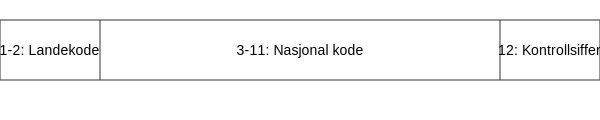

---
title: "Hva er ISIN-nummer?"
meta_title: "Hva er ISIN-nummer?"
meta_description: '**ISIN-nummer** (International Securities Identification Number) er en **internasjonal standard** som brukes for **entydig identifikasjon av verdipapirer** på ...'
slug: hva-er-isin-nummer
type: blog
layout: pages/single
---

**ISIN-nummer** (International Securities Identification Number) er en **internasjonal standard** som brukes for **entydig identifikasjon av verdipapirer** på tvers av landegrenser. I norsk regnskaps- og finanspraksis er **ISIN-nummer** viktig for å spore, bokføre og rapportere investeringer i aksjer, obligasjoner og andre verdipapirinstrumenter.

## Hva er ISIN-nummer?

**ISIN-nummer** står for **International Securities Identification Number** og består av **12 tegn** som entydig identifiserer et verdipapir globalt. Koden brukes av banker, børser, meglere og regnskapssystemer for å sikre korrekt håndtering og rapportering av finansielle instrumenter.

For mer om aksjer som investering, se [Hva er en Aksje?](/blogs/regnskap/hva-er-en-aksje "Hva er en Aksje? Guide til Aksjer og Verdipapirer"). For obligasjoner, se [Hva er Obligasjon?](/blogs/regnskap/hva-er-obligasjon "Hva er Obligasjon? Guide til Obligasjoner som Verdipapir").

## Hvordan er et ISIN-nummer bygget opp?

| Posisjon | Lengde | Beskrivelse                              |
|----------|--------|-------------------------------------------|
| 1-2      | 2 tegn | **Landekode** (ISO 3166)                  |
| 3-11     | 9 tegn | **Nasjonal verdipapirkode** (alfa-numerisk) |
| 12       | 1 tegn | **Kontrollsiffer** (Modulus 10 Double-Add-Double) |

## Hvordan tildeles ISIN-nummer?

Tildeling av **ISIN-nummer** håndteres nasjonalt av godkjente nasjonale nummerlagsorganisasjoner (NNA). I Norge er dette **Oslo Børs** / **Euronext VPS**. Prosessen inkluderer:

* Tildeling av en **to-bokstavs landekode** etter ISO 3166
* Tildeling av en **nasjonal kode** for det enkelte verdipapiret
* Beregning av **kontrollsiffer** ved hjelp av Modulus 10 Double-Add-Double-algoritmen

## Bruksområder i regnskap og finansmarked

ISIN-nummer anvendes bredt i:

* **Regnskapssystemer** for entydig bokføring av finansielle eiendeler
* **Børshandel** og verdipapirregistrering
* **Porteføljeforvaltning** og risikorapportering
* **Internasjonal handel** med aksjer, obligasjoner og derivater

## Fordeler ved bruk av ISIN-nummer

Ved bruk av **ISIN-nummer** får norske virksomheter og investorer:

* **Økt nøyaktighet** og reduserte feilkilder ved identifikasjon
* **Effektivisering** av transaksjons- og rapporteringsprosesser
* **Standardisert kommunikasjon** med internasjonale aktører

## Eksempler på ISIN-koder

| Verdipapir               | ISIN-nummer     |
|--------------------------|-----------------|
| Equinor ASA aksjer       | NO0010096985    |
| Oslo Kommunal Obligasjon | NO0010773345    |
| Norske Statsobligasjoner | NO0010549309    |

## Vanlige spørsmål om ISIN-nummer

**Hvorfor er kontrollsiffer viktig?**

Kontrollsifferet sikrer at en feiltastet eller korrupt kode oppdages tidlig ved validering.

**Er ISIN det samme som CUSIP eller SEDOL?**

ISIN inkluderer nasjonale koder som CUSIP (USA) og SEDOL (Storbritannia) som del av strukturen, men fungerer som **global standard**.

