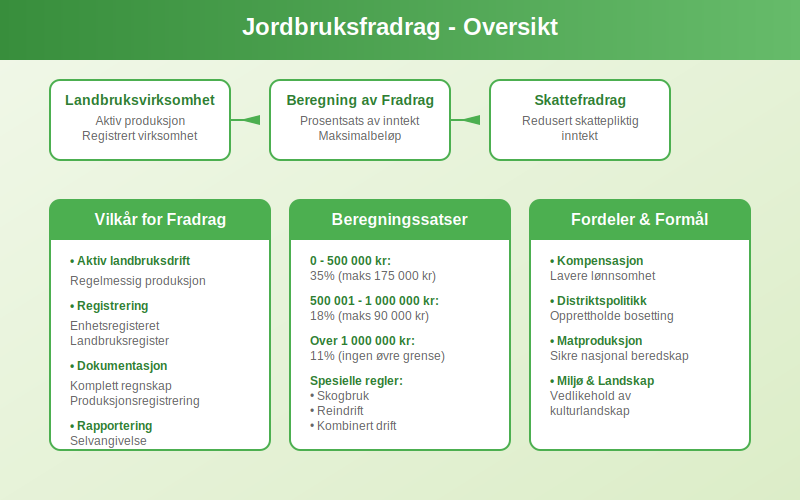
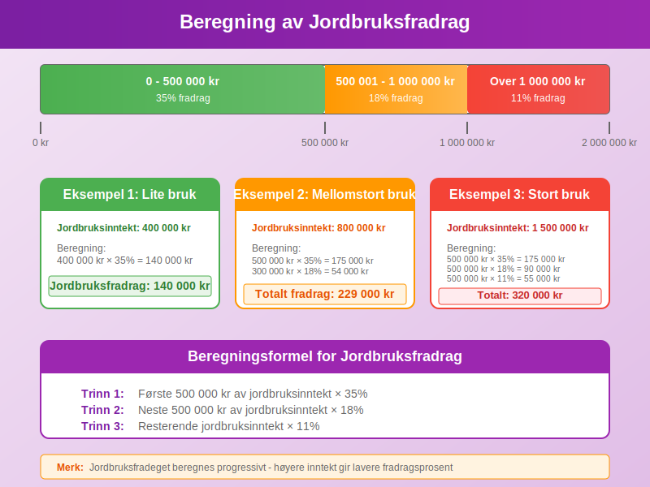
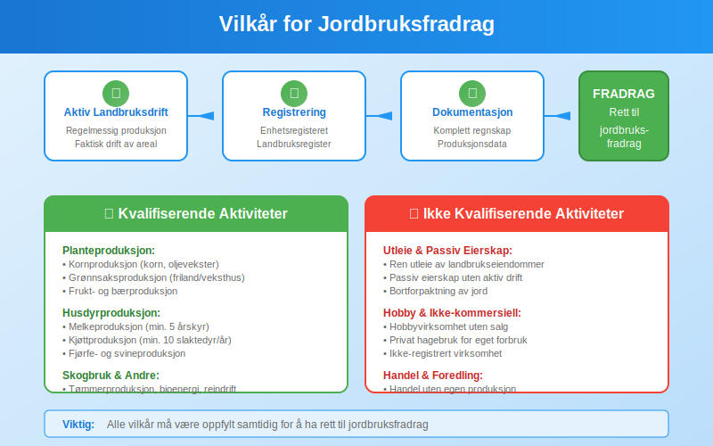
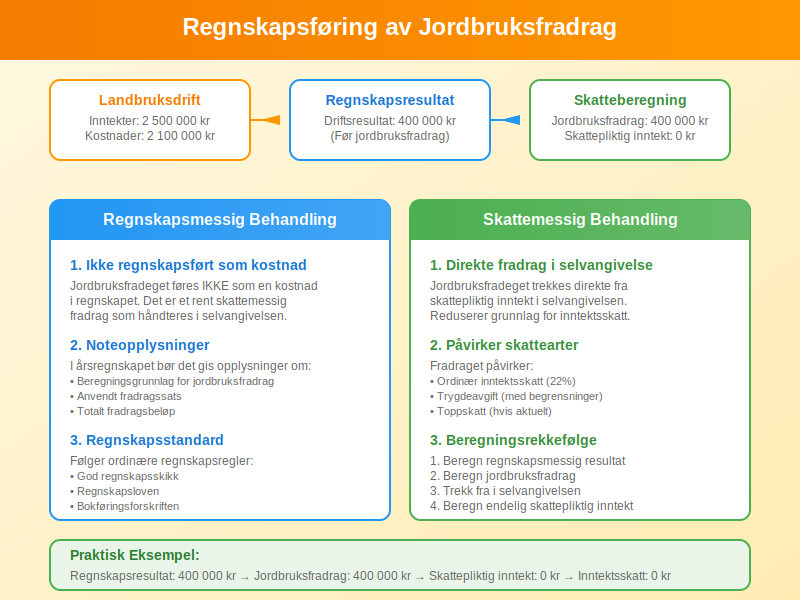
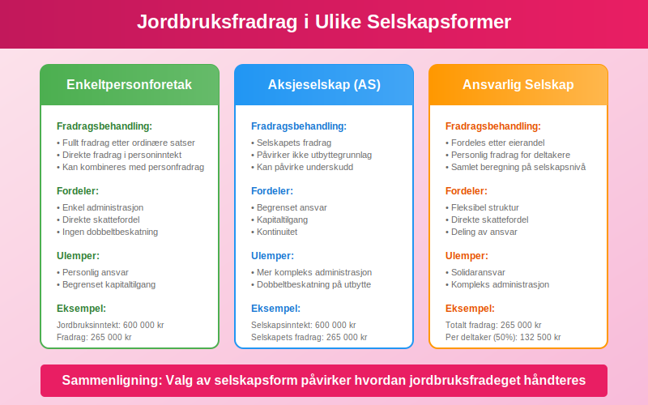
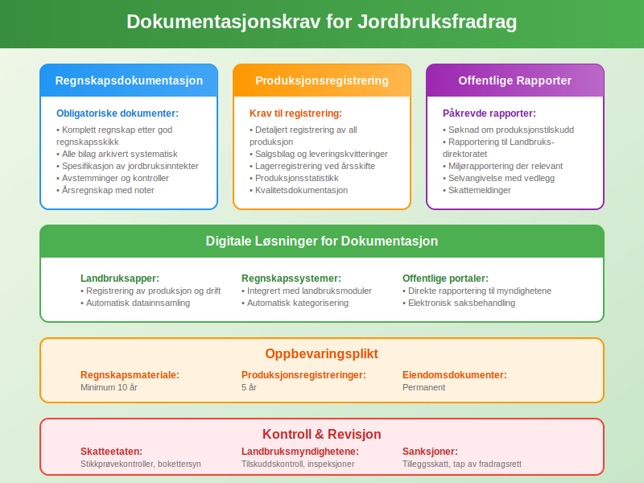

---
title: "Hva er jordbruksfradrag?"
meta_title: "Hva er jordbruksfradrag?"
meta_description: '**Jordbruksfradrag** er spesielle skattefradrag som gis til landbruksvirksomheter i Norge for å kompensere for sektorens særegne utfordringer og bidra til opp...'
slug: hva-er-jordbruksfradrag
type: blog
layout: pages/single
---

**Jordbruksfradrag** er spesielle skattefradrag som gis til landbruksvirksomheter i Norge for å kompensere for sektorens særegne utfordringer og bidra til opprettholdelse av landbruksaktivitet. Dette er et viktig virkemiddel i norsk landbrukspolitikk som påvirker både [regnskap](/blogs/regnskap/hva-er-regnskap "Hva er regnskap?") og skatteplanlegging for landbruksforetak.

## Grunnleggende om Jordbruksfradrag

Jordbruksfradrag er regulert i skatteloven § 8-1 og representerer et særskilt [fradrag](/blogs/regnskap/hva-er-fradrag "Hva er Fradrag i Regnskap? Komplett Guide til Skattefradrag og Regnskapsføring") som kommer i tillegg til ordinære driftskostnader. Fradraget skal kompensere for at landbruket har lavere avkastning enn andre næringer og bidra til å opprettholde bosetting og aktivitet i distriktene.



### Historisk Bakgrunn

Jordbruksfradeget ble innført i 1975 som en del av den norske landbrukspolitikken. Formålet var å:

* **Kompensere** for lavere lønnsomhet i landbruket
* **Stimulere** til fortsatt landbruksaktivitet
* **Opprettholde** bosetting i distriktene
* **Sikre** matproduksjon og beredskap

### Rettslig Grunnlag

Jordbruksfradeget er hjemlet i:

* **Skatteloven § 8-1** - Hovedbestemmelsen om jordbruksfradrag
* **Forskrift om jordbruksfradrag** - Detaljerte regler og satser
* **Stortingsvedtak** - Ã…rlige justeringer av fradragssatser

## Beregning av Jordbruksfradrag

Jordbruksfradeget beregnes som en prosentsats av **jordbruksinntekten** med et maksimalt beløp per år. Beregningen følger spesifikke regler som varierer basert på inntektsnivå og type landbruksaktivitet.



### Grunnleggende Beregningsformel

| Inntektsnivå | Fradragssats | Maksimalt fradrag |
|--------------|--------------|-------------------|
| **0 - 500 000 kr** | 35% | 175 000 kr |
| **500 001 - 1 000 000 kr** | 18% | 90 000 kr |
| **Over 1 000 000 kr** | 11% | Ingen øvre grense |

### Praktisk Beregningseksempel

**Eksempel 1: Mindre gårdsbruk**
- Jordbruksinntekt: 400 000 kr
- Fradragssats: 35%
- Beregnet fradrag: 400 000 × 35% = 140 000 kr
- **Jordbruksfradrag: 140 000 kr**

**Eksempel 2: Mellomstort gårdsbruk**
- Jordbruksinntekt: 800 000 kr
- Første 500 000 kr: 500 000 × 35% = 175 000 kr
- Neste 300 000 kr: 300 000 × 18% = 54 000 kr
- **Totalt jordbruksfradrag: 229 000 kr**

### Spesielle Beregningsregler

For visse typer landbruksaktivitet gjelder særskilte regler:

* **Skogbruk:** Eget fradrag med andre satser
* **Pelsdyroppdrett:** Spesielle regler frem til utfasing
* **Reindrift:** Særskilte bestemmelser for samisk reindrift
* **Kombinert drift:** Forholdsmessig beregning

## Vilkår for Jordbruksfradrag

For å ha rett til jordbruksfradrag må flere vilkår være oppfylt. Disse vilkårene sikrer at fradraget kun gis til aktiv landbruksvirksomhet.



### Hovedvilkår

**1. Aktiv Landbruksvirksomhet**
Virksomheten må drive aktiv landbruksproduksjon, ikke bare eie landbrukseiendommer. Dette innebærer:

* Regelmessig produksjon av landbruksprodukter
* Faktisk drift av jord- eller skogbruksareal
* Dokumentert landbruksaktivitet gjennom hele året

**2. Registrering og Rapportering**
Virksomheten må være:

* Registrert i [Enhetsregisteret](/blogs/regnskap/hva-er-enhetsregisteret "Hva er Enhetsregisteret? Komplett Guide til Norsk Virksomhetsregister") som landbruksforetak
* Rapportert til landbruksmyndighetene
* Ført i landbruksregisteret

**3. Inntektsgrunnlag**
Jordbruksinntekten må være:

* Reell inntekt fra landbruksaktivitet
* Dokumentert gjennom [regnskap](/blogs/regnskap/hva-er-regnskap "Hva er regnskap?")
* Rapportert i selvangivelsen

### Eksklusjonsregler

Følgende aktiviteter gir **ikke** rett til jordbruksfradrag:

* Ren utleie av landbrukseiendommer
* Hobbyvirksomhet uten kommersiell karakter
* Foredling som ikke er direkte knyttet til egen produksjon
* Handel med landbruksprodukter uten egen produksjon

## Typer Landbruksvirksomhet som Kvalifiserer

Jordbruksfradeget gjelder for ulike typer landbruksaktivitet, hver med sine spesifikke regler og krav.

### Planteproduksjon

**Kornproduksjon:**
* Dyrking av korn, oljevekster og proteinvekster
* Inkluderer både mat- og fôrkorn
* Krever minimum areal og produksjon

**Grønnsaksproduksjon:**
* Friland- og veksthusproduksjon
* Både konvensjonell og økologisk dyrking
* Inkluderer poteter, grønnsaker og bær

**Fruktproduksjon:**
* Eple-, pære- og steinfrukthager
* Bærproduksjon (jordbær, bringebær, blåbær)
* Krever etablerte plantinger

### Husdyrproduksjon

| Produksjonstype | Minimumskrav | Spesielle regler |
|-----------------|--------------|------------------|
| **Melkeproduksjon** | 5 årskyr | Kvoteordning |
| **Kjøttproduksjon** | 10 slaktedyr/år | Dokumentert salg |
| **Svineproduksjon** | 20 slaktesvin/år | Miljøkrav |
| **Fjørfeproduksjon** | 500 slaktekyllinger/år | Dyrevelferdskrav |
| **Sauehold** | 20 vinterfôra sauer | Beitebruk |

### Skogbruk

Skogbruk har egne regler for jordbruksfradrag:

* **Tømmerproduksjon:** Salg av tømmer fra egen skog
* **Bioenergi:** Produksjon av ved og flis
* **Spesialprodukter:** Juletreproduksjon, pyntegrønt
* **Minimum hogstvolum:** 50 m³ per år for fullt fradrag

## Regnskapsføring av Jordbruksfradrag

Jordbruksfradeget har spesielle regler for regnskapsføring som skiller seg fra ordinære [fradrag](/blogs/regnskap/hva-er-fradrag "Hva er Fradrag i Regnskap? Komplett Guide til Skattefradrag og Regnskapsføring").

Landbruksvirksomheter har komplekse regnskapsbehov som krever spesialiserte kontoplaner. For en detaljert gjennomgang av regnskapsføring i landbruk, inkludert håndtering av jordbruksfradrag, se vår guide til [landbrukskontoplan](/blogs/regnskap/landbrukskontoplan "Landbrukskontoplan - Komplett Guide til Regnskap for Landbruk").



### Bokføringsregler

**1. Ikke Regnskapsført som Kostnad**
Jordbruksfradeget føres **ikke** som en kostnad i regnskapet, men som et skattemessig fradrag direkte i selvangivelsen.

**2. Noteopplysninger**
I [årsregnskapet](/blogs/regnskap/hva-er-arsregnskap "Hva er Årsregnskap? Komplett Guide til Norsk Regnskapsrapportering") bør det gis noteopplysninger om:

* Beregningsgrunnlag for jordbruksfradrag
* Anvendt fradragssats
* Totalt fradragsbeløp

**3. Skatteberegning**
Fradraget reduserer skattepliktig inntekt og påvirker:

* Ordinær inntektsskatt
* Trygdeavgift (med begrensninger)
* Toppskatt (hvis aktuelt)

### Praktisk Eksempel på Regnskapsføring

**Gårdsbruk AS - Regnskapsår 2024:**

```
Driftsinntekter jordbruk:        2 500 000 kr
Driftskostnader:                 2 100 000 kr
Driftsresultat:                    400 000 kr

Jordbruksfradrag (beregnet):
- Første 500 000 kr × 35% =       175 000 kr
- Neste 500 000 kr × 18% =         90 000 kr
- Neste 1 500 000 kr × 11% =      165 000 kr
Totalt jordbruksfradrag:          430 000 kr

Skattepliktig inntekt før fradrag: 400 000 kr
Jordbruksfradrag:                 -400 000 kr
Skattepliktig inntekt etter fradrag: 0 kr
```

## Kombinasjon med Andre Fradrag

Jordbruksfradeget kan kombineres med andre skattefradrag, men det finnes visse begrensninger og samordningsregler.

### Kompatible Fradrag

**Ordinære Driftskostnader:**
* Alle normale [driftskostnader](/blogs/regnskap/hva-er-driftskostnader "Hva er Driftskostnader? Typer, Beregning og Regnskapsføring - Komplett Guide") kan trekkes fra
* [Avskrivninger](/blogs/regnskap/hva-er-avskrivning "Hva er Avskrivning? Komplett Guide til Avskrivningsmetoder og Regnskapsføring") på landbruksmaskiner og bygninger
* Rentekostnader på landbrukslån

**Investeringsfradrag:**
* Kan kombineres med jordbruksfradrag
* Gjelder investeringer i landbruksutstyr
* Har egne regler og satser

### Begrensninger og Samordning

| Fradragstype | Samordning med jordbruksfradrag | Begrensninger |
|--------------|--------------------------------|---------------|
| **Underskudd** | Kan fremføres til senere år | Ikke mot jordbruksfradrag |
| **Minstefradrag** | Ikke aktuelt for næringsdrivende | - |
| **Personfradrag** | Fullt fradrag | Ingen begrensning |

## Særlige Regler for Ulike Selskapsformer

Reglene for jordbruksfradrag varierer avhengig av hvilken selskapsform landbruksvirksomheten drives i.



### Enkeltpersonforetak

I [enkeltpersonforetak](/blogs/regnskap/hva-er-enkeltpersonforetak "Hva er Enkeltpersonforetak? Komplett Guide til ENK og Personlig Næringsdrift") gjelder standardreglene for jordbruksfradrag:

* **Fullt fradrag** etter ordinære satser
* **Direkte fradrag** i [personinntekt](/blogs/regnskap/personinntekt "Personinntekt – Komplett guide til personinntekt i norsk regnskap")
* **Kan kombineres** med andre personfradrag

### Aksjeselskap

For landbruk drevet i [aksjeselskap](/blogs/regnskap/hva-er-et-aksjeselskap "Hva er et Aksjeselskap? Komplett Guide til AS og Aksjerett") gjelder spesielle regler:

* **Selskapets fradrag:** Jordbruksfradeget tilkommer selskapet
* **Ikke utbytte:** Fradraget påvirker ikke utbyttegrunnlaget
* **Fremførbare underskudd:** Kan påvirke fremføring av underskudd

### Ansvarlige Selskap

I [ansvarlige selskap](/blogs/regnskap/ansvarlig-selskap-delt-ansvar "Ansvarlig Selskap med Delt Ansvar - Komplett Guide til ANS") fordeles jordbruksfradeget:

* **Etter eierandel:** Hver deltaker får sin andel
* **Personlig fradrag:** Føres i hver deltakers selvangivelse
* **Samlet beregning:** Fradraget beregnes på selskapsnivå

### Særlige Regler for Samdrift

**Samdrifter** har egne regler:

* Fradrag beregnes for samdriften som helhet
* Fordeles mellom deltakerne etter avtalt nøkkel
* Krever særskilt dokumentasjon og rapportering

## Dokumentasjon og Rapportering

Korrekt dokumentasjon er avgjørende for å kunne kreve jordbruksfradrag. Landbruksvirksomheter må opprettholde omfattende dokumentasjon.



### Obligatorisk Dokumentasjon

**1. Produksjonsregistrering**
* Detaljert registrering av all produksjon
* Salgsbilag og leveringskvitteringer
* Lagerregistrering ved årsskifte

**2. Regnskapsdokumentasjon**
* Komplett [regnskap](/blogs/regnskap/hva-er-regnskap "Hva er regnskap?") ført etter god regnskapsskikk
* Alle [bilag](/blogs/regnskap/hva-er-bilag "Hva er Bilag i Regnskap? Komplett Guide til Regnskapsbilag og Dokumentasjon") arkivert systematisk
* Spesifikasjon av jordbruksinntekter

**3. Offentlige Rapporter**
* Søknad om produksjonstilskudd
* Rapportering til Landbruksdirektoratet
* Miljørapportering der relevant

### Digitale Løsninger

Moderne landbruksvirksomheter bruker digitale verktøy for dokumentasjon:

* **Landbruksapper:** For registrering av produksjon og drift
* **Regnskapssystemer:** Integrert med landbruksmoduler
* **Offentlige portaler:** Direkte rapportering til myndighetene

### Oppbevaringsplikt

Dokumentasjon må oppbevares i:

* **Minimum 10 år** for regnskapsmateriale
* **5 år** for produksjonsregistreringer
* **Permanent** for eiendomsdokumenter

## Endringer og Utviklingstrekk

Jordbruksfradeget har gjennomgått flere endringer de siste årene, og det er viktig å holde seg oppdatert på utviklingen.

### Historiske Endringer

| Ã…r | Endring | Konsekvens |
|----|---------|------------|
| **2019** | Økte fradragssatser | Høyere fradrag for små bruk |
| **2021** | Nye beregningsregler | Forenklet administrasjon |
| **2023** | Digitale rapporteringskrav | Økt effektivitet |
| **2024** | Justerte inntektsgrenser | Bedre målretting |

### Fremtidige Utviklingstrekk

**Digitalisering:**
* Økt bruk av automatisert rapportering
* Integrasjon med [ERP-systemer](/blogs/regnskap/hva-er-erp-system "Hva er ERP-system? Komplett Guide til Enterprise Resource Planning")
* Sanntidsdata fra landbruksmaskiner

**Miljøfokus:**
* Krav til bærekraftig produksjon
* Karbonavtrykk-rapportering
* Økologisk produksjon prioriteres

**EU-tilpasning:**
* Harmonisering med EU-regler
* WTO-kompatibilitet
* Internasjonale handelsavtaler

## Kontroll og Sanksjoner

Skatteetaten og landbruksmyndighetene fører kontroll med jordbruksfradeget for å sikre korrekt anvendelse.

### Kontrollaktiviteter

**Skatteetaten:**
* Stikkprøvekontroller av selvangivelser
* Bokettersyn hos landbruksforetak
* Kryssjekk mot offentlige registre

**Landbruksmyndighetene:**
* Kontroll av produksjonstilskudd
* Stedlige inspeksjoner
* Dokumentasjonskontroll

### Vanlige Feil og Sanksjoner

**Typiske Feil:**
* Feil beregning av fradragsgrunnlag
* Manglende dokumentasjon
* Rapportering av ikke-kvalifiserende aktivitet
* Dobbeltrapportering av inntekter

**Sanksjoner:**
* Tilleggsskatt på 20% av feilaktig fradrag
* Renter på etterbetalt skatt
* Gebyr for manglende rapportering
* Tap av fremtidige fradragsrettigheter

## Internasjonale Sammenligninger

Jordbruksfradeget i Norge kan sammenlignes med tilsvarende ordninger i andre land.

### Nordiske Land

| Land | Fradragsordning | Maksimalt fradrag |
|------|----------------|-------------------|
| **Norge** | Jordbruksfradrag | Varierer etter inntekt |
| **Sverige** | Skogsfradrag | 50% av skoginntekt |
| **Danmark** | Landbruksfradrag | 15% av inntekt |
| **Finland** | Metsävähennys | 60% av skoginntekt |

### EU-Land

Mange EU-land har tilsvarende støtteordninger:

* **Frankrike:** Déduction forfaitaire agricole
* **Tyskland:** Landwirtschaftliche Pauschbeträge  
* **Nederland:** Landbouwvrijstelling

## Praktiske Tips og RÃ¥d

For å optimalisere jordbruksfradeget og sikre korrekt håndtering, bør landbruksforetak følge disse rådene:

### Planlegging og Optimalisering

**1. Inntektsplanlegging**
* Planlegg salg for optimal fradragsutnyttelse
* Vurder tidspunkt for større investeringer
* Koordiner med andre fradragsmuligheter

**2. Dokumentasjon**
* Etabler gode rutiner for dokumentasjon
* Bruk digitale verktøy for effektiv registrering
* Gjennomfør regelmessige kontroller

**3. Kompetanse**
* Hold deg oppdatert på regelverksendringer
* Delta på kurs og informasjonsmøter
* Bruk faglig rådgivning ved behov

### Vanlige Fallgruver

* **Undervurdere dokumentasjonskrav**
* **Blande privat og næring**
* **Glemme rapporteringsfrister**
* **Feilaktig beregning av fradragsgrunnlag**

## Fremtiden for Jordbruksfradrag

Jordbruksfradeget vil sannsynligvis gjennomgå ytterligere endringer i årene som kommer, påvirket av både nasjonale og internasjonale faktorer.

### Politiske Signaler

Regjeringen har signalisert at jordbruksfradeget vil:

* **Opprettholdes** som viktig virkemiddel
* **Moderniseres** gjennom digitalisering
* **MÃ¥lrettes** bedre mot aktive produsenter
* **Tilpasses** miljø- og klimakrav

### Teknologisk Utvikling

Ny teknologi vil påvirke administrasjonen:

* **Automatisk datainnsamling** fra landbruksmaskiner
* **AI-basert** kontroll og validering
* **Blockchain** for sporbarhet
* **IoT-sensorer** for produksjonsdata

## Ektefellefordeling

For informasjon om hvordan ektefeller kan fordele fradrag og inntekter i landbruksvirksomhet, se vår artikkel om [Ektefellefordeling](/blogs/regnskap/ektefellefordeling "Ektefellefordeling i Norsk Regnskap").

## Relaterte Artikler

* [Hva er reindriftsfradrag?](/blogs/regnskap/hva-er-reindriftsfradrag "Hva er Reindriftsfradrag? Komplett Guide til Skattefradrag for Reindrift")

## Konklusjon

**Jordbruksfradrag** er et viktig økonomisk virkemiddel som bidrar til å opprettholde landbruksaktivitet i Norge. For å utnytte fradraget optimalt kreves grundig kunnskap om regelverket, systematisk dokumentasjon og korrekt regnskapsføring.

Landbruksforetak bør etablere gode rutiner for håndtering av jordbruksfradeget, holde seg oppdatert på regelverksendringer og søke faglig rådgivning ved behov. Med riktig tilnærming kan jordbruksfradeget bidra betydelig til å forbedre lønnsomheten i landbruksvirksomheten.

Den fortsatte digitaliseringen av landbrukssektoren vil gjøre administrasjonen av jordbruksfradeget mer effektiv, samtidig som det stiller nye krav til kompetanse og systemløsninger. Fremtidens landbruksforetak må være forberedt på å tilpasse seg disse endringene for å kunne utnytte alle tilgjengelige fordeler.
