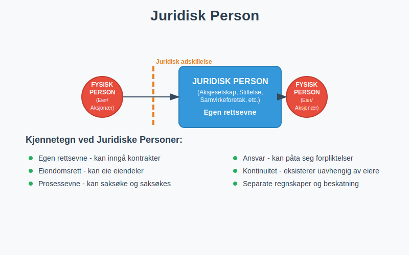
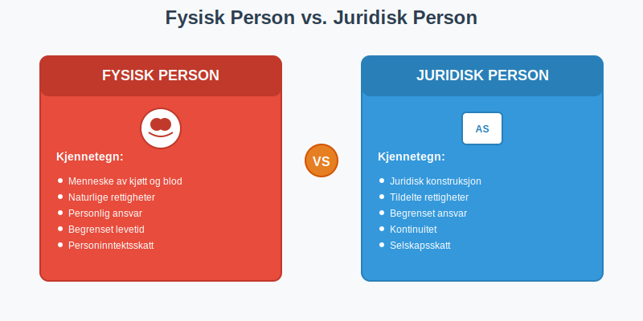
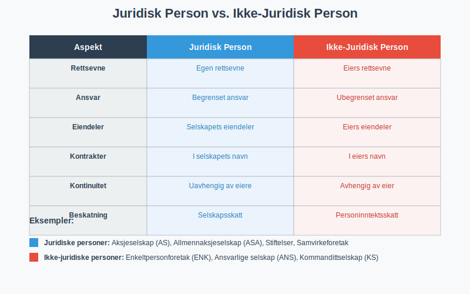
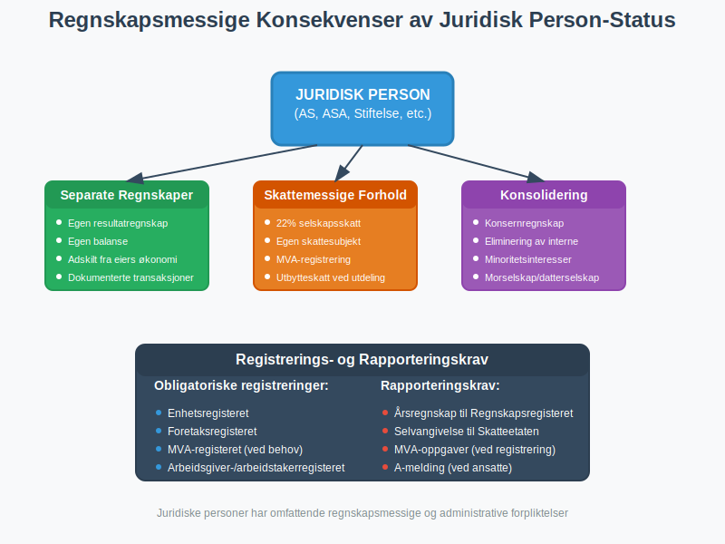
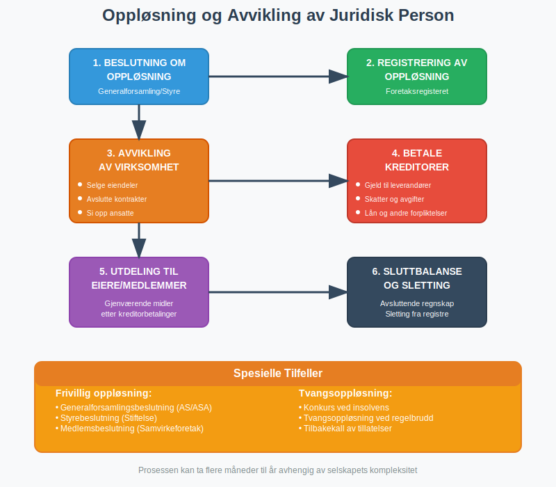

---
title: "Hva er en Juridisk Person?"
meta_title: "Hva er en Juridisk Person?"
meta_description: 'En **juridisk person** er en grunnleggende juridisk konstruksjon som gir en organisasjon eller enhet rettigheter og plikter som er separate fra de fysiske perso...'
slug: hva-er-juridisk-person
type: blog
layout: pages/single
---

En **juridisk person** er en grunnleggende juridisk konstruksjon som gir en organisasjon eller enhet rettigheter og plikter som er separate fra de fysiske personene som eier eller kontrollerer den. I regnskapssammenheng er forståelsen av juridiske personer avgjørende for korrekt bokføring, rapportering og skattemessig behandling.

## Definisjon av Juridisk Person

En **juridisk person** er en enhet som i lovens øyne behandles som en person med egne rettigheter og forpliktelser, selv om den ikke er en fysisk person. Dette juridiske konseptet skiller mellom:

* **Fysiske personer** - mennesker med juridiske rettigheter
* **Juridiske personer** - organisasjoner og enheter med juridiske rettigheter

### Kjennetegn ved Juridiske Personer

Juridiske personer har flere viktige karakteristikker:

* **Egen rettsevne** - kan inngå kontrakter i eget navn
* **Eiendomsrett** - kan eie eiendeler og rettigheter
* **Prosessevne** - kan saksøke og saksøkes
* **Ansvar** - kan påta seg forpliktelser og gjeld
* **Kontinuitet** - eksisterer uavhengig av eiernes liv

## Typer Juridiske Personer i Norge

### Kapitalselskaper

#### Aksjeselskap (AS)
[Aksjeselskapet](/blogs/regnskap/hva-er-et-aksjeselskap "Hva er et Aksjeselskap (AS)? Komplett Guide til Selskapsformen") er den mest vanlige formen for juridisk person:

* **Begrenset ansvar** for aksjonærene
* **Egen juridisk identitet** adskilt fra eierne
* **Selskapets eiendeler** tilhører selskapet, ikke aksjonærene
* **Kontinuitet** - selskapet eksisterer selv om aksjonærer skiftes ut

#### Allmennaksjeselskap (ASA)
For større selskaper med offentlig eierskap:

* **Samme juridiske status** som AS, men større
* **Strengere regulering** og rapporteringskrav
* **Børsnoterte selskaper** er typisk ASA
* **Høyere kapitalkrav** og offentlighet

### Samvirkeforetak

**Samvirkeforetak** er juridiske personer basert på medlemskap:

* **Medlemseid** og demokratisk styrt
* **Egen rettsevne** som juridisk person
* **Begrenset ansvar** for medlemmene
* **Formålsbundet** virksomhet for medlemmenes interesser

### Stiftelser

[Stiftelser](/blogs/regnskap/hva-er-stiftelse "Hva er Stiftelse? Juridiske og Regnskapsmessige Forhold") er juridiske personer uten eiere:

* **Formålsbundet** - må følge stiftelsens vedtekter
* **Ingen eiere** - styres av et styre
* **Egen juridisk identitet** med rettigheter og plikter
* **Kontinuitet** - eksisterer på ubestemt tid
* **Særegne regnskapsregler** og skattemessige forhold

### Offentlige Juridiske Personer

#### Kommuner og Fylkeskommuner
* **Offentlige juridiske personer** med særlige fullmakter
* **Skattleggingsrett** og myndighetsutøvelse
* **Egen økonomi** og regnskapsplikt

#### Statsforetak og Statlige Selskaper
* **Statseide juridiske personer** med kommersiell drift
* **Samme juridiske status** som private selskaper
* **Særlige rapporteringskrav** til staten

## Juridiske Personer vs. Ikke-Juridiske Personer

### Ikke-Juridiske Personer

Enkelte organisasjonsformer er **ikke** juridiske personer:

#### Enkeltpersonforetak (ENK)
[Enkeltpersonforetaket](/blogs/regnskap/hva-er-enkeltpersonforetak "Hva er et Enkeltpersonforetak? Komplett Guide til Selskapsformen") er ikke en juridisk person:

* **Eieren er den juridiske personen** - ikke foretaket
* **Ingen adskillelse** mellom eier og virksomhet
* **Ubegrenset personlig ansvar** for eieren

#### Ansvarlige Selskap (ANS)
* **Ikke egen juridisk person** - deltakerne er de juridiske personene
* **Solidarisk ansvar** for alle deltakere
* **Ingen begrenset ansvar** eller juridisk adskillelse

#### Kommandittselskap (KS)
* **Ikke juridisk person** i tradisjonell forstand
* **Komplementarene** har ubegrenset ansvar
* **Kommandittistene** har begrenset ansvar, men selskapet er ikke juridisk person

### Sammenligning: Juridisk Person vs. Ikke-Juridisk Person

| Aspekt | Juridisk Person | Ikke-Juridisk Person |
|--------|-----------------|----------------------|
| **Rettsevne** | Egen rettsevne | Eiers rettsevne |
| **Ansvar** | Begrenset ansvar | Ubegrenset ansvar |
| **Eiendeler** | Selskapets eiendeler | Eiers eiendeler |
| **Kontrakter** | I selskapets navn | I eiers navn |
| **Kontinuitet** | Uavhengig av eiere | Avhengig av eier |
| **Beskatning** | Selskapsskatt | Personinntektsskatt |

## Regnskapsmessige Konsekvenser

### Separate Regnskaper

Juridiske personer må føre **separate regnskaper**:

* **Selskapets regnskap** er adskilt fra eiernes private økonomi
* **Egen resultatregnskap** og balanse
* **Selskapets eiendeler og gjeld** føres separat
* **Transaksjoner mellom eier og selskap** må dokumenteres

### Konsolidering

For **[konsern](/blogs/regnskap/hva-er-konsern "Hva er et Konsern? Komplett Guide til Konsernstrukturer og Konsernregnskap")** med flere juridiske personer:

* **[Morselskap](/blogs/regnskap/hva-er-morselskap "Hva er et Morselskap? Komplett Guide til Morselskap og Konsernledelse")** og **datterselskap** som separate juridiske personer
* **Konsernregnskap** som kombinerer alle selskapene
* **Eliminering** av interne transaksjoner
* **Minoritetsinteresser** i datterselskaper

### Skattemessige Konsekvenser

#### Selskapsskatt
Juridiske personer betaler **selskapsskatt**:

* **22% selskapsskatt** på overskudd (2024-satser)
* **Egen skattesubjekt** - ikke eiernes skatt
* **Skattemessige avskrivninger** og fradrag
* **Utbytteskatt** ved utdeling til eiere

#### Merverdiavgift
Juridiske personer kan være **merverdiavgiftspliktige**:

* **Egen MVA-registrering** som juridisk person
* **Fradragsrett** for inngående merverdiavgift
* **Rapporteringsplikt** til Skatteetaten

## Etablering og Registrering

### Stiftelse av Juridisk Person

For å etablere en juridisk person kreves:

#### Aksjeselskap (AS)
* **[Vedtekter](/blogs/regnskap/hva-er-vedtekter-for-aksjeselskap "Hva er Vedtekter for Aksjeselskap? Krav og Innhold")** som stiftelsesdokument
* **Minimum 30 000 kr** i [aksjekapital](/blogs/regnskap/hva-er-aksjekapital "Hva er Aksjekapital? Komplett Guide til Egenkapital i AS")
* **Registrering** i Foretaksregisteret
* **[Virksomhetsnummer](/blogs/regnskap/hva-er-virksomhetsnummer "Hva er Virksomhetsnummer? Komplett Guide til Norsk Virksomhetsidentifikasjon")** fra Brønnøysundregistrene

#### Stiftelse
* **Stiftelsesdokument** med formål og vedtekter
* **Stiftelseskapital** (varierende krav)
* **Registrering** hos Stiftelsestilsynet
* **Godkjenning** av formål og vedtekter

### Registreringsplikt

Alle juridiske personer må registreres:

* [**Enhetsregisteret**](/blogs/regnskap/hva-er-enhetsregisteret "Hva er Enhetsregisteret?") - grunnleggende informasjon
* **Foretaksregisteret** - for næringsvirksomhet
* **MVA-registeret** - ved omsetning over 50 000 kr
* **Arbeidsgiver- og arbeidstakerregisteret** - ved ansatte

## Oppløsning og Avvikling

### Frivillig Oppløsning

Juridiske personer kan oppløses:

* **Generalforsamlingsbeslutning** (aksjeselskap)
* **Styrebeslutning** (stiftelse, under visse betingelser)
* **Medlemsbeslutning** (samvirkeforetak)

### Tvangsoppløsning

Offentlige myndigheter kan tvinge oppløsning:

* **Konkurs** ved insolvens
* **Tvangsoppløsning** ved regelbrudd
* **Tilbakekall** av tillatelser

### Avviklingsprosess

Ved oppløsning må juridisk person:

* **Avvikle virksomheten** og selge eiendeler
* **Betale kreditorer** før utdeling til eiere
* **Slette registreringer** i offentlige registre
* **Avslutte regnskapsføring** med sluttbalanse

## Internasjonale Aspekter

### Utenlandske Juridiske Personer

**Utenlandske selskaper** som driver virksomhet i Norge:

* **Registreringsplikt** i norske registre
* **[NUF-registrering](/blogs/regnskap/hva-er-nuf-selskapsform "Hva er NUF? Komplett Guide til Norskregistrert Utenlandsk Foretak")** som alternativ til filial
* **Norsk regnskapsplikt** for norsk virksomhet
* **Skatteplikt** til Norge for norsk inntekt
* **Representant** eller filial i Norge

### Europeiske Selskapsformer

#### Europeisk Aksjeselskap (SE)
* **Europeisk juridisk person** som kan operere i hele EU/EØS
* **Registrert** i ett EU/EØS-land, men kan drive virksomhet overalt
* **Samme rettigheter** som nasjonale selskaper

#### Europeisk Samvirkeforetak (SCE)
* **Samvirkeforetak** med europeisk status
* **Grenseoverskridende** medlemskap og virksomhet
* **Særlige regler** for demokratisk styring

## Praktiske Råd for Regnskapsførere

### Identifikasjon av Juridisk Person

Ved regnskapsføring, sørg for å:

* **Verifisere** om enheten er juridisk person
* **Kontrollere** [virksomhetsnummer](/blogs/regnskap/hva-er-virksomhetsnummer "Hva er Virksomhetsnummer? Komplett Guide til Norsk Virksomhetsidentifikasjon") og registreringer
* **Skille** mellom eiers og selskapets transaksjoner
* **Dokumentere** alle mellomværende med eiere

### Regnskapsmessig Behandling

For juridiske personer:

* **Separate kontoer** for alle transaksjoner
* **Korrekt klassifisering** av eiendeler og gjeld
* **Dokumentasjon** av alle beslutninger og vedtak
* **Overholdelse** av regnskapslovens krav

### Skattemessige Hensyn

Husk å:

* **Beregne selskapsskatt** korrekt
* **HÃ¥ndtere utbytteutdelinger** riktig
* **Dokumentere** fradragsberettigede kostnader
* **Overholde** frister for innlevering

## Fremtidige Utviklinger

### Digitalisering

**Digitale løsninger** påvirker juridiske personer:

* **Elektronisk signering** av stiftelsesdokumenter
* **Digital registrering** i offentlige registre
* **Automatisert rapportering** til myndigheter
* **Blockchain-baserte** selskapsregistre (fremtidig)

### Regulatoriske Endringer

**Nye reguleringer** kan påvirke:

* **Bærekraftsrapportering** for større selskaper
* **Transparensregler** for eierskap
* **Internasjonale skatteregler** (BEPS, pillar 1 og 2)
* **EU-direktiver** som implementeres i norsk rett

## Konklusjon

**Juridiske personer** er fundamentale byggeklosser i moderne næringsliv og regnskap. Forståelsen av deres juridiske status, rettigheter og plikter er avgjørende for:

* **Korrekt regnskapsføring** og rapportering
* **Skattemessig compliance** og optimalisering  
* **Juridisk risikostyring** og ansvarsbegrensning
* **Strategisk planlegging** og selskapsstruktur

Som regnskapsfører eller bedriftseier er det viktig å forstå forskjellene mellom juridiske og ikke-juridiske personer, samt de praktiske konsekvensene dette har for daglig drift og regnskapsføring.

For mer informasjon om spesifikke selskapsformer, se våre artikler om [aksjeselskap](/blogs/regnskap/hva-er-et-aksjeselskap "Hva er et Aksjeselskap (AS)? Komplett Guide til Selskapsformen"), [foretak](/blogs/regnskap/hva-er-foretak "Hva er et Foretak? Komplett Oversikt over Foretaksformer i Norge") og [enkeltpersonforetak](/blogs/regnskap/hva-er-enkeltpersonforetak "Hva er et Enkeltpersonforetak? Komplett Guide til Selskapsformen").
