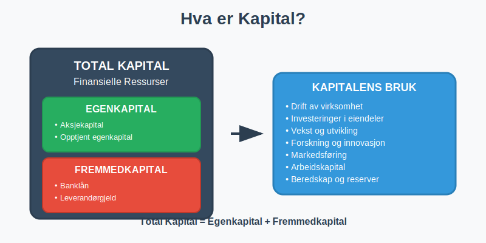
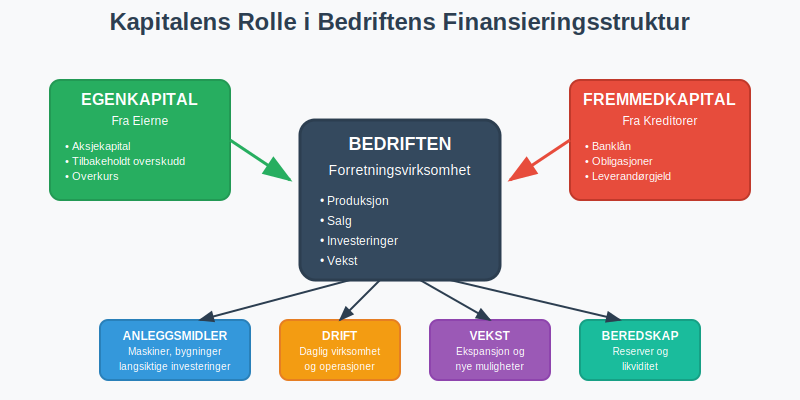
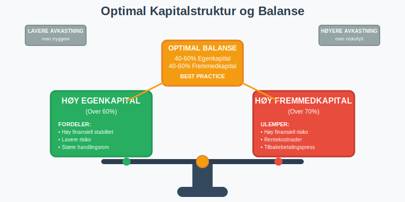
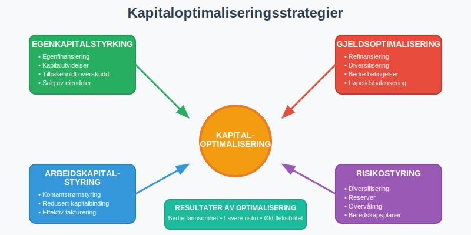

---
title: "Hva er Kapital?"
meta_title: "Hva er Kapital?"
meta_description: '**Kapital** er de finansielle ressursene som er tilgjengelige for en bedrift eller organisasjon til å drive virksomhet, foreta investeringer og skape verdier. ...'
slug: hva-er-kapital
type: blog
layout: pages/single
---

**Kapital** er de finansielle ressursene som er tilgjengelige for en bedrift eller organisasjon til å drive virksomhet, foreta investeringer og skape verdier. Som et grunnleggende begrep i [regnskap](/blogs/regnskap/hva-er-regnskap "Hva er Regnskap? En komplett guide") og økonomi, omfatter kapital alle former for finansiering som gjør det mulig for bedrifter å anskaffe [eiendeler](/blogs/regnskap/hva-er-eiendel "Hva er Eiendel? Komplett Guide til Eiendeler i Regnskapet") og drive forretningsvirksomhet.

### Definisjon og Grunnleggende Forståelse

Kapital kan defineres på flere måter avhengig av kontekst:

#### Regnskapsmessig Definisjon
I regnskapssammenheng representerer kapital:
- **Total finansiering** tilgjengelig for bedriften
- **Summen** av [egenkapital](/blogs/regnskap/hva-er-egenkapital "Hva er Egenkapital? Komplett Guide til Egenkapital i Regnskap") og [fremmedkapital](/blogs/regnskap/hva-er-fremmedkapital "Hva er Fremmedkapital? Komplett Guide til Gjeld og LÃ¥nefinansiering")
- **Finansieringsgrunnlaget** for alle bedriftens aktiviteter

#### Økonomisk Perspektiv
Fra et økonomisk synspunkt er kapital:
- **Produksjonsfaktor** sammen med arbeid og naturressurser
- **Investerbare midler** som kan generere fremtidig avkastning
- **Grunnlag for verdiskaping** og økonomisk vekst

### Hovedtyper av Kapital

Kapital kan klassifiseres på flere måter. Den mest grunnleggende inndelingen skiller mellom **egenkapital** og **fremmedkapital**:

#### 1. Egenkapital
[Egenkapital](/blogs/regnskap/hva-er-egenkapital "Hva er Egenkapital? Komplett Guide til Egenkapital i Regnskap") er kapital som tilhører bedriftens eiere:

**Komponenter av Egenkapital:**
- **[Aksjekapital](/blogs/regnskap/hva-er-aksjekapital "Hva er Aksjekapital? Krav og Forklaring")** - direkte investering fra eierne
- **Opptjent egenkapital** - akkumulert overskudd fra driften
- **Overkurs** - beløp betalt utover pålydende ved aksjeemisjoner
- **Andre egenkapitalposter** - fond og reserver

#### 2. Fremmedkapital
[Fremmedkapital](/blogs/regnskap/hva-er-fremmedkapital "Hva er Fremmedkapital? Komplett Guide til Gjeld og Lånefinansiering") er kapital lånt fra eksterne kilder:

**Typer Fremmedkapital:**
- **Banklån** - tradisjonell lånefinansiering
- **Obligasjoner** - verdipapirbasert gjeld
- **Leverandørgjeld** - kreditt fra leverandører
- **Annen kortsiktig gjeld** - diverse forpliktelser

### Kapitalstruktur og Finansieringsmiks

En bedrifts **kapitalstruktur** refererer til forholdet mellom egenkapital og fremmedkapital:

#### Optimal Kapitalstruktur

| **Kapitaltype** | **Fordeler** | **Ulemper** |
|-----------------|--------------|-------------|
| **Høy Egenkapital** | • Finansiell stabilitet • Lavere risiko • Større handlingsrom | • Lavere avkastning på egenkapital • Dyrere finansiering • Mindre gearing-effekt |
| **Høy Fremmedkapital** | • Skattefordeler (rentefradrag) • Høyere avkastning på egenkapital • Gearing-effekt | • Høyere finansiell risiko • Rentekostnader • Tilbakebetalingsforpliktelser |

### Kapital i Ulike Selskapsformer

#### Aksjeselskap (AS)
- **Minimum [aksjekapital](/blogs/regnskap/hva-er-aksjekapital "Hva er Aksjekapital? Krav og Forklaring"):** 30 000 kr
- **Kapital delt i aksjer** med begrenset ansvar
- **Fleksibel kapitalstruktur** med mulighet for ulike finansieringsformer

#### [Enkeltpersonforetak](/blogs/regnskap/hva-er-enkeltpersonforetak "Hva er Enkeltpersonforetak? Komplett Guide til EPF")
- **Eierens personlige kapital** utgjør egenkapitalen
- **Ubegrenset personlig ansvar** for all gjeld
- **Enklere kapitalstruktur** enn aksjeselskap

#### [Ansvarlig Selskap (ANS)](/blogs/regnskap/ansvarlig-selskap-delt-ansvar "Ansvarlig Selskap og Delt Ansvar: Komplett Guide til ANS")
- **Kapital fra flere deltakere** med solidarisk ansvar
- **Delt eierskap** og ansvar for kapitalen

### Kapitalberegning og Analyse

#### Grunnleggende Kapitalformel
**Total Kapital = Egenkapital + Fremmedkapital**

#### Praktisk Eksempel: Kapitalanalyse

| **Balanseposter** | **Beløp (NOK)** | **Andel av Total Kapital** |
|-------------------|-----------------|---------------------------|
| **EGENKAPITAL** | | |
| Aksjekapital | 200 000 | 13,3% |
| Opptjent egenkapital | 500 000 | 33,3% |
| **Sum egenkapital** | **700 000** | **46,7%** |
| | | |
| **FREMMEDKAPITAL** | | |
| [Langsiktig gjeld](/blogs/regnskap/langsiktig-gjeld "Hva er Langsiktig Gjeld? Komplett Guide til Langsiktige Forpliktelser") | 600 000 | 40,0% |
| Kortsiktig gjeld | 200 000 | 13,3% |
| **Sum fremmedkapital** | **800 000** | **53,3%** |
| | | |
| **TOTAL KAPITAL** | **1 500 000** | **100,0%** |

**Kapitalstruktur-analyse:**
- **Egenkapitalandel:** 46,7% (god soliditet)
- **Gjeldsgrad:** 1,14 (moderat gjeldsbelastning)
- **Balansert finansieringsmiks** mellom egen- og fremmedkapital

### Viktige Kapitalnøkkeltall

#### 1. Egenkapitalandel
**Egenkapitalandel = (Egenkapital / Total Kapital) × 100%**

**Vurderingskriterier:**

| **Egenkapitalandel** | **Vurdering** | **Betydning** |
|---------------------|---------------|---------------|
| Over 40% | Meget god | Høy finansiell stabilitet |
| 30-40% | God | Akseptabel soliditet |
| 20-30% | Middels | Noe risiko, bør overvåkes |
| 10-20% | Svak | Høy gjeldsgrad, finansiell risiko |
| Under 10% | Kritisk | Meget høy risiko |

#### 2. Gjeldsgrad
**Gjeldsgrad = Fremmedkapital / Egenkapital**

#### 3. Kapitalens Avkastning
**Avkastning på Total Kapital = (Resultat før finanskostnader / Gjennomsnittlig total kapital) × 100%**

### Kapitalforvaltning og Optimalisering

#### Strategier for Kapitaloptimalisering

**1. Egenkapitalstyrking**
- **[Egenfinansiering](/blogs/regnskap/hva-er-egenfinansiering "Hva er Egenfinansiering? Komplett Guide til Intern Finansiering")** gjennom tilbakeholdt overskudd
- **Kapitalutvidelser** ved emisjoner
- **Salg av ikke-kjernevirksomhet**

**2. Fremmedkapitaloptimalisering**
- **Refinansiering** til bedre betingelser
- **Diversifisering** av finansieringskilder
- **Balansering** av løpetider

**3. Arbeidskapitalstyring**
- **Optimalisering** av [arbeidskapital](/blogs/regnskap/hva-er-arbeidskapital "Hva er Arbeidskapital? Beregning og Betydning for Likviditet")
- **Effektiv kontantstrømstyring**
- **Reduksjon** av kapitalbinding

### Kapital og Risikostyring

#### Kapitalrisiko
- **Likviditetsrisiko** - mangel på tilgjengelig kapital
- **Kredittrisiko** - tap på utlånt kapital
- **Markedsrisiko** - verdifall på kapitalplasseringer

#### Risikohåndtering
- **Diversifisering** av kapitalkilder
- **Opprettholdelse** av tilstrekkelige reserver
- **Regelmessig overvåking** av kapitalposisjon

### Kapital i Ulike Bransjer

#### Kapitalintensive Bransjer
- **Industri og produksjon** - høye investeringer i maskiner og utstyr
- **Eiendom** - store kapitalbehov for eiendomsinvesteringer
- **Energi** - omfattende infrastrukturinvesteringer

#### Mindre Kapitalintensive Bransjer
- **Tjenesteyting** - lavere kapitalbehov
- **Teknologi** - fokus på menneskelig kapital
- **Konsulentvirksomhet** - minimal fysisk kapital

### Kapital og Skattehensyn

#### Skattemessige Aspekter
- **Rentefradrag** på fremmedkapital reduserer skattekostnaden
- **Utbytteskatt** på egenkapitalavkastning
- **Kapitalgevinstbeskatning** ved salg av kapitalplasseringer

#### Skatteoptimalisering
- **Balansering** mellom rente- og utbytteinntekter
- **Timing** av kapitalgevinster og -tap
- **Utnyttelse** av skattemessige fordeler

### Internasjonale Kapitalmuligheter

#### Utenlandsk Kapital
- **Internasjonale lån** og kredittfasiliteter
- **Utenlandske investorer** i egenkapital
- **Valutarisiko** ved utenlandsk finansiering

#### Kapitalmarkeder
- **Børsnotering** for tilgang til kapitalmarkeder
- **Obligasjonsutstedelser** for større kapitalbehov
- **Private equity** og venturekapital

### Fremtidens Kapital

#### Nye Kapitalformer
- **Grønn finansiering** og bærekraftig kapital
- **Crowdfunding** og alternative finansieringsformer
- **Kryptovaluta** og digitale eiendeler

#### Teknologiske Endringer
- **Fintech-løsninger** for kapitalforvaltning
- **Automatiserte investeringsplattformer**
- **Blockchain-baserte finansieringsløsninger**

### Praktiske RÃ¥d for Kapitalforvaltning

#### For Små og Mellomstore Bedrifter
- **Bygg opp egenkapital** gradvis gjennom lønnsom drift
- **Diversifiser finansieringskilder** for å redusere risiko
- **Overvåk kapitalstrukturen** regelmessig
- **Planlegg kapitalbehov** på lang sikt

#### For Gründere
- **Start med tilstrekkelig startkapital**
- **Vurder ulike finansieringsalternativer**
- **Behold kontroll** over kapitalstrukturen
- **Søk profesjonell rådgivning** ved større kapitalendringer

### Kapital og Bærekraft

#### ESG-hensyn (Environmental, Social, Governance)
- **Grønn kapital** for miljøvennlige investeringer
- **Sosial kapital** og samfunnsansvar
- **God selskapsstyring** tiltrekker kapital

#### Bærekraftig Kapitalforvaltning
- **Langsiktig verdiskaping** fremfor kortsiktig profitt
- **Integrering** av bærekraftshensyn i kapitalallokering
- **Rapportering** på bærekraftsmål og -resultater

### Konklusjon

Kapital er grunnlaget for all forretningsvirksomhet og en kritisk suksessfaktor for bedrifter. En **optimal kapitalstruktur** balanserer risiko og avkastning, mens **effektiv kapitalforvaltning** sikrer tilgang til nødvendige finansielle ressurser for vekst og utvikling.

Forståelse av kapitalets ulike former, fra [egenkapital](/blogs/regnskap/hva-er-egenkapital "Hva er Egenkapital? Komplett Guide til Egenkapital i Regnskap") til [fremmedkapital](/blogs/regnskap/hva-er-fremmedkapital "Hva er Fremmedkapital? Komplett Guide til Gjeld og Lånefinansiering"), er essensielt for å ta informerte beslutninger om finansiering og investeringer. Ved å følge beste praksis for kapitalforvaltning kan bedrifter sikre finansiell stabilitet og skape langsiktig verdier for alle interessenter.

For dypere innsikt i spesifikke aspekter av kapital, anbefaler vi å lese våre detaljerte artikler om [egenkapital](/blogs/regnskap/hva-er-egenkapital "Hva er Egenkapital? Komplett Guide til Egenkapital i Regnskap"), [fremmedkapital](/blogs/regnskap/hva-er-fremmedkapital "Hva er Fremmedkapital? Komplett Guide til Gjeld og Lånefinansiering"), [arbeidskapital](/blogs/regnskap/hva-er-arbeidskapital "Hva er Arbeidskapital? Beregning og Betydning for Likviditet"), og [sysselsatt kapital](/blogs/regnskap/hva-er-sysselsatt-kapital "Hva er Sysselsatt Kapital? Komplett Guide til ROCE og Kapitaleffektivitet").

