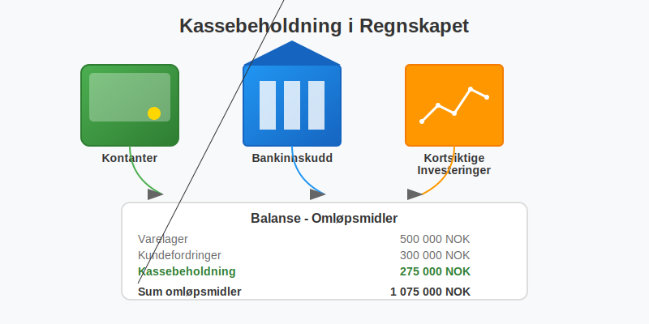
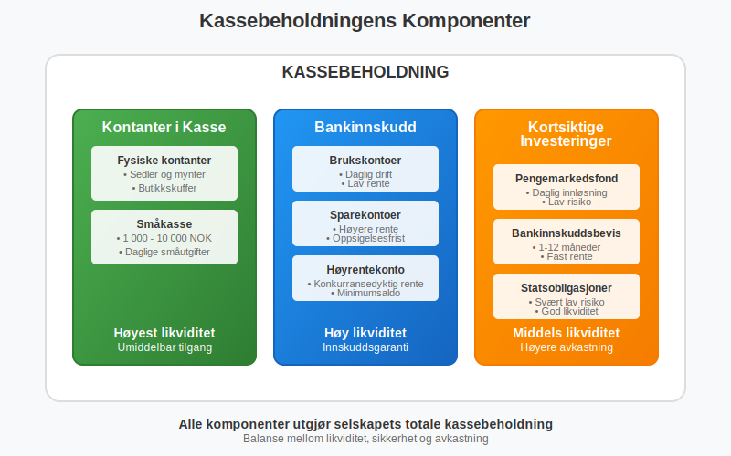
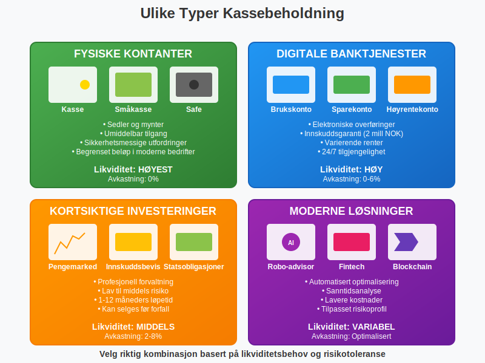
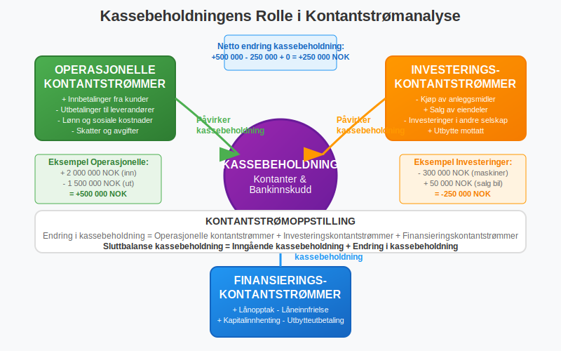
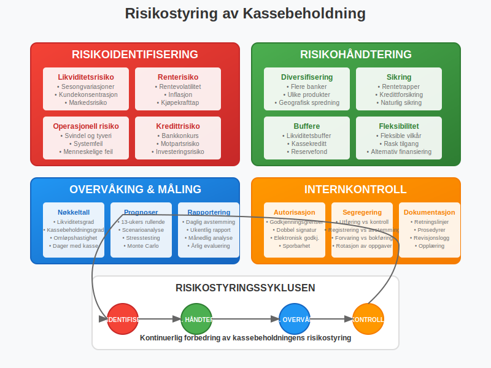
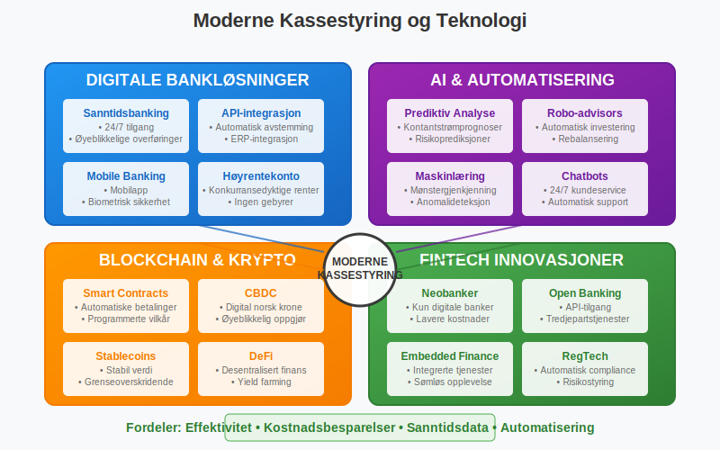
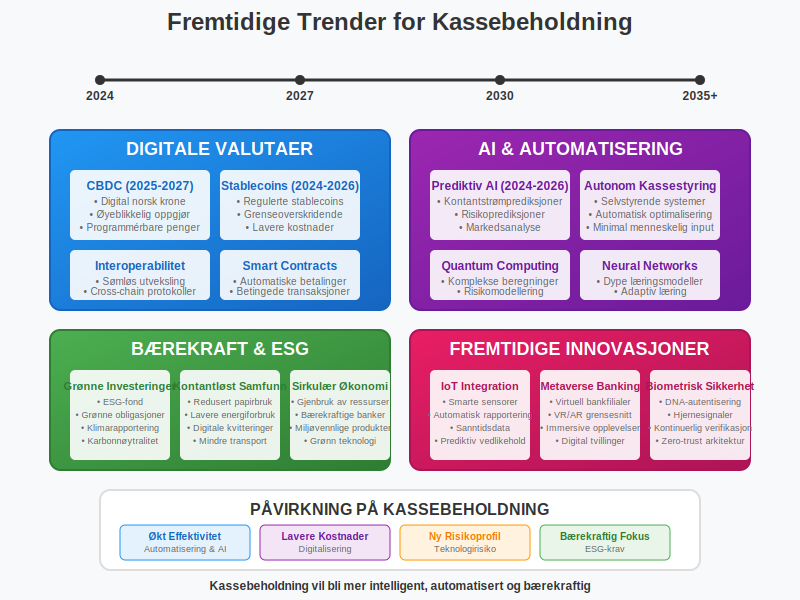

---
title: "Hva er Kassebeholdning?"
seoTitle: "Hva er Kassebeholdning?"
description: '**Kassebeholdning** er selskapets beholdning av kontanter og andre likvide midler som kan brukes umiddelbart til å dekke løpende forpliktelser og operasjonell...'
---

**Kassebeholdning** er selskapets beholdning av kontanter og andre likvide midler som kan brukes umiddelbart til å dekke løpende forpliktelser og operasjonelle behov. Som en av de mest likvide [eiendelene](/blogs/regnskap/hva-er-eiendel "Hva er Eiendel? Komplett Guide til Eiendeler i Regnskapet") i [balansen](/blogs/regnskap/hva-er-balanse "Hva er Balanse? Komplett Guide til Balanseregnskap"), spiller kassebeholdning en kritisk rolle i selskapets [likviditetsstyring](/blogs/regnskap/hva-er-arbeidskapital "Hva er Arbeidskapital? Beregning og Betydning for Bedrifter") og daglige drift.



### Definisjon og Grunnleggende Forståelse

Kassebeholdning kan defineres på flere måter avhengig av kontekst og regnskapsstandard:

#### Regnskapsmessig Definisjon
Kassebeholdning = **Kontanter + Bankinnskudd + Kortsiktige Investeringer**

Dette omfatter alle midler som er umiddelbart tilgjengelige for bruk uten vesentlige restriksjoner.

#### Økonomisk Perspektiv
Fra et økonomisk perspektiv representerer kassebeholdning:
- **[Likvide midler](/blogs/regnskap/hva-er-likvide-midler "Hva er likvide midler? Definisjon, Eksempler og Regnskapsføring")** som kan brukes øyeblikkelig
- **Sikkerhetsbuffer** mot uforutsette utgifter
- **Operasjonell fleksibilitet** for daglig drift
- **Investeringsmuligheter** som kan gripes raskt



### Kassebeholdningens Komponenter

Kassebeholdning består av flere hovedkategorier som vises i balansens omløpsmidler:

#### 1. Kontanter i Kasse

**Fysiske kontanter**
- Sedler og mynter i selskapets kasse
- Kontanter i butikkskuffer og vekslekasser
- **Begrenset beløp** i de fleste moderne bedrifter
- Sikkerhetsmessige utfordringer ved oppbevaring

**Småkasse (Petty Cash)**
- Mindre kontantbeløp for daglige småutgifter
- Typisk 1 000 - 10 000 NOK
- Krever **intern kontroll** og dokumentasjon
- Regelmessig avstemming og påfylling

#### 2. Bankinnskudd

**Brukskontoer**
- Daglige driftskontoer for løpende transaksjoner
- Umiddelbar tilgang til midlene
- Lav eller ingen rente
- Høy likviditet og fleksibilitet

**Sparekontoer**
- Høyere rente enn brukskontoer
- Noe begrenset tilgang (oppsigelsesfrist)
- Sikker plassering av overskuddslikviditet
- Innskuddsgaranti opp til 2 millioner NOK

**Høyrentekonto**
- Konkurransedyktige renter
- Krav til minimumsaldo
- Begrenset antall transaksjoner per måned
- Balanse mellom avkastning og likviditet

#### 3. Kortsiktige Investeringer

**Pengemarkedsfond**
- Profesjonell forvaltning av likvide midler
- Daglig innløsning
- Lav risiko og stabil verdi
- Bedre avkastning enn tradisjonelle sparekontoer

**Bankinnskuddsbevis**
- Fast rente over en bestemt periode
- Typisk 1-12 måneders løpetid
- Høyere rente enn vanlige innskudd
- Kan selges før forfall (med mulig tap)

**Statsobligasjoner (kortsiktige)**
- Svært lav risiko
- God likviditet i annenhåndsmarkedet
- Stabil verdiutvikling
- Lett å verdsette til markedsverdi



### Kassebeholdning i Regnskapet

#### Plassering i Balansen

Kassebeholdning vises som **omløpsmidler** i balansen, typisk som den siste og mest likvide posten:

| **Omløpsmidler** | **Beløp (NOK)** | **Likviditet** |
|------------------|-----------------|----------------|
| Varelager | 500 000 | Lav |
| Kundefordringer | 300 000 | Middels |
| Andre kortsiktige fordringer | 100 000 | Middels |
| **Bankinnskudd** | **250 000** | **Høy** |
| **Kontanter** | **25 000** | **Høyest** |
| **Sum kassebeholdning** | **275 000** | |
| **Sum omløpsmidler** | **1 175 000** | |

#### Regnskapsføring av Kassebeholdning

**Økning i kassebeholdning:**
```
Debet: Bank/Kasse
Kredit: Inntektskonto/Kundefordringer
```

**Reduksjon i kassebeholdning:**
```
Debet: Kostnadskonto/Leverandørgjeld
Kredit: Bank/Kasse
```

### Kassebeholdningens Rolle i Kontantstrømanalyse

Kassebeholdning er utgangspunktet for [kontantstrømoppstillingen](/blogs/regnskap/hva-er-regnskap "Hva er Regnskap? En komplett guide") og påvirker alle tre hovedkategorier:

#### Operasjonelle Kontantstrømmer
- **Innbetalinger** fra kunder øker kassebeholdningen - spesielt ved bruk av [kontantfaktura](/blogs/regnskap/hva-er-kontantfaktura "Hva er Kontantfaktura? Komplett Guide til Kontantfakturering i Norge") som sikrer umiddelbar betaling
- **Utbetalinger** til leverandører reduserer kassebeholdningen
- **Lønn og sosiale kostnader** påvirker kassebeholdningen direkte
- **Skatter og avgifter** krever tilstrekkelig kassebeholdning

#### Investeringskontantstrømmer
- **Kjøp av anleggsmidler** reduserer kassebeholdningen betydelig
- **Salg av eiendeler** øker kassebeholdningen
- **Investeringer** i andre selskaper påvirker likviditeten
- **Utbytte mottatt** øker kassebeholdningen

#### Finansieringskontantstrømmer
- **Lånopptak** øker kassebeholdningen umiddelbart
- **Låneinnfrielse** reduserer kassebeholdningen
- **Utbytteutbetalinger** krever tilstrekkelig kassebeholdning
- **Kapitalinnhenting** øker kassebeholdningen



### Optimal Kassebeholdning

#### Faktorer som Påvirker Optimal Kassebeholdning

**Bransje og Sesongvariasjoner**
- **Detaljhandel** krever høyere kassebeholdning under høysesonger
- **Byggebransjen** har store prosjektutbetalinger
- **Tjenestebedrifter** har mer forutsigbare kontantstrømmer
- **Produksjonsbedrifter** må finansiere råvareinnkjøp

**Selskapets Størrelse**
- **Store selskaper** har bedre tilgang til kreditt
- **Små bedrifter** er mer avhengige av kassebeholdning
- **Børsnoterte selskaper** har flere finansieringsalternativer
- **Familieselskaper** prioriterer ofte høyere kassebeholdning

#### Beregning av Optimal Kassebeholdning

**Baumol-modellen** for optimal kassebeholdning:

**Optimal kassebeholdning = ˆš(2 × Årlige kontantutbetalinger × Transaksjonskostnad / Rentesats)**

**Eksempel:**
- Årlige kontantutbetalinger: 12 000 000 NOK
- Transaksjonskostnad per handel: 500 NOK
- Rentesats på investeringer: 4%

Optimal kassebeholdning = ˆš(2 × 12 000 000 × 500 / 0,04) = **ˆš300 000 000 = 547 723 NOK**

#### Miller-Orr Modellen

For mer variable kontantstrømmer brukes Miller-Orr modellen:

| **Parameter** | **Verdi** | **Forklaring** |
|---------------|-----------|----------------|
| **Nedre grense** | 100 000 NOK | Minimum kassebeholdning |
| **Øvre grense** | 400 000 NOK | Maksimum før investering |
| **Målnivå** | 200 000 NOK | Ønsket kassebeholdning |
| **Standardavvik** | 50 000 NOK | Variasjon i daglige kontantstrømmer |

### Kassestyring og Likviditetsstyring

#### Daglig Kassestyring

**Kontantprognose**
- **Kortsiktige prognoser** (1-4 uker) for daglig drift
- **Mellomlangsiktige prognoser** (1-12 måneder) for planlegging
- **Langsiktige prognoser** (1-3 år) for strategiske beslutninger
- **Rullende prognoser** som oppdateres kontinuerlig

**Likviditetsstyring**
- **Daglig avstemming** av alle bankkontoer
- **Overvåking** av inn- og utbetalinger
- **Optimalisering** av kontosaldoer
- **Automatisering** av rutinetransaksjoner

#### Kassekreditt og Finansiering

**Kassekreditt som Sikkerhetsnett**
- **Fleksibel finansiering** for kortsiktige behov
- **Rask tilgang** til ekstra likviditet
- **Variabel rente** basert på markedsrenter
- **Sikkerhetsstillelse** i form av pant eller kausjon

| **Kassekreditttype** | **Rente** | **Gebyr** | **Sikkerhet** |
|---------------------|-----------|-----------|---------------|
| **Usikret kassekreditt** | 8-12% | 0,5-1% | Ingen |
| **Sikret kassekreditt** | 6-9% | 0,25-0,5% | Pant i eiendeler |
| **Kontokortkreditt** | 15-25% | Ingen | Begrenset ramme |

### Risikostyring av Kassebeholdning

#### Likviditetsrisiko

**Identifisering av Risiko**
- **Sesongvariasjoner** i kontantstrømmer
- **Kundekonsentrasjonsrisiko** ved få store kunder
- **Leverandørkonsentrasjonsrisiko** ved kritiske leverandører
- **Markedsrisiko** ved økonomiske nedgangstider

**Risikohåndtering**
- **Diversifisering** av inntektskilder
- **Fleksible betalingsvilkår** med kunder og leverandører
- **Kredittforsikring** på store kundefordringer
- **Likviditetsbuffere** for uforutsette hendelser

#### Renterisiko

**Påvirkning på Kassebeholdning**
- **Stigende renter** øker avkastningen på bankinnskudd
- **Fallende renter** reduserer inntektene fra kassebeholdning
- **Rentevolatilitet** påvirker verdien av kortsiktige investeringer
- **Inflasjon** reduserer kjøpekraften til kassebeholdning

**Sikringsstrategier**
- **Rentetrapper** for å spre renterisiko over tid
- **Flytende vs. fast rente** på bankinnskudd
- **Kortsiktige investeringer** med variabel avkastning
- **Naturlig sikring** gjennom matchende aktiva og passiva



### Kassebeholdning og Skattemessige Forhold

#### Skattlegging av Renteinntekter

**Renteinntekter fra Bankinnskudd**
- Skattepliktige som **finansinntekter**
- Beskattes med ordinær skattesats (22% for selskaper)
- **Kildeskatt** kan trekkes på enkelte typer innskudd
- **Rapporteringsplikt** til skattemyndighetene

**Gevinst/Tap på Kortsiktige Investeringer**
- **Realiserte gevinster** er skattepliktige
- **Urealiserte gevinster** beskattes ikke før realisering
- **Tap** kan fradras mot andre kapitalinntekter
- **Valutagevinster/-tap** på utenlandske innskudd

#### Optimal Skatteplanlegging

| **Investeringstype** | **Skattebehandling** | **Effektiv avkastning** |
|---------------------|---------------------|------------------------|
| **Bankinnskudd (4%)** | Skattepliktig | 3,12% (etter 22% skatt) |
| **Pengemarkedsfond (3,5%)** | Skattepliktig | 2,73% (etter 22% skatt) |
| **Aksjesparekonto** | Utsatt skatt | Variabel |

### Kassebeholdning i Ulike Selskapsformer

#### Aksjeselskap (AS)
- **Begrenset ansvar** beskytter eiernes private midler
- **Fleksible finansieringsalternativer** gjennom [aksjekapital](/blogs/regnskap/hva-er-aksjekapital "Hva er Aksjekapital? Krav og Forklaring")
- **Profesjonell kassestyring** med styrets ansvar
- **Revisjonsplikt** sikrer kontroll med kassebeholdning

#### Enkeltpersonforetak
- **Enkel kassestyring** med personlig ansvar
- **Begrenset tilgang** til ekstern finansiering
- **Høyere kassebeholdning** som sikkerhetsbuffer
- **Personlig økonomi** blandes med bedriftens kassebeholdning

#### [Ansvarlig Selskap (ANS)](/blogs/regnskap/ansvarlig-selskap-delt-ansvar "Ansvarlig Selskap og Delt Ansvar: Komplett Guide til ANS")
- **Delt ansvar** for kassestyring mellom deltakerne
- **Kompleks beslutningsprosess** for større investeringer
- **Solidarisk ansvar** for kassebeholdningens forvaltning
- **Avtaleregulert** fordeling av kassebeholdning

### Teknologi og Moderne Kassestyring

#### Digitale Betalingsløsninger

**Elektroniske Betalinger**
- **Bankoverføringer** reduserer behovet for kontanter
- **Kortbetalinger** gir raskere kontantstrøm
- **Mobile betalingsløsninger** øker betalingsfleksibilitet
- **Automatiserte betalinger** reduserer administrative kostnader

**Kassestyringssystemer**
- **Sanntidsovervåking** av alle bankkontoer
- **Automatisk avstemming** av transaksjoner
- **Prognoseverktøy** for kontantstrømplanlegging
- **Integrasjon** med [regnskapssystem](/blogs/regnskap/hva-er-regnskap "Hva er Regnskap? En komplett guide")

#### Fintech og Kassebeholdning

**Digitale Bankløsninger**
- **Høyere renter** på digitale sparekontoer
- **Lavere gebyrer** for transaksjoner
- **Bedre brukeropplevelse** og tilgjengelighet
- **Innovative spareprodukter** med fleksible vilkår

**Automatisert Investering**
- **Robo-advisors** for overskuddslikviditet
- **Automatisk rebalansering** av investeringsportefølje
- **Lavere forvaltningskostnader** enn tradisjonelle løsninger
- **Tilpasset risikoprofil** basert på selskapets behov



### Nøkkeltall og Analyse av Kassebeholdning

#### Likviditetsanalyse

**Likviditetsgrad 1 (Løpende likviditet)**
Likviditetsgrad 1 = (Omløpsmidler) / (Kortsiktig gjeld)

**Likviditetsgrad 2 (Hurtig likviditet)**
Likviditetsgrad 2 = (Omløpsmidler - Varelager) / (Kortsiktig gjeld)

**Kassebeholdningsgrad**
Kassebeholdningsgrad = (Kassebeholdning) / (Kortsiktig gjeld)

#### Eksempel på Likviditetsanalyse

| **Nøkkeltall** | **Beregning** | **Resultat** | **Vurdering** |
|----------------|---------------|--------------|---------------|
| **Likviditetsgrad 1** | 1 175 000 / 500 000 | 2,35 | God likviditet |
| **Likviditetsgrad 2** | 675 000 / 500 000 | 1,35 | Akseptabel |
| **Kassebeholdningsgrad** | 275 000 / 500 000 | 0,55 | Meget god |

#### Effektivitetsanalyse

**Kassebeholdningens Omløpshastighet**
Omløpshastighet = (Årlige kontantutbetalinger) / (Gjennomsnittlig kassebeholdning)

**Dager med Kassebeholdning**
Dager = 365 / Omløpshastighet

**Eksempel:**
- Årlige kontantutbetalinger: 6 000 000 NOK
- Gjennomsnittlig kassebeholdning: 300 000 NOK
- Omløpshastighet: 6 000 000 / 300 000 = 20 ganger
- Dager med kassebeholdning: 365 / 20 = **18,3 dager**

### Internkontroll og Kassebeholdning

#### Kontrollrutiner for Kassebeholdning

**Daglige Kontroller**
- **Avstemming** av alle bankkontoer
- **Kontroll** av kontantbeholdning i kasse
- **Registrering** av alle inn- og utbetalinger
- **Oppfølging** av uvanlige transaksjoner

**Månedlige Kontroller**
- **Bankavstemming** mot regnskapet
- **Analyse** av kontantstrømmer
- **Vurdering** av kassebeholdningens størrelse
- **Rapportering** til ledelsen

**Årlige Kontroller**
- **Revisjon** av kassestyringsrutiner
- **Evaluering** av intern kontroll
- **Oppdatering** av retningslinjer
- **Kompetanseutvikling** for ansatte

#### Segregering av Oppgaver

| **Funksjon** | **Ansvarlig** | **Kontroll** |
|--------------|---------------|--------------|
| **Godkjenning av utbetalinger** | Økonomisjef | Daglig leder |
| **Utføring av betalinger** | Regnskapsfører | Økonomisjef |
| **Registrering i regnskap** | Bokholder | Regnskapsfører |
| **Avstemming av banker** | Controller | Økonomisjef |

### Kassebeholdning og Bærekraft

#### Miljømessige Hensyn

**Redusert Kontantbruk**
- **Mindre papirproduksjon** for sedler og mynter
- **Redusert transport** av kontanter
- **Lavere energiforbruk** i bankfilialer
- **Digitale kvitteringer** reduserer papirforbruk

**Bærekraftige Investeringer**
- **Grønne obligasjoner** for overskuddslikviditet
- **ESG-fond** med miljøfokus
- **Bærekraftige banker** som prioriterer miljøhensyn
- **Klimarapportering** av investeringer

#### Sosiale Hensyn

**Finansiell Inkludering**
- **Tilgang** til banktjenester for alle ansatte
- **Opplæring** i personlig økonomi
- **Fleksible betalingsløsninger** for kunder
- **Støtte** til lokale finansinstitusjoner

### Fremtidige Trender for Kassebeholdning

#### Digitale Valutaer

**Sentralbankens Digitale Valuta (CBDC)**
- **Norges Bank** utvikler digital krone
- **Øyeblikkelige oppgjør** mellom bedrifter
- **Reduserte transaksjonskostnader**
- **Ny infrastruktur** for betalinger

**Kryptovalutaer**
- **Bitcoin** og andre kryptovalutaer som verdilager
- **Stablecoins** knyttet til tradisjonelle valutaer
- **Regulatorisk usikkerhet** rundt skattebehandling
- **Volatilitet** som utfordring for kassestyring

#### Kunstig Intelligens og Automatisering

**AI-drevet Kassestyring**
- **Prediktive modeller** for kontantstrømmer
- **Automatisk optimalisering** av kassebeholdning
- **Sanntidsanalyse** av likviditetsrisiko
- **Personaliserte anbefalinger** for investeringer

**Blockchain-teknologi**
- **Smart contracts** for automatiske betalinger
- **Transparent** og sporbar transaksjonshistorikk
- **Reduserte mellommenn** i betalingskjeden
- **Økt sikkerhet** mot svindel og feil



### Praktiske Tips for Kassestyring

#### For Små Bedrifter

**Grunnleggende Kassestyring**
- **Opprett separate** forretnings- og private kontoer
- **Bruk regnskapssystem** for å spore kontantstrømmer
- **Sett opp automatiske** betalinger for faste kostnader
- **Oppretthold** en kassebuffer på 3-6 måneders driftskostnader

**Kostnadseffektive Løsninger**
- **Sammenlign bankgebyrer** og velg kostnadseffektive løsninger
- **Bruk digitale betalingsløsninger** for å redusere kontanthåndtering
- **Investér overskuddslikviditet** i høyrentekonto eller pengemarkedsfond
- **Automatiser** så mange rutiner som mulig

#### For Mellomstore Bedrifter

**Avansert Kassestyring**
- **Implementer kasseprognoser** med rullende 13-ukers horisont
- **Etabler kredittlinjer** som sikkerhetsnett
- **Diversifiser** kassebeholdningen på flere banker
- **Vurder** kortsiktige investeringsalternativer

**Organisatoriske Tiltak**
- **Definer klare roller** og ansvar for kassestyring
- **Etabler godkjenningsrutiner** for større utbetalinger
- **Implementer** månedlig rapportering til ledelsen
- **Gjennomfør** årlige evalueringer av kassestyringsrutiner

#### For Store Bedrifter

**Sofistikert Kassestyring**
- **Sentralisert kassestyring** for hele konsernet
- **Avanserte prognoseverktøy** med scenarioanalyser
- **Profesjonell** treasury-funksjon
- **Integrerte** ERP-systemer for sanntidsrapportering

**Strategiske Vurderinger**
- **Kapitalallokering** mellom ulike forretningsområder
- **Valutasikring** for internasjonale operasjoner
- **Optimalisering** av konsernets samlede kassebeholdning
- **Strategiske investeringer** av overskuddslikviditet

### Konklusjon

Kassebeholdning er en kritisk komponent i enhver bedrifts finansielle struktur og operasjonelle suksess. **Effektiv kassestyring** krever en balanse mellom å opprettholde tilstrekkelig likviditet for daglig drift og å optimalisere avkastningen på overskuddslikviditet.

**Nøkkelprinsipper for suksessfull kassestyring:**

- **Planlegging**: Utvikle nøyaktige kontantstrømprognoser
- **Kontroll**: Implementer robuste internkontrollrutiner  
- **Optimalisering**: Maksimer avkastningen på kassebeholdning
- **Risikostyring**: Identifiser og håndter likviditetsrisiko
- **Teknologi**: Utnytt moderne verktøy for effektiv kassestyring

Ved å følge disse prinsippene og tilpasse kassestyringsstrategien til selskapets spesifikke behov og risikoprofil, kan bedrifter sikre både **finansiell stabilitet** og **optimal kapitalutnyttelse**. Kassebeholdning er ikke bare en nødvendighet for daglig drift, men også et strategisk verktøy for å gripe forretningsmuligheter og navigere gjennom økonomiske utfordringer.

 I en stadig mer digitalisert verden vil kassestyring fortsette å utvikle seg, med nye teknologier og finansielle instrumenter som gir bedrifter enda flere muligheter for å optimalisere sin kassebeholdning og likviditetsstyring.

## Relaterte Konsepter

* [Kassekreditt](/blogs/regnskap/kassekreditt "Kassekreditt: Overdraft og Likviditetsstyring")


