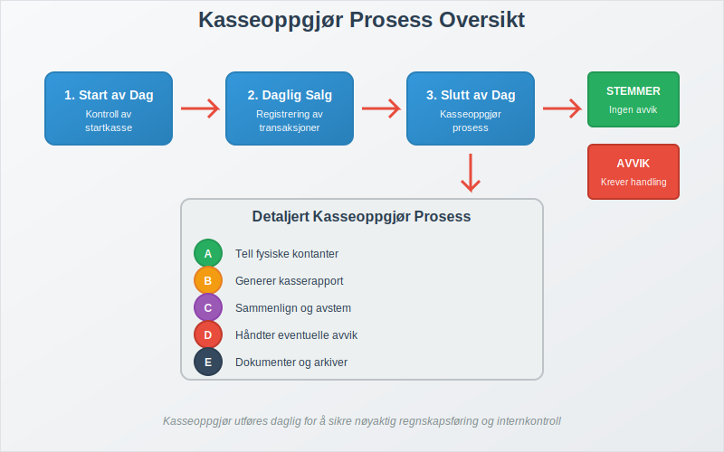
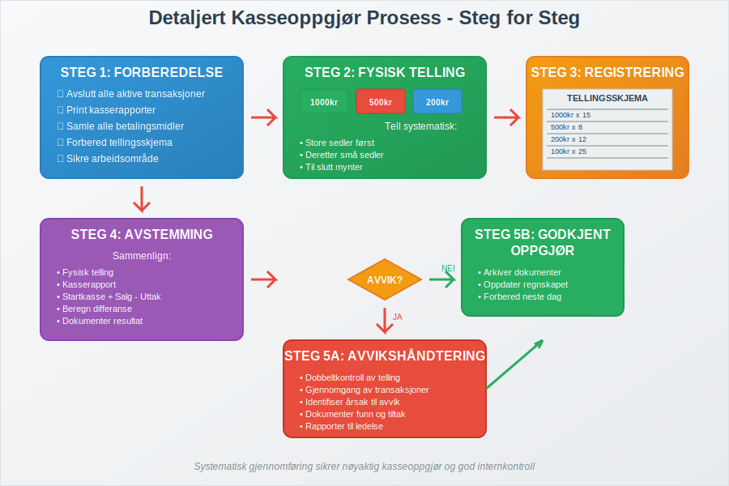
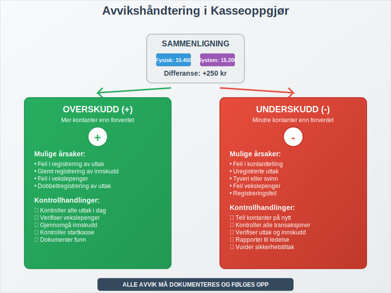
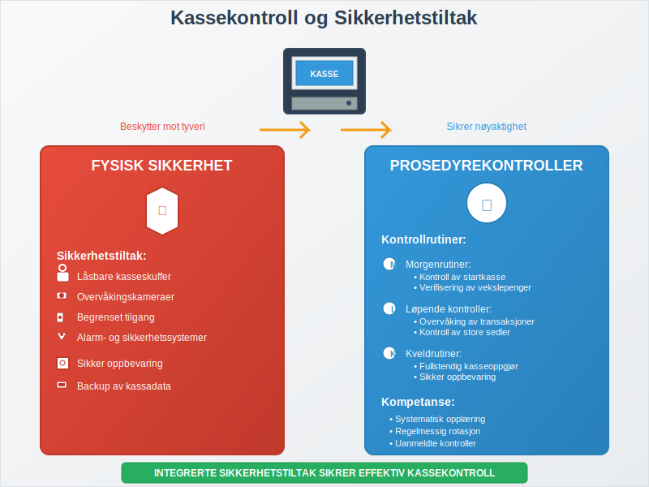
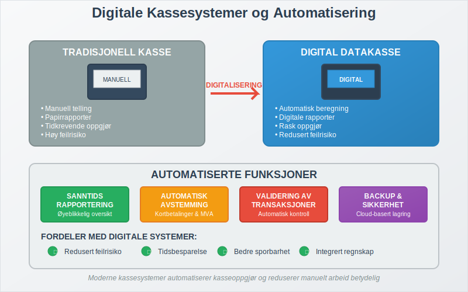
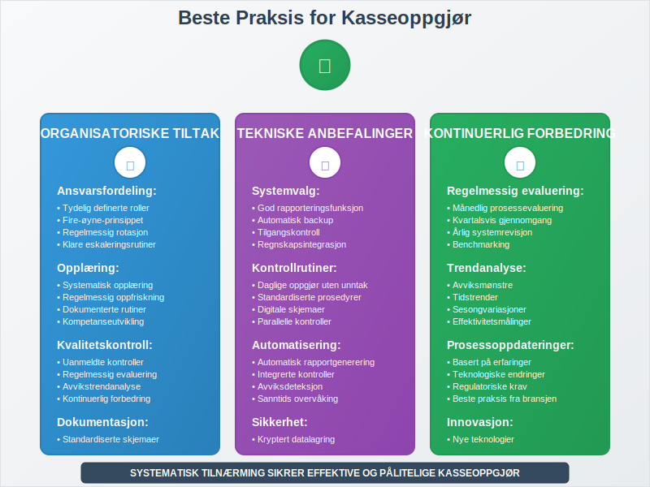
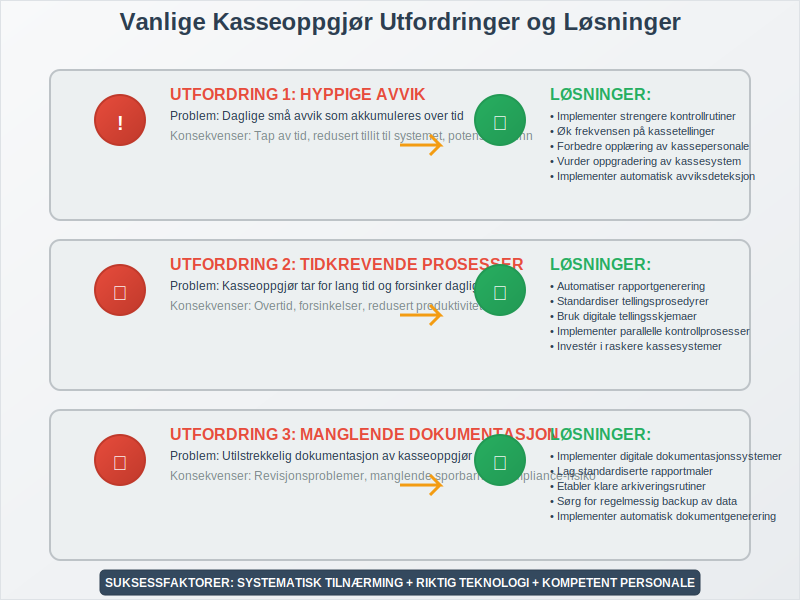

---
title: "Hva er Kasseoppgjør?"
meta_title: "Hva er Kasseoppgjør?"
meta_description: '**Kasseoppgjør** er den daglige prosessen med å avstemme fysisk kassebeholdning mot registrerte salg og transaksjoner i kassasystemet. Dette er en kritisk kon...'
slug: hva-er-kasseoppgjor
type: blog
layout: pages/single
---

**Kasseoppgjør** er den daglige prosessen med å avstemme fysisk kassebeholdning mot registrerte salg og transaksjoner i kassasystemet. Dette er en kritisk kontrollrutine som sikrer at alle kontanttransaksjoner er korrekt registrert og at det ikke er avvik mellom faktisk kontantbeholdning og det som er registrert i [datakassen](/blogs/regnskap/hva-er-datakasse "Hva er Datakasse? Komplett Guide til Kassasystem, Krav og Regnskapsføring"). Kasseoppgjør er en sentral del av [internkontrollen](/blogs/regnskap/hva-er-internkontroll "Hva er Internkontroll? Komplett Guide til Risikostyring og Kontrollsystemer") og bidrar til å opprettholde god [regnskapsskikk](/blogs/regnskap/god-regnskapsskikk "God Regnskapsskikk - Komplett Guide til Regnskapsprinsipper og Beste Praksis").
Mange virksomheter oppbevarer kontanter i en [kontantkasse](/blogs/regnskap/kontantkasse "Kontantkasse") før den daglige avstemmingen.

## Seksjon 1: Hva er Kasseoppgjør?

Kasseoppgjør er en **systematisk avstemmingsprosess** som utføres daglig, vanligvis ved slutten av arbeidsdagen eller skiftet. Prosessen innebærer å sammenligne den fysiske kontantbeholdningen i kassen med de registrerte salgstransaksjonene i kassasystemet. Dette er en form for [avstemming](/blogs/regnskap/hva-er-avstemming "Hva er Avstemming i Regnskap? Komplett Guide til Regnskapsavstemming") som sikrer at alle kontanttransaksjoner er korrekt dokumentert.



### Formål med Kasseoppgjør

Kasseoppgjør har flere viktige formål:

* **Kontroll av kontantbeholdning:** Sikre at fysisk kontant stemmer med registrerte transaksjoner
* **Oppdagelse av feil:** Identifisere feil i registrering eller håndtering av kontanter
* **Forebygging av svinn:** Redusere risiko for tyveri eller feilaktig håndtering
* **Regnskapsmessig nøyaktighet:** Sikre korrekt [bokføring](/blogs/regnskap/hva-er-bokforing "Hva er Bokføring? Komplett Guide til Regnskapsføring og Bokføringsregler") av kontantsalg
* **Overholdelse av lovkrav:** Oppfylle krav i [bokføringsloven](/blogs/regnskap/hva-er-bokforingsloven "Hva er Bokføringsloven? Komplett Guide til Norsk Bokføringslovgivning")

## Seksjon 2: Kasseoppgjør Prosess - Steg for Steg

En systematisk tilnærming til kasseoppgjør sikrer konsistens og nøyaktighet. Prosessen kan variere avhengig av bedriftens størrelse og kassasystemets kompleksitet.



### 2.1 Forberedelse

Før kasseoppgjøret starter, må følgende forberedelser gjøres:

1. **Avslutt alle aktive transaksjoner:** Sørg for at alle salg er fullført og registrert
2. **Print kasserapporter:** Generer [dagsoppgjør](/blogs/regnskap/hva-er-dagsoppgjor "Hva er Dagsoppgjør? Komplett Guide til Daglig Kasseavstemming og Salgsrapportering") fra kassasystemet
3. **Samle alle betalingsmidler:** Inkluder kontanter, kort-kvitteringer, og andre [betalingsmidler](/blogs/regnskap/hva-er-betalingsmidler "Hva er Betalingsmidler? Tvungne, Elektroniske og Tradisjonelle Metoder")
4. **Forbered tellingsskjema:** Bruk standardiserte skjemaer for konsistent dokumentasjon

### 2.2 Fysisk Telling av Kontanter

Den fysiske tellingen må utføres systematisk og nøyaktig:

| Valør | Antall | Verdi |
|-------|--------|-------|
| 1000 kr | ___ | ___ |
| 500 kr | ___ | ___ |
| 200 kr | ___ | ___ |
| 100 kr | ___ | ___ |
| 50 kr | ___ | ___ |
| 20 kr | ___ | ___ |
| 10 kr | ___ | ___ |
| 5 kr | ___ | ___ |
| 1 kr | ___ | ___ |
| **Total** | | **___** |

### 2.3 Avstemming mot Kassasystem

Sammenlign den fysiske tellingen med kassasystemets rapporter:

* **Startkasse:** Kontantbeholdning ved dagens start
* **Kontantsalg:** Totalt kontantsalg registrert i systemet
* **Uttak:** Eventuelle uttak fra kassen (vekslepenger, utlegg)
* **Innskudd:** Eventuelle innskudd til kassen
* **Forventet sluttkasse:** Startkasse + Kontantsalg - Uttak + Innskudd

## Seksjon 3: HÃ¥ndtering av Avvik

Når det oppstår avvik mellom fysisk kasse og kassasystem, må dette håndteres systematisk og dokumenteres grundig.



### 3.1 Typer Avvik

**Overskudd (Pluss):**
* Mer kontanter enn forventet
* Kan skyldes feil i registrering eller glemt registrering av innskudd

**Underskudd (Minus):**
* Mindre kontanter enn forventet
* Kan skyldes feil i utbetaling, tyveri, eller registreringsfeil

### 3.2 Avviksanalyse

Ved avvik må følgende kontroller utføres:

1. **Dobbeltkontroll av telling:** Tell kontantene på nytt
2. **Gjennomgang av transaksjoner:** Kontroller dagens alle transaksjoner
3. **Kontroll av vekslepenger:** Verifiser alle vekslepenger-transaksjoner
4. **Gjennomgang av refusjoner:** Kontroller eventuelle refusjoner eller returner
5. **Dokumentasjon:** Registrer alle funn og korrigeringer

### 3.3 Dokumentasjon av Avvik

Alle avvik må dokumenteres med:

* **Dato og tidspunkt** for oppdagelsen
* **Avvikets størrelse** (beløp)
* **Mulig årsak** til avviket
* **Korrigerende tiltak** som er iverksatt
* **Ansvarlig person** som har utført kontrollen
* **Oppfølging** som er planlagt

## Seksjon 4: Kassekontroll og Sikkerhet

Effektiv kassekontroll går utover det daglige kasseoppgjøret og inkluderer flere sikkerhetstiltak og kontrollrutiner.



### 4.1 Daglige Kontrollrutiner

**Morgenrutiner:**
* Kontroll av startkasse mot forrige dags sluttkasse
* Verifisering av vekslepenger
* Kontroll av kassasystemets funksjonalitet

**Løpende kontroller:**
* Regelmessig kontroll av store sedler
* Overvåking av uvanlige transaksjoner
* Kontroll av kortbetalinger mot kvitteringer
* Uttrekk av **[X-rapport](/blogs/regnskap/hva-er-x-rapport "Hva er X-rapport? Komplett Guide til Kassesystemets Salgsdokumentasjon")** for mellomkontroll av salg og kassebeholdning

**Kveldrutiner:**
* Fullstendig kasseoppgjør
* Sikker oppbevaring av kontanter
* Backup av kassadata

### 4.2 Sikkerhetstiltak

**Fysisk sikkerhet:**
* LÃ¥sbare kasseskuffer
* Begrenset tilgang til kassen
* Overvåkingskameraer
* Alarm- og sikkerhetssystemer

**Prosedyremessig sikkerhet:**
* Tydelige retningslinjer for kassehåndtering
* Regelmessig opplæring av personale
* Rotasjon av kasseansvar
* Uanmeldte kontroller

## Seksjon 5: Digitale Kassesystemer og Automatisering

Moderne [datakasser](/blogs/regnskap/hva-er-datakasse "Hva er Datakasse? Komplett Guide til Kassasystem, Krav og Regnskapsføring") har revolutjonert kasseoppgjørsprosessen ved å automatisere mange av de manuelle oppgavene.



### 5.1 Automatiserte Funksjoner

**Automatisk rapportgenerering:**
* Sanntids salgsoversikt
* Automatiske [dagsoppgjør](/blogs/regnskap/hva-er-dagsoppgjor "Hva er Dagsoppgjør? Komplett Guide til Daglig Kasseavstemming og Salgsrapportering")
* Detaljerte transaksjonslogger
* Avviksrapporter

**Integrerte kontroller:**
* Automatisk avstemming av kortbetalinger
* Kontroll av MVA-beregninger
* Validering av transaksjoner
* Backup og datasikkerhet

### 5.2 Fordeler med Digitale Systemer

* **Redusert feilrisiko:** Automatiske beregninger minimerer menneskelige feil
* **Tidsbesparelse:** Raskere kasseoppgjør og rapportering
* **Bedre sporbarhet:** Komplett transaksjonshistorikk
* **Integrert regnskap:** Automatisk overføring til [regnskapssystem](/blogs/regnskap/hva-er-regnskap "Hva er Regnskap? Komplett Guide til Regnskapsføring og Regnskapsprinsipper")

## Seksjon 6: Lovkrav og Regnskapsføring

Kasseoppgjør er ikke bare en intern kontrollrutine, men også et lovpålagt krav som må følges for å opprettholde god regnskapsskikk.

### 6.1 Lovmessige Krav

I henhold til [bokføringsloven](/blogs/regnskap/hva-er-bokforingsloven "Hva er Bokføringsloven? Komplett Guide til Norsk Bokføringslovgivning") og [bokføringsforskriften](/blogs/regnskap/hva-er-bokforingsforskriften "Hva er Bokføringsforskriften? Detaljert Guide til Regnskapsregler") må bedrifter:

* **Dokumentere alle kontanttransaksjoner** med tilstrekkelig detalj
* **Oppbevare kasserapporter** i minimum 5 år
* **Sikre sporbarhet** fra kasseoppgjør til [hovedbok](/blogs/regnskap/hva-er-hovedbok "Hva er Hovedbok? Komplett Guide til Regnskapets Hovedbok og Kontoplan")
* **Implementere internkontroll** for kontanthåndtering

### 6.2 Regnskapsføring av Kasseoppgjør

Kasseoppgjøret må reflekteres korrekt i regnskapet:

**Daglige posteringer:**
```
Kasse (kontanter)          XX.XXX
    Salgsinntekter              XX.XXX
    Utgående MVA                 X.XXX
```

**Avvikshåndtering:**
```
Kassedifferanser          XXX
    Kasse (kontanter)           XXX
```

### 6.3 Revisjonsaspekter

Revisorer vil typisk kontrollere:

* **Konsistens i kasseoppgjørsprosedyrer**
* **Dokumentasjon av avvik og oppfølging**
* **Internkontrollsystemer for kontanthåndtering**
* **Sporbarhet fra kasseoppgjør til regnskap**

## Seksjon 7: Beste Praksis og Anbefalinger

For å sikre effektive og pålitelige kasseoppgjør, bør bedrifter følge etablerte beste praksis.



### 7.1 Organisatoriske Tiltak

**Ansvarsfordeling:**
* Tydelig definerte roller og ansvar
* Segregering av oppgaver (fire-øyne-prinsippet)
* Regelmessig rotasjon av kasseansvar
* Klare eskaleringsrutiner ved avvik

**Opplæring og kompetanse:**
* Systematisk opplæring av nytt personale
* Regelmessig oppfriskning av prosedyrer
* Dokumenterte arbeidsrutiner
* Kompetanseutvikling innen kassehåndtering

### 7.2 Tekniske Anbefalinger

**Systemvalg:**
* Velg kassesystem med god rapporteringsfunksjonalitet
* Sørg for automatisk backup av data
* Implementer tilgangskontroll og brukerrettigheter
* Integrer med regnskapssystem for effektiv [bilagsføring](/blogs/regnskap/hva-er-bilagsforing "Hva er Bilagsføring? Komplett Guide til Regnskapsbilag og Dokumentasjon")

**Kontrollrutiner:**
* Utfør daglige kasseoppgjør uten unntak
* Implementer uanmeldte kontroller
* Bruk standardiserte skjemaer og prosedyrer
* Dokumenter alle avvik grundig

### 7.3 Kontinuerlig Forbedring

* **Regelmessig evaluering** av kasseoppgjørsprosesser
* **Analyse av avvikstrender** for å identifisere systemiske problemer
* **Oppdatering av prosedyrer** basert på erfaringer og endringer
* **Benchmarking** mot bransjestandarder

## Seksjon 8: Vanlige Utfordringer og Løsninger

Mange bedrifter møter lignende utfordringer med kasseoppgjør. Her er de mest vanlige problemene og anbefalte løsninger.



### 8.1 Hyppige Avvik

**Problem:** Daglige små avvik som akkumuleres over tid

**Løsninger:**
* Implementer strengere kontrollrutiner
* Øk frekvensen på kassetellinger
* Forbedre opplæring av kassepersonale
* Vurder oppgradering av kassesystem

### 8.2 Tidkrevende Prosesser

**Problem:** Kasseoppgjør tar for lang tid og forsinker daglig drift

**Løsninger:**
* Automatiser rapportgenerering
* Standardiser tellingsprosedyrer
* Bruk digitale tellingsskjemaer
* Implementer parallelle kontrollprosesser

### 8.3 Manglende Dokumentasjon

**Problem:** Utilstrekkelig dokumentasjon av kasseoppgjør og avvik

**Løsninger:**
* Implementer digitale dokumentasjonssystemer
* Lag standardiserte rapportmaler
* Etabler klare arkiveringsrutiner
* Sørg for regelmessig backup av data

## Seksjon 9: Fremtiden for Kasseoppgjør

Teknologisk utvikling endrer hvordan kasseoppgjør utføres, med økt automatisering og digitalisering.

### 9.1 Teknologiske Trender

**Kunstig intelligens:**
* Automatisk avviksdeteksjon
* Prediktiv analyse av kassemønstre
* Intelligent rapportering og varsling

**Kontantløse betalinger:**
* Redusert behov for fysisk kasseoppgjør
* Økt fokus på digital [avstemming](/blogs/regnskap/hva-er-avstemming "Hva er Avstemming i Regnskap? Komplett Guide til Regnskapsavstemming")
* Integrerte betalingsløsninger

**Cloud-baserte systemer:**
* Sanntids tilgang til kassadata
* Automatisk backup og sikkerhet
* Sentralisert kontroll og rapportering

### 9.2 Regulatoriske Endringer

* **Økte krav til digitalisering** av regnskapsdata
* **Strengere kontrollkrav** for kontanthåndtering
* **Automatiserte rapporteringsforpliktelser** til myndigheter

Kasseoppgjør vil fortsette å være en kritisk del av [internkontrollen](/blogs/regnskap/hva-er-internkontroll "Hva er Internkontroll? Komplett Guide til Risikostyring og Kontrollsystemer"), men prosessene vil bli mer automatiserte og integrerte med andre regnskapsfunksjoner. Bedrifter som investerer i moderne kassesystemer og følger beste praksis vil være best posisjonert for fremtiden.

## Relaterte Konsepter

* [Kassekreditt](/blogs/regnskap/kassekreditt "Kassekreditt: Overdraft og Likviditetsstyring")
