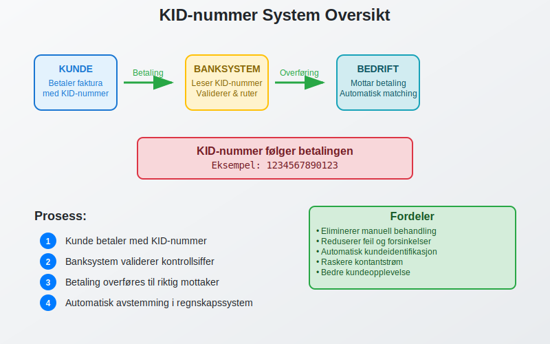
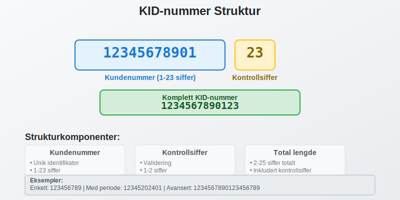
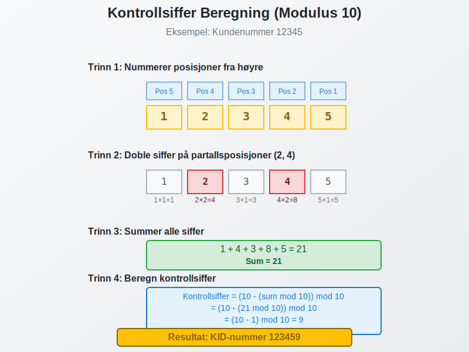
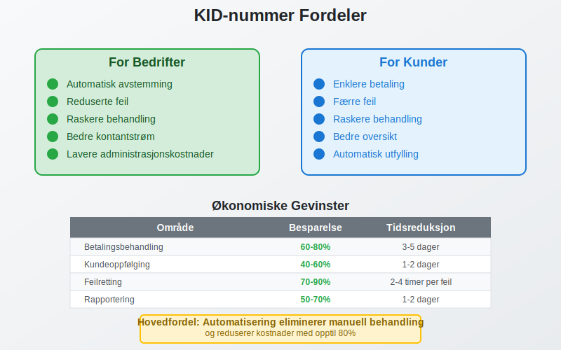
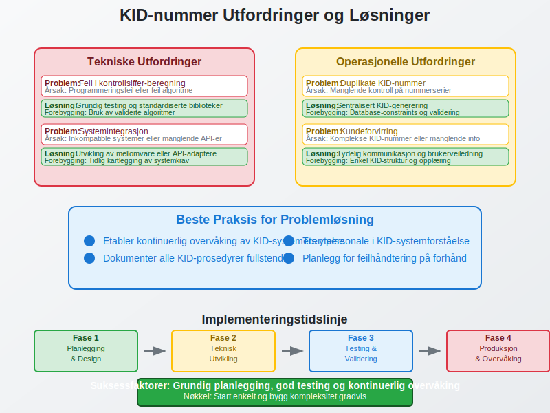

---
title: "Hva er KID-nummer?"
meta_title: "Hva er KID-nummer?"
meta_description: 'Et **KID-nummer** (Kunde-IDentifikasjon) er et unikt referansenummer som brukes i norsk betalingsformidling for å automatisk identifisere og knytte innbetaling...'
slug: hva-er-kid-nummer
type: blog
layout: pages/single
---

Et **KID-nummer** (Kunde-IDentifikasjon) er et unikt referansenummer som brukes i norsk betalingsformidling for å automatisk identifisere og knytte innbetalinger til riktig kunde eller [faktura](/blogs/regnskap/hva-er-en-faktura "Hva er en Faktura? En Guide til Norske Fakturakrav"). Dette systemet er fundamentalt for effektiv [avstemming](/blogs/regnskap/hva-er-avstemming "Hva er Avstemming? Komplett Guide til Regnskapsavstemming") og automatisering av betalingsprosesser i norske bedrifter.

KID-nummer er spesielt viktig for bedrifter som håndterer mange kundebetalinger, da det eliminerer behovet for manuell identifikasjon av innbetalinger og reduserer risikoen for feil i [kundeoppfølging](/blogs/regnskap/hva-er-ansattreskontro "Hva er Ansattreskontro? Komplett Guide til Kundeoppfølging og Fordringsstyring"). Systemet integreres sømløst med moderne [ERP-systemer](/blogs/regnskap/hva-er-erp-system "Hva er ERP-system? Komplett Guide til Enterprise Resource Planning") for automatisk [bokføring](/blogs/regnskap/hva-er-bokforing "Hva er Bokføring? Komplett Guide til Regnskapsføring i Norge") og kundeadministrasjon.

## Seksjon 1: Hvordan KID-nummer Fungerer

KID-nummer fungerer som en digital "adresselapp" som følger betalingen gjennom hele det norske betalingssystemet. Når en kunde betaler en [faktura](/blogs/regnskap/hva-er-en-faktura "Hva er en Faktura? En Guide til Norske Fakturakrav") med KID-nummer, blir referansen automatisk overført til mottakers bank sammen med betalingsinformasjonen.

### Teknisk Funksjonalitet

KID-systemet bygger på følgende prinsipper:

* **Automatisk gjenkjenning:** Banksystemet leser KID-nummeret og kobler det til riktig mottakerkonto
* **Kontrollsiffer-validering:** Innebygd feilkontroll sikrer at nummeret er korrekt
* **Standardisert format:** Følger norske og internasjonale standarder for betalingsreferanser
* **Systemintegrasjon:** Kobles direkte til regnskaps- og faktureringssystemer

Denne automatiseringen er særlig verdifull for bedrifter som bruker [elektronisk fakturering](/blogs/regnskap/hva-er-elektronisk-fakturering "Hva er Elektronisk Fakturering? Komplett Guide til Digitale Fakturaløsninger") og [eFaktura](/blogs/regnskap/hva-er-efaktura "Hva er eFaktura? Komplett Guide til Elektronisk Fakturering i Norge"), hvor KID-nummeret automatisk følger med betalingsinformasjonen.

## Seksjon 2: Struktur og Oppbygging av KID-nummer

Et KID-nummer består av flere komponenter som hver har sin spesifikke funksjon. Forståelse av denne strukturen er viktig for korrekt implementering og bruk.

### Grunnleggende Komponenter

| Komponent | Beskrivelse | Lengde | Eksempel |
|-----------|-------------|---------|----------|
| **Kundenummer** | Unik identifikator for kunden | 1-23 siffer | 12345 |
| **Kontrollsiffer** | Beregnet siffer for validering | 1-2 siffer | 67 |
| **Totallengde** | Komplett KID-nummer | 2-25 siffer | 1234567 |

### Detaljert Strukturanalyse

**Kundenummer-delen** kan inneholde:
* Ren kundeidentifikator
* Kombinasjon av kunde- og fakturanummer
* Periodekoder for abonnementstjenester
* Avdelings- eller produktkoder

**Kontrollsiffer-delen** beregnes ved hjelp av:
* Modulus 10-algoritme (vanligst)
* Modulus 11-algoritme (for spesielle tilfeller)
* Dobbel kontrollsiffer-validering for ekstra sikkerhet

## Seksjon 3: Ulike Typer KID-nummer

Det finnes flere varianter av KID-nummer tilpasset ulike forretningsbehov og betalingsscenarier. Valg av type avhenger av bedriftens størrelse, kundebase og betalingsvolum.

### 3.1 Standard KID-nummer

Dette er den vanligste formen og brukes for enkle kunde-til-bedrift betalinger:

* **Lengde:** 2-25 siffer
* **Kontrollsiffer:** Modulus 10 eller 11
* **Bruksområde:** Fakturabetalinger, medlemskontingenter, abonnementer

**Eksempel:** Kunde 12345 med kontrollsiffer 67 = KID-nummer 1234567

### 3.2 Blankett-KID

Brukes når samme KID-nummer skal kunne motta betalinger fra flere kilder:

* **Fleksibel beløpsregistrering:** Kan motta ulike beløp på samme referanse
* **Periodisk rapportering:** Egnet for donasjoner, innsamlinger, medlemskap
* **Forenklet administrasjon:** Reduserer antall unike referanser

### 3.3 Strukturert KID med Periodekoder

For bedrifter med regelmessige betalinger som abonnementer eller leie:

| Posisjon | Innhold | Eksempel |
|----------|---------|----------|
| 1-5 | Kundenummer | 12345 |
| 6-9 | Periodekode (Ã…RMM) | 2024 |
| 10-11 | Kontrollsiffer | 89 |

**Komplett eksempel:** 123452024089

### 3.4 Avansert KID med Produktkoder

For komplekse bedrifter med flere produktlinjer eller avdelinger:

* **Avdelingskoder:** Identifiserer hvilken del av bedriften som skal motta betalingen
* **Produktkategorier:** Skiller mellom ulike tjenester eller varer
* **Geografiske koder:** For bedrifter med flere lokasjoner

## Seksjon 4: Beregning av Kontrollsiffer

Kontrollsifferet er en kritisk komponent som sikrer at KID-nummeret er korrekt og reduserer risikoen for feilregistrering av betalinger. Det finnes to hovedmetoder for beregning.

### Modulus 10-metoden (Luhn-algoritme)

Dette er den mest brukte metoden for KID-nummer:

**Trinn-for-trinn beregning:**

1. **Start fra høyre:** Nummerer posisjonene fra høyre mot venstre
2. **Doble annenhvert siffer:** Siffer på partallsposisjoner dobles
3. **Reduser tosifrede resultater:** Hvis dobling gir tosifret tall, summer sifrene
4. **Summer alle siffer:** Legg sammen alle sifrene
5. **Beregn kontrollsiffer:** (10 - (sum mod 10)) mod 10

**Eksempel med kundenummer 12345:**

| Posisjon | 5 | 4 | 3 | 2 | 1 |
|----------|---|---|---|---|---|
| Siffer | 1 | 2 | 3 | 4 | 5 |
| Dobling | 1 | 4 | 3 | 8 | 5 |
| Sum | 21 |
| Kontrollsiffer | (10 - (21 mod 10)) mod 10 = 9 |

**Resultat:** KID-nummer 123459

### Modulus 11-metoden

Brukes for spesielle tilfeller hvor ekstra validering er nødvendig:

**Vektfaktorer:** 2, 3, 4, 5, 6, 7, 2, 3, 4, 5, 6, 7... (gjentas)

**Beregningsprosess:**
1. Multipliser hvert siffer med tilhørende vektfaktor
2. Summer alle produktene
3. Beregn rest ved deling på 11
4. Kontrollsiffer = 11 - rest (hvis rest = 0 eller 1, bruk spesialregler)

## Seksjon 5: Praktisk Implementering og Bruk

Implementering av KID-nummer krever nøye planlegging og koordinering mellom ulike systemer. Moderne bedrifter integrerer KID-systemet med sine [ERP-systemer](/blogs/regnskap/hva-er-erp-system "Hva er ERP-system? Komplett Guide til Enterprise Resource Planning") for sømløs automatisering.

### Systemintegrasjon

**Nødvendige komponenter:**

* **Faktureringssystem:** Genererer KID-nummer automatisk ved fakturering
* **Banksystem:** Mottar og behandler betalinger med KID-referanse
* **Regnskapssystem:** Automatisk [bokføring](/blogs/regnskap/hva-er-bokforing "Hva er Bokføring? Komplett Guide til Regnskapsføring i Norge") basert på KID-matching
* **Kundesystem:** Oppdaterer kundekontoer automatisk

### Implementeringsprosess

**Fase 1: Planlegging og Design**
* Definere KID-struktur basert på forretningsbehov
* Velge kontrollsiffer-metode
* Planlegge systemintegrasjon

**Fase 2: Teknisk Utvikling**
* Programmere KID-generering i faktureringssystem
* Implementere validering og kontrollsiffer-beregning
* Etablere kommunikasjon med banksystemer

**Fase 3: Testing og Validering**
* Teste KID-generering med ulike scenarier
* Validere kontrollsiffer-beregning
* Teste ende-til-ende betalingsflyt

**Fase 4: Produksjonssetting**
* Gradvis utrulling til kundebase
* Overvåking av betalingsflyt
* Finjustering basert på erfaringer

## Seksjon 6: Fordeler og Gevinster

Implementering av KID-nummer gir betydelige fordeler for både bedrifter og kunder. Disse gevinstene blir særlig tydelige for bedrifter med høyt betalingsvolum.

### Operasjonelle Fordeler

**For Bedrifter:**

* **Automatisk avstemming:** Eliminerer manuell matching av betalinger
* **Reduserte feil:** Kontrollsiffer-validering minimerer feilregistreringer
* **Raskere behandling:** Betalinger behandles automatisk uten menneskelig inngripen
* **Bedre kontantstrøm:** Raskere identifikasjon og registrering av innbetalinger
* **Lavere administrasjonskostnader:** Mindre behov for manuell oppfølging

**For Kunder:**

* **Enklere betaling:** Automatisk utfylling av betalingsinformasjon
* **Færre feil:** Redusert risiko for feilbetaling
* **Raskere behandling:** Betalinger registreres umiddelbart
* **Bedre oversikt:** Tydelig kobling mellom betaling og faktura

### Økonomiske Gevinster

Studier viser at bedrifter som implementerer KID-system kan oppnå:

| Gevinstområde | Besparelse | Tidsreduksjon |
|---------------|------------|---------------|
| **Betalingsbehandling** | 60-80% | 3-5 dager |
| **Kundeoppfølging** | 40-60% | 1-2 dager |
| **Feilretting** | 70-90% | 2-4 timer per feil |
| **Rapportering** | 50-70% | 1-2 dager |

## Seksjon 7: KID-nummer og Digitale Betalingsløsninger

KID-nummer integreres sømløst med moderne digitale betalingsløsninger og er en grunnleggende komponent i Norges digitale betalingsinfrastruktur.

### Integrasjon med eFaktura

[eFaktura](/blogs/regnskap/hva-er-efaktura "Hva er eFaktura? Komplett Guide til Elektronisk Fakturering i Norge") og KID-nummer utgjør en kraftig kombinasjon:

* **Automatisk betalingsinformasjon:** KID-nummer følger automatisk med eFaktura
* **Direkte betaling:** Kunder kan betale direkte fra nettbanken
* **Umiddelbar registrering:** Betalinger registreres øyeblikkelig hos mottaker

### AvtaleGiro og KID

[AvtaleGiro](/blogs/regnskap/hva-er-avtalegiro "Hva er AvtaleGiro? Komplett Guide til Automatisk Betaling") bruker KID-nummer for automatisk identifikasjon:

* **Regelmessige betalinger:** Samme KID kan brukes for gjentakende betalinger
* **Varierende beløp:** KID-nummer kan håndtere ulike beløp per periode
* **Automatisk oppdatering:** Endringer i beløp oppdateres automatisk

### Mobile Betalingsløsninger

Moderne mobile betalingsapper som Vipps integrerer KID-funksjonalitet:

* **QR-kode betaling:** KID-nummer kan kodes inn i QR-koder
* **Automatisk registrering:** Betalinger med KID registreres automatisk
* **Sanntids-notifikasjon:** Både betaler og mottaker får umiddelbar bekreftelse

## Seksjon 8: Juridiske og Regulatoriske Aspekter

KID-nummer er regulert av norske myndigheter og må følge spesifikke standarder og krav. Dette sikrer interoperabilitet og sikkerhet i det norske betalingssystemet.

### Regulatorisk Rammeverk

**Finanstilsynet** overvåker og regulerer bruken av KID-nummer som del av det norske betalingssystemet. Viktige reguleringer inkluderer:

* **Standardisering:** KID-nummer må følge ISO 20022-standarden
* **Sikkerhetskrav:** Krav til datasikkerhet og personvern
* **Rapporteringsplikt:** Bedrifter må rapportere om bruk av KID-systemer

### Personvern og GDPR

Siden KID-nummer ofte inneholder kundeinformasjon, må bedrifter følge GDPR-krav:

* **Databehandling:** KID-nummer må behandles i henhold til personvernlovgivning
* **Samtykke:** Kunder må informeres om bruk av KID-nummer
* **Datalagring:** Begrensninger på hvor lenge KID-data kan lagres
* **Rett til sletting:** Kunder har rett til å få slettet sine KID-data

### Compliance og Revisjon

For bedrifter som bruker KID-nummer, er det viktig å etablere:

* **Internkontroll:** Rutiner for å sikre korrekt bruk av KID-system
* **Dokumentasjon:** Fullstendig dokumentasjon av KID-prosesser
* **Revisjonsspor:** Mulighet til å spore alle KID-relaterte transaksjoner
* **Feilhåndtering:** Prosedyrer for håndtering av feil i KID-systemet

## Seksjon 9: Vanlige Utfordringer og Løsninger

Selv om KID-nummer er et robust system, kan bedrifter møte utfordringer ved implementering og drift. Her er de vanligste problemene og anbefalte løsninger.

### Tekniske Utfordringer

**Problem: Feil i kontrollsiffer-beregning**
* **Årsak:** Programmeringsfeil eller feil forståelse av algoritme
* **Løsning:** Grundig testing og validering mot kjente eksempler
* **Forebygging:** Bruk av standardiserte biblioteker for KID-beregning

**Problem: Systemintegrasjon**
* **Ã…rsak:** Inkompatible systemer eller manglende API-er
* **Løsning:** Utvikling av mellomvare eller API-adaptere
* **Forebygging:** Tidlig kartlegging av systemkrav og kompatibilitet

### Operasjonelle Utfordringer

**Problem: Duplikate KID-nummer**
* **Årsak:** Manglende kontroll på nummerserier
* **Løsning:** Implementering av sentralisert KID-generering
* **Forebygging:** Database-constraints og validering

**Problem: Kundeforvirring**
* **Ã…rsak:** Komplekse KID-nummer eller manglende informasjon
* **Løsning:** Tydelig kommunikasjon og brukerveiledning
* **Forebygging:** Enkel KID-struktur og god kundeopplæring

### Beste Praksis for Problemløsning

1. **Etabler overvåking:** Kontinuerlig overvåking av KID-systemets ytelse
2. **Dokumenter prosesser:** Fullstendig dokumentasjon av alle KID-prosedyrer
3. **Tren personale:** Sikre at alle relevante ansatte forstår KID-systemet
4. **Planlegg for feil:** Ha klare prosedyrer for håndtering av KID-relaterte feil

## Seksjon 10: Fremtiden for KID-nummer

KID-nummer fortsetter å utvikle seg i takt med digitalisering av det norske betalingssystemet. Nye teknologier og standarder vil påvirke hvordan KID-nummer brukes fremover.

### Teknologiske Trender

**Kunstig Intelligens og Maskinlæring:**
* Automatisk optimalisering av KID-strukturer
* Prediktiv analyse for betalingsatferd
* Intelligent feildeteksjon og -korreksjon

**Blockchain og Distribuerte Systemer:**
* Økt sikkerhet og transparens i betalingsprosesser
* Redusert behov for mellommenn i betalingskjeden
* Nye muligheter for grensekryssende betalinger

**Internet of Things (IoT):**
* Automatiske betalinger fra tilkoblede enheter
* Sanntids-betalinger basert på forbruk
* Integrering med smarte kontrakter

### Regulatoriske Endringer

**Open Banking:**
* Økt konkurranse og innovasjon i betalingsmarkedet
* Nye aktører og betalingsløsninger
* Behov for oppdaterte KID-standarder

**Digitale Valutaer:**
* Sentralbankens digitale valuta (CBDC)
* Påvirkning på tradisjonelle betalingssystemer
* Nye krav til betalingsreferanser

### Anbefalinger for Bedrifter

For å forberede seg på fremtiden bør bedrifter:

1. **Investere i fleksible systemer:** Velg løsninger som kan tilpasses nye krav
2. **Følge standardutvikling:** Hold seg oppdatert på nye standarder og reguleringer
3. **Planlegge for endring:** Ha en strategi for å håndtere teknologiske endringer
4. **Samarbeide med leverandører:** Sikre at systemleverandører følger utviklingen

## Konklusjon

KID-nummer er en fundamental komponent i det norske betalingssystemet som muliggjør effektiv, automatisert behandling av kundebetalinger. Systemet gir betydelige fordeler både for bedrifter og kunder gjennom reduserte kostnader, færre feil og raskere behandling.

For bedrifter som vurderer implementering av KID-nummer, er det viktig å:

* **Planlegge grundig:** Definere KID-struktur basert på forretningsbehov
* **Investere i riktig teknologi:** Velge systemer som støtter automatisering
* **Fokusere på integrasjon:** Sikre sømløs integrasjon med eksisterende systemer
* **Prioritere opplæring:** Sikre at personalet forstår systemet

Med riktig implementering og bruk kan KID-nummer være en kraftig driver for digitalisering og effektivisering av betalingsprosesser. Systemet vil fortsette å utvikle seg og tilpasse seg nye teknologier og krav, og bedrifter som investerer i KID-nummer i dag posisjonerer seg godt for fremtiden.

For mer informasjon om relaterte emner, se våre artikler om [elektronisk fakturering](/blogs/regnskap/hva-er-elektronisk-fakturering "Hva er Elektronisk Fakturering? Komplett Guide til Digitale Fakturaløsninger"), [eFaktura](/blogs/regnskap/hva-er-efaktura "Hva er eFaktura? Komplett Guide til Elektronisk Fakturering i Norge"), og [avstemming](/blogs/regnskap/hva-er-avstemming "Hva er Avstemming? Komplett Guide til Regnskapsavstemming").
