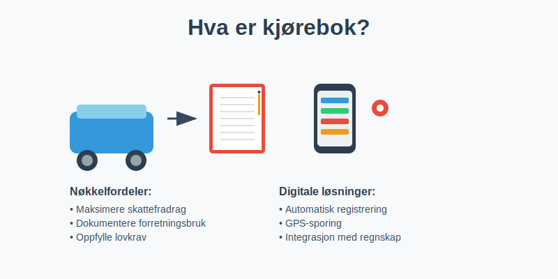
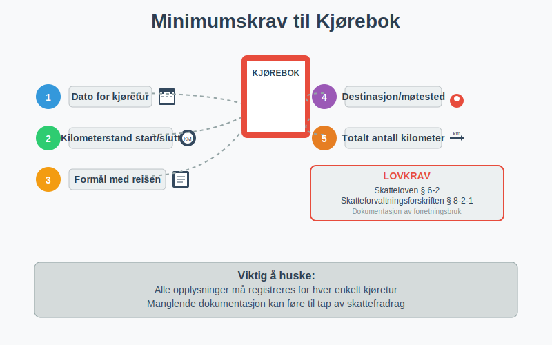
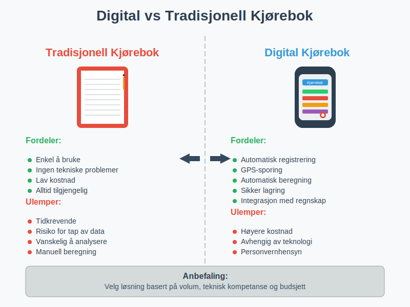
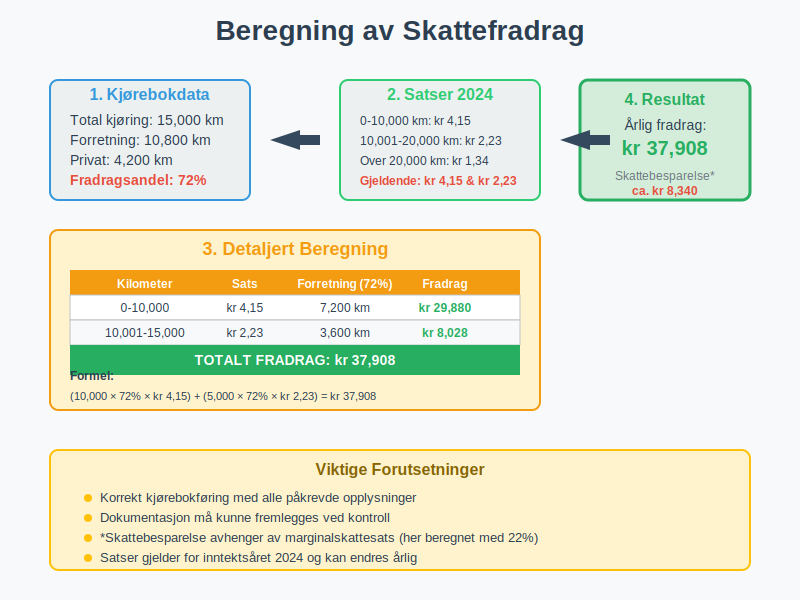
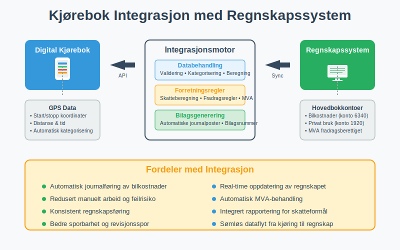
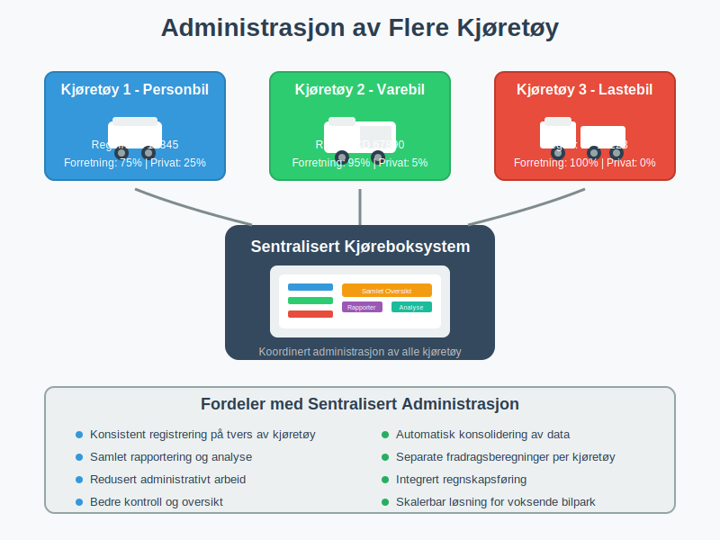
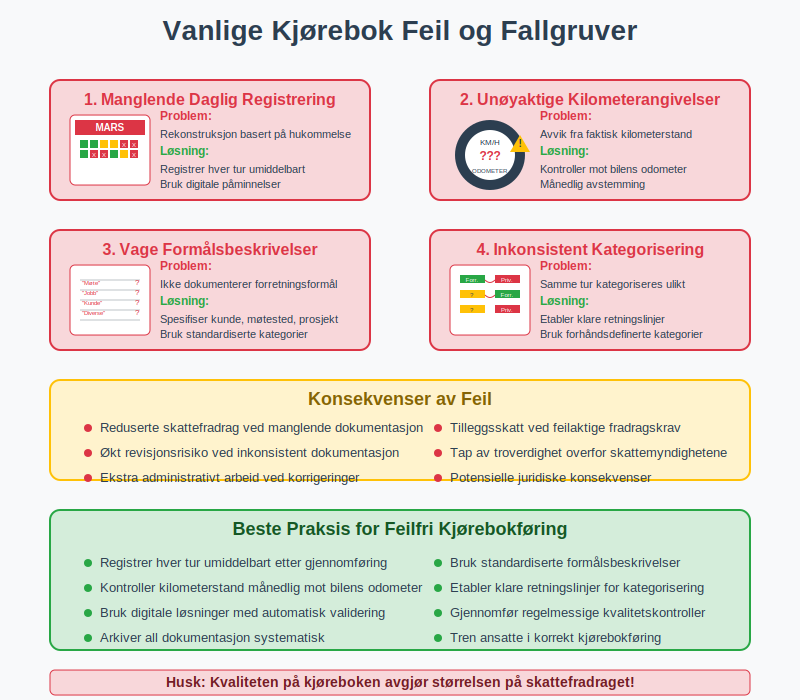

---
title: "Hva er kjørebok?"
seoTitle: "Hva er kjørebok?"
description: 'En **kjørebok** er et systematisk register over kjøretøybruk som dokumenterer alle tjenestereiser og private kjøreturer. Dette er et kritisk verktøy for be...'
---

En **kjørebok** er et systematisk register over kjøretøybruk som dokumenterer alle tjenestereiser og private kjøreturer. Dette er et kritisk verktøy for bedrifter og selvstendig næringsdrivende som ønsker å maksimere skattefradrag og opprettholde korrekt [regnskap](/blogs/regnskap/hva-er-regnskap "Hva er Regnskap? En Dybdeanalyse for Norge") i henhold til norske regnskapsregler.

Kjøreboken er ikke bare et administrativt krav, men en strategisk ressurs som kan generere betydelige skattebesparelser når den føres korrekt. For å sikre at alle [fradrag](/blogs/regnskap/hva-er-fradrag "Hva er fradrag i regnskap? Komplett Guide til Skattefradrag og Regnskapsføring") dokumenteres på riktig måte, er systematisk kjørebokføring essensielt.

## Lovgrunnlag og Krav til Kjørebok

### Skattelovens Bestemmelser

I henhold til **skatteloven § 6-2** og **skatteforvaltningsforskriften § 8-2-1** må alle som krever fradrag for bilkostnader kunne dokumentere forretningsbruken av kjøretøyet. Kjøreboken er det primære dokumentasjonsverktøyet som skattemyndighetene aksepterer.

### Minimumskrav til Dokumentasjon

For at en kjørebok skal være gyldig i skattemessig sammenheng, må den inneholde følgende informasjon:

* **Dato for hver kjøretur**
* **Kilometerstand ved start og slutt**
* **Formål med reisen** (forretning eller privat)
* **Destinasjon og eventuelt kunde/møtested**
* **Totalt antall kilometer kjørt**

## Typer Kjørebøker

### 1. Tradisjonell Papirbasert Kjørebok

Den klassiske metoden hvor alle opplysninger registreres manuelt i en fysisk bok eller skjema.

**Fordeler:**
* Enkel å bruke
* Ingen tekniske problemer
* Lav kostnad

**Ulemper:**
* Tidkrevende
* Risiko for tap av data
* Vanskelig å analysere data

### 2. Digital Kjørebok

Moderne løsninger som bruker GPS-teknologi og mobilapper for automatisk registrering.

**Fordeler:**
* Automatisk registrering
* Redusert administrativt arbeid
* Bedre dataanalyse
* Sikker lagring

**Ulemper:**
* Høyere kostnad
* Avhengig av teknologi
* Personvernhensyn

## Praktisk Kjørebokføring

### Daglig Rutine

For å sikre nøyaktig kjørebokføring, anbefales følgende daglige rutine:

1. **Registrer kilometerstand** ved start av dagen
2. **Logg hver enkelt tur** umiddelbart etter gjennomføring
3. **Spesifiser formålet** med reisen tydelig
4. **Kontroller totalsummer** ved dagens slutt

### Månedlig Oppfølging

* **Sammenlign** med faktiske kilometertall på bilen
* **Kontroller** at alle dager er registrert
* **Arkiver** dokumentasjon systematisk
* **Analyser** kjøremønster for optimalisering

## Skattefradrag og Økonomiske Fordeler

### Beregning av Fradrag

Skattefradraget for bilkostnader beregnes basert på forholdet mellom forretningskjøring og total kjøring:

**Fradragsberettiget andel = (Forretningskilometer / Total kilometer) × 100%**

### Eksempel på Beregning

| Måned | Total km | Forretning km | Privat km | Fradragsandel |
|-------|----------|---------------|-----------|---------------|
| Januar | 2,500 | 1,800 | 700 | 72% |
| Februar | 2,200 | 1,500 | 700 | 68% |
| Mars | 2,800 | 2,100 | 700 | 75% |
| **Totalt Q1** | **7,500** | **5,400** | **2,100** | **72%** |

### Maksimale Fradrag

For 2024 er de maksimale fradragssatsene:

* **Kilometer 0-10,000:** kr 4,15 per km
* **Kilometer 10,001-20,000:** kr 2,23 per km  
* **Kilometer over 20,000:** kr 1,34 per km

## Digitale Løsninger og Teknologi

### GPS-baserte Systemer

Moderne kjøreboksløsninger bruker GPS-teknologi for å automatisk registrere:

* **Startpunkt og destinasjon**
* **Kjøretid og distanse**
* **Rute og hastighet**
* **Automatisk kategorisering** av turer

### Integrasjon med Regnskapssystemer

Avanserte løsninger kan integreres direkte med [regnskapssystemer](/blogs/regnskap/hva-er-regnskap "Hva er Regnskap? En Dybdeanalyse for Norge") for sømløs [bilagsbehandling](/blogs/regnskap/hva-er-bilag "Hva er Bilag i Regnskap? Komplett Guide til Regnskapsbilag og Dokumentasjon"):

* **Automatisk journalføring** av bilkostnader
* **Direkte overføring** til [hovedbok](/blogs/regnskap/hva-er-hovedbok "Hva er Hovedbok? En Komplett Guide til Hovedboken i Norsk Regnskap")
* **Integrert rapportering** for skatteformål

## Kontroll og Revisjon

### Skattemyndighetenes Kontroll

Skatteetaten kan kreve fremleggelse av kjørebok ved kontroll. Vanlige kontrollpunkter inkluderer:

* **Konsistens** mellom registrerte kilometer og bilens odometer
* **Logisk sammenheng** mellom reisemål og forretningsaktivitet
* **Fullstendighet** i registreringen
* **Korrekt beregning** av fradragsandel

### Revisjonsspor

For bedrifter som er underlagt [revisjon](/blogs/regnskap/hva-er-regnskap "Hva er Regnskap? En Dybdeanalyse for Norge"), må kjøreboken være del av det totale revisjonssporet:

* **Sporbarhet** fra kjørebok til [bilag](/blogs/regnskap/hva-er-bilag "Hva er Bilag i Regnskap? Komplett Guide til Regnskapsbilag og Dokumentasjon")
* **Konsistens** med andre regnskapsdokumenter
* **Arkivering** i henhold til [bokføringsloven](/blogs/regnskap/hva-er-bokforingsloven "Hva er Bokføringsloven? Komplett Guide til Norsk Bokføringslovgivning")

## Spesielle Situasjoner

### Leasingbiler og Firmabiler

For leasingbiler og firmabiler gjelder spesielle regler. Se også vår [Firmabil](/blogs/regnskap/firmabil "Firmabil - Guide til Regnskapsmessig og Skattemessig Behandling av Firmabil") for en detaljert gjennomgang:

* **Fordelsbeskatning** av privat bruk må beregnes
* **Dokumentasjon** av privat vs. forretningsbruk er kritisk
* **Separate beregninger** for ulike kostnadstyper

### Flere Kjøretøy

Bedrifter med flere kjøretøy må:

* **Føre separate kjørebøker** for hvert kjøretøy
* **Koordinere** registreringen på tvers av biler
* **Sikre konsistens** i registreringsmetoder

## Beste Praksis og Anbefalinger

### Etablering av Rutiner

* **Implementer** daglige registreringsrutiner
* **Tren** ansatte i korrekt kjørebokføring
* **Etabler** kontrollmekanismer for kvalitetssikring
* **Dokumenter** prosedyrer og retningslinjer

### Teknologivalg

Ved valg av digital kjørebokløsning, vurder:

* **Brukervennlighet** og intuitivt grensesnitt
* **Integrasjonsmuligheter** med eksisterende systemer
* **Datasikkerhet** og personvernbeskyttelse
* **Kostnad** vs. tidsbesparelse

### Arkivering og Oppbevaring

Kjørebøker må oppbevares i minimum **5 år** etter regnskapsårets slutt, i henhold til bokføringsloven. Dette gjelder både papirbaserte og digitale versjoner.

## Vanlige Feil og Fallgruver

### Typiske Registreringsfeil

* **Manglende daglig registrering** som fører til hukommelsesbasert rekonstruksjon
* **Unøyaktige kilometerangivelser** som ikke stemmer med bilens odometer
* **Vage formålsbeskrivelser** som ikke dokumenterer forretningsformålet
* **Inkonsistent kategorisering** av private vs. forretningsreiser

### Konsekvenser av Feil

* **Reduserte skattefradrag** ved manglende dokumentasjon
* **Tilleggsskatt** ved feilaktige fradragskrav
* **Økt revisjonsrisiko** ved inkonsistent dokumentasjon

## Fremtidige Utviklingstrender

### Automatisering og AI

Fremtidige kjørebokløsninger vil trolig inkludere:

* **Kunstig intelligens** for automatisk kategorisering av turer
* **Maskinlæring** for forbedret nøyaktighet over tid
* **Prediktiv analyse** for optimalisering av kjøremønstre

### Regulatoriske Endringer

Skattemyndighetene vurderer kontinuerlig:

* **Digitale standarder** for kjørebokføring
* **Økte krav** til dokumentasjon og sporbarhet
* **Harmonisering** med EU-regelverk

## Konklusjon

En **kjørebok** er langt mer enn bare et administrativt krav - det er et strategisk verktøy som kan generere betydelige skattebesparelser når det brukes korrekt. Ved å implementere systematiske rutiner, velge riktige teknologiske løsninger og opprettholde høy kvalitet i dokumentasjonen, kan bedrifter maksimere sine [skattefradrag](/blogs/regnskap/hva-er-fradrag "Hva er fradrag i regnskap? Komplett Guide til Skattefradrag og Regnskapsføring") samtidig som de oppfyller alle lovkrav.

Investering i en god kjørebokløsning, enten digital eller tradisjonell, vil raskt betale seg gjennom økte fradrag og redusert administrativt arbeid. Det viktigste er å etablere gode rutiner fra starten og opprettholde konsistent registrering over tid.

For bedrifter som ønsker å optimalisere sin økonomiske styring, er kjørebokføring en integrert del av det totale [regnskaps-](/blogs/regnskap/hva-er-regnskap "Hva er Regnskap? En Dybdeanalyse for Norge") og [bokføringssystemet](/blogs/regnskap/hva-er-bokforing "Hva er Bokføring? En Komplett Guide til Norsk Bokføringspraksis") som bidrar til både compliance og lønnsomhet.

