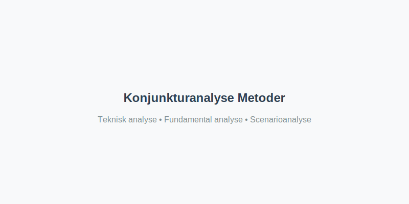

**Konjunktur** refererer til de periodiske svingningene i økonomisk aktivitet som karakteriserer en markedsøkonomi. Disse **konjunktursyklusene** påvirker alle aspekter av næringslivet, inkludert [regnskapsføring](/blogs/regnskap/hva-er-regnskap "Hva er Regnskap? En Komplett Guide til Regnskapsføring"), [budsjettplanlegging](/blogs/regnskap/hva-er-budsjettering "Hva er Budsjettering? Komplett Guide til Budsjettplanlegging og Økonomisk Styring") og [finansiell rapportering](/blogs/regnskap/hva-er-finansregnskap "Hva er Finansregnskap? Komplett Guide til Finansiell Rapportering").

For et bredere perspektiv på de overordnede økonomiske kreftene, se **[Makroøkonomi](/blogs/regnskap/makrookonomi "Makroøkonomi: Prinsipper og Betydning for Norsk Regnskap")**.

Datagrunnlaget for konjunkturanalyse hentes fra **[Statistisk sentralbyrÃ¥ (SSB)](/blogs/regnskap/statistisk-sentralbyra "Statistisk sentralbyrÃ¥ (SSB) “ Offisiell statistikk og betydning for regnskap i Norge")**, som publiserer løpende økonomiske rapporter og indikatorer.

## Hva er Konjunktur?

Konjunktur beskriver de **naturlige svingningene** i økonomisk aktivitet over tid. Disse syklusene består av perioder med økonomisk vekst (oppgang) og nedgang (lavkonjunktur), og de påvirker alt fra sysselsetting og [inflasjon](/blogs/regnskap/hva-er-inflasjon "Hva er Inflasjon? Påvirkning på Regnskap og Økonomisk Planlegging") til bedriftenes [lønnsomhet](/blogs/regnskap/hva-er-fortjeneste "Hva er Fortjeneste? Beregning og Analyse av Bedriftens Resultat") og [likviditet](/blogs/regnskap/hva-er-betalingsevne "Hva er Betalingsevne? Analyse av Likviditet og Finansiell Stabilitet").

### Hovedkomponenter i Konjunktursyklusen:

* **Ekspansjon (Oppgang):** Periode med økende økonomisk aktivitet
* **Topp (Peak):** Høyeste punkt i den økonomiske syklusen
* **Kontraksjoner (Nedgang):** Periode med fallende økonomisk aktivitet
* **Bunn (Trough):** Laveste punkt før ny oppgang begynner

## Konjunkturens Fire Faser

Konjunktursyklusen består av fire distinkte faser som hver har sine egne karakteristikker og påvirkning på bedrifter.

### 1. Ekspansjonsfasen

Under **ekspansjonsfasen** opplever økonomien:

* Økt [bruttonasjonalprodukt (BNP)](/blogs/regnskap/hva-er-bnp "Hva er BNP? Betydning for Bedrifter og Regnskapsføring")
* Fallende arbeidsledighet
* Økt forbruk og [investeringer](/blogs/regnskap/hva-er-investere "Hva er Investering? Guide til Investeringsregnskapet")
* Stigende priser og [inflasjon](/blogs/regnskap/hva-er-inflasjon "Hva er Inflasjon? Påvirkning på Regnskap og Økonomisk Planlegging")

**Påvirkning på bedrifter:**
- Økte [driftsinntekter](/blogs/regnskap/hva-er-driftsinntekter "Hva er Driftsinntekter? Beregning og Regnskapsføring")
- Bedre [arbeidskapital](/blogs/regnskap/hva-er-arbeidskapital "Hva er Arbeidskapital? Beregning og Analyse av Likviditet")
- Økt etterspørsel etter produkter og tjenester

### 2. Toppfasen

**Toppfasen** kjennetegnes ved:

* Maksimal økonomisk aktivitet
* Høy sysselsetting
* Høye priser og lønninger
* Potensielle tegn på overoppheting

**Regnskapsmessige konsekvenser:**
- Høye [omsetning](/blogs/regnskap/hva-er-omsetning "Hva er Omsetning? Beregning og Regnskapsføring av Inntekter") og [fortjeneste](/blogs/regnskap/hva-er-fortjeneste "Hva er Fortjeneste? Beregning og Analyse av Bedriftens Resultat")
- Økte [driftskostnader](/blogs/regnskap/hva-er-driftskostnader "Hva er Driftskostnader? Oversikt og Regnskapsføring")
- Behov for forsiktig [budsjettering](/blogs/regnskap/hva-er-budsjettering "Hva er Budsjettering? Komplett Guide til Budsjettplanlegging og Økonomisk Styring")

### 3. Kontraksjonfasen ([Resesjon](/blogs/regnskap/resesjon "Hva er Resesjon? Betydning, årsaker og regnskapsmessige implikasjoner"))

Under **kontraksjonfasen** opplever økonomien:

* Fallende BNP i to påfølgende kvartaler
* Økt arbeidsledighet
* Redusert forbruk og investeringer
* Fallende priser (deflasjon)

For en detaljert gjennomgang av konseptet, se [Resesjon](/blogs/regnskap/resesjon "Hva er Resesjon? Betydning, årsaker og regnskapsmessige implikasjoner").

**Bedriftspåvirkning:**
- Reduserte [inntekter](/blogs/regnskap/hva-er-inntekter "Hva er Inntekter? Komplett Guide til Inntektsregnskapet")
- Økt fokus på [kostnadsreduksjon](/blogs/regnskap/hva-er-kostnadsreduksjon "Hva er Kostnadsreduksjon? Strategier og Regnskapsføring")
- Behov for [likviditetsstyring](/blogs/regnskap/hva-er-likviditetsstyring "Hva er Likviditetsstyring? Metoder og Beste Praksis")

### 4. Bunnfasen

**Bunnfasen** representerer:

* Laveste punkt i den økonomiske aktiviteten
* Høy arbeidsledighet
* Lave priser og renter
* Begynnende tegn til bedring

## Konjunkturindikatorer

**Konjunkturindikatorer** er økonomiske målinger som hjelper med å identifisere hvor i konjunktursyklusen økonomien befinner seg.

### Ledende Indikatorer

Disse indikatorene endrer seg **før** konjunktursvingninger:

| Indikator | Beskrivelse | Påvirkning på Regnskap |
|-----------|-------------|------------------------|
| **Aksjekurser** | Børsutvikling | Påvirker [investeringsregnskapet](/blogs/regnskap/hva-er-investeringsregnskap "Hva er Investeringsregnskap? Guide til Finansielle Investeringer") |
| **Byggetillatelser** | Nye byggeprosjekter | Indikerer fremtidig [anleggsinvestering](/blogs/regnskap/hva-er-anleggsmidler "Hva er Anleggsmidler? Komplett Guide til Faste Eiendeler i Regnskap") |
| **Forbrukertillit** | Husholdningenes optimisme | PÃ¥virker [salgsbudsjetter](/blogs/regnskap/hva-er-salgsbudsjett "Hva er Salgsbudsjett? Planlegging og Prognoser") |
| **Rentekurve** | Forskjell på kort- og langrente | Påvirker [finansieringskostnader](/blogs/regnskap/hva-er-finansieringskostnader "Hva er Finansieringskostnader? Regnskapsføring og Analyse") |

### Sammenfallende Indikatorer

Disse endrer seg **samtidig** med konjunkturen:

* [**BNP-vekst**](/blogs/regnskap/hva-er-bnp "Hva er BNP? Betydning for Bedrifter og Regnskapsføring")
* **Sysselsetting**
* **Industriell produksjon**
* **Detaljhandelsalg**

### Etterslepende Indikatorer

Disse endrer seg **etter** konjunktursvingninger:

* **Arbeidsledighet**
* **Inflasjon**
* **Bedriftenes [lønnsomhet](/blogs/regnskap/hva-er-loennsomhet "Hva er Lønnsomhet? Analyse og Nøkkeltall")**
* **Konkurser og [inkasso](/blogs/regnskap/hva-er-inkasso "Hva er Inkasso? Prosess og Regnskapsføring")**

## Konjunkturens Påvirkning på Regnskapsføring

Konjunktursvingninger har betydelig innvirkning på hvordan bedrifter fører regnskap og planlegger økonomisk.

### Påvirkning på Balansen

**Under høykonjunktur:**
- Økte [eiendeler](/blogs/regnskap/hva-er-eiendel "Hva er Eiendel? Klassifisering og Regnskapsføring") grunnet ekspansjon
- Høyere [egenkapital](/blogs/regnskap/hva-er-egenkapital "Hva er Egenkapital? Beregning og Analyse") fra økt [fortjeneste](/blogs/regnskap/hva-er-fortjeneste "Hva er Fortjeneste? Beregning og Analyse av Bedriftens Resultat")
- Potensielt økt [gjeld](/blogs/regnskap/hva-er-gjeld "Hva er Gjeld? Klassifisering og Regnskapsføring") for vekstfinansiering

**Under lavkonjunktur:**
- Mulige [nedskrivninger](/blogs/regnskap/hva-er-nedskrivning "Hva er Nedskrivning? Regnskapsføring og Vurdering") av eiendeler
- Redusert egenkapital grunnet tap
- Økt fokus på [gjeldsgrad](/blogs/regnskap/hva-er-gjeldsgrad "Hva er Gjeldsgrad? Beregning og Analyse") og [soliditet](/blogs/regnskap/hva-er-soliditet "Hva er Soliditet? Finansiell Stabilitet og Analyse")

### Påvirkning på Resultatregnskapet

| Konjunkturfase | Inntekter | Kostnader | Resultat |
|----------------|-----------|-----------|----------|
| **Ekspansjon** | Øker raskt | Øker moderat | Sterkt positivt |
| **Topp** | Høye, men stagnerer | Høye | Positivt, men fallende |
| **Kontraksjoner** | Faller | Vanskelig å redusere | Negativt |
| **Bunn** | Lave | Reduserte | Svakt negativt/positivt |

## Konjunkturstilpasning i Bedrifter

Bedrifter må tilpasse seg konjunktursvingninger gjennom strategisk planlegging og fleksibel [økonomistyring](/blogs/regnskap/hva-er-oekonomistyring "Hva er Økonomistyring? Metoder og Beste Praksis").

### Strategier for Høykonjunktur

**Ekspansjon og vekst:**
* Øke [investeringer](/blogs/regnskap/hva-er-investere "Hva er Investering? Guide til Investeringsregnskapet") i [anleggsmidler](/blogs/regnskap/hva-er-anleggsmidler "Hva er Anleggsmidler? Komplett Guide til Faste Eiendeler i Regnskap")
* Bygge opp [likviditetsreserver](/blogs/regnskap/hva-er-likviditetsreserver "Hva er Likviditetsreserver? Betydning og Forvaltning")
* Styrke [egenkapital](/blogs/regnskap/hva-er-egenkapital "Hva er Egenkapital? Beregning og Analyse") for fremtidige nedgangstider

**Regnskapsmessige tiltak:**
- Konservativ [avsetning](/blogs/regnskap/avsetning "Avsetning i Regnskap - Komplett Guide til Avsetninger og Estimater") for fremtidige tap
- Oppbygging av [egenkapitalreserver](/blogs/regnskap/hva-er-egenkapitalreserver "Hva er Egenkapitalreserver? Typer og Regnskapsføring")
- Forsiktig [verdivurdering](/blogs/regnskap/hva-er-verdivurdering "Hva er Verdivurdering? Metoder og Regnskapsføring") av eiendeler

### Strategier for Lavkonjunktur

**Overlevelse og effektivisering:**
* Redusere [driftskostnader](/blogs/regnskap/hva-er-driftskostnader "Hva er Driftskostnader? Oversikt og Regnskapsføring")
* Forbedre [arbeidskapitalstyring](/blogs/regnskap/hva-er-arbeidskapitalstyring "Hva er Arbeidskapitalstyring? Metoder og Beste Praksis")
* Fokusere på [kontantstrøm](/blogs/regnskap/hva-er-kontantstrøm "Hva er Kontantstrøm? Analyse og Prognoser")

**Regnskapsmessige tiltak:**
- Realistisk vurdering av [kundefordringer](/blogs/regnskap/hva-er-kundefordringer "Hva er Kundefordringer? Regnskapsføring og Styring")
- Økte [avsetninger](/blogs/regnskap/avsetning "Avsetning i Regnskap - Komplett Guide til Avsetninger og Estimater") for tap
- Nøye [likviditetsstyring](/blogs/regnskap/hva-er-likviditetsstyring "Hva er Likviditetsstyring? Metoder og Beste Praksis")

## Konjunkturanalyse og Prognoser

**Konjunkturanalyse** er avgjørende for bedrifters strategiske planlegging og [budsjettarbeid](/blogs/regnskap/hva-er-budsjettering "Hva er Budsjettering? Komplett Guide til Budsjettplanlegging og Økonomisk Styring").

### Analysemetoder

**1. Teknisk analyse:**
- Studier av historiske data og trender
- Identifisering av mønstre i økonomiske indikatorer
- Bruk av statistiske modeller

**2. Fundamental analyse:**
- Vurdering av underliggende økonomiske faktorer
- Analyse av strukturelle endringer
- Evaluering av politiske og regulatoriske påvirkninger

**3. Scenarioanalyse:**
- Utvikling av alternative fremtidsscenarier
- [Sensitivitetsanalyse](/blogs/regnskap/hva-er-sensitivitetsanalyse "Hva er Sensitivitetsanalyse? Metoder og Anvendelse") av nøkkelfaktorer
- Stresstesting av [finansielle prognoser](/blogs/regnskap/hva-er-finansielle-prognoser "Hva er Finansielle Prognoser? Metoder og Beste Praksis")

### Prognoseverktøy

| Verktøy | Beskrivelse | Anvendelse |
|---------|-------------|------------|
| **Økonometriske modeller** | Matematiske modeller basert på historiske data | Kvantitative prognoser |
| **Ledende indikatorer** | Tidlige signaler på konjunkturendringer | Kortsiktige prognoser |
| **Ekspertpaneler** | Kvalitative vurderinger fra økonomer | Langsiktige trender |
| **Markedsundersøkelser** | Kartlegging av forventninger | Sektorspesifikke prognoser |

## Konjunkturpolitikk og Bedriftspåvirkning

Myndighetenes **konjunkturpolitikk** påvirker direkte bedriftenes rammebetingelser og regnskapsmessige forhold.

### Finanspolitikk

**Ekspansiv finanspolitikk (stimulerende):**
- Økte offentlige utgifter
- Reduserte skatter
- Økt etterspørsel etter bedriftenes produkter

**Kontraktiv finanspolitikk (innstrammende):**
- Reduserte offentlige utgifter
- Økte skatter
- Redusert etterspørsel

**Regnskapsmessige konsekvenser:**
- Endringer i [skatteberegninger](/blogs/regnskap/hva-er-skatteberegning "Hva er Skatteberegning? Metoder og Regnskapsføring")
- Påvirkning på [offentlige tilskudd](/blogs/regnskap/hva-er-offentlige-tilskudd "Hva er Offentlige Tilskudd? Regnskapsføring og Behandling")
- Endret [avskrivningsregler](/blogs/regnskap/hva-er-avskrivning "Hva er Avskrivning i Regnskap? Metoder, Beregning og Praktiske Eksempler")

### Pengepolitikk

**Ekspansiv pengepolitikk:**
- Lave renter
- Økt pengemengde
- Lettere tilgang til [finansiering](/blogs/regnskap/hva-er-finansiering "Hva er Finansiering? Typer og Regnskapsføring")

**Kontraktiv pengepolitikk:**
- Høye renter
- Redusert pengemengde
- Dyrere [lånefinansiering](/blogs/regnskap/hva-er-laanefinansiering "Hva er Lånefinansiering? Regnskapsføring og Analyse")

## Sektorspesifikke Konjunktureffekter

Ulike bransjer påvirkes forskjellig av konjunktursvingninger, noe som krever tilpassede regnskapsstrategier.

### Sykliske Sektorer

**Høy konjunktursensitivitet:**
* **Bygg og anlegg:** Sterkt påvirket av investeringsnivå
* **Bilindustri:** Avhengig av forbrukertillit
* **Luksushandel:** Følsom for disponibel inntekt
* **Råvarer:** Påvirket av global etterspørsel

**Regnskapsmessige utfordringer:**
- Store svingninger i [omsetning](/blogs/regnskap/hva-er-omsetning "Hva er Omsetning? Beregning og Regnskapsføring av Inntekter")
- Behov for fleksible [kostnadsstrukturer](/blogs/regnskap/hva-er-kostnadsstruktur "Hva er Kostnadsstruktur? Analyse og Optimalisering")
- Viktig med [scenarioplanlegging](/blogs/regnskap/hva-er-scenarioplanlegging "Hva er Scenarioplanlegging? Metoder og Anvendelse")

### Defensive Sektorer

**Lav konjunktursensitivitet:**
* **Dagligvarehandel:** Stabil etterspørsel
* **Helsevesen:** Mindre påvirket av økonomiske svingninger
* **Utilities:** Stabil inntektsstrøm
* **Telekommunikasjon:** Nødvendige tjenester

**Regnskapsmessige fordeler:**
- Mer forutsigbare [inntektsstrømmer](/blogs/regnskap/hva-er-inntektsstrømmer "Hva er Inntektsstrømmer? Analyse og Prognoser")
- Enklere [budsjettplanlegging](/blogs/regnskap/hva-er-budsjettering "Hva er Budsjettering? Komplett Guide til Budsjettplanlegging og Økonomisk Styring")
- Lavere [kredittrisiko](/blogs/regnskap/hva-er-kredittrisiko "Hva er Kredittrisiko? Vurdering og Regnskapsføring")

## Praktiske Eksempler fra Norsk Økonomi

La oss se på hvordan konjunktursvingninger har påvirket norske bedrifter gjennom konkrete eksempler.

### Eksempel 1: Finanskrisen 2008-2009

**Situasjon:** Global finanskrise med betydelig påvirkning på norsk økonomi.

**Påvirkning på bedrifter:**
- Kraftig fall i [omsetning](/blogs/regnskap/hva-er-omsetning "Hva er Omsetning? Beregning og Regnskapsføring av Inntekter") for mange sektorer
- Økte [avsetninger](/blogs/regnskap/avsetning "Avsetning i Regnskap - Komplett Guide til Avsetninger og Estimater") for tap på fordringer
- Behov for [restrukturering](/blogs/regnskap/hva-er-restrukturering "Hva er Restrukturering? Regnskapsføring og Konsekvenser") av gjeld

**Regnskapsmessige tiltak:**
- Økte [nedskrivninger](/blogs/regnskap/hva-er-nedskrivning "Hva er Nedskrivning? Regnskapsføring og Vurdering") av eiendeler
- Konservativ [verdivurdering](/blogs/regnskap/hva-er-verdivurdering "Hva er Verdivurdering? Metoder og Regnskapsføring")
- Styrket [likviditetsstyring](/blogs/regnskap/hva-er-likviditetsstyring "Hva er Likviditetsstyring? Metoder og Beste Praksis")

### Eksempel 2: Oljeprisfallet 2014-2016

**Situasjon:** Dramatisk fall i oljepriser påvirket norsk økonomi betydelig.

**Sektorpåvirkning:**
- **Oljesektoren:** Massive nedskjæringer og [omstrukturering](/blogs/regnskap/hva-er-omstrukturering "Hva er Omstrukturering? Prosess og Regnskapsføring")
- **Leverandørindustri:** Reduserte [investeringer](/blogs/regnskap/hva-er-investere "Hva er Investering? Guide til Investeringsregnskapet") og [omsetning](/blogs/regnskap/hva-er-omsetning "Hva er Omsetning? Beregning og Regnskapsføring av Inntekter")
- **Regionalt:** Særlig påvirkning i Stavanger-regionen

**Regnskapsmessige konsekvenser:**
- Store [nedskrivninger](/blogs/regnskap/hva-er-nedskrivning "Hva er Nedskrivning? Regnskapsføring og Vurdering") av oljeeiendeler
- Økte [avsetninger](/blogs/regnskap/avsetning "Avsetning i Regnskap - Komplett Guide til Avsetninger og Estimater") for [restrukturering](/blogs/regnskap/hva-er-restrukturering "Hva er Restrukturering? Regnskapsføring og Konsekvenser")
- Fokus på [kostnadsreduksjon](/blogs/regnskap/hva-er-kostnadsreduksjon "Hva er Kostnadsreduksjon? Strategier og Regnskapsføring")

### Eksempel 3: COVID-19 Pandemien 2020-2022

**Situasjon:** Uventet global pandemi med omfattende økonomiske konsekvenser.

**Umiddelbare effekter:**
- Nedstengning av store deler av økonomien
- Massive [statlige støtteordninger](/blogs/regnskap/hva-er-statlige-støtteordninger "Hva er Statlige Støtteordninger? Regnskapsføring og Behandling")
- Endrede forbruksmønstre

**Regnskapsmessige utfordringer:**
- Usikkerhet om [fortsatt drift](/blogs/regnskap/hva-er-fortsatt-drift "Hva er Fortsatt Drift? Forutsetninger og Vurdering")
- Kompleks regnskapsføring av [støtteordninger](/blogs/regnskap/hva-er-støtteordninger "Hva er Støtteordninger? Regnskapsføring og Behandling")
- Økt behov for [scenarioanalyser](/blogs/regnskap/hva-er-scenarioanalyse "Hva er Scenarioanalyse? Metoder og Anvendelse")

## Konjunkturindikatorer for Bedriftsledere

Bedriftsledere bør følge med på sentrale konjunkturindikatorer for å kunne tilpasse sin virksomhet proaktivt.

### Viktige Indikatorer å Følge

**Makroøkonomiske indikatorer:**
* **BNP-vekst:** Generell økonomisk utvikling
* **Arbeidsledighet:** Arbeidsmarkedets tilstand
* **Inflasjon:** Prisutviklingen i økonomien
* **Renter:** Finansieringskostnader og investeringsklima

**Bransjespecifikke indikatorer:**
* **PMI (Purchasing Managers' Index):** Industriell aktivitet
* **Forbrukertillit:** Husholdningenes optimisme
* **Boligpriser:** Eiendomsmarkedets utvikling
* **Valutakurser:** Påvirkning på import/eksport

### Hvordan Bruke Indikatorene

| Indikator | Stigende trend | Fallende trend | Regnskapsmessig respons |
|-----------|----------------|----------------|-------------------------|
| **BNP-vekst** | Ekspansjon | Kontraksjoner | Juster [budsjetter](/blogs/regnskap/hva-er-budsjettering "Hva er Budsjettering? Komplett Guide til Budsjettplanlegging og Økonomisk Styring") tilsvarende |
| **Arbeidsledighet** | Lavkonjunktur | Høykonjunktur | Vurder [lønnskostnader](/blogs/regnskap/hva-er-lønnskostnader "Hva er Lønnskostnader? Regnskapsføring og Analyse") |
| **Renter** | Dyrere finansiering | Billigere finansiering | Revurder [investeringsplaner](/blogs/regnskap/hva-er-investeringsplaner "Hva er Investeringsplaner? Planlegging og Analyse") |
| **Inflasjon** | Økte kostnader | Prispress nedover | Juster [prisstrategier](/blogs/regnskap/hva-er-prisstrategier "Hva er Prisstrategier? Analyse og Implementering") |

## Beste Praksis for Konjunkturtilpasning

Suksessfulle bedrifter utvikler robuste strategier for å håndtere konjunktursvingninger.

### Strategiske Prinsipper

**1. Fleksibilitet i kostnadsstrukturen:**
- Høy andel variable kostnader
- Fleksible [lønnsordninger](/blogs/regnskap/hva-er-lønnsordninger "Hva er Lønnsordninger? Typer og Regnskapsføring")
- Outsourcing av ikke-kritiske funksjoner

**2. Sterk finansiell posisjon:**
- Solid [egenkapitalandel](/blogs/regnskap/hva-er-egenkapitalandel "Hva er Egenkapitalandel? Beregning og Analyse")
- Tilstrekkelige [likviditetsreserver](/blogs/regnskap/hva-er-likviditetsreserver "Hva er Likviditetsreserver? Betydning og Forvaltning")
- Diversifiserte [finansieringskilder](/blogs/regnskap/hva-er-finansieringskilder "Hva er Finansieringskilder? Oversikt og Vurdering")

**3. Diversifisering:**
- Flere markeder og kundesegmenter
- Balansert produktportefølje
- Geografisk spredning

### Regnskapsmessige Beste Praksis

**Konservativ regnskapsføring:**
- Forsiktig [verdivurdering](/blogs/regnskap/hva-er-verdivurdering "Hva er Verdivurdering? Metoder og Regnskapsføring") av eiendeler
- Tilstrekkelige [avsetninger](/blogs/regnskap/hva-er-avsetning "Hva er Avsetning? Regnskapsføring og Vurdering") for tap
- Realistiske [budsjetter](/blogs/regnskap/hva-er-budsjettering "Hva er Budsjettering? Komplett Guide til Budsjettplanlegging og Økonomisk Styring") og prognoser

**Forbedret rapportering:**
- Hyppigere [finansiell rapportering](/blogs/regnskap/hva-er-finansiell-rapportering "Hva er Finansiell Rapportering? Krav og Beste Praksis")
- Detaljerte [kontantstrømanalyser](/blogs/regnskap/hva-er-kontantstrømanalyse "Hva er Kontantstrømanalyse? Metoder og Tolkninger")
- Scenariobaserte [sensitivitetsanalyser](/blogs/regnskap/hva-er-sensitivitetsanalyse "Hva er Sensitivitetsanalyse? Metoder og Anvendelse")

## Fremtidige Konjunkturtrender

Moderne økonomi påvirkes av nye faktorer som endrer tradisjonelle konjunkturmønstre.

### Nye PÃ¥virkningsfaktorer

**Teknologiske endringer:**
- Digitalisering og automatisering
- Kunstig intelligens og maskinlæring
- Nye forretningsmodeller

**Globalisering og handelskrig:**
- Økt økonomisk integrasjon
- Handelspolitiske spenninger
- Forsyningskjedeutfordringer

**Klimaendringer og bærekraft:**
- Grønn omstilling
- [ESG-rapportering](/blogs/regnskap/hva-er-esg "Hva er ESG? Miljø, Sosial og Styring i Regnskapet")
- Regulatoriske endringer

### Implikasjoner for Regnskapsføring

**Nye regnskapsstandarder:**
- Økt fokus på [Bærekraft](/blogs/regnskap/baerekraft "Bærekraft i Regnskap: En Komplett Guide til Bærekraft og Bærekraftsrapportering")
- Kompleksere [verdivurderingsmodeller](/blogs/regnskap/hva-er-verdivurderingsmodeller "Hva er Verdivurderingsmodeller? Metoder og Anvendelse")
- Digitale regnskapsløsninger

**Endrede risikofaktorer:**
- Cyber-sikkerhet og datavern
- Klimarelaterte finansielle risikoer
- Geopolitisk usikkerhet

## Konklusjon

**Konjunktur** er en fundamental kraft som påvirker alle aspekter av bedriftsdrift og regnskapsføring. Forståelse av konjunktursykluser og deres påvirkning er avgjørende for:

* **Strategisk planlegging:** Tilpasse forretningsstrategier til økonomiske sykluser
* **Finansiell styring:** Optimalisere [kapitalstruktur](/blogs/regnskap/hva-er-kapitalstruktur "Hva er Kapitalstruktur? Analyse og Optimalisering") og [likviditetsstyring](/blogs/regnskap/hva-er-likviditetsstyring "Hva er Likviditetsstyring? Metoder og Beste Praksis")
* **Regnskapsføring:** Sikre korrekt [verdivurdering](/blogs/regnskap/hva-er-verdivurdering "Hva er Verdivurdering? Metoder og Regnskapsføring") og [avsetninger](/blogs/regnskap/avsetning "Avsetning i Regnskap - Komplett Guide til Avsetninger og Estimater")
* **Risikostyring:** Identifisere og håndtere konjunkturrelaterte risikoer

Ved å følge konjunkturindikatorer, implementere fleksible strategier og opprettholde konservativ regnskapsføring, kan bedrifter navigere gjennom økonomiske sykluser og opprettholde langsiktig lønnsomhet og vekst.

Moderne bedrifter må også være forberedt på at fremtidige konjunktursykluser kan være påvirket av nye faktorer som teknologi, klimaendringer og geopolitiske forhold, noe som krever kontinuerlig tilpasning av både forretningsstrategier og regnskapspraksis.

