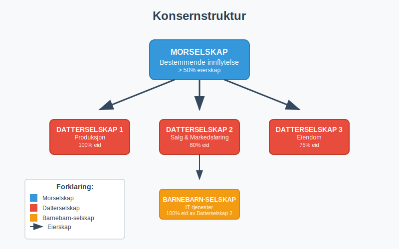
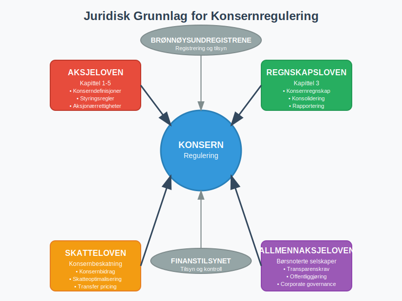
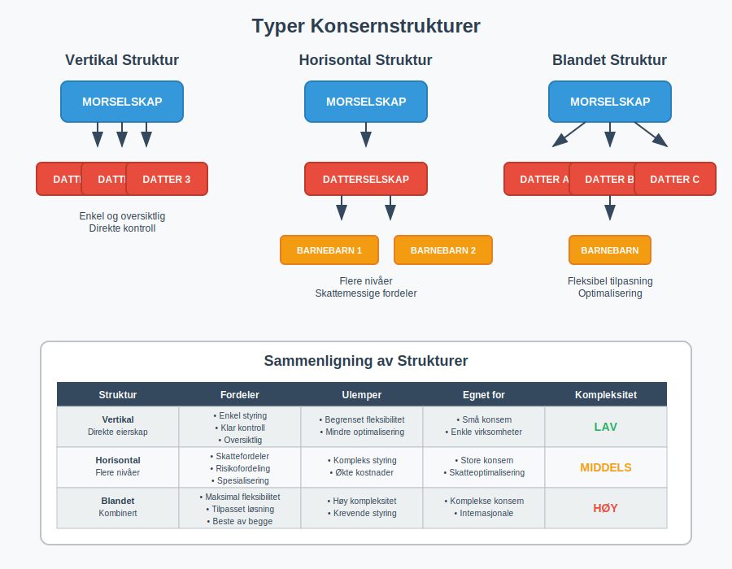
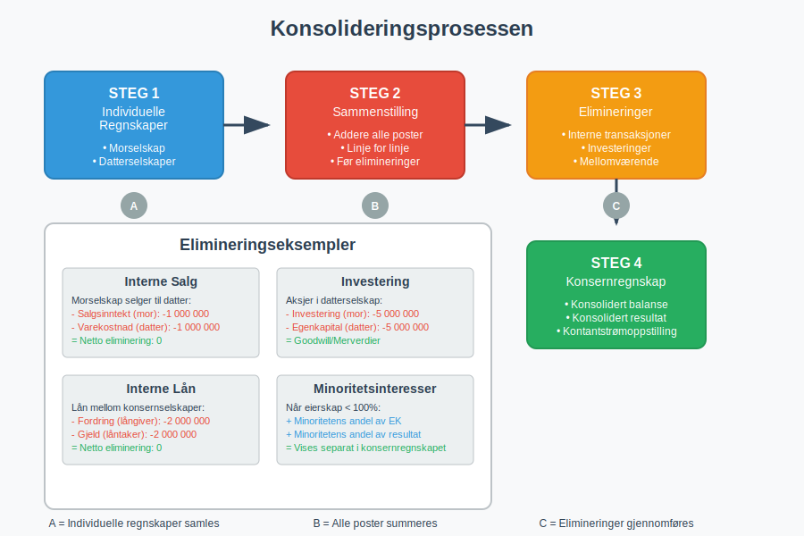
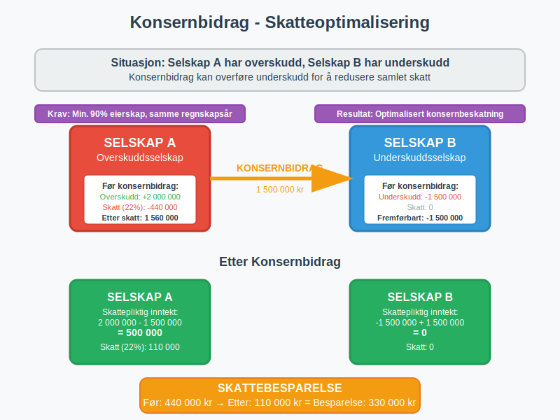
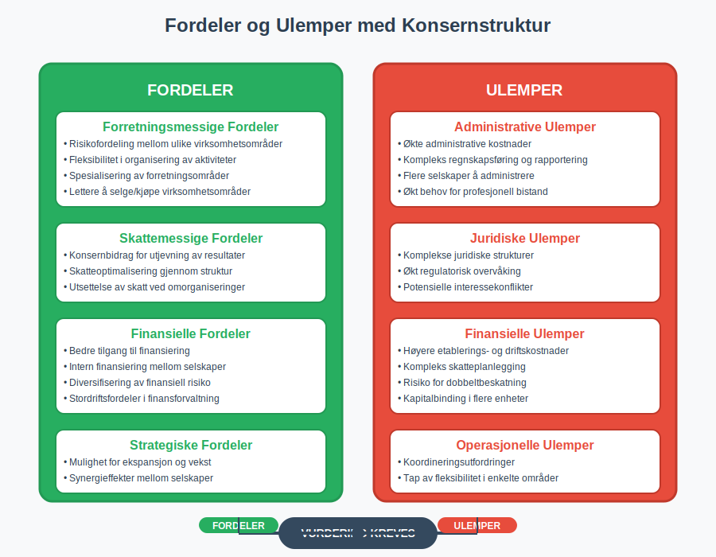
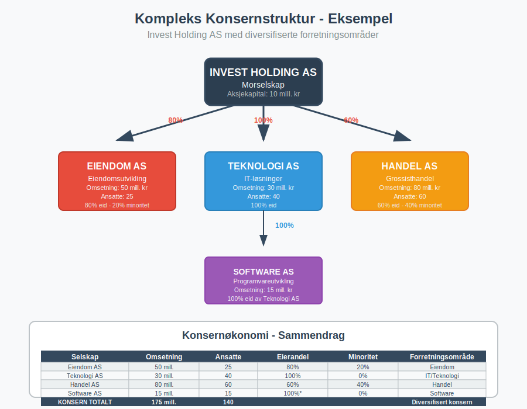
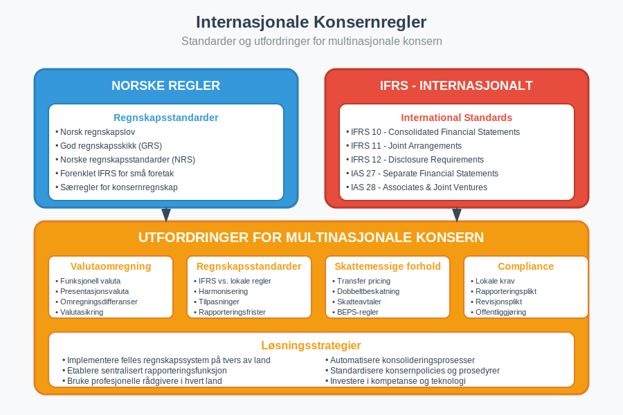

---
title: "hva-er-konsern"
meta_title: "hva-er-konsern"
meta_description: 'Et **konsern** er en gruppe av selskaper hvor ett selskap ([morselskapet](/blogs/regnskap/hva-er-morselskap "Hva er et Morselskap? Komplett Guide til Morselskap...'
slug: hva-er-konsern
type: blog
layout: pages/single
---

Et **konsern** er en gruppe av selskaper hvor ett selskap ([morselskapet](/blogs/regnskap/hva-er-morselskap "Hva er et Morselskap? Komplett Guide til Morselskap og Konsernledelse")) har bestemmende innflytelse over ett eller flere andre selskaper ([datterselskaper](/blogs/regnskap/datterselskap "Hva er Datterselskap? En Guide til Datterselskap og Konsernstruktur")). Konsernstrukturer er vanlige i næringslivet og har betydelige konsekvenser for regnskap, skatt og juridiske forhold.

For spesifikke eksempler på tverrsnittsstruktur, se også [Konglomerat](/blogs/regnskap/konglomerat "Konglomerat: Guide til Konglomerater i Norsk Regnskap").

## Definisjon av Konsern

Et **konsern** oppstår når ett [selskap](/blogs/regnskap/hva-er-et-aksjeselskap "Hva er et Aksjeselskap (AS)? Komplett Guide til Selskapsformen") har **bestemmende innflytelse** over ett eller flere andre selskaper. Bestemmende innflytelse foreligger normalt når morselskapet eier mer enn **50% av stemmene** i datterselskapet.

### Juridisk Grunnlag

Konsernreglene i Norge er regulert i:

* **Aksjeloven** kapittel 1-5 (for aksjeselskaper)
* **Regnskapsloven** kapittel 3 (konsernregnskap)
* **Skatteloven** (konsernbeskatning)
* **Allmennaksjeloven** (for børsnoterte selskaper)

## Typer Konsernstrukturer

### Vertikal Konsernstruktur

I en **vertikal struktur** eier morselskapet direkte alle datterselskapene:

* **Morselskap** på toppen
* **Datterselskaper** direkte underordnet
* Enkel og oversiktlig struktur
* Lett å administrere og kontrollere

### Horisontal Konsernstruktur

En **horisontal struktur** har flere nivåer av eierskap:

* Morselskap eier datterselskap
* Datterselskap eier egne datterselskaper (**barnebarn-selskaper**)
* Mer kompleks struktur
* Kan gi skattemessige fordeler

### Blandet Konsernstruktur

**Kombinerer** elementer fra både vertikal og horisontal struktur:

* Fleksibel tilpasning til forretningsbehov
* Kan optimalisere skatt og risiko
* Krever mer avansert styring

## Konsernregnskap

### Plikt til Konsernregnskap

[Foretak](/blogs/regnskap/hva-er-foretak "Hva er et Foretak? Komplett Guide til Foretaksformer i Norge") må utarbeide **konsernregnskap** når:

* Morselskapet har bestemmende innflytelse over datterselskap
* Konsernet samlet overstiger **to av følgende grenser**:
  - Salgsinntekt: 70 millioner kr
  - Balansesum: 35 millioner kr
  - Gjennomsnittlig antall ansatte: 50

### Konsolideringsprinsipper

Se også vår detaljerte [Konsolidering](/blogs/regnskap/konsolidering "Konsolidering i norsk konsernregnskap") for en grundig gjennomgang.

Konsernregnskapet utarbeides ved **konsolidering** som innebærer:

1. **Sammenstilling** av mor- og datterselskapenes regnskaper
2. **Eliminering** av interne transaksjoner
3. **Eliminering** av interne mellomværende
4. **Beregning** av minoritetsinteresser

#### Elimineringer i Konsernregnskap

| Type Eliminering | Beskrivelse | Eksempel |
|------------------|-------------|----------|
| **Interne salg** | Salg mellom konsernselskaper | Morselskap selger til datterselskap |
| **Interne lån** | Lån mellom konsernselskaper | Konsernkonto mellom selskaper |
| **Interne gevinster** | Gevinst på salg internt | Salg av anleggsmidler internt |
| **Investeringer** | Morselskapets investering i datterselskap | Aksjer i datterselskap |

## Skattemessige Forhold

### Konsernbidrag

[**Konsernbidrag**](/blogs/regnskap/hva-er-konsernbidrag "Hva er Konsernbidrag? Komplett Guide til Konsernbidrag i Norge") er en skattemessig ordning som tillater:

* **Overføring** av underskudd mellom konsernselskaper
* **Utjevning** av skattepliktig inntekt
* **Optimalisering** av konsernets samlede skatt

#### Vilkår for Konsernbidrag

For å kunne gi konsernbidrag må følgende vilkår være oppfylt:

* **Minimum 90%** eierskap (direkte eller indirekte)
* **Samme regnskapsår** for begge selskaper
* Begge selskaper må være **norske** [aksjeselskaper](/blogs/regnskap/hva-er-et-aksjeselskap "Hva er et Aksjeselskap (AS)? Komplett Guide til Selskapsformen")
* **Kontinuerlig eierskap** gjennom hele inntektsåret

### Konsernbeskatning

Norge har **ikke** konsernbeskatning som mange andre land. Hvert selskap beskattes **individuelt**, men konsernbidragsordningen gir visse muligheter for skatteoptimalisering.

## Fordeler og Ulemper med Konsernstruktur

### Fordeler

#### Forretningsmessige Fordeler
* **Risikofordeling** mellom ulike virksomhetsområder
* **Fleksibilitet** i organisering av aktiviteter
* **Spesialisering** av ulike forretningsområder
* **Lettere** å selge eller kjøpe virksomhetsområder

#### Skattemessige Fordeler
* **Konsernbidrag** for utjevning av resultater
* **Skatteoptimalisering** gjennom struktur
* **Utsettelse** av skatt ved omorganiseringer

#### Finansielle Fordeler
* **Bedre** tilgang til [finansiering](/blogs/regnskap/hva-er-finansiering "Hva er Finansiering? Komplett Guide til Finansieringsformer")
* **Intern** finansiering mellom selskaper
* **Diversifisering** av finansiell risiko

### Ulemper

#### Administrative Ulemper
* **Økte** administrative kostnader
* **Kompleks** regnskapsføring og rapportering
* **Flere** selskaper å administrere
* **Økt** behov for profesjonell bistand

#### Juridiske Ulemper
* **Komplekse** juridiske strukturer
* **Økt** regulatorisk overvåking
* **Potensielle** interessekonflikter

## Konsernledelse og Styring

### Corporate Governance

**God konsernledelse** krever:

* **Klare** ansvarslinjer mellom mor- og datterselskaper
* **Effektive** rapporteringsrutiner
* **Uavhengige** styrer i datterselskaper
* **Transparente** beslutningsprosesser

### Internkontroll i Konsern

[Internkontroll](/blogs/regnskap/hva-er-internkontroll "Hva er Internkontroll? Komplett Guide til Internkontrollsystemer") i konsern må omfatte:

* **Konsernvide** retningslinjer og prosedyrer
* **Sentral** økonomistyring og rapportering
* **Risikoidentifikasjon** på konsernnivå
* **Koordinert** internrevisjon

## Praktiske Eksempler

### Eksempel 1: Enkel Konsernstruktur

**Situasjon**: Byggefirma AS eier 100% av aksjene i Transport AS

* **Morselskap**: Byggefirma AS (hovedvirksomhet: bygg og anlegg)
* **Datterselskap**: Transport AS (transporttjenester for konsernet)
* **Fordel**: Risikoseparasjon mellom bygg og transport
* **Konsernregnskap**: Må utarbeides hvis størrelseskriteriene oppfylles

### Eksempel 2: Kompleks Konsernstruktur

**Situasjon**: [Holdingselskap](/blogs/regnskap/hva-er-holdingselskap "Hva er et Holdingselskap? Komplett Guide til Holdingselskaper") med flere forretningsområder

* **Morselskap**: Invest Holding AS
* **Datterselskaper**: 
  - Eiendom AS (80% eierskap)
  - Teknologi AS (100% eierskap)
  - Handel AS (60% eierskap)
* **Barnebarn**: Teknologi AS eier 100% av Software AS

## Oppløsning av Konsern

### Årsaker til Oppløsning

Konsern kan oppløses ved:

* **Salg** av datterselskaper
* [Fusjon](/blogs/regnskap/fusjon "Fusjon: Guide til fusjon i norsk regnskap") mellom konsernselskaper
* **Fisjon** (deling) av selskaper
* **Avvikling** av datterselskaper

### Regnskapsmessige Konsekvenser

Ved oppløsning må det tas hensyn til:

* **Gevinst/tap** ved salg av datterselskap
* **Eliminering** av konserninterne poster
* **Minoritetsinteresser** ved delvis salg
* **Skattemessige** konsekvenser

## Internasjonale Konsern

### Utenlandske Datterselskaper

Norske konsern med **utenlandske datterselskaper** må håndtere:

* **Valutaomregning** av utenlandske regnskaper
* **Ulike regnskapsstandarder** (IFRS vs. norske regler)
* **Skattemessige** utfordringer på tvers av land
* **Transfer pricing** regler

### IFRS for Konsernregnskap

Store konsern må ofte følge **IFRS** (International Financial Reporting Standards) som har egne regler for:

* **Konsolidering** av datterselskaper
* **Tilknyttede selskaper** og felleskontrollerte enheter
* **Goodwill** og andre immaterielle eiendeler
* **Segmentrapportering**

## Fremtidige Utviklingstrekk

### Digitalisering av Konsernrapportering

* **Automatisering** av konsolideringsprosesser
* **Sanntids** rapportering mellom konsernselskaper
* **Kunstig intelligens** for analyse av konserndata
* **Blockchain** for transparente konserntransaksjoner

### Regulatoriske Endringer

* **Økt fokus** på bærekraftsrapportering
* **Strengere krav** til transparens
* **Harmonisering** av internasjonale regler
* **Digitale** rapporteringsformater

## Konklusjon

Et **konsern** er en kompleks forretningsstruktur som kan gi betydelige fordeler, men som også krever omfattende kunnskap om regnskap, skatt og juridiske forhold. For [foretak](/blogs/regnskap/hva-er-foretak "Hva er et Foretak? Komplett Guide til Foretaksformer i Norge") som vurderer konsernstruktur, er det viktig å:

* **Vurdere** forretningsmessige behov og mål
* **Forstå** regnskapsmessige og skattemessige konsekvenser  
* **Etablere** gode styrings- og kontrollsystemer
* **Søke** profesjonell rådgivning ved etablering

Konsernstrukturer vil fortsette å være et viktig verktøy for organisering av næringsvirksomhet, men krever kontinuerlig oppmerksomhet på regulatoriske endringer og beste praksis for konsernledelse.

