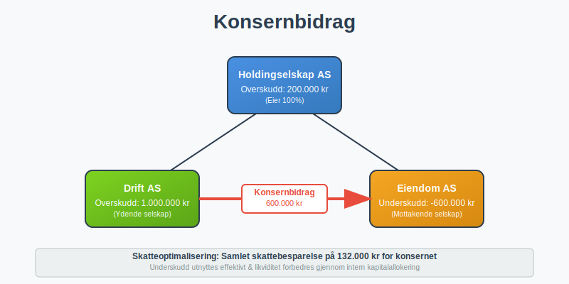
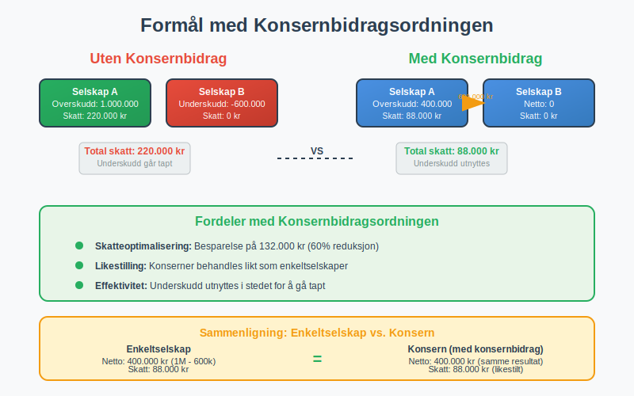
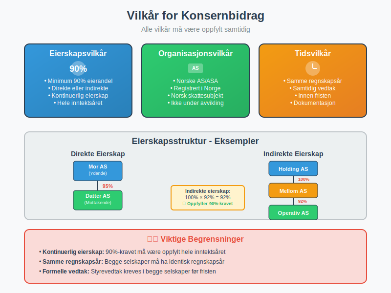
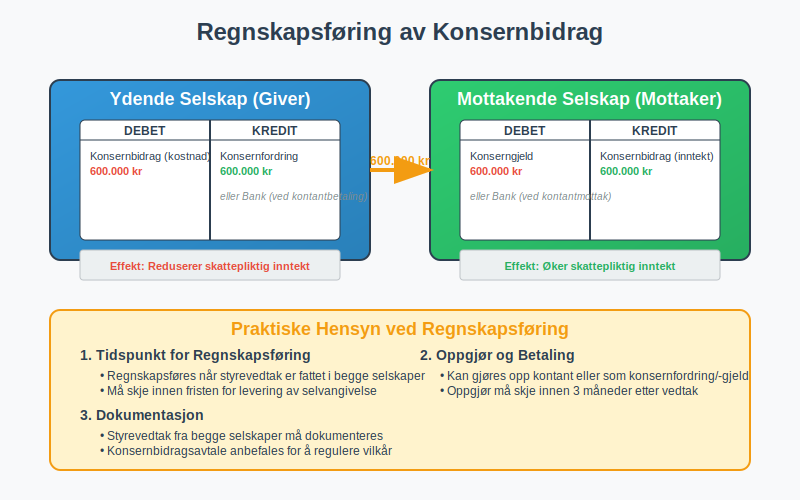
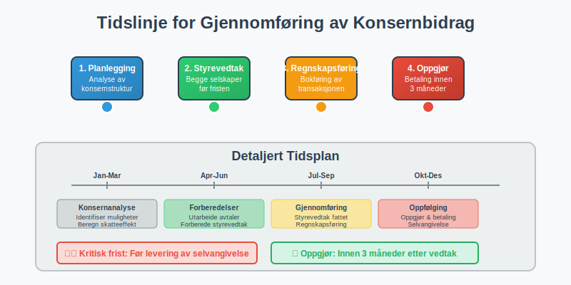
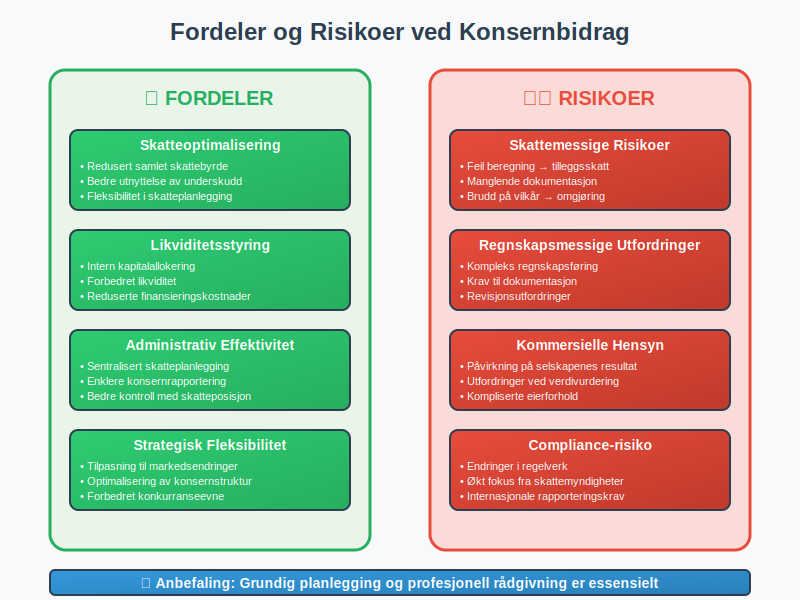
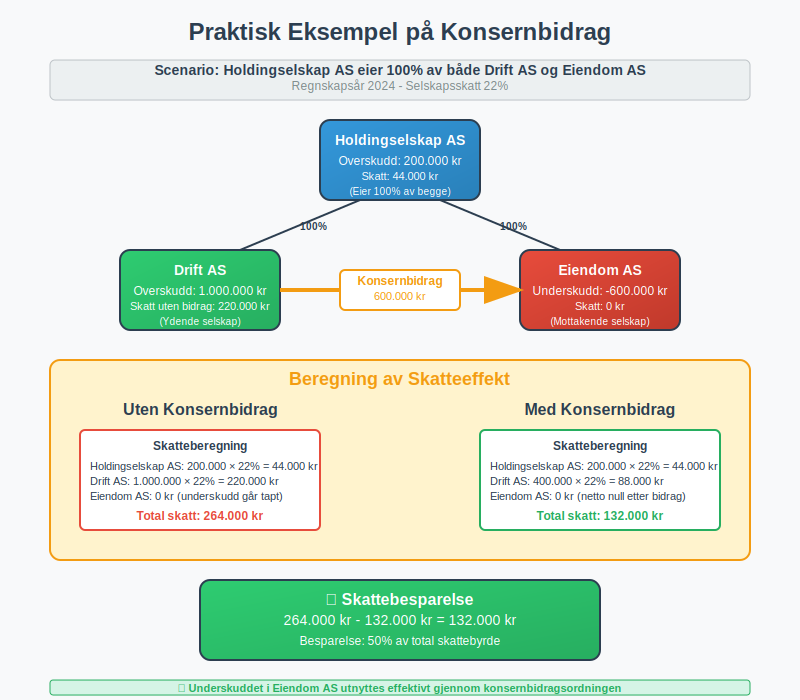

---
title: "Hva er Konsernbidrag?"
meta_title: "Hva er Konsernbidrag?"
meta_description: '**Konsernbidrag** er en skattemessig ordning som gir selskaper i samme konsern mulighet til å overføre underskudd og overskudd mellom seg. Dette er et viktig ...'
slug: hva-er-konsernbidrag
type: blog
layout: pages/single
---

**Konsernbidrag** er en skattemessig ordning som gir selskaper i samme konsern mulighet til å overføre underskudd og overskudd mellom seg. Dette er et viktig verktøy for skatteoptimalisering og effektiv kapitalforvaltning i konsernstrukturer.



## Hva er Konsernbidrag?

Konsernbidrag er en **skattemessig mekanisme** som gjør det mulig for selskaper som inngår i samme konsern å:

* **Overføre underskudd** fra underskuddsselskap til overskuddsselskap
* **Utjevne skattebelastningen** mellom selskapene i konsernet
* **Optimalisere den samlede skatteposisjonen** for hele konsernet
* **Forbedre likviditeten** gjennom intern kapitalallokering

Ordningen er regulert i **skatteloven § 10-2** og er en sentral del av det norske skattesystemet for konserner.

### Formål med Konsernbidragsordningen

Hovedformålet med konsernbidragsordningen er å **likestille konserner** med enkeltselskaper når det gjelder skattemessig behandling. Uten denne ordningen ville konserner være i en dårligere skatteposisjon enn enkeltselskaper som kan motregne underskudd mot overskudd internt.



## Vilkår for Konsernbidrag

For at konsernbidrag skal kunne ytes, må flere **strenge vilkår** være oppfylt:

### Eierskapsvilkår

* **Minimum 90% eierandel** - Det ydende selskap må eie minst 90% av aksjene i det mottakende selskap, eller omvendt
* **Direkte eller indirekte eierskap** - Eierforholdet kan være direkte eller gjennom andre selskaper i konsernet
* **Kontinuerlig eierskap** - Eierskapet må ha bestått i hele inntektsåret

### Organisasjonsvilkår

Både det ydende og mottakende selskap må være:

* **Norske aksjeselskaper** eller allmennaksjeselskaper
* **Registrert i Norge** med norsk skattesubjekt
* **Ikke under avvikling** eller konkursbehandling

### Tidsvilkår

* **Samme regnskapsår** - Begge selskaper må ha samme regnskapsår
* **Samtidig vedtak** - Konsernbidraget må vedtas av begge selskapers styrer innen fristen



## Typer Konsernbidrag

Det finnes to hovedtyper konsernbidrag:

### 1. Ordinært Konsernbidrag

* **Fra overskuddsselskap til underskuddsselskap**
* Reduserer skattepliktig inntekt for det ydende selskap
* Øker skattepliktig inntekt for det mottakende selskap
* Mest vanlige form for konsernbidrag

### 2. Negativt Konsernbidrag

* **Fra underskuddsselskap til overskuddsselskap**
* Overfører underskudd til selskap med overskudd
* Krever spesielle vilkår og dokumentasjon
* Mindre vanlig i praksis

## Regnskapsføring av Konsernbidrag

Konsernbidrag skal **regnskapsføres** på følgende måte:

### Hos det Ydende Selskap

```
Debet: Konsernbidrag (kostnad)
Kredit: Konsernfordring/Bank
```

### Hos det Mottakende Selskap

```
Debet: Konserngjeld/Bank
Kredit: Konsernbidrag (inntekt)
```



## Skattemessig Behandling

### For det Ydende Selskap

* Konsernbidraget er **fradragsberettiget** i skattepliktig inntekt
* Reduserer [selskapsskatt](/blogs/regnskap/hva-er-selskapsskatt "Hva er Selskapsskatt? Komplett Guide til Selskapsskatt i Norge") tilsvarende
* Må dokumenteres med vedtak og avtale

### For det Mottakende Selskap

* Konsernbidraget er **skattepliktig inntekt**
* Øker grunnlaget for selskapsskatt
* Kan motregnes mot fremførbare underskudd

### Skattemessig Nøytralitet

Konsernbidragsordningen er utformet for å være **skattemessig nøytral** for konsernet som helhet. Den samlede skattebelastningen skal ikke endres, men fordeles mer effektivt mellom selskapene.

## Praktisk Gjennomføring

### Styrevedtak

Begge selskaper må fatte **formelle styrevedtak** om konsernbidraget:

* **Før fristen** for levering av selvangivelse
* **Spesifisere beløp** og mottaker/yter
* **Dokumentere begrunnelse** for bidraget

### Konsernbidragsavtale

Det anbefales å inngå en **skriftlig avtale** som regulerer:

* Beløpets størrelse og betalingstidspunkt
* Rentebetingelser ved forsinket betaling
* Eventuelle sikkerhetsstillelser
* Oppgjørsform (kontant eller fordring)

### Frister

| Aktivitet | Frist |
|-----------|-------|
| **Styrevedtak** | Før levering av selvangivelse |
| **Betaling/oppgjør** | Innen 3 måneder etter vedtak |
| **Dokumentasjon** | Sammen med selvangivelse |
| **Revidering** | Innen 6 måneder etter vedtak |



## Fordeler med Konsernbidrag

### Skatteoptimalisering

* **Redusert samlet skattebyrde** for konsernet
* **Bedre utnyttelse** av skattemessige underskudd
* **Fleksibilitet** i skatteplanlegging

### Likviditetsstyring

* **Intern kapitalallokering** uten eksterne lån
* **Forbedret likviditet** for underskuddsselskaper
* **Reduserte finansieringskostnader**

### Administrativ Effektivitet

* **Sentralisert skatteplanlegging**
* **Enklere konsernrapportering**
* **Bedre kontroll** med konsernets skatteposisjon

## Risiko og Utfordringer

### Skattemessige Risikoer

* **Feil beregning** av konsernbidrag kan føre til tilleggsskatt
* **Manglende dokumentasjon** kan medføre at fradraget ikke godkjennes
* **Brudd på vilkår** kan føre til omgjøring av skatteposisjonen

### Regnskapsmessige Utfordringer

* **Kompleks regnskapsføring** ved konsernoppgjør
* **Krav til dokumentasjon** og sporbarhet
* **Revisjonsutfordringer** ved kontroll av konsernbidrag

### Kommersielle Hensyn

* **Påvirkning på selskapenes** individuelle resultat
* **Utfordringer ved** [verdivurdering](/blogs/regnskap/hva-er-verdivurdering "Hva er Verdivurdering? Komplett Guide til Verdivurdering i Regnskap") av selskaper
* **Kompliserte eierforhold** kan skape praktiske problemer



## Konsernbidrag vs. Andre Ordninger

### Sammenligning med Konsernbeskatning

| Aspekt | Konsernbidrag | Konsernbeskatning |
|--------|---------------|-------------------|
| **Skattesubjekt** | Hvert selskap | Konsernet som helhet |
| **Kompleksitet** | Moderat | Høy |
| **Fleksibilitet** | Høy | Lav |
| **Dokumentasjon** | Omfattende | Mindre |

### Forhold til Utbytte

Konsernbidrag skiller seg fra [utbytte](/blogs/regnskap/hva-er-utbytte "Hva er Utbytte? Komplett Guide til Utbytte og Utbytteskatt") ved at:

* **Ikke skattepliktig** for mottaker (ved fritaksmetoden)
* **Ikke fradragsberettiget** for yter
* **Krever overskudd** og fri egenkapital

## Internasjonale Aspekter

### Konsernbidrag til Utenlandske Selskaper

* **Begrenset adgang** til konsernbidrag med utenlandske selskaper
* **Spesielle regler** for EØS-selskaper
* **Krav til sammenlignbar beskatning** i mottakerlandet

### EU/EØS-Regler

* **Ikke-diskrimineringsprinsippet** påvirker konsernbidragsreglene
* **Særlige vilkår** for konsernbidrag til EØS-selskaper
* **Dokumentasjonskrav** for utenlandske mottakere

## Eksempel på Konsernbidrag

### Situasjon

[Holdingselskap](/blogs/regnskap/hva-er-holdingselskap "Hva er et Holdingselskap? Komplett Guide til Holdingselskaper i Norge") AS eier 100% av aksjene i både Drift AS og Eiendom AS:

* **Drift AS**: Overskudd på 1 000 000 kr
* **Eiendom AS**: Underskudd på 600 000 kr
* **Holdingselskap AS**: Overskudd på 200 000 kr

### Løsning med Konsernbidrag

1. **Drift AS** yter konsernbidrag på 600 000 kr til **Eiendom AS**
2. **Drift AS** får fradrag for 600 000 kr (skattepliktig inntekt: 400 000 kr)
3. **Eiendom AS** får skattepliktig inntekt på 600 000 kr som motregnes mot underskuddet

### Skatteeffekt

| Selskap | Uten Konsernbidrag | Med Konsernbidrag | Skattebesparelse |
|---------|-------------------|-------------------|------------------|
| **Drift AS** | 220 000 kr | 88 000 kr | 132 000 kr |
| **Eiendom AS** | 0 kr | 0 kr | 0 kr |
| **Totalt** | 220 000 kr | 88 000 kr | **132 000 kr** |



## Fremtidige Endringer

### Pågående Reformer

* **Digitalisering** av konsernbidragsprosessen
* **Forenkling** av dokumentasjonskrav
* **Harmonisering** med internasjonale regler

### Forventede Endringer

* **Økt fokus** på substans over form
* **Strengere krav** til kommersielle begrunnelser
* **Bedre integrasjon** med konsernregnskapsregler

## Konklusjon

Konsernbidrag er et **kraftfullt verktøy** for skatteoptimalisering i konsernstrukturer. Ordningen krever imidlertid:

* **Grundig planlegging** og dokumentasjon
* **Nøye overholdelse** av alle vilkår og frister
* **Profesjonell rådgivning** for komplekse situasjoner

For [aksjeselskaper](/blogs/regnskap/hva-er-et-aksjeselskap "Hva er et Aksjeselskap (AS)? Komplett Guide til Selskapsformen") som inngår i konsernstrukturer, kan konsernbidrag være avgjørende for å oppnå optimal skatteposisjon og effektiv kapitalforvaltning.

Ved riktig anvendelse kan konsernbidragsordningen gi betydelige **skattebesparelser** og forbedret **likviditetsstyring** for hele konsernet. Det er derfor viktig å ha god forståelse av reglene og søke profesjonell bistand ved implementering.


