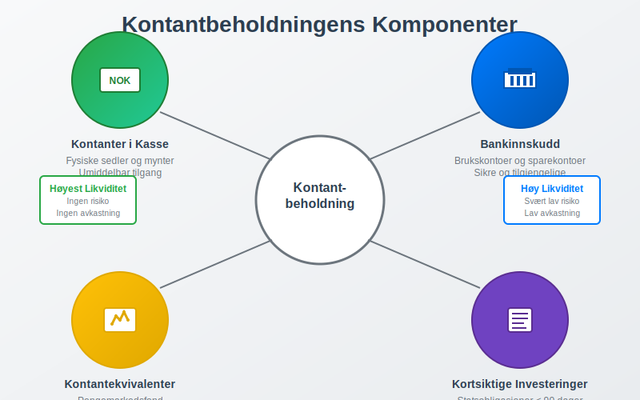
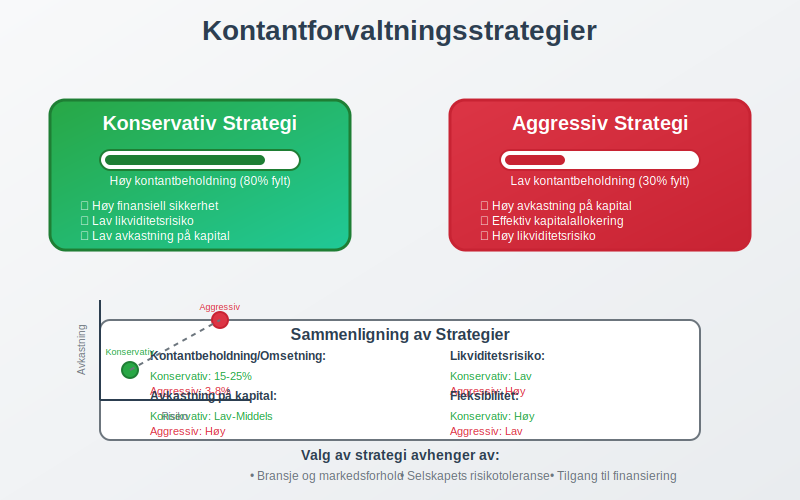
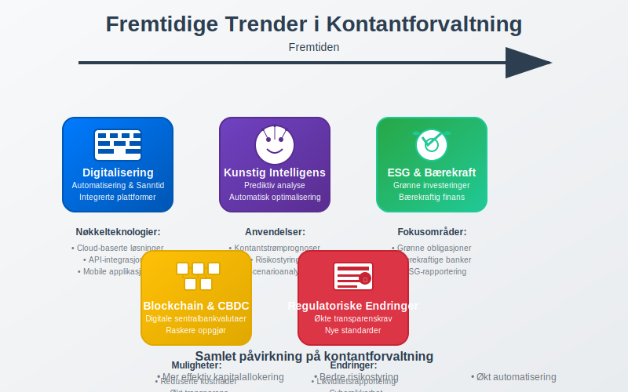

---
title: "Hva er Kontantbeholdning?"
meta_title: "Hva er Kontantbeholdning?"
meta_description: '**Kontantbeholdning** er den totale mengden kontanter og kontantekvivalenter som et selskap holder tilgjengelig for å møte sine kortsiktige forpliktelser og o...'
slug: hva-er-kontantbeholdning
type: blog
layout: pages/single
---

**Kontantbeholdning** er den totale mengden kontanter og kontantekvivalenter som et selskap holder tilgjengelig for å møte sine kortsiktige forpliktelser og operasjonelle behov. Som en fundamental del av [likviditetsstyring](/blogs/regnskap/hva-er-arbeidskapital "Hva er Arbeidskapital? Beregning og Betydning for Bedrifter"), representerer kontantbeholdning selskapets evne til å håndtere uforutsette utgifter og gripe investeringsmuligheter når de oppstår.

Kontantutstrømmer inkluderer også **kontantkjøp** av varer og tjenester. Se [Kontantkjøp](/blogs/regnskap/kontantkjop "Kontantkjøp “ Guide til Regnskapsføring av Kontantkjøp").

For mer informasjon om bevegelsen av kontanter i en virksomhet, se [Hva er kontantstrøm?](/blogs/regnskap/hva-er-kontantstrom "Hva er Kontantstrøm? Komplett Guide til Cash Flow Analyse og Styring").

### Definisjon og Grunnleggende Konsepter

**Kontantbeholdning** kan defineres som summen av alle likvide midler som et selskap har umiddelbar tilgang til. Dette skiller seg fra [kassebeholdning](/blogs/regnskap/hva-er-kassebeholdning "Hva er Kassebeholdning? Komplett Guide til Kontanter og Likvide Midler") ved at kontantbeholdning har et bredere perspektiv på likviditetsstyring og strategisk kontantforvaltning.

#### Regnskapsmessig Perspektiv

Fra et regnskapsmessig synspunkt inkluderer kontantbeholdning:

* **Kontanter i kasse** - fysiske sedler og mynter
* **Bankinnskudd** - midler på brukskontoer og sparekontoer
* **Kontantekvivalenter** - kortsiktige, høylikvide investeringer
* **Pengemarkedsinstrumenter** - med løpetid under 90 dager
* **Kortsiktige statspapirer** - lett omsettelige verdipapirer

#### Strategisk Perspektiv

Fra et strategisk perspektiv representerer kontantbeholdning:

* **Finansiell fleksibilitet** for å respondere på markedsendringer
* **Operasjonell sikkerhet** for kontinuerlig drift
* **Investeringskapasitet** for vekstmuligheter
* **Risikobuffer** mot økonomisk usikkerhet

### Kontantbeholdning vs. Andre Likvide Midler

Det er viktig å forstå forskjellen mellom kontantbeholdning og andre former for likvide midler:

| **Type Likviditet** | **Tilgjengelighet** | **Risiko** | **Avkastning** | **Eksempel** |
|---------------------|---------------------|------------|----------------|--------------|
| **Kontanter** | Umiddelbar | Ingen | 0% | Sedler og mynter |
| **Bankinnskudd** | Umiddelbar | Svært lav | 0-3% | Brukskonto |
| **Kontantekvivalenter** | 1-3 dager | Lav | 2-4% | Pengemarkedsfond |
| **Kortsiktige investeringer** | 1-30 dager | Lav-middels | 3-6% | Statsobligasjoner |
| **Markedsbaserte investeringer** | 1-5 dager | Middels-høy | Variabel | Aksjer, obligasjoner |

### Optimal Kontantbeholdning

#### Faktorer som Påvirker Optimal Nivå

Bestemmelse av optimal kontantbeholdning avhenger av flere kritiske faktorer:

**Bransjekarakteristika**
* **Sesongvariasjoner** i kontantstrøm
* **Kundebetalingsmønstre** og kredittider
* **Leverandørbetalingsbetingelser**
* **Kapitalkrav** for drift og vekst

**Selskapsspesifikke Faktorer**
* **Størrelse** og kompleksitet
* **Geografisk spredning** av virksomhet
* **Tilgang til kreditt** og finansieringskilder
* **Risikotoleranse** og finansiell konservatisme

#### Beregningsmodeller for Optimal Kontantbeholdning

**Baumol-modellen** for kontantbeholdning:

**Optimal kontantbeholdning = √(2 × F × T / r)**

Hvor:
* F = Faste kostnader per transaksjon
* T = Totale kontantbehov per periode
* r = Alternativkostnad (rentesats)

**Praktisk eksempel:**
* Årlige kontantutbetalinger: 24 000 000 NOK
* Transaksjonskostnad: 1 000 NOK
* Alternativkostnad: 5%

Optimal kontantbeholdning = √(2 × 1 000 × 24 000 000 / 0,05) = **√960 000 000 = 979 796 NOK**

#### Miller-Orr Modellen for Variable Kontantstrømmer

For selskaper med uforutsigbare kontantstrømmer:

| **Parameter** | **Beskrivelse** | **Typisk Verdi** |
|---------------|-----------------|------------------|
| **Nedre kontrollgrense** | Minimum kontantbeholdning | 500 000 NOK |
| **Øvre kontrollgrense** | Maksimum før investering | 2 000 000 NOK |
| **Målnivå** | Ønsket kontantbeholdning | 1 000 000 NOK |
| **Standardavvik** | Daglig variasjon | 100 000 NOK |

### Kontantforvaltningsstrategier

#### Konservativ Strategi

**Karakteristika:**
* **Høy kontantbeholdning** relativt til omsetning
* **Lav risiko** for likviditetsproblemer
* **Begrenset avkastning** på overskuddslikviditet
* **Høy finansiell sikkerhet**

**Fordeler:**
* Evne til å håndtere uforutsette utgifter
* Mulighet til å gripe investeringsmuligheter raskt
* Redusert avhengighet av ekstern finansiering
* Økt kredittrating og lavere lånekostnader

**Ulemper:**
* Lav avkastning på kontanter
* Alternativkostnad ved ikke-investering
* Potensielt ineffektiv kapitalallokering

#### Aggressiv Strategi

**Karakteristika:**
* **Lav kontantbeholdning** relativt til omsetning
* **Høyere risiko** for likviditetsproblemer
* **Maksimering** av avkastning på kapital
* **Aktiv kontantforvaltning**

**Fordeler:**
* Høyere avkastning på investert kapital
* Mer effektiv kapitalallokering
* Lavere alternativkostnad

**Ulemper:**
* Økt risiko for likviditetsproblemer
* Avhengighet av ekstern finansiering
* Begrenset fleksibilitet ved kriser

### Kontantbeholdning i Ulike Bransjer

#### Teknologiselskaper

**Karakteristika:**
* **Høy kontantbeholdning** for FoU-investeringer
* **Volatile inntektsstrømmer** i vekstfaser
* **Høy usikkerhet** i markedet
* **Behov for rask skalering**

**Typiske nøkkeltall:**
* Kontantbeholdning/Omsetning: 15-30%
* Kontantbeholdning/Totale eiendeler: 10-25%

#### Detaljhandel

**Karakteristika:**
* **Sesongvariasjoner** i kontantstrøm
* **Høy omløpshastighet** på kapital
* **Forutsigbare kontantstrømmer**
* **Begrenset behov** for høy kontantbeholdning

**Typiske nøkkeltall:**
* Kontantbeholdning/Omsetning: 2-8%
* Kontantbeholdning/Totale eiendeler: 3-10%

#### Produksjonsbedrifter

**Karakteristika:**
* **Kapitalkrevende** investeringer
* **Lange produksjonssykler**
* **Behov for arbeidskapitalfinansiering**
* **Konjunkturavhengige** kontantstrømmer

**Typiske nøkkeltall:**
* Kontantbeholdning/Omsetning: 5-15%
* Kontantbeholdning/Totale eiendeler: 5-15%

### Kontantprognoser og Planlegging

#### Kortsiktige Kontantprognoser (1-13 uker)

**Formål:**
* Daglig likviditetsstyring
* Optimalisering av kontosaldoer
* Planlegging av kortsiktige investeringer
* Identifisering av finansieringsbehov

**Komponenter:**
* **Innbetalinger** fra kunder
* **Utbetalinger** til leverandører
* **Lønnsutbetalinger** og sosiale kostnader
* **Skatter og avgifter**
* **Renter og finanskostnader**

#### Mellomlangsiktige Prognoser (3-18 måneder)

**Formål:**
* Strategisk finansiell planlegging
* Budsjettutvikling og kontroll
* Investeringsplanlegging
* Finansieringsstrategier

#### Langsiktige Prognoser (1-5 år)

**Formål:**
* Strategisk kapitalallokering
* Vekstfinansiering
* Utbyttepolitikk
* Kapitalstrukturoptimalisering

### Teknologi og Kontantforvaltning

#### Digitale Betalingsløsninger

**Fordeler:**
* **Raskere kontantinngang** fra kunder
* **Reduserte transaksjonskostnader**
* **Bedre kontroll** og sporing
* **Automatisering** av rutineprosesser

**Populære løsninger:**
* Vipps for bedrifter
* Stripe og andre betalingsgatewayer
* Automatisk fakturering og innkreving
* Integrerte ERP-systemer

#### Kunstig Intelligens i Kontantforvaltning

**Anvendelser:**
* **Prediktiv analyse** av kontantstrømmer
* **Automatisk optimalisering** av kontantbeholdning
* **Risikostyring** og scenarioanalyse
* **Sanntidsovervåking** av likviditet

#### Blockchain og Digitale Valutaer

**Potensielle påvirkninger:**
* **Raskere oppgjør** av transaksjoner
* **Reduserte mellommannkostnader**
* **Økt transparens** i betalingskjeder
* **Nye former** for kontantekvivalenter

### Regulatoriske Krav og Compliance

#### Norske Regnskapsstandarder

**Krav til rapportering:**
* **Klassifisering** av kontanter og kontantekvivalenter
* **Noteopplysninger** om likviditet
* **Kontantstrømoppstilling** som obligatorisk rapport
* **Vurdering** av going concern

#### Internasjonale Standarder (IFRS)

**IAS 7 - Kontantstrømoppstillinger:**
* **Definisjon** av kontanter og kontantekvivalenter
* **Klassifisering** av kontantstrømmer
* **Presentasjon** og notekrav
* **Avstemming** mellom årsresultat og operasjonelle kontantstrømmer

#### Sektorspesifikke Krav

**Finansielle institusjoner:**
* **Likviditetsdekning** (LCR)
* **Netto stabil finansiering** (NSFR)
* **Stresstesting** av likviditet

**Børsnoterte selskaper:**
* **Kvartalsrapportering** av likviditet
* **Investor relations** og kommunikasjon
* **Corporate governance** krav

### Risikostyring av Kontantbeholdning

#### Likviditetsrisiko

**Identifisering:**
* **Kontantstrømgap** i kritiske perioder
* **Konsentrasjonsrisiko** i kundebase
* **Sesongvariasjoner** og sykliske svingninger
* **Makroøkonomiske** påvirkninger

**Håndtering:**
* **Diversifisering** av inntektskilder
* **Fleksible finansieringsavtaler**
* **Kontinuerlig overvåking** av nøkkeltall
* **Beredskapsplaner** for krisesituasjoner

#### Kredittrisiko

**Påvirkning på kontantbeholdning:**
* **Kundetap** reduserer kontantinngang
* **Økte avsetninger** for tap på fordringer
* **Forsinkede betalinger** påvirker likviditet

**Risikostyring:**
* **Kredittvurdering** av nye kunder
* **Kreditforsikring** for store eksponeringer
* **Faktoring** og andre finansieringsløsninger
* **Diversifisering** av kundeportefølje

#### Valutarisiko

**For internasjonale selskaper:**
* **Transaksjonsrisiko** på kontantstrømmer
* **Omregningsrisiko** på utenlandske kontanter
* **Økonomisk risiko** fra valutasvingninger

**Sikringsstrategier:**
* **Valutaterminkontrakter**
* **Naturlig sikring** gjennom matching
* **Diversifisering** av valutaeksponering

### Nøkkeltall og Analyse

#### Likviditetsgrad 1 (Current Ratio)

**Formel:** Omløpsmidler / Kortsiktig gjeld

**Tolkning:**
* **Over 2,0:** Sterk likviditet
* **1,5-2,0:** Tilfredsstillende likviditet
* **Under 1,5:** Svak likviditet

#### Likviditetsgrad 2 (Quick Ratio)

**Formel:** (Omløpsmidler - Varelager) / Kortsiktig gjeld

**Tolkning:**
* **Over 1,0:** God likviditet
* **0,8-1,0:** Akseptabel likviditet
* **Under 0,8:** Svak likviditet

#### Kontantbeholdningsgrad

**Formel:** Kontantbeholdning / Totale eiendeler

**Bransjebenchmarks:**
* **Teknologi:** 10-25%
* **Detaljhandel:** 3-10%
* **Produksjon:** 5-15%
* **Tjenester:** 5-20%

#### Kontantkonverteringssyklus

**Formel:** DIO + DSO - DPO

Hvor:
* **DIO:** Days Inventory Outstanding
* **DSO:** Days Sales Outstanding  
* **DPO:** Days Payable Outstanding

**Tolkning:**
* **Kortere syklus:** Bedre kontantgenerering
* **Lengre syklus:** Høyere finansieringsbehov

### Kontantbeholdning og Verdivurdering

#### Påvirkning på Selskapsverdi

**Positive effekter:**
* **Redusert finansiell risiko** øker verdsettelsesmultipler
* **Fleksibilitet** for vekstinvesteringer
* **Stabilitet** i kontantstrømmer

**Negative effekter:**
* **Lav avkastning** på kontanter
* **Alternativkostnad** ved ikke-investering
* **Ineffektiv kapitalallokering**

#### Verdsettelsesmodeller

**Discounted Cash Flow (DCF):**
* Kontantbeholdning legges til **enterprise value**
* **Terminal value** påvirkes av langsiktig kontantgenerering
* **Diskonteringsrente** reflekterer finansiell risiko

**Multiplikatormodeller:**
* **P/E-multipler** påvirkes av finansiell stabilitet
* **EV/EBITDA** justeres for kontantbeholdning
* **Price-to-Book** reflekterer likviditetspremie

### Fremtidige Trender

#### Digitalisering av Kontantforvaltning

**Utviklingstrender:**
* **Sanntidsrapportering** av kontantposisjoner
* **Automatisert optimalisering** av kontantallokering
* **Integrerte finansplattformer**
* **AI-drevet prognostisering**

#### Bærekraft og ESG

**Påvirkning på kontantforvaltning:**
* **Grønne investeringer** for overskuddslikviditet
* **Bærekraftige banker** og finansinstitusjoner
* **ESG-rapportering** av finansielle beslutninger
* **[Stakeholder-kapitalisme](/blogs/regnskap/kapitalisme "Hva er Kapitalisme? Komplett Guide til Kapitalisme i Økonomi og Regnskap")** og langsiktig tenkning

#### Regulatoriske Endringer

**Forventede utviklinger:**
* **Økte transparenskrav** for likviditetsrapportering
* **Nye standarder** for kontantstrømrapportering
* **Digitale valutaer** og regulatorisk tilpasning
* **Cybersikkerhet** i finansielle systemer

### Praktiske Anbefalinger

#### For Små og Mellomstore Bedrifter

**Kontantforvaltningsstrategi:**
* **Konservativ tilnærming** med 3-6 måneders driftsutgifter
* **Enkle prognoseverktøy** for kontantstrømplanlegging
* **Diversifiserte bankforbindelser** for sikkerhet
* **Automatisering** av rutineprosesser

#### For Store Selskaper

**Sofistikerte strategier:**
* **Sentralisert kontantforvaltning** (cash pooling)
* **Avanserte prognosesystemer** med AI-støtte
* **Globale bankforbindelser** og valutastyring
* **Integrerte treasury-systemer**

#### Implementering av Best Practices

**Organisatoriske tiltak:**
* **Dedikert treasury-funksjon** eller ansvarlig person
* **Klare retningslinjer** for kontantforvaltning
* **Regelmessig rapportering** til ledelsen
* **Kontinuerlig opplæring** av relevant personell

**Teknologiske løsninger:**
* **ERP-integrasjon** for sanntidsdata
* **Automatiserte betalingssystemer**
* **Dashboards** for likviditetsovervåking
* **Mobile løsninger** for fleksibel tilgang

### Konklusjon

**Kontantbeholdning** er en kritisk komponent i enhver bedrifts finansielle strategi. Optimal forvaltning krever en balanse mellom **likviditet**, **avkastning** og **risiko**. Moderne teknologi og analytiske verktøy gjør det mulig å optimalisere kontantbeholdning mer presist enn noen gang tidligere.

Nøkkelen til suksess ligger i å:

* **Forstå** selskapets unike kontantstrømmønstre
* **Implementere** passende prognosesystemer
* **Balansere** sikkerhet mot avkastning
* **Tilpasse** strategien til bransje og markedsforhold
* **Kontinuerlig overvåke** og justere tilnærmingen

Ved å følge disse prinsippene kan bedrifter sikre optimal [likviditetsstyring](/blogs/regnskap/hva-er-arbeidskapital "Hva er Arbeidskapital? Beregning og Betydning for Bedrifter") og støtte langsiktig finansiell stabilitet og vekst.

