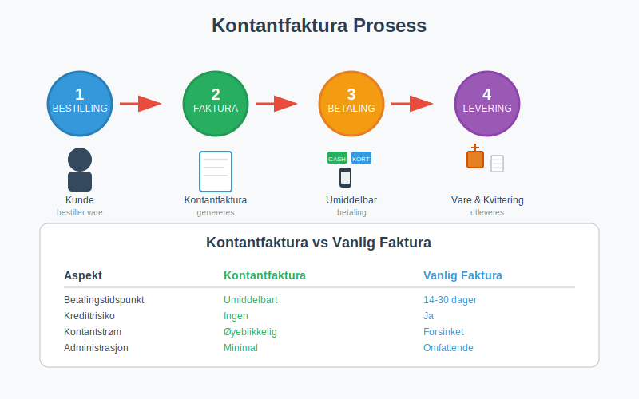
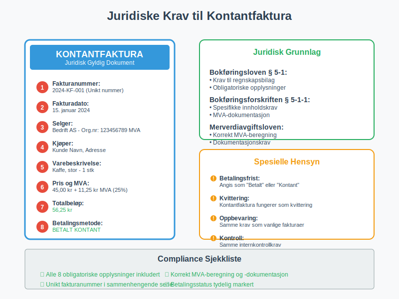
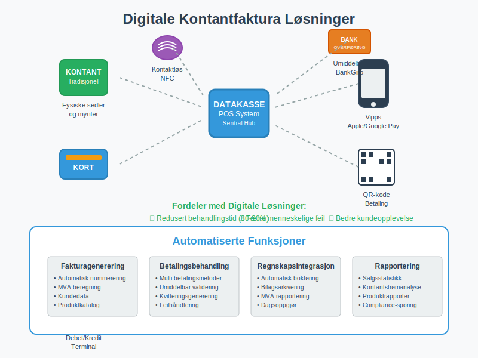
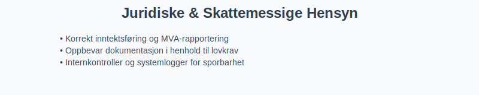

---
title: "Hva er kontantfaktura?"
meta_title: "Hva er kontantfaktura?"
meta_description: 'En **kontantfaktura** er en spesiell type [faktura](/blogs/regnskap/hva-er-en-faktura "Hva er en Faktura? En Guide til Norske Fakturakrav") som krever umiddelba...'
slug: hva-er-kontantfaktura
type: blog
layout: pages/single
---

En **kontantfaktura** er en spesiell type [faktura](/blogs/regnskap/hva-er-en-faktura "Hva er en Faktura? En Guide til Norske Fakturakrav") som krever umiddelbar betaling ved levering av varer eller tjenester. I motsetning til vanlige fakturaer med betalingsfrist, må kontantfakturaer betales på stedet, vanligvis kontant, med kort eller via mobile betalingsløsninger. Dette gjør kontantfaktura til et viktig verktøy for bedrifter som ønsker å sikre øyeblikkelig [kontantstrøm](/blogs/regnskap/hva-er-kassebeholdning "Hva er Kassebeholdning? Komplett Guide til Kontantstyring") og eliminere kredittrisiko.

## Seksjon 1: Når Brukes Kontantfaktura?

Kontantfakturering er særlig utbredt i visse bransjer og situasjoner hvor umiddelbar betaling er ønskelig eller nødvendig. Mange bedrifter kombinerer kontantfakturering med moderne [datakasse-systemer](/blogs/regnskap/hva-er-datakasse "Hva er Datakasse? Komplett Guide til Kassasystem, Krav og Regnskapsføring") for å sikre korrekt dokumentasjon og automatisk integrasjon med regnskapssystemet. Noen virksomheter benytter også en egen [kontantkasse](/blogs/regnskap/kontantkasse "Kontantkasse") parallelt med digital løsning for manuell kontanthåndtering.



### Typiske Bruksområder:

* **Detaljhandel:** Butikker som selger direkte til forbrukere
* **Restauranter og kafeer:** Umiddelbar betaling for mat og drikke
* **Servicetjenester:** Håndverkere, reparasjonstjenester, og konsulenter
* **Markedsstander:** Salg på markeder og messer
* **Transporttjenester:** Taxi, buss, og andre transportløsninger
* **Små leveranser:** Kurertjenester og småpakker

### Fordeler med Kontantfakturering:

| Fordel | Beskrivelse | Påvirkning |
|--------|-------------|------------|
| **Øyeblikkelig kontantstrøm** | Betaling mottas umiddelbart | Bedre [likviditet](/blogs/regnskap/hva-er-betalingsevne "Hva er Betalingsevne? Analyse av Likviditet og Finansiell Stabilitet") |
| **Eliminert kredittrisiko** | Ingen risiko for tap på fordringer | Redusert behov for [inkasso](/blogs/regnskap/hva-er-inkasso "Hva er Inkasso? Komplett Guide til Inkassoprosessen i Norge") |
| **Forenklet administrasjon** | Mindre oppfølging av utestående fakturaer | Lavere administrative kostnader |
| **Bedre budsjettkontroll** | Umiddelbar inntektsføring | Enklere [budsjettering](/blogs/regnskap/hva-er-budsjettering "Hva er Budsjettering? Komplett Guide til Budsjettplanlegging") |

## Seksjon 2: Juridiske Krav til Kontantfaktura

Selv om kontantfakturaer betales umiddelbart, må de fortsatt oppfylle de samme juridiske kravene som vanlige fakturaer i henhold til [bokføringsloven](/blogs/regnskap/hva-er-bokforingsloven "Hva er Bokføringsloven? Komplett Guide til Norsk Bokføringslovgivning") og bokføringsforskriften.



### Obligatoriske Opplysninger:

1. **[Fakturanummer](/blogs/regnskap/hva-er-fakturanummer "Hva er Fakturanummer? Komplett Guide til Nummerering og Lovkrav"):** Unikt nummer i sammenhengende serie
2. **Fakturadato:** Datoen for utstedelse og betaling
3. **Selgers informasjon:** Navn, adresse og organisasjonsnummer
4. **Kjøpers informasjon:** Navn og adresse (kan være forenklet for kontantsalg)
5. **Varebeskrivelse:** Klar beskrivelse av solgte varer/tjenester
6. **Priser og [MVA](/blogs/regnskap/hva-er-avgiftsplikt-mva "Hva er Avgiftsplikt (MVA)? Komplett Guide til Merverdiavgift i Norge"):** Beløp med merverdiavgift spesifisert
7. **Totalbeløp:** Samlet beløp som er betalt
8. **Betalingsmetode:** Hvordan betalingen ble utført (kontant, kort, etc.)

### Spesielle Hensyn for Kontantfaktura:

* **Betalingsfrist:** Angis som "Betalt" eller "Kontant ved levering"
* **Betalingsreferanse:** Ikke nødvendig siden betaling skjer umiddelbart
* **Kvittering:** Kontantfaktura fungerer ofte som [kvittering](/blogs/regnskap/kvittering "Hva er Kvittering? En Guide til Kvitteringskrav i Norsk Regnskap")

## Seksjon 3: Forskjeller Mellom Kontantfaktura og Vanlig Faktura

Det er viktige forskjeller mellom kontantfakturaer og tradisjonelle [salgsfakturaer](/blogs/regnskap/hva-er-fakturasalg "Hva er Fakturasalg? Komplett Guide til Kredittgivning og Debitorhåndtering") som påvirker både regnskapsføring og forretningsprosesser.

### Sammenligning av Fakturatyper:

| Aspekt | Kontantfaktura | Vanlig Faktura |
|--------|----------------|----------------|
| **Betalingstidspunkt** | Umiddelbart ved levering | 14-30 dager betalingsfrist |
| **Kredittrisiko** | Ingen | Risiko for tap på fordringer |
| **Kontantstrøm** | Øyeblikkelig | Forsinket |
| **Administrasjon** | Minimal oppfølging | Krever [debitoroppfølging](/blogs/regnskap/hva-er-debitor "Hva er Debitor? Komplett Guide til Kundehåndtering og Fordringsstyring") |
| **Dokumentasjon** | Enklere prosess | Mer omfattende dokumentasjon |
| **Purring** | Ikke aktuelt | Kan kreve [betalingsoppfordring](/blogs/regnskap/hva-er-betalingsoppfordring "Betalingsoppfordring - Komplett Guide til Purring og Inkasso i Norge") |

## Seksjon 4: Regnskapsmessig Behandling

Kontantfakturaer har en forenklet regnskapsmessig behandling sammenlignet med vanlige fakturaer, siden både salg og betaling skjer samtidig. Dette påvirker hvordan transaksjonen [bokføres](/blogs/regnskap/hva-er-bokforing "Hva er Bokføring? Komplett Guide til Grunnleggende Bokføringsprinsipper") og hvordan den påvirker bedriftens [balanse](/blogs/regnskap/hva-er-balanse "Hva er Balanse? Komplett Guide til Balanseregnskap og Finansiell Stilling").

### Bokføringseksempel for Kontantfaktura:

```
Debet: Kasse/Bank                    12 500 kr
Kredit: Salgsinntekt                 10 000 kr
Kredit: Utgående MVA (25%)            2 500 kr
```

### Fordeler i Regnskapet:

* **Forenklet bokføring:** Ingen [debitorposter](/blogs/regnskap/hva-er-debitor "Hva er Debitor? Komplett Guide til Kundehåndtering og Fordringsstyring")
* **Bedre likviditet:** Umiddelbar påvirkning på [kassebeholdning](/blogs/regnskap/hva-er-kassebeholdning "Hva er Kassebeholdning? Komplett Guide til Kontantstyring")
* **Enklere avstemming:** Færre utestående poster å følge opp
* **Redusert risiko:** Ingen nedskrivning av tap på fordringer

## Seksjon 5: Digitale Løsninger for Kontantfakturering

Moderne teknologi har gjort kontantfakturering mer effektiv gjennom digitale betalingsløsninger og automatiserte systemer. Mange bedrifter bruker nå [elektronisk fakturering](/blogs/regnskap/hva-er-elektronisk-fakturering "Hva er Elektronisk Fakturering? Komplett Guide til Digitale Fakturaløsninger") kombinert med umiddelbare betalingsmetoder.



### Moderne Betalingsmetoder:

* **Kortbetaling:** Debet- og kredittkort via terminaler
* **Mobile betalinger:** Vipps, Apple Pay, Google Pay
* **QR-koder:** Rask betaling via mobilapp
* **Kontaktløs betaling:** NFC-teknologi for rask betaling
* **[BankGiro](/blogs/regnskap/hva-er-bankgiro "Hva er BankGiro? Komplett Guide til Norsk Betalingssystem"):** For større beløp med umiddelbar overføring

### Integrasjon med Regnskapssystemer:

Moderne [datakasse-systemer](/blogs/regnskap/hva-er-datakasse "Hva er Datakasse? Komplett Guide til Kassasystem, Krav og Regnskapsføring") kan automatisk:

* Generere kontantfakturaer med korrekt [fakturanummerering](/blogs/regnskap/hva-er-fakturanummer "Hva er Fakturanummer? Komplett Guide til Nummerering og Lovkrav")
* Beregne MVA automatisk
* Integrere med regnskapssystem for automatisk [bilagsføring](/blogs/regnskap/hva-er-bilagsforing "Hva er Bilagsføring? Komplett Guide til Regnskapsbilag og Dokumentasjon")
* Generere rapporter for [dagsoppgjør](/blogs/regnskap/hva-er-dagsoppgjor "Hva er Dagsoppgjør? Komplett Guide til Daglig Kasseavstemming")

## Seksjon 6: Utfordringer og Risikofaktorer

Selv om kontantfakturering har mange fordeler, finnes det også utfordringer og risikofaktorer som bedrifter må være oppmerksomme på.

### Potensielle Utfordringer:

* **Kontanthåndtering:** Sikkerhet og oppbevaring av kontanter
* **Tekniske problemer:** Avhengighet av betalingsterminaler og internett
* **Kundetilfredshet:** Noen kunder foretrekker kredittid
* **Større transaksjoner:** Kan være upraktisk for høye beløp
* **Dokumentasjon:** Sikre korrekt [bilagsdokumentasjon](/blogs/regnskap/hva-er-bilag "Hva er Bilag? Komplett Guide til Regnskapsbilag og Dokumentasjon")

### Risikohåndtering:

| Risiko | Tiltak | Implementering |
|--------|--------|----------------|
| **Kontanttyveri** | Sikre oppbevaring og transport | Daglige bankinnbetalinger |
| **Teknisk svikt** | Backup betalingsløsninger | Alternative betalingsmetoder |
| **Feil i kassaoppgjør** | Dobbel kontroll og [avstemming](/blogs/regnskap/hva-er-avstemming "Hva er Avstemming? Komplett Guide til Regnskapsavstemming") | Systematiske kontrollrutiner |
| **Manglende dokumentasjon** | Automatiserte systemer | Digitale kvitteringer og arkivering |

## Seksjon 7: Beste Praksis for Kontantfakturering

For å maksimere fordelene og minimere risikoen ved kontantfakturering, bør bedrifter følge etablerte beste praksis-prinsipper.

### Operasjonelle Retningslinjer:

* **Klar prispolitikk:** Tydelige priser og betalingsbetingelser
* **Effektive systemer:** Bruk av moderne [datakasse-løsninger](/blogs/regnskap/hva-er-datakasse "Hva er Datakasse? Komplett Guide til Kassasystem, Krav og Regnskapsføring")
* **Opplæring av personale:** Sikre korrekt håndtering av kontantfakturaer
* **Regelmessig avstemming:** Daglig [kasseoppgjør](/blogs/regnskap/hva-er-kasseoppgjor "Hva er Kasseoppgjør? Komplett Guide til Kasseavstemming og Kontroll") og kontroll
* **Backup-løsninger:** Alternative betalingsmetoder ved tekniske problemer

### Regnskapsmessige Rutiner:

* **Umiddelbar registrering:** Bokfør transaksjoner samme dag
* **Korrekt MVA-behandling:** Sikre riktig [merverdiavgift](/blogs/regnskap/hva-er-avgiftsplikt-mva "Hva er Avgiftsplikt (MVA)? Komplett Guide til Merverdiavgift i Norge")-beregning
* **Systematisk arkivering:** Oppbevar alle [bilag](/blogs/regnskap/hva-er-bilag "Hva er Bilag? Komplett Guide til Regnskapsbilag og Dokumentasjon") korrekt
* **Regelmessig rapportering:** Månedlige oversikter og analyser

## Seksjon 8: Juridiske og Skattemessige Hensyn

Kontantfakturering må følge samme juridiske rammer som vanlig fakturering, men det er spesielle hensyn knyttet til kontanthåndtering og dokumentasjon.



### Skattemessige Krav:

* **Korrekt inntektsføring:** Alle kontantsalg må rapporteres
* **MVA-rapportering:** Riktig behandling i [MVA-meldingen](/blogs/regnskap/hva-er-avgiftsplikt-mva "Hva er Avgiftsplikt (MVA)? Komplett Guide til Merverdiavgift i Norge")
* **Dokumentasjonskrav:** Oppbevaring av alle [kontantfakturaer](/blogs/regnskap/hva-er-kontantfaktura "Hva er Kontantfaktura? Komplett Guide til Kontantfakturering i Norge")
* **Kontrollspor:** Mulighet for å spore alle transaksjoner

### Compliance og Internkontroll:

* **Regelmessige revisjoner:** Gjennomfør internkontroller og stikkprøver for å sikre korrekt håndtering.
* **Skille funksjoner:** Del ansvar for utstedelse, mottak og bokføring av kontantfakturaer.
* **Systemlogger:** Bruk digitale kasse- og bokføringssystemer som logger alle transaksjoner.
* **Rapportering:** Sørg for at oversikter over kontantsalg er tilgjengelige og dokumenterte.

| Tiltak                 | Beskrivelse                                                     |
|------------------------|-----------------------------------------------------------------|
| **Daglig avstemming**  | Sammenligne kasseoppgjør med forventet salg                     |
| **Autorisasjon**       | Definere grenser for kontantbeholdning og betalingsmodus        |
| **Dokumentasjonsspår** | Sikre at alle kontantfakturaer og bilag er sporbare og arkiverte |

## Oppsummering

Kontantfaktura gir umiddelbar likviditet og reduserer kredittrisiko, men krever strenge rutiner for dokumentasjon, internkontroll og etterlevelse av bokføringsregelverk. Ved å følge beste praksis for **kontantfakturering**, sikre korrekt **MVA-behandling** og etablere solide **internkontroller**, kan bedrifter dra full nytte av fordelene samtidig som de minimerer risiko.

For relaterte emner:
* [Hva er en Faktura?](/blogs/regnskap/hva-er-en-faktura "Hva er en Faktura? En Guide til Norske Fakturakrav")
* [Hva er Kasseoppgjør?](/blogs/regnskap/hva-er-kasseoppgjor "Hva er Kasseoppgjør? Komplett Guide til Kasseavstemming og Kontroll")
* [Hva er Fakturasalg?](/blogs/regnskap/hva-er-fakturasalg "Hva er Fakturasalg? Komplett Guide til Kredittgivning og Debitorhåndtering")


