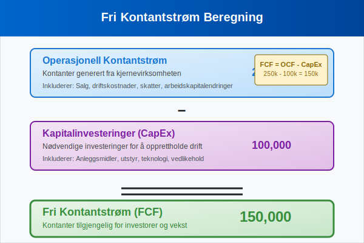

**Kontantstrømanalyse** er en av de mest kritiske finansielle analyseteknikkene for å forstå en bedrifts reelle økonomiske helse og likviditet. Mens [resultatregnskapet](/blogs/regnskap/hva-er-regnskap "Hva er Regnskap? En Dybdeanalyse for Norge") viser lønnsomhet, avslører kontantstrømanalysen hvordan kontanter faktisk strømmer inn og ut av virksomheten.

I motsetning til regnskapsmessig resultat, som kan påvirkes av periodiseringer og regnskapsmessige vurderinger, gir kontantstrømanalysen et objektivt bilde av bedriftens evne til å generere kontanter og oppfylle sine finansielle forpliktelser. For å forstå sammenhengen mellom kontantstrøm og andre finansielle rapporter, er det viktig å ha god kjennskap til [finansregnskap](/blogs/regnskap/hva-er-finansregnskap "Hva er Finansregnskap? En Komplett Guide til Ekstern Finansiell Rapportering") generelt.


## Seksjon 1: Grunnleggende Prinsipper for Kontantstrømanalyse

### 1.1 Hva er Kontantstrøm?

[**Kontantstrøm**](/blogs/regnskap/hva-er-kontantstrom "Hva er Kontantstrøm? Komplett Guide til Cash Flow Analyse og Styring") refererer til bevegelsen av kontanter inn og ut av en virksomhet over en bestemt periode. Det skilles mellom tre hovedkategorier av kontantstrøm:

* **Operasjonell kontantstrøm:** Kontanter generert fra kjernevirksomheten
* **Investeringskontantstrøm:** Kontanter brukt på eller generert fra investeringer
* **Finansieringskontantstrøm:** Kontanter fra eller til eiere og kreditorer


### 1.2 Forskjellen mellom Kontantstrøm og Resultat

En av de viktigste innsiktene i kontantstrømanalyse er å forstå hvorfor **kontantstrøm** og **regnskapsmessig resultat** kan være svært forskjellige:

| Aspekt | Regnskapsmessig Resultat | Kontantstrøm |
|--------|-------------------------|--------------|
| **Periodisering** | Følger periodiseringsprinsippet | Kun faktiske kontantbevegelser |
| **Avskrivninger** | Inkluderer [avskrivninger](/blogs/regnskap/hva-er-avskrivning "Hva er Avskrivning? Komplett Guide til Avskrivningsmetoder") | Ekskluderer ikke-kontante poster |
| **Kundefordringer** | Inntekt ved salg | Kontant ved betaling |
| **Leverandørgjeld** | Kostnad ved kjøp | Kontant ved betaling |
| **Timing** | Når transaksjonen skjer | Når kontantene utveksles |

## Seksjon 2: Kontantstrømoppstillingen

### 2.1 Struktur og Komponenter

Kontantstrømoppstillingen er en av de tre hovedkomponentene i [finansregnskapet](/blogs/regnskap/hva-er-finansregnskap "Hva er Finansregnskap? En Komplett Guide til Ekstern Finansiell Rapportering"), sammen med resultatregnskapet og [balansen](/blogs/regnskap/hva-er-balanse "Hva er Balanse i Regnskap? Komplett Guide til Balansens Oppbygging og Funksjon").


#### Operasjonell Kontantstrøm

Den operasjonelle kontantstrømmen viser hvor mye kontanter virksomheten genererer fra sin kjernevirksomhet. Dette inkluderer:

* **Kontantinntekter** fra salg av varer og tjenester
* **Kontantutbetalinger** til leverandører og ansatte
* **Rentebetalinger** og **skattebetalinger**
* Endringer i [arbeidskapital](/blogs/regnskap/hva-er-arbeidskapital "Hva er Arbeidskapital? En Komplett Guide til Working Capital")

#### Investeringskontantstrøm

Investeringskontantstrømmen reflekterer virksomhetens investeringer i langsiktige eiendeler:

* Kjøp og salg av [anleggsmidler](/blogs/regnskap/hva-er-anleggsmidler "Hva er Anleggsmidler? Komplett Guide til Varige Driftsmidler")
* Investeringer i andre selskaper
* Utlån og innkreving av lån til andre

#### Finansieringskontantstrøm

Finansieringskontantstrømmen viser hvordan virksomheten finansierer sin drift og vekst:

* Utstedelse og tilbakebetaling av gjeld
* Egenkapitaltilførsel og utbyttebetalinger
* Endringer i [egenkapital](/blogs/regnskap/hva-er-egenkapital "Hva er Egenkapital? Komplett Guide til Egenkapital i Regnskap")

### 2.2 Direkte vs. Indirekte Metode

Det finnes to hovedmetoder for å presentere operasjonell kontantstrøm:


#### Direkte Metode

Den **direkte metoden** viser faktiske kontantinnbetalinger og -utbetalinger:

```
Kontantinnbetalinger fra kunder          1,500,000
Kontantutbetalinger til leverandører      (800,000)
Kontantutbetalinger til ansatte           (400,000)
Rentebetalinger                           (50,000)
Skattebetalinger                          (100,000)
Netto operasjonell kontantstrøm           150,000
```

#### Indirekte Metode

Den **indirekte metoden** starter med nettoresultatet og justerer for ikke-kontante poster:

```
Nettoresultat                             200,000
Avskrivninger                             100,000
Økning i kundefordringer                  (80,000)
Økning i varelager                        (50,000)
Økning i leverandørgjeld                   30,000
Reduksjon i påløpte kostnader             (50,000)
Netto operasjonell kontantstrøm           150,000
```

## Seksjon 3: Nøkkeltall og Analyseteknikker

### 3.1 Viktige Kontantstrømnøkkeltall

Effektiv kontantstrømanalyse krever bruk av relevante nøkkeltall for å vurdere bedriftens finansielle helse:

| Nøkkeltall | Formel | Hva det måler |
|------------|--------|---------------|
| **Operasjonell kontantstrømmargin** | Operasjonell kontantstrøm / Omsetning | Hvor mye kontant hver krone i salg genererer |
| **Kontantstrøm per aksje** | Operasjonell kontantstrøm / Antall aksjer | Kontantgenerering per aksje |
| **Kontantstrømdekning** | Operasjonell kontantstrøm / Totale forpliktelser | Evne til å dekke gjeld med kontantstrøm |
| **Reinvesteringsrate** | Investeringskontantstrøm / Operasjonell kontantstrøm | Hvor mye av kontantstrømmen som reinvesteres |

### 3.2 Kontantstrømanalyse og Likviditet

**Likviditetsanalyse** er en kritisk del av kontantstrømanalysen. Den vurderer bedriftens evne til å møte kortsiktige forpliktelser. For systematisk planlegging av likviditet og kontantstrømmer, er [likviditetsbudsjett](/blogs/regnskap/likviditetsbudsjett "Hva er Likviditetsbudsjett? Komplett Guide til Kontantstrømplanlegging") et uunnværlig verktøy som komplementerer kontantstrømanalysen:


#### Kontantkonverteringssyklus

**Kontantkonverteringssyklusen** måler hvor lang tid det tar å konvertere investeringer i varelager og kundefordringer tilbake til kontanter:

```
Kontantkonverteringssyklus = 
  Dager i varelager + 
  Dager i kundefordringer - 
  Dager i leverandørgjeld
```

* **Kortere syklus** = Bedre kontantstrøm og likviditet
* **Lengre syklus** = Mer [arbeidskapital](/blogs/regnskap/hva-er-arbeidskapital "Hva er Arbeidskapital? En Komplett Guide til Working Capital") bundet opp

### 3.3 Kvalitativ Kontantstrømanalyse

Utover kvantitative mål, er det viktig å vurdere **kvaliteten** på kontantstrømmen:

#### Kjennetegn på Høy Kvalitet Kontantstrøm:

* **Konsistent** operasjonell kontantstrøm over tid
* **Forutsigbar** og **stabil** kontantgenerering
* **Lav avhengighet** av eksterne finansieringskilder
* **Positiv trend** i operasjonell kontantstrøm

#### Advarselstegn:

* Operasjonell kontantstrøm som er **lavere** enn nettoresultat over tid
* **Økende avhengighet** av ekstern finansiering
* **Volatile** eller **uforutsigbare** kontantstrømmer
* **Negativ** operasjonell kontantstrøm i flere perioder

## Seksjon 4: Praktisk Anvendelse i Norsk Næringsliv

### 4.1 Sektorspesifikke Betraktninger

Ulike bransjer har forskjellige kontantstrømmønstre som må tas i betraktning:

#### Detaljhandel

* **Sesongvariasjoner** i kontantstrøm
* Viktighet av [varelager](/blogs/regnskap/hva-er-varelager "Hva er Varelager? Komplett Guide til Lagerregnskapet") og omløpshastighet
* Kort kontantkonverteringssyklus

#### Produksjon

* **Lengre** kontantkonverteringssyklus
* Betydelige investeringer i [anleggsmidler](/blogs/regnskap/hva-er-anleggsmidler "Hva er Anleggsmidler? Komplett Guide til Varige Driftsmidler")
* Viktighet av [arbeidskapital](/blogs/regnskap/hva-er-arbeidskapital "Hva er Arbeidskapital? En Komplett Guide til Working Capital")-styring

#### Tjenesteyting

* **Lavere** investeringsbehov
* Fokus på kundefordringer og faktureringsrutiner
* Betydning av [fakturagebyr](/blogs/regnskap/hva-er-fakturagebyr "Hva er Fakturagebyr? Regler, Beregning og Regnskapsføring") og betalingsbetingelser

### 4.2 Kontantstrømanalyse for Små og Mellomstore Bedrifter

For **SMB-segmentet** er kontantstrømanalyse spesielt kritisk på grunn av:

* **Begrenset** tilgang til ekstern finansiering
* **Høyere sårbarhet** for kontantstrømproblemer
* Viktighet av **proaktiv** kontantstrømstyring


#### Praktiske Tips for SMB:

* **Ukentlig** kontantstrømprognose
* **Aktiv** oppfølging av [kundefordringer](/blogs/regnskap/hva-er-kundefordringer "Hva er Kundefordringer? Komplett Guide til Fordringer og Innkreving")
* **Forhandling** av betalingsbetingelser med leverandører
* **Etablering** av kredittlinjer før de trengs

### 4.3 Digitalisering og Kontantstrømanalyse

Moderne teknologi har revolusjonert kontantstrømanalyse:

#### Automatisering og Integrasjon

* **[ERP-systemer](/blogs/regnskap/hva-er-erp-system "Hva er ERP-system? Komplett Guide til Enterprise Resource Planning")** for sanntids kontantstrømdata
* **[API-integrasjoner](/blogs/regnskap/api-integrasjon-automatisering-regnskap "API-integrasjon og Automatisering i Regnskap - En Komplett Guide")** mellom bank og regnskapssystem
* **Automatisk** kategorisering av transaksjoner

#### Prediktiv Analyse

* **Maskinlæring** for kontantstrømprognose
* **Scenarioanalyse** og stresstesting
* **Sanntids** dashboards og rapportering

## Seksjon 5: Kontantstrømprognose og Planlegging

### 5.1 Kortsiktig Kontantstrømprognose

**Kortsiktig prognose** (1-13 uker) fokuserer på operasjonelle kontantstrømmer. For systematisk planlegging av kortsiktige kontantstrømmer og likviditetsstyring, er [likviditetsbudsjett](/blogs/regnskap/likviditetsbudsjett "Hva er Likviditetsbudsjett? Komplett Guide til Kontantstrømplanlegging") et essensielt verktøy som gir detaljert oversikt over inn- og utbetalinger:


#### Komponenter i Kortsiktig Prognose:

* **Forventede innbetalinger** fra kunder
* **Planlagte utbetalinger** til leverandører
* **Lønnsutbetalinger** og andre faste kostnader
* **Skatte- og avgiftsbetalinger**, inkludert [MVA](/blogs/regnskap/hva-er-mva "Hva er MVA? Komplett Guide til Merverdiavgift i Norge")

### 5.2 Langsiktig Kontantstrømprognose

**Langsiktig prognose** (1-5 år) inkluderer strategiske investeringer og finansieringsbeslutninger:

#### Strategiske Elementer:

* **Kapitalinvesteringer** og ekspansjon
* **Finansieringsstruktur** og gjeldskapasitet
* **Utbyttepolitikk** og egenkapitalavkastning
* **Scenarioanalyse** for ulike markedsforhold

### 5.3 Kontantstrømstyring og Optimalisering

Effektiv kontantstrømstyring krever **proaktive** strategier:

#### Innbetalingsoptimalisering:

* **Raskere fakturering** og oppfølging
* **Insentiver** for tidlig betaling
* **[Factoring](/blogs/regnskap/hva-er-factoring "Hva er Factoring? Komplett Guide til Factoringtjenester")** av kundefordringer
* **Elektronisk fakturering** og [eFaktura](/blogs/regnskap/hva-er-efaktura "Hva er eFaktura? Komplett Guide til Elektronisk Fakturering")

#### Utbetalingsoptimalisering:

* **Forhandling** av betalingsbetingelser
* **Strategisk timing** av store utbetalinger
* **Utnyttelse** av leverandørkreditt
* **Kontantrabatter** vs. betalingsutsettelse

## Seksjon 6: Kontantstrømanalyse i Investeringsbeslutninger

### 6.1 Netto Nåverdi (NPV) og Kontantstrøm

**Netto nåverdi** er en fundamental metode for å evaluere investeringsprosjekter basert på fremtidige kontantstrømmer:

```
NPV = Σ (Kontantstrøm_t / (1 + r)^t) - Initial investering
```

Hvor:
* **r** = Diskonteringsrente
* **t** = Tidsperiode


### 6.2 Internrente (IRR) og Kontantstrømanalyse

**Internrenten** er diskonteringsrenten som gjør NPV lik null:

* **IRR > Avkastningskrav** = Lønnsom investering
* **IRR < Avkastningskrav** = Ulønnsom investering

### 6.3 Sensitivitetsanalyse

**Sensitivitetsanalyse** vurderer hvordan endringer i nøkkelvariabler påvirker kontantstrøm:

| Variabel | Optimistisk | Realistisk | Pessimistisk |
|----------|-------------|------------|--------------|
| **Omsetningsvekst** | +15% | +10% | +5% |
| **Marginer** | 25% | 20% | 15% |
| **Investeringskost** | -10% | Budsjett | +20% |

## Seksjon 7: Regulatoriske Aspekter og Rapportering

### 7.1 Norske Regnskapsstandarder

I Norge følger kontantstrømrapportering **[God regnskapsskikk](/blogs/regnskap/god-regnskapsskikk "God Regnskapsskikk - Prinsipper, Standarder og Beste Praksis i Norge")** og internasjonale standarder:

* **NRS 7** - Kontantstrømoppstilling
* **IAS 7** - Statement of Cash Flows (for IFRS-rapporterende selskaper)

### 7.2 Krav til Kontantstrømoppstilling

#### Små Foretak:

* **Frivillig** kontantstrømoppstilling
* **Forenklet** presentasjon tillatt

#### Store Foretak:

* **Obligatorisk** kontantstrømoppstilling
* **Detaljert** presentasjon kreves
* **Noteopplysninger** om kontantstrøm

### 7.3 Revisorens Rolle

**Revisjon** av kontantstrømoppstillingen inkluderer:

* **Verifisering** av kontantbevegelser
* **Konsistenssjekk** med andre finansielle rapporter
* **Vurdering** av klassifisering av kontantstrømmer

## Seksjon 8: Avanserte Analyseteknikker

### 8.1 Fri Kontantstrøm (Free Cash Flow)

**Fri kontantstrøm** måler kontanter tilgjengelig for investorer etter nødvendige investeringer:

```
Fri kontantstrøm = 
  Operasjonell kontantstrøm - 
  Kapitalinvesteringer
```



### 8.2 Kontantstrøm til Egenkapital vs. Firma

#### Kontantstrøm til Egenkapital (FCFE):
```
FCFE = Fri kontantstrøm - Netto gjeldsendring
```

#### Kontantstrøm til Firma (FCFF):
```
FCFF = EBIT(1-T) + Avskrivninger - Kapitalinvesteringer - Endring i arbeidskapital
```

### 8.3 Verdsettelse Basert på Kontantstrøm

**Discounted Cash Flow (DCF)** modeller bruker fremtidige kontantstrømmer for verdsettelse:

#### Gordon Growth Model:
```
Verdi = FCF‚ / (r - g)
```

Hvor:
* **FCF‚** = Neste års fri kontantstrøm
* **r** = Avkastningskrav
* **g** = Evig vekstrate

## Konklusjon

**Kontantstrømanalyse** er et uunnværlig verktøy for å forstå en bedrifts reelle finansielle helse og ta informerte forretningsbeslutninger. Ved å kombinere kvantitative analyser med kvalitative vurderinger, kan ledere og investorer få verdifull innsikt i:

* **Likviditet** og kortsiktig finansiell stabilitet
* **Lønnsomhet** og operasjonell effektivitet
* **Investeringsmuligheter** og kapitalallokering
* **Finansieringsstrategier** og gjeldskapasitet

I dagens digitale økonomi blir kontantstrømanalyse stadig mer sofistikert, med **sanntidsdata**, **prediktive modeller** og **automatiserte prognoser** som gir bedrifter konkurransefortrinn gjennom bedre finansiell styring.

For å opprettholde en sunn kontantstrøm er det essensielt å ha god kontroll over alle aspekter av [finansregnskapet](/blogs/regnskap/hva-er-finansregnskap "Hva er Finansregnskap? En Komplett Guide til Ekstern Finansiell Rapportering"), inkludert effektiv [arbeidskapital](/blogs/regnskap/hva-er-arbeidskapital "Hva er Arbeidskapital? En Komplett Guide til Working Capital")-styring og strategisk planlegging av investeringer og finansiering.


