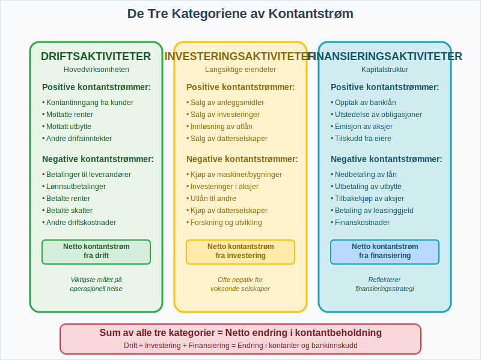
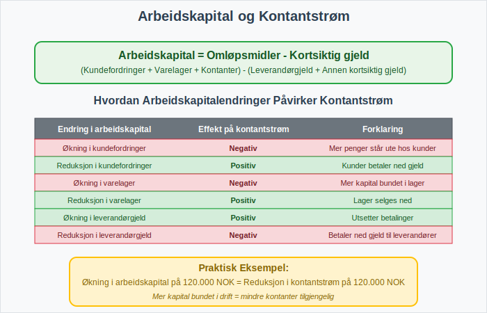

**Kontantstrømoppstillingen** er en av de tre hovedkomponentene i finansregnskapet og gir et detaljert bilde av hvordan kontanter strømmer inn og ut av en virksomhet over en bestemt periode. Mens [resultatregnskapet](/blogs/regnskap/hva-er-driftsregnskap "Hva er Driftsregnskap? Komplett Guide til Driftsregnskapet i Norge") viser lønnsomhet og [balansen](/blogs/regnskap/hva-er-balanse "Hva er Balanse i Regnskap? Komplett Guide til Balansens Oppbygging og Funksjon") viser finansiell stilling, avslører kontantstrømoppstillingen den faktiske kontantbevegelsen som er avgjørende for virksomhetens likviditet og overlevelse.

For å forstå kontantstrømoppstillingens rolle i det større [finansregnskapet](/blogs/regnskap/hva-er-finansregnskap "Hva er Finansregnskap? En Komplett Guide til Ekstern Finansiell Rapportering"), er det viktig å se hvordan den kompletterer de andre finansielle rapportene og gir interessenter et helhetlig bilde av virksomhetens økonomiske helse.

For mer informasjon om bevegelsen av kontanter i en virksomhet, se [Hva er kontantstrøm?](/blogs/regnskap/hva-er-kontantstrom "Hva er Kontantstrøm? Komplett Guide til Cash Flow Analyse og Styring").

## Seksjon 1: Kontantstrømoppstillingens Grunnleggende Konsept

### 1.1 Forskjellen mellom Resultat og Kontantstrøm

En av de viktigste innsiktene fra kontantstrømoppstillingen er forskjellen mellom **regnskapsmessig resultat** og **faktisk kontantstrøm**. En virksomhet kan vise overskudd i resultatregnskapet, men likevel ha negativ kontantstrøm på grunn av:

* **Periodiseringsprinsippet:** [Inntekter](/blogs/regnskap/hva-er-inntekter "Hva er Inntekter? Komplett Guide til Inntektstyper og Regnskapsføring") bokføres når de opptjenes, ikke når kontantene mottas
* **Kreditsalg:** Salg til [debitorer](/blogs/regnskap/hva-er-debitor "Hva er Debitor i Regnskap? Komplett Guide til Kundefordringer og Debitorhåndtering") som ennå ikke har betalt
* **Ikke-kontante kostnader:** Som [avskrivninger](/blogs/regnskap/hva-er-avskrivning "Hva er Avskrivning? Komplett Guide til Avskrivningsmetoder og Regnskapsføring") og [amortisering](/blogs/regnskap/hva-er-amortisering "Hva er Amortisering? En Komplett Guide til Avskrivninger")

### 1.2 Kontantstrømoppstillingens Betydning

Kontantstrømoppstillingen er kritisk for:

* **Likviditetsvurdering:** Viser virksomhetens evne til å møte kortsiktige forpliktelser
* **Investeringsbeslutninger:** Hjelper investorer å vurdere kvaliteten på inntjeningen
* **Kredittvurdering:** Banker bruker den til å vurdere lånekapasitet
* **Strategisk planlegging:** Ledelsen kan planlegge fremtidige kontantbehov

## Seksjon 2: De Tre Hovedkategoriene av Kontantstrøm

Kontantstrømoppstillingen deles inn i tre hovedkategorier som hver representerer ulike aspekter av virksomhetens aktiviteter:

### 2.1 Kontantstrøm fra Driftsaktiviteter

Dette er kjernen i kontantstrømoppstillingen og viser kontantstrømmen fra virksomhetens hovedaktiviteter:

#### Positive Kontantstrømmer fra Drift:
* Kontantinngang fra kunder
* Mottatte renter og utbytte
* Andre driftsinntekter

#### Negative Kontantstrømmer fra Drift:
* Betalinger til leverandører
* Lønnsutbetalinger til ansatte
* Betalte renter
* Betalte skatter

**Eksempel på beregning av driftskontantstrøm:**

| **Driftsaktiviteter** | **Beløp (NOK)** |
|----------------------|-----------------|
| Årets resultat | 500.000 |
| **Justeringer for ikke-kontante poster:** | |
| + Avskrivninger | 200.000 |
| + Tap ved salg av anleggsmidler | 50.000 |
| **Endringer i arbeidskapital:** | |
| - Økning i kundefordringer | (150.000) |
| - Økning i varelager | (100.000) |
| + Økning i leverandørgjeld | 80.000 |
| **Netto kontantstrøm fra drift** | **580.000** |

### 2.2 Kontantstrøm fra Investeringsaktiviteter

Denne kategorien viser kontantstrømmer knyttet til kjøp og salg av langsiktige [eiendeler](/blogs/regnskap/hva-er-eiendel "Hva er Eiendel i Regnskap? Komplett Guide til Eiendom og Verdier"):

#### Positive Kontantstrømmer fra Investering:
* Salg av [anleggsmidler](/blogs/regnskap/hva-er-anleggsmidler "Hva er Anleggsmidler? Komplett Guide til Faste Eiendeler")
* Salg av investeringer i andre selskaper
* Innløsning av langsiktige investeringer

#### Negative Kontantstrømmer fra Investering:
* Kjøp av maskiner, bygninger og utstyr
* Investeringer i andre selskaper
* Utlån til andre parter

**Eksempel på investeringskontantstrøm:**

| **Investeringsaktiviteter** | **Beløp (NOK)** |
|----------------------------|-----------------|
| Kjøp av maskiner og utstyr | (800.000) |
| Salg av gamle maskiner | 150.000 |
| Investering i datterselskap | (300.000) |
| **Netto kontantstrøm fra investering** | **(950.000)** |

### 2.3 Kontantstrøm fra Finansieringsaktiviteter

Denne kategorien viser hvordan virksomheten finansierer sine aktiviteter:

#### Positive Kontantstrømmer fra Finansiering:
* Opptak av lån
* Emisjon av [aksjer](/blogs/regnskap/hva-er-en-aksje "Hva er en Aksje? Komplett Guide til Aksjer, Rettigheter og Verdivurdering")
* Tilskudd fra eiere

#### Negative Kontantstrømmer fra Finansiering:
* Nedbetaling av lån
* Utbetaling av utbytte
* Tilbakekjøp av egne aksjer

**Eksempel på finansieringskontantstrøm:**

| **Finansieringsaktiviteter** | **Beløp (NOK)** |
|-----------------------------|-----------------|
| Opptak av banklån | 1.000.000 |
| Nedbetaling av eksisterende lån | (400.000) |
| Utbetalt utbytte til aksjonærer | (200.000) |
| **Netto kontantstrøm fra finansiering** | **400.000** |

## Seksjon 3: Metoder for Utarbeidelse

Det finnes to hovedmetoder for å utarbeide kontantstrømoppstillingen:

### 3.1 Den Direkte Metoden

Den direkte metoden viser de faktiske kontantinnbetalingene og -utbetalingene:

**Fordeler:**
* Gir mer detaljert informasjon om kontantstrømmene
* Lettere å forstå for ikke-regnskapsfolk
* Anbefales av internasjonale regnskapsstandarder

**Ulemper:**
* Krever mer detaljert sporing av kontanttransaksjoner
* Kan være kostbart å implementere

**Eksempel på direkte metode:**

| **Kontantstrøm fra driftsaktiviteter** | **Beløp (NOK)** |
|---------------------------------------|-----------------|
| Kontantinngang fra kunder | 2.500.000 |
| Kontantutgang til leverandører | (1.200.000) |
| Kontantutgang til ansatte (lønn) | (800.000) |
| Betalte renter | (50.000) |
| Betalte skatter | (150.000) |
| **Netto kontantstrøm fra drift** | **300.000** |

### 3.2 Den Indirekte Metoden

Den indirekte metoden starter med årets resultat og justerer for ikke-kontante poster:

**Fordeler:**
* Enklere å utarbeide med eksisterende regnskapsdata
* Viser sammenhengen mellom resultat og kontantstrøm
* Mest brukte metoden i praksis

**Ulemper:**
* Mindre detaljert informasjon om faktiske kontantstrømmer
* Kan være vanskeligere å forstå

## Seksjon 4: Arbeidskapitalens Rolle

**[Arbeidskapital](/blogs/regnskap/hva-er-arbeidskapital "Hva er Arbeidskapital? En Komplett Guide til Working Capital")** (omløpsmidler minus kortsiktig gjeld) spiller en kritisk rolle i kontantstrømoppstillingen. Endringer i arbeidskapital påvirker direkte kontantstrømmen fra drift:

### 4.1 Hvordan Arbeidskapitalendringer Påvirker Kontantstrøm

| **Endring i arbeidskapital** | **Effekt på kontantstrøm** | **Forklaring** |
|------------------------------|----------------------------|----------------|
| Økning i kundefordringer | Negativ | Mer penger står ute hos kunder |
| Reduksjon i kundefordringer | Positiv | Kunder betaler ned gjeld |
| Økning i varelager | Negativ | Mer kapital bundet i lager |
| Reduksjon i varelager | Positiv | Lager selges ned |
| Økning i leverandørgjeld | Positiv | Utsetter betalinger til leverandører |
| Reduksjon i leverandørgjeld | Negativ | Betaler ned gjeld til leverandører |

### 4.2 Praktisk Eksempel på Arbeidskapitalberegning

La oss se på hvordan endringer i arbeidskapital beregnes:

**År 1:**
* Kundefordringer: 500.000 NOK
* Varelager: 300.000 NOK
* Leverandørgjeld: 200.000 NOK
* Arbeidskapital: (500.000 + 300.000) - 200.000 = 600.000 NOK

**År 2:**
* Kundefordringer: 650.000 NOK
* Varelager: 350.000 NOK
* Leverandørgjeld: 280.000 NOK
* Arbeidskapital: (650.000 + 350.000) - 280.000 = 720.000 NOK

**Endring i arbeidskapital:** 720.000 - 600.000 = 120.000 NOK økning

Denne økningen på 120.000 NOK reduserer kontantstrømmen fra drift med samme beløp.

## Seksjon 5: Analyse og Tolkning

### 5.1 Nøkkeltall for Kontantstrømanalyse

Flere viktige nøkkeltall kan beregnes fra kontantstrømoppstillingen:

| **Nøkkeltall** | **Formel** | **Hva det måler** |
|----------------|------------|-------------------|
| **Operasjonell kontantstrømmargin** | Driftskontantstrøm / [Driftsinntekter](/blogs/regnskap/hva-er-driftsinntekter "Hva er Driftsinntekter? Komplett Guide til Driftsinntekter og Regnskapsføring") | Hvor mye kontant hver krone i salg genererer |
| **Kontantstrøm per aksje** | Driftskontantstrøm / Antall aksjer | Kontantgenerering per aksje |
| **Kontantstrømdekning** | Driftskontantstrøm / Totale investeringer | Evne til å finansiere investeringer |
| **Gjeldsdekning** | Driftskontantstrøm / Total gjeld | Evne til å betjene gjeld |

### 5.2 Tolkning av Kontantstrømmønstre

Ulike kombinasjoner av kontantstrøm fra de tre aktivitetskategoriene forteller forskjellige historier:

#### Voksende Selskap:
* **Drift:** Positiv og økende
* **Investering:** Negativ (investerer i vekst)
* **Finansiering:** Positiv (henter kapital)

#### Modent Selskap:
* **Drift:** Sterk positiv
* **Investering:** Moderat negativ (vedlikeholdsinvesteringer)
* **Finansiering:** Negativ (betaler utbytte og nedbetaler gjeld)

#### Selskap i Krise:
* **Drift:** Negativ eller svak positiv
* **Investering:** Positiv (selger eiendeler)
* **Finansiering:** Positiv (henter nødkapital)

## Seksjon 6: Kontantstrømoppstilling i Norsk Kontekst

### 6.1 Regnskapsstandarder og Krav

I Norge følger kontantstrømoppstillingen kravene i:

* **[God regnskapsskikk](/blogs/regnskap/god-regnskapsskikk "God Regnskapsskikk - Prinsipper, Standarder og Beste Praksis i Norge")** for mindre foretak
* **[IFRS](/blogs/regnskap/hva-er-ifrs "Hva er IFRS? Komplett Guide til International Financial Reporting Standards")** for børsnoterte selskaper
* **Regnskapslovens** bestemmelser

### 6.2 Særlige Norske Forhold

Norske virksomheter må ta hensyn til spesielle forhold som påvirker kontantstrømmen:

* **MVA-behandling:** [Merverdiavgift](/blogs/regnskap/hva-er-avgiftsplikt-mva "Hva er Avgiftsplikt (MVA)? Komplett Guide til Merverdiavgift i Norge") påvirker kontantstrømmen annerledes enn inntekter og kostnader
* **Forskuddsskatt:** Betalinger av [forskuddstrekk](/blogs/regnskap/hva-er-forskuddstrekk "Hva er Forskuddstrekk? Komplett Guide til Forskuddstrekk av Skatt") påvirker kontantstrømmen
* **Feriepenger:** [Feriepenger](/blogs/regnskap/hva-er-feriepenger "Hva er Feriepenger? Beregning, Regnskapsføring og Arbeidsgivers Plikter") skaper tidsmessige forskjeller mellom kostnad og kontantutgang

### 6.3 Integrasjon med Andre Rapporter

Kontantstrømoppstillingen må stemme overens med andre deler av [finansregnskapet](/blogs/regnskap/hva-er-finansregnskap "Hva er Finansregnskap? En Komplett Guide til Ekstern Finansiell Rapportering"):

* **Åpningsbalanse kontanter** + **Netto kontantstrøm** = **Sluttbalanse kontanter**
* Endringer i [balansen](/blogs/regnskap/hva-er-balanse "Hva er Balanse i Regnskap? Komplett Guide til Balansens Oppbygging og Funksjon") må forklares gjennom kontantstrømoppstillingen

## Seksjon 7: Praktiske Tips og Beste Praksis

### 7.1 Vanlige Feil og Hvordan Unngå Dem

| **Vanlig Feil** | **Konsekvens** | **Løsning** |
|-----------------|----------------|-------------|
| Glemme ikke-kontante poster | Feil driftskontantstrøm | Systematisk gjennomgang av alle justeringer |
| Feilklassifisering av aktiviteter | Misvisende analyse | Klar forståelse av definisjonene |
| Ignorere arbeidskapitalendringer | Unøyaktig kontantstrøm | Detaljert sporing av alle omløpsmidler og kortsiktig gjeld |

### 7.2 Verktøy for Kontantstrømplanlegging

Moderne virksomheter bruker ulike verktøy for å planlegge og overvåke kontantstrøm:

* **Kontantstrømbudsjetter:** Fremtidsrettede prognoser
* **Rullende prognoser:** Kontinuerlig oppdaterte estimater
* **Scenario-analyse:** Vurdering av ulike utfall

### 7.3 Digitalisering og Automatisering

Moderne [ERP-systemer](/blogs/regnskap/hva-er-erp-system "Hva er ERP-system? Komplett Guide til Enterprise Resource Planning") og [fintech](/blogs/regnskap/hva-er-fintech "Hva er Fintech? Komplett Guide til Finansteknologi og Påvirkning på Regnskap")-løsninger kan automatisere mye av kontantstrømrapporteringen:

* **Automatisk kategorisering** av transaksjoner
* **Sanntids kontantstrømovervåking**
* **Integrerte prognoseverktøy**

## Seksjon 8: Kontantstrømoppstilling for Ulike Virksomhetstyper

### 8.1 Produksjonsselskaper

Produksjonsselskaper har spesielle utfordringer:

* **Store investeringer** i maskiner og utstyr
* **Kompleks arbeidskapitalstyring** med råvarer, produksjon i gang og ferdigvarer
* **Sesongvariasjoner** i kontantstrøm

### 8.2 Tjenesteselskaper

Tjenesteselskaper har typisk:

* **Lavere investeringsbehov** i fysiske eiendeler
* **Høyere andel lønnskostnader**
* **Mer forutsigbar kontantstrøm** fra drift

### 8.3 Handelsselskaper

For handelsselskaper er viktige faktorer:

* **Varelagerstyring** som kritisk faktor
* **Kredittid til kunder** som påvirker kontantstrøm
* **Sesongmessige svingninger**

## Seksjon 9: Fremtidige Trender og Utvikling

### 9.1 Økt Fokus på Kontantstrømkvalitet

Investorer og analytikere fokuserer stadig mer på:

* **Bærekraftig kontantstrøm** fra kjernevirksomheten
* **Kvaliteten på inntjeningen** målt gjennom kontantstrøm
* **Langsiktig kontantgenereringsevne**

### 9.2 Teknologiske Innovasjoner

Nye teknologier påvirker kontantstrømrapportering:

* **Kunstig intelligens** for prognoser
* **Blockchain** for transparens
* **Sanntidsrapportering** gjennom skybaserte løsninger

### 9.3 Regulatoriske Endringer

Fremtidige endringer kan inkludere:

* **Strengere krav** til kontantstrømrapportering
* **Standardisering** av rapporteringsformater
* **Økt fokus** på bærekraftsrelaterte kontantstrømmer

## Konklusjon

Kontantstrømoppstillingen er et uunnværlig verktøy for å forstå en virksomhets finansielle helse og likviditet. Den gir innsikt som ikke kan oppnås gjennom resultatregnskapet eller balansen alene, og er kritisk for:

* **Ledelsens** strategiske beslutninger
* **Investorers** vurdering av investeringsmuligheter  
* **Kreditorers** risikovurdering
* **Regulatoriske** rapporteringskrav

Ved å mestre kontantstrømoppstillingen får interessenter et komplett bilde av virksomhetens økonomiske situasjon og fremtidsutsikter. For virksomheter som ønsker å optimalisere sin kontantstrømstyring, er det essensielt å forstå sammenhengen mellom [arbeidskapital](/blogs/regnskap/hva-er-arbeidskapital "Hva er Arbeidskapital? En Komplett Guide til Working Capital"), [driftskostnader](/blogs/regnskap/hva-er-driftskostnader "Hva er Driftskostnader? Typer, Beregning og Regnskapsføring - Komplett Guide") og langsiktige investeringsstrategier.

I en stadig mer kompleks forretningsverden blir kontantstrømoppstillingen et stadig viktigere verktøy for å navigere økonomiske utfordringer og muligheter.

