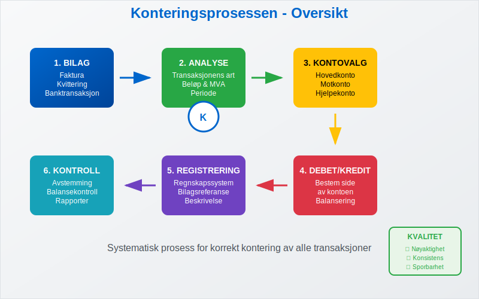
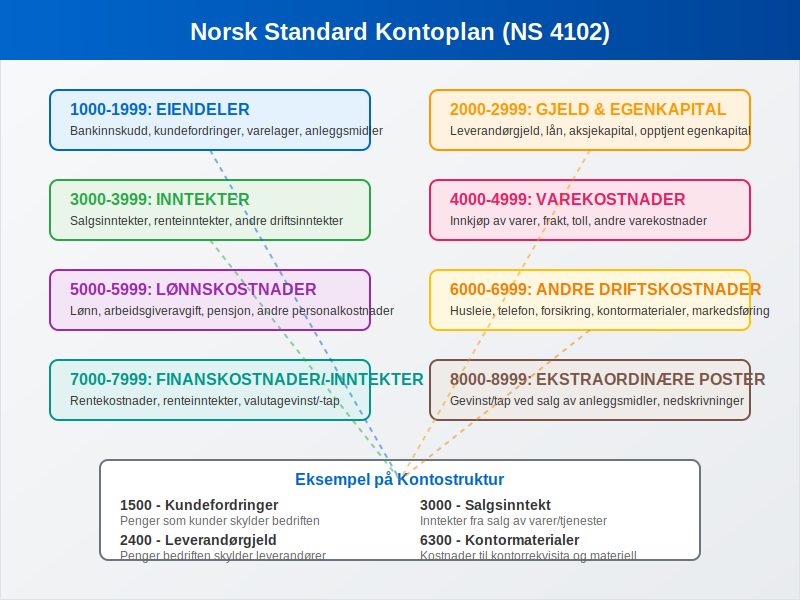
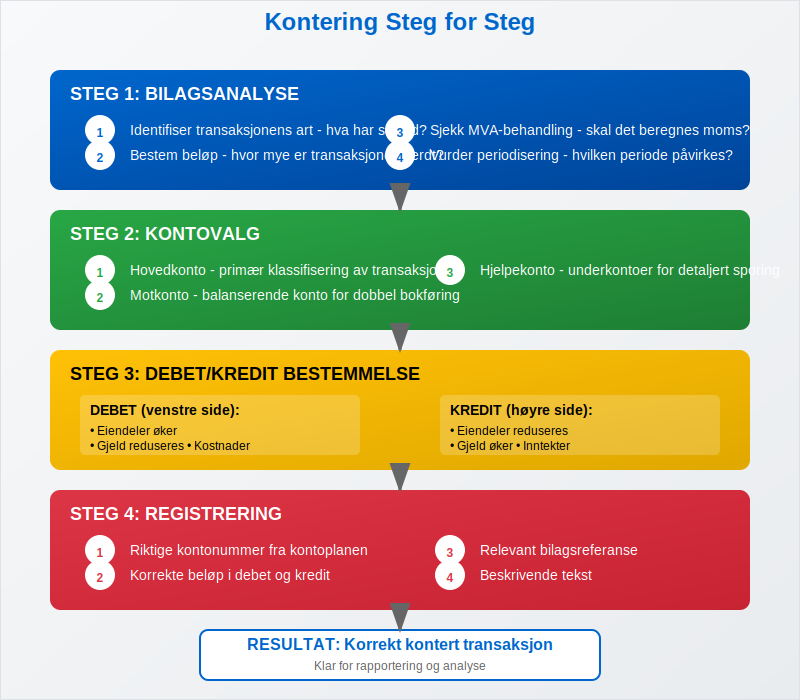
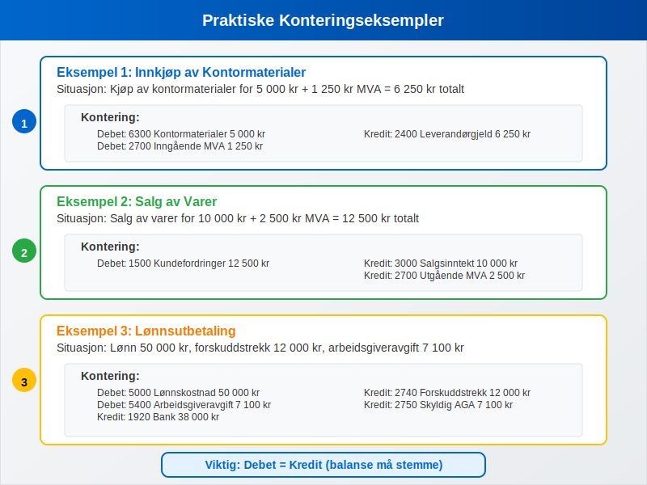
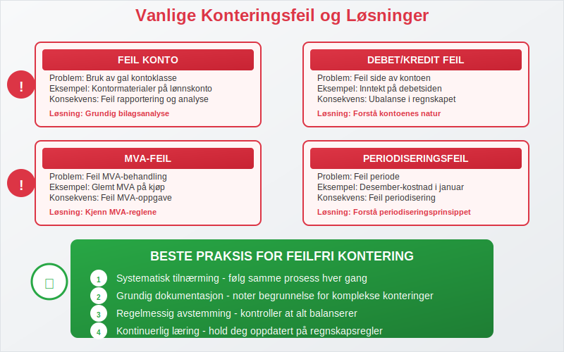
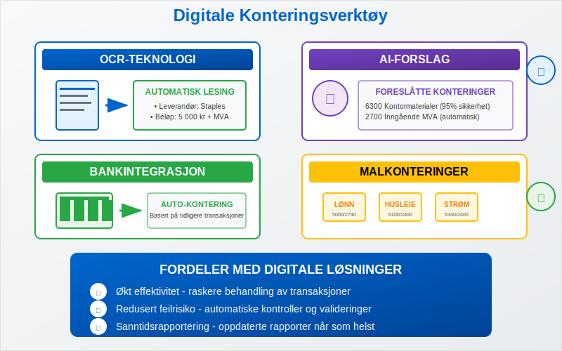
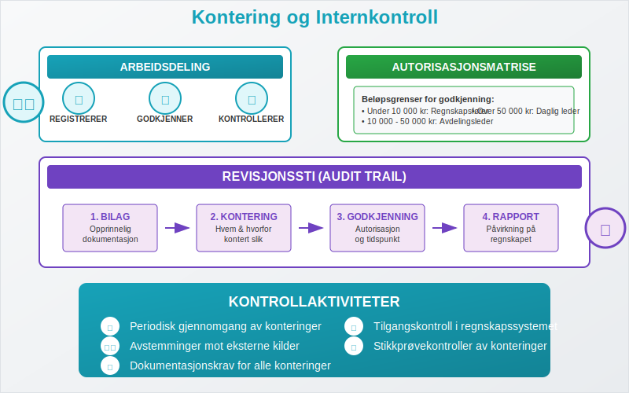
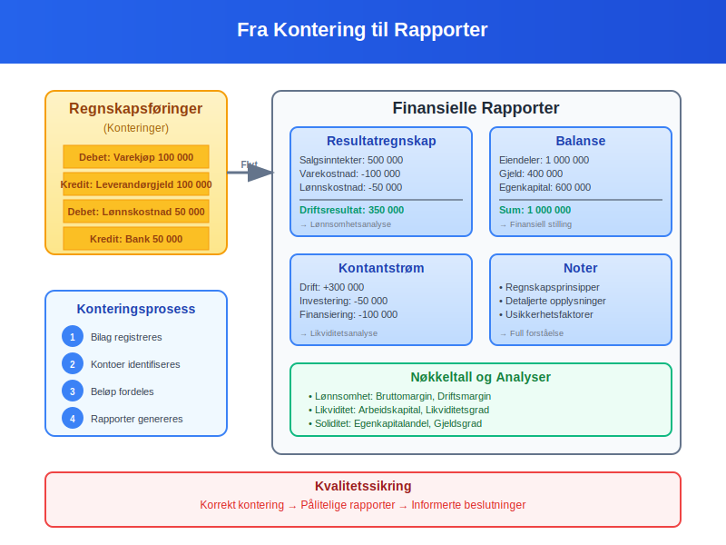
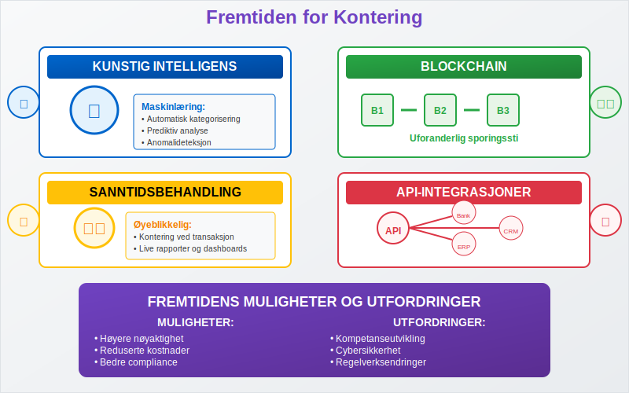

---
title: "Hva er kontering?"
meta_title: "Hva er kontering?"
meta_description: '**Kontering** er prosessen med å tildele riktige kontonummer til [bilag](/blogs/regnskap/hva-er-bilag "Hva er Bilag i Regnskap? En Komplett Guide til Regnskaps...'
slug: hva-er-kontering
type: blog
layout: pages/single
---

**Kontering** er prosessen med å tildele riktige kontonummer til [bilag](/blogs/regnskap/hva-er-bilag "Hva er Bilag i Regnskap? En Komplett Guide til Regnskapsdokumentasjon") og transaksjoner i [bokføringen](/blogs/regnskap/hva-er-bokforing "Hva er Bokføring? En Komplett Guide til Grunnleggende Regnskapsprinsipper"). Dette er en fundamental del av [regnskapet](/blogs/regnskap/hva-er-regnskap "Hva er Regnskap? En Komplett Guide til Regnskapsprinsipper og -praksis") som sikrer at alle forretningshendelser registreres på riktige kontoer i henhold til [kontoplanen](/blogs/regnskap/hva-er-hovedbok "Hva er Hovedbok? En Guide til Regnskapets Sentrale Register"). Korrekt kontering er avgjørende for å produsere pålitelige finansielle rapporter og overholde [bokføringsloven](/blogs/regnskap/hva-er-bokforingsloven "Hva er Bokføringsloven? Regler og Krav til Norsk Bokføring").

## Hva Betyr Kontering?

Kontering kommer fra det tyske ordet "Konto" og refererer til den systematiske prosessen med å klassifisere og kode finansielle transaksjoner. Hver transaksjon må **konters** - det vil si tildeles riktige kontonummer basert på transaksjonens art og innhold.



### Hovedformål med Kontering:

* **Systematisk organisering:** Sikrer at alle transaksjoner plasseres i riktige kategorier
* **Sporbarhet:** Gjør det mulig å følge transaksjoner fra [bilag](/blogs/regnskap/hva-er-bilag "Hva er Bilag i Regnskap? En Komplett Guide til Regnskapsdokumentasjon") til finansielle rapporter
* **Kontroll:** Muliggjør effektiv internkontroll og revisjon
* **Rapportering:** Grunnlag for nøyaktige finansielle rapporter og analyser
* **Compliance:** Sikrer overholdelse av regnskapsstandarder og lovkrav

## Kontoplanen - Grunnlaget for Kontering

**Kontoplanen** er det strukturerte systemet av kontonummer som danner grunnlaget for all kontering. I Norge følger de fleste bedrifter Norsk Standard kontoplan (NS 4102).



### Norsk Standard Kontoplan - Hovedgrupper:

| Kontoklasse | Område | Eksempler |
|-------------|--------|-----------|
| **1000-1999** | [Eiendeler](/blogs/regnskap/hva-er-eiendel "Hva er Eiendel? En Komplett Guide til Eiendeler i Regnskap") | Bankinnskudd, kundefordringer, varelager |
| **2000-2999** | [Gjeld](/blogs/regnskap/hva-er-gjeld "Hva er Gjeld? En Guide til Forpliktelser i Regnskap") og [Egenkapital](/blogs/regnskap/hva-er-egenkapital "Hva er Egenkapital? En Komplett Guide til Selskapskapital") | Leverandørgjeld, lån, aksjekapital |
| **3000-3999** | [Inntekter](/blogs/regnskap/hva-er-inntekter "Hva er Inntekter? En Guide til Regnskapsføring av Inntekter") | Salgsinntekter, renteinntekter |
| **4000-4999** | Varekostnader | Innkjøp av varer, frakt |
| **5000-5999** | Lønnskostnader | Lønn, arbeidsgiveravgift, pensjon |
| **6000-6999** | Andre driftskostnader | Husleie, [telefon](/blogs/kontoplan/6900-telefon "Konto 6900 - Telefon: Guide til telefonkostnader i Norsk Standard Kontoplan"), forsikring |
| **7000-7999** | Finanskostnader og -inntekter | Rentekostnader, valutagevinst |
| **8000-8999** | Ekstraordinære poster | Gevinst/tap ved salg av [anleggsmidler](/blogs/regnskap/hva-er-anleggsmidler "Hva er Anleggsmidler? Komplett Guide til Faste Eiendeler i Regnskap") |

## Konteringsprosessen Steg for Steg

Korrekt kontering følger en systematisk prosess som sikrer nøyaktighet og konsistens.



### 1. Bilagsanalyse

**Første steg** er å analysere [bilaget](/blogs/regnskap/hva-er-bilag "Hva er Bilag i Regnskap? En Komplett Guide til Regnskapsdokumentasjon") grundig:

* **Identifiser transaksjonens art:** Hva slags forretningshendelse har skjedd?
* **Bestem beløp:** Hvor mye er transaksjonen verdt?
* **Sjekk MVA-behandling:** Skal det beregnes [merverdiavgift](/blogs/regnskap/hva-er-avgiftsplikt-mva "Hva er Avgiftsplikt MVA? En Guide til Merverdiavgift i Norge")?
* **Vurder periodisering:** Hvilken periode skal transaksjonen påvirke?

### 2. Kontovalg

**Velg riktige kontoer** basert på transaksjonens innhold:

* **Hovedkonto:** Primær klassifisering av transaksjonen
* **Motkonto:** Balanserende konto for [dobbel bokføring](/blogs/regnskap/hva-er-dobbel-bokforing "Hva er Dobbel Bokføring? Grunnleggende Prinsipper og Praktisk Anvendelse")
* **Hjelpekonto:** Eventuelle underkontoer for detaljert sporing

### 3. Debet/Kredit Bestemmelse

**Bestem** om kontoene skal [debiteres eller krediteres](/blogs/regnskap/hva-er-debet "Hva er Debet og Kredit? En Guide til Regnskapets Grunnprinsipper"):

* **Eiendeler øker:** Debet
* **Eiendeler reduseres:** Kredit
* **Gjeld øker:** Kredit
* **Gjeld reduseres:** Debet
* **Inntekter:** Kredit
* **Kostnader:** Debet

### 4. Registrering

**Registrer transaksjonen** i regnskapssystemet med:

* Riktige kontonummer
* Korrekte beløp
* Relevant bilagsreferanse
* Beskrivende tekst

## Praktiske Konteringseksempler

La oss se på konkrete eksempler på hvordan ulike transaksjoner konteres i praksis.



### Eksempel 1: Innkjøp av Kontormaterialer

**Situasjon:** Bedriften kjøper kontormaterialer for 5 000 kr + 1 250 kr MVA = 6 250 kr totalt.

**Kontering:**
```
Debet: 6300 Kontormaterialer        5 000 kr
Debet: 2700 Inngående MVA          1 250 kr
Kredit: 2400 Leverandørgjeld       6 250 kr
```

### Eksempel 2: Salg av Varer

**Situasjon:** Salg av varer for 10 000 kr + 2 500 kr MVA = 12 500 kr.

**Kontering:**
```
Debet: 1500 Kundefordringer       12 500 kr
Kredit: 3000 Salgsinntekt         10 000 kr
Kredit: 2700 Utgående MVA          2 500 kr
```

### Eksempel 3: Lønnsutbetaling

**Situasjon:** Utbetaling av lønn 50 000 kr, [forskuddstrekk](/blogs/regnskap/hva-er-forskuddstrekk "Hva er Forskuddstrekk? En Guide til Skattetrekk fra Lønn") 12 000 kr, [arbeidsgiveravgift](/blogs/regnskap/hva-er-arbeidsgiveravgift "Hva er Arbeidsgiveravgift? Beregning og Regnskapsføring") 7 100 kr.

**Kontering:**
```
Debet: 5000 Lønnskostnad          50 000 kr
Debet: 5400 Arbeidsgiveravgift     7 100 kr
Kredit: 1920 Bank                 38 000 kr
Kredit: 2740 Forskuddstrekk       12 000 kr
Kredit: 2750 Skyldig arbeidsgiveravgift 7 100 kr
```

## Vanlige Konteringsfeil og Hvordan Unngå Dem

Selv erfarne regnskapsførere kan gjøre konteringsfeil. Her er de vanligste feilene og hvordan du unngår dem.



### Hyppige Konteringsfeil:

| Feiltype | Beskrivelse | Konsekvens | Forebygging |
|----------|-------------|------------|-------------|
| **Feil konto** | Bruk av gal kontoklasse | Feil rapportering | Grundig bilagsanalyse |
| **Debet/Kredit feil** | Feil side av kontoen | Ubalanse i regnskapet | Forstå kontoenes natur |
| **MVA-feil** | Feil MVA-behandling | Feil MVA-oppgave | Kjenn MVA-reglene |
| **Periodiseringsfeil** | Feil periode | Feil periodisering | Forstå periodiseringsprinsippet |
| **Beløpsfeil** | Feil beløp registrert | Feil balanse | Dobbeltsjekk alle beløp |

### Beste Praksis for Feilfri Kontering:

1. **Systematisk tilnærming:** Følg samme prosess hver gang
2. **Grundig dokumentasjon:** Noter begrunnelse for komplekse konteringer
3. **Regelmessig avstemming:** Kontroller at alt balanserer
4. **Kontinuerlig læring:** Hold deg oppdatert på regnskapsregler
5. **Bruk av kontrollrutiner:** Implementer kontroller i prosessen

## Digitale Verktøy for Kontering

Moderne regnskapssystemer tilbyr avanserte funksjoner som forenkler konteringsprosessen betydelig.



### Automatiserte Konteringsfunksjoner:

* **Konteringsregler:** Automatisk forslag basert på leverandør eller transaksjonsmønster
* **OCR-teknologi:** Automatisk lesing av [fakturaer](/blogs/regnskap/hva-er-en-faktura "Hva er en Faktura? En Guide til Norske Fakturakrav") og forslag til kontering
* **Bankintegrasjon:** Automatisk import og forslag til kontering av banktransaksjoner
* **Malkonteringer:** Forhåndsdefinerte konteringsmønstre for gjentakende transaksjoner
* **Validering:** Automatisk kontroll av at konteringer balanserer

### Fordeler med Digitale Løsninger:

* **Økt effektivitet:** Raskere behandling av transaksjoner
* **Redusert feilrisiko:** Automatiske kontroller og valideringer
* **Bedre sporbarhet:** Digital sporingssti fra bilag til rapport
* **Integrerte arbeidsflyter:** Sømløs overgang mellom prosesser
* **Sanntidsrapportering:** Oppdaterte rapporter når som helst

## Kontering og Internkontroll

Korrekt kontering er en viktig del av bedriftens [internkontroll](/blogs/regnskap/hva-er-internkontroll "Hva er Internkontroll? En Guide til Risikostyring i Regnskap") og bidrar til å forebygge feil og misligheter.



### Kontrollmekanismer:

* **Arbeidsdeling:** Skille mellom registrering og godkjenning
* **Autorisasjonsmatrise:** Klare fullmakter for ulike transaksjonstyper
* **Periodisk gjennomgang:** Regelmessig kontroll av konteringer
* **Avstemminger:** Kontroll mot eksterne kilder
* **Dokumentasjonskrav:** Krav til bilag og begrunnelser

### Revisjonssti (Audit Trail):

En god konteringspraksis sikrer en klar **revisjonssti** som viser:

1. **Opprinnelig bilag:** Hvor transaksjonen kommer fra
2. **Konteringsbeslutning:** Hvem som konterte og hvorfor
3. **Godkjenning:** Hvem som godkjente konteringen
4. **Registrering:** NÃ¥r og hvor transaksjonen ble registrert
5. **Rapportering:** Hvordan transaksjonen påvirker rapportene

## Kontering i Ulike Bransjer

Konteringspraksis kan variere mellom bransjer basert på spesifikke behov og reguleringer.

### Handelsbedrifter

**Fokusområder:**
* Detaljert varekostnadssporing
* [Lagerregistrering](/blogs/regnskap/hva-er-varelager "Hva er Varelager? En Guide til Lagerregnskapet")
* Kundefordringshåndtering
* Rabatter og returvarer

### Tjenestebedrifter

**Fokusområder:**
* Prosjektbasert kontering
* Timeregistrering og fakturering
* Immaterielle eiendeler
* Kundekontrakter

### Produksjonsbedrifter

**Fokusområder:**
* Produksjonskostnadssporing
* Work-in-progress registrering
* RÃ¥materialer og ferdigvarer
* Indirekte produksjonskostnader

## Kontering og Rapportering

Korrekt kontering er grunnlaget for pålitelig finansiell rapportering og analyse.



### Påvirkning på Finansielle Rapporter:

| Rapport | PÃ¥virkning av Kontering | Viktighet |
|---------|------------------------|-----------|
| **[Resultatregnskap](/blogs/regnskap/hva-er-driftsregnskap "Hva er Driftsregnskap? En Guide til Resultatanalyse")** | Inntekter og kostnader | Kritisk for lønnsomhetsanalyse |
| **[Balanse](/blogs/regnskap/hva-er-balanse "Hva er Balanse? En Guide til Balanserapporter")** | Eiendeler, gjeld, egenkapital | Grunnlag for finansiell stilling |
| **Kontantstrømoppstilling** | Klassifisering av kontantstrømmer | Viktig for likviditetsanalyse |
| **Noter** | Detaljert informasjon | Nødvendig for full forståelse |

### Nøkkeltall og Analyser:

Korrekt kontering muliggjør beregning av viktige nøkkeltall som:

* **Lønnsomhetsanalyse:** Bruttomargin, driftsmargin
* **Likviditetsanalyse:** Arbeidskapital, likviditetsgrad
* **Soliditetsanalyse:** Egenkapitalandel, gjeldsgrad
* **Effektivitetsanalyse:** Omløpshastighet, kapitalbinding

## Fremtiden for Kontering

Teknologisk utvikling endrer hvordan kontering utføres, med økt automatisering og kunstig intelligens.



### Teknologiske Trender:

* **Kunstig intelligens:** Automatisk kategorisering basert på maskinlæring
* **Blockchain:** Uforanderlig sporingssti for transaksjoner
* **API-integrasjoner:** Sømløs dataflyt mellom systemer
* **Sanntidsbehandling:** Øyeblikkelig kontering og rapportering
* **Prediktiv analyse:** Forslag basert på historiske mønstre

### Utfordringer og Muligheter:

* **Kompetanseutvikling:** Behov for nye ferdigheter
* **Kvalitetssikring:** Sikre nøyaktighet i automatiserte prosesser
* **Regelverksendringer:** Tilpasning til nye krav
* **Cybersikkerhet:** Beskytte sensitive finansielle data

## Opplæring og Kompetansebygging

Effektiv kontering krever kontinuerlig læring og kompetansebygging.

### Grunnleggende Ferdigheter:

* **Regnskapsteori:** Forståelse av grunnleggende prinsipper
* **Kontoplankunnskap:** Kjennskap til kontostruktur
* **Systemkunnskap:** Beherskelse av regnskapssystemer
* **Analytiske ferdigheter:** Evne til å analysere transaksjoner
* **Detaljorientering:** Nøyaktighet i registrering

### Videreutdanning:

* **Sertifiseringskurs:** Spesialiserte kurs i kontering
* **Bransjespesifikk opplæring:** Tilpasset ulike bransjer
* **Teknologioppdatering:** Læring av nye verktøy
* **Regelverksoppdatering:** Følge med på endringer

## Sammenheng med Andre Regnskapsbegreper

Kontering er tett knyttet til mange andre viktige regnskapsbegreper og prosesser.

### Relaterte Begreper:

* **[Bilagsføring](/blogs/regnskap/hva-er-bilagsforing "Hva er Bilagsføring? En Guide til Regnskapsdokumentasjon"):** Grunnlaget for kontering
* **[Avstemming](/blogs/regnskap/hva-er-avstemming "Hva er Avstemming? En Guide til Regnskapskontroll"):** Kontroll av konteringer
* **[Periodisering](/blogs/regnskap/hva-er-periodisering "Hva er Periodisering? En Guide til Regnskapsmessig Periodisering"):** Riktig tidsperiode for kontering
* **[Dokumentasjon](/blogs/regnskap/hva-er-dokumentasjon-regnskap-bokforing "Hva er Dokumentasjon i Regnskap? En Guide til Regnskapsdokumentasjon"):** Støtte for konteringsbeslutninger

Kontering er fundamentet som hele regnskapet bygger på. Ved å mestre denne prosessen sikrer du at bedriftens finansielle informasjon er nøyaktig, pålitelig og i samsvar med gjeldende regnskapsregler og -standarder.


