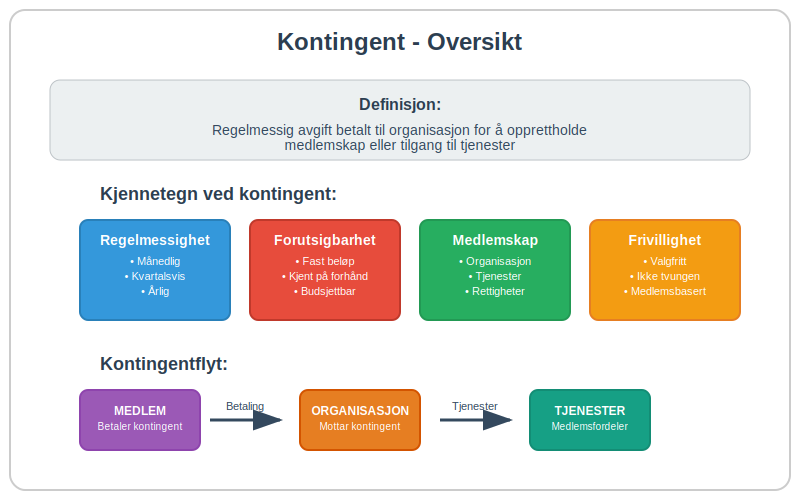
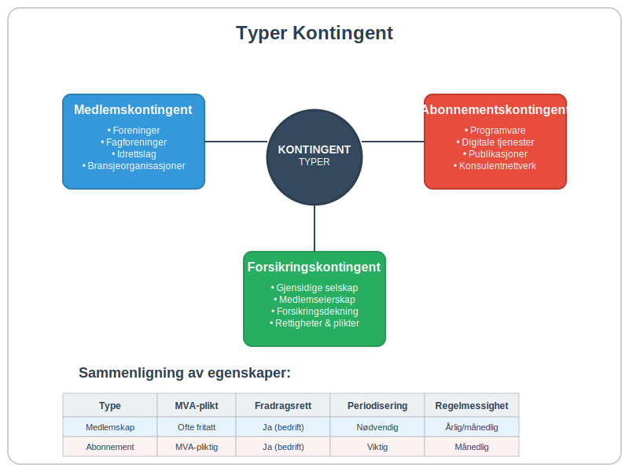
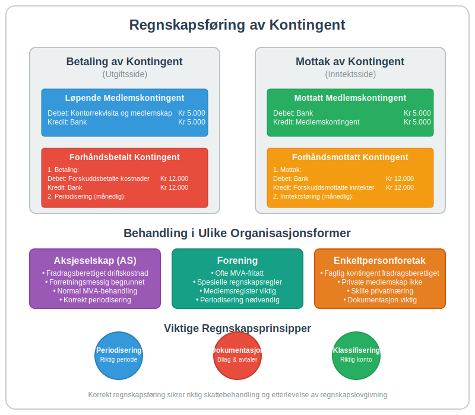
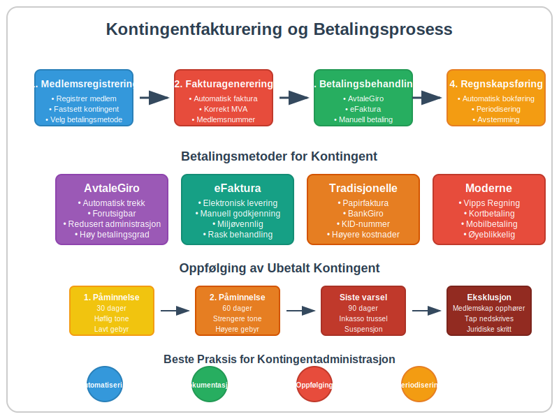

---
title: "Hva er kontingent?"
meta_title: "Hva er kontingent?"
meta_description: '**Kontingent** er en regelmessig avgift eller medlemsavgift som betales til en organisasjon, forening eller institusjon for å opprettholde medlemskap eller til...'
slug: hva-er-kontingent
type: blog
layout: pages/single
---

**Kontingent** er en regelmessig avgift eller medlemsavgift som betales til en organisasjon, forening eller institusjon for å opprettholde medlemskap eller tilgang til tjenester. I regnskapssammenheng representerer kontingent både en inntektskilde for mottakende organisasjoner og en driftskostnad for betalende bedrifter. Kontingent skiller seg fra andre avgifter ved at den typisk er **frivillig**, **periodisk** og knyttet til et spesifikt medlemskap eller abonnement.

## Seksjon 1: Hva er Kontingent?

Kontingent kommer fra det latinske ordet "contingere" som betyr "å berøre" eller "å tilkomme". I moderne forstand refererer kontingent til en **forhåndsbestemt avgift** som betales regelmessig for å opprettholde rettigheter, medlemskap eller tilgang til spesifikke tjenester.



### Kjennetegn ved Kontingent

Kontingent har flere karakteristiske egenskaper som skiller den fra andre typer avgifter:

* **Regelmessighet:** Betales typisk månedlig, kvartalsvis eller årlig
* **Forutsigbarhet:** Fast beløp som er kjent på forhånd
* **Medlemskapsbasert:** Knyttet til medlemskap i en organisasjon eller tilgang til tjenester
* **Frivillighet:** Basert på frivillig deltakelse (i motsetning til obligatoriske skatter)
* **Gjensidig forpliktelse:** BÃ¥de betaler og mottaker har forpliktelser

## Seksjon 2: Typer Kontingent

Det finnes flere ulike typer kontingent som brukes i forskjellige sammenhenger. Hver type har sine egne karakteristikker og regnskapsmessige implikasjoner.



### 2.1 Medlemskontingent

**Medlemskontingent** er den vanligste formen og betales til foreninger, fagforeninger, idrettslag og andre medlemsorganisasjoner. For bedrifter som betaler medlemskontingent til bransjeorganisasjoner eller handelskamre, behandles dette som en [driftskostnad](/blogs/regnskap/hva-er-driftskostnader "Hva er Driftskostnader? Komplett Guide til Bedriftens Løpende Utgifter") i regnskapet.

### 2.2 Abonnementskontingent

Denne typen kontingent gjelder for tilgang til tjenester som:
* Programvare og digitale tjenester
* Faglige publikasjoner og databaser
* Konsulentnettverk og rådgivningstjenester

Abonnementskontingent behandles ofte som [immaterielle rettigheter](/blogs/regnskap/hva-er-imaterielle-rettigheter "Hva er Imaterielle Rettigheter? Komplett Guide til Patenter, Varemerker og Opphavsrett") når de gir tilgang til intellektuell eiendom eller spesialiserte tjenester.

### 2.3 Forsikringskontingent

I forsikringssammenheng refererer kontingent til **medlemsavgifter** i gjensidige forsikringsselskaper hvor medlemmene både eier selskapet og er forsikringstakere. Dette skiller seg fra vanlige forsikringspremier ved at medlemmene har både rettigheter og forpliktelser i selskapet.

## Seksjon 3: Kontingent vs. Andre Avgifter

For å forstå kontingent fullt ut, er det viktig å skille den fra andre typer avgifter og betalinger som bedrifter møter.

### Sammenligning av Avgiftstyper

| Avgiftstype | Frivillighet | Regelmessighet | Motytelse | Eksempel |
|-------------|--------------|----------------|-----------|----------|
| **Kontingent** | Frivillig | Regelmessig | Medlemskap/tjenester | Fagforeningskontingent |
| **[Merverdiavgift](/blogs/regnskap/hva-er-avgiftsplikt-mva "Hva er Avgiftsplikt (MVA)? Komplett Guide til Merverdiavgift i Norge")** | Obligatorisk | Per transaksjon | Ingen direkte | 25% MVA på salg |
| **Skatt** | Obligatorisk | Regelmessig | Offentlige tjenester | Selskapsskatt |
| **Gebyr** | Situasjonsavhengig | Uregelmessig | Spesifikk tjeneste | [Fakturagebyr](/blogs/regnskap/hva-er-fakturagebyr "Hva er Fakturagebyr? Komplett Guide til Faktureringsgebyrer i Norge") |
| **Lisens** | Frivillig/Obligatorisk | Regelmessig | Bruksrettigheter | Programvarelisens |

### Kontingent og MVA

Et viktig skille er at **medlemskontingent** til ideelle organisasjoner ofte er **fritatt for merverdiavgift**, mens kommersielle abonnementstjenester normalt er MVA-pliktige. Dette påvirker både [bokføringen](/blogs/regnskap/hva-er-bokforing "Hva er Bokføring? Komplett Guide til Regnskapsføring og Bilagsbehandling") og den totale kostnaden for bedriften.

## Seksjon 4: Regnskapsføring av Kontingent

Regnskapsbehandlingen av kontingent avhenger av om bedriften **betaler** eller **mottar** kontingent, samt hvilken type kontingent det gjelder.



### 4.1 Betaling av Kontingent (Utgiftsside)

Når en bedrift betaler kontingent, behandles det normalt som en **driftskostnad**. Bokføringen avhenger av kontingentens karakter:

#### Løpende Medlemskontingent
```
Debet: Kontorrekvisita og medlemskap    Kr 5.000
Kredit: Bank                           Kr 5.000
```

#### Forhåndsbetalt Kontingent
Hvis kontingenten betales for en fremtidig periode, må den behandles som en [forskuddsbetaling](/blogs/regnskap/hva-er-forskuddsbetaling "Hva er forskuddsbetaling? Komplett Guide til Forskuddsbetalinger i Regnskap"):

```
Debet: Forskuddsbetalte kostnader      Kr 12.000
Kredit: Bank                           Kr 12.000
```

Deretter periodiseres kostnaden:
```
Debet: Kontorrekvisita og medlemskap    Kr 1.000
Kredit: Forskuddsbetalte kostnader     Kr 1.000
```

### 4.2 Mottak av Kontingent (Inntektsside)

For organisasjoner som mottar kontingent, behandles dette som **driftsinntekt**. Spesielle hensyn gjelder for [foreninger](/blogs/regnskap/hva-er-forening "Hva er Forening? Komplett Guide til Foreningstyper og Regnskapsplikt") og ideelle organisasjoner.

#### Mottatt Medlemskontingent
```
Debet: Bank                            Kr 5.000
Kredit: Medlemskontingent              Kr 5.000
```

#### Forhåndsmottatt Kontingent
Kontingent mottatt for fremtidige perioder må behandles som **utsatt inntekt**:

```
Debet: Bank                            Kr 12.000
Kredit: Forskuddsmottatte inntekter    Kr 12.000
```

## Seksjon 5: Kontingent i Ulike [organisasjonsformer](/blogs/regnskap/organisasjonsform "Organisasjonsform: Komplett Guide til Selskapsformer i Norge")

Behandlingen av kontingent varierer betydelig mellom ulike [organisasjonsformer](/blogs/regnskap/organisasjonsform "Organisasjonsform: Komplett Guide til Selskapsformer i Norge"), og det er viktig å forstå disse forskjellene for korrekt regnskapsføring.

### 5.1 Aksjeselskap og Kontingent

For [aksjeselskap](/blogs/regnskap/hva-er-et-aksjeselskap "Hva er et Aksjeselskap? Komplett Guide til AS, Stiftelse og Drift") som betaler kontingent til bransjeorganisasjoner, behandles dette som en **fradragsberettiget driftskostnad**. Kontingenten må være **forretningsmessig begrunnet** for å være fradragsberettiget.

### 5.2 Foreninger og Medlemskontingent

[Foreninger](/blogs/regnskap/hva-er-forening "Hva er Forening? Komplett Guide til Foreningstyper og Regnskapsplikt") har spesielle regler for medlemskontingent:

* **Ideelle foreninger:** Medlemskontingent er normalt fritatt for MVA
* **Økonomiske foreninger:** Kan være MVA-pliktige avhengig av virksomhetens art
* **Særlige regnskapsregler** gjelder for foreninger med begrenset regnskapsplikt

### 5.3 Enkeltpersonforetak og Kontingent

For [enkeltpersonforetak](/blogs/regnskap/hva-er-enkeltpersonforetak "Hva er Enkeltpersonforetak? Komplett Guide til ENK, Etablering og Drift") er faglig kontingent fradragsberettiget når den er knyttet til næringsvirksomheten. Private medlemskap (som idrettslag) er ikke fradragsberettiget.

## Seksjon 6: Kontingentfakturering og Betalingsrutiner

Effektiv håndtering av kontingent krever gode rutiner for fakturering og oppfølging, spesielt for organisasjoner som mottar kontingent fra mange medlemmer.



### 6.1 Automatisering av Kontingentinnkreving

Moderne organisasjoner bruker ofte **automatiske betalingsløsninger** for kontingentinnkreving:

* **[AvtaleGiro](/blogs/regnskap/hva-er-avtalegiro "Hva er AvtaleGiro? Komplett Guide til Automatisk Betaling"):** Mest brukte løsning for regelmessig kontingent
* **[eFaktura](/blogs/regnskap/hva-er-efaktura "Hva er eFaktura? Komplett Guide til Elektronisk Fakturering i Norge"):** For medlemmer som ønsker manuell kontroll
* **Digitale betalingsplattformer:** Vipps, kort og andre moderne løsninger

### 6.2 Kontingentfaktura vs. Vanlig Faktura

Kontingentfakturaer har ofte spesielle kjennetegn:

* **Forutsigbar periodisitet** (månedlig, årlig)
* **Fast beløp** over tid
* **Medlemsnummer** som referanse
* **Spesielle betalingsvilkår** for medlemmer

En korrekt [faktura](/blogs/regnskap/hva-er-en-faktura "Hva er en Faktura? En Guide til Norske Fakturakrav") for kontingent må fortsatt oppfylle alle lovpålagte krav, inkludert korrekt MVA-behandling.

### 6.3 Oppfølging av Ubetalt Kontingent

Organisasjoner må ha klare rutiner for oppfølging av ubetalt kontingent:

1. **Automatiske påminnelser** via [betalingsoppfordring](/blogs/regnskap/hva-er-betalingsoppfordring "Betalingsoppfordring - Komplett Guide til Purring og Inkasso i Norge")
2. **Suspensjon av medlemsrettigheter** ved langvarig manglende betaling
3. **Eksklusjon av medlemmer** som siste utvei
4. **Nedskrivning av tap** på uinnkrevelig kontingent

## Seksjon 7: Skattemessige Aspekter ved Kontingent

Skattebehandlingen av kontingent har viktige implikasjoner for både bedrifter og organisasjoner.

### 7.1 Fradragsrett for Kontingent

**Bedrifter** kan normalt trekke fra kontingent som driftskostnad når:

* Kontingenten er **forretningsmessig begrunnet**
* Medlemskapet gir **konkrete fordeler** for virksomheten
* Beløpet er **rimelig** i forhold til fordelene

**Private personer** kan ikke trekke fra medlemskontingent, med unntak av [fagforeningskontingent](/blogs/kontoplan/2650-trukket-fagforeningskontingent "Konto 2650 - Trukket fagforeningskontingent") som er fradragsberettiget.

### 7.2 MVA-behandling av Kontingent

MVA-behandlingen varierer betydelig:

| Kontingenttype | MVA-plikt | Begrunnelse |
|----------------|-----------|-------------|
| Ideell forening | Fritatt | Ikke-økonomisk virksomhet |
| Fagforening | Fritatt | Spesielle regler |
| Bransjeorganisasjon | Ofte fritatt | Avhenger av tjenester |
| Kommersielt abonnement | MVA-pliktig | Økonomisk virksomhet |
| Forsikringskontingent | Fritatt | Forsikringsvirksomhet |

### 7.3 Periodisering og Skattetiming

For organisasjoner som mottar kontingent, er **periodiseringsprinsippet** viktig:

* Kontingent skal **inntektsføres** i den perioden den gjelder for
* **Forhåndsmottatt kontingent** skal ikke beskattes før opptjeningsperioden
* **Korrekt periodisering** sikrer riktig skattetiming

## Seksjon 8: Digitalisering og Fremtiden for Kontingent

Digitaliseringen har revolusjonert hvordan kontingent håndteres, både for betalere og mottakere.

### 8.1 Automatiserte Kontingentsystemer

Moderne organisasjoner bruker **integrerte systemer** som kombinerer:

* **Medlemsregister** med automatisk kontingentberegning
* **[ERP-systemer](/blogs/regnskap/hva-er-erp-system "Hva er ERP-system? Komplett Guide til Enterprise Resource Planning")** for sømløs regnskapsintegrasjon
* **Betalingsplattformer** for automatisk innkreving
* **Rapporteringsverktøy** for analyse og oppfølging

### 8.2 Blockchain og Smart Contracts

Fremtidige løsninger kan inkludere:

* **Smart contracts** for automatisk kontingentbetaling
* **Blockchain-baserte** medlemsregistre
* **Kryptovaluta-betalinger** for internasjonale organisasjoner
* **Desentraliserte** medlemsorganisasjoner

### 8.3 Regulatoriske Endringer

Digitaliseringen fører til nye regulatoriske utfordringer:

* **[Betalingstjenestedirektivet (PSD2)](/blogs/regnskap/hva-er-betalingstjenestedirektivet "Hva er Betalingstjenestedirektivet (PSD2)? Påvirkning på Regnskap og Betalingstjenester")** påvirker [betalingsløsninger](/blogs/regnskap/betalingstjeneste "Hva er betalingstjeneste? Komplett Guide til Betalingstjenester i Norge")
* **GDPR** stiller krav til håndtering av medlemsdata
* **Nye MVA-regler** for digitale tjenester
* **[Elektronisk fakturering](/blogs/regnskap/hva-er-elektronisk-fakturering "Hva er Elektronisk fakturering? Komplett Guide til Digitale Fakturaløsninger")** blir stadig mer utbredt

## Seksjon 9: Praktiske Tips for Kontingentadministrasjon

Effektiv kontingentadministrasjon krever gode rutiner og systemer, uavhengig av om du betaler eller mottar kontingent.

### 9.1 For Bedrifter som Betaler Kontingent

**Budsjettplanlegging:**
* Lag en oversikt over alle kontingenter og deres forfallsdatoer
* Inkluder kontingent i årlige budsjetter og [budsjettering](/blogs/regnskap/hva-er-budsjettering "Hva er Budsjettering? Komplett Guide til Bedriftens Økonomiske Planlegging")
* Vurder forretningsmessig nytte av hvert medlemskap årlig

**Betalingsrutiner:**
* Sett opp [AvtaleGiro](/blogs/regnskap/hva-er-avtalegiro "Hva er AvtaleGiro? Komplett Guide til Automatisk Betaling") for regelmessige kontingenter
* Opprett påminnelser for årlige kontingenter
* Dokumenter alle kontingentbetalinger for regnskapsføring

### 9.2 For Organisasjoner som Mottar Kontingent

**Medlemsadministrasjon:**
* Implementer digitale medlemsregistre
* Automatiser kontingentfakturering
* Etabler klare rutiner for oppfølging av ubetalt kontingent

**Regnskapsrutiner:**
* Korrekt periodisering av kontingentinntekter
* Separate kontoer for ulike kontingenttyper
* Regelmessig [avstemming](/blogs/regnskap/hva-er-avstemming "Hva er Avstemming? Komplett Guide til Regnskapskontroll og Balansering") av medlemsregister og regnskap

### 9.3 Juridiske Hensyn

**Medlemsavtaler:**
* Tydelige vilkår for kontingentbetaling
* Konsekvenser ved manglende betaling
* Prosedyrer for kontingentendringer

**Personvern:**
* GDPR-compliance for medlemsdata
* Sikker lagring av betalingsinformasjon
* Rett til sletting av medlemsopplysninger

## Konklusjon

Kontingent er en fundamental del av mange organisasjoners økonomi og representerer en viktig kostnad for bedrifter som er medlemmer i bransjeorganisasjoner og faglige nettverk. **Korrekt forståelse** av kontingentens regnskapsmessige og skattemessige behandling er essensielt for både betalere og mottakere.

Nøkkelpunktene å huske:

* Kontingent er en **regelmessig, medlemskapsbasert avgift**
* **Regnskapsbehandlingen** varierer mellom organisasjonsformer
* **MVA-reglene** er komplekse og avhenger av organisasjonstype
* **Digitalisering** gjør kontingentadministrasjon mer effektiv
* **Korrekt dokumentasjon** er viktig for skattemessig fradragsrett

For bedrifter som ønsker å optimalisere sin kontingentadministrasjon, anbefales det å implementere digitale løsninger som integrerer med eksisterende [ERP-systemer](/blogs/regnskap/hva-er-erp-system "Hva er ERP-system? Komplett Guide til Enterprise Resource Planning") og sikrer korrekt [bokføring](/blogs/regnskap/hva-er-bokforing "Hva er Bokføring? Komplett Guide til Regnskapsføring og Bilagsbehandling") av alle kontingentrelaterte transaksjoner.


