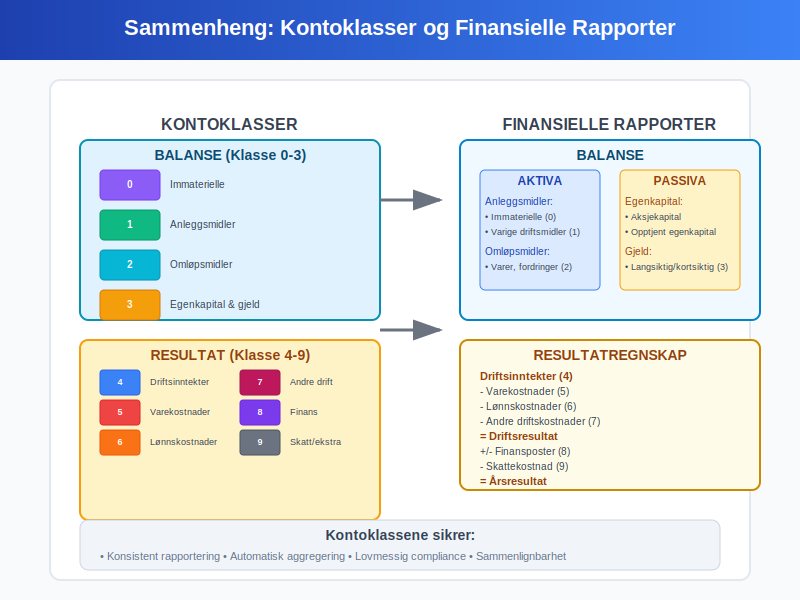

**Kontoklasser** er det systematiske klassifiseringssystemet som danner ryggraden i norsk [bokføring](/blogs/regnskap/hva-er-bokforing "Hva er Bokføring? En Komplett Guide til Norsk Bokføringspraksis") og [regnskap](/blogs/regnskap/hva-er-regnskap "Hva er Regnskap? En Dybdeanalyse for Norge"). Dette strukturerte systemet organiserer alle regnskapskontoer i logiske grupper som gjør det mulig å produsere pålitelige finansielle rapporter og oppfylle lovpålagte rapporteringskrav.

Kontoklassesystemet er fundamentalt for å opprettholde [god regnskapsskikk](/blogs/regnskap/god-regnskapsskikk "God Regnskapsskikk - Prinsipper, Standarder og Beste Praksis i Norge") og sikrer at alle transaksjoner registreres på en konsistent og sporbar måte i [hovedboken](/blogs/regnskap/hva-er-hovedbok "Hva er Hovedbok? En Komplett Guide til Hovedboken i Norsk Regnskap").

For mer om individuelle **regnskapskontoer** og kontooppbygging, se [Hva er en Regnskapskonto?](/blogs/regnskap/hva-er-regnskapskonto "Hva er en Regnskapskonto? Komplett Guide til Regnskapskontoer i Norsk Regnskap").

## Det Norske Kontoklassesystemet

Det norske kontoklassesystemet følger en standardisert struktur som er tilpasset norske regnskapsregler og rapporteringskrav. Systemet er bygget opp hierarkisk med **ti hovedklasser** som hver dekker spesifikke områder av virksomhetens økonomi.


### Hovedklassene 0-9

Kontoklassesystemet er organisert i ti hovedklasser, nummerert fra 0 til 9:

| Klasse | Navn | Beskrivelse | Balansetype |
|--------|------|-------------|-------------|
| **0** | Immaterielle eiendeler og investeringer | Goodwill, patenter, aksjer, obligasjoner | [Aktiva](/blogs/regnskap/hva-er-aktiva "Hva er Aktiva? En Komplett Guide til Eiendeler i Regnskap") |
| **1** | Anleggsmidler | Bygninger, maskiner, inventar, transportmidler | [Aktiva](/blogs/regnskap/hva-er-aktiva "Hva er Aktiva? En Komplett Guide til Eiendeler i Regnskap") |
| **2** | Omløpsmidler | Varelager (se [Konto 1400 - Råvarer og innkjøpte halvfabrikater](/blogs/kontoplan/1400-raavarer-og-innkjopte-halvfabrikater "Konto 1400 - Råvarer og innkjøpte halvfabrikater")), kundefordringer, bankinnskudd | [Aktiva](/blogs/regnskap/hva-er-aktiva "Hva er Aktiva? En Komplett Guide til Eiendeler i Regnskap") |
| **3** | Egenkapital og gjeld | [Egenkapital](/blogs/regnskap/hva-er-egenkapital "Hva er Egenkapital? Komplett Guide til Egenkapital i Norske Selskaper"), leverandørgjeld, lån | Passiva |
| **4** | Driftsinntekter | Salgsinntekter, andre driftsinntekter | [Inntekter](/blogs/regnskap/hva-er-inntekter "Hva er Inntekter? Komplett Guide til Inntektstyper og Regnskapsføring") |
| **5** | Varekostnader | Innkjøp av varer, direkte materialkostnader | Kostnader |
| **6** | Lønnskostnader | Lønn, [arbeidsgiveravgift](/blogs/regnskap/hva-er-arbeidsgiveravgift "Hva er Arbeidsgiveravgift? Komplett Guide til AGA-beregning og Innbetaling"), pensjonskostnader | Kostnader |
| **7** | Andre driftskostnader | Husleie, strøm, telefon, [avskrivninger](/blogs/regnskap/hva-er-avskrivning "Hva er Avskrivning? Komplett Guide til Avskrivninger i Norsk Regnskap") | [Driftskostnader](/blogs/regnskap/hva-er-driftskostnader "Hva er Driftskostnader? Typer, Beregning og Regnskapsføring - Komplett Guide") |
| **8** | Finansinntekter og finanskostnader | Renteinntekter, rentekostnader, valutagevinst/-tap | Finansielle poster |
| **9** | Ekstraordinære poster og skattekostnader | Skattekostnad, [ekstraordinære inntekter](/blogs/kontoplan/8400-ekstraordinaer-inntekt "Konto 8400 - Ekstraordinær inntekt"), ekstraordinære kostnader | Spesielle poster |

## Detaljert Gjennomgang av Kontoklassene

### Klasse 0: Immaterielle Eiendeler og Investeringer

Denne klassen omfatter **[immaterielle eiendeler](/blogs/regnskap/hva-er-imaterielle-eiendeler "Hva er Immaterielle Eiendeler? Komplett Guide til Immaterielle Rettigheter")** og langsiktige finansielle investeringer som ikke har fysisk form, men som likevel representerer verdifulle økonomiske ressurser.


**Typiske kontoer i klasse 0:**
* **010-019:** [Goodwill](/blogs/regnskap/hva-er-goodwill "Hva er Goodwill? Komplett Guide til Goodwill i Norsk Regnskap")
* **020-029:** Patenter og lisenser
* **030-039:** Programvare og utviklingskostnader
* **040-049:** Aksjer i datterselskaper
* **050-059:** Andre langsiktige investeringer

### Klasse 1: Anleggsmidler

**[Anleggsmidler](/blogs/regnskap/hva-er-anleggsmidler "Hva er Anleggsmidler? Komplett Guide til Anleggsmidler i Norsk Regnskap")** er fysiske eiendeler som virksomheten bruker i sin drift over lengre tid, typisk mer enn ett år. Disse eiendelene [avskrives](/blogs/regnskap/hva-er-avskrivning "Hva er Avskrivning? Komplett Guide til Avskrivninger i Norsk Regnskap") systematisk over deres brukstid.

**Typiske kontoer i klasse 1:**
* **100-109:** Tomter og bygninger
* **110-119:** Maskiner og produksjonsutstyr
* **120-129:** Inventar og kontormaskiner
* **130-139:** Transportmidler
* **140-149:** Anlegg under utførelse

### Klasse 2: Omløpsmidler

Omløpsmidler er eiendeler som forventes å bli omsatt til kontanter eller forbrukt innen ett år. Disse eiendelene utgjør en viktig del av virksomhetens [arbeidskapital](/blogs/regnskap/hva-er-arbeidskapital "Hva er Arbeidskapital? En Komplett Guide til Working Capital").


**Typiske kontoer i klasse 2:**
* **200-209:** Varelager og råvarer
* **210-219:** [Kundefordringer](/blogs/regnskap/hva-er-debitor "Hva er Debitor? Komplett Guide til Kundefordringer og Debitorhåndtering")
* **220-229:** Andre kortsiktige fordringer
* **230-239:** [Bankinnskudd](/blogs/regnskap/hva-er-bankinnskudd "Hva er Bankinnskudd? Komplett Guide til Bankinnskudd i Regnskap") og kontanter

### Klasse 3: Egenkapital og Gjeld

Denne klassen representerer virksomhetens finansieringskilder - både [egenkapital](/blogs/regnskap/hva-er-egenkapital "Hva er Egenkapital? Komplett Guide til Egenkapital i Norske Selskaper") fra eierne og [gjeld](/blogs/regnskap/hva-er-gjeld "Hva er Gjeld i Regnskap? Komplett Guide til Forpliktelser og Gjeldstyper") til eksterne parter.

**Typiske kontoer i klasse 3:**
* **300-309:** [Aksjekapital](/blogs/regnskap/hva-er-aksjekapital "Hva er Aksjekapital? Komplett Guide til Aksjekapital i Norge") og egenkapital
* **310-319:** Opptjent egenkapital og fond
* **320-329:** Langsiktig gjeld og lån
* **330-339:** Leverandørgjeld
* **340-349:** Skyldig offentlige avgifter (se [Konto 1600 - Utgående merverdiavgift](/blogs/kontoplan/1600-utgaende-merverdiavgift "Konto 1600 - Utgående merverdiavgift"))
* **350-359:** Annen kortsiktig gjeld

### Klasse 4: Driftsinntekter

**[Driftsinntekter](/blogs/regnskap/hva-er-driftsinntekter "Hva er Driftsinntekter? Komplett Guide til Driftsinntekter i Norsk Regnskap")** omfatter alle inntekter som kommer fra virksomhetens hovedaktivitet og kjernevirksomhet.

**Typiske kontoer i klasse 4:**
* **400-409:** Salgsinntekter varer
* **410-419:** Salgsinntekter tjenester
* **420-429:** Andre driftsinntekter
* **430-439:** Offentlige tilskudd

### Klasse 5: Varekostnader

Varekostnader omfatter alle direkte kostnader knyttet til innkjøp og produksjon av varer som selges.

**Typiske kontoer i klasse 5:**
* **500-509:** Innkjøp av handelsvarer
* **510-519:** Direkte materialkostnader
* **520-529:** Frakt og toll på innkjøpte varer
* **530-539:** Beholdningsendringer

### Klasse 6: Lønnskostnader

Alle kostnader knyttet til ansatte og lønn samles i denne klassen, inkludert lovpålagte avgifter og tillegg.


**Typiske kontoer i klasse 6:**
* **600-609:** Lønn til ansatte
* **610-619:** [Arbeidsgiveravgift](/blogs/regnskap/hva-er-arbeidsgiveravgift "Hva er Arbeidsgiveravgift? Komplett Guide til AGA-beregning og Innbetaling")
* **620-629:** Pensjonskostnader
* **630-639:** Andre personalkostnader
* **640-649:** [Feriepenger](/blogs/regnskap/hva-er-feriepenger "Hva er Feriepenger? Komplett Guide til Feriepenger i Norge")

### Klasse 7: Andre Driftskostnader

Denne klassen omfatter alle øvrige [driftskostnader](/blogs/regnskap/hva-er-driftskostnader "Hva er Driftskostnader? Typer, Beregning og Regnskapsføring - Komplett Guide") som ikke faller inn under varekostnader eller lønnskostnader.

**Typiske kontoer i klasse 7:**
* **700-709:** Husleie og lokalkostnader
* **710-719:** Strøm, oppvarming, vann
* **720-729:** Reparasjon og vedlikehold
* **730-739:** [Avskrivninger](/blogs/regnskap/hva-er-avskrivning "Hva er Avskrivning? Komplett Guide til Avskrivninger i Norsk Regnskap")
* **740-749:** Kontorkostnader
* **750-759:** Reise og transport
* **760-769:** Markedsføring og reklame
* **770-779:** Forsikringer
* **780-789:** Revisjons- og regnskapshonorarer

### Klasse 8: Finansinntekter og Finanskostnader

Finansielle poster som ikke er direkte knyttet til driftsaktiviteten klassifiseres her.

**Typiske kontoer i klasse 8:**
* **800-809:** Renteinntekter
* **810-819:** Utbytte og andre finansinntekter
* **820-829:** Rentekostnader
* **830-839:** Bankkostnader
* **840-849:** Valutagevinst og -tap

### Klasse 9: Ekstraordinære Poster og Skattekostnader

Denne klassen brukes for poster som ikke er en del av den ordinære driften.

**Typiske kontoer i klasse 9:**
* **900-909:** Skattekostnad
* **910-919:** Ekstraordinære inntekter
* **920-929:** Ekstraordinære kostnader

## Kontoplanens Hierarkiske Struktur

Kontoklassesystemet følger en **hierarkisk struktur** som gjør det mulig å aggregere informasjon på ulike nivåer:


### Strukturnivåer

1. **Hovedklasse (1 siffer):** F.eks. klasse 2 (Omløpsmidler)
2. **Underklasse (2 siffer):** F.eks. 21 (Kundefordringer)
3. **Kontogruppe (3 siffer):** F.eks. 210 (Kundefordringer Norge)
4. **Individuell konto (4+ siffer):** F.eks. 2100 (Kundefordringer Norge)

Denne strukturen gjør det mulig å:
* **Aggregere data** på ønsket detaljnivå
* **Produsere rapporter** tilpasset ulike brukere
* **Sammenligne** med andre virksomheter
* **Oppfylle** lovpålagte rapporteringskrav

## Praktisk Anvendelse av Kontoklasser

### Daglig Bokføring

I den daglige [bokføringen](/blogs/regnskap/hva-er-bokforing "Hva er Bokføring? En Komplett Guide til Norsk Bokføringspraksis") brukes kontoklassene til å sikre at alle transaksjoner registreres på riktig konto. Dette krever forståelse av:

* **Transaksjonens natur:** Hva slags økonomisk hendelse har skjedd?
* **Påvirkning på regnskapet:** Hvordan påvirker transaksjonen [aktiva](/blogs/regnskap/hva-er-aktiva "Hva er Aktiva? En Komplett Guide til Eiendeler i Regnskap"), gjeld, egenkapital, inntekter eller kostnader?
* **Korrekt klassifisering:** Hvilken kontoklass og spesifikk konto skal brukes?

### Eksempel: Innkjøp av Kontormøbler

La oss se på et praktisk eksempel der et selskap kjøper kontormøbler for 50 000 kr:


**Analyse:**
* **Transaksjon:** Kjøp av kontormøbler (anleggsmiddel)
* **Kontoklass:** Klasse 1 (Anleggsmidler)
* **Spesifikk konto:** 1220 (Inventar og kontormaskiner)
* **Motpost:** Klasse 2 (Bank) eller klasse 3 (Leverandørgjeld)

**Bokføringspost:**
```
Debet: 1220 Inventar og kontormaskiner    50 000
Kredit: 2300 Bank                         50 000
```

## Rapportering og Analyse

Kontoklassesystemet danner grunnlaget for produksjon av alle finansielle rapporter:

### Balansen

[Balansen](/blogs/regnskap/hva-er-balanse "Hva er Balanse i Regnskap? Komplett Guide til Balansens Oppbygging og Funksjon") bygges opp ved å aggregere saldi fra:
* **Aktiva:** Klasse 0, 1 og 2
* **Gjeld og egenkapital:** Klasse 3

### Resultatregnskapet

Resultatregnskapet baseres på:
* **Inntekter:** Klasse 4 og deler av klasse 8
* **Kostnader:** Klasse 5, 6, 7 og deler av klasse 8 og 9



## Tilpasning til Virksomhetstype

Selv om det finnes en standardisert kontoplan, må denne ofte **tilpasses** den enkelte virksomhets behov:

### Handelsbedrifter

* Fokus på klasse 2 (varelager) og klasse 5 (varekostnader)
* Detaljerte kontoer for ulike produktkategorier
* Spesielle kontoer for [fakturagebyr](/blogs/regnskap/hva-er-fakturagebyr "Hva er Fakturagebyr? Regler, Beregning og Regnskapsføring") og [forsinkelsesrente](/blogs/regnskap/hva-er-forsinkelsesrente "Hva er Forsinkelsesrente? Beregning, Regler og Regnskapsføring")

### Tjenestebedrifter

* Mindre fokus på varelager
* Mer detaljerte lønnskontoer (klasse 6)
* Spesielle kontoer for [honorar](/blogs/regnskap/hva-er-honorar "Hva er Honorar i Regnskap? Komplett Guide til Honorarutbetalinger og Skattebehandling") og konsulentytelser

### Produksjonsbedrifter

* Komplekse varekontoer med råvarer, halvfabrikata og ferdigvarer
* Detaljerte anleggsmiddelkontoer (klasse 1)
* Spesielle kontoer for produksjonskostnader

## Digitalisering og Moderne Kontoplaner

Moderne regnskapssystemer har gjort kontoplanene mer **fleksible og intelligente**:

### Automatisk Kontering

* **AI-basert forslag:** Systemet foreslår kontoer basert på tidligere transaksjoner
* **Regelbasert kontering:** Automatisk kontering basert på leverandør, beløp eller beskrivelse
* **Integrasjon med banker:** Automatisk import og forslag til kontering

### Dimensjonsregnskap

Moderne systemer støtter **dimensjonsregnskap** som utfyller kontoklassene:
* **Avdelinger:** Sporing av kostnader per avdeling
* **Prosjekter:** Detaljert prosjektregnskap
* **Kostnadssted:** Allokering av kostnader til ulike kostnadssteder


## Lovkrav og Compliance

Kontoklassesystemet må oppfylle flere **lovpålagte krav**:

### Bokføringsloven

[Bokføringsloven](/blogs/regnskap/hva-er-bokforingsloven "Hva er Bokføringsloven? Komplett Guide til Norsk Bokføringslovgivning") stiller krav til:
* **Systematisk registrering:** Alle transaksjoner må registreres systematisk
* **Sporbarhet:** Det må være mulig å spore alle poster tilbake til grunnlagsdokumenter
* **Oppbevaring:** Regnskapsopplysninger må oppbevares i minst 5 år

### SAF-T Rapportering

**Standard Audit File for Tax (SAF-T)** krever at kontoplanen følger spesifikke standarder for å kunne levere strukturerte data til skattemyndighetene.

### MVA-rapportering

Kontoklassene må støtte korrekt [MVA-rapportering](/blogs/regnskap/hva-er-avgiftsplikt-mva "Hva er Avgiftsplikt MVA? Komplett Guide til Merverdiavgift i Norge") med riktig klassifisering av:
* MVA-pliktige og MVA-fritatte inntekter
* Fradragsberettiget og ikke-fradragsberettiget inngående MVA

## Beste Praksis for Kontoplandesign

### Konsistens og Standardisering

* **Følg bransjestandard:** Bruk anerkjente kontoplaner for din bransje
* **Konsistent nummerering:** Hold deg til logiske nummereringssekvenser
* **Dokumentasjon:** Dokumenter hva hver konto skal brukes til

### Fremtidsrettet Planlegging

* **Reservér nummerserier:** La det være rom for nye kontoer
* **Fleksibilitet:** Design kontoplanen for fremtidig vekst
* **Integrasjon:** Sørg for at kontoplanen fungerer med andre systemer

### Opplæring og Vedlikehold

* **Opplæring:** Sørg for at alle som bruker systemet forstår kontoplanen
* **Regelmessig gjennomgang:** Gjennomgå og oppdater kontoplanen jevnlig
* **Kvalitetskontroll:** Implementer rutiner for å sikre korrekt kontering

## Sammenheng med Andre Regnskapskonsepter

Kontoklassene er tett integrert med andre viktige regnskapskonsepter:

### Hovedbok og Reskontro

[Hovedboken](/blogs/regnskap/hva-er-hovedbok "Hva er Hovedbok? En Komplett Guide til Hovedboken i Norsk Regnskap") organiseres etter kontoklassene, mens reskontroen gir detaljert informasjon om individuelle kunder og leverandører.

### Bilagsbehandling

Alle [bilag](/blogs/regnskap/hva-er-bilag "Hva er Bilag i Regnskap? Komplett Guide til Regnskapsbilag og Dokumentasjon") må knyttes til riktige kontoer i henhold til kontoklassesystemet.

### Periodisering og Avstemming

[Avstemming](/blogs/regnskap/hva-er-avstemming "Hva er Avstemming? Komplett Guide til Regnskapsavstemming") av kontoer må gjøres systematisk for hver kontoklass for å sikre regnskapets riktighet.

Kontoklassesystemet er fundamentet som gjør det mulig å produsere pålitelige og sammenlignbare finansielle rapporter. Ved å forstå og korrekt anvende dette systemet, sikrer virksomheter både lovmessighet og god økonomistyring.
