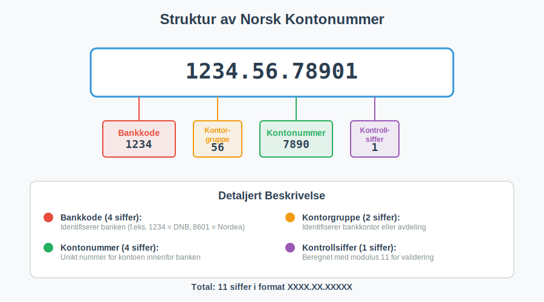
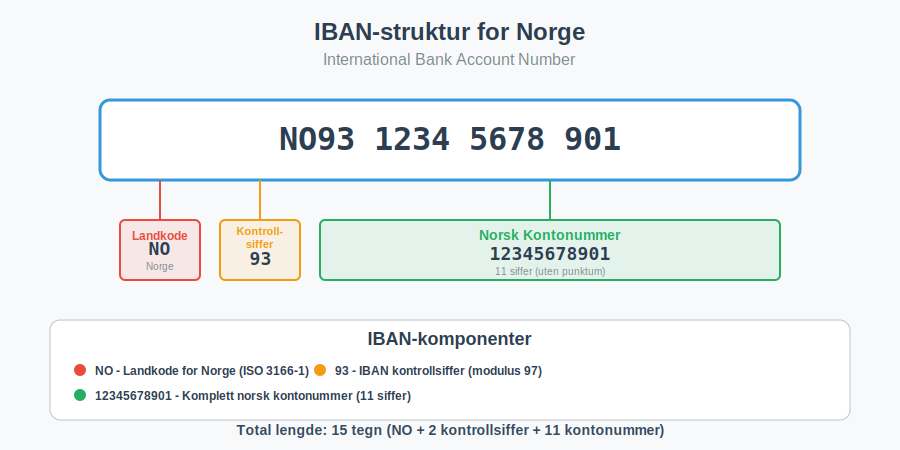
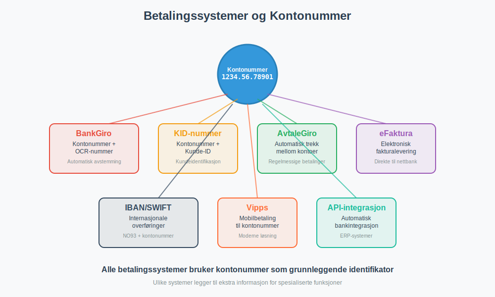

---
title: "Hva er kontonummer?"
seoTitle: "Hva er kontonummer?"
description: 'Et kontonummer er en unik numerisk identifikator for bankkontoer. I Norge består det av 11 sifre med kontrollsiffer for validering.'
summary: 'Kort oversikt over struktur, kontrollsiffer, IBAN-tilknytning og bruk av kontonummer i betalinger og regnskap.'
---

Et **kontonummer** er en unik numerisk identifikator som banker bruker for å identifisere individuelle bankkontoer. I Norge følger kontonummer en standardisert struktur som sikrer entydig identifikasjon av alle bankkontoer i det norske finanssystemet. Kontonummer er essensielt for alle [banktransaksjoner](/blogs/regnskap/hva-er-banktransaksjoner "Hva er Banktransaksjoner? Komplett Guide til Bankoperasjoner og Regnskapsføring") og spiller en kritisk rolle i [bankavstemming](/blogs/regnskap/hva-er-bankavstemming "Hva er Bankavstemming? Komplett Guide til Avstemming av Bankkontoer") og regnskapsføring.

## Seksjon 1: Struktur av Norske Kontonummer

Norske kontonummer følger en standardisert **11-sifret struktur** som er regulert av Finanstilsynet og administrert av Bits (tidligere Bankenes Betalingssentral). Denne strukturen sikrer at alle kontonummer i Norge er unike og kan valideres automatisk.

### 1.1 Oppbygging av Kontonummer

Et norsk kontonummer består av følgende komponenter:

| Posisjon | Antall siffer | Beskrivelse | Eksempel |
|----------|---------------|-------------|----------|
| 1-4 | 4 siffer | **Bankkode** - Identifiserer banken | 1234 |
| 5-6 | 2 siffer | **Kontorgruppe** - Identifiserer bankkontor/avdeling | 56 |
| 7-10 | 4 siffer | **Kontonummer** - Unikt nummer innenfor banken | 7890 |
| 11 | 1 siffer | **Kontrollsiffer** - Validerer kontonummerets gyldighet | 1 |

**Eksempel:** 1234.56.78901
- Bank: 1234 (f.eks. DNB)
- Kontor: 56
- Konto: 7890
- Kontroll: 1

### 1.2 Kontrollsiffer og Validering

**Kontrollsifferet** beregnes ved hjelp av en matematisk algoritme (modulus 11) som sikrer at kontonummeret er gyldig. Dette forhindrer feil ved manuell inntasting og automatiserer validering i [betalingssystemer](/blogs/regnskap/hva-er-betalingsmidler "Hva er Betalingsmidler? Tvungne, Elektroniske og Tradisjonelle Metoder").

#### Beregning av Kontrollsiffer:

1. **Vektfaktorer:** Hvert siffer multipliseres med en vektfaktor
2. **Summering:** Alle produkter summeres
3. **Modulus 11:** Summen deles med 11, og resten brukes til å beregne kontrollsifferet
4. **Validering:** Kontrollsifferet må stemme for at kontonummeret skal være gyldig

Dette systemet sikrer at over 99% av feilskrevne kontonummer oppdages automatisk, noe som er kritisk for [elektronisk fakturering](/blogs/regnskap/hva-er-elektronisk-fakturering "Hva er Elektronisk Fakturering? Komplett Guide til Digitale Fakturaløsninger") og automatiserte betalingsløsninger.

## Seksjon 2: IBAN og Internasjonale Standarder

For internasjonale transaksjoner brukes **[IBAN-nummer](/blogs/regnskap/hva-er-iban-nummer "Hva er IBAN-nummer? Komplett Guide til International Bank Account Number i Norge")** (International Bank Account Number), som inkluderer det norske kontonummeret i en standardisert internasjonal format. Dette er essensielt for bedrifter som driver [engroshandel](/blogs/regnskap/hva-er-engroshandel "Hva er Engroshandel? Komplett Guide til B2B-handel og Regnskapsføring") eller har internasjonale forretningsforbindelser.

### 2.1 Norsk IBAN-format

Et norsk IBAN består av **15 tegn** og følger denne strukturen:

| Posisjon | Innhold | Beskrivelse | Eksempel |
|----------|---------|-------------|----------|
| 1-2 | NO | Landkode for Norge | NO |
| 3-4 | 93 | Kontrollsiffer (beregnet) | 93 |
| 5-15 | 12345678901 | Norsk kontonummer (11 siffer) | 12345678901 |

**Komplett IBAN-eksempel:** NO9312345678901

### 2.2 BIC-koder og SWIFT

I tillegg til IBAN brukes ofte **[BIC-koder](/blogs/regnskap/hva-er-bic-kode "Hva er BIC-kode? Komplett Guide til Bank Identifier Codes og SWIFT")** (Bank Identifier Code) for å identifisere mottakerbanken i internasjonale overføringer. BIC-koder er spesielt viktige for bedrifter som håndterer [fjernleverbare tjenester](/blogs/regnskap/hva-er-fjernleverbare-tjenester "Hva er Fjernleverbare Tjenester? MVA-regler og Regnskapsføring") til kunder i utlandet.

## Seksjon 3: Kontonummer i Regnskapssammenheng

Kontonummer spiller en sentral rolle i moderne regnskapsføring og er grunnleggende for korrekt [bokføring](/blogs/regnskap/hva-er-bokforing "Hva er Bokføring? Komplett Guide til Regnskapsføring og Bokføringsregler") av banktransaksjoner. Alle bedrifter må ha systematisk kontroll over sine bankkontoer for å oppfylle [bokføringslovens](/blogs/regnskap/hva-er-bokforingsloven "Hva er Bokføringsloven? Komplett Guide til Norsk Regnskapslovgivning") krav.

### 3.1 Bankkontoer i Kontoplanen

I regnskapet registreres bankkontoer typisk under følgende kontoklasser:

| Kontotype | Kontoklasse | Beskrivelse | Eksempel |
|-----------|-------------|-------------|----------|
| **Driftskontoer** | 1900-1929 | Daglige kontanter og bankinnskudd | [1900 - Kontanter](/blogs/kontoplan/1900-kontanter "Konto 1900 - Kontanter"), 1920 - Bankinnskudd |
| **Sparekontoer** | 1930-1949 | Kortsiktige bankinnskudd | 1930 - Sparekonto |
| **Valutakontoer** | 1950-1969 | Kontoer i utenlandsk valuta | 1950 - USD-konto |
| **Bundne midler** | 1970-1989 | Bundne bankinnskudd og deposita | 1970 - Bundne midler |

### 3.2 Bankavstemming og Kontroll

**[Bankavstemming](/blogs/regnskap/hva-er-bankavstemming "Hva er Bankavstemming? Komplett Guide til Avstemming av Bankkontoer")** er en kritisk kontrollprosess hvor bedriftens regnskapsførte banksaldo sammenlignes med [bankens kontoutskrift](/blogs/regnskap/hva-er-kontoutskrift "Hva er Kontoutskrift i Regnskap? En Guide til Kontoutskrifter"). Dette sikrer at alle transaksjoner er korrekt registrert og at det ikke er uoppdagede feil eller mangler.

#### Månedlig Avstemmingsprosess:

1. **Innhenting av kontoutskrift** fra banken
2. **Sammenligning** med regnskapsførte transaksjoner
3. **Identifikasjon av differanser** og uavstemt poster
4. **Korrigering** av feil og mangler
5. **Dokumentasjon** av avstemmingen for revisjonsformål

Moderne regnskapssystemer kan ofte automatisere mye av denne prosessen gjennom **automatisk bankintegrasjon**, hvor transaksjoner importeres direkte fra banken og matches mot regnskapspostene.

## Seksjon 4: Betalingssystemer og Kontonummer

Kontonummer er grunnleggende for alle elektroniske betalingssystemer i Norge. Ulike betalingsløsninger bruker kontonummer på forskjellige måter for å sikre korrekt og sikker overføring av midler.

### 4.1 Tradisjonelle Betalingsmetoder

#### BankGiro og OCR
**[BankGiro](/blogs/regnskap/hva-er-bankgiro "Hva er BankGiro? Komplett Guide til Norsk Betalingssystem")** bruker mottakerens kontonummer kombinert med OCR-nummer for automatisk identifikasjon og avstemming av betalinger. Dette er særlig viktig for bedrifter som mottar mange [fakturaer](/blogs/regnskap/hva-er-en-faktura "Hva er en Faktura? En Guide til Norske Fakturakrav") og trenger automatisk avstemming.

#### KID-nummer
**[KID-nummer](/blogs/regnskap/hva-er-kid-nummer "Hva er KID-nummer? Komplett Guide til Kunde-IDentifikasjon i Norge")** (Kunde-IDentifikasjon) brukes sammen med kontonummer for å automatisk identifisere hvilken kunde eller faktura en betaling gjelder. Dette er essensielt for effektiv [kundeoppfølging](/blogs/regnskap/hva-er-ansattreskontro "Hva er Ansattreskontro? Komplett Guide til Kundeoppfølging og Fordringsstyring").

### 4.2 Moderne Betalingsløsninger

#### AvtaleGiro
**[AvtaleGiro](/blogs/regnskap/hva-er-avtalegiro "Hva er AvtaleGiro? Komplett Guide til Automatisk Betaling")** krever både betalerens og mottakerens kontonummer for å etablere automatiske trekkavtaler. Dette er den mest brukte løsningen for regelmessige betalinger som husleie, forsikringer og abonnementer.

#### eFaktura
**[eFaktura](/blogs/regnskap/hva-er-efaktura "Hva er eFaktura? Komplett Guide til Elektronisk Fakturering i Norge")** leveres direkte til kundens nettbank ved hjelp av kontonummer som identifikator. Dette eliminerer behovet for papirfakturaer og reduserer [fakturagebyr](/blogs/regnskap/hva-er-fakturagebyr "Hva er Fakturagebyr? Komplett Guide til Faktureringsgebyrer i Norge").

## Seksjon 5: Sikkerhet og Personvern

Kontonummer inneholder sensitiv finansiell informasjon og må behandles i henhold til **GDPR** og norsk personvernlovgivning. Bedrifter som håndterer kunders kontonummer har særlige forpliktelser knyttet til datasikkerhet og personvern.

### 5.1 Sikkerhetstiltak

#### Kryptering og Lagring
- **Kryptert lagring** av kontonummer i databaser
- **Sikre overføringskanaler** (HTTPS/TLS) for elektronisk kommunikasjon
- **Tilgangskontroll** - kun autorisert personell har tilgang
- **Logging og overvåking** av alle tilganger til kontonummerdata

#### Compliance og Regelverk
Bedrifter må følge:
- **PCI DSS** for betalingskortdata
- **[Betalingstjenestedirektivet (PSD2)](/blogs/regnskap/hva-er-betalingstjenestedirektivet "Hva er Betalingstjenestedirektivet (PSD2)? Påvirkning på Regnskap og Betalingstjenester")** for [betalingstjenester](/blogs/regnskap/betalingstjeneste "Hva er betalingstjeneste? Komplett Guide til Betalingstjenester i Norge")
- **Finanstilsynets** retningslinjer for datasikkerhet
- **Personvernforordningen (GDPR)** for behandling av personopplysninger

### 5.2 Beste Praksis for Bedrifter

#### Håndtering av Kontonummer
1. **Minimering:** Samle kun nødvendige kontonummer
2. **Formålsbegrensning:** Bruk kun til avtalt formål
3. **Oppbevaringstid:** Slett når ikke lenger nødvendig
4. **Sikker deling:** Bruk sikre kanaler ved deling
5. **Opplæring:** Tren ansatte i sikker håndtering

## Seksjon 6: Automatisering og Integrasjon

Moderne regnskapssystemer og [ERP-systemer](/blogs/regnskap/hva-er-erp-system "Hva er ERP-system? Komplett Guide til Enterprise Resource Planning") integrerer kontonummer i automatiserte prosesser for å øke effektiviteten og redusere feil i finansielle transaksjoner.

### 6.1 API-integrasjoner

**[API-integrasjon](/blogs/regnskap/api-integrasjon-automatisering-regnskap "API-integrasjon og Automatisering i Regnskap - Komplett Guide")** mellom banker og regnskapssystemer muliggjør:

- **Automatisk import** av banktransaksjoner
- **Sanntids banksaldo** i regnskapssystemet
- **Automatisk avstemming** av inn- og utbetalinger
- **Varsling** ved uventede transaksjoner eller lav saldo

### 6.2 Validering og Kvalitetssikring

Moderne systemer implementerer automatisk validering av kontonummer:

#### Teknisk Validering
- **Format-kontroll:** Sjekk av 11-sifret struktur
- **Kontrollsiffer-validering:** Matematisk verifikasjon
- **Bank-validering:** Kontroll mot oppdaterte banklister
- **IBAN-konvertering:** Automatisk generering av IBAN-format

#### Forretningslogikk
- **Duplikat-kontroll:** Forhindre registrering av samme konto flere ganger
- **Aktivitetssporing:** Overvåking av uvanlige transaksjoner
- **Compliance-sjekk:** Automatisk kontroll mot sanksjons- og svartelister

## Seksjon 7: Fremtidige Utviklingstrender

Det norske betalingssystemet utvikler seg kontinuerlig, og kontonummer vil fortsette å spille en sentral rolle i fremtidens finansielle infrastruktur.

### 7.1 Digitalisering og Fintech

**[Fintech-selskaper](/blogs/regnskap/hva-er-fintech "Hva er Fintech? Komplett Guide til Finansteknologi og Påvirkning på Regnskap")** utvikler innovative løsninger som bygger på kontonummer-infrastrukturen:

- **Øyeblikkelige betalinger:** Sanntidsoverføringer mellom kontoer
- **Åpen bankvirksomhet:** API-er som gir tredjeparter tilgang til kontoinformasjon
- **Kunstig intelligens:** Automatisk kategorisering og analyse av transaksjoner
- **Blockchain-integrasjon:** Hybrid løsninger som kombinerer tradisjonelle kontonummer med distribuerte systemer

### 7.2 Regulatoriske Endringer

Fremtidige endringer i regelverk vil påvirke hvordan kontonummer brukes:

- **Økt transparens:** Krav til bedre sporing av pengestrømmer
- **Miljørapportering:** Kobling mellom banktransaksjoner og [ESG-rapportering](/blogs/regnskap/hva-er-esg "Hva er ESG? Komplett Guide til Miljø, Sosial og Styring i Regnskap")
- **Automatisert rapportering:** Direkte rapportering fra banker til skattemyndigheter

## Konklusjon

Kontonummer er en fundamental komponent i det norske finanssystemet som muliggjør sikker, effektiv og sporbar håndtering av alle banktransaksjoner. For bedrifter er forståelse av kontonummer-systemet essensielt for:

- **Korrekt regnskapsføring** og [bokføring](/blogs/regnskap/hva-er-bokforing "Hva er Bokføring? Komplett Guide til Regnskapsføring og Bokføringsregler")
- **Effektiv [bankavstemming](/blogs/regnskap/hva-er-bankavstemming "Hva er Bankavstemming? Komplett Guide til Avstemming av Bankkontoer")** og finansiell kontroll
- **Automatisering** av betalingsprosesser og fakturabehandling
- **Compliance** med regnskaps- og personvernlovgivning
- **Sikker håndtering** av finansielle data

Ved å implementere beste praksis for håndtering av kontonummer kan bedrifter oppnå bedre finansiell kontroll, redusere risiko for feil, og forberede seg for fremtidens digitale betalingsløsninger.

