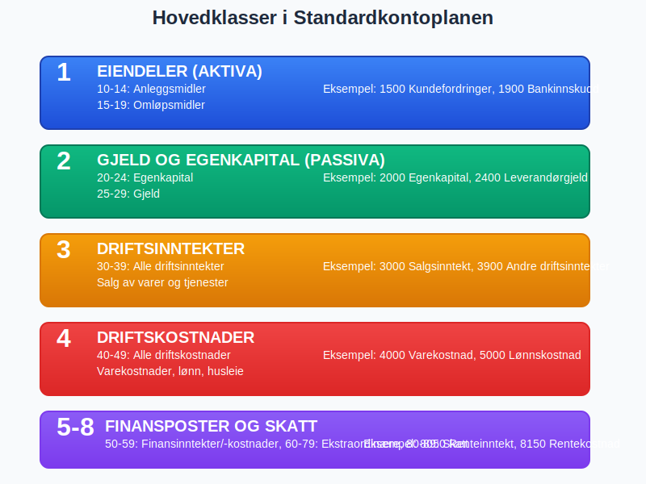

En **kontoplan** er et systematisk register over alle kontoer som brukes i et selskaps [regnskap](/blogs/regnskap/hva-er-regnskap "Hva er Regnskap? Komplett Guide til Regnskapsføring i Norge"). Den fungerer som ryggraden i enhver [bokføring](/blogs/regnskap/hva-er-bokforing "Hva er Bokføring? Komplett Guide til Bokføringsregler og -praksis") og gir struktur og oversikt over alle økonomiske transaksjoner.

For en detaljert gjennomgang av **regnskapskontoer**, se [Hva er en Regnskapskonto?](/blogs/regnskap/hva-er-regnskapskonto "Hva er en Regnskapskonto? Komplett Guide til Regnskapskontoer i Norsk Regnskap").

## Definisjon av Kontoplan

En kontoplan er en **strukturert oversikt** over alle kontoer som et [foretak](/blogs/regnskap/hva-er-foretak "Hva er et Foretak? Komplett Guide til Foretaksformer i Norge") bruker for å registrere sine økonomiske transaksjoner. Hver konto har et unikt **kontonummer** og en **kontobeskrivelse** som beskriver hva som skal registreres på kontoen.

### Formål med Kontoplan

Kontoplanen har flere viktige funksjoner:

* **Systematisering** av alle økonomiske transaksjoner
* **Standardisering** av regnskapsføringen
* **Sammenlignbarhet** mellom perioder og selskaper
* **Rapportering** til offentlige myndigheter
* **Intern styring** og kontroll av virksomheten

## Struktur og Oppbygging

### Kontoplannivåer

En norsk kontoplan er typisk bygget opp med **fire nivåer**:

| Nivå | Beskrivelse | Eksempel | Formål |
|------|-------------|----------|---------|
| **Klasse** | Hovedkategorier (1 siffer) | 1, 2, 3, 4, 5 | Grunnleggende inndeling |
| **Gruppe** | Undergrupper (2 siffer) | 15, 20, 30 | Mer detaljert kategorisering |
| **Art** | Kontotype (3-4 siffer) | 150, 1500 | Spesifikk kontotype |
| **Objekt** | Detaljnivå (5+ siffer) | 15001, 150010 | Høyeste detaljnivå |

### Hovedklasser i Standardkontoplanen

Den norske standardkontoplanen er delt inn i **fem hovedklasser**:

#### Klasse 1: Eiendeler (Aktiva)
* **10-14**: [Anleggsmidler](/blogs/regnskap/hva-er-anleggsmidler "Hva er Anleggsmidler? Komplett Guide til Anleggsmidler i Regnskap")
* **15-19**: Omløpsmidler

#### Klasse 2: Gjeld og Egenkapital (Passiva)
* **20-24**: [Egenkapital](/blogs/regnskap/hva-er-egenkapital "Hva er Egenkapital? Komplett Guide til Egenkapital i Regnskap")
* **25-29**: [Gjeld](/blogs/regnskap/hva-er-gjeld "Hva er Gjeld? Komplett Guide til Gjeld i Regnskap")

#### Klasse 3: Driftsinntekter
* **30-39**: [Driftsinntekter](/blogs/regnskap/hva-er-driftsinntekter "Hva er Driftsinntekter? Komplett Guide til Driftsinntekter i Regnskap")
* **36**: [Leieinntekt fast eiendom](/blogs/kontoplan/3600-leieinntekt-fast-eiendom "Konto 3600 - Leieinntekt fast eiendom")
* **38**: [Gevinst ved avgang av anleggsmidler](/blogs/kontoplan/3800-gevinst-ved-avgang-av-anleggsmidler "Konto 3800 - Gevinst ved avgang av anleggsmidler")
* **39**: [Annen driftsrelatert inntekt, avgiftspliktig](/blogs/kontoplan/3900-annen-driftsrelatert-inntekt-avgiftspliktig "Konto 3900 - Annen driftsrelatert inntekt, avgiftspliktig")

#### Klasse 4: Driftskostnader
* **40-49**: [Driftskostnader](/blogs/regnskap/hva-er-driftskostnader "Hva er Driftskostnader? Komplett Guide til Driftskostnader i Regnskap")

#### Klasse 5-8: Finansposter og Skatt
* **50-59**: Finansinntekter og finanskostnader (se [Konto 5500 - Annen kostnadsgodtgjørelse](/blogs/kontoplan/5500-annen-kostnadsgodtgjorelse "Konto 5500 - Annen kostnadsgodtgjørelse") og [Konto 5600 - Arbeidsgodtgjørelse til eiere i ANS o.l.](/blogs/kontoplan/5600-arbeidsgodtgjorelse-til-eiere-i-ans "Konto 5600 - Arbeidsgodtgjørelse til eiere i ANS o.l."))
* **60-79**: Ekstraordinære poster
* **80-89**: Skattekostnader

## Standardkontoplan vs. Tilpasset Kontoplan

### Norsk Standardkontoplan (NS 4102)

For en grundig gjennomgang av **Norsk Standardkontoplan (NS 4102)**, se [NS 4102](/blogs/regnskap/ns-4102 "NS 4102 - Norsk Standardkontoplan for kommunal regnskap og regnskapsføring").

### Tilpasning til Egen Virksomhet

Selv om standardkontoplanen gir en god base, må de fleste bedrifter tilpasse den til sine behov:

* **Bransjetilpasning** - spesielle kontoer for bransjen
* **Detaljnivå** - mer eller mindre detaljerte kontoer
* **Rapporteringsbehov** - tilpasset intern rapportering
* **Størrelse** - mindre bedrifter kan forenkle

## Praktisk Bruk av Kontoplan

### Kontonummerering

God praksis for kontonummerering:

* **Logisk oppbygging** - følg standardstrukturen
* **Rom for utvidelse** - la mellomrom mellom kontoer
* **Konsistens** - bruk samme logikk gjennom hele planen
* **Dokumentasjon** - beskriv hva som skal på hver konto

### Eksempel på Kontostruktur

| Kontonummer | Kontobeskrivelse | Forklaring |
|-------------|------------------|------------|
| **1500** | Kundefordringer | Hovedkonto for alle kundefordringer |
| **1501** | Kundefordringer Norge | Norske kunder |
| **1502** | Kundefordringer EU | EU-kunder |
| **1503** | Kundefordringer øvrige | Kunder utenfor EU |
| **1590** | Avsetning for tap på fordringer | Forventet tap |

### Bilagsføring og Kontoplan

Ved [bilagsføring](/blogs/regnskap/hva-er-bilagsforing "Hva er Bilagsføring? Komplett Guide til Bilagsføring i Regnskap") er kontoplanen avgjørende:

* **Riktig konto** - velg korrekt konto for hver transaksjon
* **Konsistens** - bruk samme konto for like transaksjoner
* **Dokumentasjon** - noter spesielle forhold
* **Kontroll** - sjekk at [debet](/blogs/regnskap/hva-er-debet "Hva er Debet og Kredit? Komplett Guide til Dobbel Bokføring") og kredit stemmer

## Digitale Kontoplaner

### Regnskapsprogrammer

Moderne regnskapsprogrammer tilbyr:

* **Forhåndsinstallerte** standardkontoplaner
* **Bransjetilpassede** kontoplaner
* **Automatisk kontering** basert på leverandør/kunde
* **Rapportering** direkte fra kontoplanen

### Integrasjon med Andre Systemer

Kontoplanen integreres ofte med:

* **[ERP-systemer](/blogs/regnskap/hva-er-erp-system "Hva er ERP-system? Komplett Guide til Enterprise Resource Planning")** for helhetlig økonomistyring
* **Lønnssystemer** for automatisk lønnsføring
* **Faktureringssystemer** for automatisk salgsføring
* **Banksystemer** for automatisk bankavstemming

## Juridiske Krav og Standarder

### Bokføringsloven

[Bokføringsloven](/blogs/regnskap/hva-er-bokforingsloven "Hva er Bokføringsloven? Komplett Guide til Bokføringsregler i Norge") stiller krav til:

* **Systematisk** registrering av transaksjoner
* **Kronologisk** og **systematisk** ordning
* **Sporbarhet** fra bilag til regnskap
* **Oppbevaring** av regnskapsopplysninger

### Regnskapsstandarder

Kontoplanen må følge:

* **God regnskapsskikk** - etablerte prinsipper og praksis
* **Regnskapslovens** bestemmelser
* **Internasjonale standarder** for større selskaper
* **Bransjespecifikke** krav der det finnes

## Beste Praksis for Kontoplanlegging

### Planlegging og Design

* **Analyser virksomheten** - forstå alle prosesser og transaksjoner
* **Involver brukerne** - de som skal bruke kontoplanen daglig
* **Tenk fremover** - planlegg for vekst og endringer
* **Test grundig** - prøv kontoplanen før full implementering

### Vedlikehold og Oppdatering

* **Regelmessig gjennomgang** - minst årlig evaluering
* **Dokumenter endringer** - hold oversikt over alle endringer
* **Tren brukerne** - sørg for at alle forstår endringene
* **Backup og sikkerhet** - beskytt kontoplanen mot tap

### Vanlige Feil å Unngå

* **For mange kontoer** - ikke lag unødvendig kompleksitet
* **For få kontoer** - sørg for tilstrekkelig detaljnivå
* **Inkonsistent nummerering** - følg en logisk struktur
* **Manglende dokumentasjon** - beskriv alle kontoers formål

## Kontoplan for Ulike Bransjer

### Handelsbedrifter

Spesielle behov:

* **Varelager** - detaljerte lagerkontoer
* **Innkjøp** - kontoer for ulike leverandører og produktgrupper
* **Salg** - kontoer for ulike kundegrupper og produkter
* **Logistikk** - frakt- og transportkontoer

### Tjenestebedrifter

Fokusområder:

* **Timefakturering** - kontoer for ulike tjenester
* **Prosjekter** - prosjektspesifikke kontoer
* **Personalkostnader** - detaljerte lønnskontoer
* **Overhead** - indirekte kostnader

### Produksjonsbedrifter

Spesielle krav:

* **Råvarer** - kontoer for ulike råmaterialer
* **Produksjon** - kontoer for produksjonsprosesser
* **Ferdigvarer** - kontoer for ferdige produkter
* **Produksjonskostnader** - direkte og indirekte kostnader

### Landbruksvirksomheter

Landbruk har særegne regnskapsbehov som krever spesialiserte kontoplaner:

* **Biologiske eiendeler** - husdyr og avlinger som endrer verdi over tid
* **Sesongbaserte inntekter** - konsentrerte inntekter ved høsting/salg
* **Produksjonstilskudd** - komplekse støtteordninger fra det offentlige
* **Jordbruksfradrag** - spesielle skattefordeler for landbrukssektoren

For en detaljert gjennomgang av regnskapsføring i landbruk, se vår guide til [landbrukskontoplan](/blogs/regnskap/landbrukskontoplan "Landbrukskontoplan - Komplett Guide til Regnskap for Landbruk").

## Fremtiden for Kontoplaner

### Digitalisering og Automatisering

* **Kunstig intelligens** for automatisk kontering
* **Maskinlæring** for forbedret kategorisering
* **Sanntidsrapportering** direkte fra transaksjoner
* **Integrerte økosystemer** på tvers av systemer

### Standardisering

* **Internasjonale standarder** blir viktigere
* **Bransjespesifikke** standarder utvikles
* **Automatisk rapportering** til myndigheter
* **Sammenlignbarhet** på tvers av land

## Konklusjon

En **veldesignet kontoplan** er fundamentet for god regnskapsføring og økonomistyring. Den må være:

* **Tilpasset virksomheten** - reflektere faktiske behov
* **Fremtidsrettet** - kunne håndtere vekst og endringer
* **Brukervennlig** - enkel å forstå og bruke
* **Regelkonform** - følge alle juridiske krav

Ved å investere tid i å utvikle en god kontoplan, legger bedrifter grunnlaget for effektiv regnskapsføring, bedre økonomisk kontroll og mer pålitelig rapportering.

