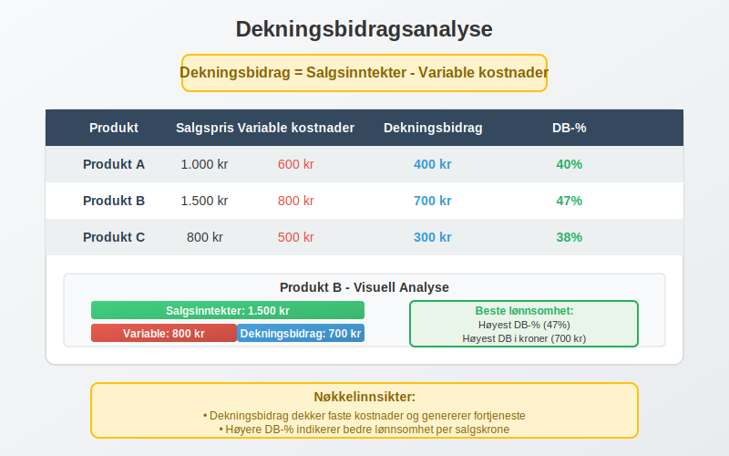

**Kostnader** er en av de mest fundamentale begrepene i [regnskap](/blogs/regnskap/hva-er-regnskap "Hva er Regnskap? En Dybdeanalyse for Norge") og representerer de økonomiske ofrene en virksomhet gjør for å generere inntekter og opprettholde driften. Forståelse av kostnader er avgjørende for effektiv [bokføring](/blogs/regnskap/hva-er-bokforing "Hva er Bokføring? En Komplett Guide til Norsk Bokføringspraksis"), lønnsomhetsanalyse og strategisk beslutningstagning.

Kostnader påvirker direkte virksomhetens [driftsresultat](/blogs/regnskap/hva-er-driftsresultat "Hva er Driftsresultat? Komplett Guide til Beregning og Analyse") og er en kritisk komponent i [driftsregnskapet](/blogs/regnskap/hva-er-driftsregnskap "Hva er Driftsregnskap? Komplett Guide til Driftsregnskapet i Norge"). Korrekt klassifisering og regnskapsføring av kostnader er essensielt for å følge [god regnskapsskikk](/blogs/regnskap/god-regnskapsskikk "God Regnskapsskikk - Prinsipper, Standarder og Beste Praksis i Norge").

Det er også viktig å skille mellom **kostnader** og [**utgifter**](/blogs/regnskap/utgift "Utgift “ Komplett Guide til Utgifter i Norsk Regnskap"), som representerer tidspunktet for betaling. Les mer i vår artikkel om utgift.

## Seksjon 1: Grunnleggende Kostnadskonsepter

### 1.1 Definisjon av Kostnader

I regnskapssammenheng defineres kostnader som **økonomiske ressurser som forbrukes eller ofres for å oppnå et bestemt mål**. Kostnader representerer reduksjonen i [egenkapital](/blogs/regnskap/hva-er-egenkapital "Hva er Egenkapital? Komplett Guide til Egenkapital i Norsk Regnskap") som ikke skyldes utdelinger til eiere.


Kostnader skiller seg fra utgifter ved at:

* **Kostnader** er økonomiske ofre knyttet til inntektsgenerering
* **Utgifter** er kontantstrømmer ut av virksomheten
* En kostnad kan oppstå uten tilhørende utgift (f.eks. [avskrivning](/blogs/regnskap/hva-er-avskrivning "Hva er Avskrivning? Komplett Guide til Avskrivninger i Norsk Regnskap"))
* En utgift kan oppstå uten tilhørende kostnad (f.eks. kjøp av [anleggsmidler](/blogs/regnskap/hva-er-anleggsmidler "Hva er Anleggsmidler? Komplett Guide til Anleggsmidler i Norsk Regnskap"))

### 1.2 Kostnadenes Rolle i Regnskapsligningen

Kostnader påvirker den grunnleggende regnskapsligningen ved å redusere egenkapitalen:

**Eiendeler = Gjeld + Egenkapital**

Når kostnader påløper, reduseres egenkapitalen, og dette balanseres enten ved:

* Reduksjon i eiendeler (f.eks. kontanter brukt til lønn)
* Økning i gjeld (f.eks. påløpte, men ikke betalte kostnader)

## Seksjon 2: Hovedkategorier av Kostnader

### 2.1 Direkte vs. Indirekte Kostnader


#### [Direkte kostnader](/blogs/regnskap/hva-er-direkte-kostnader "Direkte kostnader i Regnskap? Definisjon, Eksempler og Regnskapsføring")

**[Direkte kostnader](/blogs/regnskap/hva-er-direkte-kostnader "Direkte kostnader i Regnskap? Definisjon, Eksempler og Regnskapsføring")** kan spores direkte til et spesifikt produkt, tjeneste eller kostnadssted. Disse kostnadene ville ikke oppstå hvis produktet eller tjenesten ikke ble produsert.

**Eksempler på direkte kostnader:**

* Råmaterialer brukt i produksjon
* Direkte arbeidskraft (lønn til produksjonsarbeidere)
* Spesifikke maskiner leid for et prosjekt
* Frakt av råvarer til produksjon

#### [Indirekte kostnader](/blogs/regnskap/hva-er-indirekte-kostnader "Hva er Indirekte kostnader? Definisjon, Eksempler og Regnskapsføring")

**Indirekte kostnader** (også kalt overhead eller felleskostnader) kan ikke enkelt spores til et spesifikt produkt eller tjeneste. Disse kostnadene støtter den generelle driften.

**Eksempler på indirekte kostnader:**

* Administrasjonslønninger
* Husleie for fabrikklokaler
* Strøm og oppvarming
* Forsikringer
* Vedlikehold av fellesutstyr

### 2.2 Faste vs. Variable Kostnader


#### Faste Kostnader

**Faste kostnader** forblir konstante uavhengig av produksjons- eller aktivitetsnivået innenfor et relevant område.

| Kostnadskategori | Eksempler | Karakteristikk |
|------------------|-----------|----------------|
| **Husleie** | Kontorleie, fabrikkhaller | Uendret månedlig beløp |
| **Forsikringer** | Bygningsforsikring, ansvarsforsikring | Årlige premier |
| **Avskrivninger** | Maskiner, bygninger | Systematisk fordeling over tid |
| **Grunnlønninger** | Faste månedslønninger | Uavhengig av produksjon |


#### Variable Kostnader

Les mer om [Variable kostnader](/blogs/regnskap/variable-kostnader "Hva er Variable kostnader? Definisjon, Eksempler og Regnskapsføring") for en detaljert guide.

**Variable kostnader** endres proporsjonalt med aktivitets- eller produksjonsnivået.

| Kostnadskategori | Eksempler | Variasjonsmønster |
|------------------|-----------|-------------------|
| **Råmaterialer** | Stål, tre, tekstiler | Direkte proporsjonal |
| **Provisjoner** | Salgsprovisjoner | Basert på salgsvolum |
| **Strøm (produksjon)** | Maskindrift | Øker med produksjon |
| **Emballasje** | Bokser, etiketter | Per produsert enhet |

#### Semi-variable Kostnader

Noen kostnader har både faste og variable komponenter:

* **Telefon:** Fast månedlig abonnement + variable samtalegebyrer
* **Strøm:** Fast tilknytningsavgift + variabel forbruksavgift
* **Lønn:** Fast grunnlønn + variable overtidstillegg

### 2.3 Driftskostnader vs. Finanskostnader

#### Driftskostnader

[Driftskostnader](/blogs/regnskap/hva-er-driftskostnader "Hva er Driftskostnader? Typer, Beregning og Regnskapsføring - Komplett Guide") er kostnader direkte knyttet til virksomhetens kjerneaktiviteter og inntektsgenerering.

**Hovedkategorier av driftskostnader:**

* **Varekostnader:** Innkjøp av varer for videresalg
* **Lønnskostnader:** Lønn, feriepenger, arbeidsgiveravgift
* **Sosiale kostnader:** Se [Sosiale kostnader](/blogs/regnskap/sosiale-kostnader "Sosiale kostnader “ Definisjon, Eksempler og Regnskapsføring i Norge").
* **Avskrivninger:** Systematisk fordeling av anleggsmidlers kostnad
* **Leiekostnader:** Husleie, maskinleie
* **Markedsføringskostnader:** Annonsering, messer, PR
* **Administrasjonskostnader:** Kontorrekvisita, telefon, forsikring

#### Finanskostnader

**Finanskostnader** er kostnader knyttet til virksomhetens finansieringsaktiviteter:

* **Rentekostnader:** Renter på lån og kreditter
* **Bankgebyrer:** Kontoføring, transaksjonsgebyrer
* **Valutakurstap:** Tap ved valutaomregning
* **Garantiprovisjon:** Kostnader for lånegarantier

## Seksjon 3: Kostnadsmåling og Verdivurdering

### 3.1 Historisk Kost vs. Nåverdi


#### Historisk Kostprinsipp

Det **historiske kostprinsippet** er grunnleggende i norsk regnskap og innebærer at eiendeler og kostnader måles til opprinnelig anskaffelseskost.

**Fordeler med historisk kost:**

* Objektivitet og etterprøvbarhet
* Konservatisme i verdivurdering
* Sammenlignbarhet over tid
* Enkel implementering

**Utfordringer med historisk kost:**

* Reflekterer ikke nåværende markedsverdier
* Kan gi misvisende lønnsomhetsmål i inflasjonsperioder
* Begrenset relevans for beslutningstagning

#### Alternative Kostnadsmål

* **Gjenanskaffelseskost:** Kostnad for å anskaffe tilsvarende eiendel i dag
* **Netto realisasjonsverdi:** Forventet salgspris minus salgsomkostninger
* **Nåverdi:** Diskontert verdi av fremtidige kontantstrømmer
* **Alternativkostnad:** Tapet av beste alternative bruk av ressurser. Les mer i [Hva er Alternativkostnad?](/blogs/regnskap/alternativkostnad "Hva er Alternativkostnad? Komplett Guide til Alternativkostnad og Beslutningsanalyse").

### 3.2 Anskaffelseskost

[Anskaffelseskost](/blogs/regnskap/hva-er-anskaffelseskost "Hva er Anskaffelseskost? Komplett Guide til Beregning og Regnskapsføring") omfatter alle kostnader som er nødvendige for å bringe eiendelen til tiltenkt bruk:

**Komponenter i anskaffelseskost:**

* Kjøpspris (fratrukket rabatter og bonuser)
* Importavgifter og ikke-refunderbare skatter
* Transportkostnader
* Installasjonskostnader
* Profesjonelle honorarer (advokat, revisor)
* Testkostnader

## Seksjon 4: Kostnadsfordeling og Allokering

### 4.1 Kostnadsfordelingsprinsipper


Kostnadsfordeling er prosessen med å tildele indirekte kostnader til produkter, tjenester eller avdelinger basert på logiske fordelingsnøkler.

#### Vanlige Fordelingsnøkler

| Kostnadskategori | Fordelingsnøkkel | Begrunnelse |
|------------------|------------------|-------------|
| **Husleie** | Kvadratmeter | Arealbruk |
| **Strøm** | Maskintime/kWh | Energiforbruk |
| **Administrasjon** | Omsetning/ansatte | Aktivitetsnivå |
| **IT-kostnader** | Antall brukere | Systembruk |
| **HR-kostnader** | Antall ansatte | Personalstøtte |

### 4.2 Aktivitetsbasert Kostnadsberegning (ABC)

**Activity-Based Costing (ABC)** er en mer sofistikert metode for kostnadsfordeling som fokuserer på aktiviteter som driver kostnader.

**ABC-prosessen:**

1. **Identifiser aktiviteter:** Kartlegg alle aktiviteter i organisasjonen
2. **Bestem kostnadsdrivere:** Identifiser hva som forårsaker kostnadene
3. **Beregn aktivitetskostnader:** Samle kostnader per aktivitet
4. **Alloker til produkter:** Fordel basert på produktenes bruk av aktiviteter

## Seksjon 5: Kostnadsanalyse og Lønnsomhet

### 5.1 Dekningsbidragsanalyse

[Dekningsbidrag](/blogs/regnskap/hva-er-dekningsbidrag "Hva er Dekningsbidrag? Komplett Guide til Beregning og Analyse") er et sentralt konsept for lønnsomhetsanalyse:

**Dekningsbidrag = Salgsinntekter - Variable kostnader**



#### Dekningsbidrag per Enhet

| Produkt | Salgspris | Variable kostnader | Dekningsbidrag | DB-% |
|---------|-----------|-------------------|----------------|------|
| **Produkt A** | 1.000 kr | 600 kr | 400 kr | 40% |
| **Produkt B** | 1.500 kr | 800 kr | 700 kr | 47% |
| **Produkt C** | 800 kr | 500 kr | 300 kr | 38% |

### 5.2 Nullpunktsanalyse

[Nullpunkt](/blogs/regnskap/hva-er-nullpunkt "Hva er Nullpunkt? Komplett Guide til Break-Even Analyse") (break-even) er det punktet hvor totale inntekter er lik totale kostnader.

**Nullpunkt i enheter = Faste kostnader ÷ Dekningsbidrag per enhet**

**Nullpunkt i kroner = Faste kostnader ÷ Dekningsbidrag-%**

### 5.3 Kostnads-Volum-Fortjeneste Analyse (CVP)

CVP-analyse undersøker sammenhengen mellom kostnader, volum og fortjeneste:


**Nøkkelelementer i CVP-analyse:**

* **Salgsmiks:** Forholdet mellom ulike produkters salg
* **Operasjonell leverage:** Hvor følsom fortjenesten er for volumendringer
* **Margin of safety:** Hvor mye salget kan falle før nullpunkt nås

## Seksjon 6: Spesielle Kostnadskategorier

### 6.1 Periodiseringskostnader

Periodiseringsprinsippet krever at kostnader matches mot tilhørende inntekter i samme periode.

#### Påløpte Kostnader

**Påløpte kostnader** er kostnader som er opptjent, men ikke betalt:

* Påløpte lønninger ved periodeslutt
* Påløpte renter på lån
* Påløpte, men ikke fakturerte tjenester

#### Forskuddsbetalte Kostnader

**Forskuddsbetalte kostnader** er betalinger for fremtidige tjenester:

* Forskuddsbetalt forsikring
* Forskuddsbetalt husleie
* Forskuddsbetalte lisenser

### 6.2 Avskrivninger som Kostnad

[Avskrivning](/blogs/regnskap/hva-er-avskrivning "Hva er Avskrivning? Komplett Guide til Avskrivninger i Norsk Regnskap") representerer den systematiske fordelingen av et anleggsmiddels kostnad over dets brukstid.

**Avskrivningsmetoder:**

* **Lineær avskrivning:** Lik kostnad hvert år
* **Saldoavskrivning:** Prosentvis av gjenstående verdi
* **Produksjonsbasert:** Basert på faktisk bruk

### 6.3 Amortisering av Immaterielle Eiendeler

[Amortisering](/blogs/regnskap/hva-er-amortisering "Hva er Amortisering? En Komplett Guide til Avskrivninger") er avskrivning av [immaterielle eiendeler](/blogs/regnskap/hva-er-imaterielle-eiendeler "Hva er Immaterielle Eiendeler? Komplett Guide til Immaterielle Rettigheter"):

* **Goodwill:** Nedskrivningstesting årlig
* **Patenter:** Amortiseres over juridisk eller økonomisk levetid
* **Programvare:** Amortiseres over forventet brukstid
* **Kundeforhold:** Amortiseres over forventet varighet

## Seksjon 7: Kostnadsregnskapsføring

### 7.1 Journalføring av Kostnader

Kostnader journalføres ved [dobbel bokføring](/blogs/regnskap/hva-er-dobbel-bokforing "Hva er Dobbel Bokføring? Komplett Guide til Dobbelt Bokføringssystem") hvor kostnadskontoen debiteres:

**Eksempel - Lønnskostnad:**
```
Debet: Lønnskostnad         100.000 kr
Kredit: Kontanter                   80.000 kr
Kredit: Skyldig lønn               20.000 kr
```

### 7.2 Kostnadskontoer i Kontoplanen

Kostnader klassifiseres i [kontoklasser](/blogs/regnskap/hva-er-kontoklasser "Hva er Kontoklasser? Komplett Guide til Norsk Kontoplan") 4-8 i norsk standard kontoplan:

| Kontoklasse | Kostnadskategori | Eksempler |
|-------------|------------------|-----------|
| **4** | Driftskostnader | Varekjøp, lønn, husleie |
| **5** | Lønnskostnader | Lønn, feriepenger, pensjon |
| **6** | Avskrivninger | Maskiner, bygninger |
| **7** | Finanskostnader | Renter, bankgebyrer |
| **8** | Ekstraordinære | Engangskostnader |

### 7.3 Bilagsbehandling for Kostnader

Korrekt [bilagsbehandling](/blogs/regnskap/hva-er-bilag "Hva er Bilag i Regnskap? Komplett Guide til Regnskapsbilag og Dokumentasjon") er kritisk for kostnadskontroll:

**Dokumentasjonskrav:**

* **Innkjøpsfakturaer:** Alle varekjøp og tjenester
* **Lønnslipper:** Dokumentasjon av lønnskostnader
* **Kvitteringer:** Mindre kontantutlegg
* **Kontrakter:** Langsiktige forpliktelser
* **Bankkontoutskrifter:** Betalingsbekreftelser

## Seksjon 8: Kostnadskontroll og Budsjettering

### 8.1 Budsjetterte vs. Faktiske Kostnader


**Avviksanalyse** sammenligner budsjetterte og faktiske kostnader:

| Kostnadskategori | Budsjett | Faktisk | Avvik | Avvik % |
|------------------|----------|---------|-------|---------|
| **Lønn** | 2.000.000 | 2.150.000 | 150.000 | 7,5% |
| **Husleie** | 500.000 | 500.000 | 0 | 0% |
| **Markedsføring** | 300.000 | 275.000 | -25.000 | -8,3% |
| **Totalt** | 2.800.000 | 2.925.000 | 125.000 | 4,5% |

### 8.2 Standardkostnader

**Standardkostnader** er forhåndsbestemte kostnader basert på effektiv drift under normale forhold.

**Typer standardkostnader:**

* **Ideelle standarder:** Perfekte forhold, ingen ineffektivitet
* **Oppnåelige standarder:** Realistiske, men utfordrende mål
* **Normale standarder:** Basert på historisk gjennomsnitt

### 8.3 Kostnadskontrollsystemer

Effektiv kostnadskontroll krever systematiske prosesser:

**Nøkkelelementer:**

* **Kostnadssentre:** Organisatoriske enheter med kostnadsansvar
* **Rapporteringsrutiner:** Regelmessig kostnadsoversikt
* **Godkjennelsesprosedyrer:** Kontroll av utgifter
* **Benchmarking:** Sammenligning med bransjestandard

## Seksjon 9: Kostnader i Ulike Bransjer

### 9.1 Produksjonsbedrifter

I produksjonsbedrifter skilles mellom:

**Produktkostnader:**
* Direkte materialer
* Direkte arbeidskraft  
* Produksjonsoverhead

**Periodekostnader:**
* Salgs- og markedsføringskostnader
* Administrasjonskostnader

### 9.2 Tjenestebedrifter

Tjenestebedrifter har typisk:

* **Høy andel lønnskostnader** (ofte 60-80% av totale kostnader)
* **Lave materialekostnader**
* **Betydelige indirekte kostnader** (IT, lokaler, utstyr)

### 9.3 Handelsbedrifter

For [detaljhandel](/blogs/regnskap/hva-er-detaljhandel "Hva er Detaljhandel? Komplett Guide til Detaljhandel og Regnskapsføring") og [engroshandel](/blogs/regnskap/hva-er-engroshandel "Hva er Engroshandel? Komplett Guide til Engroshandel og B2B-salg"):

* **Varekostnader** dominerer (typisk 60-80% av omsetning)
* **Lagerkostnader** (lagring, forsikring, svinn)
* **Logistikkostnader** (transport, håndtering)

## Seksjon 10: Skattemessige Aspekter av Kostnader

### 10.1 Fradragsberettigede Kostnader

For å være [fradragsberettiget](/blogs/regnskap/hva-er-fradrag "Hva er fradrag i regnskap? Komplett Guide til Skattefradrag og Regnskapsføring") må kostnader oppfylle visse kriterier:

**Hovedregel:** Kostnader som er pådratt for å erverve, sikre eller vedlikeholde skattepliktig inntekt.

**Vanlige fradragsberettigede kostnader:**

* Driftskostnader i næringsvirksomhet
* Lønnskostnader inkludert [arbeidsgiveravgift](/blogs/regnskap/hva-er-arbeidsgiveravgift "Hva er Arbeidsgiveravgift? Komplett Guide til Beregning og Innbetaling")
* Avskrivninger på driftsmidler
* Rentekostnader på næringslån
* Forsikringspremier for næringsvirksomhet

### 10.2 Ikke-fradragsberettigede Kostnader

**Eksempler på ikke-fradragsberettigede kostnader:**

* Private kostnader
* Bøter og straffer
* Gaver over visse beløpsgrenser
* Visse representasjonskostnader
* Kostnader ved erverv av aksjer

### 10.3 Periodisering for Skatteformål

Skattemessig periodisering kan avvike fra regnskapsmessig:

* **Kontantprinsippet:** For mindre virksomheter
* **Regnskapsprinsippet:** For større virksomheter
* **Særregler:** For visse kostnadskategorier

## Seksjon 11: Internasjonale Perspektiver

### 11.1 IFRS og Kostnadsmåling

[International Financial Reporting Standards (IFRS)](/blogs/regnskap/hva-er-ifrs "Hva er IFRS? Komplett Guide til International Financial Reporting Standards") påvirker kostnadsmåling:

**Nøkkelstandarder:**

* **IAS 2:** Varelager - kostnadsmåling og verdivurdering
* **IAS 16:** Eiendom, anlegg og utstyr - avskrivninger
* **IAS 38:** Immaterielle eiendeler - amortisering
* **IAS 36:** Verdifall på eiendeler - nedskrivninger

### 11.2 Transfer Pricing

For konserner med internasjonale transaksjoner er **transfer pricing** kritisk:

* Prising av interne transaksjoner
* Dokumentasjonskrav
* Armlengdeprinsippet
* Skattemessige konsekvenser

## Seksjon 12: Digitalisering og Kostnadshåndtering

### 12.1 Automatisering av Kostnadsregistrering

Moderne teknologi transformerer kostnadshåndtering:

**Digitale løsninger:**

* **OCR-teknologi:** Automatisk lesing av fakturaer
* **[ERP-systemer](/blogs/regnskap/hva-er-erp-system "Hva er ERP-system? Komplett Guide til Enterprise Resource Planning"):** Integrert kostnadshåndtering
* **AI og maskinlæring:** Kostnadsprediksjon og -analyse
* **Mobil-apper:** Reiseregninger og utlegg

### 12.2 Sanntids Kostnadsrapportering

**Fordeler med sanntids kostnadsdata:**

* Raskere beslutningstagning
* Proaktiv kostnadskontroll
* Forbedret budsjettoppfølging
* Redusert administrativt arbeid

## Konklusjon

Kostnader er et komplekst og mangefasettert område innen regnskap som krever grundig forståelse for effektiv virksomhetsstyring. Fra grunnleggende klassifisering til avanserte analyseteknikker, påvirker kostnadshåndtering alle aspekter av en virksomhets økonomiske prestasjon.

**Nøkkelpunkter for effektiv kostnadshåndtering:**

* **Korrekt klassifisering:** Skille mellom ulike kostnadstyper
* **Systematisk registrering:** Følge etablerte regnskapsprinsipper
* **Regelmessig analyse:** Overvåke kostnadstrender og avvik
* **Strategisk fokus:** Bruke kostnadsinformasjon til beslutningstagning
* **Kontinuerlig forbedring:** Optimalisere kostnadsprosesser

Ved å mestre kostnadskonseptene og implementere robuste kostnadssystemer, kan virksomheter oppnå bedre lønnsomhet, mer effektiv ressursbruk og sterkere konkurranseposisjon i markedet.

For dypere innsikt i relaterte emner, utforsk våre artikler om [driftskostnader](/blogs/regnskap/hva-er-driftskostnader "Hva er Driftskostnader? Typer, Beregning og Regnskapsføring - Komplett Guide"), [avskrivninger](/blogs/regnskap/hva-er-avskrivning "Hva er Avskrivning? Komplett Guide til Avskrivninger i Norsk Regnskap"), og [dekningsbidrag](/blogs/regnskap/hva-er-dekningsbidrag "Hva er Dekningsbidrag? Komplett Guide til Beregning og Analyse") for å bygge en komplett forståelse av kostnadshåndtering i moderne regnskap.


