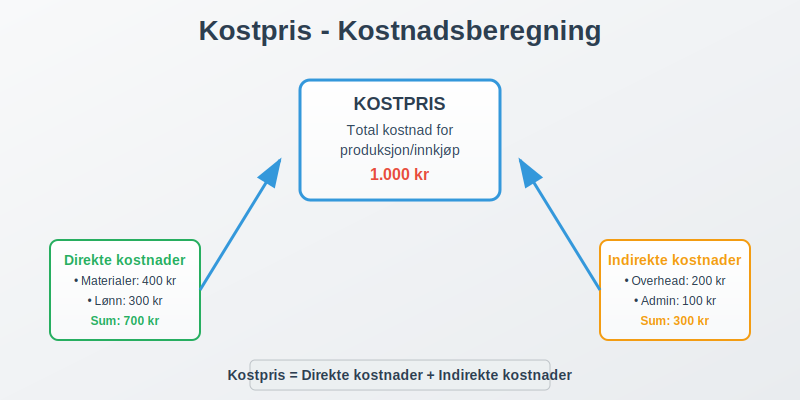
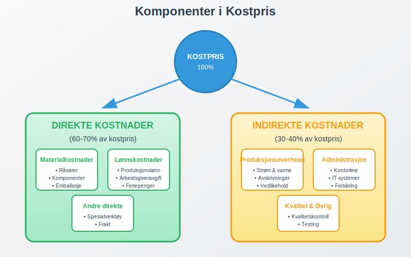
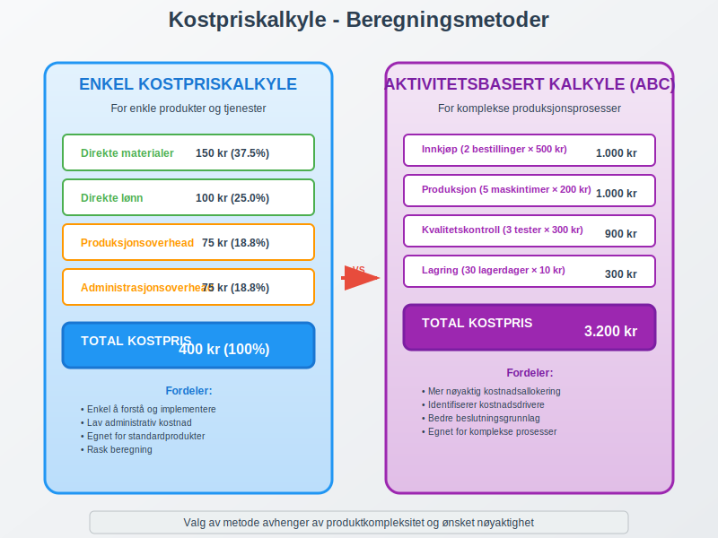
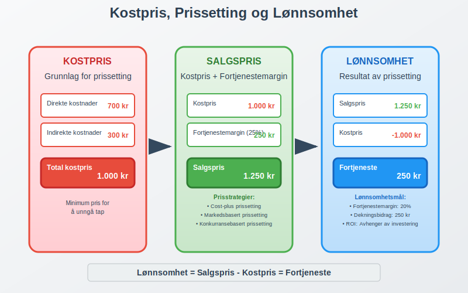
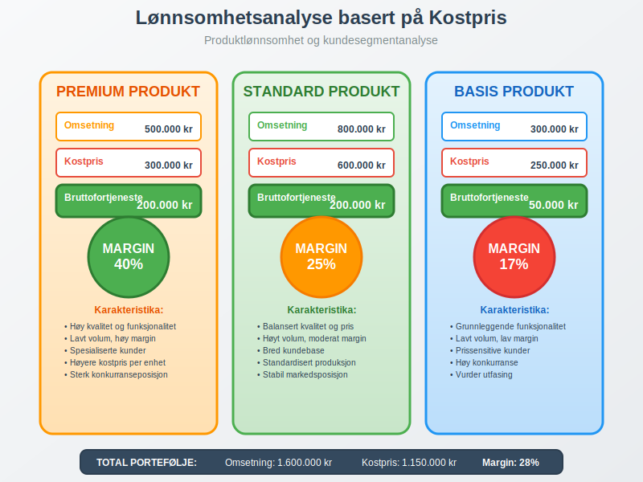

---
title: "Hva er kostpris?"
meta_title: "Hva er kostpris?"
meta_description: '**Kostpris** er den totale kostnaden det koster å produsere, kjøpe inn eller fremstille en vare eller tjeneste. Dette er et grunnleggende regnskapskonsept som...'
slug: hva-er-kostpris
type: blog
layout: pages/single
---

**Kostpris** er den totale kostnaden det koster å produsere, kjøpe inn eller fremstille en vare eller tjeneste. Dette er et grunnleggende regnskapskonsept som danner basis for prissetting, lønnsomhetsanalyse og [driftsregnskap](/blogs/regnskap/hva-er-driftsregnskap "Hva er Driftsregnskap? Forklaring og Eksempler"), og er nært knyttet til [varekostnad](/blogs/regnskap/hva-er-varekostnad "Hva er Varekostnad? Komplett Guide til Kostnadsstyring og Regnskapsføring").



### Hva er Kostpris?

Kostpris, også kalt **selvkost** eller **tilvirkningskost**, omfatter alle direkte og indirekte kostnader som er nødvendige for å få et produkt eller en tjeneste klar for salg. Dette inkluderer både [anskaffelseskost](/blogs/regnskap/hva-er-anskaffelseskost "Hva er Anskaffelseskost? Beregning og Regnskapsføring") for råvarer og alle kostnader knyttet til produksjon og distribusjon.

Kostpris er fundamentalt for:

* **Prissetting:** Grunnlag for å sette salgspriser som sikrer lønnsomhet
* **Lønnsomhetsanalyse:** Beregning av [avanse](/blogs/regnskap/hva-er-avanse "Hva er Avanse? Forskuddsbetaling og Regnskapsføring") og [dekningsbidrag](/blogs/regnskap/hva-er-dekningsbidrag "Hva er Dekningsbidrag? Beregning og Analyse")
* **Budsjettering:** Planlegging av [driftskostnader](/blogs/regnskap/hva-er-driftskostnader "Hva er Driftskostnader? Oversikt og Kategorier")
* **Regnskapsføring:** Korrekt verdsetting av [lagerbeholdning](/blogs/regnskap/hva-er-lagerbeholdning "Hva er Lagerbeholdning? Komplett Guide til Lagerstyring og Verdivurdering")

### Komponenter i Kostpris

Kostpris består av flere hovedkomponenter som varierer avhengig av bransje og produksjonstype:



#### Direkte Kostnader

**Direkte materialkostnader:**
* Råvarer og komponenter som inngår direkte i produktet
* Emballasje og pakking
* Spesialverktøy og utstyr til spesifikke produkter

**Direkte lønnskostnader:**
* Lønn til produksjonsarbeidere
* [Arbeidsgiveravgift](/blogs/regnskap/hva-er-arbeidsgiveravgift "Hva er Arbeidsgiveravgift? Satser og Beregning") på produksjonslønn
* [Feriepenger](/blogs/regnskap/hva-er-feriepenger "Hva er Feriepenger? Beregning og Regnskapsføring") knyttet til produksjon

#### Indirekte Kostnader (Overhead)

**Produksjonsoverhead:**
* Strøm og oppvarming i produksjonslokaler
* [Avskrivning](/blogs/regnskap/hva-er-avskrivning "Hva er Avskrivning? Metoder og Regnskapsføring") på produksjonsutstyr
* Vedlikehold av maskiner og utstyr
* Kvalitetskontroll og testing

**Administrasjonsoverhead:**
* Lønn til ledelse og administrasjon
* Kontorleie og kontorrekvisita
* IT-systemer og programvare
* Forsikringer og avgifter

### Kostpriskalkyle - Beregningsmetoder

Det finnes flere metoder for å beregne kostpris, avhengig av virksomhetens art og kompleksitet:



#### Enkel Kostpriskalkyle

For enkle produkter eller tjenester:

| Kostnadselement | Beløp (NOK) | Prosent |
|-----------------|-------------|---------|
| **Direkte materialer** | 150 | 37.5% |
| **Direkte lønn** | 100 | 25.0% |
| **Produksjonsoverhead** | 75 | 18.8% |
| **Administrasjonsoverhead** | 75 | 18.8% |
| **Total kostpris** | **400** | **100%** |

#### Aktivitetsbasert Kostpriskalkyle (ABC)

For komplekse produksjonsprosesser:

| Aktivitet | Kostnadsdrivere | Kostnad per enhet | Antall | Total kostnad |
|-----------|-----------------|-------------------|--------|---------------|
| **Innkjøp** | Antall bestillinger | 500 | 2 | 1.000 |
| **Produksjon** | Maskintimer | 200 | 5 | 1.000 |
| **Kvalitetskontroll** | Antall tester | 300 | 3 | 900 |
| **Lagring** | Lagerdager | 10 | 30 | 300 |
| **Total kostpris** | | | | **3.200** |

### Kostpris i Ulike Bransjer

Kostprisberegning varierer betydelig mellom bransjer:

#### Produksjonsbedrifter

**Karakteristika:**
* Høye materialkostnader (50-70% av kostpris)
* Betydelige investeringer i produksjonsutstyr
* Komplekse produksjonsprosesser

**Eksempel - Møbelprodusent:**
```
Direkte materialer (tre, beslag):     2.500 kr
Direkte lønn (snekker, 8 timer):        800 kr
Produksjonsoverhead (maskiner):         600 kr
Administrasjon og salg:                 400 kr
Total kostpris:                       4.300 kr
```

#### Tjenestebedrifter

**Karakteristika:**
* Høye lønnskostnader (60-80% av kostpris)
* Lave materialkostnader
* Fokus på kompetanse og tid

**Eksempel - Regnskapsbyrå** ([Hva er et regnskapsbyrå?](/blogs/regnskap/regnskapsbyra "Regnskapsbyrå: Hva gjør de og hvorfor er det viktig?")):
```
Direkte lønn (regnskapsfører, 10 timer): 1.500 kr
Indirekte lønn (ledelse, support):         300 kr
Kontorleie og utstyr:                      200 kr
IT-systemer og lisenser:                   150 kr
Total kostpris:                          2.150 kr
```

#### Handelsvirksomheter

**Karakteristika:**
* [Inntakskost](/blogs/regnskap/hva-er-inntakskost "Hva er Inntakskost? Beregning og Regnskapsføring") dominerer kostpris
* Lave produksjonskostnader
* Fokus på logistikk og distribusjon

**Eksempel - Elektronikkhandel:**
```
Innkjøpspris fra leverandør:           8.000 kr
Frakt og toll:                           400 kr
Lagerkostnader:                          200 kr
Administrasjon og salg:                  600 kr
Total kostpris:                        9.200 kr
```

### Kostpris og Prissetting

Kostpris danner grunnlaget for strategisk prissetting:



#### Kostnadsbasert Prissetting

**Cost-plus metoden:**
```
Kostpris:                    1.000 kr
Ønsket fortjenestemargin:      25%
Salgspris:                   1.250 kr
```

#### Dekningsbidragsanalyse

| Produkt | Salgspris | Kostpris | [Dekningsbidrag](/blogs/regnskap/hva-er-dekningsbidrag "Hva er Dekningsbidrag? Beregning og Analyse") | DB% |
|---------|-----------|----------|-------------|-----|
| **Produkt A** | 1.500 | 1.000 | 500 | 33% |
| **Produkt B** | 2.200 | 1.800 | 400 | 18% |
| **Produkt C** | 800 | 600 | 200 | 25% |

### Regnskapsføring av Kostpris

Korrekt regnskapsføring av kostpris er avgjørende for nøyaktig [finansregnskap](/blogs/regnskap/hva-er-finansregnskap "Hva er Finansregnskap? Årsregnskap og Rapportering"):

#### Produksjonsbedrifter

**Ved innkjøp av råvarer:**
```
Debet: RÃ¥varelager                     50.000
Kredit: Leverandørgjeld                50.000
```

**Ved produksjon:**
```
Debet: Varer under tilvirkning         75.000
Kredit: RÃ¥varelager                    30.000
Kredit: Lønn                           25.000
Kredit: Produksjonsoverhead            20.000
```

**Ved ferdigstillelse:**
```
Debet: Ferdigvarelager                 75.000
Kredit: Varer under tilvirkning        75.000
```

**Ved salg:**
```
Debet: Varekostnad                     75.000
Kredit: Ferdigvarelager                75.000
```

#### Handelsvirksomheter

**Ved innkjøp:**
```
Debet: Varelager                      100.000
Kredit: Leverandørgjeld               100.000
```

**Ved salg:**
```
Debet: Varekostnad                     80.000
Kredit: Varelager                      80.000
```

### Kostnadskontroll og Optimalisering

Effektiv kostnadskontroll er essensielt for lønnsomhet:

#### Kostnadsdrivere

**Identifisering av hovedkostnadsdrivere:**
* Materialforbruk og svinn
* Produksjonseffektivitet
* Kvalitetsproblemer og reklamasjoner
* Lagerhold og kapitalbinding
* Systematisk oppfølging gjennom [lagerrapporter](/blogs/regnskap/hva-er-lagerrapport "Hva er en Lagerrapport? Komplett Guide til Lagerstyring og Lagerregnskapet")

#### Kostnadsreduksjonstiltak

**Materialkostnader:**
* Forhandling med leverandører
* Alternativ sourcing
* Reduksjon av svinn og avfall
* Standardisering av komponenter

**Lønnskostnader:**
* Automatisering av prosesser
* Kompetanseutvikling
* Effektivisering av arbeidsflyt
* Outsourcing av ikke-kritiske funksjoner

**Overheadkostnader:**
* Energieffektivisering
* Optimalisering av lokaler
* Digitalisering av prosesser
* Felles tjenester og systemer

### Kostpris og Lønnsomhetsanalyse

Kostpris er grunnlaget for omfattende lønnsomhetsanalyser:



#### Produktlønnsomhet

| Produkt | Omsetning | Kostpris | [Bruttofortjeneste](/blogs/regnskap/hva-er-bruttofortjeneste "Hva er Bruttofortjeneste? Beregning og Analyse") | Margin% |
|---------|-----------|----------|-------------|---------|
| **Premium** | 500.000 | 300.000 | 200.000 | 40% |
| **Standard** | 800.000 | 600.000 | 200.000 | 25% |
| **Basis** | 300.000 | 250.000 | 50.000 | 17% |
| **Total** | **1.600.000** | **1.150.000** | **450.000** | **28%** |

#### Kundelønnsomhet

**Analyse per kundesegment:**
* Store kunder: Lavere kostpris per enhet, høyere volum
* Mellomstore kunder: Balansert kostnad og margin
* Små kunder: Høyere kostpris per enhet, lavere volum

### Kostpris i Digitale Tjenester

Moderne digitale virksomheter har unike kostprisutfordringer:

#### Software-as-a-Service (SaaS)

**Kostnadselementer:**
* Utviklingskostnader (amortisert)
* Hosting og infrastruktur
* Kundesupport
* Markedsføring og salg

**Eksempel - SaaS-plattform:**
```
Utviklingskostnader (månedlig):        15.000 kr
Hosting per kunde:                         50 kr
Support per kunde:                        100 kr
Salg og markedsføring:                  8.000 kr
Total kostpris per kunde:                 150 kr
```

### Internasjonale Regnskapsstandarder

Kostpris behandles ulikt under forskjellige regnskapsstandarder:

#### IFRS (International Financial Reporting Standards)

**IAS 2 - Varelager:**
* Kostpris skal inkludere alle kostnader for å bringe varen til nåværende tilstand og lokasjon
* Finansieringskostnader skal normalt ikke inkluderes
* Faste produksjonskostnader allokeres basert på normal kapasitet

#### Norske Regnskapsstandarder

**NRS 9 - Varelager:**
* Tilsvarende prinsipper som IFRS
* Større fleksibilitet for små og mellomstore bedrifter
* Mulighet for forenklede metoder

### Kostpris og Skattemessige Konsekvenser

Kostprisberegning påvirker skattemessige forhold:

#### Lagerverdi og Skatt

**Høyere kostpris:**
* Høyere lagerverdi i [balansen](/blogs/regnskap/hva-er-balanse "Hva er Balanse? Balanseregnskap og Finansiell Stilling")
* Lavere [driftsresultat](/blogs/regnskap/hva-er-driftsresultat "Hva er Driftsresultat? Beregning og Analyse")
* Redusert skatteplikt

**Lavere kostpris:**
* Lavere lagerverdi
* Høyere driftsresultat
* Økt skatteplikt

### Kostpris i Prosjektbaserte Virksomheter

Spesielle utfordringer for prosjektbaserte virksomheter:

#### Prosjektkostnadskalkyle

**Direkte prosjektkostnader:**
* Lønn til prosjektmedarbeidere
* Reise og opphold
* Spesialutstyr og materialer
* Eksterne konsulenter

**Indirekte prosjektkostnader:**
* Prosjektledelse
* Administrasjon
* Risikopremie
* Fortjenestemargin

**Eksempel - IT-prosjekt:**
```
Direkte lønn (500 timer à 800 kr):    400.000 kr
Reise og opphold:                      25.000 kr
Programvare og lisenser:               50.000 kr
Prosjektledelse (20%):                 95.000 kr
Administrasjon (15%):                  85.500 kr
Total kostpris:                       655.500 kr
```

### Kostpris og Kvalitetsstyring

Kvalitet påvirker kostpris betydelig:

#### Kvalitetskostnader

**Forebyggende kostnader:**
* Kvalitetssystemer og prosedyrer
* Opplæring og kompetanseutvikling
* Kvalitetskontrollutstyr

**Vurderingskostnader:**
* Inspeksjon og testing
* Kvalitetsaudit
* Sertifisering

**Feilkostnader:**
* Intern svinn og omarbeid
* Reklamasjoner og garantikostnader
* Tap av kunder og omdømme

### Fremtidige Trender i Kostprisstyring

Kostprisstyring utvikler seg med teknologiske fremskritt:

#### Digitalisering og Automatisering

**Kunstig intelligens:**
* Automatisk kostnadskategorisering
* Prediktiv kostprisstyring
* Sanntids kostnadssporing

**Internet of Things (IoT):**
* Sanntidsdata fra produksjonsutstyr
* Automatisk ressursforbruksmåling
* Prediktivt vedlikehold

#### Bærekraft og ESG

**Miljøkostnader:**
* Karbonavtrykk i kostprisberegning
* Sirkulær økonomi og gjenbruk
* Bærekraftige materialer og prosesser

**Sosiale kostnader:**
* Arbeidsforhold i leverandørkjeden
* Lokal verdiskaping
* Etisk sourcing

### Konklusjon

**Kostpris** er et fundamentalt regnskapskonsept som påvirker alle aspekter av virksomhetsstyring. Fra prissetting og lønnsomhetsanalyse til strategiske beslutninger og regnskapsføring, er nøyaktig kostprisberegning avgjørende for suksess.

Moderne virksomheter må mestre både tradisjonelle kostprisprinsipper og nye utfordringer knyttet til digitalisering, bærekraft og komplekse verdikjeder. Ved å implementere robuste systemer for kostprisstyring kan bedrifter oppnå bedre lønnsomhet, mer nøyaktig rapportering og sterkere konkurranseevne.

Effektiv kostprisstyring krever kontinuerlig oppmerksomhet på kostnadsdrivere, regelmessig analyse av lønnsomhet og proaktiv tilpasning til endringer i marked og teknologi.
