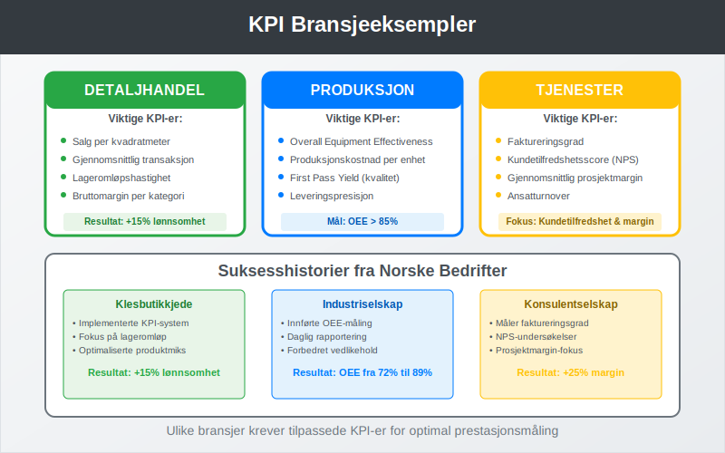

**KPI** (Key Performance Indicators) er målbare verdier som viser hvor effektivt en bedrift oppnår sine viktigste forretningsmål. I [regnskap](/blogs/regnskap/hva-er-regnskap "Hva er Regnskap? Komplett Guide til Regnskapsføring og Bokføring") og finansiell analyse brukes KPI-er for å evaluere bedriftens prestasjon, identifisere forbedringsområder og støtte strategiske beslutninger.

## Hva er KPI?

**Key Performance Indicators** er kvantifiserbare målinger som brukes til å evaluere suksessen til en organisasjon eller aktivitet. KPI-er fungerer som et **dashboard** for ledelsen og gir innsikt i bedriftens helse og retning.


### Kjennetegn ved Gode KPI-er:

* **MÃ¥lbare:** Kan kvantifiseres med tall og data
* **Relevante:** Direkte knyttet til forretningsmål
* **Tidsbaserte:** Har klare tidsrammer for måling
* **Handlingsrettede:** Kan påvirkes gjennom konkrete tiltak
* **Sammenlignbare:** Kan benchmarkes mot bransje eller historiske data

## Typer KPI-er i Regnskap og Finans

KPI-er kan kategoriseres på flere måter avhengig av deres formål og anvendelsesområde.


### Finansielle KPI-er

Disse måler bedriftens økonomiske prestasjon og er ofte basert på data fra [finansregnskap](/blogs/regnskap/hva-er-finansregnskap "Hva er Finansregnskap? Komplett Guide til Årsregnskap og Rapportering").

| KPI | Formel | Formål |
|-----|--------|--------|
| **[Egenkapitalrentabilitet](/blogs/regnskap/hva-er-egenkapitalrentabilitet "Hva er Egenkapitalrentabilitet? Beregning og Analyse av ROE")** | Årsresultat / Gjennomsnittlig [egenkapital](/blogs/regnskap/hva-er-egenkapital "Hva er Egenkapital? Definisjon, Beregning og Betydning i Regnskap") | Måler avkastning på eiernes investering |
| **Bruttomargin** | ([Driftsinntekter](/blogs/regnskap/hva-er-driftsinntekter "Hva er Driftsinntekter? Definisjon og Regnskapsføring") - [Driftskostnader](/blogs/regnskap/hva-er-driftskostnader "Hva er Driftskostnader? Oversikt og Regnskapsføring")) / Driftsinntekter | Viser lønnsomhet før faste kostnader |
| **[Arbeidskapital](/blogs/regnskap/hva-er-arbeidskapital "Hva er Arbeidskapital? Beregning og Betydning for Likviditet")** | Omløpsmidler - Kortsiktig gjeld | Måler kortsiktig likviditet |
| **Gjeldsgrad** | Total gjeld / Total [aktiva](/blogs/regnskap/hva-er-aktiva "Hva er Aktiva? Komplett Guide til Eiendeler i Balansen") | Viser finansiell risiko |

### Operasjonelle KPI-er

Disse fokuserer på driftseffektivitet og prosessoptimalisering.

* **Kundetilfredshet:** Målt gjennom undersøkelser og tilbakemeldinger
* **Leveringspresisjon:** Andel leveranser i tide
* **Produktivitet per ansatt:** Omsetning eller produksjon per ansatt
* **Kvalitetsindekser:** Feilrate, reklamasjoner, returandel

### Strategiske KPI-er

Disse måler fremgang mot langsiktige mål og strategier.

* **Markedsandel:** Bedriftens andel av totalmarkedet
* **Kundelojalitet:** Gjenkjøpsrate og kundelivstidsverdi
* **Innovasjonsindeks:** Andel inntekter fra nye produkter
* **Bærekraftsmål:** [ESG](/blogs/regnskap/hva-er-esg "Hva er ESG? Environmental, Social & Governance i Regnskap")-relaterte målinger

## KPI-er i Regnskapsanalyse

Regnskapsdata danner grunnlaget for mange av de viktigste KPI-ene som brukes i bedriftsstyring.


### Lønnsomhets-KPI-er

**[Driftsresultat](/blogs/regnskap/hva-er-driftsresultat "Hva er Driftsresultat? Beregning og Betydning i Resultatregnskap")** er en sentral KPI som viser bedriftens evne til å generere overskudd fra kjernevirksomheten.

**Beregning av viktige lønnsomhets-KPI-er:**

```
EBITDA = Driftsresultat + Avskrivninger + Amortisering
EBITDA-margin = EBITDA / Driftsinntekter × 100%
Netto fortjenestemargin = Årsresultat / Driftsinntekter × 100%
```

### Likviditets-KPI-er

Disse måler bedriftens evne til å møte kortsiktige forpliktelser.

| KPI | Beregning | Tolkning |
|-----|-----------|----------|
| **Likviditetsgrad 1** | Omløpsmidler / Kortsiktig gjeld | > 2,0 = God likviditet |
| **Likviditetsgrad 2** | (Omløpsmidler - Varelager) / Kortsiktig gjeld | > 1,0 = Akseptabel |
| **[Kontantstrøm](/blogs/regnskap/hva-er-kontantstrom "Hva er Kontantstrøm? Analyse og Beregning av Cash Flow")** | Kontantstrøm fra drift | Positiv = Sunn drift |

### Effektivitets-KPI-er

Disse måler hvor effektivt bedriften bruker sine ressurser.

* **Omløpshastighet varelager:** Varekostnad / Gjennomsnittlig varelager
* **[Debitor](/blogs/regnskap/hva-er-debitor "Hva er Debitor? Kundefordringer og Regnskapsføring")omløp:** Kreditsalg / Gjennomsnittlige kundefordringer
* **Aktivaomsetning:** Driftsinntekter / Gjennomsnittlige totale aktiva

## Implementering av KPI-system

En systematisk tilnærming til KPI-implementering sikrer at målsystemet støtter bedriftens strategiske mål.


### Trinn 1: Definere Strategiske MÃ¥l

* Identifiser bedriftens hovedmål og prioriteringer
* Koble KPI-er til spesifikke forretningsmål
* Sikre at KPI-ene støtter [forretningsplanen](/blogs/regnskap/hva-er-forretningsplan "Hva er en Forretningsplan? Guide til Utarbeidelse og Innhold")

### Trinn 2: Velge Relevante KPI-er

**Kriterier for KPI-valg:**

* PÃ¥virker kritiske suksessfaktorer
* Kan måles nøyaktig og konsistent
* Forstås av alle relevante interessenter
* Kan påvirkes gjennom konkrete handlinger

### Trinn 3: Etablere MÃ¥lverdier

* Sett realistiske, men ambisiøse mål
* Bruk historiske data som utgangspunkt
* Sammenlign med bransjestandarder
* Definer akseptable variasjonsområder

### Trinn 4: Implementere MÃ¥lesystem

* Etabler datainnsamlingsrutiner
* Implementer rapporteringssystemer
* Tren personalet i KPI-bruk
* Integrer med eksisterende [ERP-system](/blogs/regnskap/hva-er-erp-system "Hva er ERP-system? Enterprise Resource Planning Forklart")

## KPI Dashboard og Rapportering

Effektiv visualisering og rapportering av KPI-er er avgjørende for deres nytteverdi.


### Elementer i et Godt KPI Dashboard:

* **Sanntidsdata:** Oppdaterte målinger
* **Trendanalyse:** Historisk utvikling
* **Benchmarking:** Sammenligning med mål og konkurrenter
* **Varslingssystem:** Automatiske advarsler ved avvik
* **Drill-down funksjonalitet:** Mulighet for detaljert analyse

### Rapporteringsfrekvens:

| KPI-type | Rapporteringsfrekvens | Eksempler |
|----------|----------------------|-----------|
| **Operasjonelle** | Daglig/Ukentlig | Salg, produksjon, kvalitet |
| **Finansielle** | Månedlig/Kvartalsvis | Lønnsomhet, likviditet, gjeld |
| **Strategiske** | Kvartalsvis/Ã…rlig | Markedsandel, kundelojalitet |

## Praktiske Eksempler fra Norske Bedrifter

La oss se på hvordan ulike bransjer bruker KPI-er i praksis.



### Eksempel 1: Detaljhandel

**Situasjon:** En norsk klesbutikkjede ønsker å forbedre lønnsomheten.

**Viktige KPI-er:**
* Salg per kvadratmeter
* Gjennomsnittlig transaksjonsstørrelse
* Lageromløpshastighet
* Bruttomargin per produktkategori

**Resultat:** 15% økning i lønnsomhet gjennom optimalisering av produktmiks og lagerrotasjon.

### Eksempel 2: Produksjonsbedrift

**Situasjon:** Et industriselskap fokuserer på operasjonell effektivitet.

**Viktige KPI-er:**
* Overall Equipment Effectiveness (OEE)
* Produksjonskostnad per enhet
* Kvalitetsrate (First Pass Yield)
* Leveringspresisjon

**Implementering:**
```
OEE = Tilgjengelighet × Ytelse × Kvalitet
MÃ¥lsetting: OEE > 85%
MÃ¥lefrekvens: Daglig rapportering
```

### Eksempel 3: Tjenestebedrift

**Situasjon:** Et konsulentselskap ønsker å måle kundetilfredshet og lønnsomhet.

**Viktige KPI-er:**
* Faktureringsgrad (billable hours ratio)
* Kundetilfredshetsscore (NPS)
* Gjennomsnittlig prosjektmargin
* Ansatturnover

## Utfordringer og Fallgruver

Implementering av KPI-systemer kan møte flere utfordringer som må håndteres proaktivt.


### Vanlige Fallgruver:

* **For mange KPI-er:** Fokus blir utvannet
* **Feil KPI-er:** MÃ¥ler aktivitet i stedet for resultater
* **Manglende oppfølging:** KPI-er blir ikke brukt til beslutninger
* **Statiske mål:** Justeres ikke etter endrede forhold
* **Silotenkning:** KPI-er optimaliseres isolert

### Beste Praksis:

* **Begrens antallet:** Maksimalt 5-7 hovedKPI-er per nivå
* **Balansert tilnærming:** Kombiner finansielle og ikke-finansielle målinger
* **Regelmessig gjennomgang:** Vurder relevans og justér ved behov
* **Involver organisasjonen:** Sikre forståelse og engasjement
* **Koble til insentiver:** Knytt KPI-er til belønningssystemer

## KPI-er og Digitalisering

Moderne teknologi har revolusjonert hvordan KPI-er samles inn, analyseres og rapporteres.


### Teknologiske Muligheter:

* **Automatisk datainnsamling:** Integrasjon med forretningssystemer
* **Sanntidsrapportering:** Umiddelbar tilgang til oppdaterte data
* **Prediktiv analyse:** Bruk av AI for å forutsi trender
* **Mobilrapportering:** Tilgang til KPI-er på mobile enheter
* **Selvbetjening:** Brukere kan lage egne rapporter

### Integrasjon med Regnskapssystemer:

Moderne [regnskapssystemer](/blogs/regnskap/hva-er-regnskap "Hva er Regnskap? Komplett Guide til Regnskapsføring og Bokføring") kan automatisk generere mange finansielle KPI-er:

* Automatisk beregning av nøkkeltall
* Integrasjon med [bankavstemming](/blogs/regnskap/hva-er-bankavstemming "Hva er Bankavstemming? Guide til Kontroll og Avstemming av Bankkonti")
* Kobling til [bilagshåndtering](/blogs/regnskap/hva-er-bilag "Hva er Bilag i Regnskap? Typer, Krav og Oppbevaring")
* Sanntids [kontantstrømanalyse](/blogs/regnskap/hva-er-kontantstromanalyse "Hva er Kontantstrømanalyse? Metoder og Praktisk Anvendelse")

## Fremtiden for KPI-er

KPI-landskapet utvikler seg kontinuerlig med nye teknologier og forretningsmodeller.

### Emerging Trends:

* **ESG-KPI-er:** Økt fokus på bærekraft og samfunnsansvar
* **Sanntids-KPI-er:** Umiddelbar måling og respons
* **AI-drevne innsikter:** Maskinlæring for mønstergjenkjenning
* **Prediktive KPI-er:** Fremtidsrettede målinger
* **Stakeholder-KPI-er:** Bredere perspektiv på verdiskaping

### Regulatoriske Utviklinger:

Med innføringen av [CSRD](/blogs/regnskap/hva-er-csrd "Hva er CSRD? Corporate Sustainability Reporting Directive Forklart") og økt fokus på [EU-taksonomien](/blogs/regnskap/hva-er-eu-taksonomien "Hva er EU-taksonomien? Guide til Bærekraftsklassifisering"), blir bærekrafts-KPI-er stadig viktigere for norske bedrifter.

## Konklusjon

**KPI-er** er uunnværlige verktøy for moderne bedriftsledelse og regnskapsanalyse. De gir objektive målinger av prestasjon, støtter strategiske beslutninger og muliggjør kontinuerlig forbedring.

### Nøkkelpunkter for Suksess:

* Velg KPI-er som støtter strategiske mål
* Balanser finansielle og operasjonelle målinger
* Implementer robuste måle- og rapporteringssystemer
* Involver organisasjonen i KPI-prosessen
* Gjennomgå og justér KPI-er regelmessig

Ved å følge beste praksis og unngå vanlige fallgruver, kan norske bedrifter bruke KPI-er til å drive forbedret prestasjon og langsiktig verdiskaping.


Effektiv bruk av KPI-er krever en helhetlig tilnærming som kombinerer strategisk tenkning, teknologisk støtte og organisatorisk engasjement. Med riktig implementering blir KPI-er en kraftig motor for bedriftens vekst og suksess.
