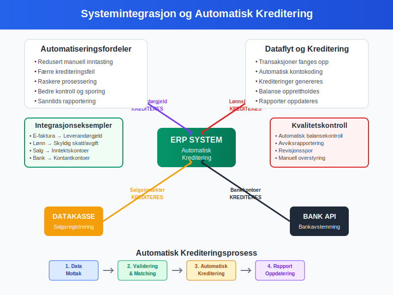

**Kreditere** er en fundamental handling i [dobbelt bokføring](/blogs/regnskap/hva-er-dobbel-bokforing "Hva er Dobbel Bokføring? Komplett Guide til Dobbelt Bokføringssystem") som innebærer å registrere et beløp på høyre side av en konto. Sammen med [debet](/blogs/regnskap/hva-er-debet "Hva er Debet i Regnskap? Komplett Guide til Debetposter og Bokføring") utgjør kreditering grunnlaget for all systematisk [bokføring](/blogs/regnskap/hva-er-bokforing "Hva er Bokføring? En Komplett Guide til Norsk Bokføringspraksis") og [kontering](/blogs/regnskap/hva-er-kontering "Hva er Kontering? En Komplett Guide til Kontokoding i Regnskap").

Kreditering er ikke bare en teknisk prosess, men en kritisk komponent som sikrer at [regnskapsligningen](/blogs/regnskap/hva-er-regnskap "Hva er Regnskap? En Dybdeanalyse for Norge") alltid balanserer og at finansiell rapportering følger [god regnskapsskikk](/blogs/regnskap/god-regnskapsskikk "God Regnskapsskikk - Prinsipper, Standarder og Beste Praksis i Norge").

For mer informasjon om teknisk utførelse av **debitere** kontoer, se [Debitere](/blogs/regnskap/debitere "Debitere i Regnskap? En Komplett Guide til Debitering av Kontoer").


## Grunnleggende Prinsipper for Kreditering

### Etymologi og Historisk Bakgrunn

Begrepet "kredit" kommer fra det latinske ordet *credere*, som betyr "å tro" eller "å betro". Dette reflekterer den historiske tilliten som var nødvendig i handelstransaksjoner hvor varer ble levert før betaling ble mottatt.

### Krediteringens Rolle i Dobbelt Bokføring

I [dobbelt bokføring](/blogs/regnskap/hva-er-dobbel-bokforing "Hva er Dobbel Bokføring? Komplett Guide til Dobbelt Bokføringssystem") må hver transaksjon registreres med minst én **debet** og én **kredit**, hvor den totale debetsummen alltid må være lik den totale kreditsummen. Dette sikrer at [regnskapsligningen](/blogs/regnskap/hva-er-regnskap "Hva er Regnskap? En Dybdeanalyse for Norge") (Eiendeler = Gjeld + Egenkapital) alltid balanserer.


## Krediteringsregler for Ulike Kontotyper

Forståelsen av når og hvordan man krediterer ulike kontotyper er avgjørende for korrekt [bokføring](/blogs/regnskap/hva-er-bokforing "Hva er Bokføring? En Komplett Guide til Norsk Bokføringspraksis"). Reglene varierer basert på kontotypen:

### Tabell: Krediteringsregler per Kontotype

| Kontotype | Kreditering Øker | Kreditering Reduserer | Eksempler |
|-----------|------------------|----------------------|-----------|
| **[Eiendeler](/blogs/regnskap/hva-er-aktiva "Hva er Aktiva? En Komplett Guide til Eiendeler i Regnskap")** | Nei | Ja | Bankinnskudd, varelager, maskiner |
| **[Gjeld](/blogs/regnskap/hva-er-gjeld "Hva er Gjeld i Regnskap? Komplett Guide til Forpliktelser og Gjeldstyper")** | Ja | Nei | Leverandørgjeld, banklån, skyldige skatter |
| **[Egenkapital](/blogs/regnskap/hva-er-egenkapital "Hva er Egenkapital? Komplett Guide til Egenkapital i Regnskap")** | Ja | Nei | Aksjekapital, opptjent egenkapital |
| **[Inntekter](/blogs/regnskap/hva-er-inntekter "Hva er Inntekter? Komplett Guide til Inntektstyper og Regnskapsføring")** | Ja | Nei | Salgsinntekter, renteinntekter |
| **Kostnader** | Nei | Ja | Lønn, husleie, [driftskostnader](/blogs/regnskap/hva-er-driftskostnader "Hva er Driftskostnader? Typer, Beregning og Regnskapsføring - Komplett Guide") |

### Detaljerte Krediteringsregler

#### 1. Kreditering av Eiendelskontoer

Når du **krediterer** en eiendelskonto, **reduserer** du eiendelens verdi. Dette skjer typisk når:

* Kontanter brukes til å betale regninger
* Varelager selges til kunder
* [Avskrivning](/blogs/regnskap/hva-er-avskrivning "Hva er Avskrivning? Komplett Guide til Avskrivninger i Norsk Regnskap") reduserer verdien av [anleggsmidler](/blogs/regnskap/hva-er-anleggsmidler "Hva er Anleggsmidler? Komplett Guide til Anleggsmidler i Regnskap")

**Eksempel:** Betaling av leverandørfaktura på 10 000 kr
```
Debet: Leverandørgjeld    10 000 kr
Kredit: Bankkonto         10 000 kr
```

#### 2. Kreditering av Gjeldskontoer

Kreditering av [gjeldskontoer](/blogs/regnskap/hva-er-gjeld "Hva er Gjeld i Regnskap? Komplett Guide til Forpliktelser og Gjeldstyper") **øker** gjeldsbeløpet. Dette skjer når:

* Nye lån tas opp
* [Fakturaer](/blogs/regnskap/hva-er-en-faktura "Hva er en Faktura? En Guide til Norske Fakturakrav") mottas fra leverandører
* Påløpte kostnader registreres

**Eksempel:** Mottak av leverandørfaktura på 15 000 kr
```
Debet: Varekjøp          15 000 kr
Kredit: Leverandørgjeld  15 000 kr
```

#### 3. Kreditering av Egenkapitalkontoer

Kreditering av [egenkapitalkontoer](/blogs/regnskap/hva-er-egenkapital "Hva er Egenkapital? Komplett Guide til Egenkapital i Regnskap") **øker** egenkapitalen. Dette inkluderer:

* Innskudd av ny [aksjekapital](/blogs/regnskap/hva-er-aksjekapital "Hva er Aksjekapital? Komplett Guide til Aksjekapital i Norge")
* Tilbakeholdt overskudd
* Kapitalinnskudd

#### 4. Kreditering av Inntektskontoer

[Inntektskontoer](/blogs/regnskap/hva-er-inntekter "Hva er Inntekter? Komplett Guide til Inntektstyper og Regnskapsføring") krediteres når inntekter **opptjenes**. Dette følger periodiseringsprinsippet i [god regnskapsskikk](/blogs/regnskap/god-regnskapsskikk "God Regnskapsskikk - Prinsipper, Standarder og Beste Praksis i Norge").

**Eksempel:** Salg av varer for 25 000 kr
```
Debet: Kundefordringer   25 000 kr
Kredit: Salgsinntekter   25 000 kr
```

## Praktiske Eksempler på Kreditering

### Eksempel 1: Komplett Salgstransaksjon

En bedrift selger varer for 50 000 kr (ekskl. mva) med 25% [mva](/blogs/regnskap/hva-er-avgiftsplikt-mva "Hva er Avgiftsplikt MVA? Komplett Guide til Merverdiavgift i Norge"):


```
Debet: Kundefordringer        62 500 kr
Kredit: Salgsinntekter        50 000 kr
Kredit: Utgående MVA          12 500 kr
```

### Eksempel 2: Lønnsutbetaling

Utbetaling av lønn på 40 000 kr med [forskuddstrekk](/blogs/regnskap/hva-er-forskuddstrekk "Hva er Forskuddstrekk? Komplett Guide til Forskuddstrekk i Norge") på 8 000 kr:

```
Debet: Lønnskostnad           40 000 kr
Kredit: Skyldig forskuddstrekk 8 000 kr
Kredit: Bankkonto             32 000 kr
```

### Eksempel 3: Avskrivning av Anleggsmidler

Månedlig [avskrivning](/blogs/regnskap/hva-er-avskrivning "Hva er Avskrivning? Komplett Guide til Avskrivninger i Norsk Regnskap") av maskiner på 5 000 kr:

```
Debet: Avskrivningskostnad    5 000 kr
Kredit: Akkumulerte avskrivninger  5 000 kr
```

## Kreditering og Kontering

**[Kontering](/blogs/regnskap/hva-er-kontering "Hva er Kontering? En Komplett Guide til Kontokoding i Regnskap")** er prosessen med å tildele riktig kontonummer til hver debet- og kreditpostering. Korrekt kontering sikrer at krediteringer registreres på riktige kontoer i [kontoplanen](/blogs/regnskap/hva-er-kontoplan "Hva er Kontoplan? Komplett Guide til Kontoplan i Norsk Regnskap").

### Konteringseksempel med Kreditering

For en innkjøpsfaktura på 20 000 kr + 5 000 kr mva:


| Beskrivelse | Kontonummer | Debet | Kredit |
|-------------|-------------|-------|--------|
| Varekjøp | 4005 | 20 000 | - |
| Inngående MVA | 2701 | 5 000 | - |
| Leverandørgjeld | 2400 | - | 25 000 |

## Vanlige Feil ved Kreditering

### 1. Feil Krediteringsretning

**Problem:** Kreditere en eiendelskonto når den skulle økes
**Løsning:** Husk at eiendeler øker med debet, ikke kredit

### 2. Manglende Balanse

**Problem:** Total debet ≠ total kredit
**Løsning:** Bruk [avstemming](/blogs/regnskap/hva-er-avstemming "Hva er Avstemming? Komplett Guide til Regnskapsavstemming") for å identifisere ubalanser

### 3. Feil Kontering

**Problem:** Kreditere feil konto
**Løsning:** Følg systematisk [kontoplan](/blogs/regnskap/hva-er-kontoplan "Hva er Kontoplan? Komplett Guide til Kontoplan i Norsk Regnskap") og kontroller

## Kreditering i Moderne Regnskapssystemer

### Automatisk Kreditering

Moderne [ERP-systemer](/blogs/regnskap/hva-er-erp-system "Hva er ERP System? Komplett Guide til Enterprise Resource Planning") automatiserer mange krediteringsprosesser:

* **Automatisk MVA-beregning:** Systemet krediterer automatisk MVA-kontoer
* **Periodisering:** Automatisk kreditering av påløpte kostnader
* **[Bankavstemming](/blogs/regnskap/hva-er-bankavstemming "Hva er Bankavstemming? Komplett Guide til Bankavstemming i Regnskap"):** Automatisk matching og kreditering

### Integrasjon med Eksterne Systemer



* **[E-faktura](/blogs/regnskap/hva-er-efaktura "Hva er E-faktura? Komplett Guide til Elektronisk Fakturering"):** Automatisk kreditering av leverandørgjeld
* **Lønnssystemer:** Automatisk kreditering av lønnsrelaterte kontoer
* **[Datakasse](/blogs/regnskap/hva-er-datakasse "Hva er Datakasse? Komplett Guide til Kassasystem, Krav og Regnskapsføring"):** Automatisk kreditering av salgsinntekter

## Kreditering og Finansiell Rapportering

### Påvirkning på Finansregnskapet

Korrekt kreditering påvirker direkte [finansregnskapet](/blogs/regnskap/hva-er-finansregnskap "Hva er Finansregnskap? En Komplett Guide til Ekstern Finansiell Rapportering"):

#### Resultatregnskap
* **Kreditering av inntektskontoer** øker totale inntekter
* **Kreditering av kostnadskontoer** reduserer totale kostnader

#### Balanse
* **Kreditering av gjeldskontoer** øker total gjeld
* **Kreditering av egenkapitalkontoer** øker total egenkapital
* **Kreditering av eiendelskontoer** reduserer totale eiendeler

### Kontroll og Kvalitetssikring


#### MÃ¥nedlige Kontroller
* **Saldobalanse:** Verifiser at total debet = total kredit
* **Kontoanalyse:** Gjennomgå alle krediteringer per konto
* **Avstemming:** Sammenlign med eksterne kilder

#### Ã…rlige Kontroller
* **[Revisjon](/blogs/regnskap/hva-er-revisjon "Hva er Revisjon? Komplett Guide til Revisjon og Revisorplikter"):** Ekstern kontroll av krediteringspraksis
* **Internkontroll:** Evaluering av krediteringsprosedyrer

## Kreditering i Spesielle Situasjoner

### 1. Valutakursdifferanser

Ved transaksjoner i utenlandsk valuta kan det oppstå kursdifferanser som krever spesiell krediteringsbehandling:

```
Debet: Kundefordringer (NOK)     105 000 kr
Kredit: Salgsinntekter (NOK)     100 000 kr
Kredit: Kursgevinst               5 000 kr
```

### 2. Kreditnotaer

NÃ¥r kreditnotaer utstedes, reverseres den opprinnelige krediteringen:

**Opprinnelig salg:**
```
Debet: Kundefordringer    25 000 kr
Kredit: Salgsinntekter    25 000 kr
```

**Kreditnota:**
```
Debet: Salgsinntekter     25 000 kr
Kredit: Kundefordringer   25 000 kr
```

### 3. Avsetninger og Estimater

Kreditering av avsetningskontoer for fremtidige forpliktelser:

```
Debet: Avsetningskostnad     50 000 kr
Kredit: Avsetning for garanti 50 000 kr
```

## Beste Praksis for Kreditering

### 1. Systematisk Tilnærming

* **Bruk standardiserte prosedyrer** for alle krediteringer
* **Dokumenter alle transaksjoner** med tilstrekkelige [bilag](/blogs/regnskap/hva-er-bilag "Hva er Bilag i Regnskap? Komplett Guide til Regnskapsbilag og Dokumentasjon")
* **Følg [bokføringsloven](/blogs/regnskap/hva-er-bokforingsloven "Hva er Bokføringsloven? Komplett Guide til Norsk Bokføringslovgivning")** og [bokføringsforskriften](/blogs/regnskap/hva-er-bokforingsforskriften "Hva er Bokføringsforskriften? Detaljert Guide til Norske Bokføringsregler")

### 2. Kvalitetskontroll

* **Dobbeltsjekk alle krediteringer** før registrering
* **Utfør regelmessige avstemminger** av alle kontoer
* **Implementer fireøyesprinsippet** for større transaksjoner

### 3. Teknologisk Støtte

* **Bruk moderne regnskapssystemer** med innebygde kontroller
* **Automatiser rutinekrediteringer** hvor mulig
* **Implementer elektronisk [bilagsbehandling](/blogs/regnskap/hva-er-bilagsforing "Hva er Bilagsføring? Komplett Guide til Bilagsføring i Regnskap")**

## Sammenheng med Andre Regnskapskonsepter

### Kreditering og Periodisering

Kreditering følger **periodiseringsprinsippet**, hvor transaksjoner registreres når de oppstår, ikke nødvendigvis når kontanter utveksles. Dette er fundamentalt for [god regnskapsskikk](/blogs/regnskap/god-regnskapsskikk "God Regnskapsskikk - Prinsipper, Standarder og Beste Praksis i Norge").

### Kreditering og Kontantstrøm

Mens kreditering påvirker [resultatregnskapet](/blogs/regnskap/hva-er-driftsregnskap "Hva er Driftsregnskap? Komplett Guide til Driftsregnskapet i Norge"), påvirker det ikke nødvendigvis [kontantstrømmen](/blogs/regnskap/hva-er-kontantstrom "Hva er Kontantstrøm? Komplett Guide til Kontantstrømanalyse") samtidig.


## Konklusjon

**Kreditering** er en fundamental komponent i [dobbelt bokføring](/blogs/regnskap/hva-er-dobbel-bokforing "Hva er Dobbel Bokføring? Komplett Guide til Dobbelt Bokføringssystem") som sikrer nøyaktig og balansert [regnskapsføring](/blogs/regnskap/hva-er-regnskap "Hva er Regnskap? En Dybdeanalyse for Norge"). Forståelse av krediteringsprinsipper, kombinert med korrekt [kontering](/blogs/regnskap/hva-er-kontering "Hva er Kontering? En Komplett Guide til Kontokoding i Regnskap"), er avgjørende for å opprettholde [god regnskapsskikk](/blogs/regnskap/god-regnskapsskikk "God Regnskapsskikk - Prinsipper, Standarder og Beste Praksis i Norge") og produsere pålitelige finansielle rapporter.

Ved å følge systematiske prosedyrer, implementere kvalitetskontroller og utnytte moderne teknologi, kan bedrifter sikre at deres krediteringspraksis støtter både daglig drift og langsiktig finansiell planlegging.
