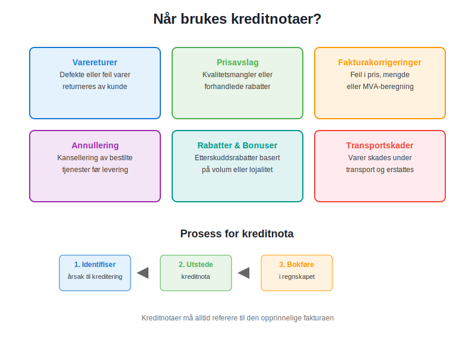
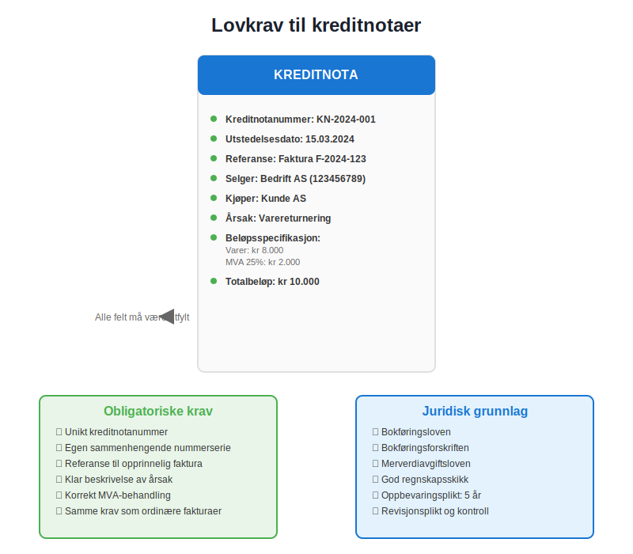
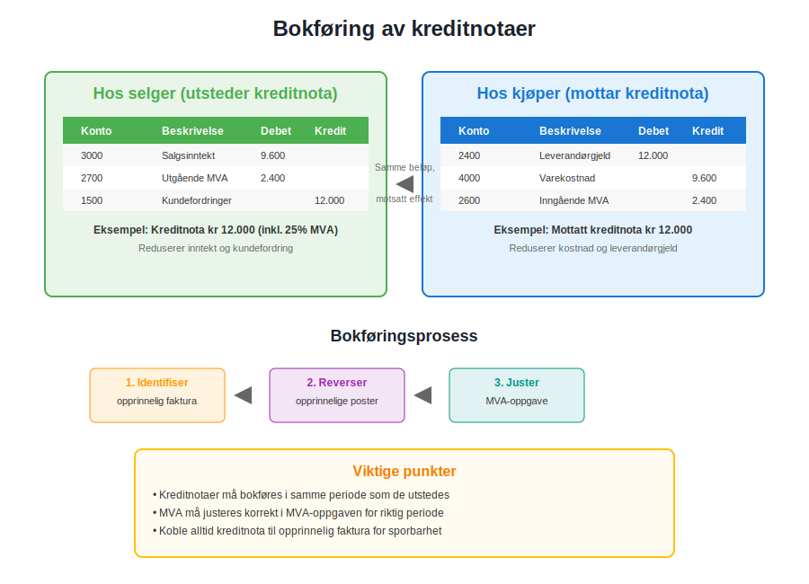
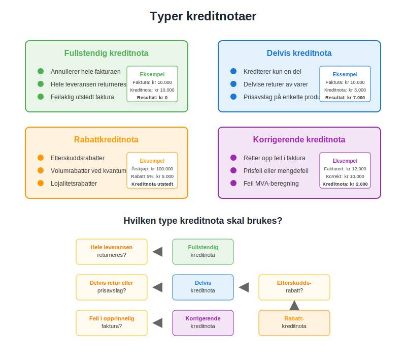

---
title: "Hva er en kreditnota?"
seoTitle: "Hva er en kreditnota?"
description: 'En kreditnota er et regnskapsdokument som reduserer eller annullerer en tidligere faktura, brukt ved retur, prisavslag eller korrigering av feil.'
summary: 'Definisjon av kreditnota, når den brukes, lovkrav til innhold og hvordan kreditnota bokføres hos selger og kjøper.'
---

En **kreditnota** er et regnskapsdokument som fungerer som en "negativ faktura" - den reduserer eller annullerer helt eller delvis en tidligere utstedt [faktura](/blogs/regnskap/hva-er-en-faktura "Hva er en Faktura? En Guide til Norske Fakturakrav"). Kreditnotaer er essensielle verktøy i moderne [bokføring](/blogs/regnskap/hva-er-bokforing "Hva er Bokføring? Komplett Guide til Regnskapsføring i Norge") og spiller en kritisk rolle i korrekt regnskapsbehandling av returer, prisavslag og fakturakorrigeringer. I norsk regnskap må kreditnotaer følge samme lovkrav som ordinære fakturaer og er regulert av [bokføringsloven](/blogs/regnskap/hva-er-bokforingsloven "Hva er Bokføringsloven? Komplett Guide til Norsk Regnskapslovgivning").

## Seksjon 1: Når Brukes Kreditnotaer?

Kreditnotaer utstedes i flere spesifikke situasjoner hvor det er nødvendig å korrigere eller reversere en tidligere fakturert transaksjon. Dette er særlig viktig for å opprettholde korrekt [internkontroll](/blogs/regnskap/hva-er-internkontroll "Hva er Internkontroll? Komplett Guide til Internkontrollsystemer") og sikre nøyaktig regnskapsføring.

### 1.1 Hovedårsaker til Utstedelse av Kreditnotaer

* **Varereturer:** Når kunder returnerer defekte, feil eller uønskede varer
* **Prisavslag:** Ved kvalitetsmangler eller forhandlede rabatter etter levering
* **Fakturakorrigeringer:** Når det oppdages feil i pris, mengde eller [merverdiavgift](/blogs/regnskap/hva-er-avgiftsplikt-mva "Hva er Avgiftsplikt (MVA)? Komplett Guide til Merverdiavgift i Norge")
* **Annullering av tjenester:** Ved kansellering av bestilte tjenester før levering
* **Rabatter og bonuser:** Etterskuddsrabatter basert på volum eller lojalitet
* **Transportskader:** Når varer skades under transport og erstattes

### 1.2 Forskjell Mellom Kreditnota og Faktura

| Aspekt | Faktura | Kreditnota |
|--------|---------|------------|
| **Formål** | Krever betaling for varer/tjenester | Reduserer eller annullerer tidligere krav |
| **Beløp** | Positivt beløp | Negativt beløp (kreditering) |
| **Regnskapseffekt** | Øker inntekt og kundefordring | Reduserer inntekt og kundefordring |
| **MVA-behandling** | Utgående MVA | Reduserer utgående MVA |
| **Referanse** | Selvstendig dokument | Må referere til opprinnelig faktura |

## Seksjon 2: Lovkrav til Kreditnotaer

I Norge er kreditnotaer underlagt samme juridiske krav som ordinære [fakturaer](/blogs/regnskap/hva-er-en-faktura "Hva er en Faktura? En Guide til Norske Fakturakrav"), med noen tilleggskrav som sikrer sporbarhet og korrekt regnskapsbehandling.

### 2.1 Obligatoriske Opplysninger

En gyldig kreditnota må inneholde følgende informasjon i henhold til [bokføringsforskriften](/blogs/regnskap/hva-er-bokforingsforskriften "Hva er Bokføringsforskriften? Komplett Guide til Norske Bokføringsregler"):

* **Kreditnotanummer:** Unikt nummer i egen nummerserie
* **Utstedelsesdato:** Datoen kreditnotaen utstedes
* **Referanse til opprinnelig faktura:** [Fakturanummer](/blogs/regnskap/hva-er-fakturanummer "Hva er Fakturanummer? Komplett Guide til Nummerering og Lovkrav") og dato
* **Selgers identifikasjon:** Navn, adresse og organisasjonsnummer
* **Kjøpers identifikasjon:** Navn og adresse
* **Beskrivelse av årsak:** Klar forklaring på hvorfor kreditnota utstedes
* **Beløpsspecifikasjon:** Detaljert oppstilling av krediterte beløp
* **MVA-informasjon:** Kreditert MVA-beløp og sats
* **Totalbeløp:** Samlet kreditert beløp

### 2.2 Nummerering og Sporbarhet

Kreditnotaer må ha egen **sammenhengende nummerserie** som er adskilt fra ordinære fakturaer. Dette sikrer korrekt [bilagsregistrering](/blogs/regnskap/hva-er-bilagsregistrere "Hva er Bilagsregistrere? Komplett Guide til Systematisk Bilagsbehandling") og letter revisjonsarbeidet. Nummerserien må være:

* **Kronologisk:** Påfølgende numre uten hull
* **Unik:** Ikke gjenbrukt eller duplisert
* **Sporbar:** Lett å koble til opprinnelig faktura

## Seksjon 3: Bokføring av Kreditnotaer

Korrekt bokføring av kreditnotaer er kritisk for nøyaktig regnskapsføring og [avstemming](/blogs/regnskap/hva-er-avstemming "Hva er Avstemming? Komplett Guide til Regnskapsavstemming") av kundefordringer. Prosessen krever omvendt [kontering](/blogs/regnskap/hva-er-kontering "Hva er Kontering? Komplett Guide til Regnskapskontering") sammenlignet med den opprinnelige fakturaen.

### 3.1 Regnskapsføring hos Selger

Når en bedrift utsteder en kreditnota, må følgende [bilag](/blogs/regnskap/hva-er-bilag "Hva er Bilag? Komplett Guide til Regnskapsbilag og Dokumentasjon") registreres:

**Eksempel: Kreditnota på kr 12.000 (inkl. 25% MVA)**

| Konto | Beskrivelse | Debet | Kredit |
|-------|-------------|-------|--------|
| 3000 | Salgsinntekt | 9.600 | |
| 2700 | Utgående MVA | 2.400 | |
| 1500 | Kundefordringer | | 12.000 |

### 3.2 Regnskapsføring hos Kjøper

Når en kunde mottar en kreditnota, må den behandles som en [inngående faktura](/blogs/regnskap/innganende-faktura "Inngående Faktura - Komplett Guide til Mottak og Behandling av Leverandørfakturaer") med omvendt fortegn:

**Eksempel: Mottatt kreditnota på kr 12.000 (inkl. 25% MVA)**

| Konto | Beskrivelse | Debet | Kredit |
|-------|-------------|-------|--------|
| 2400 | Leverandørgjeld | 12.000 | |
| 4000 | Varekostnad | | 9.600 |
| 2600 | Inngående MVA | | 2.400 |

### 3.3 Behandling i Regnskapssystemer

Moderne regnskapssystemer håndterer kreditnotaer gjennom spesialiserte funksjoner som automatisk:

* Kobler kreditnota til opprinnelig faktura
* Beregner korrekt MVA-behandling
* Oppdaterer [kundefordringer](/blogs/regnskap/hva-er-ansattreskontro "Hva er Ansattreskontro? Komplett Guide til Kundeoppfølging og Fordringsstyring")
* Genererer nødvendige rapporter for MVA-oppgave

## Seksjon 4: Typer Kreditnotaer

Det finnes flere typer kreditnotaer som brukes i ulike forretningssituasjoner. Hver type har spesifikke anvendelsesområder og regnskapsmessige konsekvenser.

### 4.1 Fullstendig Kreditnota

En **fullstendig kreditnota** annullerer hele den opprinnelige fakturaen. Dette brukes når:

* Hele leveransen returneres
* Fakturaen var feilaktig utstedt
* Kontrakten kanselleres før levering

### 4.2 Delvis Kreditnota

En **delvis kreditnota** krediterer kun en del av den opprinnelige fakturaen:

* Delvise returer av varer
* Prisavslag på enkelte produkter
* Korrigering av mengdefeil

### 4.3 Rabattkreditnota

**Rabattkreditnotaer** utstedes for å gi etterskuddsrabatter:

* Volumrabatter ved oppnådd kvantum
* Sesongsrabatter
* Lojalitetsrabatter for gode kunder

### 4.4 Korrigerende Kreditnota

**Korrigerende kreditnotaer** retter opp feil i opprinnelig faktura:

* Prisfeil
* Mengdefeil
* Feil MVA-beregning
* Feil produktkoder

## Seksjon 5: Elektroniske Kreditnotaer

I takt med digitaliseringen av regnskapsføring blir elektroniske kreditnotaer stadig mer utbredt. Dette følger samme utvikling som [elektronisk fakturering](/blogs/regnskap/hva-er-elektronisk-fakturering "Hva er Elektronisk Fakturering? Komplett Guide til Digitale Fakturaløsninger") og gir betydelige effektivitetsgevinster.

### 5.1 Fordeler med Elektroniske Kreditnotaer

* **Raskere behandling:** Automatisk mottak og behandling
* **Reduserte feil:** Eliminerer manuelle registreringsfeil
* **Bedre sporbarhet:** Digital kobling til opprinnelig faktura
* **Kostnadsbesparelser:** Reduserte porto- og papirkostnader
* **Miljøvennlig:** Mindre papirforbruk

### 5.2 Integrasjon med Regnskapssystemer

Moderne [ERP-systemer](/blogs/regnskap/hva-er-erp-system "Hva er ERP-system? Komplett Guide til Enterprise Resource Planning") støtter automatisk behandling av elektroniske kreditnotaer gjennom:

* **[API-integrasjoner](/blogs/regnskap/api-integrasjon-automatisering-regnskap "API-integrasjon og Automatisering i Regnskap - Komplett Guide"):** Direkte datautveksling mellom systemer
* **EDI-standarder:** Strukturert elektronisk datautveksling
* **Automatisk matching:** Kobling til opprinnelige fakturaer
* **Workflow-styring:** Automatiserte godkjenningsprosesser

## Seksjon 6: Beste Praksis for Kreditnotaer

For å sikre korrekt håndtering av kreditnotaer og opprettholde god [internkontroll](/blogs/regnskap/hva-er-internkontroll "Hva er Internkontroll? Komplett Guide til Internkontrollsystemer"), bør bedrifter følge etablerte beste praksis-prinsipper.

### 6.1 Kontrollrutiner

Etabler klare **kontrollrutiner** for utstedelse av kreditnotaer:

* **Autorisasjon:** Kun autorisert personell kan utstede kreditnotaer
* **Dokumentasjon:** All utstedelse må dokumenteres med årsak
* **Godkjenning:** Kreditnotaer over visse beløp krever ledergodkjenning
* **Verifikasjon:** Kontroller mot opprinnelig faktura og leveringsdokumenter

### 6.2 Oppfølging og Rapportering

Implementer systematisk oppfølging av kreditnotaer:

* **Månedlige rapporter:** Oversikt over utstedte kreditnotaer
* **Trendanalyse:** Identifiser mønstre i returer og korrigeringer
* **Kundeanalyse:** Følg opp kunder med hyppige kreditnotaer
* **Leverandøroppfølging:** Ved mottatte kreditnotaer

### 6.3 Arkivering og Oppbevaring

Kreditnotaer må arkiveres i henhold til [bokføringsloven](/blogs/regnskap/hva-er-bokforingsloven "Hva er Bokføringsloven? Komplett Guide til Norsk Regnskapslovgivning"):

* **Oppbevaringstid:** Minimum 5 år fra regnskapsårets slutt
* **Digital arkivering:** Sikker lagring med backup-rutiner
* **Tilgjengelighet:** Lett tilgjengelig for revisjon og kontroll
* **Sporbarhet:** Klar kobling til relaterte dokumenter

## Seksjon 7: Vanlige Feil og Fallgruver

Mange bedrifter gjør typiske feil ved håndtering av kreditnotaer som kan få alvorlige konsekvenser for regnskapet og MVA-oppgaven.

### 7.1 Typiske Feil

* **Manglende referanse:** Ikke koble kreditnota til opprinnelig faktura
* **Feil MVA-behandling:** Ikke justere utgående MVA korrekt
* **Dobbel kreditering:** Utstede både kreditnota og kontant refusjon
* **Manglende dokumentasjon:** Ikke dokumentere årsak til kreditering
* **Feil kontering:** Bruke feil kontoer i regnskapet

### 7.2 Konsekvenser av Feil

Feil håndtering av kreditnotaer kan føre til:

* **MVA-avvik:** Feil rapportering til Skatteetaten
* **Regnskapsfeil:** Feil [driftsresultat](/blogs/regnskap/hva-er-driftsresultat "Hva er Driftsresultat? Komplett Guide til Driftsresultat og Lønnsomhetsanalyse")
* **Revisjonsmerknader:** Kritikk fra revisor
* **Skattemessige konsekvenser:** Potensielle tilleggsskatter

## Seksjon 8: Kreditnotaer og MVA

Kreditnotaer har direkte påvirkning på [merverdiavgiftsbehandlingen](/blogs/regnskap/hva-er-avgiftsplikt-mva "Hva er Avgiftsplikt (MVA)? Komplett Guide til Merverdiavgift i Norge") og må håndteres korrekt i MVA-oppgaven for å unngå avvik med Skatteetaten.

### 8.1 MVA-behandling ved Utstedelse

Når en bedrift utsteder en kreditnota:

* **Reduser utgående MVA:** Med kreditert MVA-beløp
* **Juster omsetning:** Reduser MVA-pliktig omsetning
* **Dokumenter endringen:** I MVA-oppgaven for riktig periode

### 8.2 MVA-behandling ved Mottak

Når en bedrift mottar en kreditnota:

* **Reduser inngående MVA:** Med kreditert MVA-beløp
* **Juster fradragsgrunnlag:** Reduser grunnlag for MVA-fradrag
* **Oppdater regnskapet:** Korriger kostnadskonto og MVA-konto

### 8.3 Periodisering og Timing

Kreditnotaer må behandles i **riktig MVA-periode**:

* **Utstedelsesdato:** Avgjørende for hvilken periode som påvirkes
* **Periodeavgrensning:** Sikre korrekt periodisering
* **Årsavslutning:** Spesiell oppmerksomhet ved årsskifte

## Konklusjon

Kreditnotaer er et essensielt verktøy i moderne regnskapsføring som sikrer korrekt behandling av returer, korrigeringer og prisavslag. Korrekt håndtering krever forståelse av lovkrav, regnskapsprinsipper og beste praksis. Ved å implementere gode rutiner for utstedelse, behandling og oppfølging av kreditnotaer, kan bedrifter opprettholde nøyaktig regnskapsføring og unngå kostbare feil.

For bedrifter som ønsker å optimalisere sin fakturabehandling, anbefales det å vurdere moderne digitale løsninger som automatiserer både [fakturering](/blogs/regnskap/hva-er-en-faktura "Hva er en Faktura? En Guide til Norske Fakturakrav") og kreditnotahåndtering. Dette reduserer ikke bare administrative kostnader, men forbedrer også nøyaktigheten og sporbarhet i regnskapsføringen.

