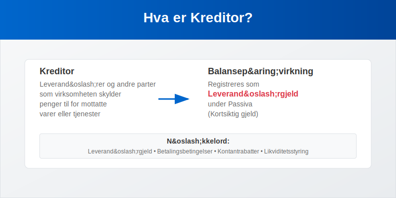
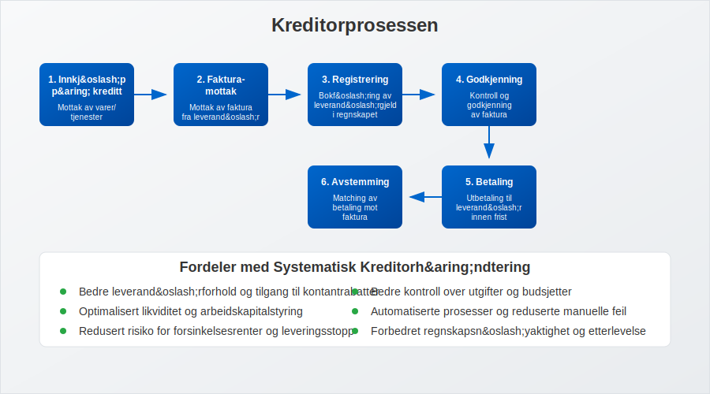
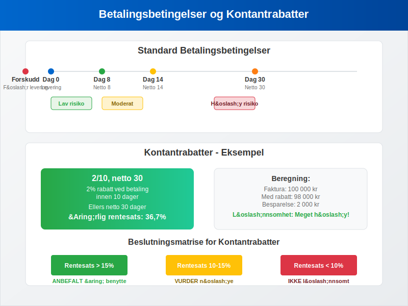
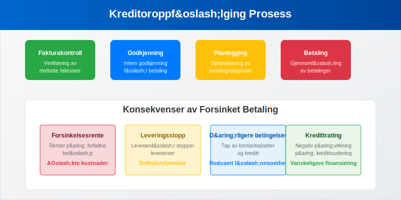
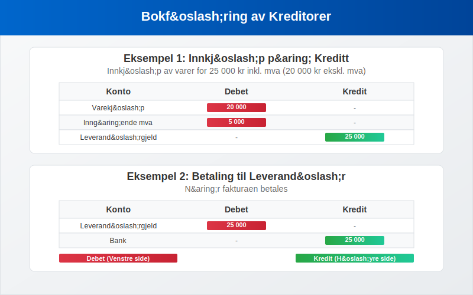
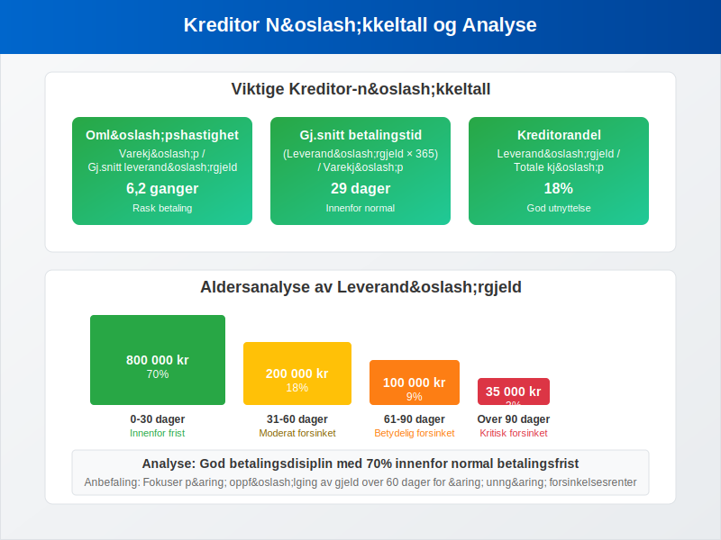
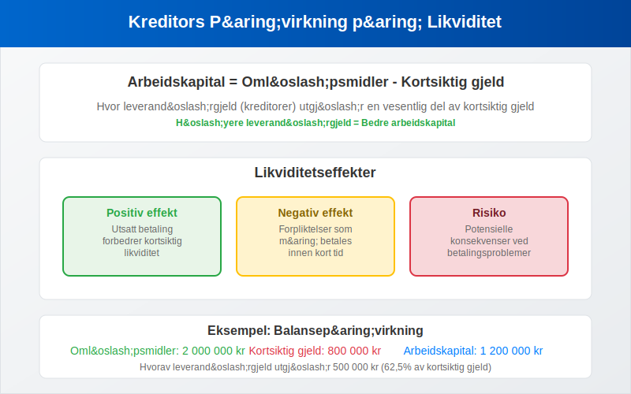
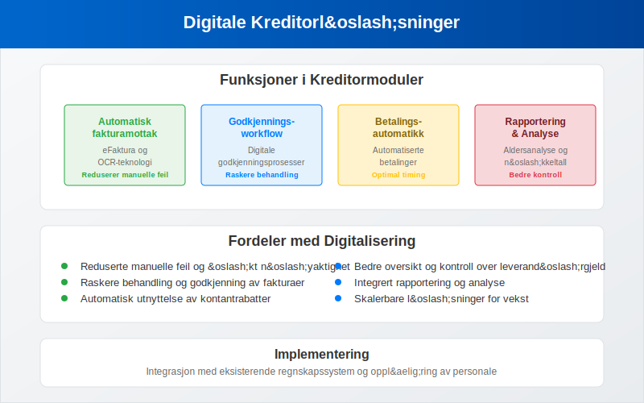
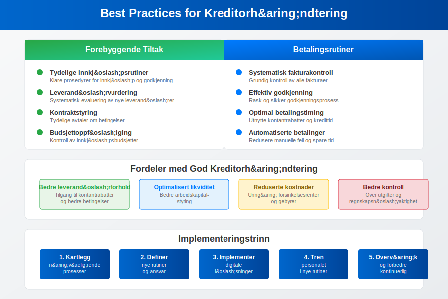
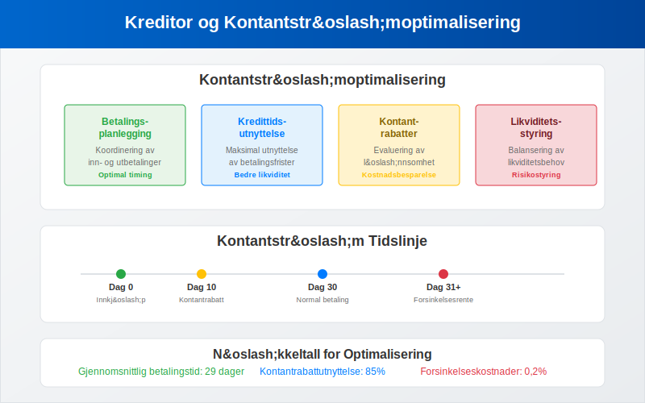

---
title: "Hva er kreditor?"
meta_title: "Hva er kreditor?"
meta_description: '**Kreditor** er et sentralt begrep i [regnskap](/blogs/regnskap/hva-er-regnskap "Hva er Regnskap? En Dybdeanalyse for Norge") og [bokføring](/blogs/regnskap/hv...'
slug: hva-er-kreditor
type: blog
layout: pages/single
---

**Kreditor** er et sentralt begrep i [regnskap](/blogs/regnskap/hva-er-regnskap "Hva er Regnskap? En Dybdeanalyse for Norge") og [bokføring](/blogs/regnskap/hva-er-bokforing "Hva er Bokføring? En Komplett Guide til Norsk Bokføringspraksis") som refererer til leverandører og andre parter som virksomheten skylder penger til for mottatte varer eller tjenester. Kreditor representerer leverandørgjeld og er en viktig del av selskapets [passiva](/blogs/regnskap/hva-er-gjeld "Hva er Gjeld? Komplett Guide til Gjeldshåndtering i Regnskap"). Effektiv kreditorhåndtering er avgjørende for å opprettholde gode leverandørforhold og optimalisere [arbeidskapital](/blogs/regnskap/hva-er-arbeidskapital "Hva er Arbeidskapital? Guide til Likviditetsstyring").

For en omfattende guide til **[leverandørstyring](/blogs/regnskap/hva-er-leverandor "Hva er Leverandør? Komplett Guide til Leverandørstyring og Leverandørforhold")** som dekker strategiske aspekter, kategorisering, risikostyring og digitalisering av leverandørforhold, se vår detaljerte artikkel om leverandører.

For detaljert informasjon om hvordan du systematisk håndterer og følger opp alle transaksjoner med leverandører, se vår guide til **[leverandørreskontro](/blogs/regnskap/hva-er-leverandorreskontro "Hva er Leverandørreskontro? Komplett Guide til Leverandørledger og Kreditoroppfølging")** som forklarer underreskontro-systemet for kreditorhåndtering.

## Hva er Kreditor?

Kreditor er en person eller virksomhet som din bedrift skylder penger til for varer eller tjenester som er mottatt, men ikke betalt. I regnskapssammenheng registreres kreditorer som **leverandørgjeld** på [balansen](/blogs/regnskap/hva-er-balanse "Hva er Balanse? Komplett Guide til Balanseregnskap") under kortsiktig gjeld. Kreditorposten oppstår når du kjøper på kreditt, det vil si at du mottar varene eller tjenestene før betaling skjer.

### Forskjellen mellom Kreditor og Debitor

Det er viktig å skille mellom kreditor og [debitor](/blogs/regnskap/hva-er-debitor "Hva er Debitor? Komplett Guide til Kundefordringer og Debitorhåndtering"):

| Begrep | Definisjon | Regnskapspost | Balanseplassering |
|--------|------------|---------------|-------------------|
| **Kreditor** | Leverandører du skylder penger | Leverandørgjeld | Passiva (kortsiktig gjeld) |
| **Debitor** | Kunder som skylder deg penger | Kundefordringer | Aktiva (omløpsmidler) |

## Kreditorprosessen

Kreditorprosessen starter når du mottar varer eller tjenester på kreditt og ender når betalingen er utført:

### Trinn i Kreditorprosessen

1. **Innkjøp på kreditt**: Mottak av varer/tjenester uten umiddelbar betaling
2. **[Fakturamottak](/blogs/regnskap/innganende-faktura "Hva er Inngående Faktura? Guide til Fakturabehandling")**: Mottak av faktura fra leverandør
3. **Registrering**: [Bokføring](/blogs/regnskap/hva-er-bokforing "Hva er Bokføring? En Komplett Guide til Norsk Bokføringspraksis") av leverandørgjeld
4. **Godkjenning**: Kontroll og godkjenning av faktura
5. **Betaling**: Utbetaling til leverandør
6. **Avstemming**: Matching av betaling mot faktura

## Betalingsbetingelser og Kredittid

**Betalingsbetingelser** definerer når og hvordan du skal betale leverandørene. Vanlige betalingsbetingelser i Norge inkluderer:

### Standard Betalingsbetingelser

| Betingelse | Beskrivelse | Betalingsfrist |
|------------|-------------|----------------|
| **Netto 8 dager** | Betaling innen 8 dager | 8 dager |
| **Netto 14 dager** | Betaling innen 14 dager | 14 dager |
| **Netto 30 dager** | Betaling innen 30 dager | 30 dager |
| **Kontant ved levering** | Betaling ved mottak | 0 dager |
| **Forskudd** | Betaling før levering | Negativ kredittid |

### Kontantrabatter

Mange leverandører tilbyr **kontantrabatter** for tidlig betaling:

| Rabattbetingelse | Beskrivelse | Ã…rlig rentesats |
|------------------|-------------|-----------------|
| **2/10, netto 30** | 2% rabatt ved betaling innen 10 dager, ellers netto 30 dager | 36,7% |
| **1/15, netto 45** | 1% rabatt ved betaling innen 15 dager, ellers netto 45 dager | 12,2% |
| **3/7, netto 21** | 3% rabatt ved betaling innen 7 dager, ellers netto 21 dager | 78,3% |

Disse betalingsbetingelsene er en sentral del av **[leverandørkreditt](/blogs/regnskap/hva-er-leverandorkreditt "Hva er Leverandørkreditt? Komplett Guide til Leverandørfinansiering")**, som representerer en av de mest utbredte formene for kortsiktig finansiering i næringslivet.

## Kreditoroppfølging og Betalingshåndtering

Systematisk oppfølging av kreditorer er essensielt for å opprettholde gode leverandørforhold og unngå [forsinkelsesrenter](/blogs/regnskap/hva-er-forsinkelsesrente "Hva er Forsinkelsesrente? Guide til Rentekostnader ved Forsinket Betaling"):

### Betalingsrutiner

1. **Fakturakontroll**: Verifisering av mottatte fakturaer
2. **Godkjenningsprosess**: Intern godkjenning før betaling
3. **Betalingsplanlegging**: Optimalisering av betalingstidspunkt
4. **Betalingsutførelse**: Gjennomføring av betalinger
5. **Oppfølging**: Kontroll av at betalinger er registrert

### Konsekvenser av Forsinket Betaling

| Konsekvens | Beskrivelse | PÃ¥virkning |
|------------|-------------|------------|
| **Forsinkelsesrente** | Renter på forfallne beløp | Økte kostnader |
| **Leveringsstopp** | Leverandør stopper leveranser | Driftsforstyrrelser |
| **Dårligere betingelser** | Tap av kontantrabatter og kreditt | Redusert lønnsomhet |
| **Kredittrating** | Negativ påvirkning på kredittvurdering | Vanskeligere finansiering |

## Bokføring av Kreditorer

Kreditorposter [bokføres](/blogs/regnskap/hva-er-bokforing "Hva er Bokføring? En Komplett Guide til Norsk Bokføringspraksis") som kredit på leverandørgjeldskontoen:

### Eksempel: Innkjøp på Kreditt

Ved innkjøp av varer for 25 000 kr inkl. mva (20 000 kr ekskl. mva):

| Konto | Debet | Kredit |
|-------|-------|--------|
| Varekjøp | 20 000 | |
| Inngående mva | 5 000 | |
| Leverandørgjeld | | 25 000 |

### Eksempel: Betaling til Leverandør

NÃ¥r fakturaen betales:

| Konto | Debet | Kredit |
|-------|-------|--------|
| Leverandørgjeld | 25 000 | |
| Bank | | 25 000 |

## Kreditoranalyse og Nøkkeltall

Regelmessig analyse av kreditorportføljen gir viktig innsikt i virksomhetens betalingsadferd og leverandørforhold:

### Viktige Kreditor-nøkkeltall

| Nøkkeltall | Formel | Hva det måler |
|------------|--------|---------------|
| **Kreditors omløpshastighet** | Varekjøp / Gjennomsnittlig leverandørgjeld | Hvor raskt du betaler leverandører |
| **Gjennomsnittlig betalingstid** | (Leverandørgjeld × 365) / Varekjøp | Antall dager til betaling |
| **Kreditorandel** | Leverandørgjeld / Totale kjøp | Andel av kjøp som er ubetalt |

### Aldersanalyse av Kreditorer

En aldersanalyse viser fordelingen av leverandørgjeld etter hvor lenge den har vært utestående:

| Aldersgruppe | Beløp | Andel | Status |
|--------------|-------|-------|--------|
| **0-30 dager** | 800 000 | 70% | Innenfor betalingsfrist |
| **31-60 dager** | 200 000 | 18% | Moderat forsinket |
| **61-90 dager** | 100 000 | 9% | Betydelig forsinket |
| **Over 90 dager** | 35 000 | 3% | Kritisk forsinket |

## Kreditors Påvirkning på Likviditet

Kreditorer har direkte påvirkning på selskapets likviditet og [arbeidskapital](/blogs/regnskap/hva-er-arbeidskapital "Hva er Arbeidskapital? Guide til Likviditetsstyring"):

### Likviditetseffekter

* **Positiv effekt**: Utsatt betaling forbedrer kortsiktig likviditet
* **Negativ effekt**: Forpliktelser som må betales
* **Risiko**: Potensielle konsekvenser ved betalingsproblemer

### Arbeidskapitalberegning

Arbeidskapital = Omløpsmidler - Kortsiktig gjeld

Hvor leverandørgjeld (kreditorer) utgjør en vesentlig del av kortsiktig gjeld.

## Leverandørvurdering og Forhandlinger

Før du inngår avtaler med nye leverandører, bør du gjennomføre en **leverandørvurdering**:

### Leverandørvurderingskriterier

* **Finansiell stabilitet**: Analyse av leverandørens [regnskap](/blogs/regnskap/hva-er-regnskap "Hva er Regnskap? En Dybdeanalyse for Norge")
* **Leveringsevne**: Kapasitet og pålitelighet
* **Kvalitet**: Produktkvalitet og servicenivå
* **Priser og betingelser**: Konkurransedyktige priser og betalingsbetingelser

### Forhandlingsstrategier

| Strategi | Beskrivelse | Fordel |
|----------|-------------|--------|
| **Volumrabatter** | Rabatt basert på kjøpsvolum | Reduserte kostnader |
| **Lengre betalingsfrist** | Forhandling om utvidet kredittid | Bedre likviditet |
| **Kontantrabatter** | Rabatt for tidlig betaling | Reduserte kostnader |
| **Rammeavtaler** | Langsiktige leveranseavtaler | Forutsigbare betingelser |

## Digitale Løsninger for Kreditorhåndtering

Moderne virksomheter bruker digitale verktøy for effektiv kreditorhåndtering:

### Funksjoner i Kreditormoduler

* **Automatisk fakturamottak**: [eFaktura](/blogs/regnskap/hva-er-efaktura "Hva er eFaktura? Komplett Guide til Elektronisk Fakturering") og OCR-teknologi
* **Godkjenningsworkflow**: Digitale godkjenningsprosesser
* **Betalingsautomatikk**: Automatiserte betalinger
* **Rapportering**: Aldersanalyse og nøkkeltall
* **Integrasjon**: Kobling til [regnskapssystem](/blogs/regnskap/hva-er-regnskap "Hva er Regnskap? En Dybdeanalyse for Norge")

## Juridiske Aspekter

Kreditorhåndtering er regulert av flere lover og forskrifter:

### Relevant Lovgivning

* **Kjøpsloven**: Regulerer kommersielle kjøp
* **Forsinkelsesrenteloven**: Regulerer renter ved forsinket betaling
* **Konkursloven**: Regulerer behandling av kreditorer ved konkurs
* **Regnskapsloven**: Krav til registrering og dokumentasjon

### Foreldelsesfrister

| Type forpliktelse | Foreldelsestid | Lovhjemmel |
|-------------------|----------------|------------|
| **Vanlige leverandørgjeld** | 3 år | Foreldelsesloven § 2 |
| **Løpende leveranser** | 3 år fra siste levering | Foreldelsesloven § 2 |
| **Tjenestekjøp** | 3 år | Foreldelsesloven § 2 |

## Best Practices for Kreditorhåndtering

For å optimalisere kreditorhåndteringen bør virksomheter følge disse anbefalingene:

### Forebyggende Tiltak

* **Tydelige innkjøpsrutiner**: Klare prosedyrer for innkjøp og godkjenning
* **Leverandørvurdering**: Systematisk evaluering av nye leverandører
* **Kontraktstyring**: Tydelige avtaler om betingelser
* **Budsjettoppfølging**: Kontroll av innkjøpsbudsjetter

### Betalingsrutiner

* **Systematisk fakturakontroll**: Grundig kontroll av alle fakturaer
* **Effektiv godkjenning**: Rask og sikker godkjenningsprosess
* **Optimal betalingstiming**: Utnytte kontantrabatter og kredittid
* **Automatiserte betalinger**: Redusere manuelle feil og spare tid

## Kreditor i Ulike Bransjer

Kreditorhåndtering varierer mellom bransjer basert på karakteristika og leverandørstruktur:

### Produksjonsbedrifter

* **Råvareleverandører**: Kritiske for produksjonen
* **Lange betalingsfrister**: Ofte 30-60 dager
* **Volumavtaler**: Rammeavtaler med store leverandører

### Handelsbedrifter

* **Vareleverandører**: Stort antall leverandører
* **Sesongvariasjoner**: Varierende innkjøpsmønstre
* **Kredittavtaler**: Viktig for arbeidskapitalstyring

### Tjenestebedrifter

* **Tjenesteleverandører**: IT, konsulenter, underleverandører
* **Prosjektbaserte kjøp**: Varierende leverandørbehov
* **Korte betalingsfrister**: Ofte raskere betaling

## Internasjonale Kreditorer

Ved innkjøp fra utlandet kommer tilleggsutfordringer:

### Spesielle Hensyn

* **Valutarisiko**: Svingninger i valutakurser
* **Kulturelle forskjeller**: Ulike forretningstradisjoner
* **Juridiske utfordringer**: Forskjellige rettssystemer
* **Betalingsmetoder**: Internasjonale betalingsløsninger

### Risikobegrensende Tiltak

* **Valutasikring**: Sikring mot valutasvingninger
* **Remburs**: Bankgarantert betaling
* **Forsikring**: Kredittforsikring for internasjonale leverandører
* **Lokale partnere**: Bruk av lokale importører

## Kreditor og Kontantstrømhåndtering

Effektiv kreditorhåndtering er avgjørende for optimal [kontantstrøm](/blogs/regnskap/hva-er-kontantstrom "Hva er Kontantstrøm? Komplett Guide til Kontantstrømanalyse"):

### Kontantstrømoptimalisering

* **Betalingsplanlegging**: Koordinering av inn- og utbetalinger
* **Kredittidsutnyttelse**: Maksimal utnyttelse av betalingsfrister
* **Kontantrabatter**: Evaluering av lønnsomhet ved tidlig betaling
* **Likviditetsstyring**: Balansering av likviditetsbehov

## Kreditor og Regnskapsrapportering

Kreditorer påvirker flere regnskapsrapporter:

### Balansen

* **Kortsiktig gjeld**: Leverandørgjeld under 12 måneder
* **Langsiktig gjeld**: Leverandørgjeld over 12 måneder
* **Arbeidskapital**: Påvirkning på likviditetsmål

### Resultatregnskapet

* **Varekostnader**: Innkjøp fra leverandører
* **Driftskostnader**: Tjenestekjøp og andre kostnader
* **Finanskostnader**: Forsinkelsesrenter og gebyrer

### Kontantstrømoppstilling

* **Driftsaktiviteter**: Endringer i leverandørgjeld
* **Betalinger til leverandører**: Kontantutbetalinger
* **Arbeidskapitalendringer**: Påvirkning på kontantstrøm

## Sammendrag

**Kreditor** er et fundamentalt begrep i regnskap som refererer til leverandører og andre parter som virksomheten skylder penger til. Effektiv kreditorhåndtering krever:

* **Systematisk leverandørvurdering** og kontraktstyring
* **Effektive betalingsrutiner** og godkjenningsprosesser
* **Optimal utnyttelse** av betalingsbetingelser og kontantrabatter
* **Regelmessig oppfølging** av leverandørgjeld og betalingsfrister
* **Digital automatisering** for å redusere manuelle feil

God kreditorhåndtering er avgjørende for å opprettholde gode leverandørforhold, optimalisere [likviditet](/blogs/regnskap/hva-er-betalingsevne "Hva er Betalingsevne? Guide til Likviditetsanalyse") og redusere kostnader. Ved å følge best practices og bruke moderne digitale verktøy kan virksomheter optimalisere sin kreditorprosess og styrke sin finansielle posisjon.

Kreditorhåndtering er ikke bare et regnskapsteknisk spørsmål, men en strategisk aktivitet som påvirker både leverandørforhold og lønnsomhet. Balansen mellom å utnytte kredittbetingelser og opprettholde gode leverandørforhold er nøkkelen til suksess.

