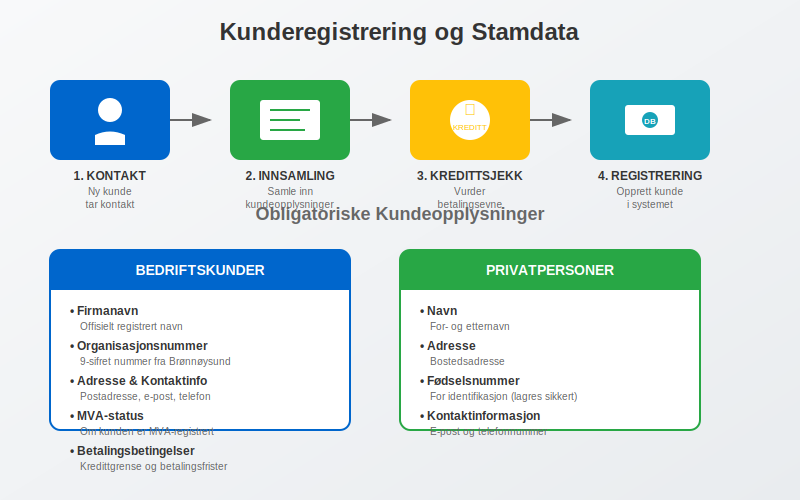

En **kunde** er en person eller organisasjon som kjøper varer eller tjenester fra en bedrift. I regnskapssammenheng representerer kunder den viktigste kilden til [inntekter](/blogs/regnskap/hva-er-inntekter "Hva er Inntekter? Komplett Guide til Inntektsføring og Regnskapsregler") og er grunnlaget for bedriftens [kontantstrøm](/blogs/regnskap/hva-er-kontantstrom "Hva er Kontantstrøm? Analyse og Styring av Likviditet"). Effektiv kundehåndtering er avgjørende for bedriftens lønnsomhet og påvirker direkte [arbeidskapitalen](/blogs/regnskap/hva-er-arbeidskapital "Hva er Arbeidskapital? Beregning og Betydning for Bedriftens Likviditet") gjennom systematisk oppfølging av [debitor](/blogs/regnskap/hva-er-debitor "Hva er Debitor? Komplett Guide til Kundefordringer og Debitorhåndtering")-porteføljen.

## Seksjon 1: Kundens Rolle i Regnskapet

I regnskapssammenheng er kunder mer enn bare kjøpere - de representerer **fremtidige kontantstrømmer** og er en kritisk del av bedriftens [eiendeler](/blogs/regnskap/hva-er-eiendel "Hva er Eiendel? Komplett Guide til Eiendeler i Regnskapet") gjennom kundefordringer. Når en bedrift selger på kreditt, oppstår det en [debitor](/blogs/regnskap/hva-er-debitor "Hva er Debitor? Komplett Guide til Kundefordringer og Debitorhåndtering") som må følges opp systematisk for å sikre betaling.


### Kundens Påvirkning på Regnskapet

Kunder påvirker regnskapet på flere måter:

* **Inntektsføring:** Salg til kunder genererer [driftsinntekter](/blogs/regnskap/hva-er-driftsinntekter "Hva er Driftsinntekter? Komplett Guide til Inntektsføring og Regnskapsregler")
* **Debitorhåndtering:** Kredittgivning skaper kundefordringer som må administreres
* **Kontantstrøm:** Kundebetalinger er hovedkilden til operasjonell kontantstrøm
* **Risikostyring:** Kundekonsentrasjon og kredittrisiko påvirker bedriftens finansielle stabilitet

## Seksjon 2: Kundetyper og Segmentering

Bedrifter kategoriserer ofte kunder basert på ulike kriterier for å optimalisere salgs- og regnskapsstrategier. Denne segmenteringen påvirker hvordan kunder håndteres i regnskapssystemet og hvilke betalingsbetingelser som tilbys.


### 2.1 Segmentering etter Kundetype

| Kundetype | Karakteristikk | Regnskapsmessige Hensyn |
|-----------|----------------|-------------------------|
| **B2B-kunder** ([Hva er B2B?](/blogs/regnskap/hva-er-b2b "Hva er B2B? Business-to-Business i Regnskap")) | Bedrifter og organisasjoner | Lengre betalingsfrister, høyere ordreverdier, kompleks [fakturering](/blogs/regnskap/hva-er-en-faktura "Hva er en Faktura? En Guide til Norske Fakturakrav") |
| **B2C-kunder** ([Hva er B2C?](/blogs/regnskap/hva-er-b2c "Hva er B2C? Business-to-Consumer i Regnskap")) | Privatpersoner | Kortere betalingsfrister, lavere ordreverdier, enklere fakturaer |
| **Offentlige kunder** | Stat, kommune, fylke | Spesielle [anskaffelseskrav](/blogs/regnskap/hva-er-anskaffelser "Hva er Anskaffelser? En Komplett Guide til Offentlige og Private Innkjøp"), lengre betalingsfrister |
| **Internasjonale kunder** | Utenlandske kjøpere | Valutarisiko, kompleks MVA-håndtering, eksportdokumentasjon |

### 2.2 Segmentering etter Verdi

* **A-kunder:** Høyverdi-kunder som genererer 80% av omsetningen
* **B-kunder:** Mellomverdi-kunder med stabilt kjøpsmønster  
* **C-kunder:** Lavverdi-kunder med sporadiske kjøp

Denne **ABC-analysen** hjelper bedrifter med å prioritere ressurser og tilpasse kredittbetingelser basert på kundens strategiske betydning.

## Seksjon 3: Kunderegistrering og Stamdata

Korrekt kunderegistrering er fundamentet for effektiv kundehåndtering og nøyaktig regnskapsføring. Kundestamdata må være komplette og oppdaterte for å sikre smidig [fakturabehandling](/blogs/regnskap/hva-er-bilagsforing "Hva er Bilagsføring? Komplett Guide til Regnskapsbilag og Dokumentasjon") og betalingsoppfølging. Et velorganisert [kundekartotek](/blogs/regnskap/hva-er-kundekartotek "Hva er Kundekartotek? Komplett Guide til Kundedatabase og Kunderegistrering") er essensielt for å administrere all kunderelatert informasjon systematisk og effektivt.



### Obligatoriske Kundeopplysninger

For **norske bedriftskunder** kreves følgende informasjon:

* **Firmanavn:** Offisielt registrert navn
* **Organisasjonsnummer:** 9-sifret nummer fra Brønnøysundregistrene
* **Adresse:** Komplett postadresse for fakturering
* **Kontaktinformasjon:** E-post og telefonnummer
* **MVA-status:** Om kunden er MVA-registrert
* **Betalingsbetingelser:** Kredittgrense og betalingsfrister

For **privatpersoner** registreres:

* **Navn:** For- og etternavn
* **Adresse:** Bostedsadresse
* **Fødselsnummer:** For identifikasjon (lagres sikkert)
* **Kontaktinformasjon:** E-post og telefon

### Kredittsjekk og Risikovurdering

Før kreditt innvilges, bør bedrifter utføre **kredittsjekk** for å vurdere kundens [betalingsevne](/blogs/regnskap/hva-er-betalingsevne "Hva er Betalingsevne? Analyse av Likviditet og Finansiell Stabilitet"):

* **Kredittrapporter:** Fra Bisnode, Experian eller lignende
* **Ã…rsregnskap:** Analyse av kundens finansielle stilling
* **Betalingshistorikk:** Tidligere betalingsmønster
* **Referanser:** Fra andre leverandører

## Seksjon 4: Kredittgivning og Betalingsbetingelser

Når bedrifter selger på kreditt, oppstår det et **kredittforhold** mellom selger og kunde. Dette forholdet må styres aktivt for å minimere risiko og optimalisere kontantstrøm. [Fakturasalg](/blogs/regnskap/hva-er-fakturasalg "Hva er Fakturasalg? Komplett Guide til Kredittgivning og Debitorhåndtering") krever systematisk oppfølging og risikostyring.


### Fastsettelse av Kredittgrenser

Kredittgrenser fastsettes basert på:

* **Kundens finansielle styrke:** Egenkapital, omsetning, lønnsomhet
* **Betalingshistorikk:** Tidligere betalingsmønster og pålitelighet
* **Bransjerisiko:** Konjunkturutsikter og bransjespecifikke risikoer
* **Sikkerhet:** Garantier, pant eller andre sikkerheter

### Vanlige Betalingsbetingelser

| Betalingsbetingelse | Beskrivelse | Typisk Bruk |
|-------------------|-------------|-------------|
| **Netto 30 dager** | Betaling innen 30 dager fra fakturadato | Standard B2B-handel |
| **Netto 14 dager** | Betaling innen 14 dager | Mindre bedrifter, høyere risiko |
| **2/10 netto 30** | 2% rabatt ved betaling innen 10 dager, ellers 30 dager | Incentiv for rask betaling |
| **Forskudd** | Betaling før levering | Nye kunder, høyrisiko-transaksjoner |
| **[A-konto betaling](/blogs/regnskap/hva-er-a-konto-betaling "Hva er A-konto Betaling? En Enkel Forklaring")** | Delvis forskuddsbetaling | Store prosjekter, løpende tjenester |

## Seksjon 5: Debitorhåndtering og Oppfølging

Systematisk debitorhåndtering er kritisk for å sikre at kundefordringer konverteres til kontanter innen rimelig tid. Dette påvirker direkte bedriftens [arbeidskapital](/blogs/regnskap/hva-er-arbeidskapital "Hva er Arbeidskapital? Beregning og Betydning for Bedriftens Likviditet") og lønnsomhet.


### Oppfølgingsprosess for Forfalte Fordringer

Når fakturaer ikke betales til forfallstid, må bedriften iverksette systematisk oppfølging:

1. **Betalingspåminnelse (7-14 dager etter forfall):**
   - Høflig påminnelse om forfalt faktura
   - Ingen tilleggsgebyrer på første påminnelse
   - Oppfordring til kontakt ved betalingsproblemer

2. **Første purring (30 dager etter forfall):**
   - Mer formell tone med krav om umiddelbar betaling
   - [Purregebyr](/blogs/regnskap/hva-er-forsinkelsesgebyr "Hva er Forsinkelsesgebyr? Komplett Guide til Purregebyrer og Morarenter") kan pålegges
   - Trussel om videre oppfølging

3. **Andre purring (45-60 dager etter forfall):**
   - Strengere formulering med høyere purregebyr
   - [Forsinkelsesrenter](/blogs/regnskap/hva-er-forsinkelsesrente "Hva er Forsinkelsesrente? Komplett Guide til Morarenter og Beregning") påløper
   - Varsel om inkassobehandling

4. **Inkassobehandling (60+ dager etter forfall):**
   - Overføring til profesjonelt inkassoselskap
   - Høyere kostnader for kunden
   - Mulig rettslig forfølgelse

### Nøkkeltall for Debitorhåndtering

Bedrifter bør overvåke følgende **nøkkeltall** for å vurdere effektiviteten av debitorhåndteringen:

* **Gjennomsnittlig innkrevingstid (DSO):** Antall dager fra salg til betaling
* **Aldersfordeling av fordringer:** Prosentandel fordringer i ulike aldersgrupper
* **Tapsprosent:** Andel fordringer som må avskrives som tap
* **Kredittgrenseutnyttelse:** Hvor mye av kredittgrensen som er benyttet

## Seksjon 6: Kundeanalyse og Lønnsomhet

For å optimalisere kundeporteføljen må bedrifter analysere **kundelønnsomhet** og identifisere de mest verdifulle kundene. Dette påvirker ressursallokering og strategiske beslutninger.


### Beregning av Kundelønnsomhet

Kundelønnsomhet beregnes ved å sammenligne **kundeinntekter** med **kundekostnader**:

**Kundeinntekter:**
* Salgsinntekter (netto etter rabatter)
* Tilleggstjenester og gebyrer
* Finansinntekter (renter på forsinket betaling)

**Kundekostnader:**
* Direkte produktkostnader
* Salgs- og markedsføringskostnader
* Administrasjonskostnader (fakturering, oppfølging)
* Finansieringskostnader (renter på utestående fordringer)
* Tapskostnader (nedskrivninger og avskrivninger)

### Customer Lifetime Value (CLV)

**Customer Lifetime Value** er nåverdien av alle fremtidige kontantstrømmer fra en kunde:

```
CLV = (Gjennomsnittlig årlig kjøp × Bruttomargin × Kundevarighet) - Anskaffelseskost
```

Denne beregningen hjelper bedrifter med å:
* Prioritere kundegrupper
* Fastsette markedsføringsbudsjetter
* Vurdere investeringer i kundeservice
* Optimalisere prissetting

## Seksjon 7: Digitalisering av Kundehåndtering

Moderne bedrifter digitaliserer stadig mer av kundehåndteringen for å øke effektiviteten og redusere kostnader. [API-integrasjon og automatisering](/blogs/regnskap/api-integrasjon-automatisering-regnskap "API-integrasjon og Automatisering i Regnskap: Komplett Guide") spiller en sentral rolle i denne utviklingen.


### CRM-systemer og Regnskapsintegrasjon

**Customer Relationship Management (CRM)** systemer integreres med regnskapssystemer for å:

* Automatisk opprette kunder i regnskapet
* Synkronisere kundeinformasjon mellom systemer
* Generere fakturaer direkte fra CRM
* Spore betalinger og oppdatere kundestatus

### Automatisert Fakturabehandling

Moderne løsninger automatiserer store deler av faktureringsprosessen:

* **[Elektronisk fakturering](/blogs/regnskap/hva-er-elektronisk-fakturering "Hva er Elektronisk Fakturering? Komplett Guide til Digitale Fakturaløsninger"):** Direkte overføring av fakturaer til kundens system
* **[eFaktura](/blogs/regnskap/hva-er-efaktura "Hva er eFaktura? Komplett Guide til Elektronisk Fakturering i Norge"):** Elektronisk levering til kundens nettbank
* **Automatisk påminnelser:** Systemgenererte purringer ved forfall
* **Betalingsintegrasjon:** Automatisk avstemming av innbetalinger

### Kunstig Intelligens i Kundehåndtering

AI-teknologi brukes til:

* **Kredittscoring:** Automatisk vurdering av kunders kredittrisiko
* **Betalingsprediksjon:** Forutsi hvilke kunder som vil betale for sent
* **Kundesegmentering:** Automatisk kategorisering basert på kjøpsmønster
* **Chatbots:** Automatisert kundeservice for enkle henvendelser

## Seksjon 8: Juridiske Aspekter ved Kundehåndtering

Kundehåndtering er regulert av flere lover og forskrifter som bedrifter må forholde seg til. Brudd på disse kan få alvorlige konsekvenser.

### Personvernlovgivning (GDPR)

Ved håndtering av personopplysninger må bedrifter:

* **Innhente samtykke:** Eksplisitt samtykke til behandling av persondata
* **Informere om formål:** Tydelig kommunikasjon om hvorfor data samles inn
* **Sikre dataene:** Implementere tekniske og organisatoriske sikkerhetstiltak
* **Respektere rettigheter:** Gi kunder tilgang til, retting og sletting av data

### Inkassoloven

Ved oppfølging av forfalte fordringer gjelder [inkassoloven](/blogs/regnskap/hva-er-inkasso "Hva er Inkasso? Komplett Guide til Inkassoprosess og Lovverk") som regulerer:

* **Purregebyrer:** Maksimale satser for påminnelser
* **Inkassosalær:** Godkjente satser for inkassobehandling
* **Fremgangsmåte:** Krav til varsling og dokumentasjon
* **Forbrukervern:** Særlige regler for privatpersoner

### Regnskapsloven og Bokføringsloven

Kundehåndtering må følge kravene i [regnskapsloven](/blogs/regnskap/hva-er-regnskap "Hva er Regnskap? Komplett Guide til Regnskapsføring og Regnskapsplikt") og [bokføringsloven](/blogs/regnskap/hva-er-bokforingsloven "Hva er Bokføringsloven? Komplett Guide til Norsk Bokføringslovgivning"):

* **Dokumentasjon:** Alle kundetransaksjoner må dokumenteres
* **Oppbevaring:** Kundedokumenter må oppbevares i minimum 5 år
* **Sporbarhet:** Mulighet til å spore alle transaksjoner
* **Internkontroll:** Systemer for å sikre korrekt behandling

## Seksjon 9: Beste Praksis for Kundehåndtering

Effektiv kundehåndtering krever systematisk tilnærming og kontinuerlig forbedring. Her er anbefalte beste praksis:

### Kundeservice og Kommunikasjon

* **Proaktiv kommunikasjon:** Informer kunder om endringer og viktige frister
* **Fleksible betalingsløsninger:** Tilby [AvtaleGiro](/blogs/regnskap/hva-er-avtalegiro "Hva er AvtaleGiro? Komplett Guide til Automatisk Betaling") og andre automatiske løsninger
* **Rask respons:** Svar på kundehenvendelser innen 24 timer
* **Personlig oppfølging:** Dedikerte kontaktpersoner for store kunder

### Risikostyring

* **Diversifisering:** Unngå for stor avhengighet av enkeltkunder
* **Kredittforsikring:** Vurder forsikring mot kundetap
* **Regelmessig gjennomgang:** Oppdater kredittgrenser basert på endringer
* **Tidlig varsling:** Identifiser betalingsproblemer tidlig

### Kontinuerlig Forbedring

* **Måling av nøkkeltall:** Følg opp DSO, tapsprosent og kundetilfredshet
* **Kundefeedback:** Innhent tilbakemeldinger på faktureringsprosessen
* **Prosessoptimalisering:** Automatiser rutineoppgaver
* **Kompetanseutvikling:** Opplær ansatte i kundehåndtering

## Konklusjon

Kunder er bedriftens viktigste ressurs og krever systematisk håndtering for å sikre optimal lønnsomhet og kontantstrøm. Effektiv kundehåndtering kombinerer **korrekt registrering**, **aktiv debitoroppfølging**, **risikostyring** og **digitale løsninger** for å skape varige kundeforhold og finansiell stabilitet.

Ved å implementere beste praksis for kundehåndtering kan bedrifter redusere kredittrisiko, forbedre kontantstrøm og bygge sterkere kundeforhold som bidrar til langsiktig vekst og lønnsomhet.
