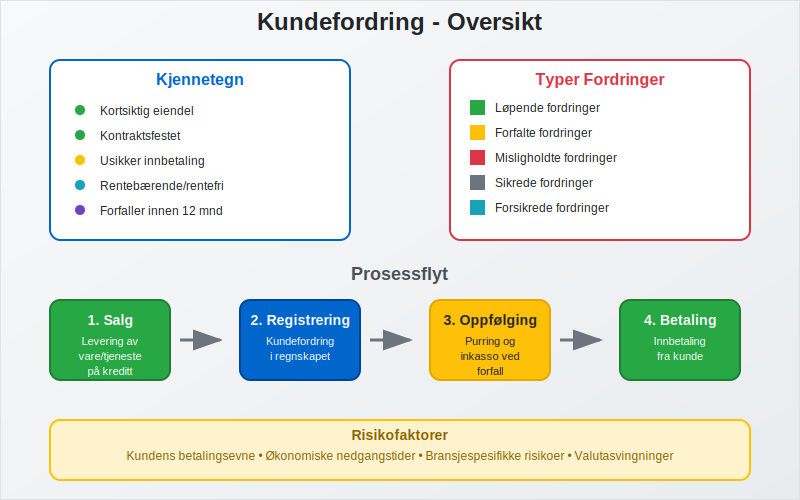
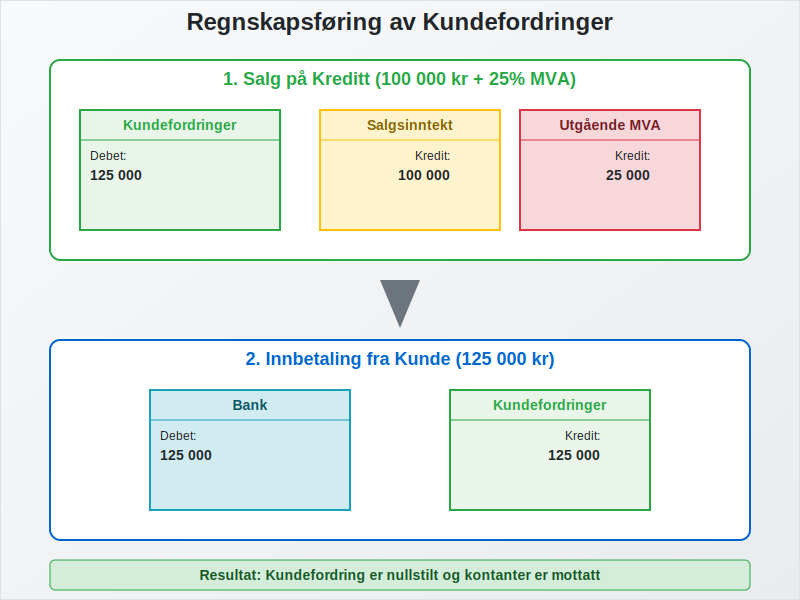
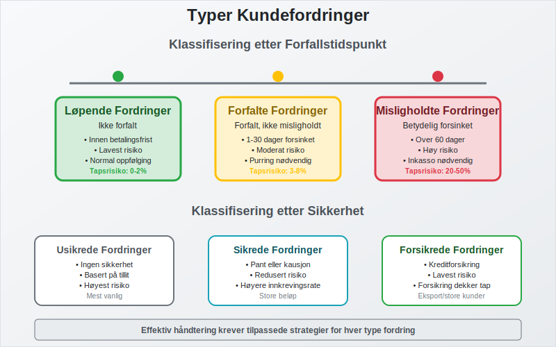
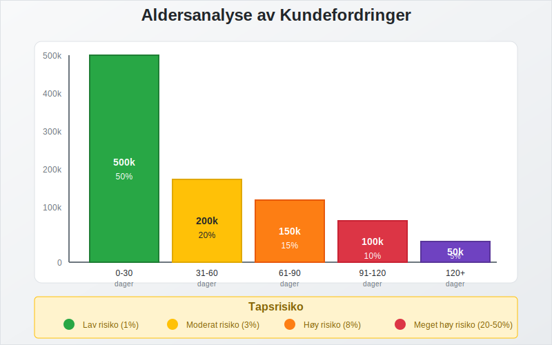
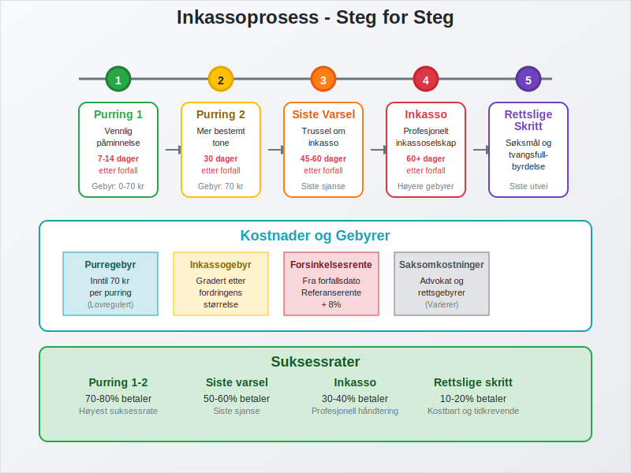
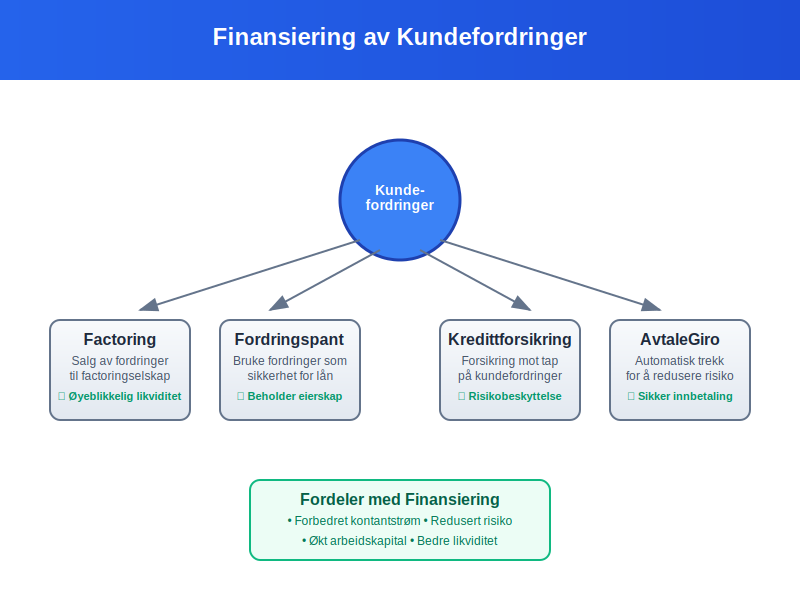
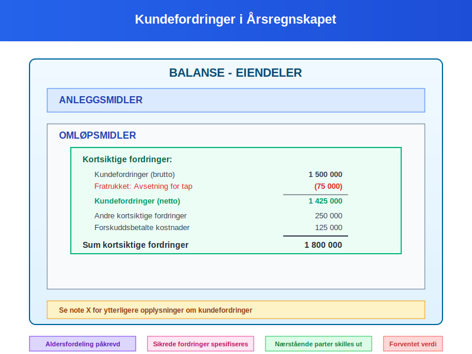
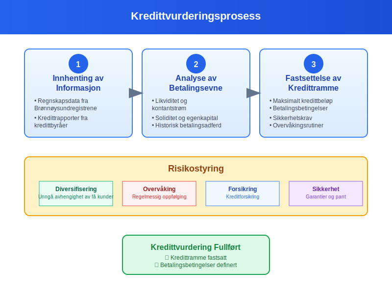
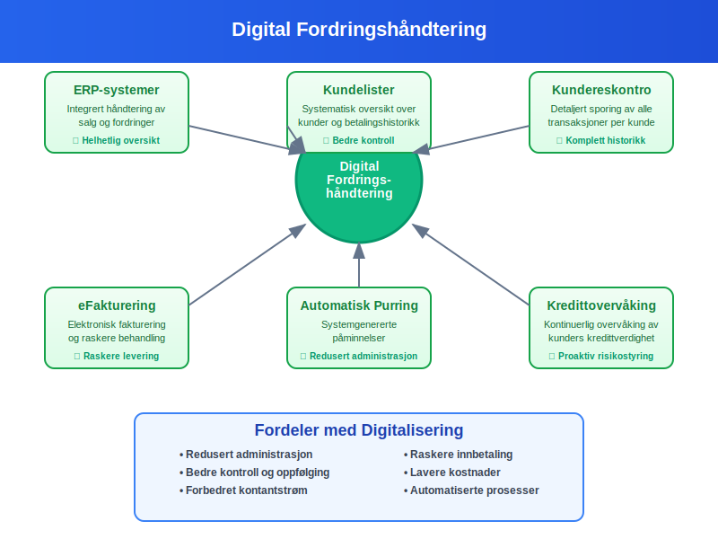
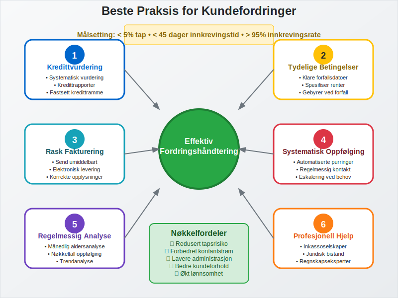

---
title: "Hva er kundefordring?"
seoTitle: "Hva er kundefordring?"
meta_description: '**Kundefordring** er penger som kunder skylder bedriften for varer eller tjenester som er levert, men som ennå ikke er betalt. Dette er en av de viktigste [eie...'
slug: hva-er-kundefordring
type: blog
layout: pages/single
---

**Kundefordring** er penger som kunder skylder bedriften for varer eller tjenester som er levert, men som ennå ikke er betalt. Dette er en av de viktigste [eiendelene](/blogs/regnskap/hva-er-eiendel "Hva er en Eiendel? Komplett Guide til Eiendeler i Regnskap") i mange bedrifters [balanse](/blogs/regnskap/hva-er-balanse "Hva er Balanse? En Komplett Guide til Balanseregnskap") og representerer fremtidige kontantstrømmer som bedriften forventer å motta.

 
En **fordring** er et generelt krav på betaling som kan omfatte kundefordringer, leverandørfordringer og andre økonomiske krav. Se [Hva er fordring?](/blogs/regnskap/hva-er-fordring "Hva er fordring? En komplett guide til fordringer").

For spesifikk oppfølging av utestående beløp, les vår artikkel om [Utestående Fordring](/blogs/regnskap/utestaende-fordring "Utestående Fordring: Håndtering av utestående fordringer i norsk regnskap").

## Hva er Kundefordring?

Kundefordringer oppstår når bedriften selger varer eller tjenester på kreditt, det vil si at kunden får varene eller tjenestene først og betaler senere. Dette skaper en fordring som registreres som en eiendel i bedriftens regnskap.



### Kjennetegn ved Kundefordringer:

* **Kortsiktig eiendel:** Vanligvis forfaller innen 12 måneder
* **Kontraktsfestet:** Basert på [fakturaer](/blogs/regnskap/hva-er-en-faktura "Hva er en Faktura? En Guide til Norske Fakturakrav") og avtaler
* **Usikker innbetaling:** Risiko for at kunden ikke betaler
* **Rentebærende eller rentefri:** Avhenger av betalingsbetingelser

I **[B2B-handel](/blogs/regnskap/hva-er-b2b "Hva er B2B? Komplett Guide til Business-to-Business i Norsk Regnskap")** er kundefordringer vanligvis større og har lengre betalingsbetingelser (30-90 dager) sammenlignet med [B2C-handel](/blogs/regnskap/hva-er-b2c "Hva er B2C? Business-to-Consumer i Regnskap") hvor umiddelbare betalinger via kort, Vipps eller eFaktura reduserer kundefordringer betydelig, noe som krever mer omfattende kredittvurdering og oppfølging.

## Regnskapsføring av Kundefordringer

Kundefordringer regnskapsføres etter prinsippet om opptjening, som betyr at inntekten og fordringen registreres når varen leveres eller tjenesten utføres.



### Bokføringseksempel:

**Ved salg på kreditt (100 000 kr + 25% MVA):**
```
Debet: Kundefordringer        125 000
Kredit: Salgsinntekt          100 000
Kredit: Utgående MVA           25 000
```

**Ved innbetaling fra kunde:**
```
Debet: Bank                   125 000
Kredit: Kundefordringer       125 000
```

## Typer Kundefordringer

Kundefordringer kan klassifiseres på flere måter avhengig av deres natur og forfallstidspunkt.



### Etter Forfallstidspunkt:

| Type | Beskrivelse | Eksempel |
|------|-------------|----------|
| **Løpende fordringer** | Ikke forfalt | Faktura sendt for 10 dager siden, 30 dagers betalingsfrist |
| **Forfalte fordringer** | Forfalt, men ikke misligholdt | Faktura forfalt for 5 dager siden |
| **Misligholdte fordringer** | Betydelig forsinket betaling | Faktura forfalt for over 60 dager |

### Etter Sikkerhet:

* **Usikrede fordringer:** Ingen sikkerhet for betaling
* **Sikrede fordringer:** Sikret med pant, kausjon, fantegang eller lignende. Se [Fantegang](/blogs/regnskap/hva-er-fantegang "Hva er Fantegang? En Komplett Guide til Sikringsrettigheter i Norsk Regnskap").
* **Forsikrede fordringer:** Dekket av [kreditforsikring](/blogs/regnskap/hva-er-factoring "Hva er Factoring? En Guide til Finansiering og Risikostyring")

## Aldersanalyse av Kundefordringer

**Aldersanalyse** er en viktig metode for å vurdere kvaliteten på kundefordringer og risikoen for tap.



### Eksempel på Aldersanalyse:

| Aldersgruppe | Beløp (kr) | Andel (%) | Tapsrisiko (%) | Forventet tap (kr) |
|--------------|------------|-----------|----------------|-------------------|
| 0-30 dager   | 500 000    | 50%       | 1%             | 5 000            |
| 31-60 dager  | 200 000    | 20%       | 3%             | 6 000            |
| 61-90 dager  | 150 000    | 15%       | 8%             | 12 000           |
| 91-120 dager | 100 000    | 10%       | 20%            | 20 000           |
| Over 120 dager| 50 000    | 5%        | 50%            | 25 000           |
| **Totalt**   | **1 000 000** | **100%** |            | **68 000**       |

## Tapsvurdering og Nedskrivning

Bedrifter må vurdere om kundefordringer kan inndrives fullt ut og eventuelt nedskrive fordringer som anses som tapte.

### Indikatorer på Tap:

* Kundens økonomiske problemer
* Konkurs eller akkord
* Langvarig betalingsforsinkelse
* Manglende respons på purringer
* [Betalingsanmerkning](/blogs/regnskap/betalingsanmerkning "Betalingsanmerkning - Hva betyr det for kredittverdighet og regnskap?") registrert mot kunden
* Juridiske tvister

### Regnskapsføring av Tap:

**Ved vurdering av sannsynlig tap:**
```
Debet: Tap på kundefordringer    50 000
Kredit: Avsetning for tap        50 000
```

**Ved endelig tap:**
```
Debet: Avsetning for tap         50 000
Kredit: Kundefordringer          50 000
```

## Inkasso og Inndriving

Når kundefordringer ikke betales til forfallstid, må bedriften iverksette tiltak for å få inn pengene.



### Inkassoprosessen:

1. **[Purring](/blogs/regnskap/hva-er-purring-og-purregebyr "Hva er Purring og Purregebyr? Guide til Norske Regler og Regnskapsføring") 1:** Vennlig påminnelse etter 7-14 dager
2. **[Purring](/blogs/regnskap/hva-er-purring-og-purregebyr "Hva er Purring og Purregebyr? Guide til Norske Regler og Regnskapsføring") 2:** Mer bestemt tone etter 30 dager
3. **Siste varsel:** Trussel om [inkasso](/blogs/regnskap/hva-er-inkasso "Hva er Inkasso? En Guide til Inkassoprosessen") etter 45-60 dager
4. **Inkassoselskap:** Overdragelse til profesjonelt inkassoselskap
5. **Rettslige skritt:** Søksmål og tvangsfullbyrdelse

### Inkassokostnader:

Inkassokostnader kan kreves dekket av skyldneren i henhold til [inkassoloven](/blogs/regnskap/hva-er-inkassoloven "Hva er Inkassoloven? Regler og Rettigheter"):

* **Purregebyr:** Inntil 70 kr per purring
* **Inkassogebyr:** Gradert etter fordringens størrelse
* **Renter:** [Forsinkelsesrente](/blogs/regnskap/hva-er-forsinkelsesrente "Hva er Forsinkelsesrente? Beregning og Regler") fra forfallsdato

## Finansiering av Kundefordringer

Bedrifter kan bruke kundefordringer som grunnlag for finansiering for å forbedre [kontantstrømmen](/blogs/regnskap/hva-er-kontantstrom "Hva er Kontantstrøm? En Guide til Kontantstrømanalyse").



### Finansieringsalternativer:

* **[Factoring](/blogs/regnskap/hva-er-factoring "Hva er Factoring? En Guide til Finansiering og Risikostyring"):** Salg av fordringer til factoringselskap
* **Fordringspant:** Bruke fordringer som sikkerhet for lån
* **Kredittforsikring:** Forsikring mot tap på kundefordringer
* **[Avtalegiro](/blogs/regnskap/hva-er-avtalegiro "Hva er AvtaleGiro? En Guide til Automatisk Betaling"):** Automatisk trekk for å redusere risiko

## Kundefordringer i Årsregnskapet

Kundefordringer må presenteres korrekt i [årsregnskapet](/blogs/regnskap/hva-er-aarsregnskap "Hva er Årsregnskap? Innhold, oppbygging og lovkrav i Norge") i henhold til norske regnskapsstandarder.



### Presentasjon i Balansen:

* **Omløpsmidler:** Under kortsiktige fordringer
* **Brutto beløp:** Totale kundefordringer
* **Avsetning for tap:** Trekkes fra som negativ post
* **Netto beløp:** Forventet innbetalingsverdi

### Noteopplysninger:

Årsregnskapet må inneholde tilleggsopplysninger om:

* Aldersfordeling av kundefordringer
* Avsetninger for tap og endringer i disse
* Sikrede fordringer
* Fordringer på nærstående parter

## Nøkkeltall for Kundefordringer

Flere nøkkeltall brukes for å analysere effektiviteten i håndteringen av kundefordringer.

### Viktige Nøkkeltall:

| Nøkkeltall | Formel | Hva det viser |
|------------|--------|---------------|
| **Omløpshastighet** | Kreditsalg ÷ Gjennomsnittlige kundefordringer | Hvor raskt fordringer inndrives |
| **Innkrevingsperiode** | 365 ÷ Omløpshastighet | Gjennomsnittlig innkrevingstid i dager |
| **Tapsandel** | Tap på fordringer ÷ Totale kreditsalg | Andel av salget som tapes |

### Eksempel på Beregning:

**Gitt:**
- Kreditsalg: 10 000 000 kr
- Gjennomsnittlige kundefordringer: 1 500 000 kr
- Tap på fordringer: 100 000 kr

**Beregninger:**
- Omløpshastighet: 10 000 000 ÷ 1 500 000 = 6,67 ganger
- Innkrevingsperiode: 365 ÷ 6,67 = 55 dager
- Tapsandel: 100 000 ÷ 10 000 000 = 1%

## Kredittvurdering og Risikostyring

For å minimere risikoen for tap må bedrifter ha gode rutiner for kredittvurdering av nye kunder.



### Kredittvurderingsprosess:

1. **Innhenting av informasjon:**
   - Regnskapsdata fra [Brønnøysundregistrene](/blogs/regnskap/hva-er-altinn "Hva er Altinn? En Guide til Offentlige Tjenester")
   - Kredittrapporter fra kredittbyråer
   - Referanser fra andre leverandører

2. **Analyse av betalingsevne:**
   - [Likviditet](/blogs/regnskap/hva-er-betalingsevne "Hva er Betalingsevne? En Guide til Likviditetsanalyse")
   - Soliditet og [egenkapital](/blogs/regnskap/hva-er-egenkapital "Hva er Egenkapital? En Komplett Guide")
   - Historisk betalingsadferd

3. **Fastsettelse av kredittramme:**
   - Maksimalt kredittbeløp
   - Betalingsbetingelser
   - Sikkerhetskrav

### Risikostyring:

* **Diversifisering:** Unngå for stor avhengighet av få kunder
* **Overvåking:** Regelmessig oppfølging av kunders betalingsadferd gjennom [kundelister](/blogs/regnskap/hva-er-kundeliste "Hva er en Kundeliste? Komplett Guide til Kundeadministrasjon og Risikostyring")
* **Forsikring:** Kreditforsikring for store eksponeringer
* **Sikkerhet:** Krav om garantier eller pant ved høy risiko

## Digitalisering og Moderne Fordringshåndtering

Moderne teknologi har revolusjonert måten bedrifter håndterer kundefordringer på.



### Digitale Løsninger:

* **[ERP-systemer](/blogs/regnskap/hva-er-erp-system "Hva er ERP-system? En Guide til Bedriftssystemer"):** Integrert håndtering av salg og fordringer
* **[Kundereskontro](/blogs/regnskap/hva-er-kundereskontro "Hva er Kundereskontro? Komplett Guide til Kundeledger og Fordringsstyring"):** Detaljert sporing av alle transaksjoner per kunde
* **[Kundelister](/blogs/regnskap/hva-er-kundeliste "Hva er en Kundeliste? Komplett Guide til Kundeadministrasjon og Risikostyring"):** Systematisk oversikt over alle kunder og deres betalingshistorikk
* **[Elektronisk fakturering](/blogs/regnskap/hva-er-efaktura "Hva er eFaktura? En Guide til Elektronisk Fakturering"):** Raskere levering og behandling
* **Automatisk purring:** Systemgenererte påminnelser
* **Kredittovervåking:** Kontinuerlig overvåking av kunders [kredittverdighet](/blogs/regnskap/hva-er-bonitet "Hva er bonitet?")

### Fordeler med Digitalisering:

* Redusert administrasjon
* Raskere innbetaling
* Bedre kontroll og oppfølging
* Lavere kostnader
* Forbedret [kontantstrøm](/blogs/regnskap/hva-er-kontantstrom "Hva er Kontantstrøm? En Guide til Kontantstrømanalyse")

## Internasjonale Kundefordringer

For bedrifter som selger til utlandet, kommer det tilleggskompleksitet i håndteringen av kundefordringer.

### Særlige Utfordringer:

* **Valutarisiko:** Svingninger i valutakurser
* **Lengre innkrevingstid:** Kompliserte betalingssystemer
* **Juridiske forskjeller:** Ulike lover og regler
* **Kulturelle forskjeller:** Ulike betalingstradisjoner

### Risikohåndtering:

* **Valutasikring:** Terminkontrakter eller opsjoner
* **Eksportkredittforsikring:** Spesiell forsikring for eksport
* **Remburs:** Bankgaranti for betaling
* **Forskuddsbetaling:** Betaling før levering

## Beste Praksis for Kundefordringer

For å optimalisere håndteringen av kundefordringer bør bedrifter følge etablerte beste praksis.



### Anbefalinger:

1. **Etabler klare kredittrutiner:** Systematisk kredittvurdering av alle nye kunder
2. **Tydelige betalingsbetingelser:** Spesifiser forfallsdato, renter og gebyrer
3. **Rask fakturering:** Send fakturaer umiddelbart etter levering
4. **Systematisk oppfølging:** Automatiserte purre- og inkassoprosesser
5. **Regelmessig analyse:** Månedlig gjennomgang av aldersanalyse og nøkkeltall
6. **Profesjonell hjelp:** Bruk inkassoselskaper ved behov

## Sammenheng med Andre Regnskapsbegreper

Kundefordringer henger sammen med flere andre viktige regnskapsbegreper som er essensielle for å forstå det totale bildet.

### Relaterte Begreper:

* **[Debitor](/blogs/regnskap/hva-er-debitor "Hva er en Debitor? En Guide til Skyldnere og Fordringer"):** Person eller selskap som skylder penger
* **[Leverandørgjeld](/blogs/regnskap/hva-er-gjeld "Hva er Gjeld? En Komplett Guide til Forpliktelser"):** Motsatsen av kundefordringer
* **[Arbeidskapital](/blogs/regnskap/hva-er-arbeidskapital "Hva er Arbeidskapital? En Guide til Kortsiktig Finansiering"):** Inkluderer kundefordringer som viktig komponent
* **[Kontantstrøm](/blogs/regnskap/hva-er-kontantstrom "Hva er Kontantstrøm? En Guide til Kontantstrømanalyse"):** Påvirkes direkte av innkrevingstid

For [aksjeselskaper](/blogs/regnskap/hva-er-et-aksjeselskap "Hva er et Aksjeselskap? En Komplett Guide") er effektiv håndtering av kundefordringer kritisk for å opprettholde god [likviditet](/blogs/regnskap/hva-er-betalingsevne "Hva er Betalingsevne? En Guide til Likviditetsanalyse") og [lønnsomhet](/blogs/regnskap/hva-er-fortjeneste "Hva er Fortjeneste? En Guide til Lønnsomhet og Resultat").

## Konklusjon

Kundefordringer er en kritisk komponent i de fleste bedrifters finansielle struktur. Effektiv håndtering av kundefordringer krever systematiske prosesser for kredittvurdering, fakturering, oppfølging og innkreving. Ved å implementere beste praksis og bruke moderne digitale verktøy kan bedrifter minimere risikoen for tap, forbedre kontantstrømmen og optimalisere [arbeidskapitalen](/blogs/regnskap/hva-er-arbeidskapital "Hva er Arbeidskapital? En Guide til Kortsiktig Finansiering").

Korrekt regnskapsføring og presentasjon av kundefordringer er ikke bare et lovkrav, men også et viktig verktøy for ledelsen til å ta informerte beslutninger om kredittgivning, risikostyring og finansiell planlegging.


