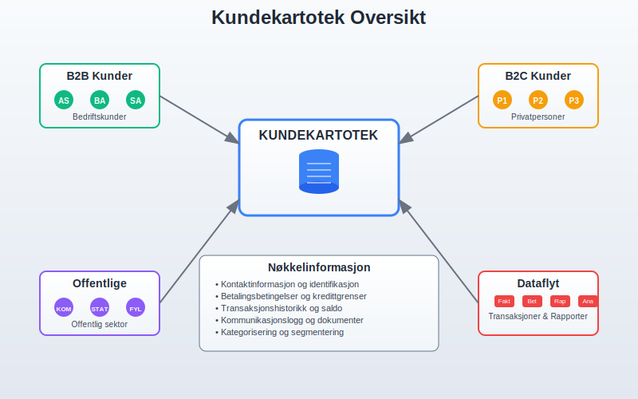
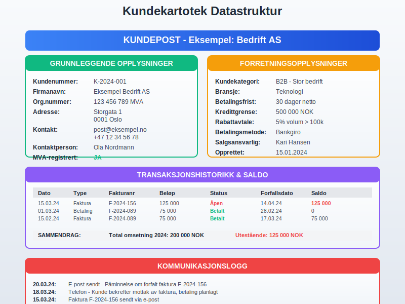
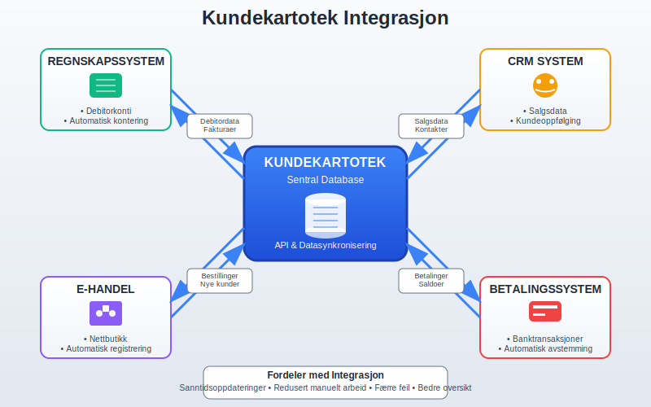
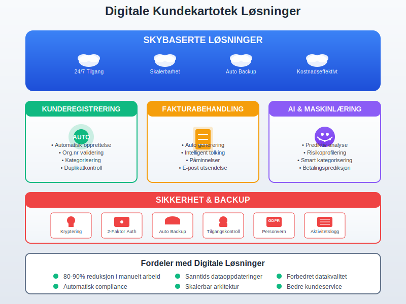

---
title: "Hva er kundekartotek?"
seoTitle: "Kundekartotek | Definisjon, innhold og integrasjon"
description: "Et kundekartotek er en systematisk samling av kundedata for fakturering, oppfølging og analyse. Lær hva et kundekartotek er, hvilke opplysninger det bør inneholde og hvordan det integreres med regnskap."
summary: "Hva et kundekartotek er, hvorfor det er viktig i regnskap, og hvordan god struktur, integrasjon og oppfølging støtter fakturering, debitorhåndtering og analyse."
---

Et **kundekartotek** er en systematisk samling av informasjon om bedriftens kunder, organisert på en måte som gjør det enkelt å finne, oppdatere og bruke kundedata i daglige forretningsoperasjoner. I moderne regnskapsføring er et velorganisert kundekartotek essensielt for korrekt [fakturering](/blogs/regnskap/hva-er-en-faktura "Hva er en Faktura? En Guide til Norske Fakturakrav"), effektiv [debitorhåndtering](/blogs/regnskap/hva-er-ansattreskontro "Hva er Ansattreskontro? Komplett Guide til Kundeoppfølging og Fordringsstyring") og god [internkontroll](/blogs/regnskap/hva-er-internkontroll "Hva er Internkontroll? Komplett Guide til Risikostyring og Kontrollsystemer").

## Seksjon 1: Grunnleggende om Kundekartotek

Et kundekartotek fungerer som **ryggraden i kundeforholdet** og er grunnlaget for all kommunikasjon og transaksjoner med kunder. Det omfatter både grunnleggende kontaktinformasjon og detaljerte forretningsdata som er nødvendig for å opprettholde profesjonelle kundeforhold og sikre korrekt regnskapsføring.

### Hovedformål med Kundekartotek

* **Systematisk kundeadministrasjon:** Sentralisert lagring av all kunderelatert informasjon
* **Effektiv fakturering:** Rask tilgang til faktureringsdetaljer og [betalingsbetingelser](/blogs/regnskap/hva-er-betalingsmidler "Hva er Betalingsmidler? Tvungne, Elektroniske og Tradisjonelle Metoder")
* **Debitoroppfølging:** Oversikt over utestående fordringer og betalingshistorikk gjennom [kundelister](/blogs/regnskap/hva-er-kundeliste "Hva er en Kundeliste? Komplett Guide til Kundeadministrasjon og Risikostyring")
* **Kundeanalyse:** Grunnlag for forretningsutvikling og kundesegmentering
* **Juridisk dokumentasjon:** Oppfyllelse av bokføringslovens krav til dokumentasjon

### Digitale vs. Analoge Kundekartoteker

I dag bruker de fleste bedrifter **digitale kundekartoteker** integrert i regnskapssystemer eller CRM-løsninger. Dette gir betydelige fordeler sammenlignet med tradisjonelle papirbaserte systemer:

| Aspekt | Digitalt Kartotek | Analogt Kartotek |
|--------|------------------|------------------|
| **Tilgjengelighet** | 24/7 tilgang fra flere lokasjoner | Begrenset til fysisk lokasjon |
| **Søkefunksjon** | Avansert søk og filtrering | Manuell gjennomgang |
| **Sikkerhetskopi** | Automatisk backup | Risiko for tap ved brann/skade |
| **Integrasjon** | Kobles til regnskap og fakturering | Manuell overføring av data |
| **Oppdatering** | Sanntidsoppdateringer | Tidkrevende manuell oppdatering |
| **Kostnader** | Lavere driftskostnader over tid | Høye kostnader for lagring og vedlikehold |

## Seksjon 2: Obligatorisk Informasjon i Kundekartoteket

For å oppfylle lovkrav og sikre effektiv forretningsdrift må et kundekartotek inneholde spesifikk informasjon. Dette er særlig viktig for korrekt [bokføring](/blogs/regnskap/hva-er-bokforing "Hva er Bokføring? Komplett Guide til Regnskapsføring og Bokføringsregler") og for å kunne utstede gyldige [fakturaer](/blogs/regnskap/hva-er-en-faktura "Hva er en Faktura? En Guide til Norske Fakturakrav").

### Grunnleggende Kundeopplysninger

**Identifikasjon og Kontakt:**
* **Kundenavn:** Fullstendig firmanavn eller personnavn
* **Organisasjonsnummer/Fødselsnummer:** Unik identifikator for [juridiske personer](/blogs/regnskap/hva-er-juridisk-person "Hva er Juridisk Person? Forskjellen på Fysiske og Juridiske Personer") og privatpersoner
* **Adresse:** Fullstendig postadresse inkludert postnummer og poststed
* **Kontaktinformasjon:** Telefonnummer, e-postadresse, kontaktperson
* **MVA-status:** Om kunden er registrert i Merverdiavgiftsregisteret

**Forretningsrelaterte Opplysninger:**
* **Kundenummer:** Unikt internt referansenummer
* **Kundekategori:** Segmentering basert på størrelse, bransje eller kundeforhold
* **Betalingsbetingelser:** Standard betalingsfrist og betalingsmetoder
* **Kredittgrense:** Maksimalt utestående beløp kunden kan ha
* **Rabattavtaler:** Eventuelle prisavtaler eller rabattordninger

### Regnskapsmessige Krav

I henhold til [bokføringsloven](/blogs/regnskap/hva-er-bokforingsloven "Hva er Bokføringsloven? Komplett Guide til Norske Bokføringsregler") må bedrifter kunne dokumentere alle kundetransaksjoner. Kundekartoteket må derfor inneholde:

* **Komplett transaksjonshistorikk:** Alle salg, betalinger og justeringer
* **Referanser til bilag:** Kobling til [fakturaer](/blogs/regnskap/hva-er-en-faktura "Hva er en Faktura? En Guide til Norske Fakturakrav"), [kreditnotaer](/blogs/regnskap/hva-er-kreditnota "Hva er Kreditnota? Komplett Guide til Kreditnotaer og Korrigeringer") og betalingsbilag
* **Aldersfordeling av fordringer:** Oversikt over hvor lenge fakturaer har vært utestående
* **Kommunikasjonslogg:** Dokumentasjon av [betalingsoppfordringer](/blogs/regnskap/hva-er-betalingsoppfordring "Betalingsoppfordring - Komplett Guide til Purring og Inkasso i Norge") og kundekorrespondanse

## Seksjon 3: Organisering og Struktur

En effektiv organisering av kundekartoteket er avgjørende for produktivitet og nøyaktighet i kundebehandlingen. Moderne systemer tilbyr flere måter å strukturere og kategorisere kundeinformasjon på.

### Kundenummerering og Identifikasjon

**Systematisk nummerering** er grunnlaget for et velfungerende kundekartotek:

* **Sekvensiell nummerering:** Enkle løpenummer (001, 002, 003...)
* **Kategorisert nummerering:** Prefikser basert på kundetype (B001 for bedriftskunder, P001 for privatpersoner)
* **Geografisk nummerering:** Inkludering av regionkoder for geografisk segmentering
* **Alfanumerisk system:** Kombinasjon av bokstaver og tall for mer informasjon i nummeret

### Kundekategorisering og Segmentering

Effektiv kategorisering gjør det enklere å administrere ulike kundegrupper:

**Etter Kundetype:**
* **B2B-kunder:** Bedriftskunder med spesielle krav til [fakturering](/blogs/regnskap/hva-er-en-faktura "Hva er en Faktura? En Guide til Norske Fakturakrav") og dokumentasjon
* **B2C-kunder:** Privatpersoner med enklere transaksjonsmønstre
* **Offentlige kunder:** Spesielle krav til [anskaffelsesprosedyrer](/blogs/regnskap/hva-er-anskaffelser "Hva er Anskaffelser? En Komplett Guide til Offentlige og Private Innkjøp")

**Etter Forretningsverdi:**
* **A-kunder:** Høyverdi kunder som krever prioritert behandling
* **B-kunder:** Mellomstore kunder med standard service
* **C-kunder:** Småkunder med automatiserte prosesser

**Etter Betalingsadferd:**
* **Kontantkunder:** Betaler ved levering eller på forhånd
* **Kredittkunder:** Standard betalingsbetingelser
* **Risikokunder:** Krever spesiell oppfølging og eventuelt [forskuddsbetaling](/blogs/regnskap/hva-er-forskuddsbetaling "Hva er forskuddsbetaling? Komplett Guide til Forskuddsbetalinger i Regnskap")

## Seksjon 4: Integrasjon med Regnskapssystem

Et moderne kundekartotek må være sømløst integrert med bedriftens regnskapssystem for å sikre konsistens og effektivitet i alle kundetransaksjoner.

### Automatisk Dataflyt

**Fra Kundekartotek til Regnskap:**
* Automatisk opprettelse av [debitorkonti](/blogs/regnskap/hva-er-debitor "Hva er Debitor? Komplett Guide til Kundefordringer og Debitorhåndtering") ved registrering av nye kunder
* Sanntidsoppdatering av kundebalanse ved [fakturering](/blogs/regnskap/hva-er-en-faktura "Hva er en Faktura? En Guide til Norske Fakturakrav") og betaling
* Automatisk [kontering](/blogs/regnskap/hva-er-kontering "Hva er Kontering? Komplett Guide til Regnskapsføring og Bilagsbehandling") basert på kundekategori og produkttype

**Fra Regnskap til Kundekartotek:**
* Oppdatering av kundebalanse og betalingshistorikk
* Automatisk registrering av [betalinger](/blogs/regnskap/hva-er-betalingsmidler "Hva er Betalingsmidler? Tvungne, Elektroniske og Tradisjonelle Metoder") og [kreditnotaer](/blogs/regnskap/hva-er-kreditnota "Hva er Kreditnota? Komplett Guide til Kreditnotaer og Korrigeringer")
* Generering av aldersfordeling og kundeanalyser

### API-integrasjoner og Datasynkronisering

Moderne bedrifter bruker ofte flere systemer som må dele kundeinformasjon:

* **CRM-systemer:** For salg og markedsføring
* **E-handelsplattformer:** For nettbutikker og online salg
* **Lagerstyringssystemer:** For produkttilgjengelighet og levering
* **Betalingssystemer:** For automatisk avstemming av [banktransaksjoner](/blogs/regnskap/hva-er-banktransaksjoner "Hva er Banktransaksjoner? Komplett Guide til Bankavstemminger")

## Seksjon 5: Vedlikehold og Datakvalitet

Et kundekartotek er bare så godt som dataene det inneholder. Systematisk vedlikehold og kvalitetssikring er derfor essensielt for å opprettholde nøyaktighet og relevans.

### Rutiner for Datavedlikehold

**Regelmessig Oppdatering:**
* **Månedlig gjennomgang:** Kontroll av nye kunder og endringer i eksisterende kundedata
* **Kvartalsvis validering:** Verifisering av kontaktinformasjon og betalingsbetingelser
* **Årlig storrengjøring:** Arkivering av inaktive kunder og oppdatering av kundekategorier

**Datakvalitetskontroll:**
* **Duplikatkontroll:** Identifisering og sammenslåing av duplikate kundeposter
* **Adressevalidering:** Kontroll av postadresser mot offentlige registre
* **Organisasjonsnummer-validering:** Verifisering mot Brønnøysundregistrene

### GDPR og Personvernhensyn

Kundekartoteker som inneholder personopplysninger må følge **GDPR-regelverket**:

**Databehandlingsgrunnlag:**
* Samtykke fra kunden for markedsføringsformål
* Kontraktsmessig nødvendighet for fakturering og levering
* Juridisk forpliktelse for regnskapsføring og arkivering

**Kunderettigheter:**
* **Innsyn:** Kunder har rett til å se hvilke opplysninger som er registrert
* **Retting:** Mulighet til å korrigere feilaktige opplysninger
* **Sletting:** Rett til å få slettet personopplysninger når de ikke lenger er nødvendige
* **Dataportabilitet:** Rett til å få utlevert egne data i strukturert format

## Seksjon 6: Rapportering og Analyse

Et velorganisert kundekartotek gir grunnlag for verdifull forretningsinnsikt og støtter strategiske beslutninger gjennom systematisk rapportering og analyse.

### Standard Kunderapporter

**Debitorrapporter:**
* **Aldersfordeling:** Oversikt over utestående fordringer fordelt på aldersgrupper
* **Kundebalanse:** Detaljert oversikt over hver kundes utestående beløp gjennom [kundelister](/blogs/regnskap/hva-er-kundeliste "Hva er en Kundeliste? Komplett Guide til Kundeadministrasjon og Risikostyring")
* **Betalingsanalyse:** Gjennomsnittlig betalingstid og betalingsadferd per kunde

**Salgsanalyser:**
* **Kundeomsetning:** Rangering av kunder etter salgsvolum og lønnsomhet
* **Produktanalyse per kunde:** Hvilke produkter/tjenester hver kunde kjøper
* **Sesongvariasjoner:** Identifisering av mønstre i kundeadferd gjennom året

### Nøkkeltall og KPI-er

Kundekartoteket gir grunnlag for viktige **nøkkeltall** som måler forretningsprestasjoner:

| Nøkkeltall | Beregning | Betydning |
|------------|-----------|-----------|
| **Gjennomsnittlig kundeomsetning** | Total omsetning / Antall aktive kunder | Måler verdien per kunde |
| **Kundelivstidsverdi (CLV)** | Gjennomsnittlig årlig kjøp × Gjennomsnittlig kundeforhold i år | Langsiktig kundeverdi |
| **Gjennomsnittlig betalingstid** | Sum betalingsdager / Antall fakturaer | Måler betalingsadferd |
| **Debitoromløpshastighet** | Årlig omsetning / Gjennomsnittlig debitorbalanse | Effektivitet i innkreving |

## Seksjon 7: Digitale Løsninger og Automatisering

Moderne teknologi har revolusjonert måten bedrifter administrerer kundekartoteker på. **Automatisering** og **kunstig intelligens** gjør det mulig å håndtere store kundemengder mer effektivt enn noen gang.

### Cloud-baserte Kundekartoteker

**Fordeler med skybaserte løsninger:**
* **Tilgjengelighet:** Tilgang fra hvor som helst med internettforbindelse
* **Skalerbarhet:** Enkel utvidelse når bedriften vokser
* **Automatiske oppdateringer:** Alltid siste versjon av programvaren
* **Integrerte sikkerhetskopier:** Automatisk backup og gjenoppretting
* **Kostnadseffektivitet:** Lavere investeringskostnader og forutsigbare driftskostnader

### Automatiserte Prosesser

**Kunderegistrering:**
* Automatisk opprettelse av kundeposter fra nettbutikk eller CRM
* Validering av organisasjonsnummer mot offentlige registre
* Automatisk kategorisering basert på forhåndsdefinerte regler

**Fakturabehandling:**
* Automatisk generering av [fakturaer](/blogs/regnskap/hva-er-en-faktura "Hva er en Faktura? En Guide til Norske Fakturakrav") basert på kundedata
* Intelligent [fakturatolk](/blogs/regnskap/hva-er-fakturatolk "Hva er Fakturatolk? Automatisk Fakturabehandling og OCR-teknologi") for behandling av innkommende fakturaer
* Automatisk utsendelse av [betalingsoppfordringer](/blogs/regnskap/hva-er-betalingsoppfordring "Betalingsoppfordring - Komplett Guide til Purring og Inkasso i Norge")

### Kunstig Intelligens og Maskinlæring

**Prediktiv Analyse:**
* Forutsigelse av betalingsadferd basert på historiske data
* Identifisering av kunder med høy risiko for betalingsproblemer
* Optimalisering av kredittgrenser basert på kundeadferd

**Automatisk Kategorisering:**
* Intelligent segmentering av kunder basert på kjøpsmønstre
* Automatisk oppdatering av kundekategorier basert på endret adferd
* Personaliserte betalingsbetingelser basert på risikoprofil

## Seksjon 8: Sikkerhet og Backup

Kundekartoteket inneholder kritisk forretningsinformasjon som må beskyttes mot tap, tyveri og uautorisert tilgang. En robust sikkerhetsplan er derfor essensielt.

### Datasikkerhet og Tilgangskontroll

**Brukeradministrasjon:**
* **Rollebasert tilgang:** Ulike tilgangsnivåer basert på jobbfunksjon
* **To-faktor autentisering:** Ekstra sikkerhetslag for sensitive data
* **Aktivitetslogging:** Sporing av hvem som har tilgang til hvilke kundedata når

**Teknisk Sikkerhet:**
* **Kryptering:** Beskyttelse av data både under lagring og overføring
* **Brannmur og antivirusprogramvare:** Beskyttelse mot eksterne trusler
* **Regelmessige sikkerhetsoppdateringer:** Oppdatering av programvare og sikkerhetspatcher

### Backup og Gjenoppretting

**Backup-strategi:**
* **Daglige sikkerhetskopier:** Automatisk backup av alle endringer
* **Geografisk spredte kopier:** Lagring på flere lokasjoner for katastrofeberedskap
* **Testede gjenopprettingsprosedyrer:** Regelmessig testing av backup-systemet

**Forretningskontinuitet:**
* **Redundante systemer:** Backup-servere som kan overta ved systemfeil
* **Beredskapsplaner:** Klare prosedyrer for håndtering av systemutfall
* **Regelmessige øvelser:** Testing av beredskapsplaner og gjenopprettingsprosedyrer

## Seksjon 9: Juridiske Aspekter og Compliance

Administrasjon av kundekartoteker er underlagt flere juridiske krav som bedrifter må følge for å unngå sanksjoner og opprettholde tillit hos kunder og myndigheter.

### Bokføringslovens Krav

I henhold til [bokføringsloven](/blogs/regnskap/hva-er-bokforingsloven "Hva er Bokføringsloven? Komplett Guide til Norske Bokføringsregler") må bedrifter:

* **Oppbevare kundedata i minimum 5 år** etter regnskapsårets slutt
* **Sikre sporbarhet** mellom kundetransaksjoner og regnskapsbilag
* **Dokumentere alle endringer** i kundeopplysninger med tidsstempel og brukeridentifikasjon
* **Opprettholde intern kontroll** som sikrer nøyaktighet og fullstendighet i kunderegistreringen

### Arkivering og Oppbevaring

**Digitale Arkiver:**
* Kundedata må lagres i **ikke-redigerbart format** for arkivformål
* **Metadata** om opprettelse, endringer og tilgang må bevares
* **Migrasjonsstrategi** for å sikre tilgjengelighet når teknologi endres

**Fysiske Dokumenter:**
* Eventuelle papirdokumenter må oppbevares under **kontrollerte forhold**
* **Brannsikring og fuktighetskontroll** for å bevare dokumentkvalitet
* **Tilgangskontroll** til fysiske arkiver

### Internasjonale Transaksjoner

For bedrifter med **internasjonale kunder** gjelder tilleggskrav:

* **Valutarapportering:** Dokumentasjon av transaksjoner i utenlandsk valuta
* **Skattemessige forhold:** Korrekt håndtering av MVA og skatt for utenlandske kunder
* **Eksportkontroll:** Overholdelse av eksportrestriksjoner og sanksjonsregimer
* **Transfer pricing:** Dokumentasjon av prissetting overfor nærstående selskaper

## Seksjon 10: Implementering og Beste Praksis

Å etablere eller oppgradere et kundekartotek krever grundig planlegging og systematisk gjennomføring for å sikre suksess og minimere forstyrrelser i den daglige driften.

### Planlegging og Prosjektledelse

**Behovsanalyse:**
* Kartlegging av nåværende kundeadministrasjon og identifisering av mangler
* Definering av krav til funksjonalitet og integrasjoner
* Vurdering av ressursbehov og tidsramme for implementering

**Systemvalg:**
* **Standalone løsninger:** Dedikerte kundekartoteksystemer
* **Integrerte ERP-systemer:** Omfattende [ERP-løsninger](/blogs/regnskap/hva-er-erp-system "Hva er ERP-system? Komplett Guide til Enterprise Resource Planning") med kundekartotek
* **Cloud vs. on-premise:** Vurdering av fordeler og ulemper ved ulike implementeringsmodeller

### Datamigrering og Testing

**Migreringsstrategi:**
* **Datarensing:** Opprydding i eksisterende kundedata før overføring
* **Testmiljø:** Etablering av testsystem for validering av datamigrering
* **Parallellkjøring:** Gradvis overgang med parallell drift av gamle og nye systemer

**Kvalitetssikring:**
* **Datavalidering:** Kontroll av at alle kundedata er korrekt overført
* **Funksjonalitetstesting:** Verifisering av at alle funksjoner virker som forventet
* **Brukeracceptansetesting:** Testing med faktiske brukere i realistiske scenarioer

### Opplæring og Implementering

**Brukeropplæring:**
* **Rollebasert opplæring:** Tilpasset opplæring basert på brukerens arbeidsoppgaver
* **Praktiske øvelser:** Hands-on trening med reelle kundedata
* **Dokumentasjon:** Utarbeidelse av brukermanualer og prosedyrebeskrivelser

**Støtte og Vedlikehold:**
* **Helpdesk:** Etablering av støttefunksjon for brukerspørsmål
* **Kontinuerlig forbedring:** Regelmessig evaluering og optimalisering av prosesser
* **Systemoppdateringer:** Planlegging av regelmessige oppdateringer og vedlikehold

## Konklusjon

Et velorganisert **kundekartotek** er fundamentet for effektiv kundeadministrasjon og korrekt regnskapsføring. Det støtter alle aspekter av kundeforholdet, fra første kontakt til langsiktig kundepleie, og sikrer at bedriften kan oppfylle både juridiske krav og forretningsmessige mål.

Moderne digitale løsninger har gjort det enklere enn noen gang å etablere og vedlikeholde omfattende kundekartoteker som integreres sømløst med andre forretningssystemer. Ved å følge beste praksis for dataorganisering, sikkerhet og vedlikehold kan bedrifter bygge kundekartoteker som ikke bare oppfyller dagens behov, men også skalerer med fremtidig vekst.

Investeringen i et robust kundekartotek betaler seg tilbake gjennom **forbedret kundeservice**, **mer effektiv fakturering**, **bedre kontantstrømstyring** og **verdifull forretningsinnsikt** som støtter strategiske beslutninger og langsiktig lønnsomhet.

