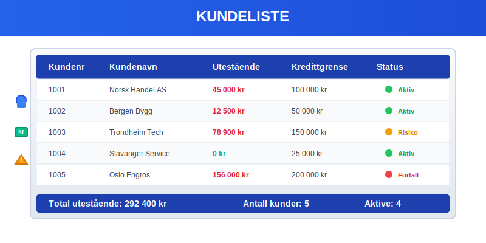
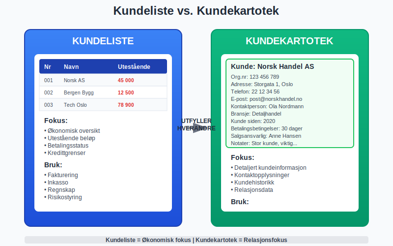
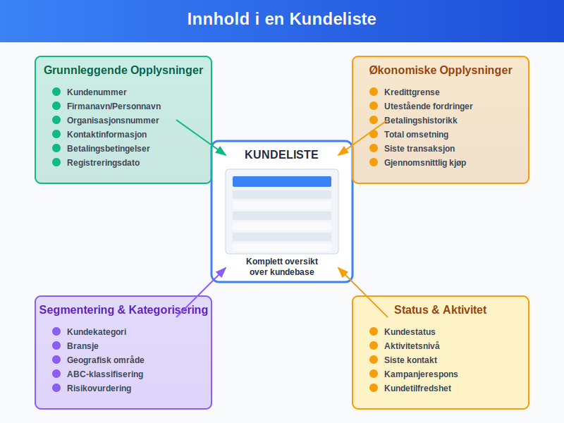
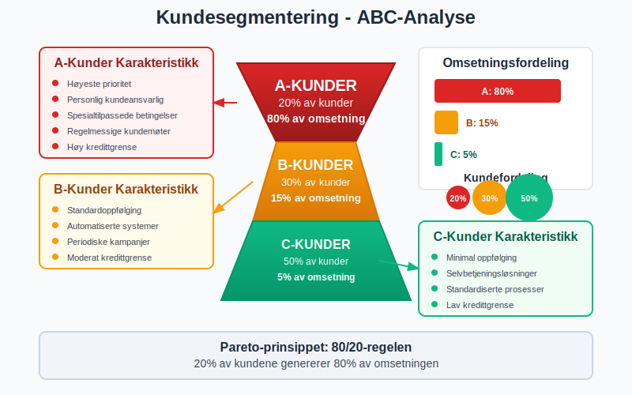
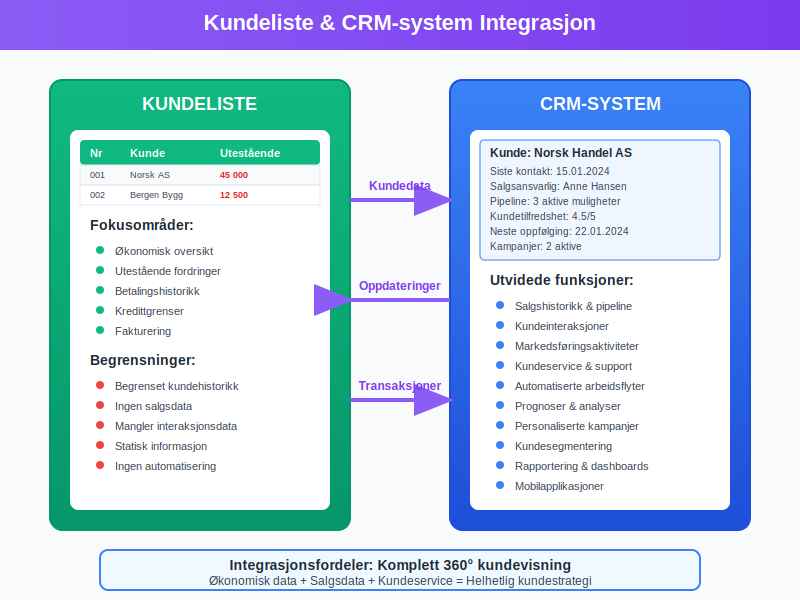
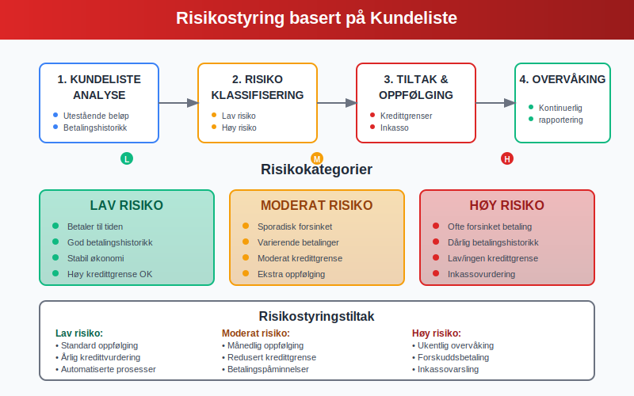
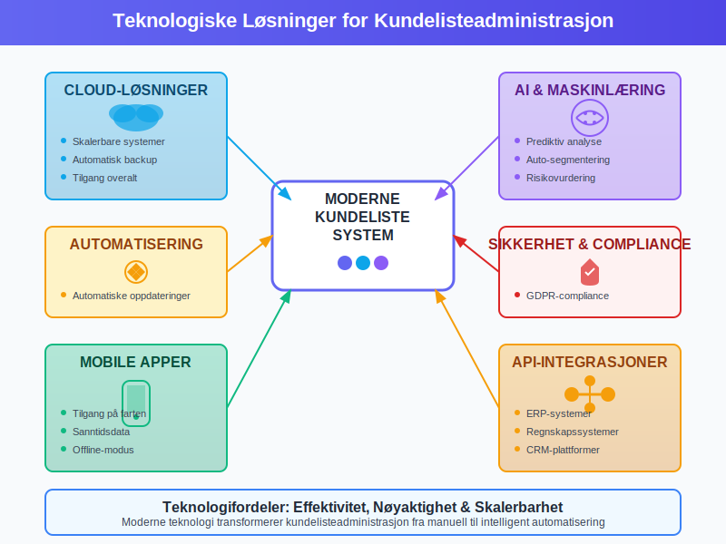

En **kundeliste** er et systematisk register over alle kunder som et foretak har forretningsforhold med. Dette er et grunnleggende verktøy innen regnskap og kundeadministrasjon som gir oversikt over kundebase, betalingshistorikk og økonomiske forhold.

## Definisjon av Kundeliste

En kundeliste er en **strukturert oversikt** over alle registrerte kunder i et foretak. Listen inneholder viktige opplysninger som:

* Kundens navn og kontaktinformasjon
* Kundenummer eller identifikasjon
* Betalingshistorikk og kredittgrenser
* Utestående fordringer og fakturaer
* Handelsvolum og kjøpsmønster

Kundelisten fungerer som et **sentralt register** som kobler sammen salg, fakturering og regnskap, og er essensielt for effektiv [kundeadministrasjon](/blogs/regnskap/hva-er-kunde "Hva er en Kunde? Komplett Guide til Kundebegrepet i Regnskap").

### Forskjell mellom Kundeliste og Kundekartotek

Mens en [kundekartotek](/blogs/regnskap/hva-er-kundekartotek "Hva er et Kundekartotek? Guide til Kunderegistrering og -administrasjon") inneholder detaljerte opplysninger om hver enkelt kunde, er kundelisten en **oversikt** som viser alle kunder samlet. Kundelisten er ofte mer fokusert på økonomiske aspekter som utestående beløp og betalingshistorikk.

## Innhold i en Kundeliste

### Grunnleggende Kundeopplysninger

En komplett kundeliste bør inneholde følgende **grunnleggende informasjon**:

* **Kundenummer** - Unik identifikator for hver kunde
* **Firmanavn/Personnavn** - Fullstendig navn på kunden
* **Organisasjonsnummer** - For bedriftskunder
* **Kontaktinformasjon** - Adresse, telefon, e-post
* **Betalingsbetingelser** - Kredittdager og betalingsvilkår

### Økonomiske Opplysninger

For regnskapsformål er følgende **økonomiske data** kritisk:

* **Kredittgrense** - Maksimalt tillatt utestående beløp
* **Utestående fordringer** - Aktuelle [kundefordringer](/blogs/regnskap/hva-er-kundefordring "Hva er Kundefordringer? Komplett Guide til Fordringer i Regnskap")
* **Betalingshistorikk** - Tidligere betalingsmønster
* **Omsetning** - Totalt salgsvolum per periode
* **Siste transaksjon** - Dato for siste kjøp eller betaling

### Segmentering og Kategorisering

Moderne kundelister inkluderer ofte **segmenteringsdata**:

* **Kundekategori** - Privat, bedrift, offentlig sektor
* **Bransje** - For bedriftskunder
* **Geografisk område** - Region eller marked
* **Kundeverdisegment** - A, B, C-kunder basert på verdi
* **Risikovurdering** - Kredittvurdering og betalingsrisiko

## Typer Kundelister

### Aktive vs. Passive Kunder

Kundelister kan organiseres etter **aktivitetsnivå**:

| Kundetype | Definisjon | Oppfølging |
|-----------|------------|------------|
| **Aktive kunder** | Kunder med transaksjoner siste 12 måneder | Regelmessig kontakt og tilbud |
| **Passive kunder** | Kunder uten nylige transaksjoner | Reaktiveringskampanjer |
| **Sovende kunder** | Kunder uten aktivitet over 24 måneder | Vurder arkivering |
| **Tapte kunder** | Kunder som har avsluttet forholdet | Analyse av årsaker |

### Segmenterte Kundelister

#### ABC-Analyse av Kunder

**A-kunder** (20% av kunder, 80% av omsetning):
* Høyeste prioritet i oppfølging
* Personlig kundeansvarlig
* Spesialtilpassede betalingsbetingelser
* Regelmessige kundemøter

**B-kunder** (30% av kunder, 15% av omsetning):
* Standardoppfølging
* Automatiserte systemer for fakturering
* Periodiske tilbud og kampanjer

**C-kunder** (50% av kunder, 5% av omsetning):
* Minimal oppfølging
* Selvbetjeningsløsninger
* Standardiserte prosesser

### Bransjespesifikke Kundelister

Ulike bransjer har **spesialiserte behov** for kundelister:

* **Detaljhandel** - Fokus på kjøpsfrekvens og sesongvariasjoner
* **B2B-salg** - Vekt på kontraktsverdier og fornyelser
* **Tjenesteyting** - Abonnement og gjentakende inntekter
* **Produksjon** - Leveransetider og volumrabatter

## Juridiske og Regnskapsmessige Krav

### Bokføringsloven og Kundelister

I henhold til [bokføringsloven](/blogs/regnskap/hva-er-bokforingsloven "Hva er Bokføringsloven? Komplett Guide til Norske Bokføringsregler") må foretak:

* **Registrere alle kunder** som har forretningsforhold med foretaket
* **Oppbevare kundedata** i minimum 5 år etter siste transaksjon
* **Sikre sporbarhet** mellom kundeliste og regnskapsbilag
* **Dokumentere endringer** i kundeopplysninger

### GDPR og Personvern

Kundelister som inneholder **personopplysninger** må følge GDPR-krav:

* **Samtykke** til lagring og behandling av persondata
* **Rett til innsyn** - Kunder kan kreve kopi av sine opplysninger
* **Rett til sletting** - Kunder kan kreve sletting av data
* **Datasikkerhet** - Beskyttelse mot uautorisert tilgang
* **Oppbevaringstid** - Ikke lagre data lenger enn nødvendig

### Regnskapsstandard for Kundefordringer

Kundelisten må være konsistent med [regnskapsføring](/blogs/regnskap/hva-er-regnskap "Hva er Regnskap? Komplett Guide til Regnskapsføring") av:

* **Kundefordringer** - Utestående fakturaer
* **Avsetninger** - For tapsutsatte fordringer
* **Nedskrivninger** - Av fordringer som ikke kan inndrives
* **Periodisering** - Av inntekter og kostnader

## Digitale Kundelister og CRM-systemer

### Moderne Kundelistesystemer

Dagens **digitale løsninger** tilbyr avansert funksjonalitet:

* **Automatisk oppdatering** fra salgs- og faktureringssystemer
* **Sanntidsrapportering** av kundedata og fordringer
* **Integrasjon** med [ERP-systemer](/blogs/regnskap/hva-er-erp-system "Hva er ERP-system? Komplett Guide til Enterprise Resource Planning")
* **Mobilapplikasjoner** for tilgang på farten
* **Kunstig intelligens** for kundeanalyse og prognoser

### CRM-integrasjon

Customer Relationship Management (CRM) systemer utvider kundelisten med:

* **Salgshistorikk** og kundeinteraksjoner
* **Markedsføringsaktiviteter** og kampanjerespons
* **Kundeservice** og supporthenvendelser
* **Salgsprognoser** og pipeline-analyse
* **Automatiserte arbeidsflyter** for oppfølging

## Praktisk Bruk av Kundelister

### Daglig Drift

Kundelisten brukes daglig til:

* **Fakturering** - Identifisere kunder for utsendelse av fakturaer
* **Betalingsoppfølging** - Spore utestående fordringer
* **Kredittvurdering** - Vurdere nye kunders kredittverdighet
* **Kundeservice** - Rask tilgang til kundeinformasjon
* **Salgsoppfølging** - Identifisere salgsmuligheter

### Rapportering og Analyse

#### Kundeanalyse

Kundelisten gir grunnlag for **strategiske analyser**:

* **Kundefordeling** - Geografisk og demografisk spredning
* **Omsetningsanalyse** - Bidrag fra ulike kundesegmenter
* **Betalingsanalyse** - Identifisere betalingsmønstre
* **Churn-analyse** - Forstå hvorfor kunder forsvinner
* **Lifetime Value** - Beregne kunders totale verdi

#### Nøkkeltall fra Kundelisten

| Nøkkeltall | Beregning | Formål |
|------------|-----------|--------|
| **Gjennomsnittlig kundeverdier** | Total omsetning / Antall kunder | Benchmarking |
| **Kundekonsentrasjon** | Top 10 kunder / Total omsetning | Risikovurdering |
| **Betalingstid** | Gjennomsnittlig dager fra faktura til betaling | Likviditetsstyring |
| **Kundetilfredshet** | Andel kunder med gjentakskjøp | Kvalitetsmåling |

### Risikostyring

Kundelisten er sentral for **kredittrisikostyring**:

* **Kredittgrenser** - Sette og overvåke maksimale utestående beløp
* **Risikoklassifisering** - Kategorisere kunder etter betalingsrisiko
* **Overvåking** - Identifisere kunder med betalingsproblemer
* **Inkasso** - Systematisk oppfølging av forfalte fordringer

## Beste Praksis for Kundelisteadministrasjon

### Datavedlikehold

For å sikre **datakvalitet** bør foretak:

* **Regelmessig oppdatering** - Verifiser kontaktinformasjon kvartalsvis
* **Duplikatkontroll** - Identifiser og slå sammen duplikate poster
* **Validering** - Kontroller organisasjonsnummer og adresser
* **Arkivering** - Flytt inaktive kunder til arkiv
* **Backup** - Sikkerhetskopier kundedata regelmessig

### Sikkerhet og Tilgangskontroll

Kundelister inneholder **sensitiv informasjon** og krever:

* **Tilgangsstyring** - Kun autorisert personell har tilgang
* **Kryptering** - Beskytt data både i hvile og under overføring
* **Loggføring** - Spor hvem som har tilgang til hvilke data
* **Regelmessige revisjoner** - Kontroller tilganger og sikkerhet
* **Opplæring** - Sikre at ansatte forstår sikkerhetskrav

### Integrasjon med Andre Systemer

Effektiv kundelisteadministrasjon krever **sømløs integrasjon** med:

* **Faktureringssystem** - Automatisk oppdatering av kundedata
* **Regnskapssystem** - Synkronisering av fordringer og betalinger
* **Lagersystem** - Koble kundeordrer til lagerføring
* **Markedsføringssystem** - Segmentering for målrettede kampanjer
* **Rapporteringssystem** - Automatiserte kundeanalyser

## Utfordringer og Løsninger

### Vanlige Utfordringer

#### Datakvalitet
**Problem**: Utdaterte eller feilaktige kundeopplysninger
**Løsning**: Implementer automatiserte valideringsrutiner og regelmessige dataoppryddinger

#### Duplikater
**Problem**: Samme kunde registrert flere ganger
**Løsning**: Bruk automatisk duplikatdeteksjon og etabler klare rutiner for kunderegistrering

#### Integrasjon
**Problem**: Kundedata spredt på flere systemer
**Løsning**: Implementer en sentral kundemaster med API-integrasjoner

#### Personvern
**Problem**: Kompliserte GDPR-krav
**Løsning**: Implementer personvernverktøy og etabler klare rutiner for databehandling

### Teknologiske Løsninger

Moderne teknologi tilbyr **innovative løsninger**:

* **Maskinlæring** - Automatisk kategorisering og risikovurdering
* **API-integrasjoner** - Sanntidssynkronisering mellom systemer
* **Cloud-løsninger** - Skalerbare og sikre kundelistesystemer
* **Mobile apper** - Tilgang til kundedata på farten
* **Automatisering** - Redusere manuelt arbeid med datavedlikehold

## Fremtiden for Kundelister

### Trender og Utviklingstrekk

**Kunstig intelligens** vil revolusjonere kundelisteadministrasjon:

* **Prediktiv analyse** - Forutsi kundeadferd og betalingsmønstre
* **Automatisk segmentering** - AI-drevet kundekategorisering
* **Personalisering** - Skreddersydde tilbud basert på kundedata
* **Chatbots** - Automatisert kundeservice og dataoppdatering

**Blockchain-teknologi** kan forbedre:

* **Datasikkerhet** - Uforanderlige kunderegistre
* **Tillit** - Verifiserbare kundetransaksjoner
* **Compliance** - Automatisk overholdelse av regelverk

### Regulatoriske Endringer

Fremtidige **regulatoriske krav** kan inkludere:

* **Økt transparens** - Krav om åpenhet i kundedata
* **Strengere personvern** - Utvidede GDPR-lignende regelverk
* **Standardisering** - Felles formater for kundedata
* **Sanntidsrapportering** - Krav om øyeblikkelig tilgang til kundedata

## Konklusjon

En **velorganisert kundeliste** er fundamentet for effektiv kundeadministrasjon og regnskapsføring. Den gir ikke bare oversikt over kundebase og utestående fordringer, men fungerer også som grunnlag for strategiske beslutninger og risikostyring.

Moderne digitale løsninger har transformert kundelisteadministrasjon fra manuelle registre til sofistikerte systemer som integrerer salg, regnskap og kundeservice. Ved å følge beste praksis for datavedlikehold, sikkerhet og integrasjon kan foretak maksimere verdien av sin kundeliste.

For å lykkes med kundelisteadministrasjon er det essensielt å:

* **Investere i riktige teknologiske løsninger** som støtter forretningsbehovene
* **Etablere klare rutiner** for datavedlikehold og kvalitetssikring  
* **Sikre compliance** med juridiske krav og personvernregelverk
* **Utnytte data** for strategiske analyser og forbedret kundeservice
* **Forberede seg på fremtidige trender** innen teknologi og regulering

En godt administrert kundeliste er ikke bare et regnskapsverktøy, men en strategisk ressurs som kan drive vekst og lønnsomhet i enhver virksomhet.

