---
title: "Hva er kundereskontro?"
seoTitle: "Hva er kundereskontro?"
meta_description: '**Kundereskontro** er et detaljert register som viser alle økonomiske transaksjoner mellom bedriften og hver enkelt kunde. Dette er en **underreskontro** til [...'
slug: hva-er-kundereskontro
type: blog
layout: pages/single
---

**Kundereskontro** er et detaljert register som viser alle økonomiske transaksjoner mellom bedriften og hver enkelt kunde. Dette er en **underreskontro** til [hovedboken](/blogs/regnskap/hva-er-hovedbok "Hva er Hovedbok i Regnskap? Komplett Guide til Regnskapsføring") som gir en komplett oversikt over [kundefordringer](/blogs/regnskap/hva-er-kundefordring "Hva er Kundefordringer? Komplett Guide til Fordringsstyring") og betalingshistorikk for hver kunde individuelt.

I motsetning til [ansattreskontro](/blogs/regnskap/hva-er-ansattreskontro "Hva er Ansattreskontro? En Guide til Ansattkontoer i Regnskap") som håndterer ansattes økonomiske forhold, fokuserer kundereskontro på å spore alle salgs- og betalingstransaksjoner med kunder.

For en generell oversikt over reskontro, se [Hva er Reskontro?](/blogs/regnskap/hva-er-reskontro "Hva er Reskontro? En Guide til Underreskontro og Hovedbok").

## Hva inneholder en kundereskontro?

En kundereskontro fungerer som en individuell konto for hver kunde og inneholder detaljert informasjon om alle økonomiske forhold mellom bedriften og kunden.

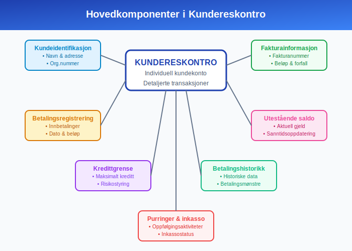

### Hovedkomponenter i kundereskontro:

* **Kundeidentifikasjon:** Navn, adresse, organisasjonsnummer og kontaktinformasjon
* **Fakturainformasjon:** Alle utstedte [fakturaer](/blogs/regnskap/hva-er-en-faktura "Hva er en Faktura? En Guide til Norske Fakturakrav") med beløp og forfallsdatoer
* **Betalingsregistrering:** Innbetalinger med dato og beløp
* **Utestående saldo:** Aktuell gjeld kunden har til bedriften
* **Kredittgrense:** Maksimalt kredittbeløp for kunden
* **Betalingshistorikk:** Historisk oversikt over betalingsmønstre
* **Purringer og inkasso:** Registrering av oppfølgingsaktiviteter

## Forskjellen mellom Kundereskontro og Hovedbok

Mange forveksler kundereskontro med hovedbokføring, men det er viktige forskjeller mellom disse systemene.

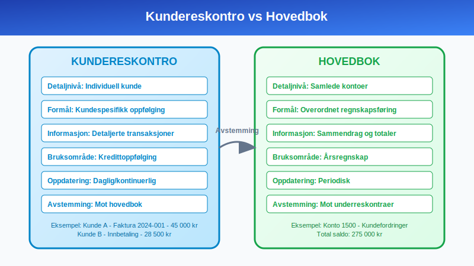

### Hovedforskjeller:

| Aspekt | Kundereskontro | Hovedbok |
|--------|----------------|----------|
| **Detaljnivå** | Individuell kunde | Samlede kontoer |
| **Formål** | Kundespesifikk oppfølging | Overordnet regnskapsføring |
| **Informasjon** | Detaljerte transaksjoner | Sammendrag og totaler |
| **Bruksområde** | Kredittoppfølging, fakturering | Årsregnskap, rapportering |
| **Oppdateringsfrekvens** | Daglig/kontinuerlig | Periodisk |
| **Avstemming** | Mot hovedbok | Mot underreskontraer |

## Kundereskontro i praksis

Kundereskontro oppdateres kontinuerlig når transaksjoner med kunder finner sted og danner grunnlaget for effektiv [debitoroppfølging](/blogs/regnskap/hva-er-debitor "Hva er Debitor? Komplett Guide til Kundefordringer og Oppfølging").

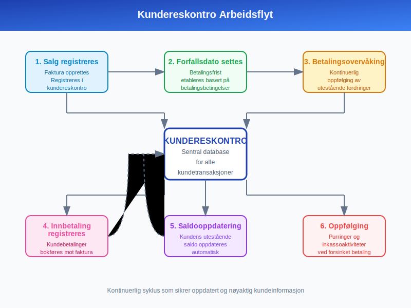

### Typisk arbeidsflyt:

1. **Salg registreres:** Faktura opprettes og registreres i kundereskontro
2. **Forfallsdato settes:** Betalingsfrist etableres basert på betalingsbetingelser
3. **Betalingsovervåking:** Kontinuerlig oppfølging av utestående fordringer
4. **Innbetaling registreres:** Kundebetalinger bokføres mot riktig faktura
5. **Saldooppdatering:** Kundens utestående saldo oppdateres automatisk
6. **Oppfølging:** Purringer og inkassoaktiviteter ved forsinket betaling

## Praktisk eksempel på kundereskontro

Her er et detaljert eksempel på hvordan en kundereskontro kan se ut for en kunde over en tremånedersperiode:

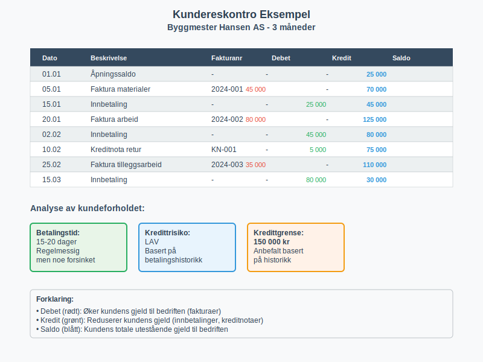

### Kunde: Byggmester Hansen AS

| Dato | Beskrivelse | Fakturanr | Debet | Kredit | Saldo |
|------|-------------|-----------|-------|--------|-------|
| 01.01 | Åpningssaldo | - | - | - | 25 000 |
| 05.01 | Faktura materialer | 2024-001 | 45 000 | - | 70 000 |
| 15.01 | Innbetaling | - | - | 25 000 | 45 000 |
| 20.01 | Faktura arbeid | 2024-002 | 80 000 | - | 125 000 |
| 02.02 | Innbetaling | - | - | 45 000 | 80 000 |
| 10.02 | [Kreditnota](/blogs/regnskap/hva-er-kreditnota "Hva er en Kreditnota? Komplett Guide til Kreditnotaer i Norge") retur | KN-001 | - | 5 000 | 75 000 |
| 25.02 | Faktura tilleggsarbeid | 2024-003 | 35 000 | - | 110 000 |
| 15.03 | Innbetaling | - | - | 80 000 | 30 000 |

### Analyse av kundeforholdet:

* **Gjennomsnittlig betalingstid:** 15-20 dager
* **Betalingsmønster:** Regelmessig, men noe forsinket
* **Kredittrisiko:** Lav basert på betalingshistorikk
* **Anbefalt kredittgrense:** 150 000 kr

## Typer kundereskontro-systemer

Moderne bedrifter kan velge mellom ulike tilnærminger til kundereskontro avhengig av størrelse og kompleksitet.

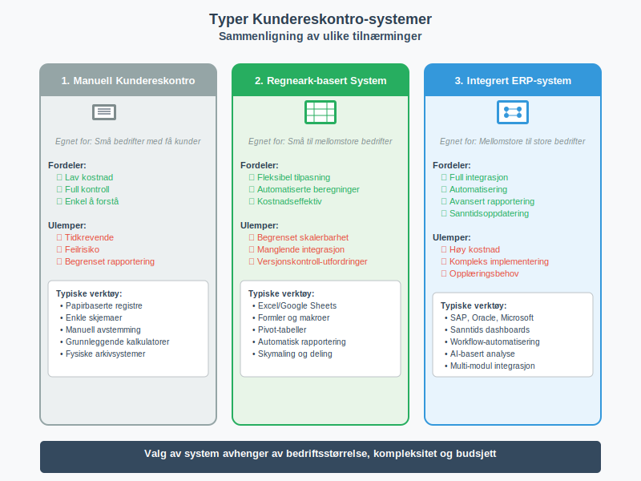

### 1. Manuell kundereskontro

**Egnet for:** Små bedrifter med få kunder

**Fordeler:**
* Lav kostnad
* Full kontroll
* Enkel å forstå

**Ulemper:**
* Tidkrevende
* Feilrisiko
* Begrenset rapportering

### 2. Regneark-basert system

**Egnet for:** Små til mellomstore bedrifter

**Fordeler:**
* Fleksibel tilpasning
* Automatiserte beregninger
* Kostnadseffektiv

**Ulemper:**
* Begrenset skalerbarhet
* Manglende integrasjon
* Versjonskontroll-utfordringer

### 3. Integrert ERP-system

**Egnet for:** Mellomstore til store bedrifter

**Fordeler:**
* Full integrasjon
* Automatisering
* Avansert rapportering
* Sanntidsoppdatering

**Ulemper:**
* Høy kostnad
* Kompleks implementering
* Opplæringsbehov

## Regnskapsføring og kundereskontro

Kundereskontro må stemme overens med hovedbokens kundefordringskonto for å sikre korrekt regnskapsføring.

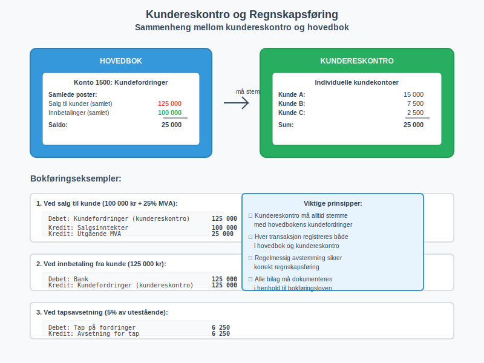

### Bokføringseksempler:

**Ved salg til kunde (100 000 kr + 25% MVA):**
```
Debet: Kundefordringer (kundereskontro)  125 000
Kredit: Salgsinntekter                   100 000
Kredit: Utgående MVA                      25 000
```

**Ved innbetaling fra kunde (125 000 kr):**
```
Debet: Bank                              125 000
Kredit: Kundefordringer (kundereskontro) 125 000
```

**Ved tapsavsetning (5% av utestående):**
```
Debet: Tap på fordringer                   6 250
Kredit: Avsetning for tap                  6 250
```

## Aldersanalyse av kundefordringer

En av de viktigste rapportene fra kundereskontro er aldersanalysen som viser hvor lenge fordringer har vært utestående.

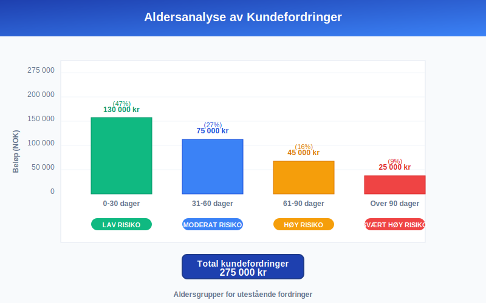

### Eksempel på aldersanalyse:

| Kunde | Total | 0-30 dager | 31-60 dager | 61-90 dager | Over 90 dager |
|-------|-------|------------|-------------|-------------|---------------|
| Kunde A | 150 000 | 100 000 | 50 000 | - | - |
| Kunde B | 80 000 | 30 000 | 25 000 | 25 000 | - |
| Kunde C | 45 000 | - | - | 20 000 | 25 000 |
| **Totalt** | **275 000** | **130 000** | **75 000** | **45 000** | **25 000** |
| **Prosent** | **100%** | **47%** | **27%** | **16%** | **9%** |

### Risikovurdering basert på alder:

* **0-30 dager:** Lav risiko - normal betalingstid
* **31-60 dager:** Moderat risiko - send påminnelse
* **61-90 dager:** Høy risiko - aktiv oppfølging
* **Over 90 dager:** Svært høy risiko - vurder inkasso

## Kredittoppfølging og kundereskontro

Kundereskontro er grunnlaget for systematisk kredittoppfølging og risikostyring.

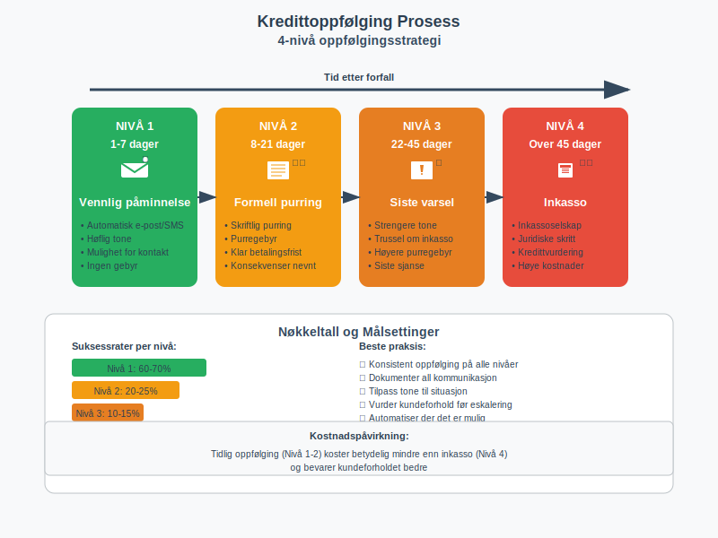

### Oppfølgingsstrategi:

#### Nivå 1: Vennlig påminnelse (1-7 dager etter forfall)
* Automatisk e-post eller SMS
* Høflig tone
* Mulighet for å kontakte ved spørsmål

#### Nivå 2: Formell purring (8-21 dager etter forfall)
* Skriftlig purring med gebyr
* Klar betalingsfrist
* Konsekvenser ved manglende betaling

#### Nivå 3: Siste varsel (22-45 dager etter forfall)
* Strengere tone
* Trussel om inkasso
* Høyere purregebyr

#### Nivå 4: Inkasso (over 45 dager etter forfall)
* Overføring til inkassoselskap
* Juridiske skritt
* Kredittvurdering påvirkes

## Juridiske krav til kundereskontro

Norsk lovgivning stiller spesifikke krav til dokumentasjon av kundeforhold og fordringsstyring.

### Bokføringsloven og kundereskontro:

* **Dokumentasjonsplikt:** Alle transaksjoner må dokumenteres med bilag
* **Oppbevaringstid:** Minimum 5 år etter regnskapsårets slutt
* **Sporbarhet:** Klar sammenheng mellom bilag og registreringer
* **Revisjonsplikt:** Kundereskontro må være tilgjengelig for revisjon

### Personvernforordningen (GDPR):

* **Databehandling:** Kun nødvendige kundedata
* **Samtykke:** Klar hjemmel for databehandling
* **Sletting:** Rutiner for sletting av utdaterte data
* **Sikkerhet:** Beskyttelse mot uautorisert tilgang

## Automatisering av kundereskontro

Moderne teknologi gjør det mulig å automatisere mange aspekter ved kundereskontro-håndtering.

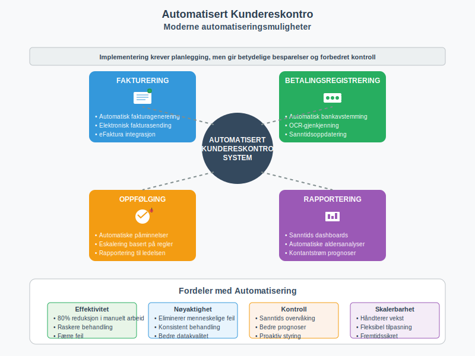

### Automatiseringsmuligheter:

#### Fakturering:
* Automatisk fakturagenerering
* Elektronisk fakturasending
* Integrering med [eFaktura](/blogs/regnskap/hva-er-efaktura "Hva er eFaktura? Komplett Guide til Elektronisk Fakturering")

#### Betalingsregistrering:
* Automatisk bankavstemming
* OCR-gjenkjenning av betalinger
* Sanntidsoppdatering av saldoer

#### Oppfølging:
* Automatiske påminnelser
* Eskalering basert på regler
* Rapportering til ledelsen

#### Rapportering:
* Sanntids dashboards
* Automatiske aldersanalyser
* Prognoser for kontantstrøm

## Utfordringer med kundereskontro

Selv med moderne systemer kan det oppstå utfordringer knyttet til kundereskontro-håndtering.

### Vanlige problemer:

#### Tekniske utfordringer:
* **Systemintegrasjon:** Problemer med dataflyt mellom systemer
* **Dataqualitet:** Feil eller manglende kundeinformasjon
* **Backup og sikkerhet:** Risiko for datatap

#### Operasjonelle utfordringer:
* **Manuell registrering:** Tidkrevende og feilutsatt
* **Oppfølgingsrutiner:** Inkonsistent håndtering av forfalte fordringer
* **Ressursmangel:** Utilstrekkelig bemanning for oppfølging

#### Juridiske utfordringer:
* **Personvern:** Overholdelse av GDPR-krav
* **Inkassoloven:** Korrekt håndtering av inkassoprosesser
* **Dokumentasjon:** Tilstrekkelig dokumentasjon for revisjon

## Kundereskontro og kontantstrømstyring

Effektiv kundereskontro-håndtering er avgjørende for bedriftens [kontantstrøm](/blogs/regnskap/hva-er-kontantstrom "Hva er Kontantstrøm? Komplett Guide til Kontantstrømanalyse") og likviditet.

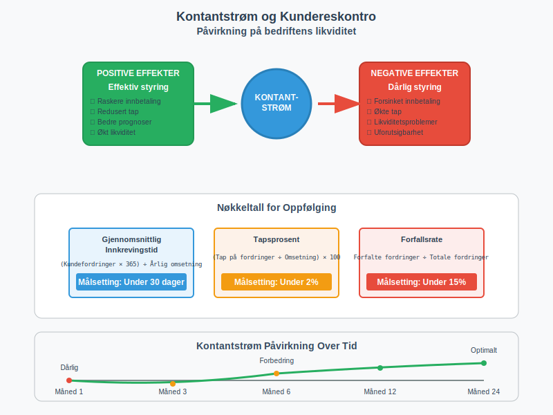

### Påvirkning på kontantstrøm:

#### Positive effekter:
* **Raskere innbetaling:** Effektiv oppfølging reduserer betalingstid
* **Redusert tap:** Tidlig identifisering av risikokunder
* **Bedre prognoser:** Nøyaktige kontantstrømsprognoser

#### Negative effekter ved dårlig styring:
* **Forsinket innbetaling:** Manglende oppfølging forlenger betalingstid
* **Økte tap:** Sent oppdagede betalingsproblemer
* **Likviditetsproblemer:** Uforutsigbar kontantstrøm

### Nøkkeltall for oppfølging:

| Nøkkeltall | Beregning | Målsetting |
|------------|-----------|------------|
| **Gjennomsnittlig innkrevingstid** | (Kundefordringer × 365) ÷ Årlig omsetning | Under 30 dager |
| **Tapsprosent** | (Tap på fordringer ÷ Omsetning) × 100 | Under 2% |
| **Forfallsrate** | Forfalte fordringer ÷ Totale fordringer | Under 15% |

## Beste praksis for kundereskontro

For å sikre effektiv kundereskontro-håndtering bør bedrifter følge etablerte beste praksis.

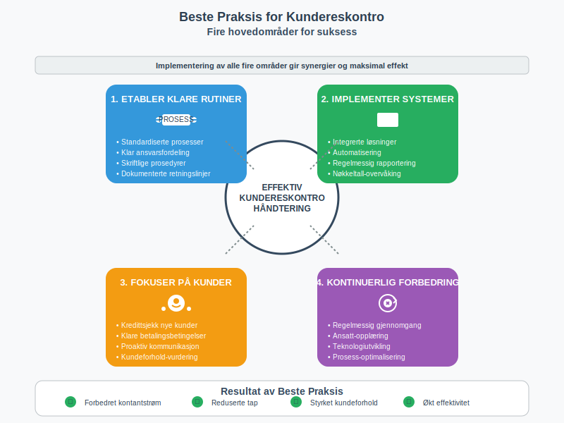

### Anbefalinger:

#### 1. Etabler klare rutiner
* **Standardiserte prosesser:** Konsistent håndtering av alle kunder
* **Ansvarsfordeling:** Klare roller og ansvar
* **Dokumentasjon:** Skriftlige prosedyrer og retningslinjer

#### 2. Implementer effektive systemer
* **Integrerte løsninger:** Sammenheng mellom salg, fakturering og regnskap
* **Automatisering:** Reduser manuelt arbeid og feilrisiko
* **Rapportering:** Regelmessig overvåking av nøkkeltall

#### 3. Fokuser på kundeforhold
* **Kredittsjekk:** Vurder nye kunders kredittverdighet
* **Betalingsbetingelser:** Klare og rettferdige vilkår
* **Kommunikasjon:** Proaktiv dialog med kunder

#### 4. Kontinuerlig forbedring
* **Regelmessig gjennomgang:** Evaluer prosesser og resultater
* **Opplæring:** Sikre kompetanse hos ansatte
* **Teknologiutvikling:** Hold deg oppdatert på nye løsninger

## Sammenheng med andre regnskapsbegreper

Kundereskontro henger sammen med flere andre viktige regnskapsbegreper som er essensielle for å forstå det totale bildet.

### Relaterte begreper:

* **[Hovedbok](/blogs/regnskap/hva-er-hovedbok "Hva er Hovedbok i Regnskap? Komplett Guide til Regnskapsføring"):** Overordnet regnskapssystem som kundereskontro rapporterer til
* **[Kundefordringer](/blogs/regnskap/hva-er-kundefordring "Hva er Kundefordringer? Komplett Guide til Fordringsstyring"):** Samlede krav bedriften har på kunder
* **[Debitor](/blogs/regnskap/hva-er-debitor "Hva er Debitor? Komplett Guide til Kundefordringer og Oppfølging"):** Kunde som skylder penger til bedriften
* **[Avstemming](/blogs/regnskap/hva-er-avstemming "Hva er Avstemming i Regnskap? Komplett Guide til Regnskapskontroll"):** Kontroll av at kundereskontro stemmer med hovedbok
* **[Arbeidskapital](/blogs/regnskap/hva-er-arbeidskapital "Hva er Arbeidskapital? Beregning, Analyse og Optimalisering"):** Kundefordringer er en viktig del av arbeidskapitalen

## Fremtiden for kundereskontro

Med økende digitalisering og automatisering utvikler kundereskontro-håndtering seg kontinuerlig.


### Teknologiske trender:

#### Kunstig intelligens (AI):
* **Prediktiv analyse:** Forutsi betalingsatferd
* **Automatisk risikoscoring:** Vurder kredittverdighet
* **Chatbots:** Automatisert kundekommunikasjon

#### Blockchain-teknologi:
* **Smart contracts:** Automatiske betalingsavtaler
* **Transparent historikk:** Uforanderlig transaksjonshistorikk
* **Redusert svindel:** Økt sikkerhet og tillit

#### Sanntidsintegrasjon:
* **Øyeblikkelig oppdatering:** Sanntids saldoinformasjon
* **Mobil tilgang:** Tilgang fra hvor som helst
* **API-integrasjoner:** Sømløs dataflyt mellom systemer

## Konklusjon

Kundereskontro er et **fundamentalt verktøy** i moderne regnskapsføring som sikrer effektiv håndtering av kundeforhold og fordringsstyring. Ved å implementere gode rutiner og moderne teknologi kan bedrifter:

* **Forbedre kontantstrømmen** gjennom raskere innkreving
* **Redusere tap** på fordringer gjennom bedre oppfølging  
* **Styrke kundeforhold** gjennom profesjonell håndtering
* **Øke effektiviteten** gjennom automatisering av rutineoppgaver

For bedrifter som ønsker å optimalisere sin økonomistyring, er investering i moderne kundereskontro-systemer og -prosesser en kritisk suksessfaktor som direkte påvirker lønnsomhet og vekstmuligheter.


