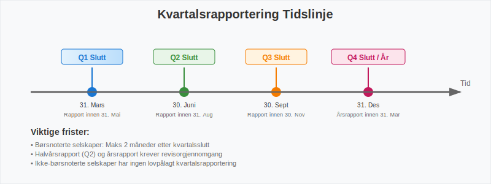
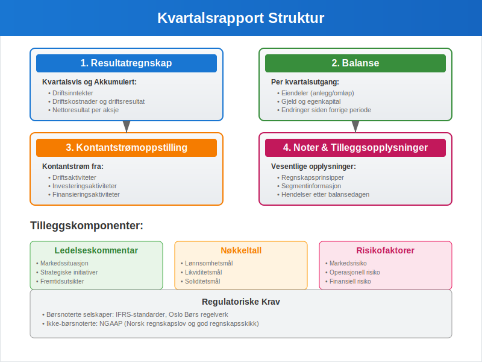
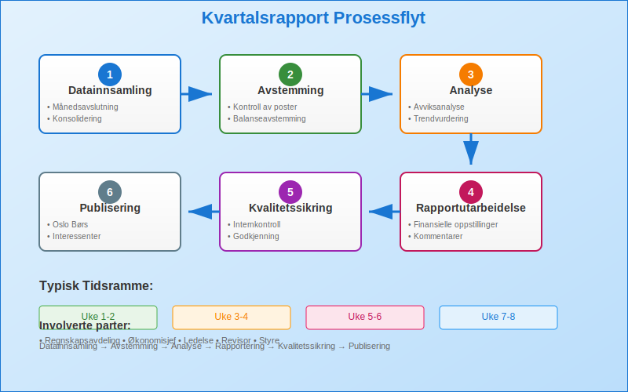
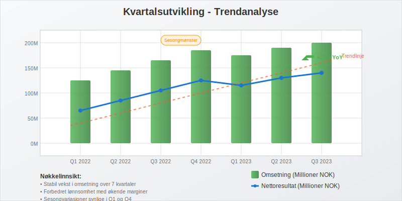
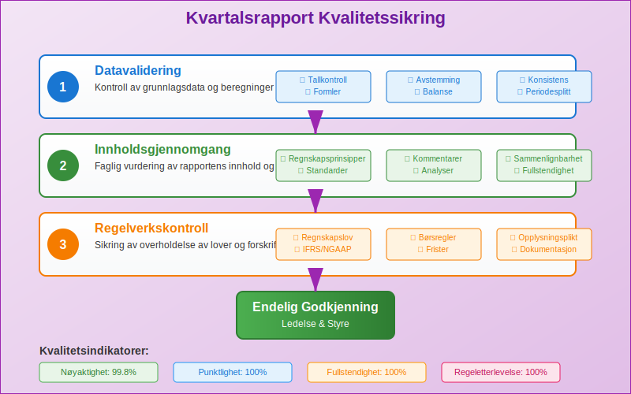
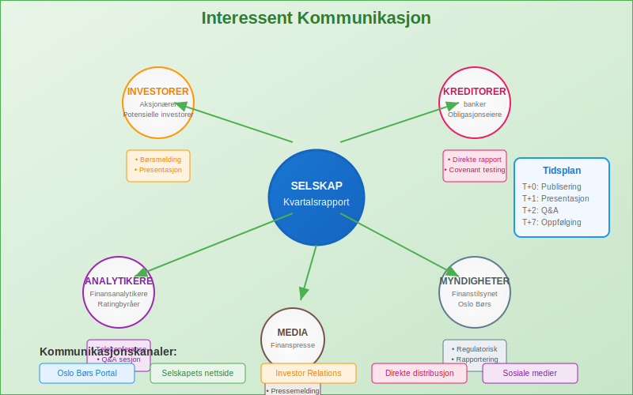

---
title: "Hva er kvartalsrapport?"
seoTitle: "Hva er kvartalsrapport?"
description: 'En **kvartalsrapport** er en finansiell rapport som selskaper utarbeider og publiserer hver tredje måned for å gi interessenter oppdatert informasjon om selsk...'
summary: "Hva en kvartalsrapport er, hvem som må rapportere, hva rapporten inneholder og hvordan tallene brukes til analyse, styring og kommunikasjon."
---

En **kvartalsrapport** er en finansiell rapport som selskaper utarbeider og publiserer hver tredje måned for å gi interessenter oppdatert informasjon om selskapets økonomiske utvikling og resultater. Kvartalsrapportering følger bedriftens [terminer](/blogs/regnskap/hva-er-termin "Hva er Termin? Regnskapsperioder og Terminplanlegging") og er en sentral del av [finansregnskapet](/blogs/regnskap/hva-er-finansregnskap "Hva er Finansregnskap? En Komplett Guide til Ekstern Finansiell Rapportering") som spiller en viktig rolle i å opprettholde transparens og tillit i finansmarkedene.

For å forstå kvartalsrapportens plass i det større regnskapsbildet, er det viktig å ha grunnleggende kunnskap om [regnskap](/blogs/regnskap/hva-er-regnskap "Hva er Regnskap? En Dybdeanalyse for Norge") og hvordan [bokføring](/blogs/regnskap/hva-er-bokforing "Hva er Bokføring? En Komplett Guide til Norsk Bokføringspraksis") danner grunnlaget for all finansiell rapportering.

## Seksjon 1: Lovkrav og Regulatoriske Bestemmelser

### 1.1 Børsnoterte Selskaper

Børsnoterte selskaper i Norge har **strenge rapporteringskrav** som reguleres av Verdipapirhandelloven og Oslo Børs' regelverk. Disse selskapene må publisere kvartalsrapporter innen **to måneder** etter kvartalets slutt.

**Hovedkrav for børsnoterte selskaper:**

* Kvartalsvis rapportering ([Q1, Q2, Q3, Q4](/blogs/regnskap/regnskapskvartaler-q1-q4 "Q1-Q4 Regnskapskvartaler - Komplett Guide til Kvartalsstyring"))
* Publisering på Oslo Børs' rapporteringsportal
* Samtidig distribusjon til alle interessenter
* Overholdelse av [IFRS](/blogs/regnskap/hva-er-ifrs "Hva er IFRS? Komplett Guide til International Financial Reporting Standards") standarder
* Revisorgjennomgang for halvårs- og årsrapporter

### 1.2 Ikke-børsnoterte Selskaper

Ikke-børsnoterte selskaper har **færre rapporteringskrav**, men mange velger likevel å utarbeide kvartalsrapporter for interne formål eller for å tilfredsstille krav fra långivere og investorer.

| Selskapstype | Kvartalsrapport Påkrevd | Rapporteringsstandard | Frist |
|--------------|-------------------------|----------------------|-------|
| Børsnoterte ASA | Ja | IFRS | 2 måneder |
| Store ikke-børsnoterte ASA | Nei (anbefalt) | NGAAP/IFRS | Ikke fastsatt |
| Mindre ASA | Nei | NGAAP | Ikke fastsatt |
| AS | Nei | NGAAP | Ikke fastsatt |

## Seksjon 2: Innhold i Kvartalsrapporten

### 2.1 Kjernekomponenter

En kvartalsrapport inneholder typisk følgende hovedelementer som bygger på prinsippene fra [balanseregnskap](/blogs/regnskap/hva-er-balanseregnskap "Hva er Balanseregnskap? Komplett Guide til Balansens Oppbygging og Analyse"):

**1. Resultatregnskap (Kvartalsvis og Akkumulert)**

* [Driftsinntekter](/blogs/regnskap/hva-er-driftsinntekter "Hva er Driftsinntekter? Komplett Guide til Driftsinntekter i Regnskap") for kvartalet
* [Driftskostnader](/blogs/regnskap/hva-er-driftskostnader "Hva er Driftskostnader? Typer, Beregning og Regnskapsføring - Komplett Guide") og [driftsresultat](/blogs/regnskap/hva-er-driftsresultat "Hva er Driftsresultat? Komplett Guide til EBIT og Driftsresultat")
* Finansposter og skattekostnad
* Nettoresultat per aksje

**2. Balanse (Kvartalsutgang)**

* [Eiendeler](/blogs/regnskap/hva-er-aktiva "Hva er Aktiva? En Komplett Guide til Eiendeler i Regnskap") fordelt på anleggsmidler og omløpsmidler
* [Gjeld](/blogs/regnskap/hva-er-gjeld "Hva er Gjeld i Regnskap? Komplett Guide til Forpliktelser og Gjeldstyper") og [egenkapital](/blogs/regnskap/hva-er-egenkapital "Hva er Egenkapital? Komplett Guide til Egenkapital i Regnskap")
* Endringer siden forrige rapporteringsperiode

**3. Kontantstrømoppstilling**

* Kontantstrøm fra drift, investering og finansiering
* Endring i [kontantbeholdning](/blogs/regnskap/hva-er-kontantbeholdning "Hva er Kontantbeholdning? Komplett Guide til Kontanter og Bankinnskudd")

### 2.2 Tilleggsopplysninger og Noter

Kvartalsrapporter må også inneholde **vesentlige tilleggsopplysninger** som gir kontekst til tallene:

* Regnskapsprinsipper og endringer
* Segmentinformasjon
* Hendelser etter balansedagen
* Usikkerhet og risikofaktorer
* Sammenlignbare tall fra tidligere perioder

## Seksjon 3: Utarbeidelse og Prosess

### 3.1 Forberedelse og Planlegging

Utarbeidelse av kvartalsrapporter krever **systematisk planlegging** og koordinering mellom ulike avdelinger:

**Hovedsteg i prosessen:**

1. **Månedsavslutning og Konsolidering**
   * Fullføring av [bokføring](/blogs/regnskap/hva-er-bokforing "Hva er Bokføring? En Komplett Guide til Norsk Bokføringspraksis") for kvartalet
   * [Avstemming](/blogs/regnskap/hva-er-avstemming "Hva er Avstemming? Komplett Guide til Regnskapsavstemming") av alle hovedbokskontoer
   * Konsolidering av datterselskaper

2. **Analyse og Kvalitetssikring**
   * Sammenligning med budsjett og tidligere perioder
   * Identifisering av avvik og forklaringer
   * Gjennomgang av [internkontroll](/blogs/regnskap/hva-er-internkontroll "Hva er Internkontroll? Komplett Guide til Internkontrollsystemer")

3. **Rapportutarbeidelse**
   * Utarbeiding av finansielle oppstillinger
   * Skriving av kommentarer og analyser
   * Kvalitetssikring og godkjenning

### 3.2 Teknologi og Automatisering

Moderne kvartalsrapportering drar nytte av **digitale løsninger** og automatisering:

* [ERP-systemer](/blogs/regnskap/hva-er-erp-system "Hva er ERP-system? Komplett Guide til Enterprise Resource Planning") for integrert databehandling
* [API-integrasjoner](/blogs/regnskap/api-integrasjon-automatisering-regnskap "API-integrasjon og Automatisering i Regnskap - Komplett Guide") for automatisk dataoverføring
* Rapporteringsverktøy for effektiv presentasjon

## Seksjon 4: Analyse og Bruk av Kvartalsrapporter

### 4.1 Nøkkeltall og Indikatorer

Kvartalsrapporter gir grunnlag for beregning av viktige **finansielle nøkkeltall**:

| Kategori | Nøkkeltall | Beregning | Formål |
|----------|------------|-----------|---------|
| Lønnsomhet | [Bruttofortjeneste](/blogs/regnskap/hva-er-bruttofortjeneste "Hva er Bruttofortjeneste? Komplett Guide til Bruttomargin og Beregning") | (Omsetning - Varekostnad) / Omsetning | Måle operasjonell effektivitet |
| Likviditet | [Arbeidskapital](/blogs/regnskap/hva-er-arbeidskapital "Hva er Arbeidskapital? En Komplett Guide til Working Capital") | Omløpsmidler - Kortsiktig gjeld | Vurdere kortsiktig betalingsevne |
| Soliditet | [Egenkapitalandel](/blogs/regnskap/hva-er-egenkapital "Hva er Egenkapital? Komplett Guide til Egenkapital i Regnskap") | Egenkapital / Total kapital | Måle finansiell stabilitet |
| Effektivitet | [Kapitalrentabilitet](/blogs/regnskap/hva-er-egenkapitalrentabilitet "Hva er Egenkapitalrentabilitet? Komplett Guide til ROE-beregning") | Nettoresultat / Gjennomsnittlig egenkapital | Vurdere avkastning til eiere |

### 4.2 Trendanalyse og Sammenligning

**Viktige analyseområder:**

* **Sesongvariasjoner:** Mange virksomheter har naturlige svingninger gjennom året
* **Veksttrend:** Sammenligning av samme kvartal i ulike år
* **Marginsutvikling:** Endringer i lønnsomhet over tid
* **Kontantstrømsmønstre:** Regularitet i kontantgenerering

## Seksjon 5: Særlige Hensyn og Utfordringer

### 5.1 Estimater og Periodisering

Kvartalsrapportering innebærer ofte **økt bruk av estimater** sammenlignet med årsrapporter:

* Skattekostnader basert på forventet årsresultat
* Periodisering av sesongrelaterte kostnader
* Foreløpige verdivurderinger av eiendeler

### 5.2 Sammenlignbarhet og Konsistens

For å sikre **sammenlignbare rapporter** må selskaper:

* Anvende konsistente regnskapsprinsipper
* Justere for engangseffekter og ekstraordinære poster
* Gi tilstrekkelig informasjon om endringer

## Seksjon 6: Digitalisering og Fremtidige Trender

### 6.1 Automatisering av Rapporteringsprosessen

Moderne teknologi transformerer kvartalsrapportering:

* **Sanntidsrapportering:** Kontinuerlig oppdatering av finansielle data
* **Kunstig intelligens:** Automatisk identifisering av avvik og trender
* **Blockchain:** Økt transparens og sporbarhet i finansiell rapportering

### 6.2 ESG-rapportering

Økende fokus på **bærekraftsrapportering** påvirker kvartalsrapporter:

* [ESG-indikatorer](/blogs/regnskap/hva-er-esg "Hva er ESG? Komplett Guide til Environmental, Social og Governance") integreres i finansiell rapportering
* [CSRD-direktivet](/blogs/regnskap/hva-er-csrd "Hva er CSRD? Komplett Guide til Corporate Sustainability Reporting Directive") krever utvidet bærekraftsrapportering
* [GHG-protokollen](/blogs/regnskap/hva-er-ghg-protokollen "Hva er GHG-protokollen? Komplett Guide til Greenhouse Gas Protocol") for klimarapportering

## Seksjon 7: Praktiske Tips for Bedre Kvartalsrapportering

### 7.1 Forberedelse og Organisering

**Beste praksis for effektiv kvartalsrapportering:**

* Etabler faste rutiner og tidsplaner
* Involver alle relevante avdelinger tidlig i prosessen
* Dokumenter alle vesentlige forutsetninger og estimater
* Gjennomfør regelmessige kvalitetskontroller

### 7.2 Kommunikasjon med Interessenter

* **Klarhet:** Bruk enkelt og forståelig språk
* **Transparens:** Forklar vesentlige endringer og avvik
* **Konsistens:** Oppretthold samme struktur og format
* **Aktualitet:** Publiser innen fastsatte frister

## Konklusjon

Kvartalsrapporter er et **essensielt verktøy** for finansiell kommunikasjon og styring. De gir interessenter regelmessig innsikt i selskapers utvikling og bidrar til økt transparens i finansmarkedene. For selskaper representerer kvartalsrapportering både en regulatorisk forpliktelse og en mulighet til å demonstrere verdiskapning og strategisk fremgang.

Effektiv kvartalsrapportering krever **solid forståelse** av regnskapsprinsipper, systematiske prosesser og god kommunikasjon. Med økende digitalisering og automatisering blir prosessen mer effektiv, samtidig som kravene til kvalitet og transparens fortsetter å øke.

For selskaper som ønsker å forbedre sin kvartalsrapportering, er det viktig å investere i riktige systemer, kompetanse og prosesser. Dette sikrer ikke bare overholdelse av regulatoriske krav, men bidrar også til bedre intern styring og økt tillit fra investorer og andre interessenter.

