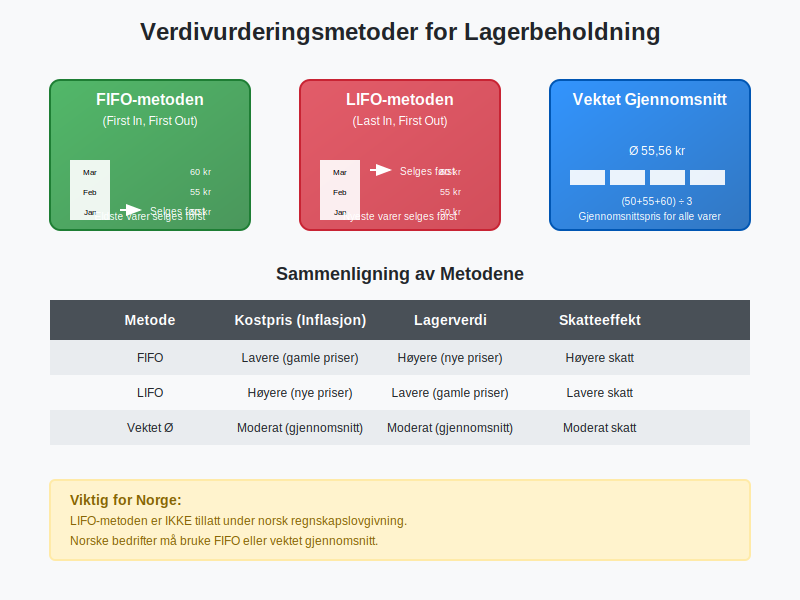
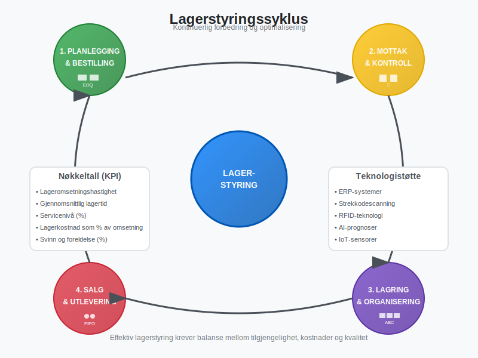
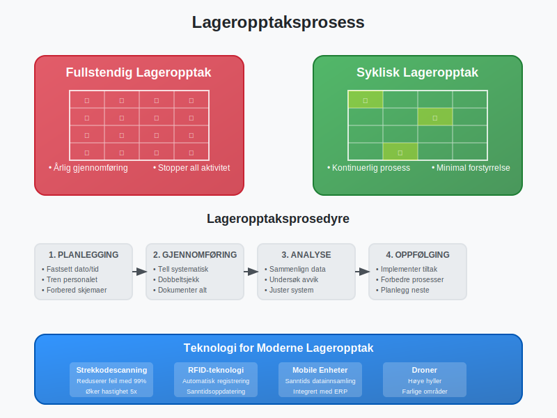
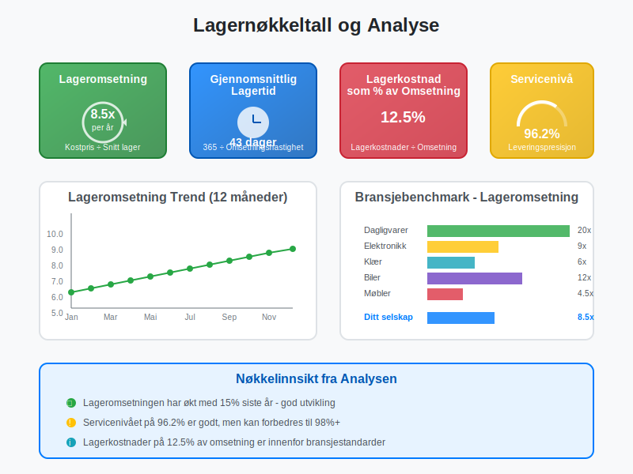

---
title: "Hva er lagerbeholdning?"
meta_title: "Hva er lagerbeholdning?"
meta_description: '**Lagerbeholdning** er verdien av alle varer og materialer som en bedrift har på lager til enhver tid, og som er ment for salg eller produksjon. I regnskapet k...'
slug: hva-er-lagerbeholdning
type: blog
layout: pages/single
---

**Lagerbeholdning** er verdien av alle varer og materialer som en bedrift har på lager til enhver tid, og som er ment for salg eller produksjon. I regnskapet klassifiseres lagerbeholdning som [omløpsmidler](/blogs/regnskap/hva-er-aktiva "Hva er Aktiva? Komplett Guide til Eiendeler i Regnskapet") og representerer ofte en betydelig del av bedriftens [arbeidskapital](/blogs/regnskap/hva-er-arbeidskapital "Hva er Arbeidskapital? Analyse av Kortsiktig Finansiell Styrke"). Lagerbeholdningen påvirkes direkte av [varekjøp](/blogs/regnskap/hva-er-varekjop "Hva er Varekjøp? Komplett Guide til Regnskapsføring og Innkjøpsstyring"), og verdivurderingen baseres på [varekostnad](/blogs/regnskap/hva-er-varekostnad "Hva er Varekostnad? Komplett Guide til Kostnadsstyring og Regnskapsføring") som inkluderer alle kostnader for å anskaffe og klargjøre varene for salg. Korrekt lagerstyring og verdivurdering er kritisk for å opprettholde god [kontantstrøm](/blogs/regnskap/hva-er-kontantstrom "Hva er Kontantstrøm? Komplett Guide til Kontantstrømanalyse") og nøyaktig finansiell rapportering. Moderne bedrifter bruker ofte [strekkoder](/blogs/regnskap/hva-er-strekkode "Hva er Strekkode i Regnskap? Komplett Guide til Automatisert Registrering") for å automatisere lagerstyring og sikre nøyaktig sporing av beholdning.

## Seksjon 1: Typer Lagerbeholdning

Lagerbeholdning kan kategoriseres i flere hovedtyper avhengig av bedriftens virksomhet og hvor varene befinner seg i verdikjeden. For [detaljhandel](/blogs/regnskap/hva-er-detaljhandel "Hva er Detaljhandel? Komplett Guide til Detaljhandelsvirksomhet") og [engroshandel](/blogs/regnskap/hva-er-engroshandel "Hva er Engroshandel? Komplett Guide til Grossistvirksomhet") er lagerstyring ofte den mest kritiske faktoren for lønnsomhet.

### 1.1 RÃ¥varer og Materialer

**Råvarer** er grunnleggende materialer som brukes i produksjonsprosessen for å lage ferdige produkter. Dette inkluderer alt fra metaller og tekstiler til kjemikalier og komponenter. Verdien av råvarelageret påvirkes direkte av markedspriser og må overvåkes nøye for å unngå [avskrivninger](/blogs/regnskap/hva-er-avskrivning "Hva er Avskrivning? Komplett Guide til Avskrivningsmetoder") på grunn av prisfall eller foreldelse.

### 1.2 Varer under Arbeid (VUA)

Varer under arbeid representerer produkter som er påbegynt i produksjonsprosessen, men som ennå ikke er ferdigstilt. Denne kategorien inkluderer både direkte materialkostnader, direkte lønnskostnader og en andel av indirekte produksjonskostnader. Verdivurdering av VUA krever nøyaktig kostnadsberegning og kan være kompleks å beregne.

### 1.3 Ferdigvarer

**Ferdigvarer** er komplette produkter som er klare for salg til kunder. Disse varene har gjennomgått hele produksjonsprosessen og inkluderer alle produksjonskostnader. For handelsvirksomheter utgjør ferdigvarer ofte den største delen av lagerbeholdningen.

### 1.4 Reservedeler og Vedlikeholdsmaterialer

Mange bedrifter må holde et lager av reservedeler og vedlikeholdsmaterialer for å sikre kontinuerlig drift av produksjonsutstyr. Selv om disse ikke er ment for salg, må de verdsettes og regnskapsføres som en del av lagerbeholdningen.

## Seksjon 2: Verdivurderingsmetoder for Lagerbeholdning

Verdivurdering av lagerbeholdning er en av de mest kritiske aspektene ved regnskapsføring, da det direkte påvirker både [balansen](/blogs/regnskap/hva-er-balanse "Hva er Balanse? Komplett Guide til Balanseregnskap") og [resultatregnskapet](/blogs/regnskap/hva-er-driftsregnskap "Hva er Driftsregnskap? Komplett Guide til Driftsresultat og Lønnsomhet"). Valg av verdivurderingsmetode kan ha betydelige konsekvenser for rapportert lønnsomhet og skatteposisjon.

### 2.1 FIFO-metoden (First In, First Out)

**FIFO-metoden** antar at de eldste varene i lageret selges først. Dette betyr at [kostprisen](/blogs/regnskap/hva-er-kostpris "Hva er Kostpris? Komplett Guide til Kostnadsberegning") for solgte varer baseres på de eldste innkjøpsprisene, mens lagerbeholdningen verdsettes til de nyeste prisene.

#### Fordeler med FIFO:
* Reflekterer naturlig vareflyt i de fleste virksomheter
* Gir høyere lagerverdi i perioder med prisstigning
* Enkel å forstå og implementere
* Reduserer risiko for foreldelse av varer

#### Ulemper med FIFO:
* Kan gi høyere skattekostnad i inflasjonsperioder
* Kostpris reflekterer ikke nødvendigvis aktuelle markedspriser

### 2.2 LIFO-metoden (Last In, First Out)

**LIFO-metoden** antar at de nyeste varene selges først. Kostprisen baseres på de nyeste innkjøpsprisene, mens lagerbeholdningen verdsettes til eldre priser. Det er viktig å merke seg at LIFO-metoden ikke er tillatt under norsk regnskapslovgivning, men brukes i enkelte andre land.

### 2.3 Vektet Gjennomsnitt

**Vektet gjennomsnitt** beregner en gjennomsnittlig kostpris for alle varer i lageret, vektet etter antall enheter. Denne metoden jevner ut prissvingninger og gir en stabil kostpris over tid.

#### Beregning av Vektet Gjennomsnitt:

| Dato | Innkjøp | Antall | Enhetspris | Total Verdi |
|------|---------|--------|------------|-------------|
| 01.01 | Ã…pningslager | 100 | 50 kr | 5.000 kr |
| 15.01 | Innkjøp | 200 | 55 kr | 11.000 kr |
| 30.01 | Innkjøp | 150 | 60 kr | 9.000 kr |
| **Total** | | **450** | **55,56 kr** | **25.000 kr** |

Vektet gjennomsnittspris = 25.000 kr ÷ 450 enheter = 55,56 kr per enhet

### 2.4 Spesifikk Identifikasjon

For unike eller høyverdige varer kan **spesifikk identifikasjon** brukes, hvor hver enkelt vare spores individuelt med sin faktiske kostpris. Dette er vanlig for biler, smykker, kunst og andre unike gjenstander.

## Seksjon 3: Lagerstyring og Optimalisering

Effektiv lagerstyring handler om å balansere tilgjengelighet med kostnader. For mye lager binder opp [kapital](/blogs/regnskap/hva-er-kapital "Hva er Kapital? Komplett Guide til Egenkapital og Fremmedkapital") og øker lagerkostnader, mens for lite lager kan føre til tapte salg og misfornøyde kunder. En viktig del av lagerstyringen er også [lagerlokasjonsstyring](/blogs/regnskap/hva-er-lagerlokasjon "Hva er Lagerlokasjon? Komplett Guide til Lagerplassering og Lagerstyring"), som sikrer effektiv plassering og sporing av varer i lageret.

### 3.1 ABC-analyse

**ABC-analyse** kategoriserer lagervarer basert på deres verdi og viktighet:

* **A-varer (20% av varene, 80% av verdien):** Høy verdi, krever tett oppfølging
* **B-varer (30% av varene, 15% av verdien):** Moderat verdi, standard oppfølging  
* **C-varer (50% av varene, 5% av verdien):** Lav verdi, minimal oppfølging

### 3.2 Økonomisk Bestillingsmengde (EOQ)

**Economic Order Quantity (EOQ)** er en matematisk modell som beregner optimal bestillingsmengde for å minimere totale lagerkostnader:

**EOQ = √(2 × Årlig etterspørsel × Bestillingskostnad ÷ Lagerkostnad per enhet)**

### 3.3 Sikkerhetslager

**Sikkerhetslager** er ekstra beholdning som holdes for å håndtere uforutsette svingninger i etterspørsel eller leveringstid. Størrelsen på sikkerhetslageret avhenger av:

* Variabilitet i etterspørsel
* Leveringstid fra leverandører
* Ønsket servicenivå
* Kostnad ved manglende varer

### 3.4 Just-in-Time (JIT)

**Just-in-Time** er en lagerstrategi som tar sikte på å minimere lagerbeholdning ved å motta varer akkurat når de trengs i produksjonen eller salget. Dette krever:

* Pålitelige leverandører
* Effektive kommunikasjonssystemer
* Stabile produksjonsprosesser
* Kort leveringstid

## Seksjon 4: Regnskapsføring av Lagerbeholdning

Korrekt regnskapsføring av lagerbeholdning er essensielt for nøyaktig finansiell rapportering og overholdelse av [bokføringsloven](/blogs/regnskap/hva-er-bokforingsloven "Hva er Bokføringsloven? Komplett Guide til Norsk Bokføringslovgivning"). Lagerbeholdning påvirker både balansen og resultatregnskapet gjennom [kostnadene for solgte varer](/blogs/regnskap/hva-er-kostnader "Hva er Kostnader? Komplett Guide til Kostnadstyper og Regnskapsføring").

### 4.1 Innkjøp av Lagervarer

Når varer kjøpes inn til lager, bokføres transaksjonen som en økning i lagerbeholdning og en reduksjon i [kontantbeholdning](/blogs/regnskap/hva-er-kontantbeholdning "Hva er Kontantbeholdning? Komplett Guide til Likviditetsstyring") eller økning i [leverandørgjeld](/blogs/regnskap/hva-er-gjeld "Hva er Gjeld? Komplett Guide til Kortsiktig og Langsiktig Gjeld"):

**Debet:** Lagerbeholdning  
**Kredit:** Bank/Leverandørgjeld

### 4.2 Salg av Lagervarer

Ved salg av lagervarer må to bokføringer gjøres:

1. **Registrering av salget:**
   - **Debet:** [Kundefordringer](/blogs/regnskap/hva-er-kundefordring "Hva er Kundefordring? Komplett Guide til Debitorhåndtering")/Bank
   - **Kredit:** Salgsinntekter

2. **Registrering av kostpris:**
   - **Debet:** Kostpris solgte varer
   - **Kredit:** Lagerbeholdning

### 4.3 Lagerjustering og Svinn

Regelmessige lageropptak avdekker ofte differanser mellom bokført og faktisk lagerbeholdning. Disse differansene kan skyldes:

* **Svinn:** Naturlig tap, tyveri, skade
* **Feilregistreringer:** Bokføringsfeil, systemfeil
* **Foreldelse:** Varer som ikke lenger kan selges

Justeringer bokføres som:
- **Debet:** Lagerjustering/Svinn (kostnad)
- **Kredit:** Lagerbeholdning

For en detaljert gjennomgang av hvordan slike avvik håndteres systematisk, inkludert årsaker, prosesser og beste praksis, se vår omfattende guide til [lagerkorreksjon](/blogs/regnskap/hva-er-lagerkorreksjon "Hva er Lagerkorreksjon? Komplett Guide til Lagerjustering i Regnskap").

## Seksjon 5: Lageropptak og Kontroll

Regelmessig lageropptak er lovpålagt og kritisk for å sikre nøyaktighet i regnskapet. [Bokføringsforskriften](/blogs/regnskap/hva-er-bokforingsforskriften "Hva er Bokføringsforskriften? Detaljerte Regler for Norsk Bokføring") krever at bedrifter gjennomfører lageropptak minst én gang årlig.

### 5.1 Typer Lageropptak

#### Fullstendig Lageropptak
* Gjennomføres vanligvis ved årsslutt
* All virksomhet stoppes under opptak
* Alle varer telles fysisk
* Mest nøyaktig, men ressurskrevende

#### Syklisk Lageropptak
* Kontinuerlig telling av deler av lageret
* Ikke behov for å stoppe virksomheten
* A-varer telles oftere enn C-varer
* Mindre forstyrrende for driften

### 5.2 Lageropptaksprosedyrer

En systematisk tilnærming til lageropptak inkluderer:

1. **Planlegging:**
   - Fastsett dato og tid
   - Tren personalet
   - Forbered telleskjemaer
   - Stopp alle lagerbevegelser

2. **Gjennomføring:**
   - Tell alle varer systematisk
   - Dobbeltsjekk kritiske områder
   - Dokumenter alle observasjoner
   - Identifiser skadede eller foreldede varer

3. **Oppfølging:**
   - Sammenlign med bokført beholdning
   - Undersøk betydelige avvik
   - Juster lagerbeholdning i systemet
   - Analyser årsaker til differanser
   - Dokumenter resultatene i [lagerrapporter](/blogs/regnskap/hva-er-lagerrapport "Hva er en Lagerrapport? Komplett Guide til Lagerstyring og Lagerregnskapet")

### 5.3 Teknologi i Lageropptak

Moderne teknologi kan betydelig forbedre nøyaktigheten og effektiviteten av lageropptak:

* **Strekkodescanning:** Reduserer manuelle feil
* **RFID-teknologi:** Automatisk identifikasjon av varer
* **Mobile enheter:** Sanntidsoppdatering av data
* **Lagerstyringssystemer:** Integrert med [ERP-systemer](/blogs/regnskap/hva-er-erp-system "Hva er ERP-system? Komplett Guide til Enterprise Resource Planning")

## Seksjon 6: Lagerkostnader og Økonomisk Påvirkning

Lagerbeholdning medfører flere typer kostnader som må tas i betraktning ved lagerstyring og økonomisk planlegging. Disse kostnadene påvirker direkte bedriftens [lønnsomhet](/blogs/regnskap/hva-er-avkastning "Hva er Avkastning? Komplett Guide til Avkastningsberegning") og [kontantstrøm](/blogs/regnskap/hva-er-kontantstromoppstilling "Hva er Kontantstrømoppstilling? Komplett Guide til Likviditetsanalyse").

### 6.1 Direkte Lagerkostnader

| Kostnadstype | Beskrivelse | Typisk Andel av Lagerverdi |
|--------------|-------------|---------------------------|
| **Kapitalkostnad** | Renter på bundet kapital | 8-15% årlig |
| **Lagerlokaler** | Husleie, vedlikehold, forsikring | 2-5% årlig |
| **Håndtering** | Lønn til lagerpersonell | 3-8% årlig |
| **Forsikring** | Forsikring mot tyveri, skade | 0,5-2% årlig |
| **Svinn og foreldelse** | Tap av varer | 1-5% årlig |

### 6.2 Indirekte Lagerkostnader

* **Administrasjon:** Systemer, planlegging, kontroll
* **Kvalitetskontroll:** Inspeksjon og testing
* **Sikkerhet:** Overvåking og tilgangskontroll
* **Skatter:** Eiendomsskatt på lagerbeholdning

### 6.3 Kostnad ved Manglende Lager

* **Tapte salg:** Direkte inntektstap
* **Kundetilfredshet:** Langsiktig påvirkning på kundelojalitet
* **Produksjonsstans:** Kostnader ved stillstand
* **Ekspressleveranser:** Høyere innkjøpskostnader

## Seksjon 7: Lagerbeholdning og Skattemessige Forhold

Verdivurdering av lagerbeholdning har direkte skattemessige konsekvenser, da lagerverdi påvirker beregning av [skattepliktig inntekt](/blogs/regnskap/hva-er-inntekter "Hva er Inntekter? Komplett Guide til Inntektsføring og Regnskapsføring"). Norske skattemyndigheter har spesifikke regler for hvordan lagerbeholdning skal verdsettes.

### 7.1 Skattemessig Verdivurdering

I Norge må lagerbeholdning verdsettes til **laveste verdi** av:
* **Anskaffelseskost** (inkludert direkte kostnader)
* **Virkelig verdi** (markedsverdi/salgspris minus salgskostnader)

### 7.2 Nedskrivning av Lagerbeholdning

Når lagervarer har falt i verdi, må de skrives ned til virkelig verdi. Dette gjelder særlig for:

* **Foreldede varer:** Teknologisk utdaterte produkter
* **Sesongvarer:** Varer ute av sesong
* **Skadede varer:** Fysisk ødelagte produkter
* **Overskuddslager:** Varer med lav omsetningshastighet

Nedskrivning bokføres som:
- **Debet:** Nedskrivning lagerbeholdning (kostnad)
- **Kredit:** Lagerbeholdning

### 7.3 Skattemessige Fradrag

Bedrifter kan kreve skattemessige fradrag for:
* Dokumentert svinn og tyveri
* Nedskrivning til virkelig verdi
* Kostnader ved lageropptak
* Lagerkostnader (innenfor rimelighetens grenser)

## Seksjon 8: Nøkkeltall og Analyse av Lagerbeholdning

Analyse av lagerbeholdning gjennom relevante nøkkeltall er essensielt for å vurdere effektiviteten av lagerstyringen og identifisere forbedringsområder. Disse nøkkeltallene brukes også av [investorer](/blogs/regnskap/hva-er-investere "Hva er Investere? Komplett Guide til Investeringsformer") og kreditorer for å vurdere bedriftens operasjonelle effektivitet. For en systematisk tilnærming til dokumentasjon og analyse av lagerbeholdning, se vår omfattende guide til [lagerrapporter](/blogs/regnskap/hva-er-lagerrapport "Hva er en Lagerrapport? Komplett Guide til Lagerstyring og Lagerregnskapet").

### 8.1 Lageromsetningshastighet

**Lageromsetningshastighet** måler hvor ofte lageret omsettes i løpet av en periode:

**Lageromsetningshastighet = Kostpris solgte varer ÷ Gjennomsnittlig lagerbeholdning**

* **Høy omsetningshastighet:** Effektiv lagerstyring, mindre bundet kapital
* **Lav omsetningshastighet:** Overskuddslager, risiko for foreldelse

### 8.2 Gjennomsnittlig Lagertid

**Gjennomsnittlig lagertid** viser hvor lenge varer ligger på lager:

**Gjennomsnittlig lagertid = 365 dager ÷ Lageromsetningshastighet**

### 8.3 Lagerandel av Omsetning

**Lagerandel = Lagerbeholdning ÷ Årlig omsetning × 100%**

Dette nøkkeltallet viser hvor stor andel av omsetningen som er bundet opp i lager.

### 8.4 Lagerkostnad som Andel av Omsetning

**Lagerkostnad% = Totale lagerkostnader ÷ Omsetning × 100%**

### 8.5 Benchmarking mot Bransjen

Sammenligning med bransjegjennomsnittet gir verdifull innsikt:

| Bransje | Typisk Lageromsetning | Lagerandel av Omsetning |
|---------|----------------------|------------------------|
| **Dagligvarer** | 15-25 ganger | 8-15% |
| **Klær og tekstil** | 4-8 ganger | 25-40% |
| **Elektronikk** | 6-12 ganger | 15-25% |
| **Biler** | 8-15 ganger | 20-30% |
| **Møbler** | 3-6 ganger | 30-50% |

## Seksjon 9: Digitalisering og Fremtidens Lagerstyring

Moderne lagerstyring blir stadig mer digitalisert og automatisert. Integrasjon med [ERP-systemer](/blogs/regnskap/hva-er-erp-system "Hva er ERP-system? Komplett Guide til Enterprise Resource Planning") og avanserte analyseværktøy gir bedrifter mulighet til å optimalisere lagerstyringen på måter som ikke var mulig tidligere.

### 9.1 Kunstig Intelligens og Maskinlæring

**AI-drevne prognosesystemer** kan:
* Forutsi etterspørsel med høy nøyaktighet
* Optimalisere bestillingsmengder automatisk
* Identifisere mønstre i salgsdata
* Redusere risiko for overskuddslager

### 9.2 Internet of Things (IoT)

**IoT-sensorer** i lageret kan:
* Overvåke temperatur og fuktighet
* Spore varebevegelser i sanntid
* Automatisk oppdatere lagernivåer
* Varsle om kritiske lagernivåer

### 9.3 Blockchain for Sporbarhet

**Blockchain-teknologi** muliggjør:
* Fullstendig sporbarhet av varer
* Verifisering av autentisitet
* Redusert risiko for forfalskning
* Forbedret kvalitetskontroll

### 9.4 Automatiserte Lagersystemer

* **Robotiserte plukksystemer:** Reduserer manuelle feil
* **Automatiske lagersystemer:** Maksimerer lagerplass
* **Droner for lageropptak:** Raskere og mer nøyaktig telling
* **Selvkjørende trucks:** Effektiv varehåndtering

## Seksjon 10: Utfordringer og Risikostyring

Lagerstyring innebærer flere risikoer som må identifiseres og håndteres proaktivt. Effektiv risikostyring kan beskytte bedriften mot betydelige økonomiske tap og operasjonelle forstyrrelser.

### 10.1 Markedsrisiko

* **Prisvolatilitet:** Svingninger i råvarepriser
* **Valutarisiko:** For importerte varer
* **Etterspørselsendringer:** Endringer i kundepreferanser
* **Sesongvariasjoner:** Forutsigbare svingninger

### 10.2 Operasjonell Risiko

* **Leverandørrisiko:** Forsinkelser eller kvalitetsproblemer
* **Systemfeil:** IT-problemer som påvirker lagerstyring
* **Menneskelige feil:** Feil i registrering eller håndtering
* **Naturkatastrofer:** Skade på lager eller varer

### 10.3 Finansiell Risiko

* **Likviditetsrisiko:** For mye kapital bundet i lager
* **Kreditrisiko:** Tap ved kunders betalingssvikt
* **Forsikringsrisiko:** Utilstrekkelig dekning
* **Skattemessig risiko:** Feil verdivurdering

### 10.4 Risikohåndteringsstrategier

1. **Diversifisering:** Spre risiko på flere leverandører og markeder
2. **Forsikring:** Omfattende dekning mot tap og skade
3. **Sikkerhetslager:** Buffer mot uforutsette hendelser
4. **Fleksible kontrakter:** Mulighet for justering ved endringer
5. **Kontinuerlig overvåking:** Tidlig varsling om problemer

## Konklusjon

Lagerbeholdning er en kritisk komponent i de fleste bedrifters økonomi og krever systematisk styring for å optimalisere både lønnsomhet og kontantstrøm. Fra grunnleggende verdivurderingsmetoder som FIFO og vektet gjennomsnitt til avanserte AI-drevne prognosesystemer, må bedrifter velge de verktøyene og metodene som best passer deres virksomhet.

Effektiv lagerstyring handler om å finne den rette balansen mellom tilgjengelighet og kostnader, samtidig som man overholder alle regnskapsmessige og skattemessige krav. Med riktig tilnærming kan lagerbeholdning transformeres fra en kostnadsbyrde til et strategisk konkurransefortrinn.

For bedrifter som ønsker å forbedre sin lagerstyring, anbefales det å starte med en grundig analyse av nåværende praksis, implementere relevante nøkkeltall for måling, og gradvis innføre mer avanserte teknologier og metoder etter hvert som organisasjonen modnes.

Husk at lagerstyring ikke er en isolert aktivitet, men må integreres med andre forretningsprosesser som [innkjøp](/blogs/regnskap/hva-er-anskaffelser "Hva er Anskaffelser? En Komplett Guide til Offentlige og Private Innkjøp"), salg, produksjon og [finansiell planlegging](/blogs/regnskap/hva-er-budsjettering "Hva er Budsjettering? Komplett Guide til Budsjettplanlegging") for å oppnå optimal effekt.

