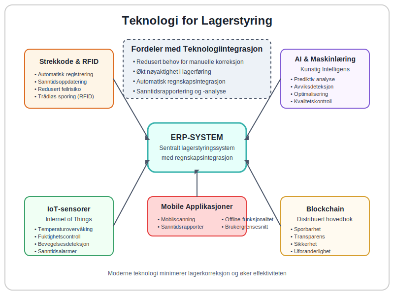

**Lagerkorreksjon** er en regnskapsmessig justering som gjøres for å korrigere avvik mellom det registrerte lageret i regnskapssystemet og det faktiske fysiske lageret. Dette er en kritisk prosess for å sikre nøyaktig [lagerverdi](/blogs/regnskap/hva-er-aktiva "Hva er Aktiva? Komplett Guide til Eiendeler i Regnskapet") i [balansen](/blogs/regnskap/hva-er-balanse "Hva er Balanse? Komplett Guide til Balanseregnskap og Finansiell Stilling") og korrekt beregning av [varekostnad](/blogs/regnskap/hva-er-kostpris "Hva er Kostpris? Komplett Guide til Kostnadsberegning og Prissetting"). Lagerkorreksjon påvirker direkte bedriftens [driftsresultat](/blogs/regnskap/hva-er-driftsresultat "Hva er Driftsresultat? Analyse av Lønnsomhet og Operasjonell Ytelse") og er en sentral del av god [internkontroll](/blogs/regnskap/hva-er-internkontroll "Hva er Internkontroll? Komplett Guide til Risikostyring og Kontrollsystemer").

## Seksjon 1: Årsaker til Lagerkorreksjon

Lagerkorreksjon blir nødvendig når det oppstår **avvik** mellom bokført lager og fysisk lager. Dette kan skyldes flere faktorer som må identifiseres og håndteres systematisk for å opprettholde nøyaktig lagerføring.


### 1.1 Vanlige Årsaker til Lageravvik

* **Svinn og tyveri:** Naturlig svinn, skade eller tyveri av varer
* **Registreringsfeil:** Feil ved inn- eller utregistrering av varer
* **Leveringsfeil:** Avvik mellom bestilt, levert og registrert antall
* **Returvarer:** Manglende registrering av returnerte varer
* **Produksjonsfeil:** Feil i produksjonsrapportering eller materialforbruk
* **Systemfeil:** Tekniske feil i lagerstyringssystemet
* **Tellefeil:** Menneskelige feil ved lageropptelling
* **Feilplassering:** Varer plassert på feil [lagerlokasjon](/blogs/regnskap/hva-er-lagerlokasjon "Hva er Lagerlokasjon? Komplett Guide til Lagerplassering og Lagerstyring") som gjør dem vanskelige å finne

### 1.2 Konsekvenser av Ukorrekt Lagerføring

Når lagerføringen ikke stemmer med virkeligheten, kan dette få alvorlige konsekvenser:

| Område | Konsekvens | Påvirkning |
|--------|------------|------------|
| **Regnskap** | Feil [varekostnad](/blogs/regnskap/hva-er-kostpris "Hva er Kostpris?") | Påvirker [bruttofortjeneste](/blogs/regnskap/hva-er-bruttofortjeneste "Hva er Bruttofortjeneste?") |
| **Balanse** | Feil lagerverdi | Påvirker [egenkapital](/blogs/regnskap/hva-er-egenkapital "Hva er Egenkapital?") |
| **Drift** | Feil bestillinger | Overflødig eller mangelfull lagerbeholdning |
| **Økonomi** | Feil lønnsomhetsanalyse | Dårlige beslutningsgrunnlag |
| **Revisjon** | Revisjonsmerknader | Kan påvirke [attestering](/blogs/regnskap/hva-er-attestering "Hva er Attestering?") |

## Seksjon 2: Typer Lagerkorreksjon

Det finnes flere typer lagerkorreksjon avhengig av årsak og omfang. Hver type krever spesifikk behandling og dokumentasjon for å opprettholde god [internkontroll](/blogs/regnskap/hva-er-internkontroll "Hva er Internkontroll?").


### 2.1 Periodisk Lagerkorreksjon

Dette er den mest omfattende typen lagerkorreksjon som utføres ved **lageropptelling**, vanligvis ved årsskiftet eller ved andre regnskapsperioder:

* **Fullstendig opptelling:** Alle varer telles fysisk
* **Stikkprøveopptelling:** Utvalgte varegrupper telles
* **Rullende opptelling:** Kontinuerlig telling av ulike varegrupper

### 2.2 Løpende Lagerkorreksjon

Mindre justeringer som gjøres fortløpende når avvik oppdages:

* **Svinnjustering:** Registrering av naturlig svinn
* **Skadejustering:** Nedskrivning av skadede varer
* **Kvalitetsjustering:** Justering for kvalitetsavvik

### 2.3 Systemkorreksjon

Tekniske justeringer i lagerstyringssystemet:

* **Datakonvertering:** Ved systemskifte eller oppgradering
* **Feilretting:** Korrigering av systemfeil eller programfeil
* **Integrasjonsjustering:** Justering mellom ulike systemer

## Seksjon 3: Prosess for Lagerkorreksjon

En systematisk tilnærming til lagerkorreksjon sikrer nøyaktighet og overholdelse av regnskapsprinsipper. Prosessen må være godt dokumentert og følge etablerte rutiner for [internkontroll](/blogs/regnskap/hva-er-internkontroll "Hva er Internkontroll?").


### 3.1 Forberedelse og Planlegging

Før lagerkorreksjon gjennomføres, må følgende forberedelser gjøres:

1. **Stopp lagerbevegelser:** Midlertidig stopp av inn- og utleveringer
2. **Forbered tellelister:** Systematiske lister over alle varegrupper
3. **Tildel ansvar:** Utpek ansvarlige personer for ulike områder
4. **Sikre dokumentasjon:** Forbered skjemaer og registreringssystemer

### 3.2 Gjennomføring av Opptelling

Selve opptellingsprosessen må følge etablerte rutiner:

* **Fysisk telling:** Systematisk telling av alle varer
* **Dobbel kontroll:** To personer teller uavhengig
* **Dokumentasjon:** All telling dokumenteres umiddelbart
* **Kvalitetskontroll:** Stikkprøver for å verifisere nøyaktighet

### 3.3 Analyse og Justering

Etter opptelling analyseres avvik og nødvendige justeringer gjøres:

1. **Identifiser avvik:** Sammenlign fysisk og bokført lager
2. **Analyser årsaker:** Undersøk hvorfor avvik har oppstått
3. **Beregn justeringer:** Kalkuler nødvendige regnskapsjusteringer
4. **Godkjenn endringer:** Få nødvendig godkjenning før justering
5. **Dokumenter i [lagerrapporter](/blogs/regnskap/hva-er-lagerrapport "Hva er en Lagerrapport? Komplett Guide til Lagerstyring og Lagerregnskapet"):** Systematisk dokumentasjon av alle korreksjon

## Seksjon 4: Regnskapsmessig Behandling

Lagerkorreksjon må behandles korrekt i regnskapet for å sikre at [årsregnskapet](/blogs/regnskap/hva-er-regnskap "Hva er Regnskap? Komplett Guide til Norsk Regnskapsføring") gir et rettvisende bilde av bedriftens finansielle stilling.

### 4.1 Bokføringseksempler

Her er vanlige bokføringer ved lagerkorreksjon:

**Ved lagerreduksjon (svinn/tyveri):**
```
Debet: Varekostnad/Svinn          10.000
Kredit: Varelager                 10.000
```

**Ved lagerøkning (feil registrering):**
```
Debet: Varelager                  5.000
Kredit: Varekostnad               5.000
```

### 4.2 Påvirkning på Resultatregnskap

Lagerkorreksjon påvirker flere poster i [resultatregnskapet](/blogs/regnskap/hva-er-driftsregnskap "Hva er Driftsregnskap? Komplett Guide til Resultatanalyse"):

| Korreksjon | Påvirkning | Resultat |
|------------|------------|----------|
| **Lagerreduksjon** | Økt varekostnad | Redusert [bruttofortjeneste](/blogs/regnskap/hva-er-bruttofortjeneste "Hva er Bruttofortjeneste?") |
| **Lagerøkning** | Redusert varekostnad | Økt bruttofortjeneste |
| **Nedskrivning** | Ekstraordinær kostnad | Redusert [driftsresultat](/blogs/regnskap/hva-er-driftsresultat "Hva er Driftsresultat?") |

### 4.3 Påvirkning på Balansen

I [balansen](/blogs/regnskap/hva-er-balanse "Hva er Balanse?") påvirkes følgende poster:

* **[Varelager](/blogs/regnskap/hva-er-aktiva "Hva er Aktiva?"):** Justeres til faktisk verdi
* **[Egenkapital](/blogs/regnskap/hva-er-egenkapital "Hva er Egenkapital?"):** Påvirkes av resultateffekten
* **Opptjent egenkapital:** Endres med årets resultat

## Seksjon 5: Verdivurdering ved Lagerkorreksjon

Korrekt **verdivurdering** av lageret er kritisk for nøyaktig lagerkorreksjon. Dette påvirker både [anskaffelseskost](/blogs/regnskap/hva-er-anskaffelseskost "Hva er Anskaffelseskost? Komplett Guide til Kostnadsberegning") og [avskrivning](/blogs/regnskap/hva-er-avskrivning "Hva er Avskrivning? Komplett Guide til Verdifall og Regnskapsføring").


### 5.1 Verdivurderingsprinsipper

Norsk regnskapslovgivning krever at varelager vurderes til **laveste av anskaffelseskost og virkelig verdi**:

* **Anskaffelseskost:** Opprinnelig innkjøpspris pluss direkte kostnader
* **Virkelig verdi:** Markedsverdi eller netto realisasjonsverdi
* **FIFO-prinsippet:** Først inn, først ut ved kostnadsberegning
* **Gjennomsnittskost:** Vektet gjennomsnitt av innkjøpspriser

### 5.2 Nedskrivning av Lager

Når lagerverdien har falt, må det foretas **nedskrivning**:

1. **Identifiser verdifall:** Sammenlign bokført og markedsverdi
2. **Beregn nedskrivning:** Differansen mellom verdiene
3. **Bokfør justering:** Reduser lagerverdi og øk kostnad
4. **Dokumenter årsak:** Begrunn nedskrivningen

### 5.3 Spesielle Vurderinger

Enkelte varetyper krever spesiell oppmerksomhet:

* **Sesongvarer:** Vurder salgsbarhet etter sesong
* **Moteartikler:** Rask verdifall ved trendskifte
* **Tekniske produkter:** Foreldelse ved nye modeller
* **Matvarer:** Holdbarhet og utløpsdato

## Seksjon 6: Internkontroll og Rutiner

Effektiv **internkontroll** er essensielt for å minimere behovet for lagerkorreksjon og sikre nøyaktig lagerføring. Dette er en viktig del av bedriftens overordnede [internkontrollsystem](/blogs/regnskap/hva-er-internkontroll "Hva er Internkontroll?").

### 6.1 Forebyggende Tiltak

For å redusere behovet for lagerkorreksjon bør følgende rutiner etableres:

* **Daglig lagerføring:** Kontinuerlig oppdatering av lagersaldo
* **Autorisasjonskontroll:** Kun autoriserte personer håndterer lager
* **Fysisk sikring:** Låsing og overvåking av lagerområder
* **Systemkontroller:** Automatiske kontroller i lagersystemet
* **Regelmessig avstemming:** Månedlig avstemming av lagersaldo

### 6.2 Detektive Kontroller

Kontroller for å oppdage avvik tidlig:

* **Stikkprøvetelling:** Regelmessig telling av utvalgte varer
* **Avviksrapportering:** Systematisk rapportering av uregelmessigheter
* **Trendanalyse:** Analyse av lagerbevegelser og svinnprosent
* **Nøkkeltallsoppfølging:** Overvåking av lageromløpshastighet
* **[Lagerrapportering](/blogs/regnskap/hva-er-lagerrapport "Hva er en Lagerrapport? Komplett Guide til Lagerstyring og Lagerregnskapet"):** Systematisk dokumentasjon og analyse av lagerstatus

### 6.3 Korrigerende Tiltak

Når avvik oppdages, må korrigerende tiltak iverksettes:

1. **Umiddelbar undersøkelse:** Finn årsak til avviket
2. **Korrigerende handling:** Rett opp i rutiner eller systemer
3. **Oppfølging:** Sikre at tiltak har ønsket effekt
4. **Læring:** Bruk erfaringer til å forbedre rutiner

## Seksjon 7: Teknologi og Automatisering

Moderne **teknologi** kan betydelig redusere behovet for manuelle lagerkorreksjon og øke nøyaktigheten i lagerføringen. Integration med [ERP-systemer](/blogs/regnskap/hva-er-erp-system "Hva er ERP-system? Komplett Guide til Bedriftssystemer") er særlig viktig.



### 7.1 Automatiserte Lagersystemer

Moderne lagerstyringssystemer tilbyr flere automatiseringsmuligheter:

* **Strekkodescanning:** Automatisk registrering ved inn- og utleveringer
* **RFID-teknologi:** Trådløs identifikasjon og sporing av varer
* **Sanntidsoppdatering:** Øyeblikkelig oppdatering av lagersaldo
* **Automatiske bestillinger:** Automatisk påfyll ved lavt lagernivå

### 7.2 Integration med Regnskapssystem

Seamless integration mellom lager- og regnskapssystem sikrer:

* **Automatisk bokføring:** Lagerbevegelser bokføres automatisk
* **Konsistente data:** Samme informasjon i alle systemer
* **Redusert feilrisiko:** Mindre manuell databehandling
* **Sanntidsrapportering:** Oppdaterte rapporter til enhver tid

### 7.3 Kunstig Intelligens og Maskinlæring

Avanserte systemer bruker AI for å:

* **Prediktiv analyse:** Forutsi lagerbehov og svinn
* **Avviksdeteksjon:** Automatisk identifisering av uvanlige mønstre
* **Optimalisering:** Forbedre lagerplassering og -nivåer
* **Kvalitetskontroll:** Automatisk kvalitetsvurdering

## Seksjon 8: Juridiske og Regulatoriske Krav

Lagerkorreksjon må utføres i samsvar med **norsk regnskapslovgivning** og etablerte regnskapsprinsipper. Dette sikrer at [årsregnskapet](/blogs/regnskap/hva-er-regnskap "Hva er Regnskap?") oppfyller lovkrav og gir et rettvisende bilde.

### 8.1 Regnskapslovens Krav

[Regnskapsloven](/blogs/regnskap/hva-er-bokforingsloven "Hva er Bokføringsloven? Komplett Guide til Norsk Regnskapslovgivning") stiller følgende krav til lagerføring:

* **Korrekt verdsettelse:** Lager skal verdsettes til laveste av kost og markedsverdi
* **Konsistent metode:** Samme verdivurderingsmetode skal brukes konsekvent
* **Tilstrekkelig dokumentasjon:** All lagerkorreksjon må være godt dokumentert
* **Periodisering:** Lagerkorreksjon skal periodiseres korrekt

### 8.2 Revisjonsforhold

Revisor vil vurdere lagerkorreksjon som del av [revisjonen](/blogs/regnskap/hva-er-arbeidspapirer-revisjon "Hva er Arbeidspapirer (Revisjon)? Komplett Guide til Revisjonsdokumentasjon"):

* **Vesentlighetsgrense:** Store lagerkorreksjon kan påvirke revisjonsuttalelsen
* **Kontrollaktiviteter:** Revisor vil teste internkontroll for lager
* **Substansielle tester:** Fysisk opptelling og verdivurdering testes
* **Dokumentasjonskrav:** Tilstrekkelig dokumentasjon må foreligge

### 8.3 Skattemessige Konsekvenser

Lagerkorreksjon kan ha skattemessige implikasjoner:

* **Fradragsrett:** Svinn og nedskrivning kan være fradragsberettiget
* **Tidspunkt:** Når fradrag kan kreves avhenger av årsak
* **Dokumentasjon:** Skattemyndighetene krever solid dokumentasjon
* **Konsistens:** Regnskapsmessig og skattemessig behandling bør være konsistent

## Seksjon 9: Beste Praksis og Anbefalinger

For å sikre **effektiv lagerkorreksjon** og minimere fremtidige avvik, bør bedrifter følge etablerte beste praksis-prinsipper.

### 9.1 Organisatoriske Tiltak

* **Klare ansvarsforhold:** Definer hvem som har ansvar for hva
* **Kompetanseutvikling:** Sørg for at ansatte har nødvendig kunnskap
* **Regelmessig opplæring:** Hold ansatte oppdatert på rutiner og systemer
* **Kvalitetssikring:** Implementer kontroller på alle nivåer

### 9.2 Systemiske Forbedringer

* **Standardiserte prosesser:** Utvikle klare, dokumenterte rutiner
* **Automatisering:** Automatiser så mye som mulig av lagerføringen
* **Integration:** Sikre sømløs dataflyt mellom systemer
* **Backup og sikkerhet:** Beskytt data mot tap og manipulasjon

### 9.3 Kontinuerlig Forbedring

* **Regelmessig evaluering:** Vurder effektiviteten av rutiner og systemer
* **Benchmarking:** Sammenlign med bransjestandarder
* **Innovasjon:** Vurder nye teknologier og metoder
* **Læring:** Bruk erfaringer til kontinuerlig forbedring

## Seksjon 10: Konklusjon og Fremtidsperspektiver

**Lagerkorreksjon** er en kritisk prosess som krever systematisk tilnærming, god internkontroll og korrekt regnskapsmessig behandling. Med økende digitalisering og automatisering blir det stadig viktigere å ha robuste systemer og rutiner på plass.

### 10.1 Nøkkelfaktorer for Suksess

* **Proaktiv tilnærming:** Forebygg avvik i stedet for å reparere
* **Teknologiutnyttelse:** Bruk moderne verktøy for økt nøyaktighet
* **Kompetanse:** Sikre at organisasjonen har nødvendig kunnskap
* **Kontinuitet:** Oppretthold fokus på lagerkvalitet over tid

### 10.2 Fremtidige Trender

Lagerstyring vil fortsette å utvikle seg med:

* **IoT-sensorer:** Sanntidsovervåking av lagerforhold
* **Blockchain:** Sporbarhet og transparens i forsyningskjeden
* **Robotisering:** Automatiserte lageroperasjoner
* **Prediktiv analyse:** Bedre prognoser og planlegging

Effektiv lagerkorreksjon er ikke bare en regnskapsmessig nødvendighet, men en strategisk fordel som kan bidra til bedre [lønnsomhet](/blogs/regnskap/hva-er-dekningsbidrag "Hva er Dekningsbidrag? Komplett Guide til Lønnsomhetsanalyse"), reduserte kostnader og økt konkurranseevne.


