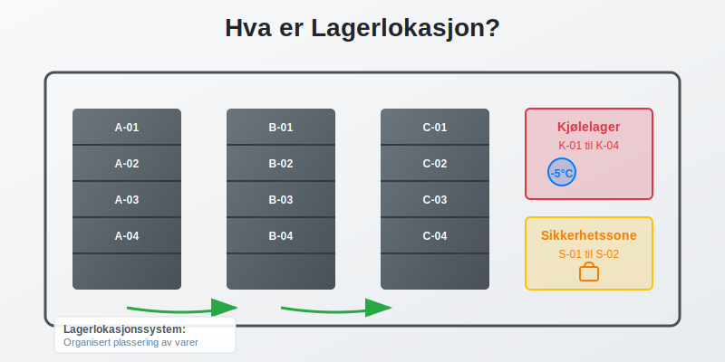

**Lagerlokasjon** er den spesifikke plasseringen av varer og produkter i et lager eller varelager. Dette omfatter både den fysiske posisjonen og den digitale registreringen av hvor hver vare befinner seg. Effektiv lagerlokasjonsstyring er avgjørende for optimal lagerdrift, nøyaktig [regnskapsføring](/blogs/regnskap/hva-er-regnskap "Hva er Regnskap? Komplett Guide til Regnskapsføring") og kostnadseffektiv drift.

## Definisjon av Lagerlokasjon

En **lagerlokasjon** er et unikt identifisert område eller plass i et lager hvor spesifikke varer oppbevares. Dette kan være:

* **Hyller** med spesifikke hyllenumre og posisjoner
* **Palleplasser** med koordinater eller koder
* **Containere** eller bokser med unike identifikatorer
* **Køleanlegg** eller spesialområder for temperaturkritiske varer
* **Sikkerhetssoner** for verdifulle eller farlige produkter

Hver lagerlokasjon har typisk en **unik kode** eller **adresse** som gjør det mulig å identifisere og spore varer gjennom hele lagerprosessen.

## Typer Lagerlokasjonssystemer

### Faste Lagerlokasjoner

I et **fast lagerlokasjonssystem** har hver vare sin faste plass i lageret:

* **Forutsigbarhet** - samme vare finnes alltid på samme sted
* **Enkel opplæring** av personale
* **Redusert risiko** for feilplassering
* **Mindre fleksibilitet** ved endringer i sortiment

### Dynamiske Lagerlokasjoner

**Dynamisk lagerlokasjon** innebærer at varer kan plasseres på ledige plasser:

* **Høyere lagertetthet** og bedre plassaustnyttelse
* **Fleksibilitet** ved sesongvariasjoner
* **Krever avanserte** [ERP-systemer](/blogs/regnskap/hva-er-erp-system "Hva er ERP-system? Komplett Guide til Enterprise Resource Planning") for sporing
* **Kompleks administrasjon** og høyere teknologikrav

### Hybride Systemer

Kombinerer elementer fra både faste og dynamiske systemer:

* **A-varer** (høy omsetning) får faste lokasjoner
* **B- og C-varer** bruker dynamisk plassering
* **Balanserer effektivitet** med fleksibilitet

## Lagerlokasjonskoding

### Alfanumeriske Koder

Den vanligste metoden for å identifisere lagerlokasjoner:

* **Gang-Hylle-Nivå-Posisjon** (f.eks. A-12-03-05)
* **Sone-Rad-Kolonne** (f.eks. Z1-R15-C08)
* **Bygning-Etasje-Område-Plass** (f.eks. B2-E1-N-145)

### QR-koder og Strekkoder

Moderne lagre bruker ofte **digitale identifikatorer**:

* **QR-koder** for rask skanning med mobilenheter
* **Strekkoder** for automatisert registrering
* **RFID-tags** for kontaktløs identifikasjon
* **NFC-teknologi** for nærkommunikasjon

### GPS-koordinater

For store utendørs lagre eller containerterminal:

* **Nøyaktig posisjonering** med GPS-koordinater
* **Integrering** med navigasjonssystemer
* **Automatisk sporing** av flyttbare enheter

## Regnskapsmessige Aspekter

### Lagerverdi og Lokasjon

Lagerlokasjon påvirker flere regnskapsmessige forhold:

* **[Lagerverdi](/blogs/regnskap/hva-er-aktiva "Hva er Aktiva? Komplett Guide til Eiendeler i Regnskapet")** må kunne spores til spesifikke lokasjoner
* **Lagertelling** krever nøyaktig lokasjonsinformasjon
* **[Avskrivning](/blogs/regnskap/hva-er-avskrivning "Hva er Avskrivning? Komplett Guide til Avskrivningsmetoder")** av lagerutstyr og -systemer
* **Forsikringsverdi** basert på lagerlokasjon og sikkerhetsnivå

### Internkontroll og Revisjon

Effektiv lagerlokasjonsstyring støtter [internkontroll](/blogs/regnskap/hva-er-internkontroll "Hva er Internkontroll? Komplett Guide til Internkontrollsystemer"):

* **Sporbarhet** av alle varebevegelser
* **Ansvarsfordeling** mellom ulike lagerområder
* **Dokumentasjon** av lageroperasjoner
* **Revisjonssti** for alle transaksjoner

### Kostnadsallokering

Ulike lagerlokasjoner kan ha forskjellige kostnader:

| Lokasjontype | Lagerkostnad per m² | Sikkerhetsnivå | Tilgjengelighet |
|--------------|-------------------|----------------|-----------------|
| **Standardhylle** | 150-300 kr/mnd | Lav | Høy |
| **Kjølelager** | 400-800 kr/mnd | Medium | Medium |
| **Høysikkerhet** | 600-1200 kr/mnd | Høy | Lav |
| **Automatisert** | 800-1500 kr/mnd | Medium | Høy |
| **Utendørs** | 50-150 kr/mnd | Lav | Variabel |

## Teknologi og Lagerlokasjon

### Lagerstyringssystemer (WMS)

**Warehouse Management Systems** integrerer lagerlokasjon med:

* **Ordrehåndtering** og plukkeoptimalisering
* **Lageroptimalisering** og plassutnyttelse
* **Rapportering** og analyse av lagerytelse
* **Integrering** med [regnskapssystemer](/blogs/regnskap/hva-er-bokforing "Hva er Bokføring? Komplett Guide til Bokføringsregler")

### Automatisering

Moderne lagerteknologi inkluderer:

* **Automatiske lagersystemer** (AS/RS)
* **Robotikk** for plukking og pakking
* **Transportbånd** og sorteringssystemer
* **Droner** for lagertelling og overvåking

### IoT og Sensorer

**Internet of Things** gir sanntidsdata om:

* **Temperatur og fuktighet** i ulike soner
* **Bevegelsesdeteksjon** og sikkerhet
* **Lagernivåer** og automatisk påfyll
* **Utstyrsstatus** og vedlikeholdsbehov

## Beste Praksis for Lagerlokasjonsstyring

### Planlegging og Design

* **Analyser varestrøm** og plasser høyomsetningsvarer strategisk
* **Optimaliser gangveier** for effektiv plukking
* **Planlegg for fremtidig vekst** og endringer
* **Sikre tilstrekkelig** sikkerhet og brannsikring

### Implementering

* **Tren personale** grundig i nye systemer
* **Start med pilotprosjekt** før full utrulling
* **Dokumenter alle prosedyrer** og rutiner
* **Etabler backup-systemer** for kritiske operasjoner

### Vedlikehold og Optimalisering

* **Regelmessig gjennomgang** av lagerlayout
* **Analyser ytelsesdata** og identifiser forbedringsområder
* **Oppdater teknologi** etter behov
* **Kontinuerlig forbedring** av prosesser

### Kvalitetskontroll

* **Daglige kontroller** av lagerlokasjonsnøyaktighet
* **Periodiske lagertellingen** for verifikasjon
* **Avviksrapportering** og korrigerende tiltak
* **Benchmarking** mot bransjestandarder

## Utfordringer og Løsninger

### Vanlige Utfordringer

* **Feilplassering** av varer og produkter
* **Manglende oppdatering** av lagersystemer
* **Ineffektiv plukkerute** og lang behandlingstid
* **Mangel på integrasjon** mellom systemer

### Løsningsstrategier

* **Implementer barcode/QR-skanning** for alle bevegelser
* **Automatiser dataoppdatering** hvor mulig
* **Optimaliser lagerlayout** basert på data
* **Velg integrerte systemløsninger** som kommuniserer

### Måling av Suksess

Nøkkelindikatorer for effektiv lagerlokasjonsstyring:

* **Lagernøyaktighet** (målsetting: >99%)
* **Plukketid per ordre** (reduksjon på 20-30%)
* **Lagertetthet** (økning på 15-25%)
* **Feilrate** (reduksjon til <0.1%)

## Juridiske og Regulatoriske Krav

### Sporbarhet

For visse bransjer kreves **full sporbarhet**:

* **Legemiddelindustrien** - krav til batch-sporing
* **Matvareindustrien** - sporbarhet fra jord til bord
* **Bilindustrien** - komponentsporing for tilbakekalling
* **Kjemisk industri** - sikkerhet og miljøkrav

### Dokumentasjon

Lagerlokasjonssystemer må dokumentere:

* **Alle varebevegelser** med tidsstempel
* **Ansvarlige personer** for hver operasjon
* **Kvalitetskontroller** og inspeksjoner
* **Avvik og korrigerende tiltak**

### Datasikkerhet

**GDPR og personvern** påvirker lagersystemer:

* **Kryptering** av sensitive data
* **Tilgangskontroll** og brukerrettigheter
* **Backup og gjenoppretting** av kritiske data
* **Sletting** av utdaterte personopplysninger

## Fremtidige Trender

### Kunstig Intelligens

**AI og maskinlæring** vil revolusjonere lagerstyring:

* **Prediktiv analyse** for etterspørselsprognose
* **Automatisk optimalisering** av lagerlayout
* **Intelligent ruteplanning** for plukking
* **Anomalideteksjon** for kvalitetskontroll

### Bærekraft

**Grønn lagerstyring** blir stadig viktigere:

* **Energieffektive** lagerløsninger
* **Redusert emballasje** og avfall
* **Optimaliserte transportruter** for lavere utslipp
* **Sirkulær økonomi** og gjenbruk

### Digitalisering

**Digital transformasjon** av lageroperasjoner:

* **Skybaserte** lagerstyringssystemer
* **Mobile løsninger** for alle operasjoner
* **Sanntidsdata** og dashboards
* **Integrerte** forsyningskjeder

## Konklusjon

Effektiv **lagerlokasjonsstyring** er avgjørende for moderne virksomheter som håndterer fysiske varer. Det påvirker alt fra daglige operasjoner til regnskapsmessige forhold og [internkontroll](/blogs/regnskap/hva-er-internkontroll "Hva er Internkontroll? Komplett Guide til Internkontrollsystemer").

Ved å implementere riktige systemer, teknologi og prosedyrer kan bedrifter oppnå:

* **Økt effektivitet** i lageroperasjoner
* **Bedre kostnadskontroll** og lønnsomhet
* **Høyere kundetilfredshet** gjennom raskere levering
* **Forbedret compliance** med juridiske krav
* **Sterkere konkurranseposisjon** i markedet

Investering i moderne lagerlokasjonssystemer er ikke bare en operasjonell forbedring, men en strategisk beslutning som kan gi betydelige konkurransefortrinn og bidra til langsiktig vekst og suksess.

