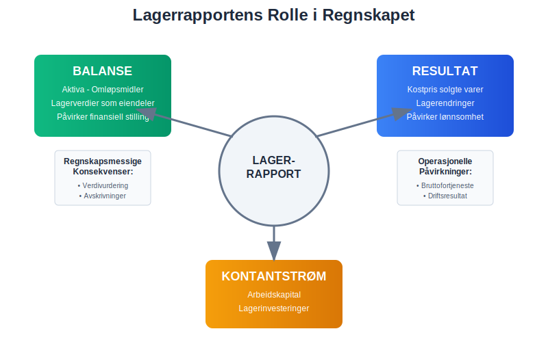
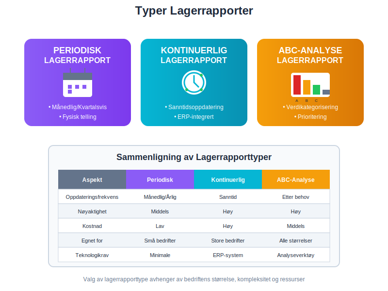
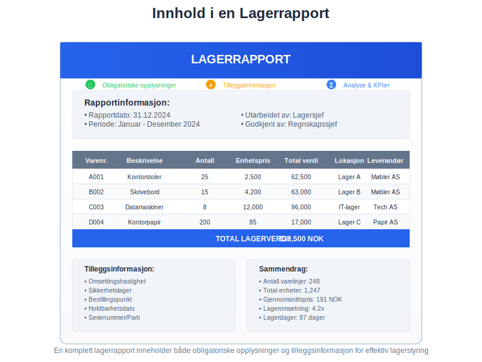
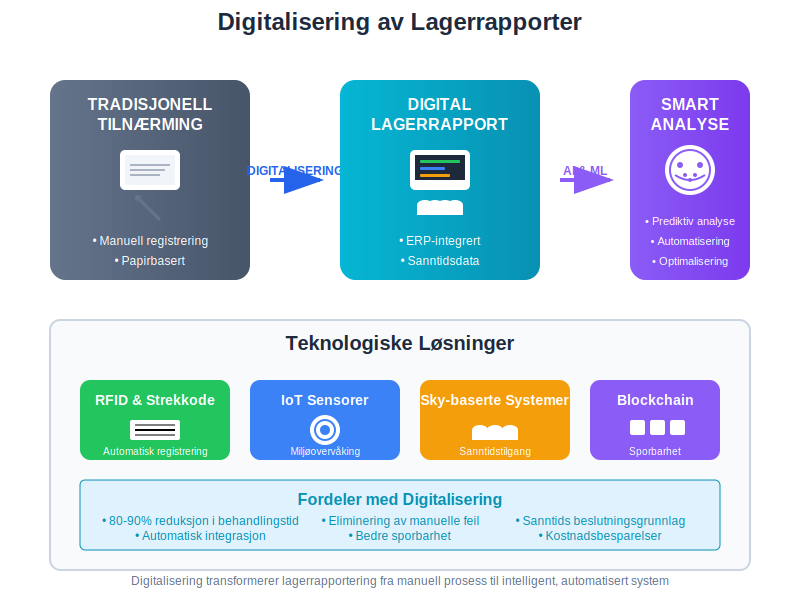
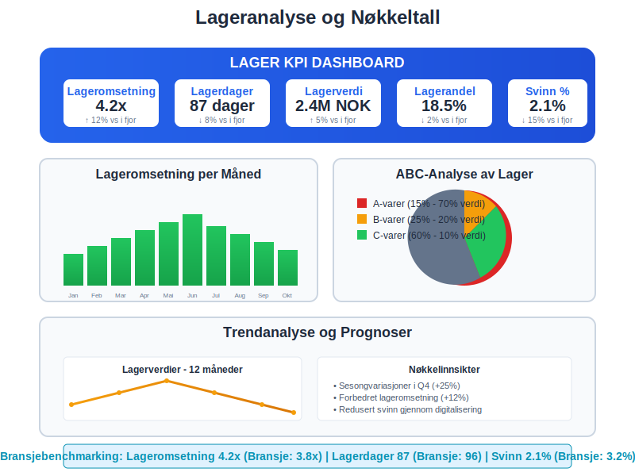

---
title: "Hva er en lagerrapport?"
seoTitle: "Lagerrapport | Typer, innhold og verdivurdering"
description: 'En lagerrapport er et systematisk dokument som gir en detaljert oversikt over bedriftens lagerbeholdning på et gitt tidspunkt. Den fungerer som et kritisk ...'
summary: "Oversikt over hva en lagerrapport er, typer rapporter, innhold, verdivurdering og hvordan digitalisering forbedrer kontroll, regnskap og styring."
---

En **lagerrapport** er et systematisk dokument som gir en detaljert oversikt over bedriftens lagerbeholdning på et gitt tidspunkt. Den fungerer som et kritisk verktøy for [lagerstyring](/blogs/regnskap/hva-er-lagerstyring "Hva er Lagerstyring? Komplett Guide til Effektiv Lagerforvaltning"), regnskapsføring og verdivurdering av [varelager](/blogs/regnskap/hva-er-varelager "Hva er Varelager? Komplett Guide til Lagerregnskapet"). Lagerrapporter er essensielle for å oppfylle [bokføringslovens](/blogs/regnskap/hva-er-bokforingsloven "Hva er Bokføringsloven? Komplett Guide til Norsk Regnskapslovgivning") krav til dokumentasjon og for å sikre nøyaktig beregning av [kostpris](/blogs/regnskap/hva-er-kostpris "Hva er Kostpris? Komplett Guide til Kostnadsberegning og Prissetting") og [bruttofortjeneste](/blogs/regnskap/hva-er-bruttofortjeneste "Hva er Bruttofortjeneste? Beregning og Analyse av Bruttoresultat").

## Seksjon 1: Lagerrapportens Rolle i Regnskapet

Lagerrapporter spiller en fundamental rolle i bedriftens [finansregnskap](/blogs/regnskap/hva-er-finansregnskap "Hva er Finansregnskap? Komplett Guide til Eksternregnskapet") og [driftsregnskap](/blogs/regnskap/hva-er-driftsregnskap "Hva er Driftsregnskap? Komplett Guide til Driftsanalyse og Resultatmåling"). De påvirker direkte beregningen av [driftskostnader](/blogs/regnskap/hva-er-driftskostnader "Hva er Driftskostnader? Komplett Guide til Kostnadstyper og Kostnadsføring") og [driftsinntekter](/blogs/regnskap/hva-er-driftsinntekter "Hva er Driftsinntekter? Komplett Guide til Inntektsføring og Salgsinntekter"), og er avgjørende for korrekt beregning av [driftsresultat](/blogs/regnskap/hva-er-driftsresultat "Hva er Driftsresultat? Analyse av Bedriftens Operative Lønnsomhet").



### Regnskapsmessige Konsekvenser

Lagerrapporter påvirker flere kritiske områder i regnskapet:

* **[Balanse](/blogs/regnskap/hva-er-balanse "Hva er Balanse? Komplett Guide til Balanseregnskap og Finansiell Stilling"):** Lagerverdien føres som [omløpsmidler](/blogs/regnskap/hva-er-omlopsimidler "Hva er Omløpsmidler? Komplett Guide til Kortsiktige Eiendeler") under [aktiva](/blogs/regnskap/hva-er-aktiva "Hva er Aktiva? Komplett Guide til Eiendeler i Balansen")
* **Resultatregnskap:** Endringer i lagerbeholdning påvirker [kostnadene](/blogs/regnskap/hva-er-kostnader "Hva er Kostnader? Komplett Guide til Kostnadstyper og Kostnadsføring") direkte
* **[Kontantstrøm](/blogs/regnskap/hva-er-kontantstrom "Hva er Kontantstrøm? Komplett Guide til Likviditetsanalyse"):** Lagerinvesteringer påvirker bedriftens [arbeidskapital](/blogs/regnskap/hva-er-arbeidskapital "Hva er Arbeidskapital? Beregning og Analyse av Driftskapital")

## Seksjon 2: Typer Lagerrapporter

Det finnes flere typer lagerrapporter som tjener ulike formål i bedriftens drift og regnskapsføring. Valg av rapporttype avhenger av bedriftens størrelse, bransje og spesifikke behov for lagerstyring.



### 2.1 Periodisk Lagerrapport

Den **periodiske lagerrapporten** utarbeides på faste tidspunkter, typisk månedlig, kvartalsvis eller årlig. Denne typen rapport krever fysisk [lagertelling](/blogs/regnskap/hva-er-lagertelling "Hva er Lagertelling? Komplett Guide til Lageropptelling og Kontroll") for å verifisere beholdningen.

| Frekvens | Formål | Egnet for |
|----------|--------|-----------|
| Årlig | Årsregnskap og revisjon | Små bedrifter med enkelt lager |
| Kvartalsvis | [Kvartalsrapportering](/blogs/regnskap/hva-er-kvartalsrapport "Hva er Kvartalsrapport? Komplett Guide til Kvartalsvis Regnskapsrapportering") | Mellomstore bedrifter |
| Månedlig | Månedlig regnskapsavslutning | Større bedrifter med aktivt lager |
| Ukentlig | Operasjonell lagerstyring | Bedrifter med høy lageromsetning |

### 2.2 Kontinuerlig Lagerrapport (Perpetual Inventory)

**Kontinuerlige lagerrapporter** oppdateres i sanntid hver gang det skjer bevegelser i lageret. Dette systemet krever integrerte [ERP-systemer](/blogs/regnskap/hva-er-erp-system "Hva er ERP-system? Komplett Guide til Bedriftssystemer og Integrasjon") som automatisk registrerer alle inn- og utgående varer. Moderne løsninger benytter ofte [strekkoder](/blogs/regnskap/hva-er-strekkode "Hva er Strekkode i Regnskap? Komplett Guide til Automatisert Registrering") for å sikre nøyaktig og effektiv dataregistrering i sanntid.

#### Fordeler med Kontinuerlig Lagerrapportering:

* **Sanntidsdata:** Alltid oppdatert lagerstatus
* **Bedre kontroll:** Umiddelbar oppdagelse av avvik
* **Effektiv planlegging:** Automatiske bestillinger ved lavt lager
* **Redusert svinn:** Raskere identifikasjon av tap og tyveri

### 2.3 ABC-Analyse Lagerrapport

**ABC-analysen** kategoriserer lagervarer basert på deres verdi og viktighet for bedriften. Denne metoden hjelper bedrifter med å prioritere ressurser og oppmerksomhet på de mest kritiske varene.

| Kategori | Andel av varer | Andel av verdi | Kontrollnivå |
|----------|----------------|----------------|--------------|
| A-varer | 10-20% | 70-80% | Høy - daglig oppfølging |
| B-varer | 20-30% | 15-25% | Middels - ukentlig oppfølging |
| C-varer | 50-70% | 5-10% | Lav - månedlig oppfølging |

## Seksjon 3: Innhold i en Lagerrapport

En komplett lagerrapport må inneholde spesifikk informasjon for å være nyttig for både regnskapsføring og operasjonell lagerstyring. Innholdet må være strukturert og lett å forstå for ulike interessenter.



### Obligatoriske Opplysninger

Hver lagerrapport bør inneholde følgende grunnleggende informasjon:

* **Rapportdato og -periode:** Når rapporten er utarbeidet og hvilken periode den dekker
* **Varenummer og beskrivelse:** Unik identifikasjon av hver vare
* **Antall på lager:** Fysisk beholdning per vare
* **Enhetspris:** [Anskaffelseskost](/blogs/regnskap/hva-er-anskaffelseskost "Hva er Anskaffelseskost? Komplett Guide til Kostnadsberegning ved Anskaffelse") eller gjeldende markedsverdi
* **Total verdi:** Antall multiplisert med enhetspris
* **Lokasjon:** Hvor varene er lagret - se [lagerlokasjonsstyring](/blogs/regnskap/hva-er-lagerlokasjon "Hva er Lagerlokasjon? Komplett Guide til Lagerplassering og Lagerstyring") for effektiv sporing
* **Leverandørinformasjon:** Hvem som har levert varene

### Tilleggsinformasjon for Avansert Lagerstyring

For bedrifter med komplekse lagerbehov kan rapporten også inneholde:

* **Omsettingshastighet:** Hvor raskt varer selges
* **Sikkerhetslager:** Minimum beholdning som må opprettholdes
* **Bestillingspunkt:** Når nye varer må bestilles
* **Holdbarhetsdato:** For bedervelige varer
* **Serienummer/partinummer:** For sporbarhet

## Seksjon 4: Verdivurdering i Lagerrapporter

**Verdivurdering** av lageret er en kritisk komponent som påvirker bedriftens [formue](/blogs/regnskap/hva-er-formue "Hva er Formue? Komplett Guide til Formuesberegning og Nettoformue") og resultat. Det finnes flere metoder for å verdsette lagerbeholdningen, og valg av metode kan ha betydelige regnskapsmessige konsekvenser.

### Vanlige Verdivurderingsmetoder

#### FIFO (First In, First Out)
**FIFO-metoden** antar at de eldste varene selges først. Dette er den mest brukte metoden i Norge og gir ofte det mest realistiske bildet av lagerverdien.

#### LIFO (Last In, First Out)
**LIFO-metoden** antar at de nyeste varene selges først. Denne metoden er ikke tillatt etter norsk regnskapslovgivning.

#### Vektet gjennomsnitt
**Gjennomsnittsmetoden** beregner en gjennomsnittlig kostpris for alle varer av samme type.

| Metode | Fordeler | Ulemper | Tillatt i Norge |
|--------|----------|---------|-----------------|
| FIFO | Realistisk lagerverdi | Kan gi høyere skatt i inflasjonstider | Ja |
| LIFO | Lavere skatt i inflasjonstider | Urealistisk lagerverdi | Nei |
| Vektet gjennomsnitt | Jevner ut prissvingninger | Mindre presist | Ja |

### Nedskrivning av Lager

Når lagerverdien faller under [anskaffelseskost](/blogs/regnskap/hva-er-anskaffelseskost "Hva er Anskaffelseskost? Komplett Guide til Kostnadsberegning ved Anskaffelse"), må lageret **nedskrives** til virkelig verdi. Dette påvirker både balanse og resultatregnskap.

#### Årsaker til Nedskrivning:

* **Markedsprisfall:** Salgsprisen har falt under kostpris
* **Foreldelse:** Varer som ikke lenger kan selges
* **Skade:** Fysisk skade på lagervarer
* **Sesongvarer:** Varer som har gått ut av sesong

## Seksjon 5: Digitalisering og Automatisering

Moderne lagerrapportering har blitt betydelig mer effektiv gjennom digitalisering og automatisering. Integrasjon med [ERP-systemer](/blogs/regnskap/hva-er-erp-system "Hva er ERP-system? Komplett Guide til Bedriftssystemer og Integrasjon") og bruk av avanserte teknologier har revolusjonert hvordan bedrifter håndterer lagerstyring.



### Teknologiske Løsninger

#### Strekkodescanning og RFID
**Strekkodeteknologi** og **RFID-chips** muliggjør automatisk registrering av lagerbevegelser, noe som reduserer manuelle feil og øker nøyaktigheten i lagerrapportene.

#### Kunstig Intelligens og Maskinlæring
**AI-baserte systemer** kan forutsi lagerbehov, optimalisere bestillinger og identifisere mønstre i lagerdata som mennesker kan overse.

#### Skybaserte Lagerløsninger
**Cloud-baserte systemer** gir sanntidstilgang til lagerdata fra hvor som helst, noe som er spesielt nyttig for bedrifter med flere lokasjoner.

### Integrasjon med Regnskapssystemer

Moderne lagerrapporter integreres sømløst med regnskapssystemer, noe som sikrer:

* **Automatisk [bilagsføring](/blogs/regnskap/hva-er-bilagsforing "Hva er Bilagsføring? Komplett Guide til Regnskapsbilag og Dokumentasjon"):** Lagerbevegelser registreres automatisk som [bilag](/blogs/regnskap/hva-er-bilag "Hva er Bilag? Komplett Guide til Regnskapsbilag og Dokumentasjon")
* **Sanntids [bokføring](/blogs/regnskap/hva-er-bokforing "Hva er Bokføring? Komplett Guide til Regnskapsføring og Bokføringsregler"):** Endringer i lager reflekteres umiddelbart i regnskapet
* **Automatisk [avstemming](/blogs/regnskap/hva-er-avstemming "Hva er Avstemming? Komplett Guide til Regnskapsavstemming og Kontroll"):** Lagerverdi avstemmes automatisk mot regnskapsdata

## Seksjon 6: Juridiske Krav og Compliance

Lagerrapporter må oppfylle spesifikke juridiske krav i henhold til norsk regnskapslovgivning. [Bokføringsloven](/blogs/regnskap/hva-er-bokforingsloven "Hva er Bokføringsloven? Komplett Guide til Norsk Regnskapslovgivning") og [bokføringsforskriften](/blogs/regnskap/hva-er-bokforingsforskriften "Hva er Bokføringsforskriften? Detaljerte Regler for Regnskapsføring") setter klare standarder for hvordan lagerbeholdning skal dokumenteres og rapporteres.

### Dokumentasjonskrav

#### Oppbevaringsplikt
Lagerrapporter må oppbevares i **minimum 5 år** etter regnskapsårets slutt, i henhold til bokføringslovens bestemmelser.

#### Sporbarhet
Alle lagerbevegelser må kunne **spores tilbake** til originale [bilag](/blogs/regnskap/hva-er-bilag "Hva er Bilag? Komplett Guide til Regnskapsbilag og Dokumentasjon") og transaksjoner.

#### Revisjonssti
Det må finnes en klar **revisjonssti** som viser hvordan lagerverdier er beregnet og dokumentert.

### Krav til Lagertelling

**Fysisk lagertelling** må gjennomføres minimum én gang årlig for å verifisere rapporterte lagerverdier. Denne tellingen må:

* Utføres av **uavhengige personer** (ikke de som har daglig ansvar for lageret)
* **Dokumenteres grundig** med telleskjemaer og signaturer
* **Avstemmes** mot systemrapporter
* **Forklare avvik** mellom fysisk telling og systemdata

## Seksjon 7: Analyse og Nøkkeltall

Lagerrapporter danner grunnlaget for viktige **lageranalyser** og **nøkkeltall** som hjelper ledelsen med å ta informerte beslutninger om lagerstyring og [arbeidskapital](/blogs/regnskap/hva-er-arbeidskapital "Hva er Arbeidskapital? Beregning og Analyse av Driftskapital").



### Kritiske Lager-KPIer

#### Lageromsetning (Inventory Turnover)
**Lageromsetningen** måler hvor mange ganger lageret "snur" i løpet av et år:

```
Lageromsetning = Kostpris for solgte varer / Gjennomsnittlig lagerverdi
```

#### Lagerdager (Days in Inventory)
**Lagerdager** viser hvor mange dager det tar å selge gjennomsnittlig lagerbeholdning:

```
Lagerdager = 365 / Lageromsetning
```

#### Lagerandel av Omsetning
**Lagerandelen** viser hvor stor del av omsetningen som er bundet opp i lager:

```
Lagerandel = Lagerverdi / Årlig omsetning × 100%
```

### Benchmarking og Bransjestandarder

| Bransje | Typisk lageromsetning | Typiske lagerdager |
|---------|----------------------|-------------------|
| Dagligvarer | 12-20 ganger | 18-30 dager |
| Klær og tekstiler | 4-6 ganger | 60-90 dager |
| Elektronikk | 6-12 ganger | 30-60 dager |
| Biler og deler | 3-5 ganger | 75-120 dager |
| Møbler | 2-4 ganger | 90-180 dager |

## Seksjon 8: Utfordringer og Beste Praksis

Effektiv lagerrapportering krever systematisk tilnærming og kontinuerlig forbedring. Bedrifter møter ofte utfordringer knyttet til nøyaktighet, timing og ressursbruk.

### Vanlige Utfordringer

#### Datakvalitet
**Unøyaktige data** er den største utfordringen for lagerrapportering. Dette kan skyldes:

* Manuelle registreringsfeil
* Manglende oppdatering av systemer
* Inkonsistente prosedyrer
* Utilstrekkelig opplæring av personale

#### Timing og Frekvens
**Balansering** mellom rapporteringsfrekvens og ressursbruk er kritisk. For hyppige rapporter kan være kostbare, mens for sjeldne rapporter kan gi utdatert informasjon.

#### Systemintegrasjon
**Mangel på integrasjon** mellom ulike systemer kan føre til datasiloer og inkonsistente rapporter.

### Beste Praksis for Lagerrapportering

#### 1. Standardiserte Prosedyrer
Utvikle **klare prosedyrer** for:
* Registrering av lagerbevegelser
* Gjennomføring av lagertelling
* Håndtering av avvik
* Rapportgenerering og -distribusjon

#### 2. Regelmessig Opplæring
Sørg for **kontinuerlig opplæring** av personale i:
* Systembruk og prosedyrer
* Viktigheten av nøyaktig registrering
* Nye teknologier og metoder

#### 3. Automatisering der Mulig
**Automatiser** rutineoppgaver som:
* Datainnsamling og -registrering
* Rapportgenerering
* Avviksidentifikasjon
* Bestillingsforslag

#### 4. Regelmessig Gjennomgang og Forbedring
Gjennomfør **periodiske evalueringer** av:
* Rapportkvalitet og nøyaktighet
* Prosesseffektivitet
* Teknologiske muligheter
* Brukertilfredssthet

## Seksjon 9: Fremtiden for Lagerrapportering

Lagerrapportering utvikler seg raskt med nye teknologier og endrede forretningsbehov. **Digitalisering**, **automatisering** og **kunstig intelligens** vil fortsette å forme hvordan bedrifter håndterer lagerstyring og -rapportering.

### Emerging Technologies

#### Internet of Things (IoT)
**IoT-sensorer** kan automatisk overvåke lagerforhold som temperatur, fuktighet og bevegelse, og gi sanntidsdata om lagerstatus.

#### Blockchain for Sporbarhet
**Blockchain-teknologi** kan gi uforanderlig sporbarhet av varer gjennom hele forsyningskjeden.

#### Prediktiv Analyse
**Maskinlæring** kan forutsi lagerbehov basert på historiske data, sesongvariasjoner og markedstrender.

### Bærekraft og ESG-rapportering

Moderne lagerrapporter inkluderer stadig oftere **bærekraftsmålinger** som:
* Karbonfotavtrykk av lagerbeholdning
* Avfallsreduksjon og resirkulering
* Etisk innkjøp og leverandørstyring

Dette er spesielt relevant i sammenheng med [ESG-rapportering](/blogs/regnskap/hva-er-esg "Hva er ESG? Komplett Guide til Miljø, Sosial og Styring i Bedrifter") og [CSRD-direktivet](/blogs/regnskap/hva-er-csrd "Hva er CSRD? Komplett Guide til Corporate Sustainability Reporting Directive").

Lagerrapporter vil fortsette å være et fundamentalt verktøy for bedriftsstyring, men deres form og innhold vil utvikle seg for å møte nye krav til transparens, bærekraft og digital effektivitet. Bedrifter som investerer i moderne lagerrapporteringssystemer vil ha betydelige konkurransefortrinn gjennom bedre beslutningsgrunnlag og mer effektiv ressursbruk.


