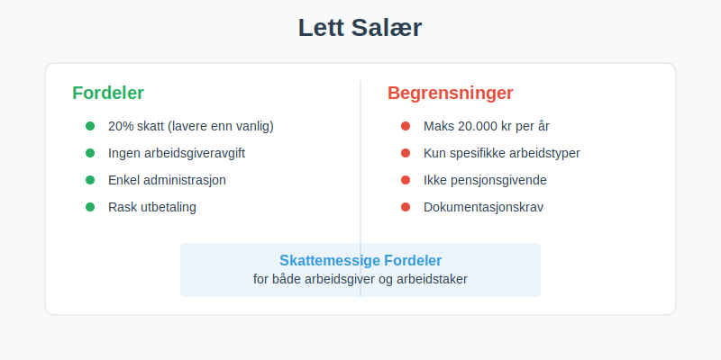
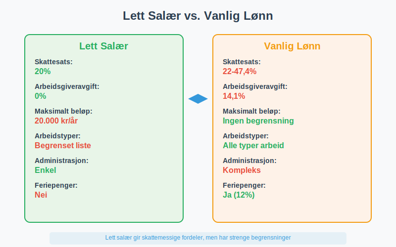
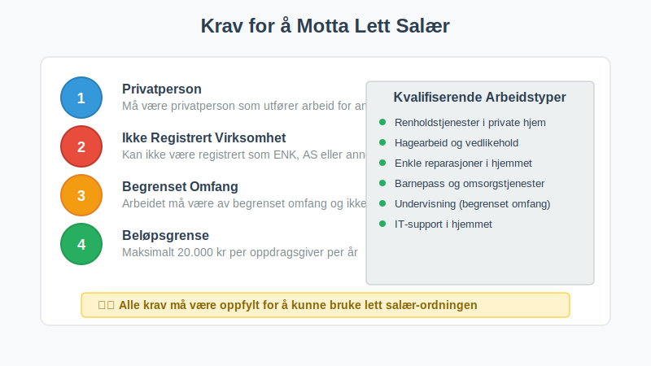
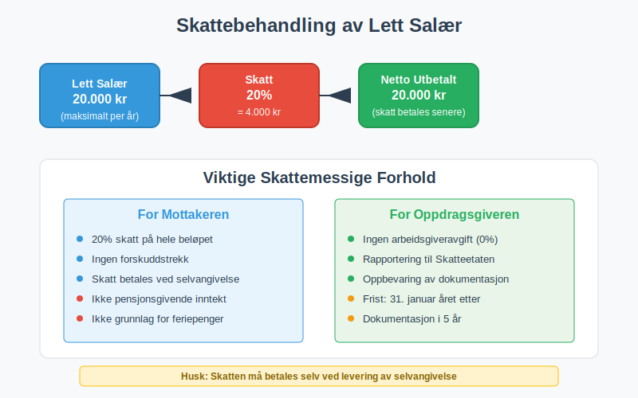
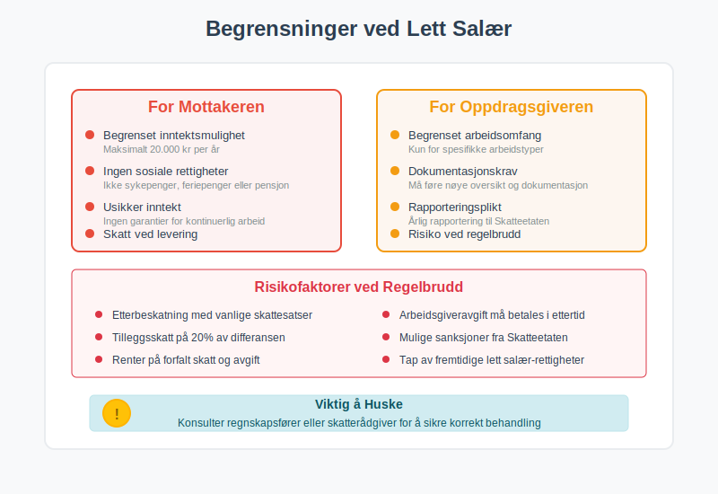
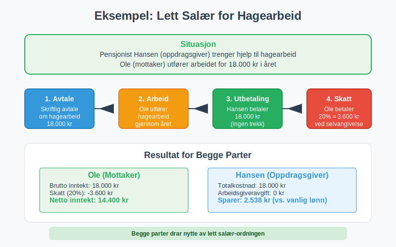
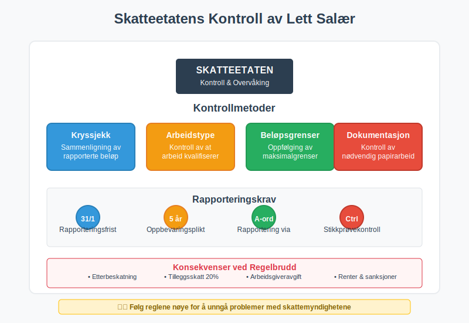

---
title: "Hva er Lett Salær i Regnskap?"
seoTitle: "Lett salær | Regler, grenser og rapportering"
description: 'Lett salær er en lønnsordning med redusert skattebelastning for visse typer arbeid, med klare beløpsgrenser, rapporteringskrav og regler som påvirker skatt, arbeidsgiveravgift og regnskapsføring.'
summary: "Hva lett salær er, hvem som kan bruke ordningen, grenser og rapportering, og hvordan det påvirker skatt, arbeidsgiveravgift og regnskap."
---

**Lett salær** er en spesiell lønnsordning i Norge som gir **skattemessige fordeler** for både arbeidsgiver og arbeidstaker. Ordningen innebærer at visse typer arbeid og tjenester kan lønnes med redusert skatt og avgifter, men har strenge regler og begrensninger som må følges nøye. Lett salær skiller seg fra vanlig [fastlønn](/blogs/regnskap/hva-er-fastlonn "Hva er Fastlønn i Regnskap?") ved at det har **lavere skattebelastning** og **enklere administrasjon**.



## Hva Kjennetegner Lett Salær?

Lett salær har flere spesielle karakteristikker som skiller det fra vanlig lønn:

* **Redusert skattebelastning** - lavere skattesats enn vanlig lønn
* **Begrenset beløp** - maksimalt 20.000 kr per person per år (2024)
* **Spesifikke arbeidstyper** - kun for visse typer arbeid og tjenester
* **Enkel administrasjon** - mindre byråkrati enn vanlig ansettelse
* **Ingen [arbeidsgiveravgift](/blogs/regnskap/hva-er-arbeidsgiveravgift "Hva er Arbeidsgiveravgift? Komplett Guide til Beregning og Satser")** for arbeidsgiver

### Lett Salær vs. Vanlig Lønn

Forskjellene mellom lett salær og vanlig lønn er betydelige:



| Aspekt | Lett Salær | Vanlig Lønn |
|--------|------------|-------------|
| **Skattesats** | 20% (2024) | Progressiv skatt (22-47,4%) |
| **Arbeidsgiveravgift** | 0% | 14,1% (varierer etter sone) |
| **Maksimalt beløp** | 20.000 kr/år | Ingen begrensning |
| **Arbeidstyper** | Begrenset liste | Alle typer arbeid |
| **Administrasjon** | Enkel | Kompleks med [ansattreskontro](/blogs/regnskap/hva-er-ansattreskontro "Hva er Ansattreskontro? En Guide til Ansattkontoer i Regnskap") |

## Hvem Kan Bruke Lett Salær?

### Arbeidstyper som Kvalifiserer

Lett salær kan kun brukes for spesifikke arbeidstyper:

* **[Renholdstjenester](/blogs/kontoplan/6360-renhold "Konto 6360 - Renhold")** i private hjem
* **Hagearbeid** og vedlikehold av utendørsområder
* **Enkle reparasjoner** og vedlikehold i hjemmet
* **Barnepass** og omsorgstjenester
* **Undervisning** og veiledning (begrenset omfang)
* **IT-support** og teknisk hjelp i hjemmet

### Hvem Kan Motta Lett Salær?

For å kunne motta lett salær må personen oppfylle visse krav:



* **Privatpersoner** som utfører arbeid for andre privatpersoner
* **Ikke være registrert** som [enkeltpersonforetak](/blogs/regnskap/hva-er-enkeltpersonforetak "Hva er Enkeltpersonforetak? Komplett Guide til ENK") eller selskap
* **Arbeidet må være av begrenset omfang** og ikke utgjøre hovedinntekt
* **Maksimalt 20.000 kr** per oppdragsgiver per år

## Regler og Begrensninger

### Beløpsgrenser

Lett salær har strenge beløpsgrenser som må overholdes:

| Begrensning | Beløp (2024) | Konsekvens ved overskridelse |
|-------------|--------------|------------------------------|
| **Per person per år** | 20.000 kr | Overskytende beløp beskattes som vanlig lønn |
| **Per oppdrag** | Ingen spesifikk grense | Må holdes innenfor årsgrensen |
| **Samlet for alle oppdragsgivere** | 20.000 kr | Total grense uavhengig av antall oppdragsgivere |

### Dokumentasjonskrav

For å bruke lett salær må følgende dokumenteres:

* **Skriftlig avtale** mellom partene
* **Beskrivelse av arbeidet** som skal utføres
* **Tidsperiode** for arbeidet
* **Beløp** som skal utbetales
* **Bekreftelse** på at arbeidet er utført

## Skattemessig Behandling

### For Mottakeren

Personen som mottar lett salær har følgende skattemessige forhold:



* **20% skatt** på hele beløpet (2024)
* **Ingen [forskuddstrekk](/blogs/regnskap/hva-er-forskuddstrekk "Hva er Forskuddstrekk? Komplett Guide til Trekk i Lønn")** - skatten betales ved levering av selvangivelse
* **Ikke grunnlag** for [feriepenger](/blogs/regnskap/hva-er-feriepenger "Hva er Feriepenger? Beregning, Opptjening og Utbetaling")
* **Ikke pensjonsgivende** inntekt
* **Rapporteres** i selvangivelsen som "Lett salær"

### For Oppdragsgiveren

Oppdragsgiveren (den som betaler) har følgende forpliktelser:

* **Ingen arbeidsgiveravgift** å betale
* **Rapportering** til Skatteetaten innen 31. januar
* **Oppbevaring** av dokumentasjon i 5 år
* **Utstedelse** av dokumentasjon til mottaker

## Regnskapsmessig Behandling

### For Bedrifter som Betaler Lett Salær

Når en bedrift betaler lett salær, behandles det som en [driftskostnad](/blogs/regnskap/hva-er-driftskostnader "Hva er Driftskostnader? Komplett Guide til Kostnadstyper og Regnskapsføring"):

```
Debet: Tjenestekjøp/Konsulenthonorar    20.000 kr
    Kredit: Bank/Kasse                         20.000 kr
```

### Rapportering og Oppfølging

Bedriften må:

* **Registrere** alle utbetalinger av lett salær
* **Rapportere** til Skatteetaten årlig
* **Oppbevare** all dokumentasjon
* **Følge opp** at beløpsgrensene overholdes

## Fordeler og Ulemper

### Fordeler for Mottakeren

| Fordel | Beskrivelse |
|--------|-------------|
| **Lavere skatt** | 20% vs. progressiv skatt som kan være mye høyere |
| **Enkel administrasjon** | Ingen komplisert lønnsadministrasjon |
| **Fleksibilitet** | Kan kombineres med annet arbeid |
| **Rask utbetaling** | Ingen trekk eller forsinkelser |

### Fordeler for Oppdragsgiveren

* **Ingen arbeidsgiveravgift** - sparer 14,1% i avgifter
* **Enkel administrasjon** - ingen [ansattreskontro](/blogs/regnskap/hva-er-ansattreskontro "Hva er Ansattreskontro? En Guide til Ansattkontoer i Regnskap") eller lønnskjøring
* **Fleksibilitet** - enkelt å engasjere hjelp ved behov
* **Kostnadseffektivt** - lavere totalkostnad enn vanlig ansettelse

### Ulemper og Begrensninger



**For mottakeren:**
* **Begrenset inntektsmulighet** - maksimalt 20.000 kr per år
* **Ingen sosiale rettigheter** - ikke sykepenger, feriepenger eller pensjon
* **Usikker inntekt** - ingen garantier for kontinuerlig arbeid
* **Skatt ved levering** - må betale skatten selv ved selvangivelse

**For oppdragsgiveren:**
* **Begrenset arbeidsomfang** - kun for spesifikke arbeidstyper
* **Dokumentasjonskrav** - må føre nøye oversikt
* **Rapporteringsplikt** - årlig rapportering til Skatteetaten

## Praktiske Eksempler

### Eksempel 1: Renhold i Privat Hjem

**Situasjon:** Familie Olsen trenger hjelp til renhold og engasjerer Kari for 15.000 kr i året.

**Behandling:**
* Kari betaler 20% skatt = 3.000 kr
* Familie Olsen betaler ingen arbeidsgiveravgift
* Kari får utbetalt 15.000 kr, men må betale 3.000 kr i skatt ved selvangivelse
* **Netto for Kari:** 12.000 kr

### Eksempel 2: Hagearbeid

**Situasjon:** Pensjonist Hansen trenger hjelp til hagearbeid og betaler Ole 18.000 kr i året.



**Behandling:**
* Ole betaler 20% skatt = 3.600 kr
* Hansen rapporterer utbetalingen til Skatteetaten
* Ole må oppgi inntekten i selvangivelsen
* **Netto for Ole:** 14.400 kr

## Alternativer til Lett Salær

### Når Lett Salær Ikke Passer

Hvis lett salær ikke er aktuelt, finnes andre alternativer:

| Alternativ | Når det Passer | Skattemessig Behandling |
|------------|----------------|------------------------|
| **[Honorar](/blogs/regnskap/hva-er-honorar "Hva er Honorar i Regnskap? Komplett Guide til Honorarutbetalinger og Skattebehandling")** | Faglig arbeid, foredrag | Vanlig skatt + evt. arbeidsgiveravgift |
| **Vanlig ansettelse** | Kontinuerlig arbeid | Full skatt og avgifter |
| **Frilansing** | Selvstendig virksomhet | Næringsinntekt med fradragsmuligheter |
| **[Aksjeselskap](/blogs/regnskap/hva-er-et-aksjeselskap "Hva er et Aksjeselskap? Komplett Guide til AS")** | Større virksomhet | Selskapsskatt + utbytteskatt |

## Endringer og Oppdateringer

### Historiske Endringer

Lett salær-ordningen har gjennomgått flere endringer:

* **2012:** Ordningen ble innført med 15.000 kr grense
* **2018:** Grensen økt til 20.000 kr
* **2020:** Skattesatsen justert til 20%
* **2024:** Gjeldende regler med 20.000 kr grense og 20% skatt

### Fremtidige Endringer

Regjeringen vurderer jevnlig endringer i ordningen:

* **Beløpsgrenser** kan justeres for inflasjon
* **Arbeidstyper** kan utvides eller begrenses
* **Skattesatser** kan endres basert på skattepolitikk

## Kontroll og Sanksjoner

### Skatteetatens Kontroll

Skatteetaten fører kontroll med lett salær-ordningen:



* **Kryssjekk** av rapporterte beløp
* **Kontroll** av at arbeidstyper kvalifiserer
* **Oppfølging** av beløpsgrenser
* **Sanksjoner** ved regelbrudd

### Konsekvenser ved Regelbrudd

Ved brudd på reglene kan følgende skje:

* **Etterbeskatning** med vanlige skattesatser
* **Tilleggsskatt** på 20% av differansen
* **Arbeidsgiveravgift** må betales i ettertid
* **Renter** på forfalt skatt og avgift

## Konklusjon

Lett salær er en **nyttig ordning** for både oppdragsgivere og mottakere når den brukes riktig. Ordningen gir **skattemessige fordeler** og **enklere administrasjon**, men krever **nøye oppfølging** av regler og begrensninger.

**Viktige punkter å huske:**
* Maksimalt 20.000 kr per person per år
* 20% skatt for mottaker, ingen arbeidsgiveravgift for oppdragsgiver
* Kun for spesifikke arbeidstyper
* Krav til dokumentasjon og rapportering
* Ikke pensjonsgivende eller grunnlag for sosiale ytelser

For bedrifter som vurderer lett salær, er det viktig å **konsultere regnskapsfører** eller **skatterådgiver** for å sikre korrekt behandling og unngå problemer med skattemyndighetene.


