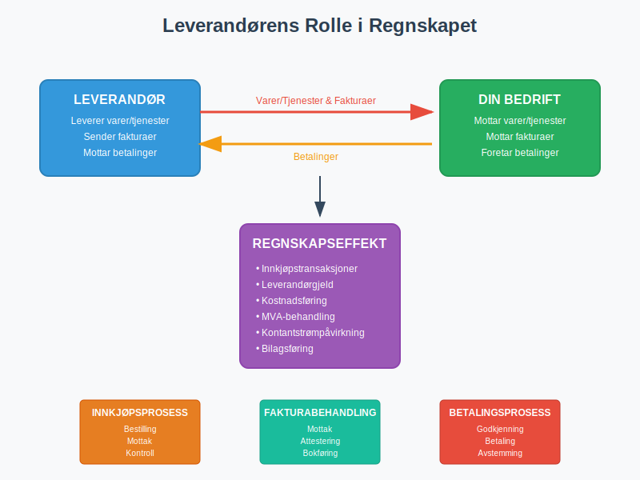
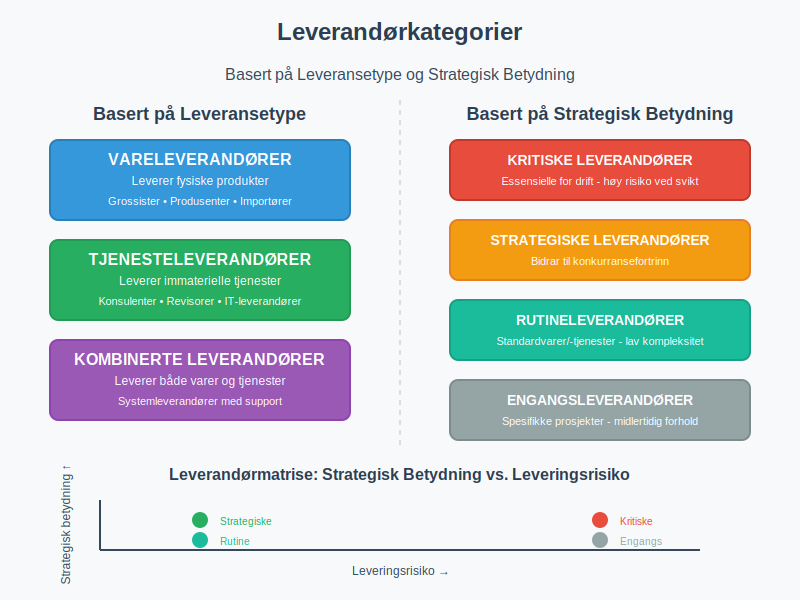
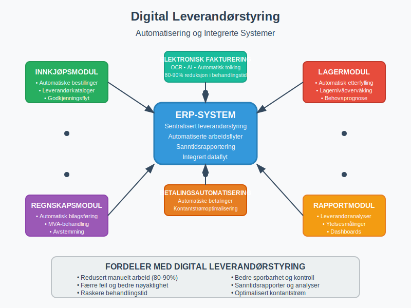

---
title: "hva-er-leverandor"
seoTitle: "hva-er-leverandor"
meta_description: 'En **leverandør** er en person eller bedrift som leverer varer eller tjenester til din bedrift mot betaling. I regnskapssammenheng representerer leverandører ...'
slug: hva-er-leverandor
type: blog
layout: pages/single
---

En **leverandør** er en person eller bedrift som leverer varer eller tjenester til din bedrift mot betaling. I regnskapssammenheng representerer leverandører en kritisk del av bedriftens [kreditor](/blogs/regnskap/hva-er-kreditor "Hva er Kreditor? Komplett Guide til Leverandørgjeld og Kreditorstyring")-portefølje og påvirker direkte [kontantstrømmen](/blogs/regnskap/hva-er-kontantstrom "Hva er Kontantstrøm? Komplett Guide til Kontantstrømanalyse") gjennom leverandørgjeld og betalingsforpliktelser. Effektiv leverandørstyring er fundamentalt for å opprettholde god [betalingsevne](/blogs/regnskap/hva-er-betalingsevne "Hva er Betalingsevne? Analyse av Likviditet og Finansiell Stabilitet") og optimalisere bedriftens arbeidskapital.

## Seksjon 1: Leverandørens Rolle i Regnskapet

Leverandører spiller en sentral rolle i bedriftens økonomiske økosystem og påvirker flere aspekter av regnskapsføringen. Når din bedrift mottar varer eller tjenester fra en leverandør, oppstår det en **leverandørgjeld** som må registreres korrekt i regnskapet.

### Regnskapsmessig Behandling

Leverandørforhold genererer flere typer transaksjoner som må håndteres systematisk:

* **Innkjøpstransaksjoner:** Registrering av mottatte varer/tjenester
* **Leverandørgjeld:** Forpliktelser som oppstår ved kredittinnkjøp
* **Betalinger:** Utligning av leverandørgjeld
* **Kreditnotaer:** Korrigeringer og returvarer

Korrekt behandling av [inngående fakturaer](/blogs/regnskap/innganende-faktura "Inngående Faktura - Komplett Guide til Mottak og Behandling av Leverandørfakturaer") fra leverandører er essensielt for nøyaktig regnskapsføring og god internkontroll.

## Seksjon 2: Typer Leverandører

Leverandører kan kategoriseres på flere måter avhengig av deres rolle og betydning for bedriften. Denne kategoriseringen hjelper med å prioritere leverandøroppfølging og risikostyring.

### 2.1 Basert på Leveransetype

| Leverandørtype | Beskrivelse | Eksempler |
|---|---|---|
| **Vareleverandører** | Leverer fysiske produkter | Grossister, produsenter, importører |
| **Tjenesteleverandører** | Leverer immaterielle tjenester | Konsulenter, revisorer, IT-leverandører |
| **Kombinerte leverandører** | Leverer både varer og tjenester | Systemleverandører med support |

### 2.2 Basert på Strategisk Betydning

* **Kritiske leverandører:** Leverandører som er essensielle for drift
* **Strategiske leverandører:** Leverandører som bidrar til konkurransefortrinn
* **Rutineleverandører:** Leverandører av standardvarer/-tjenester
* **Engangsleverandører:** Leverandører for spesifikke prosjekter

Strategisk viktige leverandører krever ofte spesiell oppfølging gjennom [anskaffelsesprosesser](/blogs/regnskap/hva-er-anskaffelser "Hva er Anskaffelser? En Komplett Guide til Offentlige og Private Innkjøp") og formelle avtaler.

## Seksjon 3: Leverandørstyring og Oppfølging

Effektiv leverandørstyring innebærer systematisk oppfølging av leverandørforhold for å sikre optimal ytelse, kostnadseffektivitet og risikominimering.

### Leverandørevaluering og Kvalifisering

Før en leverandør tas i bruk, bør følgende evalueringskriterier vurderes:

* **Finansiell stabilitet:** Leverandørens økonomiske soliditet
* **Leveringskapasitet:** Evne til å møte volum- og tidskrav
* **Kvalitetsstandarder:** Samsvar med bedriftens kvalitetskrav
* **Compliance:** Overholdelse av lover og regelverk
* **Bærekraft:** Miljømessige og sosiale standarder

### Leverandøroppfølging

Kontinuerlig oppfølging av leverandører inkluderer:

1. **Ytelsesmåling:** Regelmessig evaluering av leverandørens prestasjon
2. **Kontraktsoppfølging:** Sikre at avtalevilkår overholdes
3. **Risikostyring:** Identifisere og håndtere leverandørrisiko
4. **Relasjonsutvikling:** Bygge langsiktige partnerskap

## Seksjon 4: Leverandørgjeld og Betalingshåndtering

Leverandørgjeld representerer bedriftens kortsiktige forpliktelser til leverandører og er en viktig komponent i [kortsiktig gjeld](/blogs/regnskap/kortsiktig-gjeld "Kortsiktig Gjeld - Komplett Guide til Kortsiktige Forpliktelser i Regnskap").

For systematisk oppfølging og håndtering av alle transaksjoner med leverandører, se vår guide til **[leverandørreskontro](/blogs/regnskap/hva-er-leverandorreskontro "Hva er Leverandørreskontro? Komplett Guide til Leverandørledger og Kreditoroppfølging")** som forklarer hvordan du kan bruke underreskontro-systemet for effektiv kreditorhåndtering.

### Betalingsbetingelser

Vanlige betalingsbetingelser fra leverandører inkluderer:

| Betalingsbetingelse | Beskrivelse | Fordeler for kjøper |
|---|---|---|
| **Netto 30 dager** | Betaling innen 30 dager | Standard kredittid |
| **2/10 netto 30** | 2% rabatt ved betaling innen 10 dager | Kontantrabatt |
| **Forskuddsbetaling** | Betaling før levering | Ofte bedre priser |
| **Kontant ved levering** | Betaling ved mottak | Ingen kredittrisiko |

[Forskuddsbetaling](/blogs/regnskap/hva-er-forskuddsbetaling "Hva er forskuddsbetaling? Komplett Guide til Forskuddsbetalinger i Regnskap") kan være aktuelt for store bestillinger eller nye leverandørforhold.

### Optimalisering av Betalinger

For å optimalisere kontantstrøm kan bedrifter:

* **Utnytte kredittperioder:** Betale på siste frist for å maksimere likviditet
* **Forhandle betalingsbetingelser:** Oppnå lengre kredittid
* **Utnytte kontantrabatter:** Betale tidlig for å oppnå rabatter
* **Implementere [avtalegiro](/blogs/regnskap/hva-er-avtalegiro "Hva er AvtaleGiro? Komplett Guide til Automatisk Betaling"):** Automatisere rutinebetalinger

## Seksjon 5: Leverandørregistrering og Dokumentasjon

Korrekt registrering og dokumentasjon av leverandørforhold er kritisk for god internkontroll og regnskapsføring.

### Leverandørregister

Et komplett leverandørregister bør inneholde:

* **Grunnleggende informasjon:**
  - Leverandørnavn og organisasjonsnummer
  - Kontaktinformasjon og adresse
  - [Bankkonto og IBAN-nummer](/blogs/regnskap/hva-er-iban-nummer "Hva er IBAN-nummer? Komplett Guide til Internasjonale Bankkontonummer")
  - MVA-registreringsstatus

* **Kommersielle vilkår:**
  - Betalingsbetingelser og kredittgrenser
  - Prislister og rabattavtaler
  - Leveringsbetingelser og frister

* **Juridiske aspekter:**
  - Kontraktuelle avtaler
  - Forsikringsdekning
  - Compliance-dokumentasjon

### Dokumentasjonskrav

For hver leverandør må følgende dokumenteres:

1. **Leverandøravtaler:** Formelle kontrakter og rammeavtaler
2. **Kvalifikasjonsdokumenter:** Sertifiseringer og referanser
3. **Forsikringsdokumenter:** Ansvarsforsikring og produktforsikring
4. **Compliance-dokumenter:** Skatteregistrering og lovlighetserklæringer

## Seksjon 6: Leverandørrisiko og Internkontroll

Leverandørforhold innebærer ulike risikoer som må identifiseres og håndteres systematisk.

### Typer Leverandørrisiko

* **Operasjonell risiko:** Leveringssvikt eller kvalitetsproblemer
* **Finansiell risiko:** Leverandørens konkurs eller betalingsproblemer
* **Compliance-risiko:** Brudd på lover eller regelverk
* **Reputasjonsrisiko:** Leverandørens handlinger påvirker bedriftens omdømme
* **Konsentrasjonsrisiko:** Overdreven avhengighet av få leverandører

### Internkontrolltiltak

Effektive internkontrolltiltak for leverandørstyring inkluderer:

* **Segregering av oppgaver:** Skille innkjøp, mottak og betaling
* **Godkjenningsprosedyrer:** Formelle prosesser for leverandørvalg
* **[Attestering](/blogs/regnskap/hva-er-attestering "Hva er Attestering? En Komplett Guide til Bilagsbehandling og Godkjenning") av fakturaer:** Kontroll før betaling
* **Regelmessige leverandørgjennomganger:** Periodisk evaluering
* **Backup-leverandører:** Alternative leveringskilder

## Seksjon 7: Digitalisering av Leverandørstyring

Moderne teknologi har revolusjonert leverandørstyring gjennom automatisering og digitale løsninger.

### Elektronisk Fakturabehandling

[Elektronisk fakturering](/blogs/regnskap/hva-er-elektronisk-fakturering "Hva er Elektronisk Fakturering? Komplett Guide til Digitale Fakturaløsninger") og [fakturatolk-teknologi](/blogs/regnskap/hva-er-fakturatolk "Hva er Fakturatolk? Automatisk Fakturabehandling og OCR-teknologi") muliggjør:

* **Automatisk fakturabehandling:** Redusert manuelt arbeid
* **Raskere behandlingstid:** Fra dager til timer
* **Færre feil:** Eliminering av manuelle registreringsfeil
* **Bedre sporbarhet:** Digital dokumentasjon og arbeidsflyt

### Integrerte Systemer

Moderne [ERP-systemer](/blogs/regnskap/hva-er-erp-system "Hva er ERP-system? Komplett Guide til Enterprise Resource Planning") integrerer leverandørstyring med:

* **Innkjøpsmoduler:** Automatiserte bestillingsprosesser
* **Lagermoduler:** Kobling til [lagerbeholdning](/blogs/regnskap/hva-er-lagerbeholdning "Hva er Lagerbeholdning? Komplett Guide til Lagerregnskapsføring") og etterfylling
* **Regnskapsmoduler:** Automatisk [bilagsføring](/blogs/regnskap/hva-er-bilagsforing "Hva er Bilagsføring? Komplett Guide til Regnskapsbilag og Dokumentasjon")
* **Rapporteringsmoduler:** Sanntidsrapporter og analyser

## Seksjon 8: Leverandøranalyse og Rapportering

Systematisk analyse av leverandørdata gir verdifull innsikt for strategiske beslutninger.

### Nøkkeltall for Leverandøranalyse

| Nøkkeltall | Beregning | Betydning |
|---|---|---|
| **Leverandørkonsentrasjon** | Andel av totale innkjøp fra top 5 leverandører | Avhengighetsrisiko |
| **Gjennomsnittlig betalingstid** | Snitt dager fra fakturadato til betaling | Kontantstrømeffektivitet |
| **Leverandøromsetning** | Årlig innkjøpsvolum per leverandør | Forhandlingsmakt |
| **Kvalitetsindeks** | Andel feilfrie leveranser | Leverandørytelse |

### Rapportering og Oppfølging

Regelmessig rapportering bør inkludere:

* **Leverandørytelsesrapporter:** Månedlig evaluering av nøkkelleverandører
* **Innkjøpsanalyser:** Kategorivisning av innkjøp og kostnadsutvikling
* **Betalingsrapporter:** Oversikt over forfallende betalinger
* **Risikorapporter:** Identifikasjon av høyrisiko-leverandører

## Seksjon 9: Juridiske Aspekter ved Leverandørforhold

Leverandørforhold er regulert av ulike lover og regelverk som påvirker både kontraktuelle forhold og regnskapsføring.

### Relevante Lovverk

* **Kjøpsloven:** Regulerer rettigheter og plikter ved kjøp av varer
* **[Bokføringsloven](/blogs/regnskap/hva-er-bokforingsloven "Hva er Bokføringsloven? Komplett Guide til Norsk Bokføringslovgivning"):** Krav til dokumentasjon og registrering
* **Merverdiavgiftsloven:** Håndtering av [MVA](/blogs/regnskap/hva-er-avgiftsplikt-mva "Hva er Avgiftsplikt (MVA)? Komplett Guide til Merverdiavgift i Norge") på innkjøp
* **Anskaffelsesregelverket:** For offentlige virksomheter

### Kontraktuelle Forhold

Leverandørkontrakter bør regulere:

* **Leveringsbetingelser:** Tid, sted og kvalitetskrav
* **Betalingsbetingelser:** Frister og betalingsmetoder
* **Ansvar og forsikring:** Produktansvar og erstatning
* **Force majeure:** Håndtering av uforutsette hendelser
* **Oppsigelse:** Vilkår for kontraktsavslutning

## Seksjon 10: Beste Praksis for Leverandørstyring

Implementering av beste praksis sikrer effektiv og risikominimerende leverandørstyring.

### Strategiske Anbefalinger

1. **Utvikle leverandørstrategi:** Definer mål og prioriteringer
2. **Implementer kategoristyring:** Segmenter leverandører etter betydning
3. **Etabler klare prosesser:** Standardiser arbeidsflyt og prosedyrer
4. **Invester i teknologi:** Automatiser rutineoppgaver
5. **Bygg relasjoner:** Fokuser på langsiktige partnerskap

### Operasjonelle Anbefalinger

* **Regelmessig leverandørevaluering:** Kvartalsvise gjennomganger
* **Kontinuerlig forbedring:** Identifiser og implementer forbedringer
* **Risikostyring:** Proaktiv identifikasjon og håndtering av risiko
* **Kompetanseutvikling:** Sikre at personalet har nødvendig kunnskap
* **Benchmarking:** Sammenlign med bransjestandarder

Effektiv leverandørstyring krever en balansert tilnærming som kombinerer strategisk tenkning, operasjonell effektivitet og solid risikostyring. Ved å implementere systematiske prosesser og utnytte moderne teknologi kan bedrifter oppnå betydelige fordeler gjennom optimaliserte leverandørforhold.

